# text_generator_matmul

Source: [`emel/text/generator/matmul/sm.hpp`](https://github.com/stateforward/emel.cpp/blob/main/src/emel/text/generator/matmul/sm.hpp)

## Mermaid

```mermaid
stateDiagram-v2
  direction TB
  [*] --> state_ready
  state_ready --> state_ready : configure_kernel_kind [always] / effect_configure_kernel_kind_
  state_ready --> state_serial_result_decision : execute_serial [always] / effect_execute_serial_
  state_serial_result_decision --> state_ready : completion_execute_serial_ [guard_serial_accepted_] / effect_accept_serial_execution_
  state_serial_result_decision --> state_ready : completion_execute_serial_ [guard_serial_rejected_] / effect_reject_serial_execution_
  state_ready --> state_parallel_result_decision : execute_parallel [guard_parallel_ready_] / effect_execute_parallel_
  state_ready --> state_ready : execute_parallel [guard_parallel_unavailable_] / effect_reject_parallel_execution_
  state_parallel_result_decision --> state_ready : completion_execute_parallel_ [guard_parallel_submission_failed_] / effect_reject_parallel_execution_
  state_parallel_result_decision --> state_ready : completion_execute_parallel_ [guard_parallel_join_failed_] / effect_reject_parallel_execution_
  state_parallel_result_decision --> state_ready : completion_execute_parallel_ [guard_parallel_lane_rejected_0__] / effect_reject_parallel_execution_
  state_parallel_result_decision --> state_ready : completion_execute_parallel_ [guard_parallel_lane_rejected_1__] / effect_reject_parallel_execution_
  state_parallel_result_decision --> state_ready : completion_execute_parallel_ [guard_parallel_lane_rejected_2__] / effect_reject_parallel_execution_
  state_parallel_result_decision --> state_ready : completion_execute_parallel_ [guard_parallel_lane_rejected_3__] / effect_reject_parallel_execution_
  state_parallel_result_decision --> state_ready : completion_execute_parallel_ [guard_parallel_lane_rejected_4__] / effect_reject_parallel_execution_
  state_parallel_result_decision --> state_ready : completion_execute_parallel_ [guard_parallel_lane_rejected_5__] / effect_reject_parallel_execution_
  state_parallel_result_decision --> state_ready : completion_execute_parallel_ [guard_parallel_lane_rejected_6__] / effect_reject_parallel_execution_
  state_parallel_result_decision --> state_ready : completion_execute_parallel_ [guard_parallel_lane_rejected_7__] / effect_reject_parallel_execution_
  state_parallel_result_decision --> state_ready : completion_execute_parallel_ [guard_parallel_all_lanes_accepted_] / effect_accept_parallel_execution_
  state_ready --> state_ready : _ [always] / effect_on_unexpected_
  state_serial_result_decision --> state_ready : _ [always] / effect_on_unexpected_
  state_parallel_result_decision --> state_ready : _ [always] / effect_on_unexpected_
```

## Transitions

| Source | Event | Guard | Action | Target |
| --- | --- | --- | --- | --- |
| [`state_ready`](https://github.com/stateforward/emel.cpp/blob/main/src/emel/text/generator/matmul/sm.hpp) | [`configure_kernel_kind`](https://github.com/stateforward/emel.cpp/blob/main/src/emel/text/generator/matmul/sm.hpp) | [`always`](https://github.com/stateforward/emel.cpp/blob/main/src/emel/text/generator/matmul/sm.hpp) | [`effect_configure_kernel_kind>`](https://github.com/stateforward/emel.cpp/blob/main/src/emel/text/generator/matmul/sm.hpp) | [`state_ready`](https://github.com/stateforward/emel.cpp/blob/main/src/emel/text/generator/matmul/sm.hpp) |
| [`state_ready`](https://github.com/stateforward/emel.cpp/blob/main/src/emel/text/generator/matmul/sm.hpp) | [`execute_serial`](https://github.com/stateforward/emel.cpp/blob/main/src/emel/text/generator/matmul/sm.hpp) | [`always`](https://github.com/stateforward/emel.cpp/blob/main/src/emel/text/generator/matmul/sm.hpp) | [`effect_execute_serial>`](https://github.com/stateforward/emel.cpp/blob/main/src/emel/text/generator/matmul/sm.hpp) | [`state_serial_result_decision`](https://github.com/stateforward/emel.cpp/blob/main/src/emel/text/generator/matmul/sm.hpp) |
| [`state_serial_result_decision`](https://github.com/stateforward/emel.cpp/blob/main/src/emel/text/generator/matmul/sm.hpp) | [`completion<execute_serial>`](https://github.com/stateforward/emel.cpp/blob/main/src/emel/text/generator/matmul/sm.hpp) | [`guard_serial_accepted>`](https://github.com/stateforward/emel.cpp/blob/main/src/emel/text/generator/matmul/sm.hpp) | [`effect_accept_serial_execution>`](https://github.com/stateforward/emel.cpp/blob/main/src/emel/text/generator/matmul/sm.hpp) | [`state_ready`](https://github.com/stateforward/emel.cpp/blob/main/src/emel/text/generator/matmul/sm.hpp) |
| [`state_serial_result_decision`](https://github.com/stateforward/emel.cpp/blob/main/src/emel/text/generator/matmul/sm.hpp) | [`completion<execute_serial>`](https://github.com/stateforward/emel.cpp/blob/main/src/emel/text/generator/matmul/sm.hpp) | [`guard_serial_rejected>`](https://github.com/stateforward/emel.cpp/blob/main/src/emel/text/generator/matmul/sm.hpp) | [`effect_reject_serial_execution>`](https://github.com/stateforward/emel.cpp/blob/main/src/emel/text/generator/matmul/sm.hpp) | [`state_ready`](https://github.com/stateforward/emel.cpp/blob/main/src/emel/text/generator/matmul/sm.hpp) |
| [`state_ready`](https://github.com/stateforward/emel.cpp/blob/main/src/emel/text/generator/matmul/sm.hpp) | [`execute_parallel`](https://github.com/stateforward/emel.cpp/blob/main/src/emel/text/generator/matmul/sm.hpp) | [`guard_parallel_ready>`](https://github.com/stateforward/emel.cpp/blob/main/src/emel/text/generator/matmul/sm.hpp) | [`effect_execute_parallel>`](https://github.com/stateforward/emel.cpp/blob/main/src/emel/text/generator/matmul/sm.hpp) | [`state_parallel_result_decision`](https://github.com/stateforward/emel.cpp/blob/main/src/emel/text/generator/matmul/sm.hpp) |
| [`state_ready`](https://github.com/stateforward/emel.cpp/blob/main/src/emel/text/generator/matmul/sm.hpp) | [`execute_parallel`](https://github.com/stateforward/emel.cpp/blob/main/src/emel/text/generator/matmul/sm.hpp) | [`guard_parallel_unavailable>`](https://github.com/stateforward/emel.cpp/blob/main/src/emel/text/generator/matmul/sm.hpp) | [`effect_reject_parallel_execution>`](https://github.com/stateforward/emel.cpp/blob/main/src/emel/text/generator/matmul/sm.hpp) | [`state_ready`](https://github.com/stateforward/emel.cpp/blob/main/src/emel/text/generator/matmul/sm.hpp) |
| [`state_parallel_result_decision`](https://github.com/stateforward/emel.cpp/blob/main/src/emel/text/generator/matmul/sm.hpp) | [`completion<execute_parallel>`](https://github.com/stateforward/emel.cpp/blob/main/src/emel/text/generator/matmul/sm.hpp) | [`guard_parallel_submission_failed>`](https://github.com/stateforward/emel.cpp/blob/main/src/emel/text/generator/matmul/sm.hpp) | [`effect_reject_parallel_execution>`](https://github.com/stateforward/emel.cpp/blob/main/src/emel/text/generator/matmul/sm.hpp) | [`state_ready`](https://github.com/stateforward/emel.cpp/blob/main/src/emel/text/generator/matmul/sm.hpp) |
| [`state_parallel_result_decision`](https://github.com/stateforward/emel.cpp/blob/main/src/emel/text/generator/matmul/sm.hpp) | [`completion<execute_parallel>`](https://github.com/stateforward/emel.cpp/blob/main/src/emel/text/generator/matmul/sm.hpp) | [`guard_parallel_join_failed>`](https://github.com/stateforward/emel.cpp/blob/main/src/emel/text/generator/matmul/sm.hpp) | [`effect_reject_parallel_execution>`](https://github.com/stateforward/emel.cpp/blob/main/src/emel/text/generator/matmul/sm.hpp) | [`state_ready`](https://github.com/stateforward/emel.cpp/blob/main/src/emel/text/generator/matmul/sm.hpp) |
| [`state_parallel_result_decision`](https://github.com/stateforward/emel.cpp/blob/main/src/emel/text/generator/matmul/sm.hpp) | [`completion<execute_parallel>`](https://github.com/stateforward/emel.cpp/blob/main/src/emel/text/generator/matmul/sm.hpp) | [`guard_parallel_lane_rejected<0>>`](https://github.com/stateforward/emel.cpp/blob/main/src/emel/text/generator/matmul/sm.hpp) | [`effect_reject_parallel_execution>`](https://github.com/stateforward/emel.cpp/blob/main/src/emel/text/generator/matmul/sm.hpp) | [`state_ready`](https://github.com/stateforward/emel.cpp/blob/main/src/emel/text/generator/matmul/sm.hpp) |
| [`state_parallel_result_decision`](https://github.com/stateforward/emel.cpp/blob/main/src/emel/text/generator/matmul/sm.hpp) | [`completion<execute_parallel>`](https://github.com/stateforward/emel.cpp/blob/main/src/emel/text/generator/matmul/sm.hpp) | [`guard_parallel_lane_rejected<1>>`](https://github.com/stateforward/emel.cpp/blob/main/src/emel/text/generator/matmul/sm.hpp) | [`effect_reject_parallel_execution>`](https://github.com/stateforward/emel.cpp/blob/main/src/emel/text/generator/matmul/sm.hpp) | [`state_ready`](https://github.com/stateforward/emel.cpp/blob/main/src/emel/text/generator/matmul/sm.hpp) |
| [`state_parallel_result_decision`](https://github.com/stateforward/emel.cpp/blob/main/src/emel/text/generator/matmul/sm.hpp) | [`completion<execute_parallel>`](https://github.com/stateforward/emel.cpp/blob/main/src/emel/text/generator/matmul/sm.hpp) | [`guard_parallel_lane_rejected<2>>`](https://github.com/stateforward/emel.cpp/blob/main/src/emel/text/generator/matmul/sm.hpp) | [`effect_reject_parallel_execution>`](https://github.com/stateforward/emel.cpp/blob/main/src/emel/text/generator/matmul/sm.hpp) | [`state_ready`](https://github.com/stateforward/emel.cpp/blob/main/src/emel/text/generator/matmul/sm.hpp) |
| [`state_parallel_result_decision`](https://github.com/stateforward/emel.cpp/blob/main/src/emel/text/generator/matmul/sm.hpp) | [`completion<execute_parallel>`](https://github.com/stateforward/emel.cpp/blob/main/src/emel/text/generator/matmul/sm.hpp) | [`guard_parallel_lane_rejected<3>>`](https://github.com/stateforward/emel.cpp/blob/main/src/emel/text/generator/matmul/sm.hpp) | [`effect_reject_parallel_execution>`](https://github.com/stateforward/emel.cpp/blob/main/src/emel/text/generator/matmul/sm.hpp) | [`state_ready`](https://github.com/stateforward/emel.cpp/blob/main/src/emel/text/generator/matmul/sm.hpp) |
| [`state_parallel_result_decision`](https://github.com/stateforward/emel.cpp/blob/main/src/emel/text/generator/matmul/sm.hpp) | [`completion<execute_parallel>`](https://github.com/stateforward/emel.cpp/blob/main/src/emel/text/generator/matmul/sm.hpp) | [`guard_parallel_lane_rejected<4>>`](https://github.com/stateforward/emel.cpp/blob/main/src/emel/text/generator/matmul/sm.hpp) | [`effect_reject_parallel_execution>`](https://github.com/stateforward/emel.cpp/blob/main/src/emel/text/generator/matmul/sm.hpp) | [`state_ready`](https://github.com/stateforward/emel.cpp/blob/main/src/emel/text/generator/matmul/sm.hpp) |
| [`state_parallel_result_decision`](https://github.com/stateforward/emel.cpp/blob/main/src/emel/text/generator/matmul/sm.hpp) | [`completion<execute_parallel>`](https://github.com/stateforward/emel.cpp/blob/main/src/emel/text/generator/matmul/sm.hpp) | [`guard_parallel_lane_rejected<5>>`](https://github.com/stateforward/emel.cpp/blob/main/src/emel/text/generator/matmul/sm.hpp) | [`effect_reject_parallel_execution>`](https://github.com/stateforward/emel.cpp/blob/main/src/emel/text/generator/matmul/sm.hpp) | [`state_ready`](https://github.com/stateforward/emel.cpp/blob/main/src/emel/text/generator/matmul/sm.hpp) |
| [`state_parallel_result_decision`](https://github.com/stateforward/emel.cpp/blob/main/src/emel/text/generator/matmul/sm.hpp) | [`completion<execute_parallel>`](https://github.com/stateforward/emel.cpp/blob/main/src/emel/text/generator/matmul/sm.hpp) | [`guard_parallel_lane_rejected<6>>`](https://github.com/stateforward/emel.cpp/blob/main/src/emel/text/generator/matmul/sm.hpp) | [`effect_reject_parallel_execution>`](https://github.com/stateforward/emel.cpp/blob/main/src/emel/text/generator/matmul/sm.hpp) | [`state_ready`](https://github.com/stateforward/emel.cpp/blob/main/src/emel/text/generator/matmul/sm.hpp) |
| [`state_parallel_result_decision`](https://github.com/stateforward/emel.cpp/blob/main/src/emel/text/generator/matmul/sm.hpp) | [`completion<execute_parallel>`](https://github.com/stateforward/emel.cpp/blob/main/src/emel/text/generator/matmul/sm.hpp) | [`guard_parallel_lane_rejected<7>>`](https://github.com/stateforward/emel.cpp/blob/main/src/emel/text/generator/matmul/sm.hpp) | [`effect_reject_parallel_execution>`](https://github.com/stateforward/emel.cpp/blob/main/src/emel/text/generator/matmul/sm.hpp) | [`state_ready`](https://github.com/stateforward/emel.cpp/blob/main/src/emel/text/generator/matmul/sm.hpp) |
| [`state_parallel_result_decision`](https://github.com/stateforward/emel.cpp/blob/main/src/emel/text/generator/matmul/sm.hpp) | [`completion<execute_parallel>`](https://github.com/stateforward/emel.cpp/blob/main/src/emel/text/generator/matmul/sm.hpp) | [`guard_parallel_all_lanes_accepted>`](https://github.com/stateforward/emel.cpp/blob/main/src/emel/text/generator/matmul/sm.hpp) | [`effect_accept_parallel_execution>`](https://github.com/stateforward/emel.cpp/blob/main/src/emel/text/generator/matmul/sm.hpp) | [`state_ready`](https://github.com/stateforward/emel.cpp/blob/main/src/emel/text/generator/matmul/sm.hpp) |
| [`state_ready`](https://github.com/stateforward/emel.cpp/blob/main/src/emel/text/generator/matmul/sm.hpp) | [`_`](https://github.com/stateforward/emel.cpp/blob/main/src/emel/text/generator/matmul/sm.hpp) | [`always`](https://github.com/stateforward/emel.cpp/blob/main/src/emel/text/generator/matmul/sm.hpp) | [`effect_on_unexpected>`](https://github.com/stateforward/emel.cpp/blob/main/src/emel/text/generator/matmul/sm.hpp) | [`state_ready`](https://github.com/stateforward/emel.cpp/blob/main/src/emel/text/generator/matmul/sm.hpp) |
| [`state_serial_result_decision`](https://github.com/stateforward/emel.cpp/blob/main/src/emel/text/generator/matmul/sm.hpp) | [`_`](https://github.com/stateforward/emel.cpp/blob/main/src/emel/text/generator/matmul/sm.hpp) | [`always`](https://github.com/stateforward/emel.cpp/blob/main/src/emel/text/generator/matmul/sm.hpp) | [`effect_on_unexpected>`](https://github.com/stateforward/emel.cpp/blob/main/src/emel/text/generator/matmul/sm.hpp) | [`state_ready`](https://github.com/stateforward/emel.cpp/blob/main/src/emel/text/generator/matmul/sm.hpp) |
| [`state_parallel_result_decision`](https://github.com/stateforward/emel.cpp/blob/main/src/emel/text/generator/matmul/sm.hpp) | [`_`](https://github.com/stateforward/emel.cpp/blob/main/src/emel/text/generator/matmul/sm.hpp) | [`always`](https://github.com/stateforward/emel.cpp/blob/main/src/emel/text/generator/matmul/sm.hpp) | [`effect_on_unexpected>`](https://github.com/stateforward/emel.cpp/blob/main/src/emel/text/generator/matmul/sm.hpp) | [`state_ready`](https://github.com/stateforward/emel.cpp/blob/main/src/emel/text/generator/matmul/sm.hpp) |
