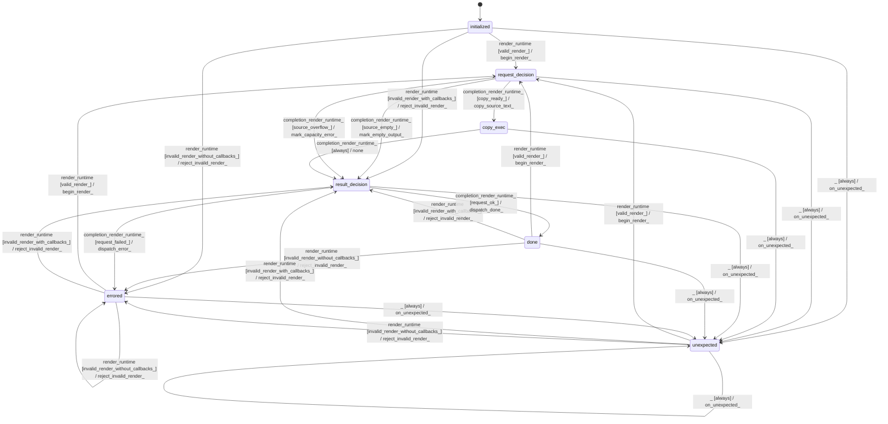

# text_jinja_formatter

Source: [`emel/text/jinja/formatter/sm.hpp`](https://github.com/stateforward/emel.cpp/blob/main/src/emel/text/jinja/formatter/sm.hpp)

## Mermaid

## Transitions

| Source | Event | Guard | Action | Target |
| --- | --- | --- | --- | --- |
| [`initialized`](https://github.com/stateforward/emel.cpp/blob/main/src/emel/text/jinja/formatter/sm.hpp) | [`render_runtime`](https://github.com/stateforward/emel.cpp/blob/main/src/emel/text/jinja/formatter/sm.hpp) | [`valid_render>`](https://github.com/stateforward/emel.cpp/blob/main/src/emel/text/jinja/formatter/sm.hpp) | [`begin_render>`](https://github.com/stateforward/emel.cpp/blob/main/src/emel/text/jinja/formatter/sm.hpp) | [`request_decision`](https://github.com/stateforward/emel.cpp/blob/main/src/emel/text/jinja/formatter/sm.hpp) |
| [`initialized`](https://github.com/stateforward/emel.cpp/blob/main/src/emel/text/jinja/formatter/sm.hpp) | [`render_runtime`](https://github.com/stateforward/emel.cpp/blob/main/src/emel/text/jinja/formatter/sm.hpp) | [`invalid_render_with_callbacks>`](https://github.com/stateforward/emel.cpp/blob/main/src/emel/text/jinja/formatter/sm.hpp) | [`reject_invalid_render>`](https://github.com/stateforward/emel.cpp/blob/main/src/emel/text/jinja/formatter/sm.hpp) | [`result_decision`](https://github.com/stateforward/emel.cpp/blob/main/src/emel/text/jinja/formatter/sm.hpp) |
| [`initialized`](https://github.com/stateforward/emel.cpp/blob/main/src/emel/text/jinja/formatter/sm.hpp) | [`render_runtime`](https://github.com/stateforward/emel.cpp/blob/main/src/emel/text/jinja/formatter/sm.hpp) | [`invalid_render_without_callbacks>`](https://github.com/stateforward/emel.cpp/blob/main/src/emel/text/jinja/formatter/sm.hpp) | [`reject_invalid_render>`](https://github.com/stateforward/emel.cpp/blob/main/src/emel/text/jinja/formatter/sm.hpp) | [`errored`](https://github.com/stateforward/emel.cpp/blob/main/src/emel/text/jinja/formatter/sm.hpp) |
| [`done`](https://github.com/stateforward/emel.cpp/blob/main/src/emel/text/jinja/formatter/sm.hpp) | [`render_runtime`](https://github.com/stateforward/emel.cpp/blob/main/src/emel/text/jinja/formatter/sm.hpp) | [`valid_render>`](https://github.com/stateforward/emel.cpp/blob/main/src/emel/text/jinja/formatter/sm.hpp) | [`begin_render>`](https://github.com/stateforward/emel.cpp/blob/main/src/emel/text/jinja/formatter/sm.hpp) | [`request_decision`](https://github.com/stateforward/emel.cpp/blob/main/src/emel/text/jinja/formatter/sm.hpp) |
| [`done`](https://github.com/stateforward/emel.cpp/blob/main/src/emel/text/jinja/formatter/sm.hpp) | [`render_runtime`](https://github.com/stateforward/emel.cpp/blob/main/src/emel/text/jinja/formatter/sm.hpp) | [`invalid_render_with_callbacks>`](https://github.com/stateforward/emel.cpp/blob/main/src/emel/text/jinja/formatter/sm.hpp) | [`reject_invalid_render>`](https://github.com/stateforward/emel.cpp/blob/main/src/emel/text/jinja/formatter/sm.hpp) | [`result_decision`](https://github.com/stateforward/emel.cpp/blob/main/src/emel/text/jinja/formatter/sm.hpp) |
| [`done`](https://github.com/stateforward/emel.cpp/blob/main/src/emel/text/jinja/formatter/sm.hpp) | [`render_runtime`](https://github.com/stateforward/emel.cpp/blob/main/src/emel/text/jinja/formatter/sm.hpp) | [`invalid_render_without_callbacks>`](https://github.com/stateforward/emel.cpp/blob/main/src/emel/text/jinja/formatter/sm.hpp) | [`reject_invalid_render>`](https://github.com/stateforward/emel.cpp/blob/main/src/emel/text/jinja/formatter/sm.hpp) | [`errored`](https://github.com/stateforward/emel.cpp/blob/main/src/emel/text/jinja/formatter/sm.hpp) |
| [`errored`](https://github.com/stateforward/emel.cpp/blob/main/src/emel/text/jinja/formatter/sm.hpp) | [`render_runtime`](https://github.com/stateforward/emel.cpp/blob/main/src/emel/text/jinja/formatter/sm.hpp) | [`valid_render>`](https://github.com/stateforward/emel.cpp/blob/main/src/emel/text/jinja/formatter/sm.hpp) | [`begin_render>`](https://github.com/stateforward/emel.cpp/blob/main/src/emel/text/jinja/formatter/sm.hpp) | [`request_decision`](https://github.com/stateforward/emel.cpp/blob/main/src/emel/text/jinja/formatter/sm.hpp) |
| [`errored`](https://github.com/stateforward/emel.cpp/blob/main/src/emel/text/jinja/formatter/sm.hpp) | [`render_runtime`](https://github.com/stateforward/emel.cpp/blob/main/src/emel/text/jinja/formatter/sm.hpp) | [`invalid_render_with_callbacks>`](https://github.com/stateforward/emel.cpp/blob/main/src/emel/text/jinja/formatter/sm.hpp) | [`reject_invalid_render>`](https://github.com/stateforward/emel.cpp/blob/main/src/emel/text/jinja/formatter/sm.hpp) | [`result_decision`](https://github.com/stateforward/emel.cpp/blob/main/src/emel/text/jinja/formatter/sm.hpp) |
| [`errored`](https://github.com/stateforward/emel.cpp/blob/main/src/emel/text/jinja/formatter/sm.hpp) | [`render_runtime`](https://github.com/stateforward/emel.cpp/blob/main/src/emel/text/jinja/formatter/sm.hpp) | [`invalid_render_without_callbacks>`](https://github.com/stateforward/emel.cpp/blob/main/src/emel/text/jinja/formatter/sm.hpp) | [`reject_invalid_render>`](https://github.com/stateforward/emel.cpp/blob/main/src/emel/text/jinja/formatter/sm.hpp) | [`errored`](https://github.com/stateforward/emel.cpp/blob/main/src/emel/text/jinja/formatter/sm.hpp) |
| [`unexpected`](https://github.com/stateforward/emel.cpp/blob/main/src/emel/text/jinja/formatter/sm.hpp) | [`render_runtime`](https://github.com/stateforward/emel.cpp/blob/main/src/emel/text/jinja/formatter/sm.hpp) | [`valid_render>`](https://github.com/stateforward/emel.cpp/blob/main/src/emel/text/jinja/formatter/sm.hpp) | [`begin_render>`](https://github.com/stateforward/emel.cpp/blob/main/src/emel/text/jinja/formatter/sm.hpp) | [`request_decision`](https://github.com/stateforward/emel.cpp/blob/main/src/emel/text/jinja/formatter/sm.hpp) |
| [`unexpected`](https://github.com/stateforward/emel.cpp/blob/main/src/emel/text/jinja/formatter/sm.hpp) | [`render_runtime`](https://github.com/stateforward/emel.cpp/blob/main/src/emel/text/jinja/formatter/sm.hpp) | [`invalid_render_with_callbacks>`](https://github.com/stateforward/emel.cpp/blob/main/src/emel/text/jinja/formatter/sm.hpp) | [`reject_invalid_render>`](https://github.com/stateforward/emel.cpp/blob/main/src/emel/text/jinja/formatter/sm.hpp) | [`result_decision`](https://github.com/stateforward/emel.cpp/blob/main/src/emel/text/jinja/formatter/sm.hpp) |
| [`unexpected`](https://github.com/stateforward/emel.cpp/blob/main/src/emel/text/jinja/formatter/sm.hpp) | [`render_runtime`](https://github.com/stateforward/emel.cpp/blob/main/src/emel/text/jinja/formatter/sm.hpp) | [`invalid_render_without_callbacks>`](https://github.com/stateforward/emel.cpp/blob/main/src/emel/text/jinja/formatter/sm.hpp) | [`reject_invalid_render>`](https://github.com/stateforward/emel.cpp/blob/main/src/emel/text/jinja/formatter/sm.hpp) | [`errored`](https://github.com/stateforward/emel.cpp/blob/main/src/emel/text/jinja/formatter/sm.hpp) |
| [`request_decision`](https://github.com/stateforward/emel.cpp/blob/main/src/emel/text/jinja/formatter/sm.hpp) | [`completion<render_runtime>`](https://github.com/stateforward/emel.cpp/blob/main/src/emel/text/jinja/formatter/sm.hpp) | [`source_empty>`](https://github.com/stateforward/emel.cpp/blob/main/src/emel/text/jinja/formatter/sm.hpp) | [`mark_empty_output>`](https://github.com/stateforward/emel.cpp/blob/main/src/emel/text/jinja/formatter/sm.hpp) | [`result_decision`](https://github.com/stateforward/emel.cpp/blob/main/src/emel/text/jinja/formatter/sm.hpp) |
| [`request_decision`](https://github.com/stateforward/emel.cpp/blob/main/src/emel/text/jinja/formatter/sm.hpp) | [`completion<render_runtime>`](https://github.com/stateforward/emel.cpp/blob/main/src/emel/text/jinja/formatter/sm.hpp) | [`copy_ready>`](https://github.com/stateforward/emel.cpp/blob/main/src/emel/text/jinja/formatter/sm.hpp) | [`copy_source_text>`](https://github.com/stateforward/emel.cpp/blob/main/src/emel/text/jinja/formatter/sm.hpp) | [`copy_exec`](https://github.com/stateforward/emel.cpp/blob/main/src/emel/text/jinja/formatter/sm.hpp) |
| [`request_decision`](https://github.com/stateforward/emel.cpp/blob/main/src/emel/text/jinja/formatter/sm.hpp) | [`completion<render_runtime>`](https://github.com/stateforward/emel.cpp/blob/main/src/emel/text/jinja/formatter/sm.hpp) | [`source_overflow>`](https://github.com/stateforward/emel.cpp/blob/main/src/emel/text/jinja/formatter/sm.hpp) | [`mark_capacity_error>`](https://github.com/stateforward/emel.cpp/blob/main/src/emel/text/jinja/formatter/sm.hpp) | [`result_decision`](https://github.com/stateforward/emel.cpp/blob/main/src/emel/text/jinja/formatter/sm.hpp) |
| [`copy_exec`](https://github.com/stateforward/emel.cpp/blob/main/src/emel/text/jinja/formatter/sm.hpp) | [`completion<render_runtime>`](https://github.com/stateforward/emel.cpp/blob/main/src/emel/text/jinja/formatter/sm.hpp) | [`always`](https://github.com/stateforward/emel.cpp/blob/main/src/emel/text/jinja/formatter/sm.hpp) | [`none`](https://github.com/stateforward/emel.cpp/blob/main/src/emel/text/jinja/formatter/sm.hpp) | [`result_decision`](https://github.com/stateforward/emel.cpp/blob/main/src/emel/text/jinja/formatter/sm.hpp) |
| [`result_decision`](https://github.com/stateforward/emel.cpp/blob/main/src/emel/text/jinja/formatter/sm.hpp) | [`completion<render_runtime>`](https://github.com/stateforward/emel.cpp/blob/main/src/emel/text/jinja/formatter/sm.hpp) | [`request_ok>`](https://github.com/stateforward/emel.cpp/blob/main/src/emel/text/jinja/formatter/sm.hpp) | [`dispatch_done>`](https://github.com/stateforward/emel.cpp/blob/main/src/emel/text/jinja/formatter/sm.hpp) | [`done`](https://github.com/stateforward/emel.cpp/blob/main/src/emel/text/jinja/formatter/sm.hpp) |
| [`result_decision`](https://github.com/stateforward/emel.cpp/blob/main/src/emel/text/jinja/formatter/sm.hpp) | [`completion<render_runtime>`](https://github.com/stateforward/emel.cpp/blob/main/src/emel/text/jinja/formatter/sm.hpp) | [`request_failed>`](https://github.com/stateforward/emel.cpp/blob/main/src/emel/text/jinja/formatter/sm.hpp) | [`dispatch_error>`](https://github.com/stateforward/emel.cpp/blob/main/src/emel/text/jinja/formatter/sm.hpp) | [`errored`](https://github.com/stateforward/emel.cpp/blob/main/src/emel/text/jinja/formatter/sm.hpp) |
| [`initialized`](https://github.com/stateforward/emel.cpp/blob/main/src/emel/text/jinja/formatter/sm.hpp) | [`_`](https://github.com/stateforward/emel.cpp/blob/main/src/emel/text/jinja/formatter/sm.hpp) | [`always`](https://github.com/stateforward/emel.cpp/blob/main/src/emel/text/jinja/formatter/sm.hpp) | [`on_unexpected>`](https://github.com/stateforward/emel.cpp/blob/main/src/emel/text/jinja/formatter/sm.hpp) | [`unexpected`](https://github.com/stateforward/emel.cpp/blob/main/src/emel/text/jinja/formatter/sm.hpp) |
| [`request_decision`](https://github.com/stateforward/emel.cpp/blob/main/src/emel/text/jinja/formatter/sm.hpp) | [`_`](https://github.com/stateforward/emel.cpp/blob/main/src/emel/text/jinja/formatter/sm.hpp) | [`always`](https://github.com/stateforward/emel.cpp/blob/main/src/emel/text/jinja/formatter/sm.hpp) | [`on_unexpected>`](https://github.com/stateforward/emel.cpp/blob/main/src/emel/text/jinja/formatter/sm.hpp) | [`unexpected`](https://github.com/stateforward/emel.cpp/blob/main/src/emel/text/jinja/formatter/sm.hpp) |
| [`copy_exec`](https://github.com/stateforward/emel.cpp/blob/main/src/emel/text/jinja/formatter/sm.hpp) | [`_`](https://github.com/stateforward/emel.cpp/blob/main/src/emel/text/jinja/formatter/sm.hpp) | [`always`](https://github.com/stateforward/emel.cpp/blob/main/src/emel/text/jinja/formatter/sm.hpp) | [`on_unexpected>`](https://github.com/stateforward/emel.cpp/blob/main/src/emel/text/jinja/formatter/sm.hpp) | [`unexpected`](https://github.com/stateforward/emel.cpp/blob/main/src/emel/text/jinja/formatter/sm.hpp) |
| [`result_decision`](https://github.com/stateforward/emel.cpp/blob/main/src/emel/text/jinja/formatter/sm.hpp) | [`_`](https://github.com/stateforward/emel.cpp/blob/main/src/emel/text/jinja/formatter/sm.hpp) | [`always`](https://github.com/stateforward/emel.cpp/blob/main/src/emel/text/jinja/formatter/sm.hpp) | [`on_unexpected>`](https://github.com/stateforward/emel.cpp/blob/main/src/emel/text/jinja/formatter/sm.hpp) | [`unexpected`](https://github.com/stateforward/emel.cpp/blob/main/src/emel/text/jinja/formatter/sm.hpp) |
| [`done`](https://github.com/stateforward/emel.cpp/blob/main/src/emel/text/jinja/formatter/sm.hpp) | [`_`](https://github.com/stateforward/emel.cpp/blob/main/src/emel/text/jinja/formatter/sm.hpp) | [`always`](https://github.com/stateforward/emel.cpp/blob/main/src/emel/text/jinja/formatter/sm.hpp) | [`on_unexpected>`](https://github.com/stateforward/emel.cpp/blob/main/src/emel/text/jinja/formatter/sm.hpp) | [`unexpected`](https://github.com/stateforward/emel.cpp/blob/main/src/emel/text/jinja/formatter/sm.hpp) |
| [`errored`](https://github.com/stateforward/emel.cpp/blob/main/src/emel/text/jinja/formatter/sm.hpp) | [`_`](https://github.com/stateforward/emel.cpp/blob/main/src/emel/text/jinja/formatter/sm.hpp) | [`always`](https://github.com/stateforward/emel.cpp/blob/main/src/emel/text/jinja/formatter/sm.hpp) | [`on_unexpected>`](https://github.com/stateforward/emel.cpp/blob/main/src/emel/text/jinja/formatter/sm.hpp) | [`unexpected`](https://github.com/stateforward/emel.cpp/blob/main/src/emel/text/jinja/formatter/sm.hpp) |
| [`unexpected`](https://github.com/stateforward/emel.cpp/blob/main/src/emel/text/jinja/formatter/sm.hpp) | [`_`](https://github.com/stateforward/emel.cpp/blob/main/src/emel/text/jinja/formatter/sm.hpp) | [`always`](https://github.com/stateforward/emel.cpp/blob/main/src/emel/text/jinja/formatter/sm.hpp) | [`on_unexpected>`](https://github.com/stateforward/emel.cpp/blob/main/src/emel/text/jinja/formatter/sm.hpp) | [`unexpected`](https://github.com/stateforward/emel.cpp/blob/main/src/emel/text/jinja/formatter/sm.hpp) |
