# text_jinja_parser_program_parser

Source: [`emel/text/jinja/parser/program_parser/sm.hpp`](https://github.com/stateforward/emel.cpp/blob/main/src/emel/text/jinja/parser/program_parser/sm.hpp)

## Mermaid

```mermaid
stateDiagram-v2
  direction TB
  [*] --> deciding
  deciding --> parse_begin : completion_parse_runtime_ [always] / start_program_parse_
  parse_begin --> dispatch_decision : completion_parse_runtime_ [always] / none
  dispatch_decision --> parsed : completion_parse_runtime_ [at_eof_] / finish_parsed_
  dispatch_decision --> text_emit : completion_parse_runtime_ [token_text_] / none
  dispatch_decision --> comment_emit : completion_parse_runtime_ [token_comment_] / none
  dispatch_decision --> model__ : completion_parse_runtime_ [token_open_statement_] / none
  dispatch_decision --> model__ : completion_parse_runtime_ [token_open_expression_] / none
  dispatch_decision --> parse_failed : completion_parse_runtime_ [token_unexpected_] / fail_current_token_
  text_emit --> dispatch_decision : completion_parse_runtime_ [always] / consume_text_
  comment_emit --> dispatch_decision : completion_parse_runtime_ [always] / consume_comment_
  model__ --> statement_parse_result_decision : completion_parse_runtime_ [always] / none
  statement_parse_result_decision --> dispatch_decision : completion_parse_runtime_ [parse_error_none_] / none
  statement_parse_result_decision --> parse_failed : completion_parse_runtime_ [parse_error_invalid_request_] / none
  statement_parse_result_decision --> parse_failed : completion_parse_runtime_ [parse_error_parse_failed_] / none
  statement_parse_result_decision --> parse_failed : completion_parse_runtime_ [parse_error_internal_error_] / none
  statement_parse_result_decision --> parse_failed : completion_parse_runtime_ [parse_error_untracked_] / none
  statement_parse_result_decision --> parse_failed : completion_parse_runtime_ [parse_error_unknown_] / none
  model__ --> expression_parse_result_decision : completion_parse_runtime_ [always] / none
  expression_parse_result_decision --> dispatch_decision : completion_parse_runtime_ [parse_error_none_] / none
  expression_parse_result_decision --> parse_failed : completion_parse_runtime_ [parse_error_invalid_request_] / none
  expression_parse_result_decision --> parse_failed : completion_parse_runtime_ [parse_error_parse_failed_] / none
  expression_parse_result_decision --> parse_failed : completion_parse_runtime_ [parse_error_internal_error_] / none
  expression_parse_result_decision --> parse_failed : completion_parse_runtime_ [parse_error_untracked_] / none
  expression_parse_result_decision --> parse_failed : completion_parse_runtime_ [parse_error_unknown_] / none
  parsed --> terminate : [always] / none
  parse_failed --> terminate : [always] / none
  deciding --> unexpected_event : _ [always] / on_unexpected_
  parse_begin --> unexpected_event : _ [always] / on_unexpected_
  dispatch_decision --> unexpected_event : _ [always] / on_unexpected_
  text_emit --> unexpected_event : _ [always] / on_unexpected_
  comment_emit --> unexpected_event : _ [always] / on_unexpected_
  statement_parse_result_decision --> unexpected_event : _ [always] / on_unexpected_
  expression_parse_result_decision --> unexpected_event : _ [always] / on_unexpected_
  parsed --> unexpected_event : _ [always] / on_unexpected_
  parse_failed --> unexpected_event : _ [always] / on_unexpected_
  unexpected_event --> unexpected_event : _ [always] / on_unexpected_
```

## Transitions

| Source | Event | Guard | Action | Target |
| --- | --- | --- | --- | --- |
| [`deciding`](https://github.com/stateforward/emel.cpp/blob/main/src/emel/text/jinja/parser/program_parser/sm.hpp) | [`completion<parse_runtime>`](https://github.com/stateforward/emel.cpp/blob/main/src/emel/text/jinja/parser/program_parser/sm.hpp) | [`always`](https://github.com/stateforward/emel.cpp/blob/main/src/emel/text/jinja/parser/program_parser/sm.hpp) | [`start_program_parse>`](https://github.com/stateforward/emel.cpp/blob/main/src/emel/text/jinja/parser/program_parser/sm.hpp) | [`parse_begin`](https://github.com/stateforward/emel.cpp/blob/main/src/emel/text/jinja/parser/program_parser/sm.hpp) |
| [`parse_begin`](https://github.com/stateforward/emel.cpp/blob/main/src/emel/text/jinja/parser/program_parser/sm.hpp) | [`completion<parse_runtime>`](https://github.com/stateforward/emel.cpp/blob/main/src/emel/text/jinja/parser/program_parser/sm.hpp) | [`always`](https://github.com/stateforward/emel.cpp/blob/main/src/emel/text/jinja/parser/program_parser/sm.hpp) | [`none`](https://github.com/stateforward/emel.cpp/blob/main/src/emel/text/jinja/parser/program_parser/sm.hpp) | [`dispatch_decision`](https://github.com/stateforward/emel.cpp/blob/main/src/emel/text/jinja/parser/program_parser/sm.hpp) |
| [`dispatch_decision`](https://github.com/stateforward/emel.cpp/blob/main/src/emel/text/jinja/parser/program_parser/sm.hpp) | [`completion<parse_runtime>`](https://github.com/stateforward/emel.cpp/blob/main/src/emel/text/jinja/parser/program_parser/sm.hpp) | [`at_eof>`](https://github.com/stateforward/emel.cpp/blob/main/src/emel/text/jinja/parser/program_parser/sm.hpp) | [`finish_parsed>`](https://github.com/stateforward/emel.cpp/blob/main/src/emel/text/jinja/parser/program_parser/sm.hpp) | [`parsed`](https://github.com/stateforward/emel.cpp/blob/main/src/emel/text/jinja/parser/program_parser/sm.hpp) |
| [`dispatch_decision`](https://github.com/stateforward/emel.cpp/blob/main/src/emel/text/jinja/parser/program_parser/sm.hpp) | [`completion<parse_runtime>`](https://github.com/stateforward/emel.cpp/blob/main/src/emel/text/jinja/parser/program_parser/sm.hpp) | [`token_text>`](https://github.com/stateforward/emel.cpp/blob/main/src/emel/text/jinja/parser/program_parser/sm.hpp) | [`none`](https://github.com/stateforward/emel.cpp/blob/main/src/emel/text/jinja/parser/program_parser/sm.hpp) | [`text_emit`](https://github.com/stateforward/emel.cpp/blob/main/src/emel/text/jinja/parser/program_parser/sm.hpp) |
| [`dispatch_decision`](https://github.com/stateforward/emel.cpp/blob/main/src/emel/text/jinja/parser/program_parser/sm.hpp) | [`completion<parse_runtime>`](https://github.com/stateforward/emel.cpp/blob/main/src/emel/text/jinja/parser/program_parser/sm.hpp) | [`token_comment>`](https://github.com/stateforward/emel.cpp/blob/main/src/emel/text/jinja/parser/program_parser/sm.hpp) | [`none`](https://github.com/stateforward/emel.cpp/blob/main/src/emel/text/jinja/parser/program_parser/sm.hpp) | [`comment_emit`](https://github.com/stateforward/emel.cpp/blob/main/src/emel/text/jinja/parser/program_parser/sm.hpp) |
| [`dispatch_decision`](https://github.com/stateforward/emel.cpp/blob/main/src/emel/text/jinja/parser/program_parser/sm.hpp) | [`completion<parse_runtime>`](https://github.com/stateforward/emel.cpp/blob/main/src/emel/text/jinja/parser/program_parser/sm.hpp) | [`token_open_statement>`](https://github.com/stateforward/emel.cpp/blob/main/src/emel/text/jinja/parser/program_parser/sm.hpp) | [`none`](https://github.com/stateforward/emel.cpp/blob/main/src/emel/text/jinja/parser/program_parser/sm.hpp) | [`model>>`](https://github.com/stateforward/emel.cpp/blob/main/src/emel/text/jinja/parser/program_parser/sm.hpp) |
| [`dispatch_decision`](https://github.com/stateforward/emel.cpp/blob/main/src/emel/text/jinja/parser/program_parser/sm.hpp) | [`completion<parse_runtime>`](https://github.com/stateforward/emel.cpp/blob/main/src/emel/text/jinja/parser/program_parser/sm.hpp) | [`token_open_expression>`](https://github.com/stateforward/emel.cpp/blob/main/src/emel/text/jinja/parser/program_parser/sm.hpp) | [`none`](https://github.com/stateforward/emel.cpp/blob/main/src/emel/text/jinja/parser/program_parser/sm.hpp) | [`model>>`](https://github.com/stateforward/emel.cpp/blob/main/src/emel/text/jinja/parser/program_parser/sm.hpp) |
| [`dispatch_decision`](https://github.com/stateforward/emel.cpp/blob/main/src/emel/text/jinja/parser/program_parser/sm.hpp) | [`completion<parse_runtime>`](https://github.com/stateforward/emel.cpp/blob/main/src/emel/text/jinja/parser/program_parser/sm.hpp) | [`token_unexpected>`](https://github.com/stateforward/emel.cpp/blob/main/src/emel/text/jinja/parser/program_parser/sm.hpp) | [`fail_current_token>`](https://github.com/stateforward/emel.cpp/blob/main/src/emel/text/jinja/parser/program_parser/sm.hpp) | [`parse_failed`](https://github.com/stateforward/emel.cpp/blob/main/src/emel/text/jinja/parser/program_parser/sm.hpp) |
| [`text_emit`](https://github.com/stateforward/emel.cpp/blob/main/src/emel/text/jinja/parser/program_parser/sm.hpp) | [`completion<parse_runtime>`](https://github.com/stateforward/emel.cpp/blob/main/src/emel/text/jinja/parser/program_parser/sm.hpp) | [`always`](https://github.com/stateforward/emel.cpp/blob/main/src/emel/text/jinja/parser/program_parser/sm.hpp) | [`consume_text>`](https://github.com/stateforward/emel.cpp/blob/main/src/emel/text/jinja/parser/program_parser/sm.hpp) | [`dispatch_decision`](https://github.com/stateforward/emel.cpp/blob/main/src/emel/text/jinja/parser/program_parser/sm.hpp) |
| [`comment_emit`](https://github.com/stateforward/emel.cpp/blob/main/src/emel/text/jinja/parser/program_parser/sm.hpp) | [`completion<parse_runtime>`](https://github.com/stateforward/emel.cpp/blob/main/src/emel/text/jinja/parser/program_parser/sm.hpp) | [`always`](https://github.com/stateforward/emel.cpp/blob/main/src/emel/text/jinja/parser/program_parser/sm.hpp) | [`consume_comment>`](https://github.com/stateforward/emel.cpp/blob/main/src/emel/text/jinja/parser/program_parser/sm.hpp) | [`dispatch_decision`](https://github.com/stateforward/emel.cpp/blob/main/src/emel/text/jinja/parser/program_parser/sm.hpp) |
| [`model>>`](https://github.com/stateforward/emel.cpp/blob/main/src/emel/text/jinja/parser/program_parser/sm.hpp) | [`completion<parse_runtime>`](https://github.com/stateforward/emel.cpp/blob/main/src/emel/text/jinja/parser/program_parser/sm.hpp) | [`always`](https://github.com/stateforward/emel.cpp/blob/main/src/emel/text/jinja/parser/program_parser/sm.hpp) | [`none`](https://github.com/stateforward/emel.cpp/blob/main/src/emel/text/jinja/parser/program_parser/sm.hpp) | [`statement_parse_result_decision`](https://github.com/stateforward/emel.cpp/blob/main/src/emel/text/jinja/parser/program_parser/sm.hpp) |
| [`statement_parse_result_decision`](https://github.com/stateforward/emel.cpp/blob/main/src/emel/text/jinja/parser/program_parser/sm.hpp) | [`completion<parse_runtime>`](https://github.com/stateforward/emel.cpp/blob/main/src/emel/text/jinja/parser/program_parser/sm.hpp) | [`parse_error_none>`](https://github.com/stateforward/emel.cpp/blob/main/src/emel/text/jinja/parser/program_parser/sm.hpp) | [`none`](https://github.com/stateforward/emel.cpp/blob/main/src/emel/text/jinja/parser/program_parser/sm.hpp) | [`dispatch_decision`](https://github.com/stateforward/emel.cpp/blob/main/src/emel/text/jinja/parser/program_parser/sm.hpp) |
| [`statement_parse_result_decision`](https://github.com/stateforward/emel.cpp/blob/main/src/emel/text/jinja/parser/program_parser/sm.hpp) | [`completion<parse_runtime>`](https://github.com/stateforward/emel.cpp/blob/main/src/emel/text/jinja/parser/program_parser/sm.hpp) | [`parse_error_invalid_request>`](https://github.com/stateforward/emel.cpp/blob/main/src/emel/text/jinja/parser/program_parser/sm.hpp) | [`none`](https://github.com/stateforward/emel.cpp/blob/main/src/emel/text/jinja/parser/program_parser/sm.hpp) | [`parse_failed`](https://github.com/stateforward/emel.cpp/blob/main/src/emel/text/jinja/parser/program_parser/sm.hpp) |
| [`statement_parse_result_decision`](https://github.com/stateforward/emel.cpp/blob/main/src/emel/text/jinja/parser/program_parser/sm.hpp) | [`completion<parse_runtime>`](https://github.com/stateforward/emel.cpp/blob/main/src/emel/text/jinja/parser/program_parser/sm.hpp) | [`parse_error_parse_failed>`](https://github.com/stateforward/emel.cpp/blob/main/src/emel/text/jinja/parser/program_parser/sm.hpp) | [`none`](https://github.com/stateforward/emel.cpp/blob/main/src/emel/text/jinja/parser/program_parser/sm.hpp) | [`parse_failed`](https://github.com/stateforward/emel.cpp/blob/main/src/emel/text/jinja/parser/program_parser/sm.hpp) |
| [`statement_parse_result_decision`](https://github.com/stateforward/emel.cpp/blob/main/src/emel/text/jinja/parser/program_parser/sm.hpp) | [`completion<parse_runtime>`](https://github.com/stateforward/emel.cpp/blob/main/src/emel/text/jinja/parser/program_parser/sm.hpp) | [`parse_error_internal_error>`](https://github.com/stateforward/emel.cpp/blob/main/src/emel/text/jinja/parser/program_parser/sm.hpp) | [`none`](https://github.com/stateforward/emel.cpp/blob/main/src/emel/text/jinja/parser/program_parser/sm.hpp) | [`parse_failed`](https://github.com/stateforward/emel.cpp/blob/main/src/emel/text/jinja/parser/program_parser/sm.hpp) |
| [`statement_parse_result_decision`](https://github.com/stateforward/emel.cpp/blob/main/src/emel/text/jinja/parser/program_parser/sm.hpp) | [`completion<parse_runtime>`](https://github.com/stateforward/emel.cpp/blob/main/src/emel/text/jinja/parser/program_parser/sm.hpp) | [`parse_error_untracked>`](https://github.com/stateforward/emel.cpp/blob/main/src/emel/text/jinja/parser/program_parser/sm.hpp) | [`none`](https://github.com/stateforward/emel.cpp/blob/main/src/emel/text/jinja/parser/program_parser/sm.hpp) | [`parse_failed`](https://github.com/stateforward/emel.cpp/blob/main/src/emel/text/jinja/parser/program_parser/sm.hpp) |
| [`statement_parse_result_decision`](https://github.com/stateforward/emel.cpp/blob/main/src/emel/text/jinja/parser/program_parser/sm.hpp) | [`completion<parse_runtime>`](https://github.com/stateforward/emel.cpp/blob/main/src/emel/text/jinja/parser/program_parser/sm.hpp) | [`parse_error_unknown>`](https://github.com/stateforward/emel.cpp/blob/main/src/emel/text/jinja/parser/program_parser/sm.hpp) | [`none`](https://github.com/stateforward/emel.cpp/blob/main/src/emel/text/jinja/parser/program_parser/sm.hpp) | [`parse_failed`](https://github.com/stateforward/emel.cpp/blob/main/src/emel/text/jinja/parser/program_parser/sm.hpp) |
| [`model>>`](https://github.com/stateforward/emel.cpp/blob/main/src/emel/text/jinja/parser/program_parser/sm.hpp) | [`completion<parse_runtime>`](https://github.com/stateforward/emel.cpp/blob/main/src/emel/text/jinja/parser/program_parser/sm.hpp) | [`always`](https://github.com/stateforward/emel.cpp/blob/main/src/emel/text/jinja/parser/program_parser/sm.hpp) | [`none`](https://github.com/stateforward/emel.cpp/blob/main/src/emel/text/jinja/parser/program_parser/sm.hpp) | [`expression_parse_result_decision`](https://github.com/stateforward/emel.cpp/blob/main/src/emel/text/jinja/parser/program_parser/sm.hpp) |
| [`expression_parse_result_decision`](https://github.com/stateforward/emel.cpp/blob/main/src/emel/text/jinja/parser/program_parser/sm.hpp) | [`completion<parse_runtime>`](https://github.com/stateforward/emel.cpp/blob/main/src/emel/text/jinja/parser/program_parser/sm.hpp) | [`parse_error_none>`](https://github.com/stateforward/emel.cpp/blob/main/src/emel/text/jinja/parser/program_parser/sm.hpp) | [`none`](https://github.com/stateforward/emel.cpp/blob/main/src/emel/text/jinja/parser/program_parser/sm.hpp) | [`dispatch_decision`](https://github.com/stateforward/emel.cpp/blob/main/src/emel/text/jinja/parser/program_parser/sm.hpp) |
| [`expression_parse_result_decision`](https://github.com/stateforward/emel.cpp/blob/main/src/emel/text/jinja/parser/program_parser/sm.hpp) | [`completion<parse_runtime>`](https://github.com/stateforward/emel.cpp/blob/main/src/emel/text/jinja/parser/program_parser/sm.hpp) | [`parse_error_invalid_request>`](https://github.com/stateforward/emel.cpp/blob/main/src/emel/text/jinja/parser/program_parser/sm.hpp) | [`none`](https://github.com/stateforward/emel.cpp/blob/main/src/emel/text/jinja/parser/program_parser/sm.hpp) | [`parse_failed`](https://github.com/stateforward/emel.cpp/blob/main/src/emel/text/jinja/parser/program_parser/sm.hpp) |
| [`expression_parse_result_decision`](https://github.com/stateforward/emel.cpp/blob/main/src/emel/text/jinja/parser/program_parser/sm.hpp) | [`completion<parse_runtime>`](https://github.com/stateforward/emel.cpp/blob/main/src/emel/text/jinja/parser/program_parser/sm.hpp) | [`parse_error_parse_failed>`](https://github.com/stateforward/emel.cpp/blob/main/src/emel/text/jinja/parser/program_parser/sm.hpp) | [`none`](https://github.com/stateforward/emel.cpp/blob/main/src/emel/text/jinja/parser/program_parser/sm.hpp) | [`parse_failed`](https://github.com/stateforward/emel.cpp/blob/main/src/emel/text/jinja/parser/program_parser/sm.hpp) |
| [`expression_parse_result_decision`](https://github.com/stateforward/emel.cpp/blob/main/src/emel/text/jinja/parser/program_parser/sm.hpp) | [`completion<parse_runtime>`](https://github.com/stateforward/emel.cpp/blob/main/src/emel/text/jinja/parser/program_parser/sm.hpp) | [`parse_error_internal_error>`](https://github.com/stateforward/emel.cpp/blob/main/src/emel/text/jinja/parser/program_parser/sm.hpp) | [`none`](https://github.com/stateforward/emel.cpp/blob/main/src/emel/text/jinja/parser/program_parser/sm.hpp) | [`parse_failed`](https://github.com/stateforward/emel.cpp/blob/main/src/emel/text/jinja/parser/program_parser/sm.hpp) |
| [`expression_parse_result_decision`](https://github.com/stateforward/emel.cpp/blob/main/src/emel/text/jinja/parser/program_parser/sm.hpp) | [`completion<parse_runtime>`](https://github.com/stateforward/emel.cpp/blob/main/src/emel/text/jinja/parser/program_parser/sm.hpp) | [`parse_error_untracked>`](https://github.com/stateforward/emel.cpp/blob/main/src/emel/text/jinja/parser/program_parser/sm.hpp) | [`none`](https://github.com/stateforward/emel.cpp/blob/main/src/emel/text/jinja/parser/program_parser/sm.hpp) | [`parse_failed`](https://github.com/stateforward/emel.cpp/blob/main/src/emel/text/jinja/parser/program_parser/sm.hpp) |
| [`expression_parse_result_decision`](https://github.com/stateforward/emel.cpp/blob/main/src/emel/text/jinja/parser/program_parser/sm.hpp) | [`completion<parse_runtime>`](https://github.com/stateforward/emel.cpp/blob/main/src/emel/text/jinja/parser/program_parser/sm.hpp) | [`parse_error_unknown>`](https://github.com/stateforward/emel.cpp/blob/main/src/emel/text/jinja/parser/program_parser/sm.hpp) | [`none`](https://github.com/stateforward/emel.cpp/blob/main/src/emel/text/jinja/parser/program_parser/sm.hpp) | [`parse_failed`](https://github.com/stateforward/emel.cpp/blob/main/src/emel/text/jinja/parser/program_parser/sm.hpp) |
| [`parsed`](https://github.com/stateforward/emel.cpp/blob/main/src/emel/text/jinja/parser/program_parser/sm.hpp) | - | [`always`](https://github.com/stateforward/emel.cpp/blob/main/src/emel/text/jinja/parser/program_parser/sm.hpp) | [`none`](https://github.com/stateforward/emel.cpp/blob/main/src/emel/text/jinja/parser/program_parser/sm.hpp) | [`terminate`](https://github.com/stateforward/emel.cpp/blob/main/src/emel/text/jinja/parser/program_parser/sm.hpp) |
| [`parse_failed`](https://github.com/stateforward/emel.cpp/blob/main/src/emel/text/jinja/parser/program_parser/sm.hpp) | - | [`always`](https://github.com/stateforward/emel.cpp/blob/main/src/emel/text/jinja/parser/program_parser/sm.hpp) | [`none`](https://github.com/stateforward/emel.cpp/blob/main/src/emel/text/jinja/parser/program_parser/sm.hpp) | [`terminate`](https://github.com/stateforward/emel.cpp/blob/main/src/emel/text/jinja/parser/program_parser/sm.hpp) |
| [`deciding`](https://github.com/stateforward/emel.cpp/blob/main/src/emel/text/jinja/parser/program_parser/sm.hpp) | [`_`](https://github.com/stateforward/emel.cpp/blob/main/src/emel/text/jinja/parser/program_parser/sm.hpp) | [`always`](https://github.com/stateforward/emel.cpp/blob/main/src/emel/text/jinja/parser/program_parser/sm.hpp) | [`on_unexpected>`](https://github.com/stateforward/emel.cpp/blob/main/src/emel/text/jinja/parser/program_parser/sm.hpp) | [`unexpected_event`](https://github.com/stateforward/emel.cpp/blob/main/src/emel/text/jinja/parser/program_parser/sm.hpp) |
| [`parse_begin`](https://github.com/stateforward/emel.cpp/blob/main/src/emel/text/jinja/parser/program_parser/sm.hpp) | [`_`](https://github.com/stateforward/emel.cpp/blob/main/src/emel/text/jinja/parser/program_parser/sm.hpp) | [`always`](https://github.com/stateforward/emel.cpp/blob/main/src/emel/text/jinja/parser/program_parser/sm.hpp) | [`on_unexpected>`](https://github.com/stateforward/emel.cpp/blob/main/src/emel/text/jinja/parser/program_parser/sm.hpp) | [`unexpected_event`](https://github.com/stateforward/emel.cpp/blob/main/src/emel/text/jinja/parser/program_parser/sm.hpp) |
| [`dispatch_decision`](https://github.com/stateforward/emel.cpp/blob/main/src/emel/text/jinja/parser/program_parser/sm.hpp) | [`_`](https://github.com/stateforward/emel.cpp/blob/main/src/emel/text/jinja/parser/program_parser/sm.hpp) | [`always`](https://github.com/stateforward/emel.cpp/blob/main/src/emel/text/jinja/parser/program_parser/sm.hpp) | [`on_unexpected>`](https://github.com/stateforward/emel.cpp/blob/main/src/emel/text/jinja/parser/program_parser/sm.hpp) | [`unexpected_event`](https://github.com/stateforward/emel.cpp/blob/main/src/emel/text/jinja/parser/program_parser/sm.hpp) |
| [`text_emit`](https://github.com/stateforward/emel.cpp/blob/main/src/emel/text/jinja/parser/program_parser/sm.hpp) | [`_`](https://github.com/stateforward/emel.cpp/blob/main/src/emel/text/jinja/parser/program_parser/sm.hpp) | [`always`](https://github.com/stateforward/emel.cpp/blob/main/src/emel/text/jinja/parser/program_parser/sm.hpp) | [`on_unexpected>`](https://github.com/stateforward/emel.cpp/blob/main/src/emel/text/jinja/parser/program_parser/sm.hpp) | [`unexpected_event`](https://github.com/stateforward/emel.cpp/blob/main/src/emel/text/jinja/parser/program_parser/sm.hpp) |
| [`comment_emit`](https://github.com/stateforward/emel.cpp/blob/main/src/emel/text/jinja/parser/program_parser/sm.hpp) | [`_`](https://github.com/stateforward/emel.cpp/blob/main/src/emel/text/jinja/parser/program_parser/sm.hpp) | [`always`](https://github.com/stateforward/emel.cpp/blob/main/src/emel/text/jinja/parser/program_parser/sm.hpp) | [`on_unexpected>`](https://github.com/stateforward/emel.cpp/blob/main/src/emel/text/jinja/parser/program_parser/sm.hpp) | [`unexpected_event`](https://github.com/stateforward/emel.cpp/blob/main/src/emel/text/jinja/parser/program_parser/sm.hpp) |
| [`statement_parse_result_decision`](https://github.com/stateforward/emel.cpp/blob/main/src/emel/text/jinja/parser/program_parser/sm.hpp) | [`_`](https://github.com/stateforward/emel.cpp/blob/main/src/emel/text/jinja/parser/program_parser/sm.hpp) | [`always`](https://github.com/stateforward/emel.cpp/blob/main/src/emel/text/jinja/parser/program_parser/sm.hpp) | [`on_unexpected>`](https://github.com/stateforward/emel.cpp/blob/main/src/emel/text/jinja/parser/program_parser/sm.hpp) | [`unexpected_event`](https://github.com/stateforward/emel.cpp/blob/main/src/emel/text/jinja/parser/program_parser/sm.hpp) |
| [`expression_parse_result_decision`](https://github.com/stateforward/emel.cpp/blob/main/src/emel/text/jinja/parser/program_parser/sm.hpp) | [`_`](https://github.com/stateforward/emel.cpp/blob/main/src/emel/text/jinja/parser/program_parser/sm.hpp) | [`always`](https://github.com/stateforward/emel.cpp/blob/main/src/emel/text/jinja/parser/program_parser/sm.hpp) | [`on_unexpected>`](https://github.com/stateforward/emel.cpp/blob/main/src/emel/text/jinja/parser/program_parser/sm.hpp) | [`unexpected_event`](https://github.com/stateforward/emel.cpp/blob/main/src/emel/text/jinja/parser/program_parser/sm.hpp) |
| [`parsed`](https://github.com/stateforward/emel.cpp/blob/main/src/emel/text/jinja/parser/program_parser/sm.hpp) | [`_`](https://github.com/stateforward/emel.cpp/blob/main/src/emel/text/jinja/parser/program_parser/sm.hpp) | [`always`](https://github.com/stateforward/emel.cpp/blob/main/src/emel/text/jinja/parser/program_parser/sm.hpp) | [`on_unexpected>`](https://github.com/stateforward/emel.cpp/blob/main/src/emel/text/jinja/parser/program_parser/sm.hpp) | [`unexpected_event`](https://github.com/stateforward/emel.cpp/blob/main/src/emel/text/jinja/parser/program_parser/sm.hpp) |
| [`parse_failed`](https://github.com/stateforward/emel.cpp/blob/main/src/emel/text/jinja/parser/program_parser/sm.hpp) | [`_`](https://github.com/stateforward/emel.cpp/blob/main/src/emel/text/jinja/parser/program_parser/sm.hpp) | [`always`](https://github.com/stateforward/emel.cpp/blob/main/src/emel/text/jinja/parser/program_parser/sm.hpp) | [`on_unexpected>`](https://github.com/stateforward/emel.cpp/blob/main/src/emel/text/jinja/parser/program_parser/sm.hpp) | [`unexpected_event`](https://github.com/stateforward/emel.cpp/blob/main/src/emel/text/jinja/parser/program_parser/sm.hpp) |
| [`unexpected_event`](https://github.com/stateforward/emel.cpp/blob/main/src/emel/text/jinja/parser/program_parser/sm.hpp) | [`_`](https://github.com/stateforward/emel.cpp/blob/main/src/emel/text/jinja/parser/program_parser/sm.hpp) | [`always`](https://github.com/stateforward/emel.cpp/blob/main/src/emel/text/jinja/parser/program_parser/sm.hpp) | [`on_unexpected>`](https://github.com/stateforward/emel.cpp/blob/main/src/emel/text/jinja/parser/program_parser/sm.hpp) | [`unexpected_event`](https://github.com/stateforward/emel.cpp/blob/main/src/emel/text/jinja/parser/program_parser/sm.hpp) |
