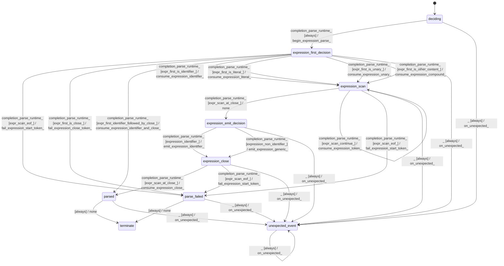

# text_jinja_parser_program_parser_expression_parser

Source: [`emel/text/jinja/parser/program_parser/expression_parser/sm.hpp`](https://github.com/stateforward/emel.cpp/blob/main/src/emel/text/jinja/parser/program_parser/expression_parser/sm.hpp)

## Mermaid

## Transitions

| Source | Event | Guard | Action | Target |
| --- | --- | --- | --- | --- |
| [`deciding`](https://github.com/stateforward/emel.cpp/blob/main/src/emel/text/jinja/parser/program_parser/expression_parser/sm.hpp) | [`completion<parse_runtime>`](https://github.com/stateforward/emel.cpp/blob/main/src/emel/text/jinja/parser/program_parser/expression_parser/sm.hpp) | [`always`](https://github.com/stateforward/emel.cpp/blob/main/src/emel/text/jinja/parser/program_parser/expression_parser/sm.hpp) | [`begin_expression_parse>`](https://github.com/stateforward/emel.cpp/blob/main/src/emel/text/jinja/parser/program_parser/expression_parser/sm.hpp) | [`expression_first_decision`](https://github.com/stateforward/emel.cpp/blob/main/src/emel/text/jinja/parser/program_parser/expression_parser/sm.hpp) |
| [`expression_first_decision`](https://github.com/stateforward/emel.cpp/blob/main/src/emel/text/jinja/parser/program_parser/expression_parser/sm.hpp) | [`completion<parse_runtime>`](https://github.com/stateforward/emel.cpp/blob/main/src/emel/text/jinja/parser/program_parser/expression_parser/sm.hpp) | [`expr_scan_eof>`](https://github.com/stateforward/emel.cpp/blob/main/src/emel/text/jinja/parser/program_parser/expression_parser/sm.hpp) | [`fail_expression_start_token>`](https://github.com/stateforward/emel.cpp/blob/main/src/emel/text/jinja/parser/program_parser/expression_parser/sm.hpp) | [`parse_failed`](https://github.com/stateforward/emel.cpp/blob/main/src/emel/text/jinja/parser/program_parser/expression_parser/sm.hpp) |
| [`expression_first_decision`](https://github.com/stateforward/emel.cpp/blob/main/src/emel/text/jinja/parser/program_parser/expression_parser/sm.hpp) | [`completion<parse_runtime>`](https://github.com/stateforward/emel.cpp/blob/main/src/emel/text/jinja/parser/program_parser/expression_parser/sm.hpp) | [`expr_first_is_close>`](https://github.com/stateforward/emel.cpp/blob/main/src/emel/text/jinja/parser/program_parser/expression_parser/sm.hpp) | [`fail_expression_close_token>`](https://github.com/stateforward/emel.cpp/blob/main/src/emel/text/jinja/parser/program_parser/expression_parser/sm.hpp) | [`parse_failed`](https://github.com/stateforward/emel.cpp/blob/main/src/emel/text/jinja/parser/program_parser/expression_parser/sm.hpp) |
| [`expression_first_decision`](https://github.com/stateforward/emel.cpp/blob/main/src/emel/text/jinja/parser/program_parser/expression_parser/sm.hpp) | [`completion<parse_runtime>`](https://github.com/stateforward/emel.cpp/blob/main/src/emel/text/jinja/parser/program_parser/expression_parser/sm.hpp) | [`expr_first_identifier_followed_by_close>`](https://github.com/stateforward/emel.cpp/blob/main/src/emel/text/jinja/parser/program_parser/expression_parser/sm.hpp) | [`consume_expression_identifier_and_close>`](https://github.com/stateforward/emel.cpp/blob/main/src/emel/text/jinja/parser/program_parser/expression_parser/sm.hpp) | [`parsed`](https://github.com/stateforward/emel.cpp/blob/main/src/emel/text/jinja/parser/program_parser/expression_parser/sm.hpp) |
| [`expression_first_decision`](https://github.com/stateforward/emel.cpp/blob/main/src/emel/text/jinja/parser/program_parser/expression_parser/sm.hpp) | [`completion<parse_runtime>`](https://github.com/stateforward/emel.cpp/blob/main/src/emel/text/jinja/parser/program_parser/expression_parser/sm.hpp) | [`expr_first_is_identifier>`](https://github.com/stateforward/emel.cpp/blob/main/src/emel/text/jinja/parser/program_parser/expression_parser/sm.hpp) | [`consume_expression_identifier>`](https://github.com/stateforward/emel.cpp/blob/main/src/emel/text/jinja/parser/program_parser/expression_parser/sm.hpp) | [`expression_scan`](https://github.com/stateforward/emel.cpp/blob/main/src/emel/text/jinja/parser/program_parser/expression_parser/sm.hpp) |
| [`expression_first_decision`](https://github.com/stateforward/emel.cpp/blob/main/src/emel/text/jinja/parser/program_parser/expression_parser/sm.hpp) | [`completion<parse_runtime>`](https://github.com/stateforward/emel.cpp/blob/main/src/emel/text/jinja/parser/program_parser/expression_parser/sm.hpp) | [`expr_first_is_literal>`](https://github.com/stateforward/emel.cpp/blob/main/src/emel/text/jinja/parser/program_parser/expression_parser/sm.hpp) | [`consume_expression_literal>`](https://github.com/stateforward/emel.cpp/blob/main/src/emel/text/jinja/parser/program_parser/expression_parser/sm.hpp) | [`expression_scan`](https://github.com/stateforward/emel.cpp/blob/main/src/emel/text/jinja/parser/program_parser/expression_parser/sm.hpp) |
| [`expression_first_decision`](https://github.com/stateforward/emel.cpp/blob/main/src/emel/text/jinja/parser/program_parser/expression_parser/sm.hpp) | [`completion<parse_runtime>`](https://github.com/stateforward/emel.cpp/blob/main/src/emel/text/jinja/parser/program_parser/expression_parser/sm.hpp) | [`expr_first_is_unary>`](https://github.com/stateforward/emel.cpp/blob/main/src/emel/text/jinja/parser/program_parser/expression_parser/sm.hpp) | [`consume_expression_unary>`](https://github.com/stateforward/emel.cpp/blob/main/src/emel/text/jinja/parser/program_parser/expression_parser/sm.hpp) | [`expression_scan`](https://github.com/stateforward/emel.cpp/blob/main/src/emel/text/jinja/parser/program_parser/expression_parser/sm.hpp) |
| [`expression_first_decision`](https://github.com/stateforward/emel.cpp/blob/main/src/emel/text/jinja/parser/program_parser/expression_parser/sm.hpp) | [`completion<parse_runtime>`](https://github.com/stateforward/emel.cpp/blob/main/src/emel/text/jinja/parser/program_parser/expression_parser/sm.hpp) | [`expr_first_is_other_content>`](https://github.com/stateforward/emel.cpp/blob/main/src/emel/text/jinja/parser/program_parser/expression_parser/sm.hpp) | [`consume_expression_compound>`](https://github.com/stateforward/emel.cpp/blob/main/src/emel/text/jinja/parser/program_parser/expression_parser/sm.hpp) | [`expression_scan`](https://github.com/stateforward/emel.cpp/blob/main/src/emel/text/jinja/parser/program_parser/expression_parser/sm.hpp) |
| [`expression_scan`](https://github.com/stateforward/emel.cpp/blob/main/src/emel/text/jinja/parser/program_parser/expression_parser/sm.hpp) | [`completion<parse_runtime>`](https://github.com/stateforward/emel.cpp/blob/main/src/emel/text/jinja/parser/program_parser/expression_parser/sm.hpp) | [`expr_scan_at_close>`](https://github.com/stateforward/emel.cpp/blob/main/src/emel/text/jinja/parser/program_parser/expression_parser/sm.hpp) | [`none`](https://github.com/stateforward/emel.cpp/blob/main/src/emel/text/jinja/parser/program_parser/expression_parser/sm.hpp) | [`expression_emit_decision`](https://github.com/stateforward/emel.cpp/blob/main/src/emel/text/jinja/parser/program_parser/expression_parser/sm.hpp) |
| [`expression_scan`](https://github.com/stateforward/emel.cpp/blob/main/src/emel/text/jinja/parser/program_parser/expression_parser/sm.hpp) | [`completion<parse_runtime>`](https://github.com/stateforward/emel.cpp/blob/main/src/emel/text/jinja/parser/program_parser/expression_parser/sm.hpp) | [`expr_scan_continue>`](https://github.com/stateforward/emel.cpp/blob/main/src/emel/text/jinja/parser/program_parser/expression_parser/sm.hpp) | [`consume_expression_token>`](https://github.com/stateforward/emel.cpp/blob/main/src/emel/text/jinja/parser/program_parser/expression_parser/sm.hpp) | [`expression_scan`](https://github.com/stateforward/emel.cpp/blob/main/src/emel/text/jinja/parser/program_parser/expression_parser/sm.hpp) |
| [`expression_scan`](https://github.com/stateforward/emel.cpp/blob/main/src/emel/text/jinja/parser/program_parser/expression_parser/sm.hpp) | [`completion<parse_runtime>`](https://github.com/stateforward/emel.cpp/blob/main/src/emel/text/jinja/parser/program_parser/expression_parser/sm.hpp) | [`expr_scan_eof>`](https://github.com/stateforward/emel.cpp/blob/main/src/emel/text/jinja/parser/program_parser/expression_parser/sm.hpp) | [`fail_expression_start_token>`](https://github.com/stateforward/emel.cpp/blob/main/src/emel/text/jinja/parser/program_parser/expression_parser/sm.hpp) | [`parse_failed`](https://github.com/stateforward/emel.cpp/blob/main/src/emel/text/jinja/parser/program_parser/expression_parser/sm.hpp) |
| [`expression_emit_decision`](https://github.com/stateforward/emel.cpp/blob/main/src/emel/text/jinja/parser/program_parser/expression_parser/sm.hpp) | [`completion<parse_runtime>`](https://github.com/stateforward/emel.cpp/blob/main/src/emel/text/jinja/parser/program_parser/expression_parser/sm.hpp) | [`expression_identifier>`](https://github.com/stateforward/emel.cpp/blob/main/src/emel/text/jinja/parser/program_parser/expression_parser/sm.hpp) | [`emit_expression_identifier>`](https://github.com/stateforward/emel.cpp/blob/main/src/emel/text/jinja/parser/program_parser/expression_parser/sm.hpp) | [`expression_close`](https://github.com/stateforward/emel.cpp/blob/main/src/emel/text/jinja/parser/program_parser/expression_parser/sm.hpp) |
| [`expression_emit_decision`](https://github.com/stateforward/emel.cpp/blob/main/src/emel/text/jinja/parser/program_parser/expression_parser/sm.hpp) | [`completion<parse_runtime>`](https://github.com/stateforward/emel.cpp/blob/main/src/emel/text/jinja/parser/program_parser/expression_parser/sm.hpp) | [`expression_non_identifier>`](https://github.com/stateforward/emel.cpp/blob/main/src/emel/text/jinja/parser/program_parser/expression_parser/sm.hpp) | [`emit_expression_generic>`](https://github.com/stateforward/emel.cpp/blob/main/src/emel/text/jinja/parser/program_parser/expression_parser/sm.hpp) | [`expression_close`](https://github.com/stateforward/emel.cpp/blob/main/src/emel/text/jinja/parser/program_parser/expression_parser/sm.hpp) |
| [`expression_close`](https://github.com/stateforward/emel.cpp/blob/main/src/emel/text/jinja/parser/program_parser/expression_parser/sm.hpp) | [`completion<parse_runtime>`](https://github.com/stateforward/emel.cpp/blob/main/src/emel/text/jinja/parser/program_parser/expression_parser/sm.hpp) | [`expr_scan_at_close>`](https://github.com/stateforward/emel.cpp/blob/main/src/emel/text/jinja/parser/program_parser/expression_parser/sm.hpp) | [`consume_expression_close>`](https://github.com/stateforward/emel.cpp/blob/main/src/emel/text/jinja/parser/program_parser/expression_parser/sm.hpp) | [`parsed`](https://github.com/stateforward/emel.cpp/blob/main/src/emel/text/jinja/parser/program_parser/expression_parser/sm.hpp) |
| [`expression_close`](https://github.com/stateforward/emel.cpp/blob/main/src/emel/text/jinja/parser/program_parser/expression_parser/sm.hpp) | [`completion<parse_runtime>`](https://github.com/stateforward/emel.cpp/blob/main/src/emel/text/jinja/parser/program_parser/expression_parser/sm.hpp) | [`expr_scan_eof>`](https://github.com/stateforward/emel.cpp/blob/main/src/emel/text/jinja/parser/program_parser/expression_parser/sm.hpp) | [`fail_expression_start_token>`](https://github.com/stateforward/emel.cpp/blob/main/src/emel/text/jinja/parser/program_parser/expression_parser/sm.hpp) | [`parse_failed`](https://github.com/stateforward/emel.cpp/blob/main/src/emel/text/jinja/parser/program_parser/expression_parser/sm.hpp) |
| [`parsed`](https://github.com/stateforward/emel.cpp/blob/main/src/emel/text/jinja/parser/program_parser/expression_parser/sm.hpp) | - | [`always`](https://github.com/stateforward/emel.cpp/blob/main/src/emel/text/jinja/parser/program_parser/expression_parser/sm.hpp) | [`none`](https://github.com/stateforward/emel.cpp/blob/main/src/emel/text/jinja/parser/program_parser/expression_parser/sm.hpp) | [`terminate`](https://github.com/stateforward/emel.cpp/blob/main/src/emel/text/jinja/parser/program_parser/expression_parser/sm.hpp) |
| [`parse_failed`](https://github.com/stateforward/emel.cpp/blob/main/src/emel/text/jinja/parser/program_parser/expression_parser/sm.hpp) | - | [`always`](https://github.com/stateforward/emel.cpp/blob/main/src/emel/text/jinja/parser/program_parser/expression_parser/sm.hpp) | [`none`](https://github.com/stateforward/emel.cpp/blob/main/src/emel/text/jinja/parser/program_parser/expression_parser/sm.hpp) | [`terminate`](https://github.com/stateforward/emel.cpp/blob/main/src/emel/text/jinja/parser/program_parser/expression_parser/sm.hpp) |
| [`deciding`](https://github.com/stateforward/emel.cpp/blob/main/src/emel/text/jinja/parser/program_parser/expression_parser/sm.hpp) | [`_`](https://github.com/stateforward/emel.cpp/blob/main/src/emel/text/jinja/parser/program_parser/expression_parser/sm.hpp) | [`always`](https://github.com/stateforward/emel.cpp/blob/main/src/emel/text/jinja/parser/program_parser/expression_parser/sm.hpp) | [`on_unexpected>`](https://github.com/stateforward/emel.cpp/blob/main/src/emel/text/jinja/parser/program_parser/expression_parser/sm.hpp) | [`unexpected_event`](https://github.com/stateforward/emel.cpp/blob/main/src/emel/text/jinja/parser/program_parser/expression_parser/sm.hpp) |
| [`expression_first_decision`](https://github.com/stateforward/emel.cpp/blob/main/src/emel/text/jinja/parser/program_parser/expression_parser/sm.hpp) | [`_`](https://github.com/stateforward/emel.cpp/blob/main/src/emel/text/jinja/parser/program_parser/expression_parser/sm.hpp) | [`always`](https://github.com/stateforward/emel.cpp/blob/main/src/emel/text/jinja/parser/program_parser/expression_parser/sm.hpp) | [`on_unexpected>`](https://github.com/stateforward/emel.cpp/blob/main/src/emel/text/jinja/parser/program_parser/expression_parser/sm.hpp) | [`unexpected_event`](https://github.com/stateforward/emel.cpp/blob/main/src/emel/text/jinja/parser/program_parser/expression_parser/sm.hpp) |
| [`expression_scan`](https://github.com/stateforward/emel.cpp/blob/main/src/emel/text/jinja/parser/program_parser/expression_parser/sm.hpp) | [`_`](https://github.com/stateforward/emel.cpp/blob/main/src/emel/text/jinja/parser/program_parser/expression_parser/sm.hpp) | [`always`](https://github.com/stateforward/emel.cpp/blob/main/src/emel/text/jinja/parser/program_parser/expression_parser/sm.hpp) | [`on_unexpected>`](https://github.com/stateforward/emel.cpp/blob/main/src/emel/text/jinja/parser/program_parser/expression_parser/sm.hpp) | [`unexpected_event`](https://github.com/stateforward/emel.cpp/blob/main/src/emel/text/jinja/parser/program_parser/expression_parser/sm.hpp) |
| [`expression_emit_decision`](https://github.com/stateforward/emel.cpp/blob/main/src/emel/text/jinja/parser/program_parser/expression_parser/sm.hpp) | [`_`](https://github.com/stateforward/emel.cpp/blob/main/src/emel/text/jinja/parser/program_parser/expression_parser/sm.hpp) | [`always`](https://github.com/stateforward/emel.cpp/blob/main/src/emel/text/jinja/parser/program_parser/expression_parser/sm.hpp) | [`on_unexpected>`](https://github.com/stateforward/emel.cpp/blob/main/src/emel/text/jinja/parser/program_parser/expression_parser/sm.hpp) | [`unexpected_event`](https://github.com/stateforward/emel.cpp/blob/main/src/emel/text/jinja/parser/program_parser/expression_parser/sm.hpp) |
| [`expression_close`](https://github.com/stateforward/emel.cpp/blob/main/src/emel/text/jinja/parser/program_parser/expression_parser/sm.hpp) | [`_`](https://github.com/stateforward/emel.cpp/blob/main/src/emel/text/jinja/parser/program_parser/expression_parser/sm.hpp) | [`always`](https://github.com/stateforward/emel.cpp/blob/main/src/emel/text/jinja/parser/program_parser/expression_parser/sm.hpp) | [`on_unexpected>`](https://github.com/stateforward/emel.cpp/blob/main/src/emel/text/jinja/parser/program_parser/expression_parser/sm.hpp) | [`unexpected_event`](https://github.com/stateforward/emel.cpp/blob/main/src/emel/text/jinja/parser/program_parser/expression_parser/sm.hpp) |
| [`parsed`](https://github.com/stateforward/emel.cpp/blob/main/src/emel/text/jinja/parser/program_parser/expression_parser/sm.hpp) | [`_`](https://github.com/stateforward/emel.cpp/blob/main/src/emel/text/jinja/parser/program_parser/expression_parser/sm.hpp) | [`always`](https://github.com/stateforward/emel.cpp/blob/main/src/emel/text/jinja/parser/program_parser/expression_parser/sm.hpp) | [`on_unexpected>`](https://github.com/stateforward/emel.cpp/blob/main/src/emel/text/jinja/parser/program_parser/expression_parser/sm.hpp) | [`unexpected_event`](https://github.com/stateforward/emel.cpp/blob/main/src/emel/text/jinja/parser/program_parser/expression_parser/sm.hpp) |
| [`parse_failed`](https://github.com/stateforward/emel.cpp/blob/main/src/emel/text/jinja/parser/program_parser/expression_parser/sm.hpp) | [`_`](https://github.com/stateforward/emel.cpp/blob/main/src/emel/text/jinja/parser/program_parser/expression_parser/sm.hpp) | [`always`](https://github.com/stateforward/emel.cpp/blob/main/src/emel/text/jinja/parser/program_parser/expression_parser/sm.hpp) | [`on_unexpected>`](https://github.com/stateforward/emel.cpp/blob/main/src/emel/text/jinja/parser/program_parser/expression_parser/sm.hpp) | [`unexpected_event`](https://github.com/stateforward/emel.cpp/blob/main/src/emel/text/jinja/parser/program_parser/expression_parser/sm.hpp) |
| [`unexpected_event`](https://github.com/stateforward/emel.cpp/blob/main/src/emel/text/jinja/parser/program_parser/expression_parser/sm.hpp) | [`_`](https://github.com/stateforward/emel.cpp/blob/main/src/emel/text/jinja/parser/program_parser/expression_parser/sm.hpp) | [`always`](https://github.com/stateforward/emel.cpp/blob/main/src/emel/text/jinja/parser/program_parser/expression_parser/sm.hpp) | [`on_unexpected>`](https://github.com/stateforward/emel.cpp/blob/main/src/emel/text/jinja/parser/program_parser/expression_parser/sm.hpp) | [`unexpected_event`](https://github.com/stateforward/emel.cpp/blob/main/src/emel/text/jinja/parser/program_parser/expression_parser/sm.hpp) |
