# text_jinja_parser_program_parser_statement_parser

Source: [`emel/text/jinja/parser/program_parser/statement_parser/sm.hpp`](https://github.com/stateforward/emel.cpp/blob/main/src/emel/text/jinja/parser/program_parser/statement_parser/sm.hpp)

## Mermaid

```mermaid
stateDiagram-v2
  direction TB
  [*] --> deciding
  deciding --> statement_kind_decision : completion_parse_runtime_ [always] / none
  statement_kind_decision --> statement_scan : completion_parse_runtime_ [statement_name_set_] / begin_statement_scan_
  statement_kind_decision --> statement_scan : completion_parse_runtime_ [statement_name_if_] / begin_statement_scan_
  statement_kind_decision --> statement_scan : completion_parse_runtime_ [statement_name_elif_] / begin_statement_scan_
  statement_kind_decision --> statement_scan : completion_parse_runtime_ [statement_name_else_] / begin_statement_scan_
  statement_kind_decision --> statement_scan : completion_parse_runtime_ [statement_name_endif_] / begin_statement_scan_
  statement_kind_decision --> statement_scan : completion_parse_runtime_ [statement_name_for_] / begin_statement_scan_
  statement_kind_decision --> statement_scan : completion_parse_runtime_ [statement_name_endfor_] / begin_statement_scan_
  statement_kind_decision --> statement_scan : completion_parse_runtime_ [statement_name_macro_] / begin_statement_scan_
  statement_kind_decision --> statement_scan : completion_parse_runtime_ [statement_name_endmacro_] / begin_statement_scan_
  statement_kind_decision --> statement_scan : completion_parse_runtime_ [statement_name_call_] / begin_statement_scan_
  statement_kind_decision --> statement_scan : completion_parse_runtime_ [statement_name_endcall_] / begin_statement_scan_
  statement_kind_decision --> statement_scan : completion_parse_runtime_ [statement_name_filter_] / begin_statement_scan_
  statement_kind_decision --> statement_scan : completion_parse_runtime_ [statement_name_endfilter_] / begin_statement_scan_
  statement_kind_decision --> statement_scan : completion_parse_runtime_ [statement_name_break_] / begin_statement_scan_
  statement_kind_decision --> statement_scan : completion_parse_runtime_ [statement_name_continue_] / begin_statement_scan_
  statement_kind_decision --> statement_scan : completion_parse_runtime_ [statement_name_generation_] / begin_statement_scan_
  statement_kind_decision --> statement_scan : completion_parse_runtime_ [statement_name_endgeneration_] / begin_statement_scan_
  statement_kind_decision --> statement_scan : completion_parse_runtime_ [statement_name_endset_] / begin_statement_scan_
  statement_kind_decision --> parse_failed : completion_parse_runtime_ [statement_identifier_missing_] / fail_statement_open_token_
  statement_kind_decision --> parse_failed : completion_parse_runtime_ [statement_name_unknown_] / fail_statement_name_token_
  statement_scan --> parsed : completion_parse_runtime_ [statement_scan_at_close_] / consume_statement_close_and_emit_
  statement_scan --> statement_scan : completion_parse_runtime_ [statement_scan_continue_] / consume_statement_token_
  statement_scan --> parse_failed : completion_parse_runtime_ [statement_scan_eof_] / fail_statement_start_token_
  parsed --> terminate : [always] / none
  parse_failed --> terminate : [always] / none
  deciding --> unexpected_event : _ [always] / on_unexpected_
  statement_kind_decision --> unexpected_event : _ [always] / on_unexpected_
  statement_scan --> unexpected_event : _ [always] / on_unexpected_
  parsed --> unexpected_event : _ [always] / on_unexpected_
  parse_failed --> unexpected_event : _ [always] / on_unexpected_
  unexpected_event --> unexpected_event : _ [always] / on_unexpected_
```

## Transitions

| Source | Event | Guard | Action | Target |
| --- | --- | --- | --- | --- |
| [`deciding`](https://github.com/stateforward/emel.cpp/blob/main/src/emel/text/jinja/parser/program_parser/statement_parser/sm.hpp) | [`completion<parse_runtime>`](https://github.com/stateforward/emel.cpp/blob/main/src/emel/text/jinja/parser/program_parser/statement_parser/sm.hpp) | [`always`](https://github.com/stateforward/emel.cpp/blob/main/src/emel/text/jinja/parser/program_parser/statement_parser/sm.hpp) | [`none`](https://github.com/stateforward/emel.cpp/blob/main/src/emel/text/jinja/parser/program_parser/statement_parser/sm.hpp) | [`statement_kind_decision`](https://github.com/stateforward/emel.cpp/blob/main/src/emel/text/jinja/parser/program_parser/statement_parser/sm.hpp) |
| [`statement_kind_decision`](https://github.com/stateforward/emel.cpp/blob/main/src/emel/text/jinja/parser/program_parser/statement_parser/sm.hpp) | [`completion<parse_runtime>`](https://github.com/stateforward/emel.cpp/blob/main/src/emel/text/jinja/parser/program_parser/statement_parser/sm.hpp) | [`statement_name_set>`](https://github.com/stateforward/emel.cpp/blob/main/src/emel/text/jinja/parser/program_parser/statement_parser/sm.hpp) | [`begin_statement_scan>`](https://github.com/stateforward/emel.cpp/blob/main/src/emel/text/jinja/parser/program_parser/statement_parser/sm.hpp) | [`statement_scan`](https://github.com/stateforward/emel.cpp/blob/main/src/emel/text/jinja/parser/program_parser/statement_parser/sm.hpp) |
| [`statement_kind_decision`](https://github.com/stateforward/emel.cpp/blob/main/src/emel/text/jinja/parser/program_parser/statement_parser/sm.hpp) | [`completion<parse_runtime>`](https://github.com/stateforward/emel.cpp/blob/main/src/emel/text/jinja/parser/program_parser/statement_parser/sm.hpp) | [`statement_name_if>`](https://github.com/stateforward/emel.cpp/blob/main/src/emel/text/jinja/parser/program_parser/statement_parser/sm.hpp) | [`begin_statement_scan>`](https://github.com/stateforward/emel.cpp/blob/main/src/emel/text/jinja/parser/program_parser/statement_parser/sm.hpp) | [`statement_scan`](https://github.com/stateforward/emel.cpp/blob/main/src/emel/text/jinja/parser/program_parser/statement_parser/sm.hpp) |
| [`statement_kind_decision`](https://github.com/stateforward/emel.cpp/blob/main/src/emel/text/jinja/parser/program_parser/statement_parser/sm.hpp) | [`completion<parse_runtime>`](https://github.com/stateforward/emel.cpp/blob/main/src/emel/text/jinja/parser/program_parser/statement_parser/sm.hpp) | [`statement_name_elif>`](https://github.com/stateforward/emel.cpp/blob/main/src/emel/text/jinja/parser/program_parser/statement_parser/sm.hpp) | [`begin_statement_scan>`](https://github.com/stateforward/emel.cpp/blob/main/src/emel/text/jinja/parser/program_parser/statement_parser/sm.hpp) | [`statement_scan`](https://github.com/stateforward/emel.cpp/blob/main/src/emel/text/jinja/parser/program_parser/statement_parser/sm.hpp) |
| [`statement_kind_decision`](https://github.com/stateforward/emel.cpp/blob/main/src/emel/text/jinja/parser/program_parser/statement_parser/sm.hpp) | [`completion<parse_runtime>`](https://github.com/stateforward/emel.cpp/blob/main/src/emel/text/jinja/parser/program_parser/statement_parser/sm.hpp) | [`statement_name_else>`](https://github.com/stateforward/emel.cpp/blob/main/src/emel/text/jinja/parser/program_parser/statement_parser/sm.hpp) | [`begin_statement_scan>`](https://github.com/stateforward/emel.cpp/blob/main/src/emel/text/jinja/parser/program_parser/statement_parser/sm.hpp) | [`statement_scan`](https://github.com/stateforward/emel.cpp/blob/main/src/emel/text/jinja/parser/program_parser/statement_parser/sm.hpp) |
| [`statement_kind_decision`](https://github.com/stateforward/emel.cpp/blob/main/src/emel/text/jinja/parser/program_parser/statement_parser/sm.hpp) | [`completion<parse_runtime>`](https://github.com/stateforward/emel.cpp/blob/main/src/emel/text/jinja/parser/program_parser/statement_parser/sm.hpp) | [`statement_name_endif>`](https://github.com/stateforward/emel.cpp/blob/main/src/emel/text/jinja/parser/program_parser/statement_parser/sm.hpp) | [`begin_statement_scan>`](https://github.com/stateforward/emel.cpp/blob/main/src/emel/text/jinja/parser/program_parser/statement_parser/sm.hpp) | [`statement_scan`](https://github.com/stateforward/emel.cpp/blob/main/src/emel/text/jinja/parser/program_parser/statement_parser/sm.hpp) |
| [`statement_kind_decision`](https://github.com/stateforward/emel.cpp/blob/main/src/emel/text/jinja/parser/program_parser/statement_parser/sm.hpp) | [`completion<parse_runtime>`](https://github.com/stateforward/emel.cpp/blob/main/src/emel/text/jinja/parser/program_parser/statement_parser/sm.hpp) | [`statement_name_for>`](https://github.com/stateforward/emel.cpp/blob/main/src/emel/text/jinja/parser/program_parser/statement_parser/sm.hpp) | [`begin_statement_scan>`](https://github.com/stateforward/emel.cpp/blob/main/src/emel/text/jinja/parser/program_parser/statement_parser/sm.hpp) | [`statement_scan`](https://github.com/stateforward/emel.cpp/blob/main/src/emel/text/jinja/parser/program_parser/statement_parser/sm.hpp) |
| [`statement_kind_decision`](https://github.com/stateforward/emel.cpp/blob/main/src/emel/text/jinja/parser/program_parser/statement_parser/sm.hpp) | [`completion<parse_runtime>`](https://github.com/stateforward/emel.cpp/blob/main/src/emel/text/jinja/parser/program_parser/statement_parser/sm.hpp) | [`statement_name_endfor>`](https://github.com/stateforward/emel.cpp/blob/main/src/emel/text/jinja/parser/program_parser/statement_parser/sm.hpp) | [`begin_statement_scan>`](https://github.com/stateforward/emel.cpp/blob/main/src/emel/text/jinja/parser/program_parser/statement_parser/sm.hpp) | [`statement_scan`](https://github.com/stateforward/emel.cpp/blob/main/src/emel/text/jinja/parser/program_parser/statement_parser/sm.hpp) |
| [`statement_kind_decision`](https://github.com/stateforward/emel.cpp/blob/main/src/emel/text/jinja/parser/program_parser/statement_parser/sm.hpp) | [`completion<parse_runtime>`](https://github.com/stateforward/emel.cpp/blob/main/src/emel/text/jinja/parser/program_parser/statement_parser/sm.hpp) | [`statement_name_macro>`](https://github.com/stateforward/emel.cpp/blob/main/src/emel/text/jinja/parser/program_parser/statement_parser/sm.hpp) | [`begin_statement_scan>`](https://github.com/stateforward/emel.cpp/blob/main/src/emel/text/jinja/parser/program_parser/statement_parser/sm.hpp) | [`statement_scan`](https://github.com/stateforward/emel.cpp/blob/main/src/emel/text/jinja/parser/program_parser/statement_parser/sm.hpp) |
| [`statement_kind_decision`](https://github.com/stateforward/emel.cpp/blob/main/src/emel/text/jinja/parser/program_parser/statement_parser/sm.hpp) | [`completion<parse_runtime>`](https://github.com/stateforward/emel.cpp/blob/main/src/emel/text/jinja/parser/program_parser/statement_parser/sm.hpp) | [`statement_name_endmacro>`](https://github.com/stateforward/emel.cpp/blob/main/src/emel/text/jinja/parser/program_parser/statement_parser/sm.hpp) | [`begin_statement_scan>`](https://github.com/stateforward/emel.cpp/blob/main/src/emel/text/jinja/parser/program_parser/statement_parser/sm.hpp) | [`statement_scan`](https://github.com/stateforward/emel.cpp/blob/main/src/emel/text/jinja/parser/program_parser/statement_parser/sm.hpp) |
| [`statement_kind_decision`](https://github.com/stateforward/emel.cpp/blob/main/src/emel/text/jinja/parser/program_parser/statement_parser/sm.hpp) | [`completion<parse_runtime>`](https://github.com/stateforward/emel.cpp/blob/main/src/emel/text/jinja/parser/program_parser/statement_parser/sm.hpp) | [`statement_name_call>`](https://github.com/stateforward/emel.cpp/blob/main/src/emel/text/jinja/parser/program_parser/statement_parser/sm.hpp) | [`begin_statement_scan>`](https://github.com/stateforward/emel.cpp/blob/main/src/emel/text/jinja/parser/program_parser/statement_parser/sm.hpp) | [`statement_scan`](https://github.com/stateforward/emel.cpp/blob/main/src/emel/text/jinja/parser/program_parser/statement_parser/sm.hpp) |
| [`statement_kind_decision`](https://github.com/stateforward/emel.cpp/blob/main/src/emel/text/jinja/parser/program_parser/statement_parser/sm.hpp) | [`completion<parse_runtime>`](https://github.com/stateforward/emel.cpp/blob/main/src/emel/text/jinja/parser/program_parser/statement_parser/sm.hpp) | [`statement_name_endcall>`](https://github.com/stateforward/emel.cpp/blob/main/src/emel/text/jinja/parser/program_parser/statement_parser/sm.hpp) | [`begin_statement_scan>`](https://github.com/stateforward/emel.cpp/blob/main/src/emel/text/jinja/parser/program_parser/statement_parser/sm.hpp) | [`statement_scan`](https://github.com/stateforward/emel.cpp/blob/main/src/emel/text/jinja/parser/program_parser/statement_parser/sm.hpp) |
| [`statement_kind_decision`](https://github.com/stateforward/emel.cpp/blob/main/src/emel/text/jinja/parser/program_parser/statement_parser/sm.hpp) | [`completion<parse_runtime>`](https://github.com/stateforward/emel.cpp/blob/main/src/emel/text/jinja/parser/program_parser/statement_parser/sm.hpp) | [`statement_name_filter>`](https://github.com/stateforward/emel.cpp/blob/main/src/emel/text/jinja/parser/program_parser/statement_parser/sm.hpp) | [`begin_statement_scan>`](https://github.com/stateforward/emel.cpp/blob/main/src/emel/text/jinja/parser/program_parser/statement_parser/sm.hpp) | [`statement_scan`](https://github.com/stateforward/emel.cpp/blob/main/src/emel/text/jinja/parser/program_parser/statement_parser/sm.hpp) |
| [`statement_kind_decision`](https://github.com/stateforward/emel.cpp/blob/main/src/emel/text/jinja/parser/program_parser/statement_parser/sm.hpp) | [`completion<parse_runtime>`](https://github.com/stateforward/emel.cpp/blob/main/src/emel/text/jinja/parser/program_parser/statement_parser/sm.hpp) | [`statement_name_endfilter>`](https://github.com/stateforward/emel.cpp/blob/main/src/emel/text/jinja/parser/program_parser/statement_parser/sm.hpp) | [`begin_statement_scan>`](https://github.com/stateforward/emel.cpp/blob/main/src/emel/text/jinja/parser/program_parser/statement_parser/sm.hpp) | [`statement_scan`](https://github.com/stateforward/emel.cpp/blob/main/src/emel/text/jinja/parser/program_parser/statement_parser/sm.hpp) |
| [`statement_kind_decision`](https://github.com/stateforward/emel.cpp/blob/main/src/emel/text/jinja/parser/program_parser/statement_parser/sm.hpp) | [`completion<parse_runtime>`](https://github.com/stateforward/emel.cpp/blob/main/src/emel/text/jinja/parser/program_parser/statement_parser/sm.hpp) | [`statement_name_break>`](https://github.com/stateforward/emel.cpp/blob/main/src/emel/text/jinja/parser/program_parser/statement_parser/sm.hpp) | [`begin_statement_scan>`](https://github.com/stateforward/emel.cpp/blob/main/src/emel/text/jinja/parser/program_parser/statement_parser/sm.hpp) | [`statement_scan`](https://github.com/stateforward/emel.cpp/blob/main/src/emel/text/jinja/parser/program_parser/statement_parser/sm.hpp) |
| [`statement_kind_decision`](https://github.com/stateforward/emel.cpp/blob/main/src/emel/text/jinja/parser/program_parser/statement_parser/sm.hpp) | [`completion<parse_runtime>`](https://github.com/stateforward/emel.cpp/blob/main/src/emel/text/jinja/parser/program_parser/statement_parser/sm.hpp) | [`statement_name_continue>`](https://github.com/stateforward/emel.cpp/blob/main/src/emel/text/jinja/parser/program_parser/statement_parser/sm.hpp) | [`begin_statement_scan>`](https://github.com/stateforward/emel.cpp/blob/main/src/emel/text/jinja/parser/program_parser/statement_parser/sm.hpp) | [`statement_scan`](https://github.com/stateforward/emel.cpp/blob/main/src/emel/text/jinja/parser/program_parser/statement_parser/sm.hpp) |
| [`statement_kind_decision`](https://github.com/stateforward/emel.cpp/blob/main/src/emel/text/jinja/parser/program_parser/statement_parser/sm.hpp) | [`completion<parse_runtime>`](https://github.com/stateforward/emel.cpp/blob/main/src/emel/text/jinja/parser/program_parser/statement_parser/sm.hpp) | [`statement_name_generation>`](https://github.com/stateforward/emel.cpp/blob/main/src/emel/text/jinja/parser/program_parser/statement_parser/sm.hpp) | [`begin_statement_scan>`](https://github.com/stateforward/emel.cpp/blob/main/src/emel/text/jinja/parser/program_parser/statement_parser/sm.hpp) | [`statement_scan`](https://github.com/stateforward/emel.cpp/blob/main/src/emel/text/jinja/parser/program_parser/statement_parser/sm.hpp) |
| [`statement_kind_decision`](https://github.com/stateforward/emel.cpp/blob/main/src/emel/text/jinja/parser/program_parser/statement_parser/sm.hpp) | [`completion<parse_runtime>`](https://github.com/stateforward/emel.cpp/blob/main/src/emel/text/jinja/parser/program_parser/statement_parser/sm.hpp) | [`statement_name_endgeneration>`](https://github.com/stateforward/emel.cpp/blob/main/src/emel/text/jinja/parser/program_parser/statement_parser/sm.hpp) | [`begin_statement_scan>`](https://github.com/stateforward/emel.cpp/blob/main/src/emel/text/jinja/parser/program_parser/statement_parser/sm.hpp) | [`statement_scan`](https://github.com/stateforward/emel.cpp/blob/main/src/emel/text/jinja/parser/program_parser/statement_parser/sm.hpp) |
| [`statement_kind_decision`](https://github.com/stateforward/emel.cpp/blob/main/src/emel/text/jinja/parser/program_parser/statement_parser/sm.hpp) | [`completion<parse_runtime>`](https://github.com/stateforward/emel.cpp/blob/main/src/emel/text/jinja/parser/program_parser/statement_parser/sm.hpp) | [`statement_name_endset>`](https://github.com/stateforward/emel.cpp/blob/main/src/emel/text/jinja/parser/program_parser/statement_parser/sm.hpp) | [`begin_statement_scan>`](https://github.com/stateforward/emel.cpp/blob/main/src/emel/text/jinja/parser/program_parser/statement_parser/sm.hpp) | [`statement_scan`](https://github.com/stateforward/emel.cpp/blob/main/src/emel/text/jinja/parser/program_parser/statement_parser/sm.hpp) |
| [`statement_kind_decision`](https://github.com/stateforward/emel.cpp/blob/main/src/emel/text/jinja/parser/program_parser/statement_parser/sm.hpp) | [`completion<parse_runtime>`](https://github.com/stateforward/emel.cpp/blob/main/src/emel/text/jinja/parser/program_parser/statement_parser/sm.hpp) | [`statement_identifier_missing>`](https://github.com/stateforward/emel.cpp/blob/main/src/emel/text/jinja/parser/program_parser/statement_parser/sm.hpp) | [`fail_statement_open_token>`](https://github.com/stateforward/emel.cpp/blob/main/src/emel/text/jinja/parser/program_parser/statement_parser/sm.hpp) | [`parse_failed`](https://github.com/stateforward/emel.cpp/blob/main/src/emel/text/jinja/parser/program_parser/statement_parser/sm.hpp) |
| [`statement_kind_decision`](https://github.com/stateforward/emel.cpp/blob/main/src/emel/text/jinja/parser/program_parser/statement_parser/sm.hpp) | [`completion<parse_runtime>`](https://github.com/stateforward/emel.cpp/blob/main/src/emel/text/jinja/parser/program_parser/statement_parser/sm.hpp) | [`statement_name_unknown>`](https://github.com/stateforward/emel.cpp/blob/main/src/emel/text/jinja/parser/program_parser/statement_parser/sm.hpp) | [`fail_statement_name_token>`](https://github.com/stateforward/emel.cpp/blob/main/src/emel/text/jinja/parser/program_parser/statement_parser/sm.hpp) | [`parse_failed`](https://github.com/stateforward/emel.cpp/blob/main/src/emel/text/jinja/parser/program_parser/statement_parser/sm.hpp) |
| [`statement_scan`](https://github.com/stateforward/emel.cpp/blob/main/src/emel/text/jinja/parser/program_parser/statement_parser/sm.hpp) | [`completion<parse_runtime>`](https://github.com/stateforward/emel.cpp/blob/main/src/emel/text/jinja/parser/program_parser/statement_parser/sm.hpp) | [`statement_scan_at_close>`](https://github.com/stateforward/emel.cpp/blob/main/src/emel/text/jinja/parser/program_parser/statement_parser/sm.hpp) | [`consume_statement_close_and_emit>`](https://github.com/stateforward/emel.cpp/blob/main/src/emel/text/jinja/parser/program_parser/statement_parser/sm.hpp) | [`parsed`](https://github.com/stateforward/emel.cpp/blob/main/src/emel/text/jinja/parser/program_parser/statement_parser/sm.hpp) |
| [`statement_scan`](https://github.com/stateforward/emel.cpp/blob/main/src/emel/text/jinja/parser/program_parser/statement_parser/sm.hpp) | [`completion<parse_runtime>`](https://github.com/stateforward/emel.cpp/blob/main/src/emel/text/jinja/parser/program_parser/statement_parser/sm.hpp) | [`statement_scan_continue>`](https://github.com/stateforward/emel.cpp/blob/main/src/emel/text/jinja/parser/program_parser/statement_parser/sm.hpp) | [`consume_statement_token>`](https://github.com/stateforward/emel.cpp/blob/main/src/emel/text/jinja/parser/program_parser/statement_parser/sm.hpp) | [`statement_scan`](https://github.com/stateforward/emel.cpp/blob/main/src/emel/text/jinja/parser/program_parser/statement_parser/sm.hpp) |
| [`statement_scan`](https://github.com/stateforward/emel.cpp/blob/main/src/emel/text/jinja/parser/program_parser/statement_parser/sm.hpp) | [`completion<parse_runtime>`](https://github.com/stateforward/emel.cpp/blob/main/src/emel/text/jinja/parser/program_parser/statement_parser/sm.hpp) | [`statement_scan_eof>`](https://github.com/stateforward/emel.cpp/blob/main/src/emel/text/jinja/parser/program_parser/statement_parser/sm.hpp) | [`fail_statement_start_token>`](https://github.com/stateforward/emel.cpp/blob/main/src/emel/text/jinja/parser/program_parser/statement_parser/sm.hpp) | [`parse_failed`](https://github.com/stateforward/emel.cpp/blob/main/src/emel/text/jinja/parser/program_parser/statement_parser/sm.hpp) |
| [`parsed`](https://github.com/stateforward/emel.cpp/blob/main/src/emel/text/jinja/parser/program_parser/statement_parser/sm.hpp) | - | [`always`](https://github.com/stateforward/emel.cpp/blob/main/src/emel/text/jinja/parser/program_parser/statement_parser/sm.hpp) | [`none`](https://github.com/stateforward/emel.cpp/blob/main/src/emel/text/jinja/parser/program_parser/statement_parser/sm.hpp) | [`terminate`](https://github.com/stateforward/emel.cpp/blob/main/src/emel/text/jinja/parser/program_parser/statement_parser/sm.hpp) |
| [`parse_failed`](https://github.com/stateforward/emel.cpp/blob/main/src/emel/text/jinja/parser/program_parser/statement_parser/sm.hpp) | - | [`always`](https://github.com/stateforward/emel.cpp/blob/main/src/emel/text/jinja/parser/program_parser/statement_parser/sm.hpp) | [`none`](https://github.com/stateforward/emel.cpp/blob/main/src/emel/text/jinja/parser/program_parser/statement_parser/sm.hpp) | [`terminate`](https://github.com/stateforward/emel.cpp/blob/main/src/emel/text/jinja/parser/program_parser/statement_parser/sm.hpp) |
| [`deciding`](https://github.com/stateforward/emel.cpp/blob/main/src/emel/text/jinja/parser/program_parser/statement_parser/sm.hpp) | [`_`](https://github.com/stateforward/emel.cpp/blob/main/src/emel/text/jinja/parser/program_parser/statement_parser/sm.hpp) | [`always`](https://github.com/stateforward/emel.cpp/blob/main/src/emel/text/jinja/parser/program_parser/statement_parser/sm.hpp) | [`on_unexpected>`](https://github.com/stateforward/emel.cpp/blob/main/src/emel/text/jinja/parser/program_parser/statement_parser/sm.hpp) | [`unexpected_event`](https://github.com/stateforward/emel.cpp/blob/main/src/emel/text/jinja/parser/program_parser/statement_parser/sm.hpp) |
| [`statement_kind_decision`](https://github.com/stateforward/emel.cpp/blob/main/src/emel/text/jinja/parser/program_parser/statement_parser/sm.hpp) | [`_`](https://github.com/stateforward/emel.cpp/blob/main/src/emel/text/jinja/parser/program_parser/statement_parser/sm.hpp) | [`always`](https://github.com/stateforward/emel.cpp/blob/main/src/emel/text/jinja/parser/program_parser/statement_parser/sm.hpp) | [`on_unexpected>`](https://github.com/stateforward/emel.cpp/blob/main/src/emel/text/jinja/parser/program_parser/statement_parser/sm.hpp) | [`unexpected_event`](https://github.com/stateforward/emel.cpp/blob/main/src/emel/text/jinja/parser/program_parser/statement_parser/sm.hpp) |
| [`statement_scan`](https://github.com/stateforward/emel.cpp/blob/main/src/emel/text/jinja/parser/program_parser/statement_parser/sm.hpp) | [`_`](https://github.com/stateforward/emel.cpp/blob/main/src/emel/text/jinja/parser/program_parser/statement_parser/sm.hpp) | [`always`](https://github.com/stateforward/emel.cpp/blob/main/src/emel/text/jinja/parser/program_parser/statement_parser/sm.hpp) | [`on_unexpected>`](https://github.com/stateforward/emel.cpp/blob/main/src/emel/text/jinja/parser/program_parser/statement_parser/sm.hpp) | [`unexpected_event`](https://github.com/stateforward/emel.cpp/blob/main/src/emel/text/jinja/parser/program_parser/statement_parser/sm.hpp) |
| [`parsed`](https://github.com/stateforward/emel.cpp/blob/main/src/emel/text/jinja/parser/program_parser/statement_parser/sm.hpp) | [`_`](https://github.com/stateforward/emel.cpp/blob/main/src/emel/text/jinja/parser/program_parser/statement_parser/sm.hpp) | [`always`](https://github.com/stateforward/emel.cpp/blob/main/src/emel/text/jinja/parser/program_parser/statement_parser/sm.hpp) | [`on_unexpected>`](https://github.com/stateforward/emel.cpp/blob/main/src/emel/text/jinja/parser/program_parser/statement_parser/sm.hpp) | [`unexpected_event`](https://github.com/stateforward/emel.cpp/blob/main/src/emel/text/jinja/parser/program_parser/statement_parser/sm.hpp) |
| [`parse_failed`](https://github.com/stateforward/emel.cpp/blob/main/src/emel/text/jinja/parser/program_parser/statement_parser/sm.hpp) | [`_`](https://github.com/stateforward/emel.cpp/blob/main/src/emel/text/jinja/parser/program_parser/statement_parser/sm.hpp) | [`always`](https://github.com/stateforward/emel.cpp/blob/main/src/emel/text/jinja/parser/program_parser/statement_parser/sm.hpp) | [`on_unexpected>`](https://github.com/stateforward/emel.cpp/blob/main/src/emel/text/jinja/parser/program_parser/statement_parser/sm.hpp) | [`unexpected_event`](https://github.com/stateforward/emel.cpp/blob/main/src/emel/text/jinja/parser/program_parser/statement_parser/sm.hpp) |
| [`unexpected_event`](https://github.com/stateforward/emel.cpp/blob/main/src/emel/text/jinja/parser/program_parser/statement_parser/sm.hpp) | [`_`](https://github.com/stateforward/emel.cpp/blob/main/src/emel/text/jinja/parser/program_parser/statement_parser/sm.hpp) | [`always`](https://github.com/stateforward/emel.cpp/blob/main/src/emel/text/jinja/parser/program_parser/statement_parser/sm.hpp) | [`on_unexpected>`](https://github.com/stateforward/emel.cpp/blob/main/src/emel/text/jinja/parser/program_parser/statement_parser/sm.hpp) | [`unexpected_event`](https://github.com/stateforward/emel.cpp/blob/main/src/emel/text/jinja/parser/program_parser/statement_parser/sm.hpp) |
