# text_renderer

Source: [`emel/text/renderer/sm.hpp`](https://github.com/stateforward/emel.cpp/blob/main/src/emel/text/renderer/sm.hpp)

## Mermaid

```mermaid
stateDiagram-v2
  direction TB
  [*] --> uninitialized
  uninitialized --> initializing : initialize_runtime [valid_initialize_] / begin_initialize_
  uninitialized --> initialize_publish_error : initialize_runtime [invalid_initialize_] / reject_initialize_
  uninitialized --> render_publish_error : render_runtime [always] / reject_render_
  uninitialized --> flush_publish_error : flush_runtime [always] / reject_flush_
  initialized --> initializing : initialize_runtime [valid_initialize_] / begin_initialize_
  initialized --> initialize_publish_error : initialize_runtime [invalid_initialize_] / reject_initialize_
  initialized --> rendering : render_runtime [valid_render_] / begin_render_
  initialized --> render_publish_error : render_runtime [invalid_render_] / reject_render_
  initialized --> flushing : flush_runtime [valid_flush_] / begin_flush_
  initialized --> flush_publish_error : flush_runtime [invalid_flush_] / reject_flush_
  done --> initializing : initialize_runtime [valid_initialize_] / begin_initialize_
  done --> initialize_publish_error : initialize_runtime [invalid_initialize_] / reject_initialize_
  done --> rendering : render_runtime [valid_render_] / begin_render_
  done --> render_publish_error : render_runtime [invalid_render_] / reject_render_
  done --> flushing : flush_runtime [valid_flush_] / begin_flush_
  done --> flush_publish_error : flush_runtime [invalid_flush_] / reject_flush_
  errored --> initializing : initialize_runtime [valid_initialize_] / begin_initialize_
  errored --> initialize_publish_error : initialize_runtime [invalid_initialize_] / reject_initialize_
  errored --> rendering : render_runtime [valid_render_] / begin_render_
  errored --> render_publish_error : render_runtime [invalid_render_] / reject_render_
  errored --> flushing : flush_runtime [valid_flush_] / begin_flush_
  errored --> flush_publish_error : flush_runtime [invalid_flush_] / reject_flush_
  unexpected --> initializing : initialize_runtime [valid_initialize_] / begin_initialize_
  unexpected --> unexpected : initialize_runtime [invalid_initialize_] / reject_initialize_
  unexpected --> rendering : render_runtime [valid_render_] / begin_render_
  unexpected --> unexpected : render_runtime [invalid_render_] / reject_render_
  unexpected --> flushing : flush_runtime [valid_flush_] / begin_flush_
  unexpected --> unexpected : flush_runtime [invalid_flush_] / reject_flush_
  initialization_decision --> initialize_publish_success : completion_initialize_runtime_ [initialize_dispatch_ok_] / commit_initialize_success_
  initialization_decision --> initialize_publish_error : completion_initialize_runtime_ [initialize_dispatch_backend_failure_] / set_backend_error_
  initialization_decision --> initialize_publish_error : completion_initialize_runtime_ [initialize_dispatch_reported_error_] / set_error_from_detokenizer_
  initialization_decision --> initialize_publish_error : completion_initialize_runtime_ [always] / set_error_from_detokenizer_
  initialize_publish_success --> initialized : completion_initialize_runtime_ [always] / publish_initialize_done_
  initialize_publish_error --> errored : completion_initialize_runtime_ [always] / publish_initialize_error_
  initializing --> initialization_decision : completion_initialize_runtime_ [always] / dispatch_initialize_detokenizer_
  rendering --> render_publish_success : completion_render_runtime_ [sequence_stop_matched_] / render_sequence_already_stopped_
  rendering --> render_dispatch_decision : completion_render_runtime_ [sequence_running_] / dispatch_render_detokenizer_
  render_dispatch_decision --> render_result_decision : completion_render_runtime_ [render_dispatch_ok_] / none
  render_result_decision --> render_commit_output_exec : completion_render_runtime_ [always] / none
  render_commit_output_exec --> render_strip_decision : completion_render_runtime_ [always] / commit_render_detokenizer_output_
  render_strip_decision --> render_strip_prefix_scan_exec : completion_render_runtime_ [strip_needed_] / none
  render_strip_decision --> render_strip_state_exec : completion_render_runtime_ [strip_not_needed_] / none
  render_strip_decision --> render_publish_error : completion_render_runtime_ [always] / ensure_last_error_
  render_strip_prefix_scan_exec --> render_strip_prefix_decision : completion_render_runtime_ [always] / compute_render_leading_space_prefix_
  render_strip_prefix_decision --> render_strip_apply_exec : completion_render_runtime_ [strip_prefix_nonzero_] / apply_render_leading_space_strip_
  render_strip_prefix_decision --> render_strip_state_exec : completion_render_runtime_ [strip_prefix_zero_] / none
  render_strip_prefix_decision --> render_publish_error : completion_render_runtime_ [always] / ensure_last_error_
  render_strip_apply_exec --> render_strip_state_exec : completion_render_runtime_ [always] / none
  render_strip_state_exec --> render_stop_match_exec : completion_render_runtime_ [always] / update_render_strip_state_
  render_stop_match_exec --> render_finalize_decision : completion_render_runtime_ [always] / apply_render_stop_matching_
  render_finalize_decision --> render_publish_success : completion_render_runtime_ [request_ok_] / mark_done_
  render_finalize_decision --> render_publish_error : completion_render_runtime_ [request_failed_] / ensure_last_error_
  render_finalize_decision --> render_publish_error : completion_render_runtime_ [always] / ensure_last_error_
  render_dispatch_decision --> render_publish_error : completion_render_runtime_ [render_dispatch_backend_failure_] / set_backend_error_
  render_dispatch_decision --> render_publish_error : completion_render_runtime_ [render_dispatch_reported_error_] / set_error_from_detokenizer_
  render_dispatch_decision --> render_publish_error : completion_render_runtime_ [render_dispatch_lengths_invalid_] / set_invalid_request_
  render_dispatch_decision --> render_publish_error : completion_render_runtime_ [always] / ensure_last_error_
  render_publish_success --> done : completion_render_runtime_ [always] / publish_render_done_
  render_publish_error --> errored : completion_render_runtime_ [always] / publish_render_error_
  flushing --> flush_publish_success : completion_flush_runtime_ [flush_output_fits_] / flush_copy_sequence_buffers_
  flushing --> flush_publish_error : completion_flush_runtime_ [flush_output_too_large_] / set_invalid_request_
  flush_publish_success --> done : completion_flush_runtime_ [always] / publish_flush_done_
  flush_publish_error --> errored : completion_flush_runtime_ [always] / publish_flush_error_
  uninitialized --> unexpected : _ [always] / on_unexpected_
  initializing --> unexpected : _ [always] / on_unexpected_
  initialization_decision --> unexpected : _ [always] / on_unexpected_
  initialize_publish_success --> unexpected : _ [always] / on_unexpected_
  initialize_publish_error --> unexpected : _ [always] / on_unexpected_
  initialized --> unexpected : _ [always] / on_unexpected_
  rendering --> unexpected : _ [always] / on_unexpected_
  render_dispatch_decision --> unexpected : _ [always] / on_unexpected_
  render_result_decision --> unexpected : _ [always] / on_unexpected_
  render_commit_output_exec --> unexpected : _ [always] / on_unexpected_
  render_strip_decision --> unexpected : _ [always] / on_unexpected_
  render_strip_prefix_scan_exec --> unexpected : _ [always] / on_unexpected_
  render_strip_prefix_decision --> unexpected : _ [always] / on_unexpected_
  render_strip_apply_exec --> unexpected : _ [always] / on_unexpected_
  render_strip_state_exec --> unexpected : _ [always] / on_unexpected_
  render_stop_match_exec --> unexpected : _ [always] / on_unexpected_
  render_finalize_decision --> unexpected : _ [always] / on_unexpected_
  render_publish_success --> unexpected : _ [always] / on_unexpected_
  render_publish_error --> unexpected : _ [always] / on_unexpected_
  flushing --> unexpected : _ [always] / on_unexpected_
  flush_publish_success --> unexpected : _ [always] / on_unexpected_
  flush_publish_error --> unexpected : _ [always] / on_unexpected_
  done --> unexpected : _ [always] / on_unexpected_
  errored --> unexpected : _ [always] / on_unexpected_
  unexpected --> unexpected : _ [always] / on_unexpected_
```

## Transitions

| Source | Event | Guard | Action | Target |
| --- | --- | --- | --- | --- |
| [`uninitialized`](https://github.com/stateforward/emel.cpp/blob/main/src/emel/text/renderer/sm.hpp) | [`initialize_runtime`](https://github.com/stateforward/emel.cpp/blob/main/src/emel/text/renderer/sm.hpp) | [`valid_initialize>`](https://github.com/stateforward/emel.cpp/blob/main/src/emel/text/renderer/sm.hpp) | [`begin_initialize>`](https://github.com/stateforward/emel.cpp/blob/main/src/emel/text/renderer/sm.hpp) | [`initializing`](https://github.com/stateforward/emel.cpp/blob/main/src/emel/text/renderer/sm.hpp) |
| [`uninitialized`](https://github.com/stateforward/emel.cpp/blob/main/src/emel/text/renderer/sm.hpp) | [`initialize_runtime`](https://github.com/stateforward/emel.cpp/blob/main/src/emel/text/renderer/sm.hpp) | [`invalid_initialize>`](https://github.com/stateforward/emel.cpp/blob/main/src/emel/text/renderer/sm.hpp) | [`reject_initialize>`](https://github.com/stateforward/emel.cpp/blob/main/src/emel/text/renderer/sm.hpp) | [`initialize_publish_error`](https://github.com/stateforward/emel.cpp/blob/main/src/emel/text/renderer/sm.hpp) |
| [`uninitialized`](https://github.com/stateforward/emel.cpp/blob/main/src/emel/text/renderer/sm.hpp) | [`render_runtime`](https://github.com/stateforward/emel.cpp/blob/main/src/emel/text/renderer/sm.hpp) | [`always`](https://github.com/stateforward/emel.cpp/blob/main/src/emel/text/renderer/sm.hpp) | [`reject_render>`](https://github.com/stateforward/emel.cpp/blob/main/src/emel/text/renderer/sm.hpp) | [`render_publish_error`](https://github.com/stateforward/emel.cpp/blob/main/src/emel/text/renderer/sm.hpp) |
| [`uninitialized`](https://github.com/stateforward/emel.cpp/blob/main/src/emel/text/renderer/sm.hpp) | [`flush_runtime`](https://github.com/stateforward/emel.cpp/blob/main/src/emel/text/renderer/sm.hpp) | [`always`](https://github.com/stateforward/emel.cpp/blob/main/src/emel/text/renderer/sm.hpp) | [`reject_flush>`](https://github.com/stateforward/emel.cpp/blob/main/src/emel/text/renderer/sm.hpp) | [`flush_publish_error`](https://github.com/stateforward/emel.cpp/blob/main/src/emel/text/renderer/sm.hpp) |
| [`initialized`](https://github.com/stateforward/emel.cpp/blob/main/src/emel/text/renderer/sm.hpp) | [`initialize_runtime`](https://github.com/stateforward/emel.cpp/blob/main/src/emel/text/renderer/sm.hpp) | [`valid_initialize>`](https://github.com/stateforward/emel.cpp/blob/main/src/emel/text/renderer/sm.hpp) | [`begin_initialize>`](https://github.com/stateforward/emel.cpp/blob/main/src/emel/text/renderer/sm.hpp) | [`initializing`](https://github.com/stateforward/emel.cpp/blob/main/src/emel/text/renderer/sm.hpp) |
| [`initialized`](https://github.com/stateforward/emel.cpp/blob/main/src/emel/text/renderer/sm.hpp) | [`initialize_runtime`](https://github.com/stateforward/emel.cpp/blob/main/src/emel/text/renderer/sm.hpp) | [`invalid_initialize>`](https://github.com/stateforward/emel.cpp/blob/main/src/emel/text/renderer/sm.hpp) | [`reject_initialize>`](https://github.com/stateforward/emel.cpp/blob/main/src/emel/text/renderer/sm.hpp) | [`initialize_publish_error`](https://github.com/stateforward/emel.cpp/blob/main/src/emel/text/renderer/sm.hpp) |
| [`initialized`](https://github.com/stateforward/emel.cpp/blob/main/src/emel/text/renderer/sm.hpp) | [`render_runtime`](https://github.com/stateforward/emel.cpp/blob/main/src/emel/text/renderer/sm.hpp) | [`valid_render>`](https://github.com/stateforward/emel.cpp/blob/main/src/emel/text/renderer/sm.hpp) | [`begin_render>`](https://github.com/stateforward/emel.cpp/blob/main/src/emel/text/renderer/sm.hpp) | [`rendering`](https://github.com/stateforward/emel.cpp/blob/main/src/emel/text/renderer/sm.hpp) |
| [`initialized`](https://github.com/stateforward/emel.cpp/blob/main/src/emel/text/renderer/sm.hpp) | [`render_runtime`](https://github.com/stateforward/emel.cpp/blob/main/src/emel/text/renderer/sm.hpp) | [`invalid_render>`](https://github.com/stateforward/emel.cpp/blob/main/src/emel/text/renderer/sm.hpp) | [`reject_render>`](https://github.com/stateforward/emel.cpp/blob/main/src/emel/text/renderer/sm.hpp) | [`render_publish_error`](https://github.com/stateforward/emel.cpp/blob/main/src/emel/text/renderer/sm.hpp) |
| [`initialized`](https://github.com/stateforward/emel.cpp/blob/main/src/emel/text/renderer/sm.hpp) | [`flush_runtime`](https://github.com/stateforward/emel.cpp/blob/main/src/emel/text/renderer/sm.hpp) | [`valid_flush>`](https://github.com/stateforward/emel.cpp/blob/main/src/emel/text/renderer/sm.hpp) | [`begin_flush>`](https://github.com/stateforward/emel.cpp/blob/main/src/emel/text/renderer/sm.hpp) | [`flushing`](https://github.com/stateforward/emel.cpp/blob/main/src/emel/text/renderer/sm.hpp) |
| [`initialized`](https://github.com/stateforward/emel.cpp/blob/main/src/emel/text/renderer/sm.hpp) | [`flush_runtime`](https://github.com/stateforward/emel.cpp/blob/main/src/emel/text/renderer/sm.hpp) | [`invalid_flush>`](https://github.com/stateforward/emel.cpp/blob/main/src/emel/text/renderer/sm.hpp) | [`reject_flush>`](https://github.com/stateforward/emel.cpp/blob/main/src/emel/text/renderer/sm.hpp) | [`flush_publish_error`](https://github.com/stateforward/emel.cpp/blob/main/src/emel/text/renderer/sm.hpp) |
| [`done`](https://github.com/stateforward/emel.cpp/blob/main/src/emel/text/renderer/sm.hpp) | [`initialize_runtime`](https://github.com/stateforward/emel.cpp/blob/main/src/emel/text/renderer/sm.hpp) | [`valid_initialize>`](https://github.com/stateforward/emel.cpp/blob/main/src/emel/text/renderer/sm.hpp) | [`begin_initialize>`](https://github.com/stateforward/emel.cpp/blob/main/src/emel/text/renderer/sm.hpp) | [`initializing`](https://github.com/stateforward/emel.cpp/blob/main/src/emel/text/renderer/sm.hpp) |
| [`done`](https://github.com/stateforward/emel.cpp/blob/main/src/emel/text/renderer/sm.hpp) | [`initialize_runtime`](https://github.com/stateforward/emel.cpp/blob/main/src/emel/text/renderer/sm.hpp) | [`invalid_initialize>`](https://github.com/stateforward/emel.cpp/blob/main/src/emel/text/renderer/sm.hpp) | [`reject_initialize>`](https://github.com/stateforward/emel.cpp/blob/main/src/emel/text/renderer/sm.hpp) | [`initialize_publish_error`](https://github.com/stateforward/emel.cpp/blob/main/src/emel/text/renderer/sm.hpp) |
| [`done`](https://github.com/stateforward/emel.cpp/blob/main/src/emel/text/renderer/sm.hpp) | [`render_runtime`](https://github.com/stateforward/emel.cpp/blob/main/src/emel/text/renderer/sm.hpp) | [`valid_render>`](https://github.com/stateforward/emel.cpp/blob/main/src/emel/text/renderer/sm.hpp) | [`begin_render>`](https://github.com/stateforward/emel.cpp/blob/main/src/emel/text/renderer/sm.hpp) | [`rendering`](https://github.com/stateforward/emel.cpp/blob/main/src/emel/text/renderer/sm.hpp) |
| [`done`](https://github.com/stateforward/emel.cpp/blob/main/src/emel/text/renderer/sm.hpp) | [`render_runtime`](https://github.com/stateforward/emel.cpp/blob/main/src/emel/text/renderer/sm.hpp) | [`invalid_render>`](https://github.com/stateforward/emel.cpp/blob/main/src/emel/text/renderer/sm.hpp) | [`reject_render>`](https://github.com/stateforward/emel.cpp/blob/main/src/emel/text/renderer/sm.hpp) | [`render_publish_error`](https://github.com/stateforward/emel.cpp/blob/main/src/emel/text/renderer/sm.hpp) |
| [`done`](https://github.com/stateforward/emel.cpp/blob/main/src/emel/text/renderer/sm.hpp) | [`flush_runtime`](https://github.com/stateforward/emel.cpp/blob/main/src/emel/text/renderer/sm.hpp) | [`valid_flush>`](https://github.com/stateforward/emel.cpp/blob/main/src/emel/text/renderer/sm.hpp) | [`begin_flush>`](https://github.com/stateforward/emel.cpp/blob/main/src/emel/text/renderer/sm.hpp) | [`flushing`](https://github.com/stateforward/emel.cpp/blob/main/src/emel/text/renderer/sm.hpp) |
| [`done`](https://github.com/stateforward/emel.cpp/blob/main/src/emel/text/renderer/sm.hpp) | [`flush_runtime`](https://github.com/stateforward/emel.cpp/blob/main/src/emel/text/renderer/sm.hpp) | [`invalid_flush>`](https://github.com/stateforward/emel.cpp/blob/main/src/emel/text/renderer/sm.hpp) | [`reject_flush>`](https://github.com/stateforward/emel.cpp/blob/main/src/emel/text/renderer/sm.hpp) | [`flush_publish_error`](https://github.com/stateforward/emel.cpp/blob/main/src/emel/text/renderer/sm.hpp) |
| [`errored`](https://github.com/stateforward/emel.cpp/blob/main/src/emel/text/renderer/sm.hpp) | [`initialize_runtime`](https://github.com/stateforward/emel.cpp/blob/main/src/emel/text/renderer/sm.hpp) | [`valid_initialize>`](https://github.com/stateforward/emel.cpp/blob/main/src/emel/text/renderer/sm.hpp) | [`begin_initialize>`](https://github.com/stateforward/emel.cpp/blob/main/src/emel/text/renderer/sm.hpp) | [`initializing`](https://github.com/stateforward/emel.cpp/blob/main/src/emel/text/renderer/sm.hpp) |
| [`errored`](https://github.com/stateforward/emel.cpp/blob/main/src/emel/text/renderer/sm.hpp) | [`initialize_runtime`](https://github.com/stateforward/emel.cpp/blob/main/src/emel/text/renderer/sm.hpp) | [`invalid_initialize>`](https://github.com/stateforward/emel.cpp/blob/main/src/emel/text/renderer/sm.hpp) | [`reject_initialize>`](https://github.com/stateforward/emel.cpp/blob/main/src/emel/text/renderer/sm.hpp) | [`initialize_publish_error`](https://github.com/stateforward/emel.cpp/blob/main/src/emel/text/renderer/sm.hpp) |
| [`errored`](https://github.com/stateforward/emel.cpp/blob/main/src/emel/text/renderer/sm.hpp) | [`render_runtime`](https://github.com/stateforward/emel.cpp/blob/main/src/emel/text/renderer/sm.hpp) | [`valid_render>`](https://github.com/stateforward/emel.cpp/blob/main/src/emel/text/renderer/sm.hpp) | [`begin_render>`](https://github.com/stateforward/emel.cpp/blob/main/src/emel/text/renderer/sm.hpp) | [`rendering`](https://github.com/stateforward/emel.cpp/blob/main/src/emel/text/renderer/sm.hpp) |
| [`errored`](https://github.com/stateforward/emel.cpp/blob/main/src/emel/text/renderer/sm.hpp) | [`render_runtime`](https://github.com/stateforward/emel.cpp/blob/main/src/emel/text/renderer/sm.hpp) | [`invalid_render>`](https://github.com/stateforward/emel.cpp/blob/main/src/emel/text/renderer/sm.hpp) | [`reject_render>`](https://github.com/stateforward/emel.cpp/blob/main/src/emel/text/renderer/sm.hpp) | [`render_publish_error`](https://github.com/stateforward/emel.cpp/blob/main/src/emel/text/renderer/sm.hpp) |
| [`errored`](https://github.com/stateforward/emel.cpp/blob/main/src/emel/text/renderer/sm.hpp) | [`flush_runtime`](https://github.com/stateforward/emel.cpp/blob/main/src/emel/text/renderer/sm.hpp) | [`valid_flush>`](https://github.com/stateforward/emel.cpp/blob/main/src/emel/text/renderer/sm.hpp) | [`begin_flush>`](https://github.com/stateforward/emel.cpp/blob/main/src/emel/text/renderer/sm.hpp) | [`flushing`](https://github.com/stateforward/emel.cpp/blob/main/src/emel/text/renderer/sm.hpp) |
| [`errored`](https://github.com/stateforward/emel.cpp/blob/main/src/emel/text/renderer/sm.hpp) | [`flush_runtime`](https://github.com/stateforward/emel.cpp/blob/main/src/emel/text/renderer/sm.hpp) | [`invalid_flush>`](https://github.com/stateforward/emel.cpp/blob/main/src/emel/text/renderer/sm.hpp) | [`reject_flush>`](https://github.com/stateforward/emel.cpp/blob/main/src/emel/text/renderer/sm.hpp) | [`flush_publish_error`](https://github.com/stateforward/emel.cpp/blob/main/src/emel/text/renderer/sm.hpp) |
| [`unexpected`](https://github.com/stateforward/emel.cpp/blob/main/src/emel/text/renderer/sm.hpp) | [`initialize_runtime`](https://github.com/stateforward/emel.cpp/blob/main/src/emel/text/renderer/sm.hpp) | [`valid_initialize>`](https://github.com/stateforward/emel.cpp/blob/main/src/emel/text/renderer/sm.hpp) | [`begin_initialize>`](https://github.com/stateforward/emel.cpp/blob/main/src/emel/text/renderer/sm.hpp) | [`initializing`](https://github.com/stateforward/emel.cpp/blob/main/src/emel/text/renderer/sm.hpp) |
| [`unexpected`](https://github.com/stateforward/emel.cpp/blob/main/src/emel/text/renderer/sm.hpp) | [`initialize_runtime`](https://github.com/stateforward/emel.cpp/blob/main/src/emel/text/renderer/sm.hpp) | [`invalid_initialize>`](https://github.com/stateforward/emel.cpp/blob/main/src/emel/text/renderer/sm.hpp) | [`reject_initialize>`](https://github.com/stateforward/emel.cpp/blob/main/src/emel/text/renderer/sm.hpp) | [`unexpected`](https://github.com/stateforward/emel.cpp/blob/main/src/emel/text/renderer/sm.hpp) |
| [`unexpected`](https://github.com/stateforward/emel.cpp/blob/main/src/emel/text/renderer/sm.hpp) | [`render_runtime`](https://github.com/stateforward/emel.cpp/blob/main/src/emel/text/renderer/sm.hpp) | [`valid_render>`](https://github.com/stateforward/emel.cpp/blob/main/src/emel/text/renderer/sm.hpp) | [`begin_render>`](https://github.com/stateforward/emel.cpp/blob/main/src/emel/text/renderer/sm.hpp) | [`rendering`](https://github.com/stateforward/emel.cpp/blob/main/src/emel/text/renderer/sm.hpp) |
| [`unexpected`](https://github.com/stateforward/emel.cpp/blob/main/src/emel/text/renderer/sm.hpp) | [`render_runtime`](https://github.com/stateforward/emel.cpp/blob/main/src/emel/text/renderer/sm.hpp) | [`invalid_render>`](https://github.com/stateforward/emel.cpp/blob/main/src/emel/text/renderer/sm.hpp) | [`reject_render>`](https://github.com/stateforward/emel.cpp/blob/main/src/emel/text/renderer/sm.hpp) | [`unexpected`](https://github.com/stateforward/emel.cpp/blob/main/src/emel/text/renderer/sm.hpp) |
| [`unexpected`](https://github.com/stateforward/emel.cpp/blob/main/src/emel/text/renderer/sm.hpp) | [`flush_runtime`](https://github.com/stateforward/emel.cpp/blob/main/src/emel/text/renderer/sm.hpp) | [`valid_flush>`](https://github.com/stateforward/emel.cpp/blob/main/src/emel/text/renderer/sm.hpp) | [`begin_flush>`](https://github.com/stateforward/emel.cpp/blob/main/src/emel/text/renderer/sm.hpp) | [`flushing`](https://github.com/stateforward/emel.cpp/blob/main/src/emel/text/renderer/sm.hpp) |
| [`unexpected`](https://github.com/stateforward/emel.cpp/blob/main/src/emel/text/renderer/sm.hpp) | [`flush_runtime`](https://github.com/stateforward/emel.cpp/blob/main/src/emel/text/renderer/sm.hpp) | [`invalid_flush>`](https://github.com/stateforward/emel.cpp/blob/main/src/emel/text/renderer/sm.hpp) | [`reject_flush>`](https://github.com/stateforward/emel.cpp/blob/main/src/emel/text/renderer/sm.hpp) | [`unexpected`](https://github.com/stateforward/emel.cpp/blob/main/src/emel/text/renderer/sm.hpp) |
| [`initialization_decision`](https://github.com/stateforward/emel.cpp/blob/main/src/emel/text/renderer/sm.hpp) | [`completion<initialize_runtime>`](https://github.com/stateforward/emel.cpp/blob/main/src/emel/text/renderer/sm.hpp) | [`initialize_dispatch_ok>`](https://github.com/stateforward/emel.cpp/blob/main/src/emel/text/renderer/sm.hpp) | [`commit_initialize_success>`](https://github.com/stateforward/emel.cpp/blob/main/src/emel/text/renderer/sm.hpp) | [`initialize_publish_success`](https://github.com/stateforward/emel.cpp/blob/main/src/emel/text/renderer/sm.hpp) |
| [`initialization_decision`](https://github.com/stateforward/emel.cpp/blob/main/src/emel/text/renderer/sm.hpp) | [`completion<initialize_runtime>`](https://github.com/stateforward/emel.cpp/blob/main/src/emel/text/renderer/sm.hpp) | [`initialize_dispatch_backend_failure>`](https://github.com/stateforward/emel.cpp/blob/main/src/emel/text/renderer/sm.hpp) | [`set_backend_error>`](https://github.com/stateforward/emel.cpp/blob/main/src/emel/text/renderer/sm.hpp) | [`initialize_publish_error`](https://github.com/stateforward/emel.cpp/blob/main/src/emel/text/renderer/sm.hpp) |
| [`initialization_decision`](https://github.com/stateforward/emel.cpp/blob/main/src/emel/text/renderer/sm.hpp) | [`completion<initialize_runtime>`](https://github.com/stateforward/emel.cpp/blob/main/src/emel/text/renderer/sm.hpp) | [`initialize_dispatch_reported_error>`](https://github.com/stateforward/emel.cpp/blob/main/src/emel/text/renderer/sm.hpp) | [`set_error_from_detokenizer>`](https://github.com/stateforward/emel.cpp/blob/main/src/emel/text/renderer/sm.hpp) | [`initialize_publish_error`](https://github.com/stateforward/emel.cpp/blob/main/src/emel/text/renderer/sm.hpp) |
| [`initialization_decision`](https://github.com/stateforward/emel.cpp/blob/main/src/emel/text/renderer/sm.hpp) | [`completion<initialize_runtime>`](https://github.com/stateforward/emel.cpp/blob/main/src/emel/text/renderer/sm.hpp) | [`always`](https://github.com/stateforward/emel.cpp/blob/main/src/emel/text/renderer/sm.hpp) | [`set_error_from_detokenizer>`](https://github.com/stateforward/emel.cpp/blob/main/src/emel/text/renderer/sm.hpp) | [`initialize_publish_error`](https://github.com/stateforward/emel.cpp/blob/main/src/emel/text/renderer/sm.hpp) |
| [`initialize_publish_success`](https://github.com/stateforward/emel.cpp/blob/main/src/emel/text/renderer/sm.hpp) | [`completion<initialize_runtime>`](https://github.com/stateforward/emel.cpp/blob/main/src/emel/text/renderer/sm.hpp) | [`always`](https://github.com/stateforward/emel.cpp/blob/main/src/emel/text/renderer/sm.hpp) | [`publish_initialize_done>`](https://github.com/stateforward/emel.cpp/blob/main/src/emel/text/renderer/sm.hpp) | [`initialized`](https://github.com/stateforward/emel.cpp/blob/main/src/emel/text/renderer/sm.hpp) |
| [`initialize_publish_error`](https://github.com/stateforward/emel.cpp/blob/main/src/emel/text/renderer/sm.hpp) | [`completion<initialize_runtime>`](https://github.com/stateforward/emel.cpp/blob/main/src/emel/text/renderer/sm.hpp) | [`always`](https://github.com/stateforward/emel.cpp/blob/main/src/emel/text/renderer/sm.hpp) | [`publish_initialize_error>`](https://github.com/stateforward/emel.cpp/blob/main/src/emel/text/renderer/sm.hpp) | [`errored`](https://github.com/stateforward/emel.cpp/blob/main/src/emel/text/renderer/sm.hpp) |
| [`initializing`](https://github.com/stateforward/emel.cpp/blob/main/src/emel/text/renderer/sm.hpp) | [`completion<initialize_runtime>`](https://github.com/stateforward/emel.cpp/blob/main/src/emel/text/renderer/sm.hpp) | [`always`](https://github.com/stateforward/emel.cpp/blob/main/src/emel/text/renderer/sm.hpp) | [`dispatch_initialize_detokenizer>`](https://github.com/stateforward/emel.cpp/blob/main/src/emel/text/renderer/sm.hpp) | [`initialization_decision`](https://github.com/stateforward/emel.cpp/blob/main/src/emel/text/renderer/sm.hpp) |
| [`rendering`](https://github.com/stateforward/emel.cpp/blob/main/src/emel/text/renderer/sm.hpp) | [`completion<render_runtime>`](https://github.com/stateforward/emel.cpp/blob/main/src/emel/text/renderer/sm.hpp) | [`sequence_stop_matched>`](https://github.com/stateforward/emel.cpp/blob/main/src/emel/text/renderer/sm.hpp) | [`render_sequence_already_stopped>`](https://github.com/stateforward/emel.cpp/blob/main/src/emel/text/renderer/sm.hpp) | [`render_publish_success`](https://github.com/stateforward/emel.cpp/blob/main/src/emel/text/renderer/sm.hpp) |
| [`rendering`](https://github.com/stateforward/emel.cpp/blob/main/src/emel/text/renderer/sm.hpp) | [`completion<render_runtime>`](https://github.com/stateforward/emel.cpp/blob/main/src/emel/text/renderer/sm.hpp) | [`sequence_running>`](https://github.com/stateforward/emel.cpp/blob/main/src/emel/text/renderer/sm.hpp) | [`dispatch_render_detokenizer>`](https://github.com/stateforward/emel.cpp/blob/main/src/emel/text/renderer/sm.hpp) | [`render_dispatch_decision`](https://github.com/stateforward/emel.cpp/blob/main/src/emel/text/renderer/sm.hpp) |
| [`render_dispatch_decision`](https://github.com/stateforward/emel.cpp/blob/main/src/emel/text/renderer/sm.hpp) | [`completion<render_runtime>`](https://github.com/stateforward/emel.cpp/blob/main/src/emel/text/renderer/sm.hpp) | [`render_dispatch_ok>`](https://github.com/stateforward/emel.cpp/blob/main/src/emel/text/renderer/sm.hpp) | [`none`](https://github.com/stateforward/emel.cpp/blob/main/src/emel/text/renderer/sm.hpp) | [`render_result_decision`](https://github.com/stateforward/emel.cpp/blob/main/src/emel/text/renderer/sm.hpp) |
| [`render_result_decision`](https://github.com/stateforward/emel.cpp/blob/main/src/emel/text/renderer/sm.hpp) | [`completion<render_runtime>`](https://github.com/stateforward/emel.cpp/blob/main/src/emel/text/renderer/sm.hpp) | [`always`](https://github.com/stateforward/emel.cpp/blob/main/src/emel/text/renderer/sm.hpp) | [`none`](https://github.com/stateforward/emel.cpp/blob/main/src/emel/text/renderer/sm.hpp) | [`render_commit_output_exec`](https://github.com/stateforward/emel.cpp/blob/main/src/emel/text/renderer/sm.hpp) |
| [`render_commit_output_exec`](https://github.com/stateforward/emel.cpp/blob/main/src/emel/text/renderer/sm.hpp) | [`completion<render_runtime>`](https://github.com/stateforward/emel.cpp/blob/main/src/emel/text/renderer/sm.hpp) | [`always`](https://github.com/stateforward/emel.cpp/blob/main/src/emel/text/renderer/sm.hpp) | [`commit_render_detokenizer_output>`](https://github.com/stateforward/emel.cpp/blob/main/src/emel/text/renderer/sm.hpp) | [`render_strip_decision`](https://github.com/stateforward/emel.cpp/blob/main/src/emel/text/renderer/sm.hpp) |
| [`render_strip_decision`](https://github.com/stateforward/emel.cpp/blob/main/src/emel/text/renderer/sm.hpp) | [`completion<render_runtime>`](https://github.com/stateforward/emel.cpp/blob/main/src/emel/text/renderer/sm.hpp) | [`strip_needed>`](https://github.com/stateforward/emel.cpp/blob/main/src/emel/text/renderer/sm.hpp) | [`none`](https://github.com/stateforward/emel.cpp/blob/main/src/emel/text/renderer/sm.hpp) | [`render_strip_prefix_scan_exec`](https://github.com/stateforward/emel.cpp/blob/main/src/emel/text/renderer/sm.hpp) |
| [`render_strip_decision`](https://github.com/stateforward/emel.cpp/blob/main/src/emel/text/renderer/sm.hpp) | [`completion<render_runtime>`](https://github.com/stateforward/emel.cpp/blob/main/src/emel/text/renderer/sm.hpp) | [`strip_not_needed>`](https://github.com/stateforward/emel.cpp/blob/main/src/emel/text/renderer/sm.hpp) | [`none`](https://github.com/stateforward/emel.cpp/blob/main/src/emel/text/renderer/sm.hpp) | [`render_strip_state_exec`](https://github.com/stateforward/emel.cpp/blob/main/src/emel/text/renderer/sm.hpp) |
| [`render_strip_decision`](https://github.com/stateforward/emel.cpp/blob/main/src/emel/text/renderer/sm.hpp) | [`completion<render_runtime>`](https://github.com/stateforward/emel.cpp/blob/main/src/emel/text/renderer/sm.hpp) | [`always`](https://github.com/stateforward/emel.cpp/blob/main/src/emel/text/renderer/sm.hpp) | [`ensure_last_error>`](https://github.com/stateforward/emel.cpp/blob/main/src/emel/text/renderer/sm.hpp) | [`render_publish_error`](https://github.com/stateforward/emel.cpp/blob/main/src/emel/text/renderer/sm.hpp) |
| [`render_strip_prefix_scan_exec`](https://github.com/stateforward/emel.cpp/blob/main/src/emel/text/renderer/sm.hpp) | [`completion<render_runtime>`](https://github.com/stateforward/emel.cpp/blob/main/src/emel/text/renderer/sm.hpp) | [`always`](https://github.com/stateforward/emel.cpp/blob/main/src/emel/text/renderer/sm.hpp) | [`compute_render_leading_space_prefix>`](https://github.com/stateforward/emel.cpp/blob/main/src/emel/text/renderer/sm.hpp) | [`render_strip_prefix_decision`](https://github.com/stateforward/emel.cpp/blob/main/src/emel/text/renderer/sm.hpp) |
| [`render_strip_prefix_decision`](https://github.com/stateforward/emel.cpp/blob/main/src/emel/text/renderer/sm.hpp) | [`completion<render_runtime>`](https://github.com/stateforward/emel.cpp/blob/main/src/emel/text/renderer/sm.hpp) | [`strip_prefix_nonzero>`](https://github.com/stateforward/emel.cpp/blob/main/src/emel/text/renderer/sm.hpp) | [`apply_render_leading_space_strip>`](https://github.com/stateforward/emel.cpp/blob/main/src/emel/text/renderer/sm.hpp) | [`render_strip_apply_exec`](https://github.com/stateforward/emel.cpp/blob/main/src/emel/text/renderer/sm.hpp) |
| [`render_strip_prefix_decision`](https://github.com/stateforward/emel.cpp/blob/main/src/emel/text/renderer/sm.hpp) | [`completion<render_runtime>`](https://github.com/stateforward/emel.cpp/blob/main/src/emel/text/renderer/sm.hpp) | [`strip_prefix_zero>`](https://github.com/stateforward/emel.cpp/blob/main/src/emel/text/renderer/sm.hpp) | [`none`](https://github.com/stateforward/emel.cpp/blob/main/src/emel/text/renderer/sm.hpp) | [`render_strip_state_exec`](https://github.com/stateforward/emel.cpp/blob/main/src/emel/text/renderer/sm.hpp) |
| [`render_strip_prefix_decision`](https://github.com/stateforward/emel.cpp/blob/main/src/emel/text/renderer/sm.hpp) | [`completion<render_runtime>`](https://github.com/stateforward/emel.cpp/blob/main/src/emel/text/renderer/sm.hpp) | [`always`](https://github.com/stateforward/emel.cpp/blob/main/src/emel/text/renderer/sm.hpp) | [`ensure_last_error>`](https://github.com/stateforward/emel.cpp/blob/main/src/emel/text/renderer/sm.hpp) | [`render_publish_error`](https://github.com/stateforward/emel.cpp/blob/main/src/emel/text/renderer/sm.hpp) |
| [`render_strip_apply_exec`](https://github.com/stateforward/emel.cpp/blob/main/src/emel/text/renderer/sm.hpp) | [`completion<render_runtime>`](https://github.com/stateforward/emel.cpp/blob/main/src/emel/text/renderer/sm.hpp) | [`always`](https://github.com/stateforward/emel.cpp/blob/main/src/emel/text/renderer/sm.hpp) | [`none`](https://github.com/stateforward/emel.cpp/blob/main/src/emel/text/renderer/sm.hpp) | [`render_strip_state_exec`](https://github.com/stateforward/emel.cpp/blob/main/src/emel/text/renderer/sm.hpp) |
| [`render_strip_state_exec`](https://github.com/stateforward/emel.cpp/blob/main/src/emel/text/renderer/sm.hpp) | [`completion<render_runtime>`](https://github.com/stateforward/emel.cpp/blob/main/src/emel/text/renderer/sm.hpp) | [`always`](https://github.com/stateforward/emel.cpp/blob/main/src/emel/text/renderer/sm.hpp) | [`update_render_strip_state>`](https://github.com/stateforward/emel.cpp/blob/main/src/emel/text/renderer/sm.hpp) | [`render_stop_match_exec`](https://github.com/stateforward/emel.cpp/blob/main/src/emel/text/renderer/sm.hpp) |
| [`render_stop_match_exec`](https://github.com/stateforward/emel.cpp/blob/main/src/emel/text/renderer/sm.hpp) | [`completion<render_runtime>`](https://github.com/stateforward/emel.cpp/blob/main/src/emel/text/renderer/sm.hpp) | [`always`](https://github.com/stateforward/emel.cpp/blob/main/src/emel/text/renderer/sm.hpp) | [`apply_render_stop_matching>`](https://github.com/stateforward/emel.cpp/blob/main/src/emel/text/renderer/sm.hpp) | [`render_finalize_decision`](https://github.com/stateforward/emel.cpp/blob/main/src/emel/text/renderer/sm.hpp) |
| [`render_finalize_decision`](https://github.com/stateforward/emel.cpp/blob/main/src/emel/text/renderer/sm.hpp) | [`completion<render_runtime>`](https://github.com/stateforward/emel.cpp/blob/main/src/emel/text/renderer/sm.hpp) | [`request_ok>`](https://github.com/stateforward/emel.cpp/blob/main/src/emel/text/renderer/sm.hpp) | [`mark_done>`](https://github.com/stateforward/emel.cpp/blob/main/src/emel/text/renderer/sm.hpp) | [`render_publish_success`](https://github.com/stateforward/emel.cpp/blob/main/src/emel/text/renderer/sm.hpp) |
| [`render_finalize_decision`](https://github.com/stateforward/emel.cpp/blob/main/src/emel/text/renderer/sm.hpp) | [`completion<render_runtime>`](https://github.com/stateforward/emel.cpp/blob/main/src/emel/text/renderer/sm.hpp) | [`request_failed>`](https://github.com/stateforward/emel.cpp/blob/main/src/emel/text/renderer/sm.hpp) | [`ensure_last_error>`](https://github.com/stateforward/emel.cpp/blob/main/src/emel/text/renderer/sm.hpp) | [`render_publish_error`](https://github.com/stateforward/emel.cpp/blob/main/src/emel/text/renderer/sm.hpp) |
| [`render_finalize_decision`](https://github.com/stateforward/emel.cpp/blob/main/src/emel/text/renderer/sm.hpp) | [`completion<render_runtime>`](https://github.com/stateforward/emel.cpp/blob/main/src/emel/text/renderer/sm.hpp) | [`always`](https://github.com/stateforward/emel.cpp/blob/main/src/emel/text/renderer/sm.hpp) | [`ensure_last_error>`](https://github.com/stateforward/emel.cpp/blob/main/src/emel/text/renderer/sm.hpp) | [`render_publish_error`](https://github.com/stateforward/emel.cpp/blob/main/src/emel/text/renderer/sm.hpp) |
| [`render_dispatch_decision`](https://github.com/stateforward/emel.cpp/blob/main/src/emel/text/renderer/sm.hpp) | [`completion<render_runtime>`](https://github.com/stateforward/emel.cpp/blob/main/src/emel/text/renderer/sm.hpp) | [`render_dispatch_backend_failure>`](https://github.com/stateforward/emel.cpp/blob/main/src/emel/text/renderer/sm.hpp) | [`set_backend_error>`](https://github.com/stateforward/emel.cpp/blob/main/src/emel/text/renderer/sm.hpp) | [`render_publish_error`](https://github.com/stateforward/emel.cpp/blob/main/src/emel/text/renderer/sm.hpp) |
| [`render_dispatch_decision`](https://github.com/stateforward/emel.cpp/blob/main/src/emel/text/renderer/sm.hpp) | [`completion<render_runtime>`](https://github.com/stateforward/emel.cpp/blob/main/src/emel/text/renderer/sm.hpp) | [`render_dispatch_reported_error>`](https://github.com/stateforward/emel.cpp/blob/main/src/emel/text/renderer/sm.hpp) | [`set_error_from_detokenizer>`](https://github.com/stateforward/emel.cpp/blob/main/src/emel/text/renderer/sm.hpp) | [`render_publish_error`](https://github.com/stateforward/emel.cpp/blob/main/src/emel/text/renderer/sm.hpp) |
| [`render_dispatch_decision`](https://github.com/stateforward/emel.cpp/blob/main/src/emel/text/renderer/sm.hpp) | [`completion<render_runtime>`](https://github.com/stateforward/emel.cpp/blob/main/src/emel/text/renderer/sm.hpp) | [`render_dispatch_lengths_invalid>`](https://github.com/stateforward/emel.cpp/blob/main/src/emel/text/renderer/sm.hpp) | [`set_invalid_request>`](https://github.com/stateforward/emel.cpp/blob/main/src/emel/text/renderer/sm.hpp) | [`render_publish_error`](https://github.com/stateforward/emel.cpp/blob/main/src/emel/text/renderer/sm.hpp) |
| [`render_dispatch_decision`](https://github.com/stateforward/emel.cpp/blob/main/src/emel/text/renderer/sm.hpp) | [`completion<render_runtime>`](https://github.com/stateforward/emel.cpp/blob/main/src/emel/text/renderer/sm.hpp) | [`always`](https://github.com/stateforward/emel.cpp/blob/main/src/emel/text/renderer/sm.hpp) | [`ensure_last_error>`](https://github.com/stateforward/emel.cpp/blob/main/src/emel/text/renderer/sm.hpp) | [`render_publish_error`](https://github.com/stateforward/emel.cpp/blob/main/src/emel/text/renderer/sm.hpp) |
| [`render_publish_success`](https://github.com/stateforward/emel.cpp/blob/main/src/emel/text/renderer/sm.hpp) | [`completion<render_runtime>`](https://github.com/stateforward/emel.cpp/blob/main/src/emel/text/renderer/sm.hpp) | [`always`](https://github.com/stateforward/emel.cpp/blob/main/src/emel/text/renderer/sm.hpp) | [`publish_render_done>`](https://github.com/stateforward/emel.cpp/blob/main/src/emel/text/renderer/sm.hpp) | [`done`](https://github.com/stateforward/emel.cpp/blob/main/src/emel/text/renderer/sm.hpp) |
| [`render_publish_error`](https://github.com/stateforward/emel.cpp/blob/main/src/emel/text/renderer/sm.hpp) | [`completion<render_runtime>`](https://github.com/stateforward/emel.cpp/blob/main/src/emel/text/renderer/sm.hpp) | [`always`](https://github.com/stateforward/emel.cpp/blob/main/src/emel/text/renderer/sm.hpp) | [`publish_render_error>`](https://github.com/stateforward/emel.cpp/blob/main/src/emel/text/renderer/sm.hpp) | [`errored`](https://github.com/stateforward/emel.cpp/blob/main/src/emel/text/renderer/sm.hpp) |
| [`flushing`](https://github.com/stateforward/emel.cpp/blob/main/src/emel/text/renderer/sm.hpp) | [`completion<flush_runtime>`](https://github.com/stateforward/emel.cpp/blob/main/src/emel/text/renderer/sm.hpp) | [`flush_output_fits>`](https://github.com/stateforward/emel.cpp/blob/main/src/emel/text/renderer/sm.hpp) | [`flush_copy_sequence_buffers>`](https://github.com/stateforward/emel.cpp/blob/main/src/emel/text/renderer/sm.hpp) | [`flush_publish_success`](https://github.com/stateforward/emel.cpp/blob/main/src/emel/text/renderer/sm.hpp) |
| [`flushing`](https://github.com/stateforward/emel.cpp/blob/main/src/emel/text/renderer/sm.hpp) | [`completion<flush_runtime>`](https://github.com/stateforward/emel.cpp/blob/main/src/emel/text/renderer/sm.hpp) | [`flush_output_too_large>`](https://github.com/stateforward/emel.cpp/blob/main/src/emel/text/renderer/sm.hpp) | [`set_invalid_request>`](https://github.com/stateforward/emel.cpp/blob/main/src/emel/text/renderer/sm.hpp) | [`flush_publish_error`](https://github.com/stateforward/emel.cpp/blob/main/src/emel/text/renderer/sm.hpp) |
| [`flush_publish_success`](https://github.com/stateforward/emel.cpp/blob/main/src/emel/text/renderer/sm.hpp) | [`completion<flush_runtime>`](https://github.com/stateforward/emel.cpp/blob/main/src/emel/text/renderer/sm.hpp) | [`always`](https://github.com/stateforward/emel.cpp/blob/main/src/emel/text/renderer/sm.hpp) | [`publish_flush_done>`](https://github.com/stateforward/emel.cpp/blob/main/src/emel/text/renderer/sm.hpp) | [`done`](https://github.com/stateforward/emel.cpp/blob/main/src/emel/text/renderer/sm.hpp) |
| [`flush_publish_error`](https://github.com/stateforward/emel.cpp/blob/main/src/emel/text/renderer/sm.hpp) | [`completion<flush_runtime>`](https://github.com/stateforward/emel.cpp/blob/main/src/emel/text/renderer/sm.hpp) | [`always`](https://github.com/stateforward/emel.cpp/blob/main/src/emel/text/renderer/sm.hpp) | [`publish_flush_error>`](https://github.com/stateforward/emel.cpp/blob/main/src/emel/text/renderer/sm.hpp) | [`errored`](https://github.com/stateforward/emel.cpp/blob/main/src/emel/text/renderer/sm.hpp) |
| [`uninitialized`](https://github.com/stateforward/emel.cpp/blob/main/src/emel/text/renderer/sm.hpp) | [`_`](https://github.com/stateforward/emel.cpp/blob/main/src/emel/text/renderer/sm.hpp) | [`always`](https://github.com/stateforward/emel.cpp/blob/main/src/emel/text/renderer/sm.hpp) | [`on_unexpected>`](https://github.com/stateforward/emel.cpp/blob/main/src/emel/text/renderer/sm.hpp) | [`unexpected`](https://github.com/stateforward/emel.cpp/blob/main/src/emel/text/renderer/sm.hpp) |
| [`initializing`](https://github.com/stateforward/emel.cpp/blob/main/src/emel/text/renderer/sm.hpp) | [`_`](https://github.com/stateforward/emel.cpp/blob/main/src/emel/text/renderer/sm.hpp) | [`always`](https://github.com/stateforward/emel.cpp/blob/main/src/emel/text/renderer/sm.hpp) | [`on_unexpected>`](https://github.com/stateforward/emel.cpp/blob/main/src/emel/text/renderer/sm.hpp) | [`unexpected`](https://github.com/stateforward/emel.cpp/blob/main/src/emel/text/renderer/sm.hpp) |
| [`initialization_decision`](https://github.com/stateforward/emel.cpp/blob/main/src/emel/text/renderer/sm.hpp) | [`_`](https://github.com/stateforward/emel.cpp/blob/main/src/emel/text/renderer/sm.hpp) | [`always`](https://github.com/stateforward/emel.cpp/blob/main/src/emel/text/renderer/sm.hpp) | [`on_unexpected>`](https://github.com/stateforward/emel.cpp/blob/main/src/emel/text/renderer/sm.hpp) | [`unexpected`](https://github.com/stateforward/emel.cpp/blob/main/src/emel/text/renderer/sm.hpp) |
| [`initialize_publish_success`](https://github.com/stateforward/emel.cpp/blob/main/src/emel/text/renderer/sm.hpp) | [`_`](https://github.com/stateforward/emel.cpp/blob/main/src/emel/text/renderer/sm.hpp) | [`always`](https://github.com/stateforward/emel.cpp/blob/main/src/emel/text/renderer/sm.hpp) | [`on_unexpected>`](https://github.com/stateforward/emel.cpp/blob/main/src/emel/text/renderer/sm.hpp) | [`unexpected`](https://github.com/stateforward/emel.cpp/blob/main/src/emel/text/renderer/sm.hpp) |
| [`initialize_publish_error`](https://github.com/stateforward/emel.cpp/blob/main/src/emel/text/renderer/sm.hpp) | [`_`](https://github.com/stateforward/emel.cpp/blob/main/src/emel/text/renderer/sm.hpp) | [`always`](https://github.com/stateforward/emel.cpp/blob/main/src/emel/text/renderer/sm.hpp) | [`on_unexpected>`](https://github.com/stateforward/emel.cpp/blob/main/src/emel/text/renderer/sm.hpp) | [`unexpected`](https://github.com/stateforward/emel.cpp/blob/main/src/emel/text/renderer/sm.hpp) |
| [`initialized`](https://github.com/stateforward/emel.cpp/blob/main/src/emel/text/renderer/sm.hpp) | [`_`](https://github.com/stateforward/emel.cpp/blob/main/src/emel/text/renderer/sm.hpp) | [`always`](https://github.com/stateforward/emel.cpp/blob/main/src/emel/text/renderer/sm.hpp) | [`on_unexpected>`](https://github.com/stateforward/emel.cpp/blob/main/src/emel/text/renderer/sm.hpp) | [`unexpected`](https://github.com/stateforward/emel.cpp/blob/main/src/emel/text/renderer/sm.hpp) |
| [`rendering`](https://github.com/stateforward/emel.cpp/blob/main/src/emel/text/renderer/sm.hpp) | [`_`](https://github.com/stateforward/emel.cpp/blob/main/src/emel/text/renderer/sm.hpp) | [`always`](https://github.com/stateforward/emel.cpp/blob/main/src/emel/text/renderer/sm.hpp) | [`on_unexpected>`](https://github.com/stateforward/emel.cpp/blob/main/src/emel/text/renderer/sm.hpp) | [`unexpected`](https://github.com/stateforward/emel.cpp/blob/main/src/emel/text/renderer/sm.hpp) |
| [`render_dispatch_decision`](https://github.com/stateforward/emel.cpp/blob/main/src/emel/text/renderer/sm.hpp) | [`_`](https://github.com/stateforward/emel.cpp/blob/main/src/emel/text/renderer/sm.hpp) | [`always`](https://github.com/stateforward/emel.cpp/blob/main/src/emel/text/renderer/sm.hpp) | [`on_unexpected>`](https://github.com/stateforward/emel.cpp/blob/main/src/emel/text/renderer/sm.hpp) | [`unexpected`](https://github.com/stateforward/emel.cpp/blob/main/src/emel/text/renderer/sm.hpp) |
| [`render_result_decision`](https://github.com/stateforward/emel.cpp/blob/main/src/emel/text/renderer/sm.hpp) | [`_`](https://github.com/stateforward/emel.cpp/blob/main/src/emel/text/renderer/sm.hpp) | [`always`](https://github.com/stateforward/emel.cpp/blob/main/src/emel/text/renderer/sm.hpp) | [`on_unexpected>`](https://github.com/stateforward/emel.cpp/blob/main/src/emel/text/renderer/sm.hpp) | [`unexpected`](https://github.com/stateforward/emel.cpp/blob/main/src/emel/text/renderer/sm.hpp) |
| [`render_commit_output_exec`](https://github.com/stateforward/emel.cpp/blob/main/src/emel/text/renderer/sm.hpp) | [`_`](https://github.com/stateforward/emel.cpp/blob/main/src/emel/text/renderer/sm.hpp) | [`always`](https://github.com/stateforward/emel.cpp/blob/main/src/emel/text/renderer/sm.hpp) | [`on_unexpected>`](https://github.com/stateforward/emel.cpp/blob/main/src/emel/text/renderer/sm.hpp) | [`unexpected`](https://github.com/stateforward/emel.cpp/blob/main/src/emel/text/renderer/sm.hpp) |
| [`render_strip_decision`](https://github.com/stateforward/emel.cpp/blob/main/src/emel/text/renderer/sm.hpp) | [`_`](https://github.com/stateforward/emel.cpp/blob/main/src/emel/text/renderer/sm.hpp) | [`always`](https://github.com/stateforward/emel.cpp/blob/main/src/emel/text/renderer/sm.hpp) | [`on_unexpected>`](https://github.com/stateforward/emel.cpp/blob/main/src/emel/text/renderer/sm.hpp) | [`unexpected`](https://github.com/stateforward/emel.cpp/blob/main/src/emel/text/renderer/sm.hpp) |
| [`render_strip_prefix_scan_exec`](https://github.com/stateforward/emel.cpp/blob/main/src/emel/text/renderer/sm.hpp) | [`_`](https://github.com/stateforward/emel.cpp/blob/main/src/emel/text/renderer/sm.hpp) | [`always`](https://github.com/stateforward/emel.cpp/blob/main/src/emel/text/renderer/sm.hpp) | [`on_unexpected>`](https://github.com/stateforward/emel.cpp/blob/main/src/emel/text/renderer/sm.hpp) | [`unexpected`](https://github.com/stateforward/emel.cpp/blob/main/src/emel/text/renderer/sm.hpp) |
| [`render_strip_prefix_decision`](https://github.com/stateforward/emel.cpp/blob/main/src/emel/text/renderer/sm.hpp) | [`_`](https://github.com/stateforward/emel.cpp/blob/main/src/emel/text/renderer/sm.hpp) | [`always`](https://github.com/stateforward/emel.cpp/blob/main/src/emel/text/renderer/sm.hpp) | [`on_unexpected>`](https://github.com/stateforward/emel.cpp/blob/main/src/emel/text/renderer/sm.hpp) | [`unexpected`](https://github.com/stateforward/emel.cpp/blob/main/src/emel/text/renderer/sm.hpp) |
| [`render_strip_apply_exec`](https://github.com/stateforward/emel.cpp/blob/main/src/emel/text/renderer/sm.hpp) | [`_`](https://github.com/stateforward/emel.cpp/blob/main/src/emel/text/renderer/sm.hpp) | [`always`](https://github.com/stateforward/emel.cpp/blob/main/src/emel/text/renderer/sm.hpp) | [`on_unexpected>`](https://github.com/stateforward/emel.cpp/blob/main/src/emel/text/renderer/sm.hpp) | [`unexpected`](https://github.com/stateforward/emel.cpp/blob/main/src/emel/text/renderer/sm.hpp) |
| [`render_strip_state_exec`](https://github.com/stateforward/emel.cpp/blob/main/src/emel/text/renderer/sm.hpp) | [`_`](https://github.com/stateforward/emel.cpp/blob/main/src/emel/text/renderer/sm.hpp) | [`always`](https://github.com/stateforward/emel.cpp/blob/main/src/emel/text/renderer/sm.hpp) | [`on_unexpected>`](https://github.com/stateforward/emel.cpp/blob/main/src/emel/text/renderer/sm.hpp) | [`unexpected`](https://github.com/stateforward/emel.cpp/blob/main/src/emel/text/renderer/sm.hpp) |
| [`render_stop_match_exec`](https://github.com/stateforward/emel.cpp/blob/main/src/emel/text/renderer/sm.hpp) | [`_`](https://github.com/stateforward/emel.cpp/blob/main/src/emel/text/renderer/sm.hpp) | [`always`](https://github.com/stateforward/emel.cpp/blob/main/src/emel/text/renderer/sm.hpp) | [`on_unexpected>`](https://github.com/stateforward/emel.cpp/blob/main/src/emel/text/renderer/sm.hpp) | [`unexpected`](https://github.com/stateforward/emel.cpp/blob/main/src/emel/text/renderer/sm.hpp) |
| [`render_finalize_decision`](https://github.com/stateforward/emel.cpp/blob/main/src/emel/text/renderer/sm.hpp) | [`_`](https://github.com/stateforward/emel.cpp/blob/main/src/emel/text/renderer/sm.hpp) | [`always`](https://github.com/stateforward/emel.cpp/blob/main/src/emel/text/renderer/sm.hpp) | [`on_unexpected>`](https://github.com/stateforward/emel.cpp/blob/main/src/emel/text/renderer/sm.hpp) | [`unexpected`](https://github.com/stateforward/emel.cpp/blob/main/src/emel/text/renderer/sm.hpp) |
| [`render_publish_success`](https://github.com/stateforward/emel.cpp/blob/main/src/emel/text/renderer/sm.hpp) | [`_`](https://github.com/stateforward/emel.cpp/blob/main/src/emel/text/renderer/sm.hpp) | [`always`](https://github.com/stateforward/emel.cpp/blob/main/src/emel/text/renderer/sm.hpp) | [`on_unexpected>`](https://github.com/stateforward/emel.cpp/blob/main/src/emel/text/renderer/sm.hpp) | [`unexpected`](https://github.com/stateforward/emel.cpp/blob/main/src/emel/text/renderer/sm.hpp) |
| [`render_publish_error`](https://github.com/stateforward/emel.cpp/blob/main/src/emel/text/renderer/sm.hpp) | [`_`](https://github.com/stateforward/emel.cpp/blob/main/src/emel/text/renderer/sm.hpp) | [`always`](https://github.com/stateforward/emel.cpp/blob/main/src/emel/text/renderer/sm.hpp) | [`on_unexpected>`](https://github.com/stateforward/emel.cpp/blob/main/src/emel/text/renderer/sm.hpp) | [`unexpected`](https://github.com/stateforward/emel.cpp/blob/main/src/emel/text/renderer/sm.hpp) |
| [`flushing`](https://github.com/stateforward/emel.cpp/blob/main/src/emel/text/renderer/sm.hpp) | [`_`](https://github.com/stateforward/emel.cpp/blob/main/src/emel/text/renderer/sm.hpp) | [`always`](https://github.com/stateforward/emel.cpp/blob/main/src/emel/text/renderer/sm.hpp) | [`on_unexpected>`](https://github.com/stateforward/emel.cpp/blob/main/src/emel/text/renderer/sm.hpp) | [`unexpected`](https://github.com/stateforward/emel.cpp/blob/main/src/emel/text/renderer/sm.hpp) |
| [`flush_publish_success`](https://github.com/stateforward/emel.cpp/blob/main/src/emel/text/renderer/sm.hpp) | [`_`](https://github.com/stateforward/emel.cpp/blob/main/src/emel/text/renderer/sm.hpp) | [`always`](https://github.com/stateforward/emel.cpp/blob/main/src/emel/text/renderer/sm.hpp) | [`on_unexpected>`](https://github.com/stateforward/emel.cpp/blob/main/src/emel/text/renderer/sm.hpp) | [`unexpected`](https://github.com/stateforward/emel.cpp/blob/main/src/emel/text/renderer/sm.hpp) |
| [`flush_publish_error`](https://github.com/stateforward/emel.cpp/blob/main/src/emel/text/renderer/sm.hpp) | [`_`](https://github.com/stateforward/emel.cpp/blob/main/src/emel/text/renderer/sm.hpp) | [`always`](https://github.com/stateforward/emel.cpp/blob/main/src/emel/text/renderer/sm.hpp) | [`on_unexpected>`](https://github.com/stateforward/emel.cpp/blob/main/src/emel/text/renderer/sm.hpp) | [`unexpected`](https://github.com/stateforward/emel.cpp/blob/main/src/emel/text/renderer/sm.hpp) |
| [`done`](https://github.com/stateforward/emel.cpp/blob/main/src/emel/text/renderer/sm.hpp) | [`_`](https://github.com/stateforward/emel.cpp/blob/main/src/emel/text/renderer/sm.hpp) | [`always`](https://github.com/stateforward/emel.cpp/blob/main/src/emel/text/renderer/sm.hpp) | [`on_unexpected>`](https://github.com/stateforward/emel.cpp/blob/main/src/emel/text/renderer/sm.hpp) | [`unexpected`](https://github.com/stateforward/emel.cpp/blob/main/src/emel/text/renderer/sm.hpp) |
| [`errored`](https://github.com/stateforward/emel.cpp/blob/main/src/emel/text/renderer/sm.hpp) | [`_`](https://github.com/stateforward/emel.cpp/blob/main/src/emel/text/renderer/sm.hpp) | [`always`](https://github.com/stateforward/emel.cpp/blob/main/src/emel/text/renderer/sm.hpp) | [`on_unexpected>`](https://github.com/stateforward/emel.cpp/blob/main/src/emel/text/renderer/sm.hpp) | [`unexpected`](https://github.com/stateforward/emel.cpp/blob/main/src/emel/text/renderer/sm.hpp) |
| [`unexpected`](https://github.com/stateforward/emel.cpp/blob/main/src/emel/text/renderer/sm.hpp) | [`_`](https://github.com/stateforward/emel.cpp/blob/main/src/emel/text/renderer/sm.hpp) | [`always`](https://github.com/stateforward/emel.cpp/blob/main/src/emel/text/renderer/sm.hpp) | [`on_unexpected>`](https://github.com/stateforward/emel.cpp/blob/main/src/emel/text/renderer/sm.hpp) | [`unexpected`](https://github.com/stateforward/emel.cpp/blob/main/src/emel/text/renderer/sm.hpp) |
