# text_tokenizer

Source: [`emel/text/tokenizer/sm.hpp`](https://github.com/stateforward/emel.cpp/blob/main/src/emel/text/tokenizer/sm.hpp)

## Mermaid

```mermaid
stateDiagram-v2
  direction TB
  [*] --> uninitialized
  uninitialized --> binding_preprocessor : bind_runtime [can_bind_] / begin_bind_
  uninitialized --> errored : bind_runtime [always] / reject_bind_
  uninitialized --> errored : tokenize_runtime [always] / reject_invalid_
  idle --> binding_preprocessor : bind_runtime [can_bind_] / begin_bind_
  idle --> errored : bind_runtime [always] / reject_bind_
  idle --> preprocessing : tokenize_runtime [can_tokenize_] / begin_tokenize_
  idle --> errored : tokenize_runtime [always] / reject_invalid_
  done --> binding_preprocessor : bind_runtime [can_bind_] / begin_bind_
  done --> errored : bind_runtime [always] / reject_bind_
  done --> preprocessing : tokenize_runtime [can_tokenize_] / begin_tokenize_
  done --> errored : tokenize_runtime [always] / reject_invalid_
  errored --> binding_preprocessor : bind_runtime [can_bind_] / begin_bind_
  errored --> errored : bind_runtime [always] / reject_bind_
  errored --> preprocessing : tokenize_runtime [can_tokenize_] / begin_tokenize_
  errored --> errored : tokenize_runtime [always] / reject_invalid_
  unexpected --> binding_preprocessor : bind_runtime [can_bind_] / begin_bind_
  unexpected --> unexpected : bind_runtime [always] / reject_bind_
  unexpected --> preprocessing : tokenize_runtime [can_tokenize_] / begin_tokenize_
  unexpected --> unexpected : tokenize_runtime [always] / reject_invalid_
  binding_preprocessor --> binding_preprocessor_decision : completion_bind_runtime_ [always] / bind_preprocessor_
  binding_preprocessor_decision --> binding_encoder : completion_bind_runtime_ [bind_preprocessor_error_none_] / none
  binding_preprocessor_decision --> errored : completion_bind_runtime_ [bind_preprocessor_error_invalid_request_] / none
  binding_preprocessor_decision --> errored : completion_bind_runtime_ [bind_preprocessor_error_model_invalid_] / none
  binding_preprocessor_decision --> errored : completion_bind_runtime_ [bind_preprocessor_error_backend_error_] / none
  binding_preprocessor_decision --> errored : completion_bind_runtime_ [bind_preprocessor_error_unknown_] / none
  binding_encoder --> binding_encoder_decision : completion_bind_runtime_ [always] / bind_encoder_
  binding_encoder_decision --> idle : completion_bind_runtime_ [bind_encoder_error_none_] / mark_bind_success_
  binding_encoder_decision --> errored : completion_bind_runtime_ [bind_encoder_error_invalid_request_] / none
  binding_encoder_decision --> errored : completion_bind_runtime_ [bind_encoder_error_model_invalid_] / none
  binding_encoder_decision --> errored : completion_bind_runtime_ [bind_encoder_error_backend_error_] / none
  binding_encoder_decision --> errored : completion_bind_runtime_ [bind_encoder_error_unknown_] / none
  preprocessing --> preprocess_decision : completion_tokenize_runtime_ [always] / dispatch_preprocess_
  preprocess_decision --> errored : completion_tokenize_runtime_ [preprocess_rejected_no_error_] / set_backend_error_
  preprocess_decision --> errored : completion_tokenize_runtime_ [preprocess_reported_error_] / set_error_from_preprocess_
  preprocess_decision --> errored : completion_tokenize_runtime_ [preprocess_fragment_count_invalid_] / set_invalid_request_error_
  preprocess_decision --> prefix_decision : completion_tokenize_runtime_ [preprocess_success_] / none
  prefix_decision --> encoding_ready : completion_tokenize_runtime_ [bos_ready_] / append_bos_
  prefix_decision --> errored : completion_tokenize_runtime_ [bos_no_capacity_] / set_invalid_request_error_
  prefix_decision --> errored : completion_tokenize_runtime_ [bos_invalid_id_] / set_invalid_id_error_
  prefix_decision --> encoding_ready : completion_tokenize_runtime_ [no_prefix_] / none
  encoding_ready --> suffix_decision : completion_tokenize_runtime_ [no_more_fragments_] / none
  encoding_ready --> errored : completion_tokenize_runtime_ [more_fragments_no_capacity_] / set_invalid_request_error_
  encoding_ready --> errored : completion_tokenize_runtime_ [more_fragments_token_invalid_] / set_invalid_request_error_
  encoding_ready --> encoding_token_fragment : completion_tokenize_runtime_ [more_fragments_token_valid_] / none
  encoding_ready --> encoding_raw_fragment : completion_tokenize_runtime_ [more_fragments_raw_] / none
  encoding_token_fragment --> encoding_ready : completion_tokenize_runtime_ [always] / append_fragment_token_
  encoding_raw_fragment --> encoding_raw_decision : completion_tokenize_runtime_ [always] / dispatch_encode_raw_fragment_
  encoding_raw_decision --> errored : completion_tokenize_runtime_ [encode_rejected_no_error_] / set_invalid_id_error_
  encoding_raw_decision --> errored : completion_tokenize_runtime_ [encode_reported_error_] / set_error_from_encode_
  encoding_raw_decision --> errored : completion_tokenize_runtime_ [encode_count_invalid_] / set_invalid_request_error_
  encoding_raw_decision --> encoding_ready : completion_tokenize_runtime_ [encode_success_] / commit_encoded_fragment_
  suffix_decision --> finalizing : completion_tokenize_runtime_ [sep_ready_] / append_sep_
  suffix_decision --> errored : completion_tokenize_runtime_ [sep_no_capacity_] / set_invalid_request_error_
  suffix_decision --> errored : completion_tokenize_runtime_ [sep_invalid_id_] / set_invalid_id_error_
  suffix_decision --> finalizing : completion_tokenize_runtime_ [eos_ready_] / append_eos_
  suffix_decision --> errored : completion_tokenize_runtime_ [eos_no_capacity_] / set_invalid_request_error_
  suffix_decision --> errored : completion_tokenize_runtime_ [eos_invalid_id_] / set_invalid_id_error_
  suffix_decision --> finalizing : completion_tokenize_runtime_ [no_suffix_] / none
  finalizing --> done : completion_tokenize_runtime_ [always] / finalize_
  uninitialized --> unexpected : _ [always] / on_unexpected_
  binding_preprocessor --> unexpected : _ [always] / on_unexpected_
  binding_preprocessor_decision --> unexpected : _ [always] / on_unexpected_
  binding_encoder --> unexpected : _ [always] / on_unexpected_
  binding_encoder_decision --> unexpected : _ [always] / on_unexpected_
  idle --> unexpected : _ [always] / on_unexpected_
  preprocessing --> unexpected : _ [always] / on_unexpected_
  preprocess_decision --> unexpected : _ [always] / on_unexpected_
  prefix_decision --> unexpected : _ [always] / on_unexpected_
  encoding_ready --> unexpected : _ [always] / on_unexpected_
  encoding_token_fragment --> unexpected : _ [always] / on_unexpected_
  encoding_raw_fragment --> unexpected : _ [always] / on_unexpected_
  encoding_raw_decision --> unexpected : _ [always] / on_unexpected_
  suffix_decision --> unexpected : _ [always] / on_unexpected_
  finalizing --> unexpected : _ [always] / on_unexpected_
  done --> unexpected : _ [always] / on_unexpected_
  errored --> unexpected : _ [always] / on_unexpected_
  unexpected --> unexpected : _ [always] / on_unexpected_
```

## Transitions

| Source | Event | Guard | Action | Target |
| --- | --- | --- | --- | --- |
| [`uninitialized`](https://github.com/stateforward/emel.cpp/blob/main/src/emel/text/tokenizer/sm.hpp) | [`bind_runtime`](https://github.com/stateforward/emel.cpp/blob/main/src/emel/text/tokenizer/sm.hpp) | [`can_bind>`](https://github.com/stateforward/emel.cpp/blob/main/src/emel/text/tokenizer/sm.hpp) | [`begin_bind>`](https://github.com/stateforward/emel.cpp/blob/main/src/emel/text/tokenizer/sm.hpp) | [`binding_preprocessor`](https://github.com/stateforward/emel.cpp/blob/main/src/emel/text/tokenizer/sm.hpp) |
| [`uninitialized`](https://github.com/stateforward/emel.cpp/blob/main/src/emel/text/tokenizer/sm.hpp) | [`bind_runtime`](https://github.com/stateforward/emel.cpp/blob/main/src/emel/text/tokenizer/sm.hpp) | [`always`](https://github.com/stateforward/emel.cpp/blob/main/src/emel/text/tokenizer/sm.hpp) | [`reject_bind>`](https://github.com/stateforward/emel.cpp/blob/main/src/emel/text/tokenizer/sm.hpp) | [`errored`](https://github.com/stateforward/emel.cpp/blob/main/src/emel/text/tokenizer/sm.hpp) |
| [`uninitialized`](https://github.com/stateforward/emel.cpp/blob/main/src/emel/text/tokenizer/sm.hpp) | [`tokenize_runtime`](https://github.com/stateforward/emel.cpp/blob/main/src/emel/text/tokenizer/sm.hpp) | [`always`](https://github.com/stateforward/emel.cpp/blob/main/src/emel/text/tokenizer/sm.hpp) | [`reject_invalid>`](https://github.com/stateforward/emel.cpp/blob/main/src/emel/text/tokenizer/sm.hpp) | [`errored`](https://github.com/stateforward/emel.cpp/blob/main/src/emel/text/tokenizer/sm.hpp) |
| [`idle`](https://github.com/stateforward/emel.cpp/blob/main/src/emel/text/tokenizer/sm.hpp) | [`bind_runtime`](https://github.com/stateforward/emel.cpp/blob/main/src/emel/text/tokenizer/sm.hpp) | [`can_bind>`](https://github.com/stateforward/emel.cpp/blob/main/src/emel/text/tokenizer/sm.hpp) | [`begin_bind>`](https://github.com/stateforward/emel.cpp/blob/main/src/emel/text/tokenizer/sm.hpp) | [`binding_preprocessor`](https://github.com/stateforward/emel.cpp/blob/main/src/emel/text/tokenizer/sm.hpp) |
| [`idle`](https://github.com/stateforward/emel.cpp/blob/main/src/emel/text/tokenizer/sm.hpp) | [`bind_runtime`](https://github.com/stateforward/emel.cpp/blob/main/src/emel/text/tokenizer/sm.hpp) | [`always`](https://github.com/stateforward/emel.cpp/blob/main/src/emel/text/tokenizer/sm.hpp) | [`reject_bind>`](https://github.com/stateforward/emel.cpp/blob/main/src/emel/text/tokenizer/sm.hpp) | [`errored`](https://github.com/stateforward/emel.cpp/blob/main/src/emel/text/tokenizer/sm.hpp) |
| [`idle`](https://github.com/stateforward/emel.cpp/blob/main/src/emel/text/tokenizer/sm.hpp) | [`tokenize_runtime`](https://github.com/stateforward/emel.cpp/blob/main/src/emel/text/tokenizer/sm.hpp) | [`can_tokenize>`](https://github.com/stateforward/emel.cpp/blob/main/src/emel/text/tokenizer/sm.hpp) | [`begin_tokenize>`](https://github.com/stateforward/emel.cpp/blob/main/src/emel/text/tokenizer/sm.hpp) | [`preprocessing`](https://github.com/stateforward/emel.cpp/blob/main/src/emel/text/tokenizer/sm.hpp) |
| [`idle`](https://github.com/stateforward/emel.cpp/blob/main/src/emel/text/tokenizer/sm.hpp) | [`tokenize_runtime`](https://github.com/stateforward/emel.cpp/blob/main/src/emel/text/tokenizer/sm.hpp) | [`always`](https://github.com/stateforward/emel.cpp/blob/main/src/emel/text/tokenizer/sm.hpp) | [`reject_invalid>`](https://github.com/stateforward/emel.cpp/blob/main/src/emel/text/tokenizer/sm.hpp) | [`errored`](https://github.com/stateforward/emel.cpp/blob/main/src/emel/text/tokenizer/sm.hpp) |
| [`done`](https://github.com/stateforward/emel.cpp/blob/main/src/emel/text/tokenizer/sm.hpp) | [`bind_runtime`](https://github.com/stateforward/emel.cpp/blob/main/src/emel/text/tokenizer/sm.hpp) | [`can_bind>`](https://github.com/stateforward/emel.cpp/blob/main/src/emel/text/tokenizer/sm.hpp) | [`begin_bind>`](https://github.com/stateforward/emel.cpp/blob/main/src/emel/text/tokenizer/sm.hpp) | [`binding_preprocessor`](https://github.com/stateforward/emel.cpp/blob/main/src/emel/text/tokenizer/sm.hpp) |
| [`done`](https://github.com/stateforward/emel.cpp/blob/main/src/emel/text/tokenizer/sm.hpp) | [`bind_runtime`](https://github.com/stateforward/emel.cpp/blob/main/src/emel/text/tokenizer/sm.hpp) | [`always`](https://github.com/stateforward/emel.cpp/blob/main/src/emel/text/tokenizer/sm.hpp) | [`reject_bind>`](https://github.com/stateforward/emel.cpp/blob/main/src/emel/text/tokenizer/sm.hpp) | [`errored`](https://github.com/stateforward/emel.cpp/blob/main/src/emel/text/tokenizer/sm.hpp) |
| [`done`](https://github.com/stateforward/emel.cpp/blob/main/src/emel/text/tokenizer/sm.hpp) | [`tokenize_runtime`](https://github.com/stateforward/emel.cpp/blob/main/src/emel/text/tokenizer/sm.hpp) | [`can_tokenize>`](https://github.com/stateforward/emel.cpp/blob/main/src/emel/text/tokenizer/sm.hpp) | [`begin_tokenize>`](https://github.com/stateforward/emel.cpp/blob/main/src/emel/text/tokenizer/sm.hpp) | [`preprocessing`](https://github.com/stateforward/emel.cpp/blob/main/src/emel/text/tokenizer/sm.hpp) |
| [`done`](https://github.com/stateforward/emel.cpp/blob/main/src/emel/text/tokenizer/sm.hpp) | [`tokenize_runtime`](https://github.com/stateforward/emel.cpp/blob/main/src/emel/text/tokenizer/sm.hpp) | [`always`](https://github.com/stateforward/emel.cpp/blob/main/src/emel/text/tokenizer/sm.hpp) | [`reject_invalid>`](https://github.com/stateforward/emel.cpp/blob/main/src/emel/text/tokenizer/sm.hpp) | [`errored`](https://github.com/stateforward/emel.cpp/blob/main/src/emel/text/tokenizer/sm.hpp) |
| [`errored`](https://github.com/stateforward/emel.cpp/blob/main/src/emel/text/tokenizer/sm.hpp) | [`bind_runtime`](https://github.com/stateforward/emel.cpp/blob/main/src/emel/text/tokenizer/sm.hpp) | [`can_bind>`](https://github.com/stateforward/emel.cpp/blob/main/src/emel/text/tokenizer/sm.hpp) | [`begin_bind>`](https://github.com/stateforward/emel.cpp/blob/main/src/emel/text/tokenizer/sm.hpp) | [`binding_preprocessor`](https://github.com/stateforward/emel.cpp/blob/main/src/emel/text/tokenizer/sm.hpp) |
| [`errored`](https://github.com/stateforward/emel.cpp/blob/main/src/emel/text/tokenizer/sm.hpp) | [`bind_runtime`](https://github.com/stateforward/emel.cpp/blob/main/src/emel/text/tokenizer/sm.hpp) | [`always`](https://github.com/stateforward/emel.cpp/blob/main/src/emel/text/tokenizer/sm.hpp) | [`reject_bind>`](https://github.com/stateforward/emel.cpp/blob/main/src/emel/text/tokenizer/sm.hpp) | [`errored`](https://github.com/stateforward/emel.cpp/blob/main/src/emel/text/tokenizer/sm.hpp) |
| [`errored`](https://github.com/stateforward/emel.cpp/blob/main/src/emel/text/tokenizer/sm.hpp) | [`tokenize_runtime`](https://github.com/stateforward/emel.cpp/blob/main/src/emel/text/tokenizer/sm.hpp) | [`can_tokenize>`](https://github.com/stateforward/emel.cpp/blob/main/src/emel/text/tokenizer/sm.hpp) | [`begin_tokenize>`](https://github.com/stateforward/emel.cpp/blob/main/src/emel/text/tokenizer/sm.hpp) | [`preprocessing`](https://github.com/stateforward/emel.cpp/blob/main/src/emel/text/tokenizer/sm.hpp) |
| [`errored`](https://github.com/stateforward/emel.cpp/blob/main/src/emel/text/tokenizer/sm.hpp) | [`tokenize_runtime`](https://github.com/stateforward/emel.cpp/blob/main/src/emel/text/tokenizer/sm.hpp) | [`always`](https://github.com/stateforward/emel.cpp/blob/main/src/emel/text/tokenizer/sm.hpp) | [`reject_invalid>`](https://github.com/stateforward/emel.cpp/blob/main/src/emel/text/tokenizer/sm.hpp) | [`errored`](https://github.com/stateforward/emel.cpp/blob/main/src/emel/text/tokenizer/sm.hpp) |
| [`unexpected`](https://github.com/stateforward/emel.cpp/blob/main/src/emel/text/tokenizer/sm.hpp) | [`bind_runtime`](https://github.com/stateforward/emel.cpp/blob/main/src/emel/text/tokenizer/sm.hpp) | [`can_bind>`](https://github.com/stateforward/emel.cpp/blob/main/src/emel/text/tokenizer/sm.hpp) | [`begin_bind>`](https://github.com/stateforward/emel.cpp/blob/main/src/emel/text/tokenizer/sm.hpp) | [`binding_preprocessor`](https://github.com/stateforward/emel.cpp/blob/main/src/emel/text/tokenizer/sm.hpp) |
| [`unexpected`](https://github.com/stateforward/emel.cpp/blob/main/src/emel/text/tokenizer/sm.hpp) | [`bind_runtime`](https://github.com/stateforward/emel.cpp/blob/main/src/emel/text/tokenizer/sm.hpp) | [`always`](https://github.com/stateforward/emel.cpp/blob/main/src/emel/text/tokenizer/sm.hpp) | [`reject_bind>`](https://github.com/stateforward/emel.cpp/blob/main/src/emel/text/tokenizer/sm.hpp) | [`unexpected`](https://github.com/stateforward/emel.cpp/blob/main/src/emel/text/tokenizer/sm.hpp) |
| [`unexpected`](https://github.com/stateforward/emel.cpp/blob/main/src/emel/text/tokenizer/sm.hpp) | [`tokenize_runtime`](https://github.com/stateforward/emel.cpp/blob/main/src/emel/text/tokenizer/sm.hpp) | [`can_tokenize>`](https://github.com/stateforward/emel.cpp/blob/main/src/emel/text/tokenizer/sm.hpp) | [`begin_tokenize>`](https://github.com/stateforward/emel.cpp/blob/main/src/emel/text/tokenizer/sm.hpp) | [`preprocessing`](https://github.com/stateforward/emel.cpp/blob/main/src/emel/text/tokenizer/sm.hpp) |
| [`unexpected`](https://github.com/stateforward/emel.cpp/blob/main/src/emel/text/tokenizer/sm.hpp) | [`tokenize_runtime`](https://github.com/stateforward/emel.cpp/blob/main/src/emel/text/tokenizer/sm.hpp) | [`always`](https://github.com/stateforward/emel.cpp/blob/main/src/emel/text/tokenizer/sm.hpp) | [`reject_invalid>`](https://github.com/stateforward/emel.cpp/blob/main/src/emel/text/tokenizer/sm.hpp) | [`unexpected`](https://github.com/stateforward/emel.cpp/blob/main/src/emel/text/tokenizer/sm.hpp) |
| [`binding_preprocessor`](https://github.com/stateforward/emel.cpp/blob/main/src/emel/text/tokenizer/sm.hpp) | [`completion<bind_runtime>`](https://github.com/stateforward/emel.cpp/blob/main/src/emel/text/tokenizer/sm.hpp) | [`always`](https://github.com/stateforward/emel.cpp/blob/main/src/emel/text/tokenizer/sm.hpp) | [`bind_preprocessor>`](https://github.com/stateforward/emel.cpp/blob/main/src/emel/text/tokenizer/sm.hpp) | [`binding_preprocessor_decision`](https://github.com/stateforward/emel.cpp/blob/main/src/emel/text/tokenizer/sm.hpp) |
| [`binding_preprocessor_decision`](https://github.com/stateforward/emel.cpp/blob/main/src/emel/text/tokenizer/sm.hpp) | [`completion<bind_runtime>`](https://github.com/stateforward/emel.cpp/blob/main/src/emel/text/tokenizer/sm.hpp) | [`bind_preprocessor_error_none>`](https://github.com/stateforward/emel.cpp/blob/main/src/emel/text/tokenizer/sm.hpp) | [`none`](https://github.com/stateforward/emel.cpp/blob/main/src/emel/text/tokenizer/sm.hpp) | [`binding_encoder`](https://github.com/stateforward/emel.cpp/blob/main/src/emel/text/tokenizer/sm.hpp) |
| [`binding_preprocessor_decision`](https://github.com/stateforward/emel.cpp/blob/main/src/emel/text/tokenizer/sm.hpp) | [`completion<bind_runtime>`](https://github.com/stateforward/emel.cpp/blob/main/src/emel/text/tokenizer/sm.hpp) | [`bind_preprocessor_error_invalid_request>`](https://github.com/stateforward/emel.cpp/blob/main/src/emel/text/tokenizer/sm.hpp) | [`none`](https://github.com/stateforward/emel.cpp/blob/main/src/emel/text/tokenizer/sm.hpp) | [`errored`](https://github.com/stateforward/emel.cpp/blob/main/src/emel/text/tokenizer/sm.hpp) |
| [`binding_preprocessor_decision`](https://github.com/stateforward/emel.cpp/blob/main/src/emel/text/tokenizer/sm.hpp) | [`completion<bind_runtime>`](https://github.com/stateforward/emel.cpp/blob/main/src/emel/text/tokenizer/sm.hpp) | [`bind_preprocessor_error_model_invalid>`](https://github.com/stateforward/emel.cpp/blob/main/src/emel/text/tokenizer/sm.hpp) | [`none`](https://github.com/stateforward/emel.cpp/blob/main/src/emel/text/tokenizer/sm.hpp) | [`errored`](https://github.com/stateforward/emel.cpp/blob/main/src/emel/text/tokenizer/sm.hpp) |
| [`binding_preprocessor_decision`](https://github.com/stateforward/emel.cpp/blob/main/src/emel/text/tokenizer/sm.hpp) | [`completion<bind_runtime>`](https://github.com/stateforward/emel.cpp/blob/main/src/emel/text/tokenizer/sm.hpp) | [`bind_preprocessor_error_backend_error>`](https://github.com/stateforward/emel.cpp/blob/main/src/emel/text/tokenizer/sm.hpp) | [`none`](https://github.com/stateforward/emel.cpp/blob/main/src/emel/text/tokenizer/sm.hpp) | [`errored`](https://github.com/stateforward/emel.cpp/blob/main/src/emel/text/tokenizer/sm.hpp) |
| [`binding_preprocessor_decision`](https://github.com/stateforward/emel.cpp/blob/main/src/emel/text/tokenizer/sm.hpp) | [`completion<bind_runtime>`](https://github.com/stateforward/emel.cpp/blob/main/src/emel/text/tokenizer/sm.hpp) | [`bind_preprocessor_error_unknown>`](https://github.com/stateforward/emel.cpp/blob/main/src/emel/text/tokenizer/sm.hpp) | [`none`](https://github.com/stateforward/emel.cpp/blob/main/src/emel/text/tokenizer/sm.hpp) | [`errored`](https://github.com/stateforward/emel.cpp/blob/main/src/emel/text/tokenizer/sm.hpp) |
| [`binding_encoder`](https://github.com/stateforward/emel.cpp/blob/main/src/emel/text/tokenizer/sm.hpp) | [`completion<bind_runtime>`](https://github.com/stateforward/emel.cpp/blob/main/src/emel/text/tokenizer/sm.hpp) | [`always`](https://github.com/stateforward/emel.cpp/blob/main/src/emel/text/tokenizer/sm.hpp) | [`bind_encoder>`](https://github.com/stateforward/emel.cpp/blob/main/src/emel/text/tokenizer/sm.hpp) | [`binding_encoder_decision`](https://github.com/stateforward/emel.cpp/blob/main/src/emel/text/tokenizer/sm.hpp) |
| [`binding_encoder_decision`](https://github.com/stateforward/emel.cpp/blob/main/src/emel/text/tokenizer/sm.hpp) | [`completion<bind_runtime>`](https://github.com/stateforward/emel.cpp/blob/main/src/emel/text/tokenizer/sm.hpp) | [`bind_encoder_error_none>`](https://github.com/stateforward/emel.cpp/blob/main/src/emel/text/tokenizer/sm.hpp) | [`mark_bind_success>`](https://github.com/stateforward/emel.cpp/blob/main/src/emel/text/tokenizer/sm.hpp) | [`idle`](https://github.com/stateforward/emel.cpp/blob/main/src/emel/text/tokenizer/sm.hpp) |
| [`binding_encoder_decision`](https://github.com/stateforward/emel.cpp/blob/main/src/emel/text/tokenizer/sm.hpp) | [`completion<bind_runtime>`](https://github.com/stateforward/emel.cpp/blob/main/src/emel/text/tokenizer/sm.hpp) | [`bind_encoder_error_invalid_request>`](https://github.com/stateforward/emel.cpp/blob/main/src/emel/text/tokenizer/sm.hpp) | [`none`](https://github.com/stateforward/emel.cpp/blob/main/src/emel/text/tokenizer/sm.hpp) | [`errored`](https://github.com/stateforward/emel.cpp/blob/main/src/emel/text/tokenizer/sm.hpp) |
| [`binding_encoder_decision`](https://github.com/stateforward/emel.cpp/blob/main/src/emel/text/tokenizer/sm.hpp) | [`completion<bind_runtime>`](https://github.com/stateforward/emel.cpp/blob/main/src/emel/text/tokenizer/sm.hpp) | [`bind_encoder_error_model_invalid>`](https://github.com/stateforward/emel.cpp/blob/main/src/emel/text/tokenizer/sm.hpp) | [`none`](https://github.com/stateforward/emel.cpp/blob/main/src/emel/text/tokenizer/sm.hpp) | [`errored`](https://github.com/stateforward/emel.cpp/blob/main/src/emel/text/tokenizer/sm.hpp) |
| [`binding_encoder_decision`](https://github.com/stateforward/emel.cpp/blob/main/src/emel/text/tokenizer/sm.hpp) | [`completion<bind_runtime>`](https://github.com/stateforward/emel.cpp/blob/main/src/emel/text/tokenizer/sm.hpp) | [`bind_encoder_error_backend_error>`](https://github.com/stateforward/emel.cpp/blob/main/src/emel/text/tokenizer/sm.hpp) | [`none`](https://github.com/stateforward/emel.cpp/blob/main/src/emel/text/tokenizer/sm.hpp) | [`errored`](https://github.com/stateforward/emel.cpp/blob/main/src/emel/text/tokenizer/sm.hpp) |
| [`binding_encoder_decision`](https://github.com/stateforward/emel.cpp/blob/main/src/emel/text/tokenizer/sm.hpp) | [`completion<bind_runtime>`](https://github.com/stateforward/emel.cpp/blob/main/src/emel/text/tokenizer/sm.hpp) | [`bind_encoder_error_unknown>`](https://github.com/stateforward/emel.cpp/blob/main/src/emel/text/tokenizer/sm.hpp) | [`none`](https://github.com/stateforward/emel.cpp/blob/main/src/emel/text/tokenizer/sm.hpp) | [`errored`](https://github.com/stateforward/emel.cpp/blob/main/src/emel/text/tokenizer/sm.hpp) |
| [`preprocessing`](https://github.com/stateforward/emel.cpp/blob/main/src/emel/text/tokenizer/sm.hpp) | [`completion<tokenize_runtime>`](https://github.com/stateforward/emel.cpp/blob/main/src/emel/text/tokenizer/sm.hpp) | [`always`](https://github.com/stateforward/emel.cpp/blob/main/src/emel/text/tokenizer/sm.hpp) | [`dispatch_preprocess>`](https://github.com/stateforward/emel.cpp/blob/main/src/emel/text/tokenizer/sm.hpp) | [`preprocess_decision`](https://github.com/stateforward/emel.cpp/blob/main/src/emel/text/tokenizer/sm.hpp) |
| [`preprocess_decision`](https://github.com/stateforward/emel.cpp/blob/main/src/emel/text/tokenizer/sm.hpp) | [`completion<tokenize_runtime>`](https://github.com/stateforward/emel.cpp/blob/main/src/emel/text/tokenizer/sm.hpp) | [`preprocess_rejected_no_error>`](https://github.com/stateforward/emel.cpp/blob/main/src/emel/text/tokenizer/sm.hpp) | [`set_backend_error>`](https://github.com/stateforward/emel.cpp/blob/main/src/emel/text/tokenizer/sm.hpp) | [`errored`](https://github.com/stateforward/emel.cpp/blob/main/src/emel/text/tokenizer/sm.hpp) |
| [`preprocess_decision`](https://github.com/stateforward/emel.cpp/blob/main/src/emel/text/tokenizer/sm.hpp) | [`completion<tokenize_runtime>`](https://github.com/stateforward/emel.cpp/blob/main/src/emel/text/tokenizer/sm.hpp) | [`preprocess_reported_error>`](https://github.com/stateforward/emel.cpp/blob/main/src/emel/text/tokenizer/sm.hpp) | [`set_error_from_preprocess>`](https://github.com/stateforward/emel.cpp/blob/main/src/emel/text/tokenizer/sm.hpp) | [`errored`](https://github.com/stateforward/emel.cpp/blob/main/src/emel/text/tokenizer/sm.hpp) |
| [`preprocess_decision`](https://github.com/stateforward/emel.cpp/blob/main/src/emel/text/tokenizer/sm.hpp) | [`completion<tokenize_runtime>`](https://github.com/stateforward/emel.cpp/blob/main/src/emel/text/tokenizer/sm.hpp) | [`preprocess_fragment_count_invalid>`](https://github.com/stateforward/emel.cpp/blob/main/src/emel/text/tokenizer/sm.hpp) | [`set_invalid_request_error>`](https://github.com/stateforward/emel.cpp/blob/main/src/emel/text/tokenizer/sm.hpp) | [`errored`](https://github.com/stateforward/emel.cpp/blob/main/src/emel/text/tokenizer/sm.hpp) |
| [`preprocess_decision`](https://github.com/stateforward/emel.cpp/blob/main/src/emel/text/tokenizer/sm.hpp) | [`completion<tokenize_runtime>`](https://github.com/stateforward/emel.cpp/blob/main/src/emel/text/tokenizer/sm.hpp) | [`preprocess_success>`](https://github.com/stateforward/emel.cpp/blob/main/src/emel/text/tokenizer/sm.hpp) | [`none`](https://github.com/stateforward/emel.cpp/blob/main/src/emel/text/tokenizer/sm.hpp) | [`prefix_decision`](https://github.com/stateforward/emel.cpp/blob/main/src/emel/text/tokenizer/sm.hpp) |
| [`prefix_decision`](https://github.com/stateforward/emel.cpp/blob/main/src/emel/text/tokenizer/sm.hpp) | [`completion<tokenize_runtime>`](https://github.com/stateforward/emel.cpp/blob/main/src/emel/text/tokenizer/sm.hpp) | [`bos_ready>`](https://github.com/stateforward/emel.cpp/blob/main/src/emel/text/tokenizer/sm.hpp) | [`append_bos>`](https://github.com/stateforward/emel.cpp/blob/main/src/emel/text/tokenizer/sm.hpp) | [`encoding_ready`](https://github.com/stateforward/emel.cpp/blob/main/src/emel/text/tokenizer/sm.hpp) |
| [`prefix_decision`](https://github.com/stateforward/emel.cpp/blob/main/src/emel/text/tokenizer/sm.hpp) | [`completion<tokenize_runtime>`](https://github.com/stateforward/emel.cpp/blob/main/src/emel/text/tokenizer/sm.hpp) | [`bos_no_capacity>`](https://github.com/stateforward/emel.cpp/blob/main/src/emel/text/tokenizer/sm.hpp) | [`set_invalid_request_error>`](https://github.com/stateforward/emel.cpp/blob/main/src/emel/text/tokenizer/sm.hpp) | [`errored`](https://github.com/stateforward/emel.cpp/blob/main/src/emel/text/tokenizer/sm.hpp) |
| [`prefix_decision`](https://github.com/stateforward/emel.cpp/blob/main/src/emel/text/tokenizer/sm.hpp) | [`completion<tokenize_runtime>`](https://github.com/stateforward/emel.cpp/blob/main/src/emel/text/tokenizer/sm.hpp) | [`bos_invalid_id>`](https://github.com/stateforward/emel.cpp/blob/main/src/emel/text/tokenizer/sm.hpp) | [`set_invalid_id_error>`](https://github.com/stateforward/emel.cpp/blob/main/src/emel/text/tokenizer/sm.hpp) | [`errored`](https://github.com/stateforward/emel.cpp/blob/main/src/emel/text/tokenizer/sm.hpp) |
| [`prefix_decision`](https://github.com/stateforward/emel.cpp/blob/main/src/emel/text/tokenizer/sm.hpp) | [`completion<tokenize_runtime>`](https://github.com/stateforward/emel.cpp/blob/main/src/emel/text/tokenizer/sm.hpp) | [`no_prefix>`](https://github.com/stateforward/emel.cpp/blob/main/src/emel/text/tokenizer/sm.hpp) | [`none`](https://github.com/stateforward/emel.cpp/blob/main/src/emel/text/tokenizer/sm.hpp) | [`encoding_ready`](https://github.com/stateforward/emel.cpp/blob/main/src/emel/text/tokenizer/sm.hpp) |
| [`encoding_ready`](https://github.com/stateforward/emel.cpp/blob/main/src/emel/text/tokenizer/sm.hpp) | [`completion<tokenize_runtime>`](https://github.com/stateforward/emel.cpp/blob/main/src/emel/text/tokenizer/sm.hpp) | [`no_more_fragments>`](https://github.com/stateforward/emel.cpp/blob/main/src/emel/text/tokenizer/sm.hpp) | [`none`](https://github.com/stateforward/emel.cpp/blob/main/src/emel/text/tokenizer/sm.hpp) | [`suffix_decision`](https://github.com/stateforward/emel.cpp/blob/main/src/emel/text/tokenizer/sm.hpp) |
| [`encoding_ready`](https://github.com/stateforward/emel.cpp/blob/main/src/emel/text/tokenizer/sm.hpp) | [`completion<tokenize_runtime>`](https://github.com/stateforward/emel.cpp/blob/main/src/emel/text/tokenizer/sm.hpp) | [`more_fragments_no_capacity>`](https://github.com/stateforward/emel.cpp/blob/main/src/emel/text/tokenizer/sm.hpp) | [`set_invalid_request_error>`](https://github.com/stateforward/emel.cpp/blob/main/src/emel/text/tokenizer/sm.hpp) | [`errored`](https://github.com/stateforward/emel.cpp/blob/main/src/emel/text/tokenizer/sm.hpp) |
| [`encoding_ready`](https://github.com/stateforward/emel.cpp/blob/main/src/emel/text/tokenizer/sm.hpp) | [`completion<tokenize_runtime>`](https://github.com/stateforward/emel.cpp/blob/main/src/emel/text/tokenizer/sm.hpp) | [`more_fragments_token_invalid>`](https://github.com/stateforward/emel.cpp/blob/main/src/emel/text/tokenizer/sm.hpp) | [`set_invalid_request_error>`](https://github.com/stateforward/emel.cpp/blob/main/src/emel/text/tokenizer/sm.hpp) | [`errored`](https://github.com/stateforward/emel.cpp/blob/main/src/emel/text/tokenizer/sm.hpp) |
| [`encoding_ready`](https://github.com/stateforward/emel.cpp/blob/main/src/emel/text/tokenizer/sm.hpp) | [`completion<tokenize_runtime>`](https://github.com/stateforward/emel.cpp/blob/main/src/emel/text/tokenizer/sm.hpp) | [`more_fragments_token_valid>`](https://github.com/stateforward/emel.cpp/blob/main/src/emel/text/tokenizer/sm.hpp) | [`none`](https://github.com/stateforward/emel.cpp/blob/main/src/emel/text/tokenizer/sm.hpp) | [`encoding_token_fragment`](https://github.com/stateforward/emel.cpp/blob/main/src/emel/text/tokenizer/sm.hpp) |
| [`encoding_ready`](https://github.com/stateforward/emel.cpp/blob/main/src/emel/text/tokenizer/sm.hpp) | [`completion<tokenize_runtime>`](https://github.com/stateforward/emel.cpp/blob/main/src/emel/text/tokenizer/sm.hpp) | [`more_fragments_raw>`](https://github.com/stateforward/emel.cpp/blob/main/src/emel/text/tokenizer/sm.hpp) | [`none`](https://github.com/stateforward/emel.cpp/blob/main/src/emel/text/tokenizer/sm.hpp) | [`encoding_raw_fragment`](https://github.com/stateforward/emel.cpp/blob/main/src/emel/text/tokenizer/sm.hpp) |
| [`encoding_token_fragment`](https://github.com/stateforward/emel.cpp/blob/main/src/emel/text/tokenizer/sm.hpp) | [`completion<tokenize_runtime>`](https://github.com/stateforward/emel.cpp/blob/main/src/emel/text/tokenizer/sm.hpp) | [`always`](https://github.com/stateforward/emel.cpp/blob/main/src/emel/text/tokenizer/sm.hpp) | [`append_fragment_token>`](https://github.com/stateforward/emel.cpp/blob/main/src/emel/text/tokenizer/sm.hpp) | [`encoding_ready`](https://github.com/stateforward/emel.cpp/blob/main/src/emel/text/tokenizer/sm.hpp) |
| [`encoding_raw_fragment`](https://github.com/stateforward/emel.cpp/blob/main/src/emel/text/tokenizer/sm.hpp) | [`completion<tokenize_runtime>`](https://github.com/stateforward/emel.cpp/blob/main/src/emel/text/tokenizer/sm.hpp) | [`always`](https://github.com/stateforward/emel.cpp/blob/main/src/emel/text/tokenizer/sm.hpp) | [`dispatch_encode_raw_fragment>`](https://github.com/stateforward/emel.cpp/blob/main/src/emel/text/tokenizer/sm.hpp) | [`encoding_raw_decision`](https://github.com/stateforward/emel.cpp/blob/main/src/emel/text/tokenizer/sm.hpp) |
| [`encoding_raw_decision`](https://github.com/stateforward/emel.cpp/blob/main/src/emel/text/tokenizer/sm.hpp) | [`completion<tokenize_runtime>`](https://github.com/stateforward/emel.cpp/blob/main/src/emel/text/tokenizer/sm.hpp) | [`encode_rejected_no_error>`](https://github.com/stateforward/emel.cpp/blob/main/src/emel/text/tokenizer/sm.hpp) | [`set_invalid_id_error>`](https://github.com/stateforward/emel.cpp/blob/main/src/emel/text/tokenizer/sm.hpp) | [`errored`](https://github.com/stateforward/emel.cpp/blob/main/src/emel/text/tokenizer/sm.hpp) |
| [`encoding_raw_decision`](https://github.com/stateforward/emel.cpp/blob/main/src/emel/text/tokenizer/sm.hpp) | [`completion<tokenize_runtime>`](https://github.com/stateforward/emel.cpp/blob/main/src/emel/text/tokenizer/sm.hpp) | [`encode_reported_error>`](https://github.com/stateforward/emel.cpp/blob/main/src/emel/text/tokenizer/sm.hpp) | [`set_error_from_encode>`](https://github.com/stateforward/emel.cpp/blob/main/src/emel/text/tokenizer/sm.hpp) | [`errored`](https://github.com/stateforward/emel.cpp/blob/main/src/emel/text/tokenizer/sm.hpp) |
| [`encoding_raw_decision`](https://github.com/stateforward/emel.cpp/blob/main/src/emel/text/tokenizer/sm.hpp) | [`completion<tokenize_runtime>`](https://github.com/stateforward/emel.cpp/blob/main/src/emel/text/tokenizer/sm.hpp) | [`encode_count_invalid>`](https://github.com/stateforward/emel.cpp/blob/main/src/emel/text/tokenizer/sm.hpp) | [`set_invalid_request_error>`](https://github.com/stateforward/emel.cpp/blob/main/src/emel/text/tokenizer/sm.hpp) | [`errored`](https://github.com/stateforward/emel.cpp/blob/main/src/emel/text/tokenizer/sm.hpp) |
| [`encoding_raw_decision`](https://github.com/stateforward/emel.cpp/blob/main/src/emel/text/tokenizer/sm.hpp) | [`completion<tokenize_runtime>`](https://github.com/stateforward/emel.cpp/blob/main/src/emel/text/tokenizer/sm.hpp) | [`encode_success>`](https://github.com/stateforward/emel.cpp/blob/main/src/emel/text/tokenizer/sm.hpp) | [`commit_encoded_fragment>`](https://github.com/stateforward/emel.cpp/blob/main/src/emel/text/tokenizer/sm.hpp) | [`encoding_ready`](https://github.com/stateforward/emel.cpp/blob/main/src/emel/text/tokenizer/sm.hpp) |
| [`suffix_decision`](https://github.com/stateforward/emel.cpp/blob/main/src/emel/text/tokenizer/sm.hpp) | [`completion<tokenize_runtime>`](https://github.com/stateforward/emel.cpp/blob/main/src/emel/text/tokenizer/sm.hpp) | [`sep_ready>`](https://github.com/stateforward/emel.cpp/blob/main/src/emel/text/tokenizer/sm.hpp) | [`append_sep>`](https://github.com/stateforward/emel.cpp/blob/main/src/emel/text/tokenizer/sm.hpp) | [`finalizing`](https://github.com/stateforward/emel.cpp/blob/main/src/emel/text/tokenizer/sm.hpp) |
| [`suffix_decision`](https://github.com/stateforward/emel.cpp/blob/main/src/emel/text/tokenizer/sm.hpp) | [`completion<tokenize_runtime>`](https://github.com/stateforward/emel.cpp/blob/main/src/emel/text/tokenizer/sm.hpp) | [`sep_no_capacity>`](https://github.com/stateforward/emel.cpp/blob/main/src/emel/text/tokenizer/sm.hpp) | [`set_invalid_request_error>`](https://github.com/stateforward/emel.cpp/blob/main/src/emel/text/tokenizer/sm.hpp) | [`errored`](https://github.com/stateforward/emel.cpp/blob/main/src/emel/text/tokenizer/sm.hpp) |
| [`suffix_decision`](https://github.com/stateforward/emel.cpp/blob/main/src/emel/text/tokenizer/sm.hpp) | [`completion<tokenize_runtime>`](https://github.com/stateforward/emel.cpp/blob/main/src/emel/text/tokenizer/sm.hpp) | [`sep_invalid_id>`](https://github.com/stateforward/emel.cpp/blob/main/src/emel/text/tokenizer/sm.hpp) | [`set_invalid_id_error>`](https://github.com/stateforward/emel.cpp/blob/main/src/emel/text/tokenizer/sm.hpp) | [`errored`](https://github.com/stateforward/emel.cpp/blob/main/src/emel/text/tokenizer/sm.hpp) |
| [`suffix_decision`](https://github.com/stateforward/emel.cpp/blob/main/src/emel/text/tokenizer/sm.hpp) | [`completion<tokenize_runtime>`](https://github.com/stateforward/emel.cpp/blob/main/src/emel/text/tokenizer/sm.hpp) | [`eos_ready>`](https://github.com/stateforward/emel.cpp/blob/main/src/emel/text/tokenizer/sm.hpp) | [`append_eos>`](https://github.com/stateforward/emel.cpp/blob/main/src/emel/text/tokenizer/sm.hpp) | [`finalizing`](https://github.com/stateforward/emel.cpp/blob/main/src/emel/text/tokenizer/sm.hpp) |
| [`suffix_decision`](https://github.com/stateforward/emel.cpp/blob/main/src/emel/text/tokenizer/sm.hpp) | [`completion<tokenize_runtime>`](https://github.com/stateforward/emel.cpp/blob/main/src/emel/text/tokenizer/sm.hpp) | [`eos_no_capacity>`](https://github.com/stateforward/emel.cpp/blob/main/src/emel/text/tokenizer/sm.hpp) | [`set_invalid_request_error>`](https://github.com/stateforward/emel.cpp/blob/main/src/emel/text/tokenizer/sm.hpp) | [`errored`](https://github.com/stateforward/emel.cpp/blob/main/src/emel/text/tokenizer/sm.hpp) |
| [`suffix_decision`](https://github.com/stateforward/emel.cpp/blob/main/src/emel/text/tokenizer/sm.hpp) | [`completion<tokenize_runtime>`](https://github.com/stateforward/emel.cpp/blob/main/src/emel/text/tokenizer/sm.hpp) | [`eos_invalid_id>`](https://github.com/stateforward/emel.cpp/blob/main/src/emel/text/tokenizer/sm.hpp) | [`set_invalid_id_error>`](https://github.com/stateforward/emel.cpp/blob/main/src/emel/text/tokenizer/sm.hpp) | [`errored`](https://github.com/stateforward/emel.cpp/blob/main/src/emel/text/tokenizer/sm.hpp) |
| [`suffix_decision`](https://github.com/stateforward/emel.cpp/blob/main/src/emel/text/tokenizer/sm.hpp) | [`completion<tokenize_runtime>`](https://github.com/stateforward/emel.cpp/blob/main/src/emel/text/tokenizer/sm.hpp) | [`no_suffix>`](https://github.com/stateforward/emel.cpp/blob/main/src/emel/text/tokenizer/sm.hpp) | [`none`](https://github.com/stateforward/emel.cpp/blob/main/src/emel/text/tokenizer/sm.hpp) | [`finalizing`](https://github.com/stateforward/emel.cpp/blob/main/src/emel/text/tokenizer/sm.hpp) |
| [`finalizing`](https://github.com/stateforward/emel.cpp/blob/main/src/emel/text/tokenizer/sm.hpp) | [`completion<tokenize_runtime>`](https://github.com/stateforward/emel.cpp/blob/main/src/emel/text/tokenizer/sm.hpp) | [`always`](https://github.com/stateforward/emel.cpp/blob/main/src/emel/text/tokenizer/sm.hpp) | [`finalize>`](https://github.com/stateforward/emel.cpp/blob/main/src/emel/text/tokenizer/sm.hpp) | [`done`](https://github.com/stateforward/emel.cpp/blob/main/src/emel/text/tokenizer/sm.hpp) |
| [`uninitialized`](https://github.com/stateforward/emel.cpp/blob/main/src/emel/text/tokenizer/sm.hpp) | [`_`](https://github.com/stateforward/emel.cpp/blob/main/src/emel/text/tokenizer/sm.hpp) | [`always`](https://github.com/stateforward/emel.cpp/blob/main/src/emel/text/tokenizer/sm.hpp) | [`on_unexpected>`](https://github.com/stateforward/emel.cpp/blob/main/src/emel/text/tokenizer/sm.hpp) | [`unexpected`](https://github.com/stateforward/emel.cpp/blob/main/src/emel/text/tokenizer/sm.hpp) |
| [`binding_preprocessor`](https://github.com/stateforward/emel.cpp/blob/main/src/emel/text/tokenizer/sm.hpp) | [`_`](https://github.com/stateforward/emel.cpp/blob/main/src/emel/text/tokenizer/sm.hpp) | [`always`](https://github.com/stateforward/emel.cpp/blob/main/src/emel/text/tokenizer/sm.hpp) | [`on_unexpected>`](https://github.com/stateforward/emel.cpp/blob/main/src/emel/text/tokenizer/sm.hpp) | [`unexpected`](https://github.com/stateforward/emel.cpp/blob/main/src/emel/text/tokenizer/sm.hpp) |
| [`binding_preprocessor_decision`](https://github.com/stateforward/emel.cpp/blob/main/src/emel/text/tokenizer/sm.hpp) | [`_`](https://github.com/stateforward/emel.cpp/blob/main/src/emel/text/tokenizer/sm.hpp) | [`always`](https://github.com/stateforward/emel.cpp/blob/main/src/emel/text/tokenizer/sm.hpp) | [`on_unexpected>`](https://github.com/stateforward/emel.cpp/blob/main/src/emel/text/tokenizer/sm.hpp) | [`unexpected`](https://github.com/stateforward/emel.cpp/blob/main/src/emel/text/tokenizer/sm.hpp) |
| [`binding_encoder`](https://github.com/stateforward/emel.cpp/blob/main/src/emel/text/tokenizer/sm.hpp) | [`_`](https://github.com/stateforward/emel.cpp/blob/main/src/emel/text/tokenizer/sm.hpp) | [`always`](https://github.com/stateforward/emel.cpp/blob/main/src/emel/text/tokenizer/sm.hpp) | [`on_unexpected>`](https://github.com/stateforward/emel.cpp/blob/main/src/emel/text/tokenizer/sm.hpp) | [`unexpected`](https://github.com/stateforward/emel.cpp/blob/main/src/emel/text/tokenizer/sm.hpp) |
| [`binding_encoder_decision`](https://github.com/stateforward/emel.cpp/blob/main/src/emel/text/tokenizer/sm.hpp) | [`_`](https://github.com/stateforward/emel.cpp/blob/main/src/emel/text/tokenizer/sm.hpp) | [`always`](https://github.com/stateforward/emel.cpp/blob/main/src/emel/text/tokenizer/sm.hpp) | [`on_unexpected>`](https://github.com/stateforward/emel.cpp/blob/main/src/emel/text/tokenizer/sm.hpp) | [`unexpected`](https://github.com/stateforward/emel.cpp/blob/main/src/emel/text/tokenizer/sm.hpp) |
| [`idle`](https://github.com/stateforward/emel.cpp/blob/main/src/emel/text/tokenizer/sm.hpp) | [`_`](https://github.com/stateforward/emel.cpp/blob/main/src/emel/text/tokenizer/sm.hpp) | [`always`](https://github.com/stateforward/emel.cpp/blob/main/src/emel/text/tokenizer/sm.hpp) | [`on_unexpected>`](https://github.com/stateforward/emel.cpp/blob/main/src/emel/text/tokenizer/sm.hpp) | [`unexpected`](https://github.com/stateforward/emel.cpp/blob/main/src/emel/text/tokenizer/sm.hpp) |
| [`preprocessing`](https://github.com/stateforward/emel.cpp/blob/main/src/emel/text/tokenizer/sm.hpp) | [`_`](https://github.com/stateforward/emel.cpp/blob/main/src/emel/text/tokenizer/sm.hpp) | [`always`](https://github.com/stateforward/emel.cpp/blob/main/src/emel/text/tokenizer/sm.hpp) | [`on_unexpected>`](https://github.com/stateforward/emel.cpp/blob/main/src/emel/text/tokenizer/sm.hpp) | [`unexpected`](https://github.com/stateforward/emel.cpp/blob/main/src/emel/text/tokenizer/sm.hpp) |
| [`preprocess_decision`](https://github.com/stateforward/emel.cpp/blob/main/src/emel/text/tokenizer/sm.hpp) | [`_`](https://github.com/stateforward/emel.cpp/blob/main/src/emel/text/tokenizer/sm.hpp) | [`always`](https://github.com/stateforward/emel.cpp/blob/main/src/emel/text/tokenizer/sm.hpp) | [`on_unexpected>`](https://github.com/stateforward/emel.cpp/blob/main/src/emel/text/tokenizer/sm.hpp) | [`unexpected`](https://github.com/stateforward/emel.cpp/blob/main/src/emel/text/tokenizer/sm.hpp) |
| [`prefix_decision`](https://github.com/stateforward/emel.cpp/blob/main/src/emel/text/tokenizer/sm.hpp) | [`_`](https://github.com/stateforward/emel.cpp/blob/main/src/emel/text/tokenizer/sm.hpp) | [`always`](https://github.com/stateforward/emel.cpp/blob/main/src/emel/text/tokenizer/sm.hpp) | [`on_unexpected>`](https://github.com/stateforward/emel.cpp/blob/main/src/emel/text/tokenizer/sm.hpp) | [`unexpected`](https://github.com/stateforward/emel.cpp/blob/main/src/emel/text/tokenizer/sm.hpp) |
| [`encoding_ready`](https://github.com/stateforward/emel.cpp/blob/main/src/emel/text/tokenizer/sm.hpp) | [`_`](https://github.com/stateforward/emel.cpp/blob/main/src/emel/text/tokenizer/sm.hpp) | [`always`](https://github.com/stateforward/emel.cpp/blob/main/src/emel/text/tokenizer/sm.hpp) | [`on_unexpected>`](https://github.com/stateforward/emel.cpp/blob/main/src/emel/text/tokenizer/sm.hpp) | [`unexpected`](https://github.com/stateforward/emel.cpp/blob/main/src/emel/text/tokenizer/sm.hpp) |
| [`encoding_token_fragment`](https://github.com/stateforward/emel.cpp/blob/main/src/emel/text/tokenizer/sm.hpp) | [`_`](https://github.com/stateforward/emel.cpp/blob/main/src/emel/text/tokenizer/sm.hpp) | [`always`](https://github.com/stateforward/emel.cpp/blob/main/src/emel/text/tokenizer/sm.hpp) | [`on_unexpected>`](https://github.com/stateforward/emel.cpp/blob/main/src/emel/text/tokenizer/sm.hpp) | [`unexpected`](https://github.com/stateforward/emel.cpp/blob/main/src/emel/text/tokenizer/sm.hpp) |
| [`encoding_raw_fragment`](https://github.com/stateforward/emel.cpp/blob/main/src/emel/text/tokenizer/sm.hpp) | [`_`](https://github.com/stateforward/emel.cpp/blob/main/src/emel/text/tokenizer/sm.hpp) | [`always`](https://github.com/stateforward/emel.cpp/blob/main/src/emel/text/tokenizer/sm.hpp) | [`on_unexpected>`](https://github.com/stateforward/emel.cpp/blob/main/src/emel/text/tokenizer/sm.hpp) | [`unexpected`](https://github.com/stateforward/emel.cpp/blob/main/src/emel/text/tokenizer/sm.hpp) |
| [`encoding_raw_decision`](https://github.com/stateforward/emel.cpp/blob/main/src/emel/text/tokenizer/sm.hpp) | [`_`](https://github.com/stateforward/emel.cpp/blob/main/src/emel/text/tokenizer/sm.hpp) | [`always`](https://github.com/stateforward/emel.cpp/blob/main/src/emel/text/tokenizer/sm.hpp) | [`on_unexpected>`](https://github.com/stateforward/emel.cpp/blob/main/src/emel/text/tokenizer/sm.hpp) | [`unexpected`](https://github.com/stateforward/emel.cpp/blob/main/src/emel/text/tokenizer/sm.hpp) |
| [`suffix_decision`](https://github.com/stateforward/emel.cpp/blob/main/src/emel/text/tokenizer/sm.hpp) | [`_`](https://github.com/stateforward/emel.cpp/blob/main/src/emel/text/tokenizer/sm.hpp) | [`always`](https://github.com/stateforward/emel.cpp/blob/main/src/emel/text/tokenizer/sm.hpp) | [`on_unexpected>`](https://github.com/stateforward/emel.cpp/blob/main/src/emel/text/tokenizer/sm.hpp) | [`unexpected`](https://github.com/stateforward/emel.cpp/blob/main/src/emel/text/tokenizer/sm.hpp) |
| [`finalizing`](https://github.com/stateforward/emel.cpp/blob/main/src/emel/text/tokenizer/sm.hpp) | [`_`](https://github.com/stateforward/emel.cpp/blob/main/src/emel/text/tokenizer/sm.hpp) | [`always`](https://github.com/stateforward/emel.cpp/blob/main/src/emel/text/tokenizer/sm.hpp) | [`on_unexpected>`](https://github.com/stateforward/emel.cpp/blob/main/src/emel/text/tokenizer/sm.hpp) | [`unexpected`](https://github.com/stateforward/emel.cpp/blob/main/src/emel/text/tokenizer/sm.hpp) |
| [`done`](https://github.com/stateforward/emel.cpp/blob/main/src/emel/text/tokenizer/sm.hpp) | [`_`](https://github.com/stateforward/emel.cpp/blob/main/src/emel/text/tokenizer/sm.hpp) | [`always`](https://github.com/stateforward/emel.cpp/blob/main/src/emel/text/tokenizer/sm.hpp) | [`on_unexpected>`](https://github.com/stateforward/emel.cpp/blob/main/src/emel/text/tokenizer/sm.hpp) | [`unexpected`](https://github.com/stateforward/emel.cpp/blob/main/src/emel/text/tokenizer/sm.hpp) |
| [`errored`](https://github.com/stateforward/emel.cpp/blob/main/src/emel/text/tokenizer/sm.hpp) | [`_`](https://github.com/stateforward/emel.cpp/blob/main/src/emel/text/tokenizer/sm.hpp) | [`always`](https://github.com/stateforward/emel.cpp/blob/main/src/emel/text/tokenizer/sm.hpp) | [`on_unexpected>`](https://github.com/stateforward/emel.cpp/blob/main/src/emel/text/tokenizer/sm.hpp) | [`unexpected`](https://github.com/stateforward/emel.cpp/blob/main/src/emel/text/tokenizer/sm.hpp) |
| [`unexpected`](https://github.com/stateforward/emel.cpp/blob/main/src/emel/text/tokenizer/sm.hpp) | [`_`](https://github.com/stateforward/emel.cpp/blob/main/src/emel/text/tokenizer/sm.hpp) | [`always`](https://github.com/stateforward/emel.cpp/blob/main/src/emel/text/tokenizer/sm.hpp) | [`on_unexpected>`](https://github.com/stateforward/emel.cpp/blob/main/src/emel/text/tokenizer/sm.hpp) | [`unexpected`](https://github.com/stateforward/emel.cpp/blob/main/src/emel/text/tokenizer/sm.hpp) |
