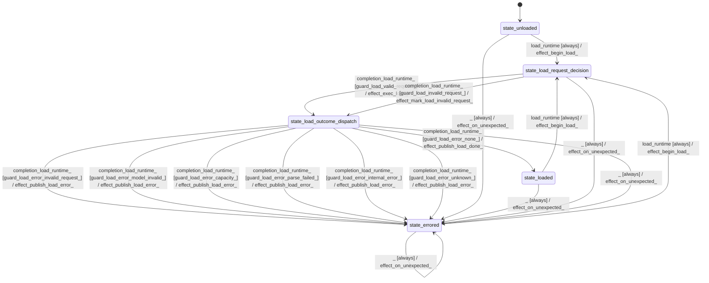

# text_tokenizer_needle

Source: [`emel/text/tokenizer/needle/sm.hpp`](https://github.com/stateforward/emel.cpp/blob/main/src/emel/text/tokenizer/needle/sm.hpp)

## Mermaid

## Transitions

| Source | Event | Guard | Action | Target |
| --- | --- | --- | --- | --- |
| [`state_unloaded`](https://github.com/stateforward/emel.cpp/blob/main/src/emel/text/tokenizer/needle/sm.hpp) | [`load_runtime`](https://github.com/stateforward/emel.cpp/blob/main/src/emel/text/tokenizer/needle/sm.hpp) | [`always`](https://github.com/stateforward/emel.cpp/blob/main/src/emel/text/tokenizer/needle/sm.hpp) | [`effect_begin_load>`](https://github.com/stateforward/emel.cpp/blob/main/src/emel/text/tokenizer/needle/sm.hpp) | [`state_load_request_decision`](https://github.com/stateforward/emel.cpp/blob/main/src/emel/text/tokenizer/needle/sm.hpp) |
| [`state_loaded`](https://github.com/stateforward/emel.cpp/blob/main/src/emel/text/tokenizer/needle/sm.hpp) | [`load_runtime`](https://github.com/stateforward/emel.cpp/blob/main/src/emel/text/tokenizer/needle/sm.hpp) | [`always`](https://github.com/stateforward/emel.cpp/blob/main/src/emel/text/tokenizer/needle/sm.hpp) | [`effect_begin_load>`](https://github.com/stateforward/emel.cpp/blob/main/src/emel/text/tokenizer/needle/sm.hpp) | [`state_load_request_decision`](https://github.com/stateforward/emel.cpp/blob/main/src/emel/text/tokenizer/needle/sm.hpp) |
| [`state_errored`](https://github.com/stateforward/emel.cpp/blob/main/src/emel/text/tokenizer/needle/sm.hpp) | [`load_runtime`](https://github.com/stateforward/emel.cpp/blob/main/src/emel/text/tokenizer/needle/sm.hpp) | [`always`](https://github.com/stateforward/emel.cpp/blob/main/src/emel/text/tokenizer/needle/sm.hpp) | [`effect_begin_load>`](https://github.com/stateforward/emel.cpp/blob/main/src/emel/text/tokenizer/needle/sm.hpp) | [`state_load_request_decision`](https://github.com/stateforward/emel.cpp/blob/main/src/emel/text/tokenizer/needle/sm.hpp) |
| [`state_load_request_decision`](https://github.com/stateforward/emel.cpp/blob/main/src/emel/text/tokenizer/needle/sm.hpp) | [`completion<load_runtime>`](https://github.com/stateforward/emel.cpp/blob/main/src/emel/text/tokenizer/needle/sm.hpp) | [`guard_load_valid_request>`](https://github.com/stateforward/emel.cpp/blob/main/src/emel/text/tokenizer/needle/sm.hpp) | [`effect_exec_load>`](https://github.com/stateforward/emel.cpp/blob/main/src/emel/text/tokenizer/needle/sm.hpp) | [`state_load_outcome_dispatch`](https://github.com/stateforward/emel.cpp/blob/main/src/emel/text/tokenizer/needle/sm.hpp) |
| [`state_load_request_decision`](https://github.com/stateforward/emel.cpp/blob/main/src/emel/text/tokenizer/needle/sm.hpp) | [`completion<load_runtime>`](https://github.com/stateforward/emel.cpp/blob/main/src/emel/text/tokenizer/needle/sm.hpp) | [`guard_load_invalid_request>`](https://github.com/stateforward/emel.cpp/blob/main/src/emel/text/tokenizer/needle/sm.hpp) | [`effect_mark_load_invalid_request>`](https://github.com/stateforward/emel.cpp/blob/main/src/emel/text/tokenizer/needle/sm.hpp) | [`state_load_outcome_dispatch`](https://github.com/stateforward/emel.cpp/blob/main/src/emel/text/tokenizer/needle/sm.hpp) |
| [`state_load_outcome_dispatch`](https://github.com/stateforward/emel.cpp/blob/main/src/emel/text/tokenizer/needle/sm.hpp) | [`completion<load_runtime>`](https://github.com/stateforward/emel.cpp/blob/main/src/emel/text/tokenizer/needle/sm.hpp) | [`guard_load_error_none>`](https://github.com/stateforward/emel.cpp/blob/main/src/emel/text/tokenizer/needle/sm.hpp) | [`effect_publish_load_done>`](https://github.com/stateforward/emel.cpp/blob/main/src/emel/text/tokenizer/needle/sm.hpp) | [`state_loaded`](https://github.com/stateforward/emel.cpp/blob/main/src/emel/text/tokenizer/needle/sm.hpp) |
| [`state_load_outcome_dispatch`](https://github.com/stateforward/emel.cpp/blob/main/src/emel/text/tokenizer/needle/sm.hpp) | [`completion<load_runtime>`](https://github.com/stateforward/emel.cpp/blob/main/src/emel/text/tokenizer/needle/sm.hpp) | [`guard_load_error_invalid_request>`](https://github.com/stateforward/emel.cpp/blob/main/src/emel/text/tokenizer/needle/sm.hpp) | [`effect_publish_load_error>`](https://github.com/stateforward/emel.cpp/blob/main/src/emel/text/tokenizer/needle/sm.hpp) | [`state_errored`](https://github.com/stateforward/emel.cpp/blob/main/src/emel/text/tokenizer/needle/sm.hpp) |
| [`state_load_outcome_dispatch`](https://github.com/stateforward/emel.cpp/blob/main/src/emel/text/tokenizer/needle/sm.hpp) | [`completion<load_runtime>`](https://github.com/stateforward/emel.cpp/blob/main/src/emel/text/tokenizer/needle/sm.hpp) | [`guard_load_error_model_invalid>`](https://github.com/stateforward/emel.cpp/blob/main/src/emel/text/tokenizer/needle/sm.hpp) | [`effect_publish_load_error>`](https://github.com/stateforward/emel.cpp/blob/main/src/emel/text/tokenizer/needle/sm.hpp) | [`state_errored`](https://github.com/stateforward/emel.cpp/blob/main/src/emel/text/tokenizer/needle/sm.hpp) |
| [`state_load_outcome_dispatch`](https://github.com/stateforward/emel.cpp/blob/main/src/emel/text/tokenizer/needle/sm.hpp) | [`completion<load_runtime>`](https://github.com/stateforward/emel.cpp/blob/main/src/emel/text/tokenizer/needle/sm.hpp) | [`guard_load_error_capacity>`](https://github.com/stateforward/emel.cpp/blob/main/src/emel/text/tokenizer/needle/sm.hpp) | [`effect_publish_load_error>`](https://github.com/stateforward/emel.cpp/blob/main/src/emel/text/tokenizer/needle/sm.hpp) | [`state_errored`](https://github.com/stateforward/emel.cpp/blob/main/src/emel/text/tokenizer/needle/sm.hpp) |
| [`state_load_outcome_dispatch`](https://github.com/stateforward/emel.cpp/blob/main/src/emel/text/tokenizer/needle/sm.hpp) | [`completion<load_runtime>`](https://github.com/stateforward/emel.cpp/blob/main/src/emel/text/tokenizer/needle/sm.hpp) | [`guard_load_error_parse_failed>`](https://github.com/stateforward/emel.cpp/blob/main/src/emel/text/tokenizer/needle/sm.hpp) | [`effect_publish_load_error>`](https://github.com/stateforward/emel.cpp/blob/main/src/emel/text/tokenizer/needle/sm.hpp) | [`state_errored`](https://github.com/stateforward/emel.cpp/blob/main/src/emel/text/tokenizer/needle/sm.hpp) |
| [`state_load_outcome_dispatch`](https://github.com/stateforward/emel.cpp/blob/main/src/emel/text/tokenizer/needle/sm.hpp) | [`completion<load_runtime>`](https://github.com/stateforward/emel.cpp/blob/main/src/emel/text/tokenizer/needle/sm.hpp) | [`guard_load_error_internal_error>`](https://github.com/stateforward/emel.cpp/blob/main/src/emel/text/tokenizer/needle/sm.hpp) | [`effect_publish_load_error>`](https://github.com/stateforward/emel.cpp/blob/main/src/emel/text/tokenizer/needle/sm.hpp) | [`state_errored`](https://github.com/stateforward/emel.cpp/blob/main/src/emel/text/tokenizer/needle/sm.hpp) |
| [`state_load_outcome_dispatch`](https://github.com/stateforward/emel.cpp/blob/main/src/emel/text/tokenizer/needle/sm.hpp) | [`completion<load_runtime>`](https://github.com/stateforward/emel.cpp/blob/main/src/emel/text/tokenizer/needle/sm.hpp) | [`guard_load_error_unknown>`](https://github.com/stateforward/emel.cpp/blob/main/src/emel/text/tokenizer/needle/sm.hpp) | [`effect_publish_load_error>`](https://github.com/stateforward/emel.cpp/blob/main/src/emel/text/tokenizer/needle/sm.hpp) | [`state_errored`](https://github.com/stateforward/emel.cpp/blob/main/src/emel/text/tokenizer/needle/sm.hpp) |
| [`state_unloaded`](https://github.com/stateforward/emel.cpp/blob/main/src/emel/text/tokenizer/needle/sm.hpp) | [`_`](https://github.com/stateforward/emel.cpp/blob/main/src/emel/text/tokenizer/needle/sm.hpp) | [`always`](https://github.com/stateforward/emel.cpp/blob/main/src/emel/text/tokenizer/needle/sm.hpp) | [`effect_on_unexpected>`](https://github.com/stateforward/emel.cpp/blob/main/src/emel/text/tokenizer/needle/sm.hpp) | [`state_errored`](https://github.com/stateforward/emel.cpp/blob/main/src/emel/text/tokenizer/needle/sm.hpp) |
| [`state_loaded`](https://github.com/stateforward/emel.cpp/blob/main/src/emel/text/tokenizer/needle/sm.hpp) | [`_`](https://github.com/stateforward/emel.cpp/blob/main/src/emel/text/tokenizer/needle/sm.hpp) | [`always`](https://github.com/stateforward/emel.cpp/blob/main/src/emel/text/tokenizer/needle/sm.hpp) | [`effect_on_unexpected>`](https://github.com/stateforward/emel.cpp/blob/main/src/emel/text/tokenizer/needle/sm.hpp) | [`state_errored`](https://github.com/stateforward/emel.cpp/blob/main/src/emel/text/tokenizer/needle/sm.hpp) |
| [`state_errored`](https://github.com/stateforward/emel.cpp/blob/main/src/emel/text/tokenizer/needle/sm.hpp) | [`_`](https://github.com/stateforward/emel.cpp/blob/main/src/emel/text/tokenizer/needle/sm.hpp) | [`always`](https://github.com/stateforward/emel.cpp/blob/main/src/emel/text/tokenizer/needle/sm.hpp) | [`effect_on_unexpected>`](https://github.com/stateforward/emel.cpp/blob/main/src/emel/text/tokenizer/needle/sm.hpp) | [`state_errored`](https://github.com/stateforward/emel.cpp/blob/main/src/emel/text/tokenizer/needle/sm.hpp) |
| [`state_load_request_decision`](https://github.com/stateforward/emel.cpp/blob/main/src/emel/text/tokenizer/needle/sm.hpp) | [`_`](https://github.com/stateforward/emel.cpp/blob/main/src/emel/text/tokenizer/needle/sm.hpp) | [`always`](https://github.com/stateforward/emel.cpp/blob/main/src/emel/text/tokenizer/needle/sm.hpp) | [`effect_on_unexpected>`](https://github.com/stateforward/emel.cpp/blob/main/src/emel/text/tokenizer/needle/sm.hpp) | [`state_errored`](https://github.com/stateforward/emel.cpp/blob/main/src/emel/text/tokenizer/needle/sm.hpp) |
| [`state_load_outcome_dispatch`](https://github.com/stateforward/emel.cpp/blob/main/src/emel/text/tokenizer/needle/sm.hpp) | [`_`](https://github.com/stateforward/emel.cpp/blob/main/src/emel/text/tokenizer/needle/sm.hpp) | [`always`](https://github.com/stateforward/emel.cpp/blob/main/src/emel/text/tokenizer/needle/sm.hpp) | [`effect_on_unexpected>`](https://github.com/stateforward/emel.cpp/blob/main/src/emel/text/tokenizer/needle/sm.hpp) | [`state_errored`](https://github.com/stateforward/emel.cpp/blob/main/src/emel/text/tokenizer/needle/sm.hpp) |
