# text_tokenizer_preprocessor_plamo2

Source: [`emel/text/tokenizer/preprocessor/plamo2/sm.hpp`](https://github.com/stateforward/emel.cpp/blob/main/src/emel/text/tokenizer/preprocessor/plamo2/sm.hpp)

## Mermaid

```mermaid
stateDiagram-v2
  direction TB
  [*] --> idle
  idle --> request_buffer_decision : preprocess_runtime [always] / none
  done --> request_buffer_decision : preprocess_runtime [always] / none
  errored --> request_buffer_decision : preprocess_runtime [always] / none
  unexpected --> request_buffer_decision : preprocess_runtime [always] / none
  request_buffer_decision --> request_capacity_nonzero_decision : completion_preprocess_runtime_ [fragments_buffer_present_] / none
  request_buffer_decision --> errored : completion_preprocess_runtime_ [fragments_buffer_missing_] / reject_invalid_
  request_buffer_decision --> errored : completion_preprocess_runtime_ [always] / reject_invalid_
  request_capacity_nonzero_decision --> request_capacity_limit_decision : completion_preprocess_runtime_ [fragments_capacity_nonzero_] / none
  request_capacity_nonzero_decision --> errored : completion_preprocess_runtime_ [fragments_capacity_zero_] / reject_invalid_
  request_capacity_nonzero_decision --> errored : completion_preprocess_runtime_ [always] / reject_invalid_
  request_capacity_limit_decision --> preparing : completion_preprocess_runtime_ [fragments_capacity_within_limit_] / begin_preprocess_
  request_capacity_limit_decision --> errored : completion_preprocess_runtime_ [fragments_capacity_exceeds_limit_] / reject_invalid_
  request_capacity_limit_decision --> errored : completion_preprocess_runtime_ [always] / reject_invalid_
  preparing --> build_specials_decision : completion_preprocess_runtime_ [always] / build_specials_
  build_specials_decision --> partition_specials_decision : completion_preprocess_runtime_ [build_specials_ok_] / none
  build_specials_decision --> errored : completion_preprocess_runtime_ [build_specials_invalid_request_error_] / ensure_last_error_
  build_specials_decision --> errored : completion_preprocess_runtime_ [build_specials_backend_error_] / ensure_last_error_
  build_specials_decision --> errored : completion_preprocess_runtime_ [build_specials_unknown_error_] / ensure_last_error_
  partition_specials_decision --> partitioning_no_specials_input_decision : completion_preprocess_runtime_ [no_specials_] / none
  partition_specials_decision --> partition_parse_special_decision : completion_preprocess_runtime_ [has_specials_] / none
  partition_specials_decision --> errored : completion_preprocess_runtime_ [always] / ensure_last_error_
  partition_parse_special_decision --> partitioning_non_bpe_parse_input_decision : completion_preprocess_runtime_ [parse_special_enabled_] / none
  partition_parse_special_decision --> partitioning_non_bpe_skip_input_decision : completion_preprocess_runtime_ [parse_special_disabled_] / none
  partition_parse_special_decision --> errored : completion_preprocess_runtime_ [always] / ensure_last_error_
  partitioning_no_specials_input_decision --> partition_decision : completion_preprocess_runtime_ [request_text_empty_] / set_empty_partition_result_
  partitioning_no_specials_input_decision --> partitioning_no_specials : completion_preprocess_runtime_ [request_text_nonempty_] / none
  partitioning_no_specials_input_decision --> errored : completion_preprocess_runtime_ [always] / ensure_last_error_
  partitioning_non_bpe_parse_input_decision --> partition_decision : completion_preprocess_runtime_ [request_text_empty_] / set_empty_partition_result_
  partitioning_non_bpe_parse_input_decision --> partitioning_non_bpe_parse_special : completion_preprocess_runtime_ [request_text_nonempty_] / none
  partitioning_non_bpe_parse_input_decision --> errored : completion_preprocess_runtime_ [always] / ensure_last_error_
  partitioning_non_bpe_skip_input_decision --> partition_decision : completion_preprocess_runtime_ [request_text_empty_] / set_empty_partition_result_
  partitioning_non_bpe_skip_input_decision --> partitioning_non_bpe_skip_special : completion_preprocess_runtime_ [request_text_nonempty_] / none
  partitioning_non_bpe_skip_input_decision --> errored : completion_preprocess_runtime_ [always] / ensure_last_error_
  partitioning_no_specials --> partition_decision : completion_preprocess_runtime_ [always] / partition_no_specials_
  partitioning_non_bpe_parse_special --> partition_decision : completion_preprocess_runtime_ [always] / partition_non_bpe_parse_special_
  partitioning_non_bpe_skip_special --> partition_decision : completion_preprocess_runtime_ [always] / partition_non_bpe_skip_special_
  partition_decision --> done : completion_preprocess_runtime_ [partition_ok_] / mark_done_
  partition_decision --> errored : completion_preprocess_runtime_ [partition_invalid_request_error_] / ensure_last_error_
  partition_decision --> errored : completion_preprocess_runtime_ [partition_backend_error_] / ensure_last_error_
  partition_decision --> errored : completion_preprocess_runtime_ [partition_unknown_error_] / ensure_last_error_
  idle --> unexpected : _ [always] / on_unexpected_
  request_buffer_decision --> unexpected : _ [always] / on_unexpected_
  request_capacity_nonzero_decision --> unexpected : _ [always] / on_unexpected_
  request_capacity_limit_decision --> unexpected : _ [always] / on_unexpected_
  preparing --> unexpected : _ [always] / on_unexpected_
  build_specials_decision --> unexpected : _ [always] / on_unexpected_
  partition_specials_decision --> unexpected : _ [always] / on_unexpected_
  partition_parse_special_decision --> unexpected : _ [always] / on_unexpected_
  partitioning_no_specials_input_decision --> unexpected : _ [always] / on_unexpected_
  partitioning_non_bpe_parse_input_decision --> unexpected : _ [always] / on_unexpected_
  partitioning_non_bpe_skip_input_decision --> unexpected : _ [always] / on_unexpected_
  partitioning_no_specials --> unexpected : _ [always] / on_unexpected_
  partitioning_non_bpe_parse_special --> unexpected : _ [always] / on_unexpected_
  partitioning_non_bpe_skip_special --> unexpected : _ [always] / on_unexpected_
  partition_decision --> unexpected : _ [always] / on_unexpected_
  done --> unexpected : _ [always] / on_unexpected_
  errored --> unexpected : _ [always] / on_unexpected_
  unexpected --> unexpected : _ [always] / on_unexpected_
```

## Transitions

| Source | Event | Guard | Action | Target |
| --- | --- | --- | --- | --- |
| [`idle`](https://github.com/stateforward/emel.cpp/blob/main/src/emel/text/tokenizer/preprocessor/plamo2/sm.hpp) | [`preprocess_runtime`](https://github.com/stateforward/emel.cpp/blob/main/src/emel/text/tokenizer/preprocessor/plamo2/sm.hpp) | [`always`](https://github.com/stateforward/emel.cpp/blob/main/src/emel/text/tokenizer/preprocessor/plamo2/sm.hpp) | [`none`](https://github.com/stateforward/emel.cpp/blob/main/src/emel/text/tokenizer/preprocessor/plamo2/sm.hpp) | [`request_buffer_decision`](https://github.com/stateforward/emel.cpp/blob/main/src/emel/text/tokenizer/preprocessor/plamo2/sm.hpp) |
| [`done`](https://github.com/stateforward/emel.cpp/blob/main/src/emel/text/tokenizer/preprocessor/plamo2/sm.hpp) | [`preprocess_runtime`](https://github.com/stateforward/emel.cpp/blob/main/src/emel/text/tokenizer/preprocessor/plamo2/sm.hpp) | [`always`](https://github.com/stateforward/emel.cpp/blob/main/src/emel/text/tokenizer/preprocessor/plamo2/sm.hpp) | [`none`](https://github.com/stateforward/emel.cpp/blob/main/src/emel/text/tokenizer/preprocessor/plamo2/sm.hpp) | [`request_buffer_decision`](https://github.com/stateforward/emel.cpp/blob/main/src/emel/text/tokenizer/preprocessor/plamo2/sm.hpp) |
| [`errored`](https://github.com/stateforward/emel.cpp/blob/main/src/emel/text/tokenizer/preprocessor/plamo2/sm.hpp) | [`preprocess_runtime`](https://github.com/stateforward/emel.cpp/blob/main/src/emel/text/tokenizer/preprocessor/plamo2/sm.hpp) | [`always`](https://github.com/stateforward/emel.cpp/blob/main/src/emel/text/tokenizer/preprocessor/plamo2/sm.hpp) | [`none`](https://github.com/stateforward/emel.cpp/blob/main/src/emel/text/tokenizer/preprocessor/plamo2/sm.hpp) | [`request_buffer_decision`](https://github.com/stateforward/emel.cpp/blob/main/src/emel/text/tokenizer/preprocessor/plamo2/sm.hpp) |
| [`unexpected`](https://github.com/stateforward/emel.cpp/blob/main/src/emel/text/tokenizer/preprocessor/plamo2/sm.hpp) | [`preprocess_runtime`](https://github.com/stateforward/emel.cpp/blob/main/src/emel/text/tokenizer/preprocessor/plamo2/sm.hpp) | [`always`](https://github.com/stateforward/emel.cpp/blob/main/src/emel/text/tokenizer/preprocessor/plamo2/sm.hpp) | [`none`](https://github.com/stateforward/emel.cpp/blob/main/src/emel/text/tokenizer/preprocessor/plamo2/sm.hpp) | [`request_buffer_decision`](https://github.com/stateforward/emel.cpp/blob/main/src/emel/text/tokenizer/preprocessor/plamo2/sm.hpp) |
| [`request_buffer_decision`](https://github.com/stateforward/emel.cpp/blob/main/src/emel/text/tokenizer/preprocessor/plamo2/sm.hpp) | [`completion<preprocess_runtime>`](https://github.com/stateforward/emel.cpp/blob/main/src/emel/text/tokenizer/preprocessor/plamo2/sm.hpp) | [`fragments_buffer_present>`](https://github.com/stateforward/emel.cpp/blob/main/src/emel/text/tokenizer/preprocessor/plamo2/sm.hpp) | [`none`](https://github.com/stateforward/emel.cpp/blob/main/src/emel/text/tokenizer/preprocessor/plamo2/sm.hpp) | [`request_capacity_nonzero_decision`](https://github.com/stateforward/emel.cpp/blob/main/src/emel/text/tokenizer/preprocessor/plamo2/sm.hpp) |
| [`request_buffer_decision`](https://github.com/stateforward/emel.cpp/blob/main/src/emel/text/tokenizer/preprocessor/plamo2/sm.hpp) | [`completion<preprocess_runtime>`](https://github.com/stateforward/emel.cpp/blob/main/src/emel/text/tokenizer/preprocessor/plamo2/sm.hpp) | [`fragments_buffer_missing>`](https://github.com/stateforward/emel.cpp/blob/main/src/emel/text/tokenizer/preprocessor/plamo2/sm.hpp) | [`reject_invalid>`](https://github.com/stateforward/emel.cpp/blob/main/src/emel/text/tokenizer/preprocessor/plamo2/sm.hpp) | [`errored`](https://github.com/stateforward/emel.cpp/blob/main/src/emel/text/tokenizer/preprocessor/plamo2/sm.hpp) |
| [`request_buffer_decision`](https://github.com/stateforward/emel.cpp/blob/main/src/emel/text/tokenizer/preprocessor/plamo2/sm.hpp) | [`completion<preprocess_runtime>`](https://github.com/stateforward/emel.cpp/blob/main/src/emel/text/tokenizer/preprocessor/plamo2/sm.hpp) | [`always`](https://github.com/stateforward/emel.cpp/blob/main/src/emel/text/tokenizer/preprocessor/plamo2/sm.hpp) | [`reject_invalid>`](https://github.com/stateforward/emel.cpp/blob/main/src/emel/text/tokenizer/preprocessor/plamo2/sm.hpp) | [`errored`](https://github.com/stateforward/emel.cpp/blob/main/src/emel/text/tokenizer/preprocessor/plamo2/sm.hpp) |
| [`request_capacity_nonzero_decision`](https://github.com/stateforward/emel.cpp/blob/main/src/emel/text/tokenizer/preprocessor/plamo2/sm.hpp) | [`completion<preprocess_runtime>`](https://github.com/stateforward/emel.cpp/blob/main/src/emel/text/tokenizer/preprocessor/plamo2/sm.hpp) | [`fragments_capacity_nonzero>`](https://github.com/stateforward/emel.cpp/blob/main/src/emel/text/tokenizer/preprocessor/plamo2/sm.hpp) | [`none`](https://github.com/stateforward/emel.cpp/blob/main/src/emel/text/tokenizer/preprocessor/plamo2/sm.hpp) | [`request_capacity_limit_decision`](https://github.com/stateforward/emel.cpp/blob/main/src/emel/text/tokenizer/preprocessor/plamo2/sm.hpp) |
| [`request_capacity_nonzero_decision`](https://github.com/stateforward/emel.cpp/blob/main/src/emel/text/tokenizer/preprocessor/plamo2/sm.hpp) | [`completion<preprocess_runtime>`](https://github.com/stateforward/emel.cpp/blob/main/src/emel/text/tokenizer/preprocessor/plamo2/sm.hpp) | [`fragments_capacity_zero>`](https://github.com/stateforward/emel.cpp/blob/main/src/emel/text/tokenizer/preprocessor/plamo2/sm.hpp) | [`reject_invalid>`](https://github.com/stateforward/emel.cpp/blob/main/src/emel/text/tokenizer/preprocessor/plamo2/sm.hpp) | [`errored`](https://github.com/stateforward/emel.cpp/blob/main/src/emel/text/tokenizer/preprocessor/plamo2/sm.hpp) |
| [`request_capacity_nonzero_decision`](https://github.com/stateforward/emel.cpp/blob/main/src/emel/text/tokenizer/preprocessor/plamo2/sm.hpp) | [`completion<preprocess_runtime>`](https://github.com/stateforward/emel.cpp/blob/main/src/emel/text/tokenizer/preprocessor/plamo2/sm.hpp) | [`always`](https://github.com/stateforward/emel.cpp/blob/main/src/emel/text/tokenizer/preprocessor/plamo2/sm.hpp) | [`reject_invalid>`](https://github.com/stateforward/emel.cpp/blob/main/src/emel/text/tokenizer/preprocessor/plamo2/sm.hpp) | [`errored`](https://github.com/stateforward/emel.cpp/blob/main/src/emel/text/tokenizer/preprocessor/plamo2/sm.hpp) |
| [`request_capacity_limit_decision`](https://github.com/stateforward/emel.cpp/blob/main/src/emel/text/tokenizer/preprocessor/plamo2/sm.hpp) | [`completion<preprocess_runtime>`](https://github.com/stateforward/emel.cpp/blob/main/src/emel/text/tokenizer/preprocessor/plamo2/sm.hpp) | [`fragments_capacity_within_limit>`](https://github.com/stateforward/emel.cpp/blob/main/src/emel/text/tokenizer/preprocessor/plamo2/sm.hpp) | [`begin_preprocess>`](https://github.com/stateforward/emel.cpp/blob/main/src/emel/text/tokenizer/preprocessor/plamo2/sm.hpp) | [`preparing`](https://github.com/stateforward/emel.cpp/blob/main/src/emel/text/tokenizer/preprocessor/plamo2/sm.hpp) |
| [`request_capacity_limit_decision`](https://github.com/stateforward/emel.cpp/blob/main/src/emel/text/tokenizer/preprocessor/plamo2/sm.hpp) | [`completion<preprocess_runtime>`](https://github.com/stateforward/emel.cpp/blob/main/src/emel/text/tokenizer/preprocessor/plamo2/sm.hpp) | [`fragments_capacity_exceeds_limit>`](https://github.com/stateforward/emel.cpp/blob/main/src/emel/text/tokenizer/preprocessor/plamo2/sm.hpp) | [`reject_invalid>`](https://github.com/stateforward/emel.cpp/blob/main/src/emel/text/tokenizer/preprocessor/plamo2/sm.hpp) | [`errored`](https://github.com/stateforward/emel.cpp/blob/main/src/emel/text/tokenizer/preprocessor/plamo2/sm.hpp) |
| [`request_capacity_limit_decision`](https://github.com/stateforward/emel.cpp/blob/main/src/emel/text/tokenizer/preprocessor/plamo2/sm.hpp) | [`completion<preprocess_runtime>`](https://github.com/stateforward/emel.cpp/blob/main/src/emel/text/tokenizer/preprocessor/plamo2/sm.hpp) | [`always`](https://github.com/stateforward/emel.cpp/blob/main/src/emel/text/tokenizer/preprocessor/plamo2/sm.hpp) | [`reject_invalid>`](https://github.com/stateforward/emel.cpp/blob/main/src/emel/text/tokenizer/preprocessor/plamo2/sm.hpp) | [`errored`](https://github.com/stateforward/emel.cpp/blob/main/src/emel/text/tokenizer/preprocessor/plamo2/sm.hpp) |
| [`preparing`](https://github.com/stateforward/emel.cpp/blob/main/src/emel/text/tokenizer/preprocessor/plamo2/sm.hpp) | [`completion<preprocess_runtime>`](https://github.com/stateforward/emel.cpp/blob/main/src/emel/text/tokenizer/preprocessor/plamo2/sm.hpp) | [`always`](https://github.com/stateforward/emel.cpp/blob/main/src/emel/text/tokenizer/preprocessor/plamo2/sm.hpp) | [`build_specials>`](https://github.com/stateforward/emel.cpp/blob/main/src/emel/text/tokenizer/preprocessor/plamo2/sm.hpp) | [`build_specials_decision`](https://github.com/stateforward/emel.cpp/blob/main/src/emel/text/tokenizer/preprocessor/plamo2/sm.hpp) |
| [`build_specials_decision`](https://github.com/stateforward/emel.cpp/blob/main/src/emel/text/tokenizer/preprocessor/plamo2/sm.hpp) | [`completion<preprocess_runtime>`](https://github.com/stateforward/emel.cpp/blob/main/src/emel/text/tokenizer/preprocessor/plamo2/sm.hpp) | [`build_specials_ok>`](https://github.com/stateforward/emel.cpp/blob/main/src/emel/text/tokenizer/preprocessor/plamo2/sm.hpp) | [`none`](https://github.com/stateforward/emel.cpp/blob/main/src/emel/text/tokenizer/preprocessor/plamo2/sm.hpp) | [`partition_specials_decision`](https://github.com/stateforward/emel.cpp/blob/main/src/emel/text/tokenizer/preprocessor/plamo2/sm.hpp) |
| [`build_specials_decision`](https://github.com/stateforward/emel.cpp/blob/main/src/emel/text/tokenizer/preprocessor/plamo2/sm.hpp) | [`completion<preprocess_runtime>`](https://github.com/stateforward/emel.cpp/blob/main/src/emel/text/tokenizer/preprocessor/plamo2/sm.hpp) | [`build_specials_invalid_request_error>`](https://github.com/stateforward/emel.cpp/blob/main/src/emel/text/tokenizer/preprocessor/plamo2/sm.hpp) | [`ensure_last_error>`](https://github.com/stateforward/emel.cpp/blob/main/src/emel/text/tokenizer/preprocessor/plamo2/sm.hpp) | [`errored`](https://github.com/stateforward/emel.cpp/blob/main/src/emel/text/tokenizer/preprocessor/plamo2/sm.hpp) |
| [`build_specials_decision`](https://github.com/stateforward/emel.cpp/blob/main/src/emel/text/tokenizer/preprocessor/plamo2/sm.hpp) | [`completion<preprocess_runtime>`](https://github.com/stateforward/emel.cpp/blob/main/src/emel/text/tokenizer/preprocessor/plamo2/sm.hpp) | [`build_specials_backend_error>`](https://github.com/stateforward/emel.cpp/blob/main/src/emel/text/tokenizer/preprocessor/plamo2/sm.hpp) | [`ensure_last_error>`](https://github.com/stateforward/emel.cpp/blob/main/src/emel/text/tokenizer/preprocessor/plamo2/sm.hpp) | [`errored`](https://github.com/stateforward/emel.cpp/blob/main/src/emel/text/tokenizer/preprocessor/plamo2/sm.hpp) |
| [`build_specials_decision`](https://github.com/stateforward/emel.cpp/blob/main/src/emel/text/tokenizer/preprocessor/plamo2/sm.hpp) | [`completion<preprocess_runtime>`](https://github.com/stateforward/emel.cpp/blob/main/src/emel/text/tokenizer/preprocessor/plamo2/sm.hpp) | [`build_specials_unknown_error>`](https://github.com/stateforward/emel.cpp/blob/main/src/emel/text/tokenizer/preprocessor/plamo2/sm.hpp) | [`ensure_last_error>`](https://github.com/stateforward/emel.cpp/blob/main/src/emel/text/tokenizer/preprocessor/plamo2/sm.hpp) | [`errored`](https://github.com/stateforward/emel.cpp/blob/main/src/emel/text/tokenizer/preprocessor/plamo2/sm.hpp) |
| [`partition_specials_decision`](https://github.com/stateforward/emel.cpp/blob/main/src/emel/text/tokenizer/preprocessor/plamo2/sm.hpp) | [`completion<preprocess_runtime>`](https://github.com/stateforward/emel.cpp/blob/main/src/emel/text/tokenizer/preprocessor/plamo2/sm.hpp) | [`no_specials>`](https://github.com/stateforward/emel.cpp/blob/main/src/emel/text/tokenizer/preprocessor/plamo2/sm.hpp) | [`none`](https://github.com/stateforward/emel.cpp/blob/main/src/emel/text/tokenizer/preprocessor/plamo2/sm.hpp) | [`partitioning_no_specials_input_decision`](https://github.com/stateforward/emel.cpp/blob/main/src/emel/text/tokenizer/preprocessor/plamo2/sm.hpp) |
| [`partition_specials_decision`](https://github.com/stateforward/emel.cpp/blob/main/src/emel/text/tokenizer/preprocessor/plamo2/sm.hpp) | [`completion<preprocess_runtime>`](https://github.com/stateforward/emel.cpp/blob/main/src/emel/text/tokenizer/preprocessor/plamo2/sm.hpp) | [`has_specials>`](https://github.com/stateforward/emel.cpp/blob/main/src/emel/text/tokenizer/preprocessor/plamo2/sm.hpp) | [`none`](https://github.com/stateforward/emel.cpp/blob/main/src/emel/text/tokenizer/preprocessor/plamo2/sm.hpp) | [`partition_parse_special_decision`](https://github.com/stateforward/emel.cpp/blob/main/src/emel/text/tokenizer/preprocessor/plamo2/sm.hpp) |
| [`partition_specials_decision`](https://github.com/stateforward/emel.cpp/blob/main/src/emel/text/tokenizer/preprocessor/plamo2/sm.hpp) | [`completion<preprocess_runtime>`](https://github.com/stateforward/emel.cpp/blob/main/src/emel/text/tokenizer/preprocessor/plamo2/sm.hpp) | [`always`](https://github.com/stateforward/emel.cpp/blob/main/src/emel/text/tokenizer/preprocessor/plamo2/sm.hpp) | [`ensure_last_error>`](https://github.com/stateforward/emel.cpp/blob/main/src/emel/text/tokenizer/preprocessor/plamo2/sm.hpp) | [`errored`](https://github.com/stateforward/emel.cpp/blob/main/src/emel/text/tokenizer/preprocessor/plamo2/sm.hpp) |
| [`partition_parse_special_decision`](https://github.com/stateforward/emel.cpp/blob/main/src/emel/text/tokenizer/preprocessor/plamo2/sm.hpp) | [`completion<preprocess_runtime>`](https://github.com/stateforward/emel.cpp/blob/main/src/emel/text/tokenizer/preprocessor/plamo2/sm.hpp) | [`parse_special_enabled>`](https://github.com/stateforward/emel.cpp/blob/main/src/emel/text/tokenizer/preprocessor/plamo2/sm.hpp) | [`none`](https://github.com/stateforward/emel.cpp/blob/main/src/emel/text/tokenizer/preprocessor/plamo2/sm.hpp) | [`partitioning_non_bpe_parse_input_decision`](https://github.com/stateforward/emel.cpp/blob/main/src/emel/text/tokenizer/preprocessor/plamo2/sm.hpp) |
| [`partition_parse_special_decision`](https://github.com/stateforward/emel.cpp/blob/main/src/emel/text/tokenizer/preprocessor/plamo2/sm.hpp) | [`completion<preprocess_runtime>`](https://github.com/stateforward/emel.cpp/blob/main/src/emel/text/tokenizer/preprocessor/plamo2/sm.hpp) | [`parse_special_disabled>`](https://github.com/stateforward/emel.cpp/blob/main/src/emel/text/tokenizer/preprocessor/plamo2/sm.hpp) | [`none`](https://github.com/stateforward/emel.cpp/blob/main/src/emel/text/tokenizer/preprocessor/plamo2/sm.hpp) | [`partitioning_non_bpe_skip_input_decision`](https://github.com/stateforward/emel.cpp/blob/main/src/emel/text/tokenizer/preprocessor/plamo2/sm.hpp) |
| [`partition_parse_special_decision`](https://github.com/stateforward/emel.cpp/blob/main/src/emel/text/tokenizer/preprocessor/plamo2/sm.hpp) | [`completion<preprocess_runtime>`](https://github.com/stateforward/emel.cpp/blob/main/src/emel/text/tokenizer/preprocessor/plamo2/sm.hpp) | [`always`](https://github.com/stateforward/emel.cpp/blob/main/src/emel/text/tokenizer/preprocessor/plamo2/sm.hpp) | [`ensure_last_error>`](https://github.com/stateforward/emel.cpp/blob/main/src/emel/text/tokenizer/preprocessor/plamo2/sm.hpp) | [`errored`](https://github.com/stateforward/emel.cpp/blob/main/src/emel/text/tokenizer/preprocessor/plamo2/sm.hpp) |
| [`partitioning_no_specials_input_decision`](https://github.com/stateforward/emel.cpp/blob/main/src/emel/text/tokenizer/preprocessor/plamo2/sm.hpp) | [`completion<preprocess_runtime>`](https://github.com/stateforward/emel.cpp/blob/main/src/emel/text/tokenizer/preprocessor/plamo2/sm.hpp) | [`request_text_empty>`](https://github.com/stateforward/emel.cpp/blob/main/src/emel/text/tokenizer/preprocessor/plamo2/sm.hpp) | [`set_empty_partition_result>`](https://github.com/stateforward/emel.cpp/blob/main/src/emel/text/tokenizer/preprocessor/plamo2/sm.hpp) | [`partition_decision`](https://github.com/stateforward/emel.cpp/blob/main/src/emel/text/tokenizer/preprocessor/plamo2/sm.hpp) |
| [`partitioning_no_specials_input_decision`](https://github.com/stateforward/emel.cpp/blob/main/src/emel/text/tokenizer/preprocessor/plamo2/sm.hpp) | [`completion<preprocess_runtime>`](https://github.com/stateforward/emel.cpp/blob/main/src/emel/text/tokenizer/preprocessor/plamo2/sm.hpp) | [`request_text_nonempty>`](https://github.com/stateforward/emel.cpp/blob/main/src/emel/text/tokenizer/preprocessor/plamo2/sm.hpp) | [`none`](https://github.com/stateforward/emel.cpp/blob/main/src/emel/text/tokenizer/preprocessor/plamo2/sm.hpp) | [`partitioning_no_specials`](https://github.com/stateforward/emel.cpp/blob/main/src/emel/text/tokenizer/preprocessor/plamo2/sm.hpp) |
| [`partitioning_no_specials_input_decision`](https://github.com/stateforward/emel.cpp/blob/main/src/emel/text/tokenizer/preprocessor/plamo2/sm.hpp) | [`completion<preprocess_runtime>`](https://github.com/stateforward/emel.cpp/blob/main/src/emel/text/tokenizer/preprocessor/plamo2/sm.hpp) | [`always`](https://github.com/stateforward/emel.cpp/blob/main/src/emel/text/tokenizer/preprocessor/plamo2/sm.hpp) | [`ensure_last_error>`](https://github.com/stateforward/emel.cpp/blob/main/src/emel/text/tokenizer/preprocessor/plamo2/sm.hpp) | [`errored`](https://github.com/stateforward/emel.cpp/blob/main/src/emel/text/tokenizer/preprocessor/plamo2/sm.hpp) |
| [`partitioning_non_bpe_parse_input_decision`](https://github.com/stateforward/emel.cpp/blob/main/src/emel/text/tokenizer/preprocessor/plamo2/sm.hpp) | [`completion<preprocess_runtime>`](https://github.com/stateforward/emel.cpp/blob/main/src/emel/text/tokenizer/preprocessor/plamo2/sm.hpp) | [`request_text_empty>`](https://github.com/stateforward/emel.cpp/blob/main/src/emel/text/tokenizer/preprocessor/plamo2/sm.hpp) | [`set_empty_partition_result>`](https://github.com/stateforward/emel.cpp/blob/main/src/emel/text/tokenizer/preprocessor/plamo2/sm.hpp) | [`partition_decision`](https://github.com/stateforward/emel.cpp/blob/main/src/emel/text/tokenizer/preprocessor/plamo2/sm.hpp) |
| [`partitioning_non_bpe_parse_input_decision`](https://github.com/stateforward/emel.cpp/blob/main/src/emel/text/tokenizer/preprocessor/plamo2/sm.hpp) | [`completion<preprocess_runtime>`](https://github.com/stateforward/emel.cpp/blob/main/src/emel/text/tokenizer/preprocessor/plamo2/sm.hpp) | [`request_text_nonempty>`](https://github.com/stateforward/emel.cpp/blob/main/src/emel/text/tokenizer/preprocessor/plamo2/sm.hpp) | [`none`](https://github.com/stateforward/emel.cpp/blob/main/src/emel/text/tokenizer/preprocessor/plamo2/sm.hpp) | [`partitioning_non_bpe_parse_special`](https://github.com/stateforward/emel.cpp/blob/main/src/emel/text/tokenizer/preprocessor/plamo2/sm.hpp) |
| [`partitioning_non_bpe_parse_input_decision`](https://github.com/stateforward/emel.cpp/blob/main/src/emel/text/tokenizer/preprocessor/plamo2/sm.hpp) | [`completion<preprocess_runtime>`](https://github.com/stateforward/emel.cpp/blob/main/src/emel/text/tokenizer/preprocessor/plamo2/sm.hpp) | [`always`](https://github.com/stateforward/emel.cpp/blob/main/src/emel/text/tokenizer/preprocessor/plamo2/sm.hpp) | [`ensure_last_error>`](https://github.com/stateforward/emel.cpp/blob/main/src/emel/text/tokenizer/preprocessor/plamo2/sm.hpp) | [`errored`](https://github.com/stateforward/emel.cpp/blob/main/src/emel/text/tokenizer/preprocessor/plamo2/sm.hpp) |
| [`partitioning_non_bpe_skip_input_decision`](https://github.com/stateforward/emel.cpp/blob/main/src/emel/text/tokenizer/preprocessor/plamo2/sm.hpp) | [`completion<preprocess_runtime>`](https://github.com/stateforward/emel.cpp/blob/main/src/emel/text/tokenizer/preprocessor/plamo2/sm.hpp) | [`request_text_empty>`](https://github.com/stateforward/emel.cpp/blob/main/src/emel/text/tokenizer/preprocessor/plamo2/sm.hpp) | [`set_empty_partition_result>`](https://github.com/stateforward/emel.cpp/blob/main/src/emel/text/tokenizer/preprocessor/plamo2/sm.hpp) | [`partition_decision`](https://github.com/stateforward/emel.cpp/blob/main/src/emel/text/tokenizer/preprocessor/plamo2/sm.hpp) |
| [`partitioning_non_bpe_skip_input_decision`](https://github.com/stateforward/emel.cpp/blob/main/src/emel/text/tokenizer/preprocessor/plamo2/sm.hpp) | [`completion<preprocess_runtime>`](https://github.com/stateforward/emel.cpp/blob/main/src/emel/text/tokenizer/preprocessor/plamo2/sm.hpp) | [`request_text_nonempty>`](https://github.com/stateforward/emel.cpp/blob/main/src/emel/text/tokenizer/preprocessor/plamo2/sm.hpp) | [`none`](https://github.com/stateforward/emel.cpp/blob/main/src/emel/text/tokenizer/preprocessor/plamo2/sm.hpp) | [`partitioning_non_bpe_skip_special`](https://github.com/stateforward/emel.cpp/blob/main/src/emel/text/tokenizer/preprocessor/plamo2/sm.hpp) |
| [`partitioning_non_bpe_skip_input_decision`](https://github.com/stateforward/emel.cpp/blob/main/src/emel/text/tokenizer/preprocessor/plamo2/sm.hpp) | [`completion<preprocess_runtime>`](https://github.com/stateforward/emel.cpp/blob/main/src/emel/text/tokenizer/preprocessor/plamo2/sm.hpp) | [`always`](https://github.com/stateforward/emel.cpp/blob/main/src/emel/text/tokenizer/preprocessor/plamo2/sm.hpp) | [`ensure_last_error>`](https://github.com/stateforward/emel.cpp/blob/main/src/emel/text/tokenizer/preprocessor/plamo2/sm.hpp) | [`errored`](https://github.com/stateforward/emel.cpp/blob/main/src/emel/text/tokenizer/preprocessor/plamo2/sm.hpp) |
| [`partitioning_no_specials`](https://github.com/stateforward/emel.cpp/blob/main/src/emel/text/tokenizer/preprocessor/plamo2/sm.hpp) | [`completion<preprocess_runtime>`](https://github.com/stateforward/emel.cpp/blob/main/src/emel/text/tokenizer/preprocessor/plamo2/sm.hpp) | [`always`](https://github.com/stateforward/emel.cpp/blob/main/src/emel/text/tokenizer/preprocessor/plamo2/sm.hpp) | [`partition_no_specials>`](https://github.com/stateforward/emel.cpp/blob/main/src/emel/text/tokenizer/preprocessor/plamo2/sm.hpp) | [`partition_decision`](https://github.com/stateforward/emel.cpp/blob/main/src/emel/text/tokenizer/preprocessor/plamo2/sm.hpp) |
| [`partitioning_non_bpe_parse_special`](https://github.com/stateforward/emel.cpp/blob/main/src/emel/text/tokenizer/preprocessor/plamo2/sm.hpp) | [`completion<preprocess_runtime>`](https://github.com/stateforward/emel.cpp/blob/main/src/emel/text/tokenizer/preprocessor/plamo2/sm.hpp) | [`always`](https://github.com/stateforward/emel.cpp/blob/main/src/emel/text/tokenizer/preprocessor/plamo2/sm.hpp) | [`partition_non_bpe_parse_special>`](https://github.com/stateforward/emel.cpp/blob/main/src/emel/text/tokenizer/preprocessor/plamo2/sm.hpp) | [`partition_decision`](https://github.com/stateforward/emel.cpp/blob/main/src/emel/text/tokenizer/preprocessor/plamo2/sm.hpp) |
| [`partitioning_non_bpe_skip_special`](https://github.com/stateforward/emel.cpp/blob/main/src/emel/text/tokenizer/preprocessor/plamo2/sm.hpp) | [`completion<preprocess_runtime>`](https://github.com/stateforward/emel.cpp/blob/main/src/emel/text/tokenizer/preprocessor/plamo2/sm.hpp) | [`always`](https://github.com/stateforward/emel.cpp/blob/main/src/emel/text/tokenizer/preprocessor/plamo2/sm.hpp) | [`partition_non_bpe_skip_special>`](https://github.com/stateforward/emel.cpp/blob/main/src/emel/text/tokenizer/preprocessor/plamo2/sm.hpp) | [`partition_decision`](https://github.com/stateforward/emel.cpp/blob/main/src/emel/text/tokenizer/preprocessor/plamo2/sm.hpp) |
| [`partition_decision`](https://github.com/stateforward/emel.cpp/blob/main/src/emel/text/tokenizer/preprocessor/plamo2/sm.hpp) | [`completion<preprocess_runtime>`](https://github.com/stateforward/emel.cpp/blob/main/src/emel/text/tokenizer/preprocessor/plamo2/sm.hpp) | [`partition_ok>`](https://github.com/stateforward/emel.cpp/blob/main/src/emel/text/tokenizer/preprocessor/plamo2/sm.hpp) | [`mark_done>`](https://github.com/stateforward/emel.cpp/blob/main/src/emel/text/tokenizer/preprocessor/plamo2/sm.hpp) | [`done`](https://github.com/stateforward/emel.cpp/blob/main/src/emel/text/tokenizer/preprocessor/plamo2/sm.hpp) |
| [`partition_decision`](https://github.com/stateforward/emel.cpp/blob/main/src/emel/text/tokenizer/preprocessor/plamo2/sm.hpp) | [`completion<preprocess_runtime>`](https://github.com/stateforward/emel.cpp/blob/main/src/emel/text/tokenizer/preprocessor/plamo2/sm.hpp) | [`partition_invalid_request_error>`](https://github.com/stateforward/emel.cpp/blob/main/src/emel/text/tokenizer/preprocessor/plamo2/sm.hpp) | [`ensure_last_error>`](https://github.com/stateforward/emel.cpp/blob/main/src/emel/text/tokenizer/preprocessor/plamo2/sm.hpp) | [`errored`](https://github.com/stateforward/emel.cpp/blob/main/src/emel/text/tokenizer/preprocessor/plamo2/sm.hpp) |
| [`partition_decision`](https://github.com/stateforward/emel.cpp/blob/main/src/emel/text/tokenizer/preprocessor/plamo2/sm.hpp) | [`completion<preprocess_runtime>`](https://github.com/stateforward/emel.cpp/blob/main/src/emel/text/tokenizer/preprocessor/plamo2/sm.hpp) | [`partition_backend_error>`](https://github.com/stateforward/emel.cpp/blob/main/src/emel/text/tokenizer/preprocessor/plamo2/sm.hpp) | [`ensure_last_error>`](https://github.com/stateforward/emel.cpp/blob/main/src/emel/text/tokenizer/preprocessor/plamo2/sm.hpp) | [`errored`](https://github.com/stateforward/emel.cpp/blob/main/src/emel/text/tokenizer/preprocessor/plamo2/sm.hpp) |
| [`partition_decision`](https://github.com/stateforward/emel.cpp/blob/main/src/emel/text/tokenizer/preprocessor/plamo2/sm.hpp) | [`completion<preprocess_runtime>`](https://github.com/stateforward/emel.cpp/blob/main/src/emel/text/tokenizer/preprocessor/plamo2/sm.hpp) | [`partition_unknown_error>`](https://github.com/stateforward/emel.cpp/blob/main/src/emel/text/tokenizer/preprocessor/plamo2/sm.hpp) | [`ensure_last_error>`](https://github.com/stateforward/emel.cpp/blob/main/src/emel/text/tokenizer/preprocessor/plamo2/sm.hpp) | [`errored`](https://github.com/stateforward/emel.cpp/blob/main/src/emel/text/tokenizer/preprocessor/plamo2/sm.hpp) |
| [`idle`](https://github.com/stateforward/emel.cpp/blob/main/src/emel/text/tokenizer/preprocessor/plamo2/sm.hpp) | [`_`](https://github.com/stateforward/emel.cpp/blob/main/src/emel/text/tokenizer/preprocessor/plamo2/sm.hpp) | [`always`](https://github.com/stateforward/emel.cpp/blob/main/src/emel/text/tokenizer/preprocessor/plamo2/sm.hpp) | [`on_unexpected>`](https://github.com/stateforward/emel.cpp/blob/main/src/emel/text/tokenizer/preprocessor/plamo2/sm.hpp) | [`unexpected`](https://github.com/stateforward/emel.cpp/blob/main/src/emel/text/tokenizer/preprocessor/plamo2/sm.hpp) |
| [`request_buffer_decision`](https://github.com/stateforward/emel.cpp/blob/main/src/emel/text/tokenizer/preprocessor/plamo2/sm.hpp) | [`_`](https://github.com/stateforward/emel.cpp/blob/main/src/emel/text/tokenizer/preprocessor/plamo2/sm.hpp) | [`always`](https://github.com/stateforward/emel.cpp/blob/main/src/emel/text/tokenizer/preprocessor/plamo2/sm.hpp) | [`on_unexpected>`](https://github.com/stateforward/emel.cpp/blob/main/src/emel/text/tokenizer/preprocessor/plamo2/sm.hpp) | [`unexpected`](https://github.com/stateforward/emel.cpp/blob/main/src/emel/text/tokenizer/preprocessor/plamo2/sm.hpp) |
| [`request_capacity_nonzero_decision`](https://github.com/stateforward/emel.cpp/blob/main/src/emel/text/tokenizer/preprocessor/plamo2/sm.hpp) | [`_`](https://github.com/stateforward/emel.cpp/blob/main/src/emel/text/tokenizer/preprocessor/plamo2/sm.hpp) | [`always`](https://github.com/stateforward/emel.cpp/blob/main/src/emel/text/tokenizer/preprocessor/plamo2/sm.hpp) | [`on_unexpected>`](https://github.com/stateforward/emel.cpp/blob/main/src/emel/text/tokenizer/preprocessor/plamo2/sm.hpp) | [`unexpected`](https://github.com/stateforward/emel.cpp/blob/main/src/emel/text/tokenizer/preprocessor/plamo2/sm.hpp) |
| [`request_capacity_limit_decision`](https://github.com/stateforward/emel.cpp/blob/main/src/emel/text/tokenizer/preprocessor/plamo2/sm.hpp) | [`_`](https://github.com/stateforward/emel.cpp/blob/main/src/emel/text/tokenizer/preprocessor/plamo2/sm.hpp) | [`always`](https://github.com/stateforward/emel.cpp/blob/main/src/emel/text/tokenizer/preprocessor/plamo2/sm.hpp) | [`on_unexpected>`](https://github.com/stateforward/emel.cpp/blob/main/src/emel/text/tokenizer/preprocessor/plamo2/sm.hpp) | [`unexpected`](https://github.com/stateforward/emel.cpp/blob/main/src/emel/text/tokenizer/preprocessor/plamo2/sm.hpp) |
| [`preparing`](https://github.com/stateforward/emel.cpp/blob/main/src/emel/text/tokenizer/preprocessor/plamo2/sm.hpp) | [`_`](https://github.com/stateforward/emel.cpp/blob/main/src/emel/text/tokenizer/preprocessor/plamo2/sm.hpp) | [`always`](https://github.com/stateforward/emel.cpp/blob/main/src/emel/text/tokenizer/preprocessor/plamo2/sm.hpp) | [`on_unexpected>`](https://github.com/stateforward/emel.cpp/blob/main/src/emel/text/tokenizer/preprocessor/plamo2/sm.hpp) | [`unexpected`](https://github.com/stateforward/emel.cpp/blob/main/src/emel/text/tokenizer/preprocessor/plamo2/sm.hpp) |
| [`build_specials_decision`](https://github.com/stateforward/emel.cpp/blob/main/src/emel/text/tokenizer/preprocessor/plamo2/sm.hpp) | [`_`](https://github.com/stateforward/emel.cpp/blob/main/src/emel/text/tokenizer/preprocessor/plamo2/sm.hpp) | [`always`](https://github.com/stateforward/emel.cpp/blob/main/src/emel/text/tokenizer/preprocessor/plamo2/sm.hpp) | [`on_unexpected>`](https://github.com/stateforward/emel.cpp/blob/main/src/emel/text/tokenizer/preprocessor/plamo2/sm.hpp) | [`unexpected`](https://github.com/stateforward/emel.cpp/blob/main/src/emel/text/tokenizer/preprocessor/plamo2/sm.hpp) |
| [`partition_specials_decision`](https://github.com/stateforward/emel.cpp/blob/main/src/emel/text/tokenizer/preprocessor/plamo2/sm.hpp) | [`_`](https://github.com/stateforward/emel.cpp/blob/main/src/emel/text/tokenizer/preprocessor/plamo2/sm.hpp) | [`always`](https://github.com/stateforward/emel.cpp/blob/main/src/emel/text/tokenizer/preprocessor/plamo2/sm.hpp) | [`on_unexpected>`](https://github.com/stateforward/emel.cpp/blob/main/src/emel/text/tokenizer/preprocessor/plamo2/sm.hpp) | [`unexpected`](https://github.com/stateforward/emel.cpp/blob/main/src/emel/text/tokenizer/preprocessor/plamo2/sm.hpp) |
| [`partition_parse_special_decision`](https://github.com/stateforward/emel.cpp/blob/main/src/emel/text/tokenizer/preprocessor/plamo2/sm.hpp) | [`_`](https://github.com/stateforward/emel.cpp/blob/main/src/emel/text/tokenizer/preprocessor/plamo2/sm.hpp) | [`always`](https://github.com/stateforward/emel.cpp/blob/main/src/emel/text/tokenizer/preprocessor/plamo2/sm.hpp) | [`on_unexpected>`](https://github.com/stateforward/emel.cpp/blob/main/src/emel/text/tokenizer/preprocessor/plamo2/sm.hpp) | [`unexpected`](https://github.com/stateforward/emel.cpp/blob/main/src/emel/text/tokenizer/preprocessor/plamo2/sm.hpp) |
| [`partitioning_no_specials_input_decision`](https://github.com/stateforward/emel.cpp/blob/main/src/emel/text/tokenizer/preprocessor/plamo2/sm.hpp) | [`_`](https://github.com/stateforward/emel.cpp/blob/main/src/emel/text/tokenizer/preprocessor/plamo2/sm.hpp) | [`always`](https://github.com/stateforward/emel.cpp/blob/main/src/emel/text/tokenizer/preprocessor/plamo2/sm.hpp) | [`on_unexpected>`](https://github.com/stateforward/emel.cpp/blob/main/src/emel/text/tokenizer/preprocessor/plamo2/sm.hpp) | [`unexpected`](https://github.com/stateforward/emel.cpp/blob/main/src/emel/text/tokenizer/preprocessor/plamo2/sm.hpp) |
| [`partitioning_non_bpe_parse_input_decision`](https://github.com/stateforward/emel.cpp/blob/main/src/emel/text/tokenizer/preprocessor/plamo2/sm.hpp) | [`_`](https://github.com/stateforward/emel.cpp/blob/main/src/emel/text/tokenizer/preprocessor/plamo2/sm.hpp) | [`always`](https://github.com/stateforward/emel.cpp/blob/main/src/emel/text/tokenizer/preprocessor/plamo2/sm.hpp) | [`on_unexpected>`](https://github.com/stateforward/emel.cpp/blob/main/src/emel/text/tokenizer/preprocessor/plamo2/sm.hpp) | [`unexpected`](https://github.com/stateforward/emel.cpp/blob/main/src/emel/text/tokenizer/preprocessor/plamo2/sm.hpp) |
| [`partitioning_non_bpe_skip_input_decision`](https://github.com/stateforward/emel.cpp/blob/main/src/emel/text/tokenizer/preprocessor/plamo2/sm.hpp) | [`_`](https://github.com/stateforward/emel.cpp/blob/main/src/emel/text/tokenizer/preprocessor/plamo2/sm.hpp) | [`always`](https://github.com/stateforward/emel.cpp/blob/main/src/emel/text/tokenizer/preprocessor/plamo2/sm.hpp) | [`on_unexpected>`](https://github.com/stateforward/emel.cpp/blob/main/src/emel/text/tokenizer/preprocessor/plamo2/sm.hpp) | [`unexpected`](https://github.com/stateforward/emel.cpp/blob/main/src/emel/text/tokenizer/preprocessor/plamo2/sm.hpp) |
| [`partitioning_no_specials`](https://github.com/stateforward/emel.cpp/blob/main/src/emel/text/tokenizer/preprocessor/plamo2/sm.hpp) | [`_`](https://github.com/stateforward/emel.cpp/blob/main/src/emel/text/tokenizer/preprocessor/plamo2/sm.hpp) | [`always`](https://github.com/stateforward/emel.cpp/blob/main/src/emel/text/tokenizer/preprocessor/plamo2/sm.hpp) | [`on_unexpected>`](https://github.com/stateforward/emel.cpp/blob/main/src/emel/text/tokenizer/preprocessor/plamo2/sm.hpp) | [`unexpected`](https://github.com/stateforward/emel.cpp/blob/main/src/emel/text/tokenizer/preprocessor/plamo2/sm.hpp) |
| [`partitioning_non_bpe_parse_special`](https://github.com/stateforward/emel.cpp/blob/main/src/emel/text/tokenizer/preprocessor/plamo2/sm.hpp) | [`_`](https://github.com/stateforward/emel.cpp/blob/main/src/emel/text/tokenizer/preprocessor/plamo2/sm.hpp) | [`always`](https://github.com/stateforward/emel.cpp/blob/main/src/emel/text/tokenizer/preprocessor/plamo2/sm.hpp) | [`on_unexpected>`](https://github.com/stateforward/emel.cpp/blob/main/src/emel/text/tokenizer/preprocessor/plamo2/sm.hpp) | [`unexpected`](https://github.com/stateforward/emel.cpp/blob/main/src/emel/text/tokenizer/preprocessor/plamo2/sm.hpp) |
| [`partitioning_non_bpe_skip_special`](https://github.com/stateforward/emel.cpp/blob/main/src/emel/text/tokenizer/preprocessor/plamo2/sm.hpp) | [`_`](https://github.com/stateforward/emel.cpp/blob/main/src/emel/text/tokenizer/preprocessor/plamo2/sm.hpp) | [`always`](https://github.com/stateforward/emel.cpp/blob/main/src/emel/text/tokenizer/preprocessor/plamo2/sm.hpp) | [`on_unexpected>`](https://github.com/stateforward/emel.cpp/blob/main/src/emel/text/tokenizer/preprocessor/plamo2/sm.hpp) | [`unexpected`](https://github.com/stateforward/emel.cpp/blob/main/src/emel/text/tokenizer/preprocessor/plamo2/sm.hpp) |
| [`partition_decision`](https://github.com/stateforward/emel.cpp/blob/main/src/emel/text/tokenizer/preprocessor/plamo2/sm.hpp) | [`_`](https://github.com/stateforward/emel.cpp/blob/main/src/emel/text/tokenizer/preprocessor/plamo2/sm.hpp) | [`always`](https://github.com/stateforward/emel.cpp/blob/main/src/emel/text/tokenizer/preprocessor/plamo2/sm.hpp) | [`on_unexpected>`](https://github.com/stateforward/emel.cpp/blob/main/src/emel/text/tokenizer/preprocessor/plamo2/sm.hpp) | [`unexpected`](https://github.com/stateforward/emel.cpp/blob/main/src/emel/text/tokenizer/preprocessor/plamo2/sm.hpp) |
| [`done`](https://github.com/stateforward/emel.cpp/blob/main/src/emel/text/tokenizer/preprocessor/plamo2/sm.hpp) | [`_`](https://github.com/stateforward/emel.cpp/blob/main/src/emel/text/tokenizer/preprocessor/plamo2/sm.hpp) | [`always`](https://github.com/stateforward/emel.cpp/blob/main/src/emel/text/tokenizer/preprocessor/plamo2/sm.hpp) | [`on_unexpected>`](https://github.com/stateforward/emel.cpp/blob/main/src/emel/text/tokenizer/preprocessor/plamo2/sm.hpp) | [`unexpected`](https://github.com/stateforward/emel.cpp/blob/main/src/emel/text/tokenizer/preprocessor/plamo2/sm.hpp) |
| [`errored`](https://github.com/stateforward/emel.cpp/blob/main/src/emel/text/tokenizer/preprocessor/plamo2/sm.hpp) | [`_`](https://github.com/stateforward/emel.cpp/blob/main/src/emel/text/tokenizer/preprocessor/plamo2/sm.hpp) | [`always`](https://github.com/stateforward/emel.cpp/blob/main/src/emel/text/tokenizer/preprocessor/plamo2/sm.hpp) | [`on_unexpected>`](https://github.com/stateforward/emel.cpp/blob/main/src/emel/text/tokenizer/preprocessor/plamo2/sm.hpp) | [`unexpected`](https://github.com/stateforward/emel.cpp/blob/main/src/emel/text/tokenizer/preprocessor/plamo2/sm.hpp) |
| [`unexpected`](https://github.com/stateforward/emel.cpp/blob/main/src/emel/text/tokenizer/preprocessor/plamo2/sm.hpp) | [`_`](https://github.com/stateforward/emel.cpp/blob/main/src/emel/text/tokenizer/preprocessor/plamo2/sm.hpp) | [`always`](https://github.com/stateforward/emel.cpp/blob/main/src/emel/text/tokenizer/preprocessor/plamo2/sm.hpp) | [`on_unexpected>`](https://github.com/stateforward/emel.cpp/blob/main/src/emel/text/tokenizer/preprocessor/plamo2/sm.hpp) | [`unexpected`](https://github.com/stateforward/emel.cpp/blob/main/src/emel/text/tokenizer/preprocessor/plamo2/sm.hpp) |
