# token_batcher

Source: [`emel/token/batcher/sm.hpp`](https://github.com/stateforward/emel.cpp/blob/main/src/emel/token/batcher/sm.hpp)

## Mermaid

```mermaid
stateDiagram-v2
  direction TB
  [*] --> ready
  ready --> request_decision : batch_runtime [always] / begin_batch_
  request_decision --> request_validation_probe : completion_batch_runtime_ [always] / none
  request_validation_probe --> request_outputs_decision : completion_batch_runtime_ [always] / none
  request_outputs_decision --> request_token_counts_decision : completion_batch_runtime_ [request_outputs_present_] / none
  request_outputs_decision --> errored : completion_batch_runtime_ [request_outputs_missing_] / mark_invalid_request_
  request_token_counts_decision --> request_capacities_decision : completion_batch_runtime_ [request_token_counts_valid_] / none
  request_token_counts_decision --> errored : completion_batch_runtime_ [request_token_counts_invalid_] / mark_invalid_request_
  request_capacities_decision --> request_token_ids_decision : completion_batch_runtime_ [request_capacities_valid_] / none
  request_capacities_decision --> errored : completion_batch_runtime_ [request_capacities_invalid_] / mark_invalid_request_
  request_token_ids_decision --> request_seq_payload_decision : completion_batch_runtime_ [request_token_ids_in_vocab_] / none
  request_token_ids_decision --> errored : completion_batch_runtime_ [request_token_ids_out_of_vocab_] / mark_invalid_request_
  request_seq_payload_decision --> seq_mode_decision : completion_batch_runtime_ [request_seq_payload_valid_] / none
  request_seq_payload_decision --> errored : completion_batch_runtime_ [request_seq_payload_invalid_] / mark_invalid_request_
  seq_mode_decision --> seq_from_masks : completion_batch_runtime_ [seq_mode_masks_] / normalize_seq_from_masks_
  seq_mode_decision --> seq_from_primary_ids : completion_batch_runtime_ [seq_mode_primary_ids_] / normalize_seq_from_primary_ids_
  seq_mode_decision --> seq_default : completion_batch_runtime_ [seq_mode_default_] / normalize_seq_default_
  seq_mode_decision --> errored : completion_batch_runtime_ [always] / mark_internal_error_
  seq_from_masks --> seq_mask_words_publish_decision : completion_batch_runtime_ [phase_result_ok_] / none
  seq_from_masks --> errored : completion_batch_runtime_ [phase_result_invalid_request_error_] / none
  seq_from_masks --> errored : completion_batch_runtime_ [phase_result_backend_error_] / none
  seq_from_masks --> errored : completion_batch_runtime_ [phase_result_internal_error_] / none
  seq_from_masks --> errored : completion_batch_runtime_ [phase_result_unknown_error_] / none
  seq_from_primary_ids --> seq_mask_words_publish_decision : completion_batch_runtime_ [phase_result_ok_] / none
  seq_from_primary_ids --> errored : completion_batch_runtime_ [phase_result_invalid_request_error_] / none
  seq_from_primary_ids --> errored : completion_batch_runtime_ [phase_result_backend_error_] / none
  seq_from_primary_ids --> errored : completion_batch_runtime_ [phase_result_internal_error_] / none
  seq_from_primary_ids --> errored : completion_batch_runtime_ [phase_result_unknown_error_] / none
  seq_default --> seq_mask_words_publish_decision : completion_batch_runtime_ [phase_result_ok_] / none
  seq_default --> errored : completion_batch_runtime_ [phase_result_invalid_request_error_] / none
  seq_default --> errored : completion_batch_runtime_ [phase_result_backend_error_] / none
  seq_default --> errored : completion_batch_runtime_ [phase_result_internal_error_] / none
  seq_default --> errored : completion_batch_runtime_ [phase_result_unknown_error_] / none
  seq_mask_words_publish_decision --> positions_mode_decision : completion_batch_runtime_ [seq_mask_words_out_present_] / publish_seq_mask_words_
  seq_mask_words_publish_decision --> positions_mode_decision : completion_batch_runtime_ [seq_mask_words_out_absent_] / none
  positions_mode_decision --> positions_copy_stride_three : completion_batch_runtime_ [positions_mode_stride_three_] / copy_positions_stride_three_
  positions_mode_decision --> positions_copy_stride_one : completion_batch_runtime_ [positions_mode_stride_one_] / copy_positions_stride_one_
  positions_mode_decision --> positions_seeded_probe : completion_batch_runtime_ [positions_mode_generate_seeded_] / probe_positions_seeded_
  positions_mode_decision --> positions_unseeded_probe : completion_batch_runtime_ [positions_mode_generate_unseeded_] / probe_positions_unseeded_
  positions_mode_decision --> errored : completion_batch_runtime_ [always] / mark_internal_error_
  positions_seeded_probe --> positions_generate_seeded : completion_batch_runtime_ [positions_seeded_probe_ok_] / generate_positions_seeded_
  positions_seeded_probe --> errored : completion_batch_runtime_ [positions_seeded_probe_backend_error_] / mark_backend_error_
  positions_seeded_probe --> errored : completion_batch_runtime_ [positions_seeded_probe_invalid_request_] / mark_invalid_request_
  positions_seeded_probe --> errored : completion_batch_runtime_ [always] / mark_internal_error_
  positions_unseeded_probe --> positions_generate_unseeded : completion_batch_runtime_ [positions_unseeded_probe_ok_] / generate_positions_unseeded_
  positions_unseeded_probe --> errored : completion_batch_runtime_ [positions_unseeded_probe_invalid_request_] / mark_invalid_request_
  positions_unseeded_probe --> errored : completion_batch_runtime_ [always] / mark_internal_error_
  positions_copy_stride_three --> positions_count_publish_decision : completion_batch_runtime_ [phase_result_ok_] / none
  positions_copy_stride_three --> errored : completion_batch_runtime_ [phase_result_invalid_request_error_] / none
  positions_copy_stride_three --> errored : completion_batch_runtime_ [phase_result_backend_error_] / none
  positions_copy_stride_three --> errored : completion_batch_runtime_ [phase_result_internal_error_] / none
  positions_copy_stride_three --> errored : completion_batch_runtime_ [phase_result_unknown_error_] / none
  positions_copy_stride_one --> positions_count_publish_decision : completion_batch_runtime_ [phase_result_ok_] / none
  positions_copy_stride_one --> errored : completion_batch_runtime_ [phase_result_invalid_request_error_] / none
  positions_copy_stride_one --> errored : completion_batch_runtime_ [phase_result_backend_error_] / none
  positions_copy_stride_one --> errored : completion_batch_runtime_ [phase_result_internal_error_] / none
  positions_copy_stride_one --> errored : completion_batch_runtime_ [phase_result_unknown_error_] / none
  positions_generate_seeded --> positions_count_publish_decision : completion_batch_runtime_ [phase_result_ok_] / none
  positions_generate_seeded --> errored : completion_batch_runtime_ [phase_result_invalid_request_error_] / none
  positions_generate_seeded --> errored : completion_batch_runtime_ [phase_result_backend_error_] / none
  positions_generate_seeded --> errored : completion_batch_runtime_ [phase_result_internal_error_] / none
  positions_generate_seeded --> errored : completion_batch_runtime_ [phase_result_unknown_error_] / none
  positions_generate_unseeded --> positions_count_publish_decision : completion_batch_runtime_ [phase_result_ok_] / none
  positions_generate_unseeded --> errored : completion_batch_runtime_ [phase_result_invalid_request_error_] / none
  positions_generate_unseeded --> errored : completion_batch_runtime_ [phase_result_backend_error_] / none
  positions_generate_unseeded --> errored : completion_batch_runtime_ [phase_result_internal_error_] / none
  positions_generate_unseeded --> errored : completion_batch_runtime_ [phase_result_unknown_error_] / none
  positions_count_publish_decision --> output_mode_decision : completion_batch_runtime_ [positions_count_out_present_] / publish_positions_count_
  positions_count_publish_decision --> output_mode_decision : completion_batch_runtime_ [positions_count_out_absent_] / none
  output_mode_decision --> output_mask_all : completion_batch_runtime_ [output_mode_all_] / set_output_mask_all_
  output_mode_decision --> output_mask_copy : completion_batch_runtime_ [output_mode_copy_] / copy_output_mask_
  output_mode_decision --> output_mask_last : completion_batch_runtime_ [output_mode_last_] / set_output_mask_last_
  output_mode_decision --> errored : completion_batch_runtime_ [always] / mark_internal_error_
  output_mask_all --> output_counting : completion_batch_runtime_ [phase_result_ok_] / count_outputs_total_
  output_mask_all --> errored : completion_batch_runtime_ [phase_result_invalid_request_error_] / none
  output_mask_all --> errored : completion_batch_runtime_ [phase_result_backend_error_] / none
  output_mask_all --> errored : completion_batch_runtime_ [phase_result_internal_error_] / none
  output_mask_all --> errored : completion_batch_runtime_ [phase_result_unknown_error_] / none
  output_mask_copy --> output_counting : completion_batch_runtime_ [phase_result_ok_] / count_outputs_total_
  output_mask_copy --> errored : completion_batch_runtime_ [phase_result_invalid_request_error_] / none
  output_mask_copy --> errored : completion_batch_runtime_ [phase_result_backend_error_] / none
  output_mask_copy --> errored : completion_batch_runtime_ [phase_result_internal_error_] / none
  output_mask_copy --> errored : completion_batch_runtime_ [phase_result_unknown_error_] / none
  output_mask_last --> output_counting : completion_batch_runtime_ [phase_result_ok_] / count_outputs_total_
  output_mask_last --> errored : completion_batch_runtime_ [phase_result_invalid_request_error_] / none
  output_mask_last --> errored : completion_batch_runtime_ [phase_result_backend_error_] / none
  output_mask_last --> errored : completion_batch_runtime_ [phase_result_internal_error_] / none
  output_mask_last --> errored : completion_batch_runtime_ [phase_result_unknown_error_] / none
  output_counting --> outputs_total_publish_decision : completion_batch_runtime_ [phase_result_ok_] / none
  output_counting --> errored : completion_batch_runtime_ [phase_result_invalid_request_error_] / none
  output_counting --> errored : completion_batch_runtime_ [phase_result_backend_error_] / none
  output_counting --> errored : completion_batch_runtime_ [phase_result_internal_error_] / none
  output_counting --> errored : completion_batch_runtime_ [phase_result_unknown_error_] / none
  outputs_total_publish_decision --> single_output_decision : completion_batch_runtime_ [outputs_total_out_present_] / publish_outputs_total_
  outputs_total_publish_decision --> single_output_decision : completion_batch_runtime_ [outputs_total_out_absent_] / none
  single_output_decision --> continuity_decision : completion_batch_runtime_ [single_output_check_skipped_] / none
  single_output_decision --> single_output_probe : completion_batch_runtime_ [single_output_check_required_] / probe_single_output_per_seq_
  single_output_probe --> continuity_decision : completion_batch_runtime_ [single_output_probe_ok_] / none
  single_output_probe --> errored : completion_batch_runtime_ [single_output_probe_invalid_request_] / mark_invalid_request_
  single_output_probe --> errored : completion_batch_runtime_ [always] / mark_internal_error_
  continuity_decision --> done : completion_batch_runtime_ [continuity_check_skipped_] / none
  continuity_decision --> continuity_probe : completion_batch_runtime_ [continuity_check_required_] / probe_continuity_
  continuity_probe --> done : completion_batch_runtime_ [continuity_probe_ok_] / none
  continuity_probe --> errored : completion_batch_runtime_ [continuity_probe_invalid_request_] / mark_invalid_request_
  continuity_probe --> errored : completion_batch_runtime_ [always] / mark_internal_error_
  done --> ready : completion_batch_runtime_ [done_callback_present_] / publish_done_
  done --> ready : completion_batch_runtime_ [done_callback_absent_] / publish_done_noop_
  errored --> ready : completion_batch_runtime_ [error_callback_present_] / publish_error_
  errored --> ready : completion_batch_runtime_ [error_callback_absent_] / publish_error_noop_
  ready --> ready : _ [always] / on_unexpected_
  request_decision --> ready : _ [always] / on_unexpected_
  request_validation_probe --> ready : _ [always] / on_unexpected_
  request_outputs_decision --> ready : _ [always] / on_unexpected_
  request_token_counts_decision --> ready : _ [always] / on_unexpected_
  request_capacities_decision --> ready : _ [always] / on_unexpected_
  request_token_ids_decision --> ready : _ [always] / on_unexpected_
  request_seq_payload_decision --> ready : _ [always] / on_unexpected_
  seq_mode_decision --> ready : _ [always] / on_unexpected_
  seq_from_masks --> ready : _ [always] / on_unexpected_
  seq_from_primary_ids --> ready : _ [always] / on_unexpected_
  seq_default --> ready : _ [always] / on_unexpected_
  seq_mask_words_publish_decision --> ready : _ [always] / on_unexpected_
  positions_mode_decision --> ready : _ [always] / on_unexpected_
  positions_copy_stride_three --> ready : _ [always] / on_unexpected_
  positions_copy_stride_one --> ready : _ [always] / on_unexpected_
  positions_seeded_probe --> ready : _ [always] / on_unexpected_
  positions_unseeded_probe --> ready : _ [always] / on_unexpected_
  positions_generate_seeded --> ready : _ [always] / on_unexpected_
  positions_generate_unseeded --> ready : _ [always] / on_unexpected_
  positions_count_publish_decision --> ready : _ [always] / on_unexpected_
  output_mode_decision --> ready : _ [always] / on_unexpected_
  output_mask_all --> ready : _ [always] / on_unexpected_
  output_mask_copy --> ready : _ [always] / on_unexpected_
  output_mask_last --> ready : _ [always] / on_unexpected_
  output_counting --> ready : _ [always] / on_unexpected_
  outputs_total_publish_decision --> ready : _ [always] / on_unexpected_
  single_output_decision --> ready : _ [always] / on_unexpected_
  single_output_probe --> ready : _ [always] / on_unexpected_
  continuity_decision --> ready : _ [always] / on_unexpected_
  continuity_probe --> ready : _ [always] / on_unexpected_
  done --> ready : _ [always] / on_unexpected_
  errored --> ready : _ [always] / on_unexpected_
```

## Transitions

| Source | Event | Guard | Action | Target |
| --- | --- | --- | --- | --- |
| [`ready`](https://github.com/stateforward/emel.cpp/blob/main/src/emel/token/batcher/sm.hpp) | [`batch_runtime`](https://github.com/stateforward/emel.cpp/blob/main/src/emel/token/batcher/sm.hpp) | [`always`](https://github.com/stateforward/emel.cpp/blob/main/src/emel/token/batcher/sm.hpp) | [`begin_batch>`](https://github.com/stateforward/emel.cpp/blob/main/src/emel/token/batcher/sm.hpp) | [`request_decision`](https://github.com/stateforward/emel.cpp/blob/main/src/emel/token/batcher/sm.hpp) |
| [`request_decision`](https://github.com/stateforward/emel.cpp/blob/main/src/emel/token/batcher/sm.hpp) | [`completion<batch_runtime>`](https://github.com/stateforward/emel.cpp/blob/main/src/emel/token/batcher/sm.hpp) | [`always`](https://github.com/stateforward/emel.cpp/blob/main/src/emel/token/batcher/sm.hpp) | [`none`](https://github.com/stateforward/emel.cpp/blob/main/src/emel/token/batcher/sm.hpp) | [`request_validation_probe`](https://github.com/stateforward/emel.cpp/blob/main/src/emel/token/batcher/sm.hpp) |
| [`request_validation_probe`](https://github.com/stateforward/emel.cpp/blob/main/src/emel/token/batcher/sm.hpp) | [`completion<batch_runtime>`](https://github.com/stateforward/emel.cpp/blob/main/src/emel/token/batcher/sm.hpp) | [`always`](https://github.com/stateforward/emel.cpp/blob/main/src/emel/token/batcher/sm.hpp) | [`none`](https://github.com/stateforward/emel.cpp/blob/main/src/emel/token/batcher/sm.hpp) | [`request_outputs_decision`](https://github.com/stateforward/emel.cpp/blob/main/src/emel/token/batcher/sm.hpp) |
| [`request_outputs_decision`](https://github.com/stateforward/emel.cpp/blob/main/src/emel/token/batcher/sm.hpp) | [`completion<batch_runtime>`](https://github.com/stateforward/emel.cpp/blob/main/src/emel/token/batcher/sm.hpp) | [`request_outputs_present>`](https://github.com/stateforward/emel.cpp/blob/main/src/emel/token/batcher/sm.hpp) | [`none`](https://github.com/stateforward/emel.cpp/blob/main/src/emel/token/batcher/sm.hpp) | [`request_token_counts_decision`](https://github.com/stateforward/emel.cpp/blob/main/src/emel/token/batcher/sm.hpp) |
| [`request_outputs_decision`](https://github.com/stateforward/emel.cpp/blob/main/src/emel/token/batcher/sm.hpp) | [`completion<batch_runtime>`](https://github.com/stateforward/emel.cpp/blob/main/src/emel/token/batcher/sm.hpp) | [`request_outputs_missing>`](https://github.com/stateforward/emel.cpp/blob/main/src/emel/token/batcher/sm.hpp) | [`mark_invalid_request>`](https://github.com/stateforward/emel.cpp/blob/main/src/emel/token/batcher/sm.hpp) | [`errored`](https://github.com/stateforward/emel.cpp/blob/main/src/emel/token/batcher/sm.hpp) |
| [`request_token_counts_decision`](https://github.com/stateforward/emel.cpp/blob/main/src/emel/token/batcher/sm.hpp) | [`completion<batch_runtime>`](https://github.com/stateforward/emel.cpp/blob/main/src/emel/token/batcher/sm.hpp) | [`request_token_counts_valid>`](https://github.com/stateforward/emel.cpp/blob/main/src/emel/token/batcher/sm.hpp) | [`none`](https://github.com/stateforward/emel.cpp/blob/main/src/emel/token/batcher/sm.hpp) | [`request_capacities_decision`](https://github.com/stateforward/emel.cpp/blob/main/src/emel/token/batcher/sm.hpp) |
| [`request_token_counts_decision`](https://github.com/stateforward/emel.cpp/blob/main/src/emel/token/batcher/sm.hpp) | [`completion<batch_runtime>`](https://github.com/stateforward/emel.cpp/blob/main/src/emel/token/batcher/sm.hpp) | [`request_token_counts_invalid>`](https://github.com/stateforward/emel.cpp/blob/main/src/emel/token/batcher/sm.hpp) | [`mark_invalid_request>`](https://github.com/stateforward/emel.cpp/blob/main/src/emel/token/batcher/sm.hpp) | [`errored`](https://github.com/stateforward/emel.cpp/blob/main/src/emel/token/batcher/sm.hpp) |
| [`request_capacities_decision`](https://github.com/stateforward/emel.cpp/blob/main/src/emel/token/batcher/sm.hpp) | [`completion<batch_runtime>`](https://github.com/stateforward/emel.cpp/blob/main/src/emel/token/batcher/sm.hpp) | [`request_capacities_valid>`](https://github.com/stateforward/emel.cpp/blob/main/src/emel/token/batcher/sm.hpp) | [`none`](https://github.com/stateforward/emel.cpp/blob/main/src/emel/token/batcher/sm.hpp) | [`request_token_ids_decision`](https://github.com/stateforward/emel.cpp/blob/main/src/emel/token/batcher/sm.hpp) |
| [`request_capacities_decision`](https://github.com/stateforward/emel.cpp/blob/main/src/emel/token/batcher/sm.hpp) | [`completion<batch_runtime>`](https://github.com/stateforward/emel.cpp/blob/main/src/emel/token/batcher/sm.hpp) | [`request_capacities_invalid>`](https://github.com/stateforward/emel.cpp/blob/main/src/emel/token/batcher/sm.hpp) | [`mark_invalid_request>`](https://github.com/stateforward/emel.cpp/blob/main/src/emel/token/batcher/sm.hpp) | [`errored`](https://github.com/stateforward/emel.cpp/blob/main/src/emel/token/batcher/sm.hpp) |
| [`request_token_ids_decision`](https://github.com/stateforward/emel.cpp/blob/main/src/emel/token/batcher/sm.hpp) | [`completion<batch_runtime>`](https://github.com/stateforward/emel.cpp/blob/main/src/emel/token/batcher/sm.hpp) | [`request_token_ids_in_vocab>`](https://github.com/stateforward/emel.cpp/blob/main/src/emel/token/batcher/sm.hpp) | [`none`](https://github.com/stateforward/emel.cpp/blob/main/src/emel/token/batcher/sm.hpp) | [`request_seq_payload_decision`](https://github.com/stateforward/emel.cpp/blob/main/src/emel/token/batcher/sm.hpp) |
| [`request_token_ids_decision`](https://github.com/stateforward/emel.cpp/blob/main/src/emel/token/batcher/sm.hpp) | [`completion<batch_runtime>`](https://github.com/stateforward/emel.cpp/blob/main/src/emel/token/batcher/sm.hpp) | [`request_token_ids_out_of_vocab>`](https://github.com/stateforward/emel.cpp/blob/main/src/emel/token/batcher/sm.hpp) | [`mark_invalid_request>`](https://github.com/stateforward/emel.cpp/blob/main/src/emel/token/batcher/sm.hpp) | [`errored`](https://github.com/stateforward/emel.cpp/blob/main/src/emel/token/batcher/sm.hpp) |
| [`request_seq_payload_decision`](https://github.com/stateforward/emel.cpp/blob/main/src/emel/token/batcher/sm.hpp) | [`completion<batch_runtime>`](https://github.com/stateforward/emel.cpp/blob/main/src/emel/token/batcher/sm.hpp) | [`request_seq_payload_valid>`](https://github.com/stateforward/emel.cpp/blob/main/src/emel/token/batcher/sm.hpp) | [`none`](https://github.com/stateforward/emel.cpp/blob/main/src/emel/token/batcher/sm.hpp) | [`seq_mode_decision`](https://github.com/stateforward/emel.cpp/blob/main/src/emel/token/batcher/sm.hpp) |
| [`request_seq_payload_decision`](https://github.com/stateforward/emel.cpp/blob/main/src/emel/token/batcher/sm.hpp) | [`completion<batch_runtime>`](https://github.com/stateforward/emel.cpp/blob/main/src/emel/token/batcher/sm.hpp) | [`request_seq_payload_invalid>`](https://github.com/stateforward/emel.cpp/blob/main/src/emel/token/batcher/sm.hpp) | [`mark_invalid_request>`](https://github.com/stateforward/emel.cpp/blob/main/src/emel/token/batcher/sm.hpp) | [`errored`](https://github.com/stateforward/emel.cpp/blob/main/src/emel/token/batcher/sm.hpp) |
| [`seq_mode_decision`](https://github.com/stateforward/emel.cpp/blob/main/src/emel/token/batcher/sm.hpp) | [`completion<batch_runtime>`](https://github.com/stateforward/emel.cpp/blob/main/src/emel/token/batcher/sm.hpp) | [`seq_mode_masks>`](https://github.com/stateforward/emel.cpp/blob/main/src/emel/token/batcher/sm.hpp) | [`normalize_seq_from_masks>`](https://github.com/stateforward/emel.cpp/blob/main/src/emel/token/batcher/sm.hpp) | [`seq_from_masks`](https://github.com/stateforward/emel.cpp/blob/main/src/emel/token/batcher/sm.hpp) |
| [`seq_mode_decision`](https://github.com/stateforward/emel.cpp/blob/main/src/emel/token/batcher/sm.hpp) | [`completion<batch_runtime>`](https://github.com/stateforward/emel.cpp/blob/main/src/emel/token/batcher/sm.hpp) | [`seq_mode_primary_ids>`](https://github.com/stateforward/emel.cpp/blob/main/src/emel/token/batcher/sm.hpp) | [`normalize_seq_from_primary_ids>`](https://github.com/stateforward/emel.cpp/blob/main/src/emel/token/batcher/sm.hpp) | [`seq_from_primary_ids`](https://github.com/stateforward/emel.cpp/blob/main/src/emel/token/batcher/sm.hpp) |
| [`seq_mode_decision`](https://github.com/stateforward/emel.cpp/blob/main/src/emel/token/batcher/sm.hpp) | [`completion<batch_runtime>`](https://github.com/stateforward/emel.cpp/blob/main/src/emel/token/batcher/sm.hpp) | [`seq_mode_default>`](https://github.com/stateforward/emel.cpp/blob/main/src/emel/token/batcher/sm.hpp) | [`normalize_seq_default>`](https://github.com/stateforward/emel.cpp/blob/main/src/emel/token/batcher/sm.hpp) | [`seq_default`](https://github.com/stateforward/emel.cpp/blob/main/src/emel/token/batcher/sm.hpp) |
| [`seq_mode_decision`](https://github.com/stateforward/emel.cpp/blob/main/src/emel/token/batcher/sm.hpp) | [`completion<batch_runtime>`](https://github.com/stateforward/emel.cpp/blob/main/src/emel/token/batcher/sm.hpp) | [`always`](https://github.com/stateforward/emel.cpp/blob/main/src/emel/token/batcher/sm.hpp) | [`mark_internal_error>`](https://github.com/stateforward/emel.cpp/blob/main/src/emel/token/batcher/sm.hpp) | [`errored`](https://github.com/stateforward/emel.cpp/blob/main/src/emel/token/batcher/sm.hpp) |
| [`seq_from_masks`](https://github.com/stateforward/emel.cpp/blob/main/src/emel/token/batcher/sm.hpp) | [`completion<batch_runtime>`](https://github.com/stateforward/emel.cpp/blob/main/src/emel/token/batcher/sm.hpp) | [`phase_result_ok>`](https://github.com/stateforward/emel.cpp/blob/main/src/emel/token/batcher/sm.hpp) | [`none`](https://github.com/stateforward/emel.cpp/blob/main/src/emel/token/batcher/sm.hpp) | [`seq_mask_words_publish_decision`](https://github.com/stateforward/emel.cpp/blob/main/src/emel/token/batcher/sm.hpp) |
| [`seq_from_masks`](https://github.com/stateforward/emel.cpp/blob/main/src/emel/token/batcher/sm.hpp) | [`completion<batch_runtime>`](https://github.com/stateforward/emel.cpp/blob/main/src/emel/token/batcher/sm.hpp) | [`phase_result_invalid_request_error>`](https://github.com/stateforward/emel.cpp/blob/main/src/emel/token/batcher/sm.hpp) | [`none`](https://github.com/stateforward/emel.cpp/blob/main/src/emel/token/batcher/sm.hpp) | [`errored`](https://github.com/stateforward/emel.cpp/blob/main/src/emel/token/batcher/sm.hpp) |
| [`seq_from_masks`](https://github.com/stateforward/emel.cpp/blob/main/src/emel/token/batcher/sm.hpp) | [`completion<batch_runtime>`](https://github.com/stateforward/emel.cpp/blob/main/src/emel/token/batcher/sm.hpp) | [`phase_result_backend_error>`](https://github.com/stateforward/emel.cpp/blob/main/src/emel/token/batcher/sm.hpp) | [`none`](https://github.com/stateforward/emel.cpp/blob/main/src/emel/token/batcher/sm.hpp) | [`errored`](https://github.com/stateforward/emel.cpp/blob/main/src/emel/token/batcher/sm.hpp) |
| [`seq_from_masks`](https://github.com/stateforward/emel.cpp/blob/main/src/emel/token/batcher/sm.hpp) | [`completion<batch_runtime>`](https://github.com/stateforward/emel.cpp/blob/main/src/emel/token/batcher/sm.hpp) | [`phase_result_internal_error>`](https://github.com/stateforward/emel.cpp/blob/main/src/emel/token/batcher/sm.hpp) | [`none`](https://github.com/stateforward/emel.cpp/blob/main/src/emel/token/batcher/sm.hpp) | [`errored`](https://github.com/stateforward/emel.cpp/blob/main/src/emel/token/batcher/sm.hpp) |
| [`seq_from_masks`](https://github.com/stateforward/emel.cpp/blob/main/src/emel/token/batcher/sm.hpp) | [`completion<batch_runtime>`](https://github.com/stateforward/emel.cpp/blob/main/src/emel/token/batcher/sm.hpp) | [`phase_result_unknown_error>`](https://github.com/stateforward/emel.cpp/blob/main/src/emel/token/batcher/sm.hpp) | [`none`](https://github.com/stateforward/emel.cpp/blob/main/src/emel/token/batcher/sm.hpp) | [`errored`](https://github.com/stateforward/emel.cpp/blob/main/src/emel/token/batcher/sm.hpp) |
| [`seq_from_primary_ids`](https://github.com/stateforward/emel.cpp/blob/main/src/emel/token/batcher/sm.hpp) | [`completion<batch_runtime>`](https://github.com/stateforward/emel.cpp/blob/main/src/emel/token/batcher/sm.hpp) | [`phase_result_ok>`](https://github.com/stateforward/emel.cpp/blob/main/src/emel/token/batcher/sm.hpp) | [`none`](https://github.com/stateforward/emel.cpp/blob/main/src/emel/token/batcher/sm.hpp) | [`seq_mask_words_publish_decision`](https://github.com/stateforward/emel.cpp/blob/main/src/emel/token/batcher/sm.hpp) |
| [`seq_from_primary_ids`](https://github.com/stateforward/emel.cpp/blob/main/src/emel/token/batcher/sm.hpp) | [`completion<batch_runtime>`](https://github.com/stateforward/emel.cpp/blob/main/src/emel/token/batcher/sm.hpp) | [`phase_result_invalid_request_error>`](https://github.com/stateforward/emel.cpp/blob/main/src/emel/token/batcher/sm.hpp) | [`none`](https://github.com/stateforward/emel.cpp/blob/main/src/emel/token/batcher/sm.hpp) | [`errored`](https://github.com/stateforward/emel.cpp/blob/main/src/emel/token/batcher/sm.hpp) |
| [`seq_from_primary_ids`](https://github.com/stateforward/emel.cpp/blob/main/src/emel/token/batcher/sm.hpp) | [`completion<batch_runtime>`](https://github.com/stateforward/emel.cpp/blob/main/src/emel/token/batcher/sm.hpp) | [`phase_result_backend_error>`](https://github.com/stateforward/emel.cpp/blob/main/src/emel/token/batcher/sm.hpp) | [`none`](https://github.com/stateforward/emel.cpp/blob/main/src/emel/token/batcher/sm.hpp) | [`errored`](https://github.com/stateforward/emel.cpp/blob/main/src/emel/token/batcher/sm.hpp) |
| [`seq_from_primary_ids`](https://github.com/stateforward/emel.cpp/blob/main/src/emel/token/batcher/sm.hpp) | [`completion<batch_runtime>`](https://github.com/stateforward/emel.cpp/blob/main/src/emel/token/batcher/sm.hpp) | [`phase_result_internal_error>`](https://github.com/stateforward/emel.cpp/blob/main/src/emel/token/batcher/sm.hpp) | [`none`](https://github.com/stateforward/emel.cpp/blob/main/src/emel/token/batcher/sm.hpp) | [`errored`](https://github.com/stateforward/emel.cpp/blob/main/src/emel/token/batcher/sm.hpp) |
| [`seq_from_primary_ids`](https://github.com/stateforward/emel.cpp/blob/main/src/emel/token/batcher/sm.hpp) | [`completion<batch_runtime>`](https://github.com/stateforward/emel.cpp/blob/main/src/emel/token/batcher/sm.hpp) | [`phase_result_unknown_error>`](https://github.com/stateforward/emel.cpp/blob/main/src/emel/token/batcher/sm.hpp) | [`none`](https://github.com/stateforward/emel.cpp/blob/main/src/emel/token/batcher/sm.hpp) | [`errored`](https://github.com/stateforward/emel.cpp/blob/main/src/emel/token/batcher/sm.hpp) |
| [`seq_default`](https://github.com/stateforward/emel.cpp/blob/main/src/emel/token/batcher/sm.hpp) | [`completion<batch_runtime>`](https://github.com/stateforward/emel.cpp/blob/main/src/emel/token/batcher/sm.hpp) | [`phase_result_ok>`](https://github.com/stateforward/emel.cpp/blob/main/src/emel/token/batcher/sm.hpp) | [`none`](https://github.com/stateforward/emel.cpp/blob/main/src/emel/token/batcher/sm.hpp) | [`seq_mask_words_publish_decision`](https://github.com/stateforward/emel.cpp/blob/main/src/emel/token/batcher/sm.hpp) |
| [`seq_default`](https://github.com/stateforward/emel.cpp/blob/main/src/emel/token/batcher/sm.hpp) | [`completion<batch_runtime>`](https://github.com/stateforward/emel.cpp/blob/main/src/emel/token/batcher/sm.hpp) | [`phase_result_invalid_request_error>`](https://github.com/stateforward/emel.cpp/blob/main/src/emel/token/batcher/sm.hpp) | [`none`](https://github.com/stateforward/emel.cpp/blob/main/src/emel/token/batcher/sm.hpp) | [`errored`](https://github.com/stateforward/emel.cpp/blob/main/src/emel/token/batcher/sm.hpp) |
| [`seq_default`](https://github.com/stateforward/emel.cpp/blob/main/src/emel/token/batcher/sm.hpp) | [`completion<batch_runtime>`](https://github.com/stateforward/emel.cpp/blob/main/src/emel/token/batcher/sm.hpp) | [`phase_result_backend_error>`](https://github.com/stateforward/emel.cpp/blob/main/src/emel/token/batcher/sm.hpp) | [`none`](https://github.com/stateforward/emel.cpp/blob/main/src/emel/token/batcher/sm.hpp) | [`errored`](https://github.com/stateforward/emel.cpp/blob/main/src/emel/token/batcher/sm.hpp) |
| [`seq_default`](https://github.com/stateforward/emel.cpp/blob/main/src/emel/token/batcher/sm.hpp) | [`completion<batch_runtime>`](https://github.com/stateforward/emel.cpp/blob/main/src/emel/token/batcher/sm.hpp) | [`phase_result_internal_error>`](https://github.com/stateforward/emel.cpp/blob/main/src/emel/token/batcher/sm.hpp) | [`none`](https://github.com/stateforward/emel.cpp/blob/main/src/emel/token/batcher/sm.hpp) | [`errored`](https://github.com/stateforward/emel.cpp/blob/main/src/emel/token/batcher/sm.hpp) |
| [`seq_default`](https://github.com/stateforward/emel.cpp/blob/main/src/emel/token/batcher/sm.hpp) | [`completion<batch_runtime>`](https://github.com/stateforward/emel.cpp/blob/main/src/emel/token/batcher/sm.hpp) | [`phase_result_unknown_error>`](https://github.com/stateforward/emel.cpp/blob/main/src/emel/token/batcher/sm.hpp) | [`none`](https://github.com/stateforward/emel.cpp/blob/main/src/emel/token/batcher/sm.hpp) | [`errored`](https://github.com/stateforward/emel.cpp/blob/main/src/emel/token/batcher/sm.hpp) |
| [`seq_mask_words_publish_decision`](https://github.com/stateforward/emel.cpp/blob/main/src/emel/token/batcher/sm.hpp) | [`completion<batch_runtime>`](https://github.com/stateforward/emel.cpp/blob/main/src/emel/token/batcher/sm.hpp) | [`seq_mask_words_out_present>`](https://github.com/stateforward/emel.cpp/blob/main/src/emel/token/batcher/sm.hpp) | [`publish_seq_mask_words>`](https://github.com/stateforward/emel.cpp/blob/main/src/emel/token/batcher/sm.hpp) | [`positions_mode_decision`](https://github.com/stateforward/emel.cpp/blob/main/src/emel/token/batcher/sm.hpp) |
| [`seq_mask_words_publish_decision`](https://github.com/stateforward/emel.cpp/blob/main/src/emel/token/batcher/sm.hpp) | [`completion<batch_runtime>`](https://github.com/stateforward/emel.cpp/blob/main/src/emel/token/batcher/sm.hpp) | [`seq_mask_words_out_absent>`](https://github.com/stateforward/emel.cpp/blob/main/src/emel/token/batcher/sm.hpp) | [`none`](https://github.com/stateforward/emel.cpp/blob/main/src/emel/token/batcher/sm.hpp) | [`positions_mode_decision`](https://github.com/stateforward/emel.cpp/blob/main/src/emel/token/batcher/sm.hpp) |
| [`positions_mode_decision`](https://github.com/stateforward/emel.cpp/blob/main/src/emel/token/batcher/sm.hpp) | [`completion<batch_runtime>`](https://github.com/stateforward/emel.cpp/blob/main/src/emel/token/batcher/sm.hpp) | [`positions_mode_stride_three>`](https://github.com/stateforward/emel.cpp/blob/main/src/emel/token/batcher/sm.hpp) | [`copy_positions_stride_three>`](https://github.com/stateforward/emel.cpp/blob/main/src/emel/token/batcher/sm.hpp) | [`positions_copy_stride_three`](https://github.com/stateforward/emel.cpp/blob/main/src/emel/token/batcher/sm.hpp) |
| [`positions_mode_decision`](https://github.com/stateforward/emel.cpp/blob/main/src/emel/token/batcher/sm.hpp) | [`completion<batch_runtime>`](https://github.com/stateforward/emel.cpp/blob/main/src/emel/token/batcher/sm.hpp) | [`positions_mode_stride_one>`](https://github.com/stateforward/emel.cpp/blob/main/src/emel/token/batcher/sm.hpp) | [`copy_positions_stride_one>`](https://github.com/stateforward/emel.cpp/blob/main/src/emel/token/batcher/sm.hpp) | [`positions_copy_stride_one`](https://github.com/stateforward/emel.cpp/blob/main/src/emel/token/batcher/sm.hpp) |
| [`positions_mode_decision`](https://github.com/stateforward/emel.cpp/blob/main/src/emel/token/batcher/sm.hpp) | [`completion<batch_runtime>`](https://github.com/stateforward/emel.cpp/blob/main/src/emel/token/batcher/sm.hpp) | [`positions_mode_generate_seeded>`](https://github.com/stateforward/emel.cpp/blob/main/src/emel/token/batcher/sm.hpp) | [`probe_positions_seeded>`](https://github.com/stateforward/emel.cpp/blob/main/src/emel/token/batcher/sm.hpp) | [`positions_seeded_probe`](https://github.com/stateforward/emel.cpp/blob/main/src/emel/token/batcher/sm.hpp) |
| [`positions_mode_decision`](https://github.com/stateforward/emel.cpp/blob/main/src/emel/token/batcher/sm.hpp) | [`completion<batch_runtime>`](https://github.com/stateforward/emel.cpp/blob/main/src/emel/token/batcher/sm.hpp) | [`positions_mode_generate_unseeded>`](https://github.com/stateforward/emel.cpp/blob/main/src/emel/token/batcher/sm.hpp) | [`probe_positions_unseeded>`](https://github.com/stateforward/emel.cpp/blob/main/src/emel/token/batcher/sm.hpp) | [`positions_unseeded_probe`](https://github.com/stateforward/emel.cpp/blob/main/src/emel/token/batcher/sm.hpp) |
| [`positions_mode_decision`](https://github.com/stateforward/emel.cpp/blob/main/src/emel/token/batcher/sm.hpp) | [`completion<batch_runtime>`](https://github.com/stateforward/emel.cpp/blob/main/src/emel/token/batcher/sm.hpp) | [`always`](https://github.com/stateforward/emel.cpp/blob/main/src/emel/token/batcher/sm.hpp) | [`mark_internal_error>`](https://github.com/stateforward/emel.cpp/blob/main/src/emel/token/batcher/sm.hpp) | [`errored`](https://github.com/stateforward/emel.cpp/blob/main/src/emel/token/batcher/sm.hpp) |
| [`positions_seeded_probe`](https://github.com/stateforward/emel.cpp/blob/main/src/emel/token/batcher/sm.hpp) | [`completion<batch_runtime>`](https://github.com/stateforward/emel.cpp/blob/main/src/emel/token/batcher/sm.hpp) | [`positions_seeded_probe_ok>`](https://github.com/stateforward/emel.cpp/blob/main/src/emel/token/batcher/sm.hpp) | [`generate_positions_seeded>`](https://github.com/stateforward/emel.cpp/blob/main/src/emel/token/batcher/sm.hpp) | [`positions_generate_seeded`](https://github.com/stateforward/emel.cpp/blob/main/src/emel/token/batcher/sm.hpp) |
| [`positions_seeded_probe`](https://github.com/stateforward/emel.cpp/blob/main/src/emel/token/batcher/sm.hpp) | [`completion<batch_runtime>`](https://github.com/stateforward/emel.cpp/blob/main/src/emel/token/batcher/sm.hpp) | [`positions_seeded_probe_backend_error>`](https://github.com/stateforward/emel.cpp/blob/main/src/emel/token/batcher/sm.hpp) | [`mark_backend_error>`](https://github.com/stateforward/emel.cpp/blob/main/src/emel/token/batcher/sm.hpp) | [`errored`](https://github.com/stateforward/emel.cpp/blob/main/src/emel/token/batcher/sm.hpp) |
| [`positions_seeded_probe`](https://github.com/stateforward/emel.cpp/blob/main/src/emel/token/batcher/sm.hpp) | [`completion<batch_runtime>`](https://github.com/stateforward/emel.cpp/blob/main/src/emel/token/batcher/sm.hpp) | [`positions_seeded_probe_invalid_request>`](https://github.com/stateforward/emel.cpp/blob/main/src/emel/token/batcher/sm.hpp) | [`mark_invalid_request>`](https://github.com/stateforward/emel.cpp/blob/main/src/emel/token/batcher/sm.hpp) | [`errored`](https://github.com/stateforward/emel.cpp/blob/main/src/emel/token/batcher/sm.hpp) |
| [`positions_seeded_probe`](https://github.com/stateforward/emel.cpp/blob/main/src/emel/token/batcher/sm.hpp) | [`completion<batch_runtime>`](https://github.com/stateforward/emel.cpp/blob/main/src/emel/token/batcher/sm.hpp) | [`always`](https://github.com/stateforward/emel.cpp/blob/main/src/emel/token/batcher/sm.hpp) | [`mark_internal_error>`](https://github.com/stateforward/emel.cpp/blob/main/src/emel/token/batcher/sm.hpp) | [`errored`](https://github.com/stateforward/emel.cpp/blob/main/src/emel/token/batcher/sm.hpp) |
| [`positions_unseeded_probe`](https://github.com/stateforward/emel.cpp/blob/main/src/emel/token/batcher/sm.hpp) | [`completion<batch_runtime>`](https://github.com/stateforward/emel.cpp/blob/main/src/emel/token/batcher/sm.hpp) | [`positions_unseeded_probe_ok>`](https://github.com/stateforward/emel.cpp/blob/main/src/emel/token/batcher/sm.hpp) | [`generate_positions_unseeded>`](https://github.com/stateforward/emel.cpp/blob/main/src/emel/token/batcher/sm.hpp) | [`positions_generate_unseeded`](https://github.com/stateforward/emel.cpp/blob/main/src/emel/token/batcher/sm.hpp) |
| [`positions_unseeded_probe`](https://github.com/stateforward/emel.cpp/blob/main/src/emel/token/batcher/sm.hpp) | [`completion<batch_runtime>`](https://github.com/stateforward/emel.cpp/blob/main/src/emel/token/batcher/sm.hpp) | [`positions_unseeded_probe_invalid_request>`](https://github.com/stateforward/emel.cpp/blob/main/src/emel/token/batcher/sm.hpp) | [`mark_invalid_request>`](https://github.com/stateforward/emel.cpp/blob/main/src/emel/token/batcher/sm.hpp) | [`errored`](https://github.com/stateforward/emel.cpp/blob/main/src/emel/token/batcher/sm.hpp) |
| [`positions_unseeded_probe`](https://github.com/stateforward/emel.cpp/blob/main/src/emel/token/batcher/sm.hpp) | [`completion<batch_runtime>`](https://github.com/stateforward/emel.cpp/blob/main/src/emel/token/batcher/sm.hpp) | [`always`](https://github.com/stateforward/emel.cpp/blob/main/src/emel/token/batcher/sm.hpp) | [`mark_internal_error>`](https://github.com/stateforward/emel.cpp/blob/main/src/emel/token/batcher/sm.hpp) | [`errored`](https://github.com/stateforward/emel.cpp/blob/main/src/emel/token/batcher/sm.hpp) |
| [`positions_copy_stride_three`](https://github.com/stateforward/emel.cpp/blob/main/src/emel/token/batcher/sm.hpp) | [`completion<batch_runtime>`](https://github.com/stateforward/emel.cpp/blob/main/src/emel/token/batcher/sm.hpp) | [`phase_result_ok>`](https://github.com/stateforward/emel.cpp/blob/main/src/emel/token/batcher/sm.hpp) | [`none`](https://github.com/stateforward/emel.cpp/blob/main/src/emel/token/batcher/sm.hpp) | [`positions_count_publish_decision`](https://github.com/stateforward/emel.cpp/blob/main/src/emel/token/batcher/sm.hpp) |
| [`positions_copy_stride_three`](https://github.com/stateforward/emel.cpp/blob/main/src/emel/token/batcher/sm.hpp) | [`completion<batch_runtime>`](https://github.com/stateforward/emel.cpp/blob/main/src/emel/token/batcher/sm.hpp) | [`phase_result_invalid_request_error>`](https://github.com/stateforward/emel.cpp/blob/main/src/emel/token/batcher/sm.hpp) | [`none`](https://github.com/stateforward/emel.cpp/blob/main/src/emel/token/batcher/sm.hpp) | [`errored`](https://github.com/stateforward/emel.cpp/blob/main/src/emel/token/batcher/sm.hpp) |
| [`positions_copy_stride_three`](https://github.com/stateforward/emel.cpp/blob/main/src/emel/token/batcher/sm.hpp) | [`completion<batch_runtime>`](https://github.com/stateforward/emel.cpp/blob/main/src/emel/token/batcher/sm.hpp) | [`phase_result_backend_error>`](https://github.com/stateforward/emel.cpp/blob/main/src/emel/token/batcher/sm.hpp) | [`none`](https://github.com/stateforward/emel.cpp/blob/main/src/emel/token/batcher/sm.hpp) | [`errored`](https://github.com/stateforward/emel.cpp/blob/main/src/emel/token/batcher/sm.hpp) |
| [`positions_copy_stride_three`](https://github.com/stateforward/emel.cpp/blob/main/src/emel/token/batcher/sm.hpp) | [`completion<batch_runtime>`](https://github.com/stateforward/emel.cpp/blob/main/src/emel/token/batcher/sm.hpp) | [`phase_result_internal_error>`](https://github.com/stateforward/emel.cpp/blob/main/src/emel/token/batcher/sm.hpp) | [`none`](https://github.com/stateforward/emel.cpp/blob/main/src/emel/token/batcher/sm.hpp) | [`errored`](https://github.com/stateforward/emel.cpp/blob/main/src/emel/token/batcher/sm.hpp) |
| [`positions_copy_stride_three`](https://github.com/stateforward/emel.cpp/blob/main/src/emel/token/batcher/sm.hpp) | [`completion<batch_runtime>`](https://github.com/stateforward/emel.cpp/blob/main/src/emel/token/batcher/sm.hpp) | [`phase_result_unknown_error>`](https://github.com/stateforward/emel.cpp/blob/main/src/emel/token/batcher/sm.hpp) | [`none`](https://github.com/stateforward/emel.cpp/blob/main/src/emel/token/batcher/sm.hpp) | [`errored`](https://github.com/stateforward/emel.cpp/blob/main/src/emel/token/batcher/sm.hpp) |
| [`positions_copy_stride_one`](https://github.com/stateforward/emel.cpp/blob/main/src/emel/token/batcher/sm.hpp) | [`completion<batch_runtime>`](https://github.com/stateforward/emel.cpp/blob/main/src/emel/token/batcher/sm.hpp) | [`phase_result_ok>`](https://github.com/stateforward/emel.cpp/blob/main/src/emel/token/batcher/sm.hpp) | [`none`](https://github.com/stateforward/emel.cpp/blob/main/src/emel/token/batcher/sm.hpp) | [`positions_count_publish_decision`](https://github.com/stateforward/emel.cpp/blob/main/src/emel/token/batcher/sm.hpp) |
| [`positions_copy_stride_one`](https://github.com/stateforward/emel.cpp/blob/main/src/emel/token/batcher/sm.hpp) | [`completion<batch_runtime>`](https://github.com/stateforward/emel.cpp/blob/main/src/emel/token/batcher/sm.hpp) | [`phase_result_invalid_request_error>`](https://github.com/stateforward/emel.cpp/blob/main/src/emel/token/batcher/sm.hpp) | [`none`](https://github.com/stateforward/emel.cpp/blob/main/src/emel/token/batcher/sm.hpp) | [`errored`](https://github.com/stateforward/emel.cpp/blob/main/src/emel/token/batcher/sm.hpp) |
| [`positions_copy_stride_one`](https://github.com/stateforward/emel.cpp/blob/main/src/emel/token/batcher/sm.hpp) | [`completion<batch_runtime>`](https://github.com/stateforward/emel.cpp/blob/main/src/emel/token/batcher/sm.hpp) | [`phase_result_backend_error>`](https://github.com/stateforward/emel.cpp/blob/main/src/emel/token/batcher/sm.hpp) | [`none`](https://github.com/stateforward/emel.cpp/blob/main/src/emel/token/batcher/sm.hpp) | [`errored`](https://github.com/stateforward/emel.cpp/blob/main/src/emel/token/batcher/sm.hpp) |
| [`positions_copy_stride_one`](https://github.com/stateforward/emel.cpp/blob/main/src/emel/token/batcher/sm.hpp) | [`completion<batch_runtime>`](https://github.com/stateforward/emel.cpp/blob/main/src/emel/token/batcher/sm.hpp) | [`phase_result_internal_error>`](https://github.com/stateforward/emel.cpp/blob/main/src/emel/token/batcher/sm.hpp) | [`none`](https://github.com/stateforward/emel.cpp/blob/main/src/emel/token/batcher/sm.hpp) | [`errored`](https://github.com/stateforward/emel.cpp/blob/main/src/emel/token/batcher/sm.hpp) |
| [`positions_copy_stride_one`](https://github.com/stateforward/emel.cpp/blob/main/src/emel/token/batcher/sm.hpp) | [`completion<batch_runtime>`](https://github.com/stateforward/emel.cpp/blob/main/src/emel/token/batcher/sm.hpp) | [`phase_result_unknown_error>`](https://github.com/stateforward/emel.cpp/blob/main/src/emel/token/batcher/sm.hpp) | [`none`](https://github.com/stateforward/emel.cpp/blob/main/src/emel/token/batcher/sm.hpp) | [`errored`](https://github.com/stateforward/emel.cpp/blob/main/src/emel/token/batcher/sm.hpp) |
| [`positions_generate_seeded`](https://github.com/stateforward/emel.cpp/blob/main/src/emel/token/batcher/sm.hpp) | [`completion<batch_runtime>`](https://github.com/stateforward/emel.cpp/blob/main/src/emel/token/batcher/sm.hpp) | [`phase_result_ok>`](https://github.com/stateforward/emel.cpp/blob/main/src/emel/token/batcher/sm.hpp) | [`none`](https://github.com/stateforward/emel.cpp/blob/main/src/emel/token/batcher/sm.hpp) | [`positions_count_publish_decision`](https://github.com/stateforward/emel.cpp/blob/main/src/emel/token/batcher/sm.hpp) |
| [`positions_generate_seeded`](https://github.com/stateforward/emel.cpp/blob/main/src/emel/token/batcher/sm.hpp) | [`completion<batch_runtime>`](https://github.com/stateforward/emel.cpp/blob/main/src/emel/token/batcher/sm.hpp) | [`phase_result_invalid_request_error>`](https://github.com/stateforward/emel.cpp/blob/main/src/emel/token/batcher/sm.hpp) | [`none`](https://github.com/stateforward/emel.cpp/blob/main/src/emel/token/batcher/sm.hpp) | [`errored`](https://github.com/stateforward/emel.cpp/blob/main/src/emel/token/batcher/sm.hpp) |
| [`positions_generate_seeded`](https://github.com/stateforward/emel.cpp/blob/main/src/emel/token/batcher/sm.hpp) | [`completion<batch_runtime>`](https://github.com/stateforward/emel.cpp/blob/main/src/emel/token/batcher/sm.hpp) | [`phase_result_backend_error>`](https://github.com/stateforward/emel.cpp/blob/main/src/emel/token/batcher/sm.hpp) | [`none`](https://github.com/stateforward/emel.cpp/blob/main/src/emel/token/batcher/sm.hpp) | [`errored`](https://github.com/stateforward/emel.cpp/blob/main/src/emel/token/batcher/sm.hpp) |
| [`positions_generate_seeded`](https://github.com/stateforward/emel.cpp/blob/main/src/emel/token/batcher/sm.hpp) | [`completion<batch_runtime>`](https://github.com/stateforward/emel.cpp/blob/main/src/emel/token/batcher/sm.hpp) | [`phase_result_internal_error>`](https://github.com/stateforward/emel.cpp/blob/main/src/emel/token/batcher/sm.hpp) | [`none`](https://github.com/stateforward/emel.cpp/blob/main/src/emel/token/batcher/sm.hpp) | [`errored`](https://github.com/stateforward/emel.cpp/blob/main/src/emel/token/batcher/sm.hpp) |
| [`positions_generate_seeded`](https://github.com/stateforward/emel.cpp/blob/main/src/emel/token/batcher/sm.hpp) | [`completion<batch_runtime>`](https://github.com/stateforward/emel.cpp/blob/main/src/emel/token/batcher/sm.hpp) | [`phase_result_unknown_error>`](https://github.com/stateforward/emel.cpp/blob/main/src/emel/token/batcher/sm.hpp) | [`none`](https://github.com/stateforward/emel.cpp/blob/main/src/emel/token/batcher/sm.hpp) | [`errored`](https://github.com/stateforward/emel.cpp/blob/main/src/emel/token/batcher/sm.hpp) |
| [`positions_generate_unseeded`](https://github.com/stateforward/emel.cpp/blob/main/src/emel/token/batcher/sm.hpp) | [`completion<batch_runtime>`](https://github.com/stateforward/emel.cpp/blob/main/src/emel/token/batcher/sm.hpp) | [`phase_result_ok>`](https://github.com/stateforward/emel.cpp/blob/main/src/emel/token/batcher/sm.hpp) | [`none`](https://github.com/stateforward/emel.cpp/blob/main/src/emel/token/batcher/sm.hpp) | [`positions_count_publish_decision`](https://github.com/stateforward/emel.cpp/blob/main/src/emel/token/batcher/sm.hpp) |
| [`positions_generate_unseeded`](https://github.com/stateforward/emel.cpp/blob/main/src/emel/token/batcher/sm.hpp) | [`completion<batch_runtime>`](https://github.com/stateforward/emel.cpp/blob/main/src/emel/token/batcher/sm.hpp) | [`phase_result_invalid_request_error>`](https://github.com/stateforward/emel.cpp/blob/main/src/emel/token/batcher/sm.hpp) | [`none`](https://github.com/stateforward/emel.cpp/blob/main/src/emel/token/batcher/sm.hpp) | [`errored`](https://github.com/stateforward/emel.cpp/blob/main/src/emel/token/batcher/sm.hpp) |
| [`positions_generate_unseeded`](https://github.com/stateforward/emel.cpp/blob/main/src/emel/token/batcher/sm.hpp) | [`completion<batch_runtime>`](https://github.com/stateforward/emel.cpp/blob/main/src/emel/token/batcher/sm.hpp) | [`phase_result_backend_error>`](https://github.com/stateforward/emel.cpp/blob/main/src/emel/token/batcher/sm.hpp) | [`none`](https://github.com/stateforward/emel.cpp/blob/main/src/emel/token/batcher/sm.hpp) | [`errored`](https://github.com/stateforward/emel.cpp/blob/main/src/emel/token/batcher/sm.hpp) |
| [`positions_generate_unseeded`](https://github.com/stateforward/emel.cpp/blob/main/src/emel/token/batcher/sm.hpp) | [`completion<batch_runtime>`](https://github.com/stateforward/emel.cpp/blob/main/src/emel/token/batcher/sm.hpp) | [`phase_result_internal_error>`](https://github.com/stateforward/emel.cpp/blob/main/src/emel/token/batcher/sm.hpp) | [`none`](https://github.com/stateforward/emel.cpp/blob/main/src/emel/token/batcher/sm.hpp) | [`errored`](https://github.com/stateforward/emel.cpp/blob/main/src/emel/token/batcher/sm.hpp) |
| [`positions_generate_unseeded`](https://github.com/stateforward/emel.cpp/blob/main/src/emel/token/batcher/sm.hpp) | [`completion<batch_runtime>`](https://github.com/stateforward/emel.cpp/blob/main/src/emel/token/batcher/sm.hpp) | [`phase_result_unknown_error>`](https://github.com/stateforward/emel.cpp/blob/main/src/emel/token/batcher/sm.hpp) | [`none`](https://github.com/stateforward/emel.cpp/blob/main/src/emel/token/batcher/sm.hpp) | [`errored`](https://github.com/stateforward/emel.cpp/blob/main/src/emel/token/batcher/sm.hpp) |
| [`positions_count_publish_decision`](https://github.com/stateforward/emel.cpp/blob/main/src/emel/token/batcher/sm.hpp) | [`completion<batch_runtime>`](https://github.com/stateforward/emel.cpp/blob/main/src/emel/token/batcher/sm.hpp) | [`positions_count_out_present>`](https://github.com/stateforward/emel.cpp/blob/main/src/emel/token/batcher/sm.hpp) | [`publish_positions_count>`](https://github.com/stateforward/emel.cpp/blob/main/src/emel/token/batcher/sm.hpp) | [`output_mode_decision`](https://github.com/stateforward/emel.cpp/blob/main/src/emel/token/batcher/sm.hpp) |
| [`positions_count_publish_decision`](https://github.com/stateforward/emel.cpp/blob/main/src/emel/token/batcher/sm.hpp) | [`completion<batch_runtime>`](https://github.com/stateforward/emel.cpp/blob/main/src/emel/token/batcher/sm.hpp) | [`positions_count_out_absent>`](https://github.com/stateforward/emel.cpp/blob/main/src/emel/token/batcher/sm.hpp) | [`none`](https://github.com/stateforward/emel.cpp/blob/main/src/emel/token/batcher/sm.hpp) | [`output_mode_decision`](https://github.com/stateforward/emel.cpp/blob/main/src/emel/token/batcher/sm.hpp) |
| [`output_mode_decision`](https://github.com/stateforward/emel.cpp/blob/main/src/emel/token/batcher/sm.hpp) | [`completion<batch_runtime>`](https://github.com/stateforward/emel.cpp/blob/main/src/emel/token/batcher/sm.hpp) | [`output_mode_all>`](https://github.com/stateforward/emel.cpp/blob/main/src/emel/token/batcher/sm.hpp) | [`set_output_mask_all>`](https://github.com/stateforward/emel.cpp/blob/main/src/emel/token/batcher/sm.hpp) | [`output_mask_all`](https://github.com/stateforward/emel.cpp/blob/main/src/emel/token/batcher/sm.hpp) |
| [`output_mode_decision`](https://github.com/stateforward/emel.cpp/blob/main/src/emel/token/batcher/sm.hpp) | [`completion<batch_runtime>`](https://github.com/stateforward/emel.cpp/blob/main/src/emel/token/batcher/sm.hpp) | [`output_mode_copy>`](https://github.com/stateforward/emel.cpp/blob/main/src/emel/token/batcher/sm.hpp) | [`copy_output_mask>`](https://github.com/stateforward/emel.cpp/blob/main/src/emel/token/batcher/sm.hpp) | [`output_mask_copy`](https://github.com/stateforward/emel.cpp/blob/main/src/emel/token/batcher/sm.hpp) |
| [`output_mode_decision`](https://github.com/stateforward/emel.cpp/blob/main/src/emel/token/batcher/sm.hpp) | [`completion<batch_runtime>`](https://github.com/stateforward/emel.cpp/blob/main/src/emel/token/batcher/sm.hpp) | [`output_mode_last>`](https://github.com/stateforward/emel.cpp/blob/main/src/emel/token/batcher/sm.hpp) | [`set_output_mask_last>`](https://github.com/stateforward/emel.cpp/blob/main/src/emel/token/batcher/sm.hpp) | [`output_mask_last`](https://github.com/stateforward/emel.cpp/blob/main/src/emel/token/batcher/sm.hpp) |
| [`output_mode_decision`](https://github.com/stateforward/emel.cpp/blob/main/src/emel/token/batcher/sm.hpp) | [`completion<batch_runtime>`](https://github.com/stateforward/emel.cpp/blob/main/src/emel/token/batcher/sm.hpp) | [`always`](https://github.com/stateforward/emel.cpp/blob/main/src/emel/token/batcher/sm.hpp) | [`mark_internal_error>`](https://github.com/stateforward/emel.cpp/blob/main/src/emel/token/batcher/sm.hpp) | [`errored`](https://github.com/stateforward/emel.cpp/blob/main/src/emel/token/batcher/sm.hpp) |
| [`output_mask_all`](https://github.com/stateforward/emel.cpp/blob/main/src/emel/token/batcher/sm.hpp) | [`completion<batch_runtime>`](https://github.com/stateforward/emel.cpp/blob/main/src/emel/token/batcher/sm.hpp) | [`phase_result_ok>`](https://github.com/stateforward/emel.cpp/blob/main/src/emel/token/batcher/sm.hpp) | [`count_outputs_total>`](https://github.com/stateforward/emel.cpp/blob/main/src/emel/token/batcher/sm.hpp) | [`output_counting`](https://github.com/stateforward/emel.cpp/blob/main/src/emel/token/batcher/sm.hpp) |
| [`output_mask_all`](https://github.com/stateforward/emel.cpp/blob/main/src/emel/token/batcher/sm.hpp) | [`completion<batch_runtime>`](https://github.com/stateforward/emel.cpp/blob/main/src/emel/token/batcher/sm.hpp) | [`phase_result_invalid_request_error>`](https://github.com/stateforward/emel.cpp/blob/main/src/emel/token/batcher/sm.hpp) | [`none`](https://github.com/stateforward/emel.cpp/blob/main/src/emel/token/batcher/sm.hpp) | [`errored`](https://github.com/stateforward/emel.cpp/blob/main/src/emel/token/batcher/sm.hpp) |
| [`output_mask_all`](https://github.com/stateforward/emel.cpp/blob/main/src/emel/token/batcher/sm.hpp) | [`completion<batch_runtime>`](https://github.com/stateforward/emel.cpp/blob/main/src/emel/token/batcher/sm.hpp) | [`phase_result_backend_error>`](https://github.com/stateforward/emel.cpp/blob/main/src/emel/token/batcher/sm.hpp) | [`none`](https://github.com/stateforward/emel.cpp/blob/main/src/emel/token/batcher/sm.hpp) | [`errored`](https://github.com/stateforward/emel.cpp/blob/main/src/emel/token/batcher/sm.hpp) |
| [`output_mask_all`](https://github.com/stateforward/emel.cpp/blob/main/src/emel/token/batcher/sm.hpp) | [`completion<batch_runtime>`](https://github.com/stateforward/emel.cpp/blob/main/src/emel/token/batcher/sm.hpp) | [`phase_result_internal_error>`](https://github.com/stateforward/emel.cpp/blob/main/src/emel/token/batcher/sm.hpp) | [`none`](https://github.com/stateforward/emel.cpp/blob/main/src/emel/token/batcher/sm.hpp) | [`errored`](https://github.com/stateforward/emel.cpp/blob/main/src/emel/token/batcher/sm.hpp) |
| [`output_mask_all`](https://github.com/stateforward/emel.cpp/blob/main/src/emel/token/batcher/sm.hpp) | [`completion<batch_runtime>`](https://github.com/stateforward/emel.cpp/blob/main/src/emel/token/batcher/sm.hpp) | [`phase_result_unknown_error>`](https://github.com/stateforward/emel.cpp/blob/main/src/emel/token/batcher/sm.hpp) | [`none`](https://github.com/stateforward/emel.cpp/blob/main/src/emel/token/batcher/sm.hpp) | [`errored`](https://github.com/stateforward/emel.cpp/blob/main/src/emel/token/batcher/sm.hpp) |
| [`output_mask_copy`](https://github.com/stateforward/emel.cpp/blob/main/src/emel/token/batcher/sm.hpp) | [`completion<batch_runtime>`](https://github.com/stateforward/emel.cpp/blob/main/src/emel/token/batcher/sm.hpp) | [`phase_result_ok>`](https://github.com/stateforward/emel.cpp/blob/main/src/emel/token/batcher/sm.hpp) | [`count_outputs_total>`](https://github.com/stateforward/emel.cpp/blob/main/src/emel/token/batcher/sm.hpp) | [`output_counting`](https://github.com/stateforward/emel.cpp/blob/main/src/emel/token/batcher/sm.hpp) |
| [`output_mask_copy`](https://github.com/stateforward/emel.cpp/blob/main/src/emel/token/batcher/sm.hpp) | [`completion<batch_runtime>`](https://github.com/stateforward/emel.cpp/blob/main/src/emel/token/batcher/sm.hpp) | [`phase_result_invalid_request_error>`](https://github.com/stateforward/emel.cpp/blob/main/src/emel/token/batcher/sm.hpp) | [`none`](https://github.com/stateforward/emel.cpp/blob/main/src/emel/token/batcher/sm.hpp) | [`errored`](https://github.com/stateforward/emel.cpp/blob/main/src/emel/token/batcher/sm.hpp) |
| [`output_mask_copy`](https://github.com/stateforward/emel.cpp/blob/main/src/emel/token/batcher/sm.hpp) | [`completion<batch_runtime>`](https://github.com/stateforward/emel.cpp/blob/main/src/emel/token/batcher/sm.hpp) | [`phase_result_backend_error>`](https://github.com/stateforward/emel.cpp/blob/main/src/emel/token/batcher/sm.hpp) | [`none`](https://github.com/stateforward/emel.cpp/blob/main/src/emel/token/batcher/sm.hpp) | [`errored`](https://github.com/stateforward/emel.cpp/blob/main/src/emel/token/batcher/sm.hpp) |
| [`output_mask_copy`](https://github.com/stateforward/emel.cpp/blob/main/src/emel/token/batcher/sm.hpp) | [`completion<batch_runtime>`](https://github.com/stateforward/emel.cpp/blob/main/src/emel/token/batcher/sm.hpp) | [`phase_result_internal_error>`](https://github.com/stateforward/emel.cpp/blob/main/src/emel/token/batcher/sm.hpp) | [`none`](https://github.com/stateforward/emel.cpp/blob/main/src/emel/token/batcher/sm.hpp) | [`errored`](https://github.com/stateforward/emel.cpp/blob/main/src/emel/token/batcher/sm.hpp) |
| [`output_mask_copy`](https://github.com/stateforward/emel.cpp/blob/main/src/emel/token/batcher/sm.hpp) | [`completion<batch_runtime>`](https://github.com/stateforward/emel.cpp/blob/main/src/emel/token/batcher/sm.hpp) | [`phase_result_unknown_error>`](https://github.com/stateforward/emel.cpp/blob/main/src/emel/token/batcher/sm.hpp) | [`none`](https://github.com/stateforward/emel.cpp/blob/main/src/emel/token/batcher/sm.hpp) | [`errored`](https://github.com/stateforward/emel.cpp/blob/main/src/emel/token/batcher/sm.hpp) |
| [`output_mask_last`](https://github.com/stateforward/emel.cpp/blob/main/src/emel/token/batcher/sm.hpp) | [`completion<batch_runtime>`](https://github.com/stateforward/emel.cpp/blob/main/src/emel/token/batcher/sm.hpp) | [`phase_result_ok>`](https://github.com/stateforward/emel.cpp/blob/main/src/emel/token/batcher/sm.hpp) | [`count_outputs_total>`](https://github.com/stateforward/emel.cpp/blob/main/src/emel/token/batcher/sm.hpp) | [`output_counting`](https://github.com/stateforward/emel.cpp/blob/main/src/emel/token/batcher/sm.hpp) |
| [`output_mask_last`](https://github.com/stateforward/emel.cpp/blob/main/src/emel/token/batcher/sm.hpp) | [`completion<batch_runtime>`](https://github.com/stateforward/emel.cpp/blob/main/src/emel/token/batcher/sm.hpp) | [`phase_result_invalid_request_error>`](https://github.com/stateforward/emel.cpp/blob/main/src/emel/token/batcher/sm.hpp) | [`none`](https://github.com/stateforward/emel.cpp/blob/main/src/emel/token/batcher/sm.hpp) | [`errored`](https://github.com/stateforward/emel.cpp/blob/main/src/emel/token/batcher/sm.hpp) |
| [`output_mask_last`](https://github.com/stateforward/emel.cpp/blob/main/src/emel/token/batcher/sm.hpp) | [`completion<batch_runtime>`](https://github.com/stateforward/emel.cpp/blob/main/src/emel/token/batcher/sm.hpp) | [`phase_result_backend_error>`](https://github.com/stateforward/emel.cpp/blob/main/src/emel/token/batcher/sm.hpp) | [`none`](https://github.com/stateforward/emel.cpp/blob/main/src/emel/token/batcher/sm.hpp) | [`errored`](https://github.com/stateforward/emel.cpp/blob/main/src/emel/token/batcher/sm.hpp) |
| [`output_mask_last`](https://github.com/stateforward/emel.cpp/blob/main/src/emel/token/batcher/sm.hpp) | [`completion<batch_runtime>`](https://github.com/stateforward/emel.cpp/blob/main/src/emel/token/batcher/sm.hpp) | [`phase_result_internal_error>`](https://github.com/stateforward/emel.cpp/blob/main/src/emel/token/batcher/sm.hpp) | [`none`](https://github.com/stateforward/emel.cpp/blob/main/src/emel/token/batcher/sm.hpp) | [`errored`](https://github.com/stateforward/emel.cpp/blob/main/src/emel/token/batcher/sm.hpp) |
| [`output_mask_last`](https://github.com/stateforward/emel.cpp/blob/main/src/emel/token/batcher/sm.hpp) | [`completion<batch_runtime>`](https://github.com/stateforward/emel.cpp/blob/main/src/emel/token/batcher/sm.hpp) | [`phase_result_unknown_error>`](https://github.com/stateforward/emel.cpp/blob/main/src/emel/token/batcher/sm.hpp) | [`none`](https://github.com/stateforward/emel.cpp/blob/main/src/emel/token/batcher/sm.hpp) | [`errored`](https://github.com/stateforward/emel.cpp/blob/main/src/emel/token/batcher/sm.hpp) |
| [`output_counting`](https://github.com/stateforward/emel.cpp/blob/main/src/emel/token/batcher/sm.hpp) | [`completion<batch_runtime>`](https://github.com/stateforward/emel.cpp/blob/main/src/emel/token/batcher/sm.hpp) | [`phase_result_ok>`](https://github.com/stateforward/emel.cpp/blob/main/src/emel/token/batcher/sm.hpp) | [`none`](https://github.com/stateforward/emel.cpp/blob/main/src/emel/token/batcher/sm.hpp) | [`outputs_total_publish_decision`](https://github.com/stateforward/emel.cpp/blob/main/src/emel/token/batcher/sm.hpp) |
| [`output_counting`](https://github.com/stateforward/emel.cpp/blob/main/src/emel/token/batcher/sm.hpp) | [`completion<batch_runtime>`](https://github.com/stateforward/emel.cpp/blob/main/src/emel/token/batcher/sm.hpp) | [`phase_result_invalid_request_error>`](https://github.com/stateforward/emel.cpp/blob/main/src/emel/token/batcher/sm.hpp) | [`none`](https://github.com/stateforward/emel.cpp/blob/main/src/emel/token/batcher/sm.hpp) | [`errored`](https://github.com/stateforward/emel.cpp/blob/main/src/emel/token/batcher/sm.hpp) |
| [`output_counting`](https://github.com/stateforward/emel.cpp/blob/main/src/emel/token/batcher/sm.hpp) | [`completion<batch_runtime>`](https://github.com/stateforward/emel.cpp/blob/main/src/emel/token/batcher/sm.hpp) | [`phase_result_backend_error>`](https://github.com/stateforward/emel.cpp/blob/main/src/emel/token/batcher/sm.hpp) | [`none`](https://github.com/stateforward/emel.cpp/blob/main/src/emel/token/batcher/sm.hpp) | [`errored`](https://github.com/stateforward/emel.cpp/blob/main/src/emel/token/batcher/sm.hpp) |
| [`output_counting`](https://github.com/stateforward/emel.cpp/blob/main/src/emel/token/batcher/sm.hpp) | [`completion<batch_runtime>`](https://github.com/stateforward/emel.cpp/blob/main/src/emel/token/batcher/sm.hpp) | [`phase_result_internal_error>`](https://github.com/stateforward/emel.cpp/blob/main/src/emel/token/batcher/sm.hpp) | [`none`](https://github.com/stateforward/emel.cpp/blob/main/src/emel/token/batcher/sm.hpp) | [`errored`](https://github.com/stateforward/emel.cpp/blob/main/src/emel/token/batcher/sm.hpp) |
| [`output_counting`](https://github.com/stateforward/emel.cpp/blob/main/src/emel/token/batcher/sm.hpp) | [`completion<batch_runtime>`](https://github.com/stateforward/emel.cpp/blob/main/src/emel/token/batcher/sm.hpp) | [`phase_result_unknown_error>`](https://github.com/stateforward/emel.cpp/blob/main/src/emel/token/batcher/sm.hpp) | [`none`](https://github.com/stateforward/emel.cpp/blob/main/src/emel/token/batcher/sm.hpp) | [`errored`](https://github.com/stateforward/emel.cpp/blob/main/src/emel/token/batcher/sm.hpp) |
| [`outputs_total_publish_decision`](https://github.com/stateforward/emel.cpp/blob/main/src/emel/token/batcher/sm.hpp) | [`completion<batch_runtime>`](https://github.com/stateforward/emel.cpp/blob/main/src/emel/token/batcher/sm.hpp) | [`outputs_total_out_present>`](https://github.com/stateforward/emel.cpp/blob/main/src/emel/token/batcher/sm.hpp) | [`publish_outputs_total>`](https://github.com/stateforward/emel.cpp/blob/main/src/emel/token/batcher/sm.hpp) | [`single_output_decision`](https://github.com/stateforward/emel.cpp/blob/main/src/emel/token/batcher/sm.hpp) |
| [`outputs_total_publish_decision`](https://github.com/stateforward/emel.cpp/blob/main/src/emel/token/batcher/sm.hpp) | [`completion<batch_runtime>`](https://github.com/stateforward/emel.cpp/blob/main/src/emel/token/batcher/sm.hpp) | [`outputs_total_out_absent>`](https://github.com/stateforward/emel.cpp/blob/main/src/emel/token/batcher/sm.hpp) | [`none`](https://github.com/stateforward/emel.cpp/blob/main/src/emel/token/batcher/sm.hpp) | [`single_output_decision`](https://github.com/stateforward/emel.cpp/blob/main/src/emel/token/batcher/sm.hpp) |
| [`single_output_decision`](https://github.com/stateforward/emel.cpp/blob/main/src/emel/token/batcher/sm.hpp) | [`completion<batch_runtime>`](https://github.com/stateforward/emel.cpp/blob/main/src/emel/token/batcher/sm.hpp) | [`single_output_check_skipped>`](https://github.com/stateforward/emel.cpp/blob/main/src/emel/token/batcher/sm.hpp) | [`none`](https://github.com/stateforward/emel.cpp/blob/main/src/emel/token/batcher/sm.hpp) | [`continuity_decision`](https://github.com/stateforward/emel.cpp/blob/main/src/emel/token/batcher/sm.hpp) |
| [`single_output_decision`](https://github.com/stateforward/emel.cpp/blob/main/src/emel/token/batcher/sm.hpp) | [`completion<batch_runtime>`](https://github.com/stateforward/emel.cpp/blob/main/src/emel/token/batcher/sm.hpp) | [`single_output_check_required>`](https://github.com/stateforward/emel.cpp/blob/main/src/emel/token/batcher/sm.hpp) | [`probe_single_output_per_seq>`](https://github.com/stateforward/emel.cpp/blob/main/src/emel/token/batcher/sm.hpp) | [`single_output_probe`](https://github.com/stateforward/emel.cpp/blob/main/src/emel/token/batcher/sm.hpp) |
| [`single_output_probe`](https://github.com/stateforward/emel.cpp/blob/main/src/emel/token/batcher/sm.hpp) | [`completion<batch_runtime>`](https://github.com/stateforward/emel.cpp/blob/main/src/emel/token/batcher/sm.hpp) | [`single_output_probe_ok>`](https://github.com/stateforward/emel.cpp/blob/main/src/emel/token/batcher/sm.hpp) | [`none`](https://github.com/stateforward/emel.cpp/blob/main/src/emel/token/batcher/sm.hpp) | [`continuity_decision`](https://github.com/stateforward/emel.cpp/blob/main/src/emel/token/batcher/sm.hpp) |
| [`single_output_probe`](https://github.com/stateforward/emel.cpp/blob/main/src/emel/token/batcher/sm.hpp) | [`completion<batch_runtime>`](https://github.com/stateforward/emel.cpp/blob/main/src/emel/token/batcher/sm.hpp) | [`single_output_probe_invalid_request>`](https://github.com/stateforward/emel.cpp/blob/main/src/emel/token/batcher/sm.hpp) | [`mark_invalid_request>`](https://github.com/stateforward/emel.cpp/blob/main/src/emel/token/batcher/sm.hpp) | [`errored`](https://github.com/stateforward/emel.cpp/blob/main/src/emel/token/batcher/sm.hpp) |
| [`single_output_probe`](https://github.com/stateforward/emel.cpp/blob/main/src/emel/token/batcher/sm.hpp) | [`completion<batch_runtime>`](https://github.com/stateforward/emel.cpp/blob/main/src/emel/token/batcher/sm.hpp) | [`always`](https://github.com/stateforward/emel.cpp/blob/main/src/emel/token/batcher/sm.hpp) | [`mark_internal_error>`](https://github.com/stateforward/emel.cpp/blob/main/src/emel/token/batcher/sm.hpp) | [`errored`](https://github.com/stateforward/emel.cpp/blob/main/src/emel/token/batcher/sm.hpp) |
| [`continuity_decision`](https://github.com/stateforward/emel.cpp/blob/main/src/emel/token/batcher/sm.hpp) | [`completion<batch_runtime>`](https://github.com/stateforward/emel.cpp/blob/main/src/emel/token/batcher/sm.hpp) | [`continuity_check_skipped>`](https://github.com/stateforward/emel.cpp/blob/main/src/emel/token/batcher/sm.hpp) | [`none`](https://github.com/stateforward/emel.cpp/blob/main/src/emel/token/batcher/sm.hpp) | [`done`](https://github.com/stateforward/emel.cpp/blob/main/src/emel/token/batcher/sm.hpp) |
| [`continuity_decision`](https://github.com/stateforward/emel.cpp/blob/main/src/emel/token/batcher/sm.hpp) | [`completion<batch_runtime>`](https://github.com/stateforward/emel.cpp/blob/main/src/emel/token/batcher/sm.hpp) | [`continuity_check_required>`](https://github.com/stateforward/emel.cpp/blob/main/src/emel/token/batcher/sm.hpp) | [`probe_continuity>`](https://github.com/stateforward/emel.cpp/blob/main/src/emel/token/batcher/sm.hpp) | [`continuity_probe`](https://github.com/stateforward/emel.cpp/blob/main/src/emel/token/batcher/sm.hpp) |
| [`continuity_probe`](https://github.com/stateforward/emel.cpp/blob/main/src/emel/token/batcher/sm.hpp) | [`completion<batch_runtime>`](https://github.com/stateforward/emel.cpp/blob/main/src/emel/token/batcher/sm.hpp) | [`continuity_probe_ok>`](https://github.com/stateforward/emel.cpp/blob/main/src/emel/token/batcher/sm.hpp) | [`none`](https://github.com/stateforward/emel.cpp/blob/main/src/emel/token/batcher/sm.hpp) | [`done`](https://github.com/stateforward/emel.cpp/blob/main/src/emel/token/batcher/sm.hpp) |
| [`continuity_probe`](https://github.com/stateforward/emel.cpp/blob/main/src/emel/token/batcher/sm.hpp) | [`completion<batch_runtime>`](https://github.com/stateforward/emel.cpp/blob/main/src/emel/token/batcher/sm.hpp) | [`continuity_probe_invalid_request>`](https://github.com/stateforward/emel.cpp/blob/main/src/emel/token/batcher/sm.hpp) | [`mark_invalid_request>`](https://github.com/stateforward/emel.cpp/blob/main/src/emel/token/batcher/sm.hpp) | [`errored`](https://github.com/stateforward/emel.cpp/blob/main/src/emel/token/batcher/sm.hpp) |
| [`continuity_probe`](https://github.com/stateforward/emel.cpp/blob/main/src/emel/token/batcher/sm.hpp) | [`completion<batch_runtime>`](https://github.com/stateforward/emel.cpp/blob/main/src/emel/token/batcher/sm.hpp) | [`always`](https://github.com/stateforward/emel.cpp/blob/main/src/emel/token/batcher/sm.hpp) | [`mark_internal_error>`](https://github.com/stateforward/emel.cpp/blob/main/src/emel/token/batcher/sm.hpp) | [`errored`](https://github.com/stateforward/emel.cpp/blob/main/src/emel/token/batcher/sm.hpp) |
| [`done`](https://github.com/stateforward/emel.cpp/blob/main/src/emel/token/batcher/sm.hpp) | [`completion<batch_runtime>`](https://github.com/stateforward/emel.cpp/blob/main/src/emel/token/batcher/sm.hpp) | [`done_callback_present>`](https://github.com/stateforward/emel.cpp/blob/main/src/emel/token/batcher/sm.hpp) | [`publish_done>`](https://github.com/stateforward/emel.cpp/blob/main/src/emel/token/batcher/sm.hpp) | [`ready`](https://github.com/stateforward/emel.cpp/blob/main/src/emel/token/batcher/sm.hpp) |
| [`done`](https://github.com/stateforward/emel.cpp/blob/main/src/emel/token/batcher/sm.hpp) | [`completion<batch_runtime>`](https://github.com/stateforward/emel.cpp/blob/main/src/emel/token/batcher/sm.hpp) | [`done_callback_absent>`](https://github.com/stateforward/emel.cpp/blob/main/src/emel/token/batcher/sm.hpp) | [`publish_done_noop>`](https://github.com/stateforward/emel.cpp/blob/main/src/emel/token/batcher/sm.hpp) | [`ready`](https://github.com/stateforward/emel.cpp/blob/main/src/emel/token/batcher/sm.hpp) |
| [`errored`](https://github.com/stateforward/emel.cpp/blob/main/src/emel/token/batcher/sm.hpp) | [`completion<batch_runtime>`](https://github.com/stateforward/emel.cpp/blob/main/src/emel/token/batcher/sm.hpp) | [`error_callback_present>`](https://github.com/stateforward/emel.cpp/blob/main/src/emel/token/batcher/sm.hpp) | [`publish_error>`](https://github.com/stateforward/emel.cpp/blob/main/src/emel/token/batcher/sm.hpp) | [`ready`](https://github.com/stateforward/emel.cpp/blob/main/src/emel/token/batcher/sm.hpp) |
| [`errored`](https://github.com/stateforward/emel.cpp/blob/main/src/emel/token/batcher/sm.hpp) | [`completion<batch_runtime>`](https://github.com/stateforward/emel.cpp/blob/main/src/emel/token/batcher/sm.hpp) | [`error_callback_absent>`](https://github.com/stateforward/emel.cpp/blob/main/src/emel/token/batcher/sm.hpp) | [`publish_error_noop>`](https://github.com/stateforward/emel.cpp/blob/main/src/emel/token/batcher/sm.hpp) | [`ready`](https://github.com/stateforward/emel.cpp/blob/main/src/emel/token/batcher/sm.hpp) |
| [`ready`](https://github.com/stateforward/emel.cpp/blob/main/src/emel/token/batcher/sm.hpp) | [`_`](https://github.com/stateforward/emel.cpp/blob/main/src/emel/token/batcher/sm.hpp) | [`always`](https://github.com/stateforward/emel.cpp/blob/main/src/emel/token/batcher/sm.hpp) | [`on_unexpected>`](https://github.com/stateforward/emel.cpp/blob/main/src/emel/token/batcher/sm.hpp) | [`ready`](https://github.com/stateforward/emel.cpp/blob/main/src/emel/token/batcher/sm.hpp) |
| [`request_decision`](https://github.com/stateforward/emel.cpp/blob/main/src/emel/token/batcher/sm.hpp) | [`_`](https://github.com/stateforward/emel.cpp/blob/main/src/emel/token/batcher/sm.hpp) | [`always`](https://github.com/stateforward/emel.cpp/blob/main/src/emel/token/batcher/sm.hpp) | [`on_unexpected>`](https://github.com/stateforward/emel.cpp/blob/main/src/emel/token/batcher/sm.hpp) | [`ready`](https://github.com/stateforward/emel.cpp/blob/main/src/emel/token/batcher/sm.hpp) |
| [`request_validation_probe`](https://github.com/stateforward/emel.cpp/blob/main/src/emel/token/batcher/sm.hpp) | [`_`](https://github.com/stateforward/emel.cpp/blob/main/src/emel/token/batcher/sm.hpp) | [`always`](https://github.com/stateforward/emel.cpp/blob/main/src/emel/token/batcher/sm.hpp) | [`on_unexpected>`](https://github.com/stateforward/emel.cpp/blob/main/src/emel/token/batcher/sm.hpp) | [`ready`](https://github.com/stateforward/emel.cpp/blob/main/src/emel/token/batcher/sm.hpp) |
| [`request_outputs_decision`](https://github.com/stateforward/emel.cpp/blob/main/src/emel/token/batcher/sm.hpp) | [`_`](https://github.com/stateforward/emel.cpp/blob/main/src/emel/token/batcher/sm.hpp) | [`always`](https://github.com/stateforward/emel.cpp/blob/main/src/emel/token/batcher/sm.hpp) | [`on_unexpected>`](https://github.com/stateforward/emel.cpp/blob/main/src/emel/token/batcher/sm.hpp) | [`ready`](https://github.com/stateforward/emel.cpp/blob/main/src/emel/token/batcher/sm.hpp) |
| [`request_token_counts_decision`](https://github.com/stateforward/emel.cpp/blob/main/src/emel/token/batcher/sm.hpp) | [`_`](https://github.com/stateforward/emel.cpp/blob/main/src/emel/token/batcher/sm.hpp) | [`always`](https://github.com/stateforward/emel.cpp/blob/main/src/emel/token/batcher/sm.hpp) | [`on_unexpected>`](https://github.com/stateforward/emel.cpp/blob/main/src/emel/token/batcher/sm.hpp) | [`ready`](https://github.com/stateforward/emel.cpp/blob/main/src/emel/token/batcher/sm.hpp) |
| [`request_capacities_decision`](https://github.com/stateforward/emel.cpp/blob/main/src/emel/token/batcher/sm.hpp) | [`_`](https://github.com/stateforward/emel.cpp/blob/main/src/emel/token/batcher/sm.hpp) | [`always`](https://github.com/stateforward/emel.cpp/blob/main/src/emel/token/batcher/sm.hpp) | [`on_unexpected>`](https://github.com/stateforward/emel.cpp/blob/main/src/emel/token/batcher/sm.hpp) | [`ready`](https://github.com/stateforward/emel.cpp/blob/main/src/emel/token/batcher/sm.hpp) |
| [`request_token_ids_decision`](https://github.com/stateforward/emel.cpp/blob/main/src/emel/token/batcher/sm.hpp) | [`_`](https://github.com/stateforward/emel.cpp/blob/main/src/emel/token/batcher/sm.hpp) | [`always`](https://github.com/stateforward/emel.cpp/blob/main/src/emel/token/batcher/sm.hpp) | [`on_unexpected>`](https://github.com/stateforward/emel.cpp/blob/main/src/emel/token/batcher/sm.hpp) | [`ready`](https://github.com/stateforward/emel.cpp/blob/main/src/emel/token/batcher/sm.hpp) |
| [`request_seq_payload_decision`](https://github.com/stateforward/emel.cpp/blob/main/src/emel/token/batcher/sm.hpp) | [`_`](https://github.com/stateforward/emel.cpp/blob/main/src/emel/token/batcher/sm.hpp) | [`always`](https://github.com/stateforward/emel.cpp/blob/main/src/emel/token/batcher/sm.hpp) | [`on_unexpected>`](https://github.com/stateforward/emel.cpp/blob/main/src/emel/token/batcher/sm.hpp) | [`ready`](https://github.com/stateforward/emel.cpp/blob/main/src/emel/token/batcher/sm.hpp) |
| [`seq_mode_decision`](https://github.com/stateforward/emel.cpp/blob/main/src/emel/token/batcher/sm.hpp) | [`_`](https://github.com/stateforward/emel.cpp/blob/main/src/emel/token/batcher/sm.hpp) | [`always`](https://github.com/stateforward/emel.cpp/blob/main/src/emel/token/batcher/sm.hpp) | [`on_unexpected>`](https://github.com/stateforward/emel.cpp/blob/main/src/emel/token/batcher/sm.hpp) | [`ready`](https://github.com/stateforward/emel.cpp/blob/main/src/emel/token/batcher/sm.hpp) |
| [`seq_from_masks`](https://github.com/stateforward/emel.cpp/blob/main/src/emel/token/batcher/sm.hpp) | [`_`](https://github.com/stateforward/emel.cpp/blob/main/src/emel/token/batcher/sm.hpp) | [`always`](https://github.com/stateforward/emel.cpp/blob/main/src/emel/token/batcher/sm.hpp) | [`on_unexpected>`](https://github.com/stateforward/emel.cpp/blob/main/src/emel/token/batcher/sm.hpp) | [`ready`](https://github.com/stateforward/emel.cpp/blob/main/src/emel/token/batcher/sm.hpp) |
| [`seq_from_primary_ids`](https://github.com/stateforward/emel.cpp/blob/main/src/emel/token/batcher/sm.hpp) | [`_`](https://github.com/stateforward/emel.cpp/blob/main/src/emel/token/batcher/sm.hpp) | [`always`](https://github.com/stateforward/emel.cpp/blob/main/src/emel/token/batcher/sm.hpp) | [`on_unexpected>`](https://github.com/stateforward/emel.cpp/blob/main/src/emel/token/batcher/sm.hpp) | [`ready`](https://github.com/stateforward/emel.cpp/blob/main/src/emel/token/batcher/sm.hpp) |
| [`seq_default`](https://github.com/stateforward/emel.cpp/blob/main/src/emel/token/batcher/sm.hpp) | [`_`](https://github.com/stateforward/emel.cpp/blob/main/src/emel/token/batcher/sm.hpp) | [`always`](https://github.com/stateforward/emel.cpp/blob/main/src/emel/token/batcher/sm.hpp) | [`on_unexpected>`](https://github.com/stateforward/emel.cpp/blob/main/src/emel/token/batcher/sm.hpp) | [`ready`](https://github.com/stateforward/emel.cpp/blob/main/src/emel/token/batcher/sm.hpp) |
| [`seq_mask_words_publish_decision`](https://github.com/stateforward/emel.cpp/blob/main/src/emel/token/batcher/sm.hpp) | [`_`](https://github.com/stateforward/emel.cpp/blob/main/src/emel/token/batcher/sm.hpp) | [`always`](https://github.com/stateforward/emel.cpp/blob/main/src/emel/token/batcher/sm.hpp) | [`on_unexpected>`](https://github.com/stateforward/emel.cpp/blob/main/src/emel/token/batcher/sm.hpp) | [`ready`](https://github.com/stateforward/emel.cpp/blob/main/src/emel/token/batcher/sm.hpp) |
| [`positions_mode_decision`](https://github.com/stateforward/emel.cpp/blob/main/src/emel/token/batcher/sm.hpp) | [`_`](https://github.com/stateforward/emel.cpp/blob/main/src/emel/token/batcher/sm.hpp) | [`always`](https://github.com/stateforward/emel.cpp/blob/main/src/emel/token/batcher/sm.hpp) | [`on_unexpected>`](https://github.com/stateforward/emel.cpp/blob/main/src/emel/token/batcher/sm.hpp) | [`ready`](https://github.com/stateforward/emel.cpp/blob/main/src/emel/token/batcher/sm.hpp) |
| [`positions_copy_stride_three`](https://github.com/stateforward/emel.cpp/blob/main/src/emel/token/batcher/sm.hpp) | [`_`](https://github.com/stateforward/emel.cpp/blob/main/src/emel/token/batcher/sm.hpp) | [`always`](https://github.com/stateforward/emel.cpp/blob/main/src/emel/token/batcher/sm.hpp) | [`on_unexpected>`](https://github.com/stateforward/emel.cpp/blob/main/src/emel/token/batcher/sm.hpp) | [`ready`](https://github.com/stateforward/emel.cpp/blob/main/src/emel/token/batcher/sm.hpp) |
| [`positions_copy_stride_one`](https://github.com/stateforward/emel.cpp/blob/main/src/emel/token/batcher/sm.hpp) | [`_`](https://github.com/stateforward/emel.cpp/blob/main/src/emel/token/batcher/sm.hpp) | [`always`](https://github.com/stateforward/emel.cpp/blob/main/src/emel/token/batcher/sm.hpp) | [`on_unexpected>`](https://github.com/stateforward/emel.cpp/blob/main/src/emel/token/batcher/sm.hpp) | [`ready`](https://github.com/stateforward/emel.cpp/blob/main/src/emel/token/batcher/sm.hpp) |
| [`positions_seeded_probe`](https://github.com/stateforward/emel.cpp/blob/main/src/emel/token/batcher/sm.hpp) | [`_`](https://github.com/stateforward/emel.cpp/blob/main/src/emel/token/batcher/sm.hpp) | [`always`](https://github.com/stateforward/emel.cpp/blob/main/src/emel/token/batcher/sm.hpp) | [`on_unexpected>`](https://github.com/stateforward/emel.cpp/blob/main/src/emel/token/batcher/sm.hpp) | [`ready`](https://github.com/stateforward/emel.cpp/blob/main/src/emel/token/batcher/sm.hpp) |
| [`positions_unseeded_probe`](https://github.com/stateforward/emel.cpp/blob/main/src/emel/token/batcher/sm.hpp) | [`_`](https://github.com/stateforward/emel.cpp/blob/main/src/emel/token/batcher/sm.hpp) | [`always`](https://github.com/stateforward/emel.cpp/blob/main/src/emel/token/batcher/sm.hpp) | [`on_unexpected>`](https://github.com/stateforward/emel.cpp/blob/main/src/emel/token/batcher/sm.hpp) | [`ready`](https://github.com/stateforward/emel.cpp/blob/main/src/emel/token/batcher/sm.hpp) |
| [`positions_generate_seeded`](https://github.com/stateforward/emel.cpp/blob/main/src/emel/token/batcher/sm.hpp) | [`_`](https://github.com/stateforward/emel.cpp/blob/main/src/emel/token/batcher/sm.hpp) | [`always`](https://github.com/stateforward/emel.cpp/blob/main/src/emel/token/batcher/sm.hpp) | [`on_unexpected>`](https://github.com/stateforward/emel.cpp/blob/main/src/emel/token/batcher/sm.hpp) | [`ready`](https://github.com/stateforward/emel.cpp/blob/main/src/emel/token/batcher/sm.hpp) |
| [`positions_generate_unseeded`](https://github.com/stateforward/emel.cpp/blob/main/src/emel/token/batcher/sm.hpp) | [`_`](https://github.com/stateforward/emel.cpp/blob/main/src/emel/token/batcher/sm.hpp) | [`always`](https://github.com/stateforward/emel.cpp/blob/main/src/emel/token/batcher/sm.hpp) | [`on_unexpected>`](https://github.com/stateforward/emel.cpp/blob/main/src/emel/token/batcher/sm.hpp) | [`ready`](https://github.com/stateforward/emel.cpp/blob/main/src/emel/token/batcher/sm.hpp) |
| [`positions_count_publish_decision`](https://github.com/stateforward/emel.cpp/blob/main/src/emel/token/batcher/sm.hpp) | [`_`](https://github.com/stateforward/emel.cpp/blob/main/src/emel/token/batcher/sm.hpp) | [`always`](https://github.com/stateforward/emel.cpp/blob/main/src/emel/token/batcher/sm.hpp) | [`on_unexpected>`](https://github.com/stateforward/emel.cpp/blob/main/src/emel/token/batcher/sm.hpp) | [`ready`](https://github.com/stateforward/emel.cpp/blob/main/src/emel/token/batcher/sm.hpp) |
| [`output_mode_decision`](https://github.com/stateforward/emel.cpp/blob/main/src/emel/token/batcher/sm.hpp) | [`_`](https://github.com/stateforward/emel.cpp/blob/main/src/emel/token/batcher/sm.hpp) | [`always`](https://github.com/stateforward/emel.cpp/blob/main/src/emel/token/batcher/sm.hpp) | [`on_unexpected>`](https://github.com/stateforward/emel.cpp/blob/main/src/emel/token/batcher/sm.hpp) | [`ready`](https://github.com/stateforward/emel.cpp/blob/main/src/emel/token/batcher/sm.hpp) |
| [`output_mask_all`](https://github.com/stateforward/emel.cpp/blob/main/src/emel/token/batcher/sm.hpp) | [`_`](https://github.com/stateforward/emel.cpp/blob/main/src/emel/token/batcher/sm.hpp) | [`always`](https://github.com/stateforward/emel.cpp/blob/main/src/emel/token/batcher/sm.hpp) | [`on_unexpected>`](https://github.com/stateforward/emel.cpp/blob/main/src/emel/token/batcher/sm.hpp) | [`ready`](https://github.com/stateforward/emel.cpp/blob/main/src/emel/token/batcher/sm.hpp) |
| [`output_mask_copy`](https://github.com/stateforward/emel.cpp/blob/main/src/emel/token/batcher/sm.hpp) | [`_`](https://github.com/stateforward/emel.cpp/blob/main/src/emel/token/batcher/sm.hpp) | [`always`](https://github.com/stateforward/emel.cpp/blob/main/src/emel/token/batcher/sm.hpp) | [`on_unexpected>`](https://github.com/stateforward/emel.cpp/blob/main/src/emel/token/batcher/sm.hpp) | [`ready`](https://github.com/stateforward/emel.cpp/blob/main/src/emel/token/batcher/sm.hpp) |
| [`output_mask_last`](https://github.com/stateforward/emel.cpp/blob/main/src/emel/token/batcher/sm.hpp) | [`_`](https://github.com/stateforward/emel.cpp/blob/main/src/emel/token/batcher/sm.hpp) | [`always`](https://github.com/stateforward/emel.cpp/blob/main/src/emel/token/batcher/sm.hpp) | [`on_unexpected>`](https://github.com/stateforward/emel.cpp/blob/main/src/emel/token/batcher/sm.hpp) | [`ready`](https://github.com/stateforward/emel.cpp/blob/main/src/emel/token/batcher/sm.hpp) |
| [`output_counting`](https://github.com/stateforward/emel.cpp/blob/main/src/emel/token/batcher/sm.hpp) | [`_`](https://github.com/stateforward/emel.cpp/blob/main/src/emel/token/batcher/sm.hpp) | [`always`](https://github.com/stateforward/emel.cpp/blob/main/src/emel/token/batcher/sm.hpp) | [`on_unexpected>`](https://github.com/stateforward/emel.cpp/blob/main/src/emel/token/batcher/sm.hpp) | [`ready`](https://github.com/stateforward/emel.cpp/blob/main/src/emel/token/batcher/sm.hpp) |
| [`outputs_total_publish_decision`](https://github.com/stateforward/emel.cpp/blob/main/src/emel/token/batcher/sm.hpp) | [`_`](https://github.com/stateforward/emel.cpp/blob/main/src/emel/token/batcher/sm.hpp) | [`always`](https://github.com/stateforward/emel.cpp/blob/main/src/emel/token/batcher/sm.hpp) | [`on_unexpected>`](https://github.com/stateforward/emel.cpp/blob/main/src/emel/token/batcher/sm.hpp) | [`ready`](https://github.com/stateforward/emel.cpp/blob/main/src/emel/token/batcher/sm.hpp) |
| [`single_output_decision`](https://github.com/stateforward/emel.cpp/blob/main/src/emel/token/batcher/sm.hpp) | [`_`](https://github.com/stateforward/emel.cpp/blob/main/src/emel/token/batcher/sm.hpp) | [`always`](https://github.com/stateforward/emel.cpp/blob/main/src/emel/token/batcher/sm.hpp) | [`on_unexpected>`](https://github.com/stateforward/emel.cpp/blob/main/src/emel/token/batcher/sm.hpp) | [`ready`](https://github.com/stateforward/emel.cpp/blob/main/src/emel/token/batcher/sm.hpp) |
| [`single_output_probe`](https://github.com/stateforward/emel.cpp/blob/main/src/emel/token/batcher/sm.hpp) | [`_`](https://github.com/stateforward/emel.cpp/blob/main/src/emel/token/batcher/sm.hpp) | [`always`](https://github.com/stateforward/emel.cpp/blob/main/src/emel/token/batcher/sm.hpp) | [`on_unexpected>`](https://github.com/stateforward/emel.cpp/blob/main/src/emel/token/batcher/sm.hpp) | [`ready`](https://github.com/stateforward/emel.cpp/blob/main/src/emel/token/batcher/sm.hpp) |
| [`continuity_decision`](https://github.com/stateforward/emel.cpp/blob/main/src/emel/token/batcher/sm.hpp) | [`_`](https://github.com/stateforward/emel.cpp/blob/main/src/emel/token/batcher/sm.hpp) | [`always`](https://github.com/stateforward/emel.cpp/blob/main/src/emel/token/batcher/sm.hpp) | [`on_unexpected>`](https://github.com/stateforward/emel.cpp/blob/main/src/emel/token/batcher/sm.hpp) | [`ready`](https://github.com/stateforward/emel.cpp/blob/main/src/emel/token/batcher/sm.hpp) |
| [`continuity_probe`](https://github.com/stateforward/emel.cpp/blob/main/src/emel/token/batcher/sm.hpp) | [`_`](https://github.com/stateforward/emel.cpp/blob/main/src/emel/token/batcher/sm.hpp) | [`always`](https://github.com/stateforward/emel.cpp/blob/main/src/emel/token/batcher/sm.hpp) | [`on_unexpected>`](https://github.com/stateforward/emel.cpp/blob/main/src/emel/token/batcher/sm.hpp) | [`ready`](https://github.com/stateforward/emel.cpp/blob/main/src/emel/token/batcher/sm.hpp) |
| [`done`](https://github.com/stateforward/emel.cpp/blob/main/src/emel/token/batcher/sm.hpp) | [`_`](https://github.com/stateforward/emel.cpp/blob/main/src/emel/token/batcher/sm.hpp) | [`always`](https://github.com/stateforward/emel.cpp/blob/main/src/emel/token/batcher/sm.hpp) | [`on_unexpected>`](https://github.com/stateforward/emel.cpp/blob/main/src/emel/token/batcher/sm.hpp) | [`ready`](https://github.com/stateforward/emel.cpp/blob/main/src/emel/token/batcher/sm.hpp) |
| [`errored`](https://github.com/stateforward/emel.cpp/blob/main/src/emel/token/batcher/sm.hpp) | [`_`](https://github.com/stateforward/emel.cpp/blob/main/src/emel/token/batcher/sm.hpp) | [`always`](https://github.com/stateforward/emel.cpp/blob/main/src/emel/token/batcher/sm.hpp) | [`on_unexpected>`](https://github.com/stateforward/emel.cpp/blob/main/src/emel/token/batcher/sm.hpp) | [`ready`](https://github.com/stateforward/emel.cpp/blob/main/src/emel/token/batcher/sm.hpp) |
