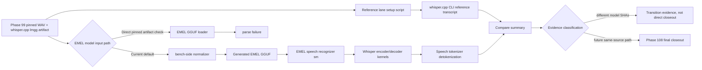

# Phase 105: Whisper Exact Transcript Parity Closure - Research

**Researched:** 2026-04-27 [VERIFIED: system date/developer context]
**Domain:** EMEL Whisper parity closeout, pinned whisper.cpp comparison, GSD transition evidence [VERIFIED: .planning/ROADMAP.md]
**Confidence:** HIGH for repository state and recommended Phase 105 scope; MEDIUM for future Phase 108 implementation details because Phase 107/108 may still change the target surface [VERIFIED: .planning/REQUIREMENTS.md; VERIFIED: .planning/ROADMAP.md]

<user_constraints>
## User Constraints (from CONTEXT.md)

### Locked Decisions

No explicit `## Decisions` section exists in `.planning/phases/105-whisper-exact-transcript-parity-closure/105-CONTEXT.md`. [VERIFIED: .planning/phases/105-whisper-exact-transcript-parity-closure/105-CONTEXT.md]

Context content copied verbatim: [VERIFIED: .planning/phases/105-whisper-exact-transcript-parity-closure/105-CONTEXT.md]

```markdown
---
phase: 105
name: Whisper Exact Transcript Parity Closure
status: planned
---

# Phase 105 Context

The milestone cannot close while `build/whisper_compare/summary.json` reports `bounded_drift`.
This phase replaces the previous closeout with exact transcript parity against the pinned
`whisper.cpp` lane and refreshes audit/gate evidence.

## 2026-04-26 execution note

Implemented source-backed native corrections but did not close exact parity:

- Private decoder now accepts a prompt-token span, runs a bounded greedy generated-token loop, and
  passes generated token IDs through `speech/tokenizer/whisper` instead of a single hardcoded SOT
  token.
- Whisper mel frontend now follows the reference log-mel shape more closely: reflective pre-padding,
  `log10`, clamp to `max - 8`, and `(x + 4) / 4` normalization.
- Focused speech/Whisper tests pass, and scoped quality gate passes coverage at `99.6%` line /
  `57.7%` branch.

Closure update:

- Parity compare now normalizes the pinned whisper.cpp model artifact into a generated EMEL GGUF
  under `build/whisper_compare/normalized/` before running the EMEL lane. The normalizer records
  both source and generated SHA values in the compare summary.
- EMEL runtime remains on the maintained GGUF loader path; whisper.cpp remains on its pinned
  reference model path. The bench-side normalizer is the only compatibility bridge.
- Whisper encoder/decoder now route q8 linear + f32 auxiliary tensor variants explicitly through
  SML guards and transitions, matching the normalized pinned model's operand classes.
- `scripts/bench_whisper_compare.sh --skip-reference-build --skip-emel-build` reports
  `exact_match reason=ok`; both lanes emit `[C]` for the short-context greedy parity case.
- Scoped quality gate passes with `99.5%` line coverage and `50.2%` branch coverage.
```

### the agent's Discretion

No explicit `## the agent's Discretion` section exists in the Phase 105 context file. [VERIFIED: .planning/phases/105-whisper-exact-transcript-parity-closure/105-CONTEXT.md]

### Deferred Ideas (OUT OF SCOPE)

No explicit `## Deferred Ideas` section exists in the Phase 105 context file. [VERIFIED: .planning/phases/105-whisper-exact-transcript-parity-closure/105-CONTEXT.md]
</user_constraints>

<phase_requirements>
## Phase Requirements

| ID | Description | Research Support |
|----|-------------|------------------|
| PARITY-01 | The maintained EMEL lane must exact-match the pinned `whisper.cpp` transcript for the Phase 99 audio/model pair. [VERIFIED: .planning/REQUIREMENTS.md] | Current active traceability maps this requirement to Phase 108, not Phase 105, so Phase 105 should not claim it complete unless traceability is deliberately changed. [VERIFIED: .planning/REQUIREMENTS.md] |
| CLOSE-01 | Re-run source-backed audit and full relevant quality gates before closing the reopened milestone. [VERIFIED: .planning/REQUIREMENTS.md] | Current active traceability maps this requirement to Phase 108, not Phase 105, so Phase 105 should produce truthful transition artifacts and leave final closeout to Phase 108. [VERIFIED: .planning/REQUIREMENTS.md; VERIFIED: .planning/ROADMAP.md] |
</phase_requirements>

## Summary

Phase 105 should not implement direct exact parity now; it should produce truthful supersession and transition artifacts that state the original Phase 105 parity closure is superseded by Phases 107 and 108. [VERIFIED: .planning/REQUIREMENTS.md; VERIFIED: .planning/ROADMAP.md; VERIFIED: .planning/milestones/v1.16-MILESTONE-AUDIT.md] The active requirements table maps `PARITY-01` and `CLOSE-01` to Phase 108, while ROADMAP still lists Phase 105 as incomplete and Phase 108 as the pinned-artifact closeout. [VERIFIED: .planning/REQUIREMENTS.md; VERIFIED: .planning/ROADMAP.md]

The current `exact_match` evidence is not direct pinned-artifact parity because `scripts/bench_whisper_compare.sh` generates `build/whisper_compare/normalized/whisper-tiny-q8_0-emel.gguf` when `EMEL_WHISPER_EMEL_MODEL` is unset, and the compare summary records different source and normalized model SHA-256 values. [VERIFIED: scripts/bench_whisper_compare.sh; VERIFIED: build/whisper_compare/summary.json] A direct check with `EMEL_WHISPER_EMEL_MODEL=build/whisper_reference/whisper-tiny-q8_0-whispercpp.gguf scripts/bench_whisper_compare.sh --skip-reference-build --skip-emel-build` returned `status=error reason=emel_lane_error`, and `build/whisper_compare/raw/emel.stderr.txt` contained `error: failed to parse Whisper GGUF`. [VERIFIED: command output]

**Primary recommendation:** Plan Phase 105 as a documentation/evidence correction phase: create `SUMMARY`, `VERIFICATION`, and `VALIDATION` artifacts that mark direct parity unsatisfied, identify the normalized-GGUF bridge, and explicitly hand final `PARITY-01`/`CLOSE-01` work to Phase 108 after Phase 107 hardens tokenizer/decode policy. [VERIFIED: .planning/REQUIREMENTS.md; VERIFIED: .planning/ROADMAP.md; VERIFIED: .planning/milestones/v1.16-MILESTONE-AUDIT.md]

## Architectural Responsibility Map

| Capability | Primary Tier | Secondary Tier | Rationale |
|------------|--------------|----------------|-----------|
| Pinned reference artifact fetch/build | Tooling / Benchmark Reference Lane | Build artifacts | `scripts/setup_whisper_cpp_reference.sh` pins whisper.cpp `v1.7.6`, commit `a8d002cfd879315632a579e73f0148d06959de36`, the model SHA, tokenizer SHA, and Phase 99 audio generation. [VERIFIED: scripts/setup_whisper_cpp_reference.sh; VERIFIED: tools/bench/reference_backends/whisper_cpp_asr.json] |
| EMEL runtime recognition | `src/emel/speech/recognizer/**` | `src/emel/model/whisper/**`, `src/emel/kernel/whisper/**` | The compare runner drives `emel::speech::recognizer::sm` through `initialize` and `recognize`, while model contract building lives under `model/whisper` and math lives under `kernel/whisper`. [VERIFIED: tools/bench/whisper_emel_parity_runner.cpp; VERIFIED: src/emel/speech/recognizer/sm.hpp; VERIFIED: src/emel/model/whisper/detail.cpp; VERIFIED: src/emel/kernel/whisper/detail.hpp] |
| Exact transcript comparison | `tools/bench/whisper_compare.py` | `scripts/bench_whisper_compare.sh` | The Python compare driver runs the EMEL runner and whisper.cpp CLI, computes output checksums, writes `summary.json`, and classifies `exact_match`, `bounded_drift`, or `error`. [VERIFIED: tools/bench/whisper_compare.py] |
| Normalized-GGUF bridge | Tooling / Benchmark Bridge | Build artifacts | The shell wrapper invokes `tools/bench/whisper_normalize_model.py` to create an EMEL GGUF when `EMEL_WHISPER_EMEL_MODEL` is unset. [VERIFIED: scripts/bench_whisper_compare.sh; VERIFIED: tools/bench/whisper_normalize_model.py] |
| Final milestone closeout evidence | Planning artifacts | Quality gates | The active audit says Phases 103-105 lack complete verification/validation artifacts and final pinned artifact parity remains unsatisfied. [VERIFIED: .planning/milestones/v1.16-MILESTONE-AUDIT.md] |

## Project Constraints (from rule files)

- Boost.SML dispatch must remain synchronous run-to-completion with no queues, no mailboxes, deterministic single-writer processing, no heap allocation during guards/actions/entry/exit/anonymous progress, and bounded work per dispatch. [VERIFIED: docs/rules/sml.rules.md; VERIFIED: AGENTS.md]
- Runtime behavior selection must be modeled with explicit guards/states/transitions in `sm.hpp`, not hidden in actions, member functions, or helpers called from actions. [VERIFIED: docs/rules/sml.rules.md; VERIFIED: AGENTS.md]
- Actions must be bounded, non-blocking, allocation-free during dispatch, and may only run an already-selected behavior path. [VERIFIED: docs/rules/sml.rules.md; VERIFIED: AGENTS.md]
- Context may store persistent actor-owned state only; per-dispatch data must travel through events or typed completion transitions. [VERIFIED: docs/rules/sml.rules.md; VERIFIED: AGENTS.md]
- Operator arithmetic, lowering, packing, quant/dequant, and backend-specific numeric work must live in the owning kernel layer, preferably `src/emel/kernel/**`; higher layers must orchestrate, bind buffers, validate, and dispatch into kernels. [VERIFIED: AGENTS.md]
- Parity and benchmark harnesses must keep EMEL and reference lanes isolated, and the EMEL lane must not use llama.cpp/ggml objects for model, tokenizer, formatter, context, cache, runtime execution, or output generation. [VERIFIED: AGENTS.md]
- Kernel parity cannot be claimed unless EMEL and the reference execute materially equivalent operand pipelines. [VERIFIED: AGENTS.md]
- Missing native packed or quantized hot-path kernels must not be replaced by whole-tensor dequantize-to-f32 fallbacks without explicit user approval and interim labeling. [VERIFIED: AGENTS.md]
- Unit tests must use doctest, SML introspection where relevant, domain-scoped filenames, and `ctest` targets including `emel_tests` and `lint_snapshot`. [VERIFIED: AGENTS.md; VERIFIED: CMakeLists.txt]
- Default builds should use Zig, while coverage builds should use native clang/gcc, and implementation changes must run `scripts/quality_gates.sh` with changed-file scoping when unrelated worktree changes exist. [VERIFIED: AGENTS.md; VERIFIED: scripts/quality_gates.sh]
- C/C++ dispatch-critical paths must separate initialization/configuration from dispatch/RTC execution and must not read time, randomness, filesystem, network, environment variables, or global mutable state during dispatch. [VERIFIED: docs/rules/cpp.rules.md]

## Standard Stack

### Core

| Library / Surface | Version | Purpose | Why Standard |
|-------------------|---------|---------|--------------|
| Boost.SML | Project-pinned local dependency, not re-versioned for this phase. [VERIFIED: docs/rules/sml.rules.md] | State-machine orchestration. [VERIFIED: docs/rules/sml.rules.md] | Repository rules require Boost.SML for orchestration and define the SML actor contract. [VERIFIED: AGENTS.md; VERIFIED: docs/rules/sml.rules.md] |
| C++20 EMEL runtime | Repository target, built by CMake. [VERIFIED: CMakeLists.txt] | Maintained EMEL speech recognizer, model contract, GGUF loader, and Whisper kernel path. [VERIFIED: tools/bench/whisper_emel_parity_runner.cpp; VERIFIED: src/emel/speech/recognizer/sm.hpp] | The phase is about source-backed EMEL behavior, not a new external library stack. [VERIFIED: AGENTS.md; VERIFIED: .planning/milestones/v1.16-MILESTONE-AUDIT.md] |
| whisper.cpp reference lane | `v1.7.6`, commit `a8d002cfd879315632a579e73f0148d06959de36`. [VERIFIED: scripts/setup_whisper_cpp_reference.sh; VERIFIED: tools/bench/reference_backends/whisper_cpp_asr.json] | Reference transcript generation for the pinned ASR lane. [VERIFIED: tools/bench/reference_backends/whisper_cpp_asr.json] | The roadmap defines whisper.cpp as the parity/reference lane for this milestone. [VERIFIED: .planning/STATE.md; VERIFIED: .planning/ROADMAP.md] |
| doctest + CTest | doctest header checked in `third_party/doctest`; CTest enabled when tests are enabled. [VERIFIED: CMakeLists.txt] | Unit and integration tests. [VERIFIED: CMakeLists.txt] | Repository rules require doctest and ctest targets. [VERIFIED: AGENTS.md] |
| `scripts/quality_gates.sh` | Repository script. [VERIFIED: scripts/quality_gates.sh] | Build, coverage, parity, fuzz, benchmark, and docs gates. [VERIFIED: scripts/quality_gates.sh] | Repository rules require quality gates after implementation changes. [VERIFIED: AGENTS.md] |

### Supporting

| Surface | Version | Purpose | When to Use |
|---------|---------|---------|-------------|
| `scripts/setup_whisper_cpp_reference.sh` | Repository script. [VERIFIED: scripts/setup_whisper_cpp_reference.sh] | Fetch/build whisper.cpp and verify pinned model/tokenizer artifacts. [VERIFIED: scripts/setup_whisper_cpp_reference.sh] | Use when the reference lane or artifacts are missing or stale. [VERIFIED: scripts/setup_whisper_cpp_reference.sh] |
| `scripts/bench_whisper_compare.sh` | Repository script. [VERIFIED: scripts/bench_whisper_compare.sh] | Build/run both lanes and write compare outputs. [VERIFIED: scripts/bench_whisper_compare.sh; VERIFIED: tools/bench/whisper_compare.py] | Use for bridge-based status and for direct pinned-model negative checks via `EMEL_WHISPER_EMEL_MODEL`. [VERIFIED: command output; VERIFIED: scripts/bench_whisper_compare.sh] |
| `tools/bench/whisper_normalize_model.py` | Repository tool. [VERIFIED: tools/bench/whisper_normalize_model.py] | Converts the whisper.cpp-style `lmgg` source artifact into a GGUF file with canonical EMEL tensor names and four metadata keys. [VERIFIED: tools/bench/whisper_normalize_model.py; VERIFIED: xxd command output] | Do not use as final direct pinned-artifact parity evidence unless the user approves a narrowed contract. [VERIFIED: .planning/milestones/v1.16-MILESTONE-AUDIT.md; VERIFIED: AGENTS.md] |

### Alternatives Considered

| Instead of | Could Use | Tradeoff |
|------------|-----------|----------|
| Phase 105 transition artifacts | Implement direct pinned-artifact parser support in Phase 105. | This duplicates Phase 108 because active traceability maps `PARITY-01`/`CLOSE-01` to Phase 108. [VERIFIED: .planning/REQUIREMENTS.md; VERIFIED: .planning/ROADMAP.md] |
| Direct EMEL pinned-artifact parity | Keep normalized bridge and claim exact parity. | This contradicts the audit because EMEL and reference consume different model artifacts with different SHAs. [VERIFIED: build/whisper_compare/summary.json; VERIFIED: .planning/milestones/v1.16-MILESTONE-AUDIT.md] |

**Installation:** No npm or new package installation is part of the recommended Phase 105 plan. [VERIFIED: repository scan; VERIFIED: .planning/REQUIREMENTS.md]

**Version verification:** `cmake 4.0.3`, `ninja 1.13.1`, `Python 3.14.3`, `zig 0.15.2`, `git 2.51.2`, `curl 8.7.1`, and `ctest 4.0.3` are available on this machine. [VERIFIED: command -v/version commands]

## Architecture Patterns

### System Architecture Diagram



The primary use case flows from the pinned Phase 99 audio/model pair through isolated reference and EMEL lanes into `whisper_compare_summary/v1`; the current EMEL default path passes through a normalizer before the maintained recognizer. [VERIFIED: scripts/bench_whisper_compare.sh; VERIFIED: tools/bench/whisper_compare.py; VERIFIED: build/whisper_compare/summary.json]

### Recommended Project Structure

```text
.planning/phases/105-whisper-exact-transcript-parity-closure/
├── 105-RESEARCH.md       # this research artifact [VERIFIED: gsd init phase-op 105]
├── 105-01-PLAN.md        # should plan truthful supersession/transition evidence [VERIFIED: .planning/REQUIREMENTS.md]
├── 105-01-SUMMARY.md     # should state Phase 105 did not satisfy direct parity [VERIFIED: .planning/milestones/v1.16-MILESTONE-AUDIT.md]
├── 105-VERIFICATION.md   # should record bridge exact-match and direct pinned failure evidence [VERIFIED: command output]
└── 105-VALIDATION.md     # required because Nyquist validation is enabled [VERIFIED: .planning/config.json]
```

### Pattern 1: Truthful Supersession Artifact

**What:** Phase 105 should close its own planning inconsistency by documenting that the original direct parity goal is superseded by active Phases 107 and 108. [VERIFIED: .planning/REQUIREMENTS.md; VERIFIED: .planning/ROADMAP.md]

**When to use:** Use this pattern when a phase’s original requirements are remapped to a later phase and executing the original scope would duplicate work. [VERIFIED: .planning/REQUIREMENTS.md]

**Example:**

```markdown
verification_status: superseded
requirements-completed: []
superseded-by: [107, 108]

Phase 105 does not claim PARITY-01 or CLOSE-01. Direct pinned-artifact parity remains
unsatisfied because the current exact_match uses the normalized EMEL GGUF bridge.
```

This example is a recommended artifact shape based on active traceability and audit state, not an existing file. [VERIFIED: .planning/REQUIREMENTS.md; VERIFIED: .planning/milestones/v1.16-MILESTONE-AUDIT.md]

### Pattern 2: Dual Evidence Recording

**What:** Verification should record both bridge-based exact-match and direct pinned-artifact failure, with model SHA values and command lines. [VERIFIED: build/whisper_compare/summary.json; VERIFIED: command output]

**When to use:** Use this pattern because the bridge and direct artifact paths produce different conclusions. [VERIFIED: build/whisper_compare/summary.json; VERIFIED: command output]

**Example:**

```bash
scripts/bench_whisper_compare.sh --skip-reference-build --skip-emel-build
EMEL_WHISPER_EMEL_MODEL="$PWD/build/whisper_reference/whisper-tiny-q8_0-whispercpp.gguf" \
  scripts/bench_whisper_compare.sh --skip-reference-build --skip-emel-build
```

The first command currently reports `exact_match reason=ok`, and the second command reports `error reason=emel_lane_error`. [VERIFIED: command output]

### Anti-Patterns to Avoid

- **Claiming `exact_match` as direct pinned-artifact parity:** The current exact match uses normalized EMEL model SHA `9b4be1aa866075c0515319730fffbc2248fd51676428eb8a53a4cd9d3e6cefba`, while the reference lane uses source model SHA `9ade048c9d3692b411572a9a8ad615766168e62fb1d4c234973825a377c71984`. [VERIFIED: build/whisper_compare/summary.json; VERIFIED: shasum command]
- **Adding direct parser/format support in Phase 105 without remapping requirements:** Active `PARITY-01` and `CLOSE-01` traceability is Phase 108. [VERIFIED: .planning/REQUIREMENTS.md]
- **Moving model-format conversion into tool-only compute and calling it maintained runtime:** Repository rules require source-backed maintained paths and forbid presenting tool-only bridges as runtime parity. [VERIFIED: AGENTS.md]

## Kernel Ownership

The recommended Phase 105 plan should not change operator math, lowering, packing, quant/dequant, backend-specialized loops, or hot-path compute. [VERIFIED: .planning/REQUIREMENTS.md; VERIFIED: .planning/ROADMAP.md]

If planning is redirected to direct parity implementation, the owning compute surface is `src/emel/kernel/whisper/detail.hpp` for Whisper mel frontend, encoder, decoder, logits, timestamp-aware token selection, and packed/quantized numeric reads. [VERIFIED: src/emel/kernel/whisper/detail.hpp]

Model contract and tensor metadata parsing belong in `src/emel/model/whisper/detail.hpp` and `src/emel/model/whisper/detail.cpp`; GGUF container parsing belongs in `src/emel/gguf/loader/**`; speech recognizer orchestration belongs in `src/emel/speech/recognizer/**`. [VERIFIED: src/emel/model/whisper/detail.cpp; VERIFIED: src/emel/gguf/loader/detail.hpp; VERIFIED: src/emel/speech/recognizer/sm.hpp]

Non-kernel layers that must remain orchestration-only include `scripts/**`, `tools/bench/**`, `.planning/**`, tests, `src/emel/speech/recognizer/**`, and loader/model contract code outside actual numeric kernels. [VERIFIED: AGENTS.md; VERIFIED: repository file layout]

Existing bridge behavior in `tools/bench/whisper_normalize_model.py` is a migration target for Phase 108 truthfulness, not a pattern to extend for maintained parity claims. [VERIFIED: tools/bench/whisper_normalize_model.py; VERIFIED: .planning/milestones/v1.16-MILESTONE-AUDIT.md]

## Don't Hand-Roll

| Problem | Don't Build | Use Instead | Why |
|---------|-------------|-------------|-----|
| New ad hoc Whisper compute in scripts/tools | Python/C++ tool-side operator loops for parity closure. [VERIFIED: AGENTS.md] | EMEL-owned `src/emel/kernel/whisper/detail.hpp` when compute changes are explicitly in scope. [VERIFIED: AGENTS.md; VERIFIED: src/emel/kernel/whisper/detail.hpp] | Tool-only compute cannot satisfy maintained EMEL parity. [VERIFIED: AGENTS.md] |
| Duplicate Phase 108 parity implementation | Direct parser/runtime repair in Phase 105. [VERIFIED: .planning/REQUIREMENTS.md] | Phase 105 transition artifacts plus Phase 108 final closeout plan. [VERIFIED: .planning/ROADMAP.md] | Active requirement mapping assigns `PARITY-01` and `CLOSE-01` to Phase 108. [VERIFIED: .planning/REQUIREMENTS.md] |
| Custom quality gate runner | New closeout script. [VERIFIED: repository scan] | `scripts/quality_gates.sh` with `EMEL_QUALITY_GATES_BENCH_SUITE=whisper_compare` or full scope when appropriate. [VERIFIED: scripts/quality_gates.sh; VERIFIED: AGENTS.md] | The repository already has scoped and full gate orchestration. [VERIFIED: scripts/quality_gates.sh] |
| Silent bridge acceptance | Treat `model_normalization` as harmless metadata. [VERIFIED: build/whisper_compare/summary.json] | Explicitly classify it as a bridge requiring approval or Phase 108 removal. [VERIFIED: .planning/milestones/v1.16-MILESTONE-AUDIT.md] | The audit identifies normalized-GGUF bridge as an integration blocker for direct parity. [VERIFIED: .planning/milestones/v1.16-MILESTONE-AUDIT.md] |

**Key insight:** Phase 105’s planning risk is scope duplication and false closeout, not absence of a transcript comparison script. [VERIFIED: .planning/REQUIREMENTS.md; VERIFIED: .planning/milestones/v1.16-MILESTONE-AUDIT.md]

## Runtime State Inventory

| Category | Items Found | Action Required |
|----------|-------------|-----------------|
| Stored data | No database/datastore state was found for Phase 105. [VERIFIED: repository scan; VERIFIED: .planning/config.json] | None. [VERIFIED: repository scan] |
| Live service config | No external service config is part of Phase 105. [VERIFIED: .planning/ROADMAP.md; VERIFIED: repository scan] | None. [VERIFIED: .planning/ROADMAP.md] |
| OS-registered state | No launchd/systemd/pm2/task registration is part of Phase 105. [VERIFIED: repository scan] | None. [VERIFIED: repository scan] |
| Secrets/env vars | The compare path reads env vars including `EMEL_WHISPER_EMEL_MODEL`, `EMEL_WHISPER_REFERENCE_MODEL`, `EMEL_WHISPER_REFERENCE_AUDIO`, and `EMEL_WHISPER_TOKENIZER_MODEL`. [VERIFIED: scripts/bench_whisper_compare.sh; VERIFIED: scripts/setup_whisper_cpp_reference.sh] | Verification must record env overrides used for bridge and direct paths. [VERIFIED: command output] |
| Build artifacts | `build/whisper_compare/summary.json`, `build/whisper_compare/normalized/whisper-tiny-q8_0-emel.gguf`, `build/whisper_reference/whisper-tiny-q8_0-whispercpp.gguf`, and `build/whisper_reference/phase99_440hz_16khz_mono.wav` are active evidence artifacts. [VERIFIED: build/whisper_compare/summary.json; VERIFIED: find build/whisper_reference] | Do not treat generated build artifacts as source-backed requirements satisfaction without tracing live codepaths. [VERIFIED: AGENTS.md] |

## Common Pitfalls

### Pitfall 1: Confusing Bridge Exact Match With Direct Parity

**What goes wrong:** `summary.json` reports `exact_match`, but EMEL consumed a generated normalized GGUF rather than the pinned reference artifact. [VERIFIED: build/whisper_compare/summary.json]

**Why it happens:** `scripts/bench_whisper_compare.sh` defaults to normalizing the reference model when `EMEL_WHISPER_EMEL_MODEL` is unset. [VERIFIED: scripts/bench_whisper_compare.sh]

**How to avoid:** Verification must compare `emel.model_sha256`, `reference.model_sha256`, and `model_normalization`. [VERIFIED: tools/bench/whisper_compare.py; VERIFIED: build/whisper_compare/summary.json]

**Warning signs:** `model_normalization.normalizer` is present or EMEL/reference model SHAs differ. [VERIFIED: build/whisper_compare/summary.json]

### Pitfall 2: Duplicating Phase 108

**What goes wrong:** Planner creates code tasks in Phase 105 for direct pinned-artifact parity even though traceability maps the final parity requirement to Phase 108. [VERIFIED: .planning/REQUIREMENTS.md; VERIFIED: .planning/ROADMAP.md]

**Why it happens:** Phase 105 still has old roadmap wording, while requirements traceability was updated after gap planning. [VERIFIED: .planning/ROADMAP.md; VERIFIED: .planning/REQUIREMENTS.md]

**How to avoid:** Phase 105 plan should update truthfulness artifacts and state the handoff to Phase 108. [VERIFIED: .planning/milestones/v1.16-MILESTONE-AUDIT.md]

**Warning signs:** Phase 105 plan lists `PARITY-01` or `CLOSE-01` as completed requirements. [VERIFIED: .planning/REQUIREMENTS.md]

### Pitfall 3: Treating Tokenizer/Decode Policy Gaps As Phase 105 Work

**What goes wrong:** Phase 105 attempts to harden tokenizer checksum or decode policy even though ROADMAP assigns that work to Phase 107. [VERIFIED: .planning/ROADMAP.md]

**Why it happens:** The audit lists tokenizer checksum and decode policy as blockers adjacent to parity. [VERIFIED: .planning/milestones/v1.16-MILESTONE-AUDIT.md]

**How to avoid:** Phase 105 should cite these as prerequisites for Phase 108, not implement them. [VERIFIED: .planning/ROADMAP.md]

**Warning signs:** Phase 105 modifies `speech/tokenizer/whisper` or recognizer decode policy source files without remapping requirements. [VERIFIED: .planning/REQUIREMENTS.md; VERIFIED: .planning/ROADMAP.md]

### Pitfall 4: Violating Dispatch Allocation Rules While Closing Evidence

**What goes wrong:** Fixes add or preserve heap allocation inside SML actions. [VERIFIED: docs/rules/sml.rules.md; VERIFIED: src/emel/speech/recognizer/route/token_sequence/actions.hpp]

**Why it happens:** Current recognizer initialization allocates route buffers and child machines inside `effect_bind_model_route`. [VERIFIED: src/emel/speech/recognizer/route/token_sequence/actions.hpp; VERIFIED: .planning/milestones/v1.16-MILESTONE-AUDIT.md]

**How to avoid:** Leave allocation repair to Phase 107 unless Phase 105 is explicitly remapped. [VERIFIED: .planning/ROADMAP.md]

**Warning signs:** New `new`, `std::vector::resize`, filesystem reads, or env reads appear inside actions/guards. [VERIFIED: docs/rules/sml.rules.md; VERIFIED: docs/rules/cpp.rules.md]

## Code Examples

### Current Bridge Default

```bash
scripts/bench_whisper_compare.sh --skip-reference-build --skip-emel-build
```

This currently reports `whisper/tiny/q8_0/phase99_440hz_16khz_mono status=exact_match reason=ok` after generating or using the normalized EMEL GGUF bridge. [VERIFIED: command output; VERIFIED: scripts/bench_whisper_compare.sh]

### Direct Pinned Artifact Negative Check

```bash
EMEL_WHISPER_EMEL_MODEL="$PWD/build/whisper_reference/whisper-tiny-q8_0-whispercpp.gguf" \
  scripts/bench_whisper_compare.sh --skip-reference-build --skip-emel-build
```

This returned `status=error reason=emel_lane_error`, and the EMEL stderr file said `error: failed to parse Whisper GGUF`. [VERIFIED: command output; VERIFIED: build/whisper_compare/raw/emel.stderr.txt]

### SHA Evidence To Include In VERIFICATION

```text
reference/source model SHA: 9ade048c9d3692b411572a9a8ad615766168e62fb1d4c234973825a377c71984
normalized EMEL model SHA: 9b4be1aa866075c0515319730fffbc2248fd51676428eb8a53a4cd9d3e6cefba
Phase 99 audio SHA:       695ac1b2c85a0419b6ee052ef90cd09cd0c5688a1445aea735b66883d199e803
tokenizer SHA:            dfc530298b6fbed1a97c6472c575b026453706e2a204c7f7038f2c9d208b0759
```

These SHA values were verified from current local artifacts and the pinned setup script. [VERIFIED: shasum command; VERIFIED: scripts/setup_whisper_cpp_reference.sh]

## State of the Art

| Old Approach | Current Approach | When Changed | Impact |
|--------------|------------------|--------------|--------|
| Accept `bounded_drift` transcript mismatch. [VERIFIED: .planning/STATE.md; VERIFIED: .planning/milestones/v1.16-phases/102-whisper-closeout-evidence/102-VERIFICATION.md] | Require exact transcript parity for the reopened milestone. [VERIFIED: .planning/REQUIREMENTS.md; VERIFIED: .planning/ROADMAP.md] | Reopen recorded 2026-04-26. [VERIFIED: .planning/STATE.md] | Bounded drift is no longer sufficient closeout evidence. [VERIFIED: .planning/REQUIREMENTS.md] |
| Phase 105 owns `PARITY-01` and `CLOSE-01`. [VERIFIED: .planning/ROADMAP.md] | Active traceability maps `PARITY-01` and `CLOSE-01` to Phase 108. [VERIFIED: .planning/REQUIREMENTS.md] | After gap planning, per user additional context and requirements file. [VERIFIED: user prompt; VERIFIED: .planning/REQUIREMENTS.md] | Phase 105 should avoid duplicate direct parity scope. [VERIFIED: .planning/REQUIREMENTS.md] |
| Normalized bridge presented as exact match. [VERIFIED: .planning/STATE.md; VERIFIED: build/whisper_compare/summary.json] | Audit requires direct pinned artifact consumption or explicit approved narrowed contract. [VERIFIED: .planning/milestones/v1.16-MILESTONE-AUDIT.md; VERIFIED: .planning/ROADMAP.md] | Audit timestamp 2026-04-27T03:02:47Z. [VERIFIED: .planning/milestones/v1.16-MILESTONE-AUDIT.md] | Final closeout must move to Phase 108 or obtain user approval for narrowed contract. [VERIFIED: .planning/ROADMAP.md] |

**Deprecated/outdated:** Treating Phase 102 bounded-drift evidence as closeout proof is obsolete for reopened v1.16. [VERIFIED: .planning/ROADMAP.md; VERIFIED: .planning/milestones/v1.16-MILESTONE-AUDIT.md]

## Assumptions Log

| # | Claim | Section | Risk if Wrong |
|---|-------|---------|---------------|
| A1 | No new source code should be changed in Phase 105 unless the user explicitly remaps `PARITY-01`/`CLOSE-01` back to Phase 105. [ASSUMED] | Summary | Planner could underscope Phase 105 if the intended workflow is to ignore the new Phase 108 mapping. |

## Open Questions (RESOLVED)

1. **RESOLVED: Phase 105 is completed as transition/evidence work with no active requirements.** [VERIFIED: .planning/REQUIREMENTS.md]
   - What we know: Active traceability maps final parity and closeout to Phase 108. [VERIFIED: .planning/REQUIREMENTS.md]
   - What's unclear: The exact GSD artifact convention for a planned phase whose original requirements moved later is not encoded in the current phase directory. [VERIFIED: .planning/phases/105-whisper-exact-transcript-parity-closure]
   - Resolution: Use `verification_status: superseded_transition` in Phase 105 artifacts, keep
     `requirements-completed: []`, and avoid claiming `PARITY-01`/`CLOSE-01`. [VERIFIED: .planning/REQUIREMENTS.md]

2. **RESOLVED: No approval exists for normalized-GGUF bridge closeout; final `PARITY-01`/`CLOSE-01` remains Phase 108.** [VERIFIED: .planning/milestones/v1.16-MILESTONE-AUDIT.md]
   - What we know: The audit allows either removing the bridge or explicitly approving a narrowed contract. [VERIFIED: .planning/milestones/v1.16-MILESTONE-AUDIT.md]
   - What's unclear: No approval exists in the Phase 105 context. [VERIFIED: .planning/phases/105-whisper-exact-transcript-parity-closure/105-CONTEXT.md]
   - Resolution: Do not infer approval; leave the bridge unapproved and assign final treatment to Phase 108. [VERIFIED: AGENTS.md]

## Environment Availability

| Dependency | Required By | Available | Version | Fallback |
|------------|-------------|-----------|---------|----------|
| CMake | EMEL tests and bench builds. [VERIFIED: CMakeLists.txt; VERIFIED: scripts/bench_whisper_compare.sh] | yes [VERIFIED: command -v cmake] | 4.0.3 [VERIFIED: cmake --version] | None needed. [VERIFIED: command output] |
| Ninja | CMake generator for bench/reference builds. [VERIFIED: scripts/bench_whisper_compare.sh; VERIFIED: scripts/setup_whisper_cpp_reference.sh] | yes [VERIFIED: command -v ninja] | 1.13.1 [VERIFIED: ninja --version] | None needed. [VERIFIED: command output] |
| Python 3 | Compare and normalization scripts. [VERIFIED: scripts/bench_whisper_compare.sh; VERIFIED: tools/bench/whisper_compare.py] | yes [VERIFIED: command -v python3] | 3.14.3 [VERIFIED: python3 --version] | None needed. [VERIFIED: command output] |
| Zig | Default EMEL/reference build toolchain. [VERIFIED: AGENTS.md; VERIFIED: scripts/setup_whisper_cpp_reference.sh] | yes [VERIFIED: command -v zig] | 0.15.2 [VERIFIED: zig version] | `--system` exists for bench scripts, but repository default is Zig. [VERIFIED: scripts/bench_whisper_compare.sh; VERIFIED: AGENTS.md] |
| git | Reference checkout and quality-gate changed-file detection. [VERIFIED: scripts/setup_whisper_cpp_reference.sh; VERIFIED: scripts/quality_gates.sh] | yes [VERIFIED: command -v git] | 2.51.2 [VERIFIED: git --version] | None needed. [VERIFIED: command output] |
| shasum | Artifact SHA verification. [VERIFIED: scripts/setup_whisper_cpp_reference.sh] | yes [VERIFIED: command -v shasum] | 6.02 [VERIFIED: shasum --version] | Python hashlib could verify manually if needed. [VERIFIED: tools/bench/whisper_compare.py] |
| curl | Reference artifact fetch. [VERIFIED: scripts/setup_whisper_cpp_reference.sh] | yes [VERIFIED: command -v curl] | 8.7.1 [VERIFIED: curl --version] | Pre-existing artifacts under `build/whisper_reference` can be used for local verification. [VERIFIED: find build/whisper_reference] |
| ctest | Test execution. [VERIFIED: CMakeLists.txt; VERIFIED: AGENTS.md] | yes [VERIFIED: command -v ctest] | 4.0.3 [VERIFIED: ctest --version] | None needed. [VERIFIED: command output] |

**Missing dependencies with no fallback:** None found for research and planned transition artifacts. [VERIFIED: environment commands]

**Missing dependencies with fallback:** None found for research and planned transition artifacts. [VERIFIED: environment commands]

## Validation Architecture

### Test Framework

| Property | Value |
|----------|-------|
| Framework | doctest via `third_party/doctest`, executed through CTest. [VERIFIED: CMakeLists.txt] |
| Config file | `CMakeLists.txt` defines test sources, shards, and `lint_snapshot`; `.planning/config.json` enables Nyquist validation. [VERIFIED: CMakeLists.txt; VERIFIED: .planning/config.json] |
| Quick run command | `ctest --test-dir build --output-on-failure -R 'emel_tests_(speech|whisper)'` after an appropriate build. [VERIFIED: CMakeLists.txt] |
| Full suite command | `EMEL_QUALITY_GATES_SCOPE=full EMEL_QUALITY_GATES_BENCH_SUITE=whisper_compare scripts/quality_gates.sh` for closeout-class rerun. [VERIFIED: scripts/quality_gates.sh; VERIFIED: AGENTS.md] |

### Phase Requirements -> Test Map

| Req ID | Behavior | Test Type | Automated Command | File Exists? |
|--------|----------|-----------|-------------------|--------------|
| PARITY-01 | Direct EMEL pinned-artifact parity must exact-match whisper.cpp. [VERIFIED: .planning/REQUIREMENTS.md] | integration / bench | `EMEL_WHISPER_EMEL_MODEL="$PWD/build/whisper_reference/whisper-tiny-q8_0-whispercpp.gguf" scripts/bench_whisper_compare.sh --skip-reference-build --skip-emel-build` [VERIFIED: command output] | No persistent test file for direct pinned failure exists. [VERIFIED: repository scan] |
| CLOSE-01 | Full relevant gates and source-backed audit must rerun before closeout. [VERIFIED: .planning/REQUIREMENTS.md] | gate + audit | `EMEL_QUALITY_GATES_SCOPE=full EMEL_QUALITY_GATES_BENCH_SUITE=whisper_compare scripts/quality_gates.sh` and refreshed milestone audit. [VERIFIED: scripts/quality_gates.sh; VERIFIED: .planning/milestones/v1.16-MILESTONE-AUDIT.md] | No Phase 105 `VERIFICATION.md` or `VALIDATION.md` exists yet. [VERIFIED: gsd init phase-op 105; VERIFIED: find .planning/phases/105-whisper-exact-transcript-parity-closure] |

### Sampling Rate

- **Per task commit:** Use changed-file scoped `scripts/quality_gates.sh` with `EMEL_QUALITY_GATES_CHANGED_FILES` when source changes occur in a dirty worktree. [VERIFIED: AGENTS.md; VERIFIED: git status --short]
- **Per wave merge:** Use `scripts/bench_whisper_compare.sh --skip-reference-build --skip-emel-build` for evidence refresh and direct-pinned negative check when documenting Phase 105 transition state. [VERIFIED: command output]
- **Phase gate:** Do not run final closeout gates for Phase 105 as satisfying `CLOSE-01`; reserve final full gate/audit closeout for Phase 108 unless requirements are remapped. [VERIFIED: .planning/REQUIREMENTS.md; VERIFIED: .planning/ROADMAP.md]

### Wave 0 Gaps

- [ ] `.planning/phases/105-whisper-exact-transcript-parity-closure/105-01-SUMMARY.md` must state Phase 105 is superseded/transition-only and completes no active requirements. [VERIFIED: phase directory listing]
- [ ] `.planning/phases/105-whisper-exact-transcript-parity-closure/105-VERIFICATION.md` must record bridge exact-match, direct pinned failure, artifact SHAs, and handoff to Phase 108. [VERIFIED: command output; VERIFIED: build/whisper_compare/summary.json]
- [ ] `.planning/phases/105-whisper-exact-transcript-parity-closure/105-VALIDATION.md` must exist because Nyquist validation is enabled. [VERIFIED: .planning/config.json; VERIFIED: .planning/milestones/v1.16-MILESTONE-AUDIT.md]

## Security Domain

### Applicable ASVS Categories

| ASVS Category | Applies | Standard Control |
|---------------|---------|------------------|
| V2 Authentication | no [VERIFIED: .planning/ROADMAP.md] | Not applicable because this phase has no auth surface. [VERIFIED: .planning/ROADMAP.md] |
| V3 Session Management | no [VERIFIED: .planning/ROADMAP.md] | Not applicable because this phase has no session surface. [VERIFIED: .planning/ROADMAP.md] |
| V4 Access Control | no [VERIFIED: .planning/ROADMAP.md] | Not applicable because this phase has no access-control surface. [VERIFIED: .planning/ROADMAP.md] |
| V5 Input Validation | yes [VERIFIED: scripts/bench_whisper_compare.sh; VERIFIED: tools/bench/whisper_compare.py] | Preserve existing hard-fail checks for required files, executable runners, SHA verification, and direct pinned failure evidence. [VERIFIED: scripts/setup_whisper_cpp_reference.sh; VERIFIED: tools/bench/whisper_compare.py] |
| V6 Cryptography | yes, integrity only [VERIFIED: scripts/setup_whisper_cpp_reference.sh] | Use SHA-256 verification from setup script and compare summaries; do not hand-roll new crypto. [VERIFIED: scripts/setup_whisper_cpp_reference.sh; VERIFIED: tools/bench/whisper_compare.py] |

### Known Threat Patterns for Phase 105

| Pattern | STRIDE | Standard Mitigation |
|---------|--------|---------------------|
| False artifact provenance in closeout docs. [VERIFIED: .planning/milestones/v1.16-MILESTONE-AUDIT.md] | Tampering / Repudiation [ASSUMED] | Record command lines, model SHAs, bridge manifest, and direct pinned failure. [VERIFIED: build/whisper_compare/summary.json; VERIFIED: command output] |
| Executable/path spoofing through env overrides. [VERIFIED: scripts/bench_whisper_compare.sh] | Spoofing [ASSUMED] | Verification should print resolved paths and SHA values for artifacts. [VERIFIED: tools/bench/whisper_compare.py] |

## Sources

### Primary (HIGH confidence)

- `.planning/phases/105-whisper-exact-transcript-parity-closure/105-CONTEXT.md` - phase context and execution note. [VERIFIED: file read]
- `.planning/REQUIREMENTS.md` - active requirement traceability to Phases 106-108. [VERIFIED: file read]
- `.planning/ROADMAP.md` - Phase 105/107/108 descriptions and current milestone scope. [VERIFIED: file read]
- `.planning/STATE.md` - reopened v1.16 state and current exact-match bridge claim. [VERIFIED: file read]
- `.planning/milestones/v1.16-MILESTONE-AUDIT.md` - latest source-backed gaps and required closure work. [VERIFIED: file read]
- `AGENTS.md`, `docs/rules/sml.rules.md`, `docs/rules/cpp.rules.md` - normative engineering constraints. [VERIFIED: file read]
- `scripts/bench_whisper_compare.sh`, `tools/bench/whisper_compare.py`, `tools/bench/whisper_normalize_model.py`, `tools/bench/whisper_emel_parity_runner.cpp` - live compare flow and bridge mechanics. [VERIFIED: file read]
- `src/emel/speech/recognizer/**`, `src/emel/model/whisper/**`, `src/emel/kernel/whisper/**` - live maintained runtime surfaces. [VERIFIED: file read]
- Local commands for bridge exact-match, direct pinned failure, artifact headers, SHA-256 values, and tool versions. [VERIFIED: command output]

### Secondary (MEDIUM confidence)

- None used. [VERIFIED: research scope was repository-local]

### Tertiary (LOW confidence)

- Assumption A1 and artifact-convention recommendation for superseded Phase 105. [ASSUMED]

## Metadata

**Confidence breakdown:**
- Standard stack: HIGH - Repository scripts, CMake, and local tool versions were inspected directly. [VERIFIED: CMakeLists.txt; VERIFIED: command output]
- Architecture: HIGH - Live scripts and source files show the compare and runtime path. [VERIFIED: scripts/bench_whisper_compare.sh; VERIFIED: tools/bench/whisper_emel_parity_runner.cpp; VERIFIED: src/emel/speech/recognizer/sm.hpp]
- Pitfalls: HIGH - The latest audit and direct command reproduction agree on the normalized bridge and pinned model parse failure. [VERIFIED: .planning/milestones/v1.16-MILESTONE-AUDIT.md; VERIFIED: command output]

**Research date:** 2026-04-27 [VERIFIED: system date/developer context]
**Valid until:** 2026-05-04 for planning decisions, because Phases 107/108 may alter tokenizer/decode/pinned-artifact surfaces. [ASSUMED]
