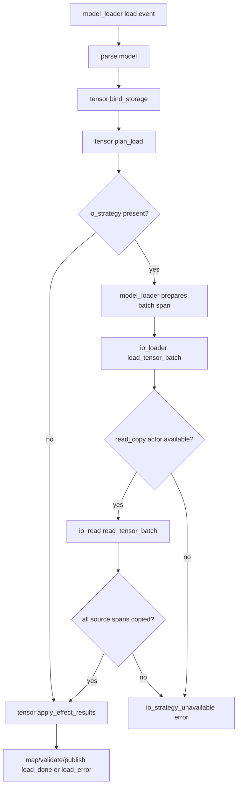

# Phase 225: Read Closeout Runtime Validation And SML Repair - Research

**Researched:** 2026-05-06 [VERIFIED: current date]
**Domain:** Stateforward.SML runtime orchestration repair and closeout validation [VERIFIED: .planning/ROADMAP.md]
**Confidence:** HIGH for rule constraints, source inventory, and the selected batch-event repair shape because Phase 225 context grants the agent implementation discretion and the plan decomposes the callback/result-carrier wiring explicitly. [VERIFIED: AGENTS.md; VERIFIED: docs/rules/sml.rules.md; VERIFIED: source inspection; RESOLVED: 2026-05-06]

<user_constraints>
## User Constraints (from CONTEXT.md)

### Locked Decisions
None explicitly listed. [VERIFIED: .planning/phases/225-read-closeout-runtime-validation-and-sml-repair/225-CONTEXT.md]

### the agent's Discretion
All implementation choices are at the agent's discretion because this is an
infrastructure and rule-compliance repair phase. Preserve v1.25 scope: no staged/chunked,
async, device, model-family widening, mmap behavior changes, tool-only read scaffolds, or
benchmark-regression overrides.

### Deferred Ideas (OUT OF SCOPE)
Staged/chunked constrained-memory read policy, cooperative async loading,
device-specific loading strategies, model-family widening, and performance optimization
todos remain out of scope.
</user_constraints>

<phase_requirements>
## Phase Requirements

| ID | Description | Research Support |
|----|-------------|------------------|
| VAL-01 | Doctest coverage proves supported read behavior and representative failure handling through public `process_event(...)` plus SML state inspection. [VERIFIED: .planning/REQUIREMENTS.md] | Existing focused tests cover `io/read`, `io/loader`, `model/tensor`, and `model/loader`; current `model_and_batch` passed once and `io` hit the intermittent dyld blocker, so the plan needs both direct reruns and documented substitute evidence if dyld recurs. [VERIFIED: tests/io/read/lifecycle_tests.cpp; VERIFIED: tests/io/loader/lifecycle_tests.cpp; VERIFIED: tests/model/tensor/lifecycle_tests.cpp; VERIFIED: tests/model/loader/lifecycle_tests.cpp; VERIFIED: ctest runs] |
| TIO-03 | Maintained lanes select/report read-backed loading only through public runtime surfaces. [VERIFIED: .planning/REQUIREMENTS.md] | Tool guardrails already scan maintained lanes for public `bind_model_load_io_strategy`, public source API, and absence of `io/read/detail.hpp`; this phase must add a guardrail that model-loader no longer loops `io_loader->process_event(...)` in an action. [VERIFIED: tests/model/loader/lifecycle_tests.cpp] |
| VAL-04 | Maintained evidence reports read strategy only when the EMEL lane actually runs the read-backed runtime path. [VERIFIED: .planning/REQUIREMENTS.md] | `model/loader` publishes `used_io_strategy`; the success path currently marks read/copy used after the I/O phase succeeds. [VERIFIED: src/emel/model/loader/events.hpp; VERIFIED: src/emel/model/loader/actions.hpp; VERIFIED: src/emel/model/loader/sm.hpp] |
| VAL-03 | Docs, architecture docs, planning artifacts, snapshots, benchmark outputs, and model artifacts are updated from maintained commands when required. [VERIFIED: .planning/REQUIREMENTS.md] | Active roadmap paths name root closeout artifacts, while archived v1.25 roadmap still names root paths even though archived copies exist under `.planning/milestones/`. [VERIFIED: .planning/ROADMAP.md; VERIFIED: .planning/milestones/v1.25-ROADMAP.md; VERIFIED: .planning/milestones/v1.25-REQUIREMENTS.md] |
</phase_requirements>

## Summary

Phase 225 is not a library-selection phase; it is a source-backed rule-compliance repair. [VERIFIED: .planning/ROADMAP.md] The critical source gap is that `src/emel/model/loader/actions.hpp` loops over planned tensor effects and calls `ev.request.io_loader->process_event(load)` from inside `effect_dispatch_io_loads`. [VERIFIED: src/emel/model/loader/actions.hpp] Repository rules allow deterministic synchronous cross-actor calls, but runtime orchestration choices must live in guards/transitions, actions must remain bounded and non-branching, and completion/anonymous chains must not become per-item data loops. [VERIFIED: AGENTS.md; VERIFIED: docs/rules/sml.rules.md]

The most robust planning direction is to replace model-loader per-effect child dispatch with a single batch read/copy phase: model-loader prepares or binds a preallocated batch span, dispatches one public `io/loader` batch event, `io/loader` routes the already-selected `read_copy` batch to `io/read`, and `io/read` performs the already-chosen source-span copies as bounded data-plane work. [VERIFIED: src/emel/model/loader/events.hpp; VERIFIED: src/emel/io/loader/events.hpp; VERIFIED: src/emel/io/read/actions.hpp] A per-effect explicit SML completion loop is lower confidence because `model::data::k_max_tensors` is 65,536, which conflicts with the rule that completion/anonymous chains stay small and phase-level. [VERIFIED: src/emel/model/data.hpp; VERIFIED: docs/rules/sml.rules.md]

Validation is currently environment-sensitive. [VERIFIED: local ctest runs] In this session, `ctest --test-dir build/zig --output-on-failure -R emel_tests_model_and_batch` passed in 3.17s, but `ctest --test-dir build/zig --output-on-failure -R emel_tests_io` aborted immediately with the dyld cache / `libSystem.B.dylib` launch failure. [VERIFIED: ctest output] The plan should first rerun direct tests, then record source-backed substitute evidence only for test lanes that cannot launch. [VERIFIED: .planning/ROADMAP.md]

**Primary recommendation:** Add a public batch read/copy path through `model/loader -> io/loader -> io/read`, remove the model-loader action loop over `io_loader->process_event(...)`, update guardrails/docs, and validate with focused shards plus changed-file quality gates. [VERIFIED: .planning/ROADMAP.md; VERIFIED: source inspection]

## Architectural Responsibility Map

| Capability | Primary Tier | Secondary Tier | Rationale |
|------------|--------------|----------------|-----------|
| Closeout runtime validation | Test/CI validation tier | Planning docs | Phase success requires executable doctest evidence or explicitly recorded source-backed substitute evidence. [VERIFIED: .planning/ROADMAP.md] |
| Model load orchestration | `src/emel/model/loader` SML tier | `model/tensor`, `io/loader` | Model loader owns parsing, tensor-plan orchestration, strategy evidence, and dispatch into child actors; it must not own low-level read logic. [VERIFIED: src/emel/model/loader/sm.hpp; VERIFIED: AGENTS.md] |
| Tensor residency | `src/emel/model/tensor` SML tier | `io/read`, `io/mmap` | Tensor remains owner of load/bind/evict/residency state; read/copy does not take residency ownership. [VERIFIED: .planning/STATE.md; VERIFIED: src/emel/model/tensor/events.hpp] |
| I/O strategy routing | `src/emel/io/loader` SML tier | `src/emel/io/read` | `io/loader` routes `strategy_kind::read_copy` to the injected read actor using explicit guards and transitions. [VERIFIED: src/emel/io/loader/sm.hpp; VERIFIED: src/emel/io/loader/guards.hpp] |
| Source-span byte copy | `src/emel/io/read` SML/action tier | `src/emel/io/source` setup helper | `io/read` performs source-span to caller target copy during dispatch; setup-time file-byte loading belongs to `io/source`. [VERIFIED: src/emel/io/read/actions.hpp; VERIFIED: src/emel/io/source/any.hpp] |
| Closeout path truth | Planning artifact tier | Generated architecture docs | Active and archived closeout references must point at files that exist in the post-archive layout. [VERIFIED: .planning/ROADMAP.md; VERIFIED: .planning/milestones/v1.25-ROADMAP.md] |

## Project Constraints (from rule files)

- Use stateforward.SML for orchestration state machines, define tables in `struct model`, expose `using sm = stateforward::sml::sm<model>` or the project wrapper, and write destination-first transition rows. [VERIFIED: AGENTS.md; VERIFIED: docs/rules/sml.rules.md]
- Do not use SML queues, mailbox/defer mechanisms, actor self-dispatch from guards/actions/entry/exit, or re-entrancy into the same actor in one RTC chain. [VERIFIED: AGENTS.md; VERIFIED: docs/rules/sml.rules.md]
- Keep runtime behavior choice in guards and `sm.hpp`; do not hide runtime branching, route fallback, validation outcome selection, or path selection in actions, member functions, or helpers called from actions. [VERIFIED: AGENTS.md; VERIFIED: docs/rules/sml.rules.md]
- Keep guards pure, actions bounded and non-blocking, and dispatch free of dynamic allocation. [VERIFIED: AGENTS.md; VERIFIED: docs/rules/sml.rules.md; VERIFIED: docs/rules/cpp.rules.md]
- Do not store dispatch-local request pointers, output pointers, phase/index/count/error/status data, or per-invocation scratch in actor context; use typed internal events or same-RTC carriers. [VERIFIED: AGENTS.md; VERIFIED: docs/rules/sml.rules.md]
- Completion/anonymous chains must be acyclic or statically bounded and must remain small phase-level flows, not per-logit, per-token, per-tensor-element, or other data-plane iteration loops. [VERIFIED: AGENTS.md; VERIFIED: docs/rules/sml.rules.md]
- Higher layers may orchestrate, shape metadata, bind buffers, and dispatch into owned components, but operator arithmetic/lowering/packing/quant/dequant/backend numeric work belongs in kernel-owned files. [VERIFIED: AGENTS.md]
- Required event fields use references, optional/nullable payloads use pointers, failures use explicit error states/events, and public C ABI boundaries return error codes without exceptions. [VERIFIED: AGENTS.md]
- Tests use doctest, public `process_event(...)`, and SML state inspection; changed-file iteration should use scoped quality gates and `ctest` targets `emel_tests` and `lint_snapshot`. [VERIFIED: AGENTS.md]
- For variant/model-family placement or kernel ownership changes, run `scripts/check_domain_boundaries.sh`; this phase should run it because maintained model/loader and I/O boundaries are touched. [VERIFIED: AGENTS.md]
- Never update snapshots without explicit user consent; Phase 225 context gives no snapshot-update approval. [VERIFIED: AGENTS.md; VERIFIED: 225-CONTEXT.md]

## Standard Stack

### Core

| Library/Tool | Version | Purpose | Why Standard |
|--------------|---------|---------|--------------|
| stateforward.SML | project-pinned local dependency | State-machine orchestration | Repository rules require stateforward.SML for actor orchestration. [VERIFIED: docs/rules/sml.rules.md; VERIFIED: AGENTS.md] |
| doctest | vendored/configured in build | Unit tests | Repository rules require doctest for unit tests, and CMake builds `emel_tests_bin` with doctest. [VERIFIED: AGENTS.md; VERIFIED: CMakeLists.txt] |
| Zig toolchain | 0.15.2 | Default development and production C/C++ builds | Repository rules require zig cc/c++ for default development and production builds. [VERIFIED: local `zig version`; VERIFIED: AGENTS.md] |
| CMake/CTest | 4.0.3 | Build/test orchestration | Existing tests are registered by CMake and run via CTest shards. [VERIFIED: local `cmake --version`; VERIFIED: local `ctest --version`; VERIFIED: CMakeLists.txt] |
| GSD tooling | local `.codex/get-shit-done` | Phase init, consistency, docs workflow | Phase metadata and config are resolved by local GSD tools. [VERIFIED: `gsd-tools.cjs init phase-op 225`; VERIFIED: .planning/config.json] |

### Supporting

| Tool | Version | Purpose | When to Use |
|------|---------|---------|-------------|
| `scripts/check_domain_boundaries.sh` | repo script | Domain leak guardrail | Run after source changes touching model/I/O boundaries. [VERIFIED: command availability; VERIFIED: AGENTS.md] |
| `scripts/quality_gates.sh` | repo script | Changed-file quality gate | Run after implementation with `EMEL_QUALITY_GATES_CHANGED_FILES` scoped to Phase 225 changes. [VERIFIED: AGENTS.md; VERIFIED: scripts/quality_gates.sh] |
| `node` | v25.4.0 | GSD consistency tooling | Use for `gsd-tools.cjs validate consistency` and phase metadata commands. [VERIFIED: local `node --version`] |

### Alternatives Considered

| Instead of | Could Use | Tradeoff |
|------------|-----------|----------|
| One model-loader action loop dispatching per tensor | Explicit per-effect completion loop in `model/loader` | This removes the hidden action loop but risks violating the small phase-level completion-chain rule because `k_max_tensors` is 65,536. [VERIFIED: src/emel/model/data.hpp; VERIFIED: docs/rules/sml.rules.md] |
| One model-loader action loop dispatching per tensor | Single batch event through `io/loader -> io/read` | This keeps runtime strategy selection in guards/transitions and turns source-byte copies into already-chosen data-plane work in the owning I/O read component. [VERIFIED: src/emel/io/loader/sm.hpp; VERIFIED: src/emel/io/read/actions.hpp; VERIFIED: AGENTS.md] |
| Direct test rerun only | Source-backed substitute validation when dyld prevents launch | Roadmap allows source-backed maintained substitute evidence only when the dyld/libSystem launch blocker cannot be eliminated. [VERIFIED: .planning/ROADMAP.md] |

**Installation:** No package installation is required for this phase; required tools are already available locally. [VERIFIED: command availability audit]

**Version verification:** `zig version` returned `0.15.2`, `cmake --version` returned `4.0.3`, `ctest --version` returned `4.0.3`, and `node --version` returned `v25.4.0`. [VERIFIED: local command output]

## Architecture Patterns

### System Architecture Diagram



The diagram shows the recommended data flow and keeps read/copy byte work in `io/read`, routing in `io/loader`, residency apply in `model/tensor`, and evidence publication in `model/loader`. [VERIFIED: source inspection; VERIFIED: AGENTS.md]

### Recommended Project Structure

```text
src/emel/model/loader/
  events.hpp   # load request plus preallocated batch scratch span, if needed
  guards.hpp   # strategy, batch readiness, io result predicates
  actions.hpp  # batch span binding, one child dispatch, publish evidence
  sm.hpp       # explicit load phases and error/success transitions
src/emel/io/loader/
  events.hpp   # load_tensor_batch request/result events
  guards.hpp   # strategy_read_copy_batch_with_actor, validation predicates
  actions.hpp  # one dispatch to io/read batch actor, publish batch done/error
  sm.hpp       # explicit batch route
src/emel/io/read/
  events.hpp   # read_tensor_batch request/result events
  guards.hpp   # aggregate source/target validation predicates
  actions.hpp  # already-selected bounded source-span copies
  sm.hpp       # explicit success/error states
tests/
  model/loader/lifecycle_tests.cpp
  io/loader/lifecycle_tests.cpp
  io/read/lifecycle_tests.cpp
```

The listed files are the likely source/test edit surface because they own current single-tensor I/O events, routing, copying, model-loader orchestration, and focused lifecycle coverage. [VERIFIED: source inspection]

### Pattern 1: Single Batch Dispatch Instead Of Per-Effect Child Dispatch

**What:** `model/loader` should dispatch one public batch event to `io/loader`, and `io/loader` should dispatch one public batch event to `io/read`. [VERIFIED: source inspection; VERIFIED: AGENTS.md]

**When to use:** Use this for the maintained model-loader read/copy lane because `effect_count` can scale to `k_max_tensors`, making per-effect model-loader completion or action loops a poor RTC fit. [VERIFIED: src/emel/model/data.hpp; VERIFIED: docs/rules/sml.rules.md]

**Example:**

```cpp
// Recommended shape, not existing code. Source basis:
// src/emel/model/loader/actions.hpp currently dispatches per tensor;
// src/emel/io/loader/sm.hpp already owns read_copy routing.
struct effect_dispatch_io_load_batch {
  void operator()(const event::load_runtime &ev, context &) const noexcept {
    emel::io::loader::event::load_tensor_batch load{ev.request.io_load_spans};
    load.policy.strategy = ev.request.io_strategy;
    load.on_done = {ev.io_events, effect_record_io_load_batch_done_event};
    load.on_error = {ev.io_events, effect_record_io_load_batch_error_event};
    static_cast<void>(ev.request.io_loader->process_event(load));
  }
};
```

The example keeps one cross-actor call in the model-loader action and moves per-span work behind the I/O actor boundary. [VERIFIED: AGENTS.md; VERIFIED: source inspection]

### Pattern 2: Event-Local Scratch, Not Actor Context Scratch

**What:** Any batch span, result status, expected count, or per-dispatch carrier must be supplied by the public request or an internal same-RTC event/status object, not persisted in `action::context`. [VERIFIED: AGENTS.md; VERIFIED: docs/rules/sml.rules.md]

**When to use:** Use this when bridging model-loader phases such as tensor plan, I/O batch dispatch, and tensor apply. [VERIFIED: src/emel/model/loader/events.hpp; VERIFIED: src/emel/model/loader/sm.hpp]

**Example:**

```cpp
// Recommended shape, not existing code.
struct load {
  emel::model::data &model_data;
  parse_model_fn &parse_model;
  std::span<emel::model::tensor::effect_request> effect_requests = {};
  std::span<emel::model::tensor::effect_result> effect_results = {};
  std::span<emel::io::loader::event::tensor_load_span> io_load_spans = {};
};
```

The example follows the existing request-owned `effect_requests` and `effect_results` pattern and avoids storing dispatch-local scratch in model-loader context. [VERIFIED: src/emel/model/loader/events.hpp; VERIFIED: AGENTS.md]

### Anti-Patterns to Avoid

- **Per-tensor child dispatch inside a model-loader action loop:** This is the audited gap and should be removed from `effect_dispatch_io_loads`. [VERIFIED: .planning/v1.25-MILESTONE-AUDIT.md; VERIFIED: src/emel/model/loader/actions.hpp]
- **Per-tensor anonymous/completion loop as the main repair:** This is lower confidence because `k_max_tensors` is 65,536 and SML rules require completion/anonymous chains to remain small phase-level flows. [VERIFIED: src/emel/model/data.hpp; VERIFIED: docs/rules/sml.rules.md]
- **Moving the same runtime selection into `detail.hpp`:** Rule files explicitly say helper relocation does not make hidden control flow compliant. [VERIFIED: AGENTS.md; VERIFIED: docs/rules/sml.rules.md]
- **Tool-local read scaffolds or actor-detail reach-through:** Maintained lanes must use public `emel::io::source::load_file_bytes` and public model-loader evidence. [VERIFIED: tests/model/loader/lifecycle_tests.cpp; VERIFIED: .planning/v1.25-MILESTONE-AUDIT.md]
- **Changing mmap, async, staged/chunked, device, or model-family behavior:** Phase 225 context excludes these scope expansions. [VERIFIED: 225-CONTEXT.md]

## Kernel Ownership

No operator math, quant/dequant, packing, lowering, or backend-specialized numeric kernel is in scope. [VERIFIED: .planning/ROADMAP.md; VERIFIED: 225-CONTEXT.md] Source-byte copy ownership remains with `src/emel/io/read`, and higher layers must only prepare metadata, bind buffers, route strategy, and publish evidence. [VERIFIED: src/emel/io/read/actions.hpp; VERIFIED: AGENTS.md]

Non-kernel layers that must remain orchestration-only are `src/emel/model/loader`, maintained tools, planning artifacts, generated architecture docs, and tests. [VERIFIED: AGENTS.md; VERIFIED: source inspection] Existing ad hoc compute is not the target of this phase; the audited gap is cross-actor per-tensor orchestration in model-loader actions. [VERIFIED: .planning/v1.25-MILESTONE-AUDIT.md]

## Don't Hand-Roll

| Problem | Don't Build | Use Instead | Why |
|---------|-------------|-------------|-----|
| State orchestration | Custom flags, queues, or callback-routed state | Stateforward.SML guards/states/transitions | Repository rules require SML orchestration and forbid queues/mailboxes. [VERIFIED: AGENTS.md; VERIFIED: docs/rules/sml.rules.md] |
| Runtime strategy selection | Action-local `if`/`switch`, helper return routing, or function-pointer tables | Guards in `guards.hpp` and transitions in `sm.hpp` | Runtime choice belongs in explicit transition graphs. [VERIFIED: AGENTS.md; VERIFIED: docs/rules/sml.rules.md] |
| Read source loading in tools | Tool-local full-file read scaffolds feeding `read_copy` evidence | `emel::io::source::load_file_bytes` before model-loader dispatch | Existing guardrails require maintained lanes to use the public source API and avoid actor internals. [VERIFIED: tests/model/loader/lifecycle_tests.cpp] |
| Dyld-blocked validation | Marking artifacts satisfied from planning docs alone | Direct CTest when possible; source-backed substitute evidence only when launch fails | Closeout claims must be source-backed, and roadmap allows substitutes only for the dyld blocker. [VERIFIED: AGENTS.md; VERIFIED: .planning/ROADMAP.md] |
| Batch I/O routing | Model-loader-owned low-level read logic | Public `io/loader -> io/read` batch event path | Loader must remain orchestration-only and not absorb low-level read ownership. [VERIFIED: AGENTS.md; VERIFIED: .planning/REQUIREMENTS.md] |

**Key insight:** The repair should reduce model-loader orchestration work per top-level dispatch, not hide it in a different helper or make a 65,536-step internal transition chain. [VERIFIED: src/emel/model/data.hpp; VERIFIED: docs/rules/sml.rules.md]

## Runtime State Inventory

| Category | Items Found | Action Required |
|----------|-------------|-----------------|
| Stored data | None; this phase changes source orchestration, tests, and planning artifacts, not a database/datastore key. [VERIFIED: 225-CONTEXT.md; VERIFIED: source inspection] | None. [VERIFIED: source inspection] |
| Live service config | None found in scope; no external service configuration is referenced by the phase inputs. [VERIFIED: 225-CONTEXT.md; VERIFIED: .planning/ROADMAP.md] | None. [VERIFIED: phase scope] |
| OS-registered state | macOS dyld shared-cache launch behavior affects test execution but is not repo runtime state to migrate. [VERIFIED: local ctest output] | Record substitute evidence if direct launch fails; do not edit OS registration in phase tasks. [VERIFIED: .planning/ROADMAP.md] |
| Secrets/env vars | No required secret or env-var rename was found; `EMEL_MODEL_LOAD_IO_STRATEGY` remains an existing maintained strategy-binding surface. [VERIFIED: .planning/STATE.md; VERIFIED: source scans] | None unless quality gate scoping env vars are set during validation. [VERIFIED: AGENTS.md] |
| Build artifacts | `build/zig/emel_tests_bin` exists and is a Mach-O arm64 executable linked to `/usr/lib/libSystem.B.dylib`; CTest launch behavior was inconsistent across shards. [VERIFIED: `file`; VERIFIED: `otool -L`; VERIFIED: ctest output] | Rebuild with `scripts/build_with_zig.sh` or quality gates if stale binary behavior persists. [VERIFIED: scripts/build_with_zig.sh; VERIFIED: AGENTS.md] |

## Common Pitfalls

### Pitfall 1: Replacing One Hidden Loop With Another
**What goes wrong:** The implementation removes the `for` loop from `effect_dispatch_io_loads` but adds a per-tensor completion loop or helper loop that still performs orchestration for up to 65,536 tensors. [VERIFIED: src/emel/model/loader/actions.hpp; VERIFIED: src/emel/model/data.hpp]  
**Why it happens:** The phase asks for explicit SML phases, but rule files also constrain completion chains to small phase-level flows. [VERIFIED: 225-CONTEXT.md; VERIFIED: docs/rules/sml.rules.md]  
**How to avoid:** Prefer one batch event through `io/loader -> io/read`; use loops only for already-selected batch span binding or byte-copy data work. [VERIFIED: AGENTS.md; VERIFIED: source inspection]  
**Warning signs:** New `state_io_load_next`/`state_io_load_advance` transitions indexed by tensor count or `detail` helpers whose output decides whether to dispatch the next tensor. [VERIFIED: docs/rules/sml.rules.md]

### Pitfall 2: Losing `used_io_strategy` Truth
**What goes wrong:** `used_io_strategy` is set before the I/O actor actually succeeds or remains `none` after successful read/copy execution. [VERIFIED: src/emel/model/loader/actions.hpp; VERIFIED: tests/model/loader/lifecycle_tests.cpp]  
**Why it happens:** Strategy request and strategy execution are distinct public evidence fields. [VERIFIED: src/emel/model/loader/events.hpp]  
**How to avoid:** Keep `effect_mark_io_strategy_used` after successful batch I/O completion and before tensor apply success publication. [VERIFIED: src/emel/model/loader/sm.hpp]  
**Warning signs:** Tests around `owner.used_io_strategy == read_copy` fail or error paths report `used_io_strategy != none`. [VERIFIED: tests/model/loader/lifecycle_tests.cpp]

### Pitfall 3: Dyld Failure Misclassified As Source Failure
**What goes wrong:** A dyld/libSystem launch abort is treated as failed doctest behavior. [VERIFIED: local ctest output]  
**Why it happens:** The binary can abort before doctest cases execute. [VERIFIED: .planning/v1.25-MILESTONE-AUDIT.md; VERIFIED: local ctest output]  
**How to avoid:** Capture exact CTest output, rerun direct shards, inspect `ctest --show-only=json-v1`, and record source-backed substitute evidence only if launch remains blocked. [VERIFIED: .planning/ROADMAP.md; VERIFIED: local ctest command output]  
**Warning signs:** CTest reports `Subprocess aborted` with dyld cache / `Library not loaded: /usr/lib/libSystem.B.dylib`. [VERIFIED: local ctest output]

### Pitfall 4: Tool-Lane Evidence Drift
**What goes wrong:** Bench/parity/probe lanes report `read_copy` from source-byte scaffolds that do not traverse model-loader public runtime. [VERIFIED: .planning/v1.25-MILESTONE-AUDIT.md]  
**Why it happens:** Prior phases repaired actor-detail reach-through, but this phase changes the execution path again. [VERIFIED: .planning/STATE.md]  
**How to avoid:** Preserve guardrails that scan generation, Sortformer, embedded probe, and paritychecker lanes for public source API usage and public strategy evidence. [VERIFIED: tests/model/loader/lifecycle_tests.cpp]  
**Warning signs:** Maintained tools include `emel/io/read/detail.hpp`, construct `read_tensor_request`, or omit `.used_io_strategy = ev.used_io_strategy`. [VERIFIED: tests/model/loader/lifecycle_tests.cpp]

## Code Examples

### Guardrail For Removing Model-Loader Per-Effect I/O Dispatch

```cpp
// Recommended new/updated doctest shape.
const std::string actions_source = read_text_file(
    repo_root() / "src" / "emel" / "model" / "loader" / "actions.hpp");
CHECK(actions_source.find("for (uint32_t index") == std::string::npos);
CHECK(actions_source.find("io_loader->process_event(load)") == std::string::npos);
CHECK(actions_source.find("effect_dispatch_io_load_batch") != std::string::npos);
```

The guardrail should be source-scoped enough to reject the audited loop without banning allowed tensor-loader one-shot dispatches that are outside Phase 225 scope. [VERIFIED: src/emel/model/loader/actions.hpp; VERIFIED: .planning/v1.25-MILESTONE-AUDIT.md]

### Source-Backed Validation Command Set

```bash
ctest --test-dir build/zig --output-on-failure -R emel_tests_model_and_batch
ctest --test-dir build/zig --output-on-failure -R emel_tests_io
scripts/check_domain_boundaries.sh
node .codex/get-shit-done/bin/gsd-tools.cjs validate consistency
EMEL_QUALITY_GATES_CHANGED_FILES='<phase files>' scripts/quality_gates.sh
```

The focused commands map to Phase 225 success criteria for model/batch validation, I/O behavior, domain boundaries, planning consistency, and changed-file gate coverage. [VERIFIED: .planning/ROADMAP.md; VERIFIED: AGENTS.md]

## State of the Art

| Old Approach | Current/Recommended Approach | When Changed | Impact |
|--------------|------------------------------|--------------|--------|
| Direct actor-internal read detail helpers in maintained lanes | Public `emel::io::source::load_file_bytes` plus public model-loader strategy evidence | Phase 222 | Maintained lanes avoid `io/read/detail.hpp` reach-through. [VERIFIED: .planning/STATE.md; VERIFIED: tests/model/loader/lifecycle_tests.cpp] |
| Callback-mutated tensor read outcome selection | Typed same-RTC `io/read::events::read_tensor_result` consumed by tensor guards/transitions | Phase 220 | Direct tensor read outcomes are explicit and testable. [VERIFIED: .planning/STATE.md; VERIFIED: src/emel/io/read/events.hpp; VERIFIED: src/emel/model/tensor/actions.hpp] |
| Model-loader per-effect I/O dispatch loop | Recommended single batch event through `io/loader -> io/read` | Phase 225 target | Reduces hidden orchestration in model-loader actions and keeps read/copy ownership in I/O components. [VERIFIED: .planning/v1.25-MILESTONE-AUDIT.md; VERIFIED: source inspection] |

**Deprecated/outdated:**
- Treating Phase 223/224 archived validation as sufficient for closeout is outdated because the refreshed 2026-05-06 audit found current validation and SML readiness gaps. [VERIFIED: .planning/v1.25-MILESTONE-AUDIT.md]
- Archived v1.25 roadmap references to root `.planning/REQUIREMENTS.md` and `.planning/v1.25-MILESTONE-AUDIT.md` are stale for the archive layout. [VERIFIED: .planning/milestones/v1.25-ROADMAP.md; VERIFIED: .planning/v1.25-MILESTONE-AUDIT.md]

## Resolved Planning Decisions

| # | Decision | Outcome | Basis |
|---|----------|---------|-------|
| R1 | Should Phase 225 allow an additive batch event surface in `io/loader` and `io/read`? | RESOLVED: yes. Plans must implement additive `read_tensor_batch` and `load_tensor_batch` public events with caller/request-owned spans and same-RTC callbacks. | Phase context grants agent discretion; research recommends batch events; per-effect completion/action loops conflict with the small phase-level SML rule for up to `model::data::k_max_tensors`. [VERIFIED: 225-CONTEXT.md; VERIFIED: docs/rules/sml.rules.md; VERIFIED: src/emel/model/data.hpp] |
| R2 | Should model/loader use batch events instead of a per-effect SML completion chain? | RESOLVED: yes. Model-loader must prepare one request-owned `io_load_spans` span and dispatch one public `io::loader::event::load_tensor_batch` with `on_done`/`on_error` callbacks that record into `event::io_phase_events`. | This keeps routing explicit and bounded while leaving source-byte copy ownership in `io/read`. [VERIFIED: AGENTS.md; VERIFIED: 225-PATTERNS.md] |
| R3 | How should the dyld launch issue be handled? | RESOLVED: direct CTest rerun remains required first; if a lane aborts before doctests execute with dyld/libSystem output, Phase 225 validation may record the exact launch output plus source-backed substitute evidence. | Roadmap permits substitute evidence only for the dyld blocker and repository policy forbids validating closeout from planning artifacts alone. [VERIFIED: .planning/ROADMAP.md; VERIFIED: AGENTS.md] |

## Open Questions

None. All previously assumed Phase 225 planning decisions are resolved above under the agent's discretion granted by `225-CONTEXT.md`. [RESOLVED: 2026-05-06]

## Environment Availability

| Dependency | Required By | Available | Version | Fallback |
|------------|-------------|-----------|---------|----------|
| `zig` | Default build/test tree | Yes | 0.15.2 | Native clang/gcc only for coverage builds, not default development. [VERIFIED: local command output; VERIFIED: AGENTS.md] |
| `cmake` | Configure/build metadata | Yes | 4.0.3 | None needed. [VERIFIED: local command output] |
| `ctest` | Doctest shard execution | Yes | 4.0.3 | Direct binary invocation may provide equivalent launch evidence, but CTest is the required target runner. [VERIFIED: local command output; VERIFIED: AGENTS.md] |
| `node` | GSD consistency commands | Yes | v25.4.0 | None needed. [VERIFIED: local command output] |
| `scripts/check_domain_boundaries.sh` | Domain guardrail | Yes | repo script | None needed. [VERIFIED: command availability] |
| macOS dyld shared cache | Test binary launch | Intermittent | system component | Rebuild/rerun first; if still blocked, record source-backed substitute evidence allowed by Phase 225 success criteria. [VERIFIED: local ctest output; VERIFIED: .planning/ROADMAP.md] |

**Missing dependencies with no fallback:**
- None found. [VERIFIED: command availability audit]

**Missing dependencies with fallback:**
- No missing tool was found, but dyld launch behavior is unstable and has a documented source-backed substitute path in the roadmap. [VERIFIED: local ctest output; VERIFIED: .planning/ROADMAP.md]

## Validation Architecture

### Test Framework

| Property | Value |
|----------|-------|
| Framework | doctest via `emel_tests_bin`. [VERIFIED: CMakeLists.txt] |
| Config file | CMake/CTest configuration in `CMakeLists.txt`; shard filtering through `EMEL_TEST_SHARDS`. [VERIFIED: CMakeLists.txt; VERIFIED: scripts/build_with_zig.sh] |
| Quick run command | `ctest --test-dir build/zig --output-on-failure -R emel_tests_model_and_batch && ctest --test-dir build/zig --output-on-failure -R emel_tests_io` [VERIFIED: .planning/ROADMAP.md] |
| Full suite command | `EMEL_QUALITY_GATES_SCOPE=full scripts/quality_gates.sh` for milestone closeout; changed-file scoped gate for phase iteration. [VERIFIED: AGENTS.md] |

### Phase Requirements -> Test Map

| Req ID | Behavior | Test Type | Automated Command | File Exists? |
|--------|----------|-----------|-------------------|--------------|
| VAL-01 | Public dispatch coverage for supported read behavior and representative failures. [VERIFIED: .planning/REQUIREMENTS.md] | doctest shard | `ctest --test-dir build/zig --output-on-failure -R emel_tests_io` | Yes; dyld aborted in this session. [VERIFIED: tests/io/read/lifecycle_tests.cpp; VERIFIED: tests/io/loader/lifecycle_tests.cpp; VERIFIED: local ctest output] |
| TIO-03 | Maintained lanes select/report read copy only through public surfaces and no actor-internal reach-through. [VERIFIED: .planning/REQUIREMENTS.md] | doctest/source guardrail | `ctest --test-dir build/zig --output-on-failure -R emel_tests_model_and_batch` | Yes; passed once in this session. [VERIFIED: tests/model/loader/lifecycle_tests.cpp; VERIFIED: local ctest output] |
| VAL-04 | `used_io_strategy` reports `read_copy` only after public runtime execution. [VERIFIED: .planning/REQUIREMENTS.md] | doctest integration | `ctest --test-dir build/zig --output-on-failure -R emel_tests_model_and_batch` | Yes. [VERIFIED: tests/model/loader/lifecycle_tests.cpp] |
| VAL-03 | Active and archived closeout artifact paths are truthful after archive layout. [VERIFIED: .planning/REQUIREMENTS.md] | docs/consistency | `node .codex/get-shit-done/bin/gsd-tools.cjs validate consistency` | Existing docs need edits. [VERIFIED: .planning/milestones/v1.25-ROADMAP.md; VERIFIED: .planning/v1.25-MILESTONE-AUDIT.md] |

### Sampling Rate

- **Per task commit:** Run targeted doctest shard for touched tier plus source guardrails. [VERIFIED: AGENTS.md]
- **Per wave merge:** Run `ctest --test-dir build/zig --output-on-failure -R 'emel_tests_(model_and_batch|io)'`, `scripts/check_domain_boundaries.sh`, and GSD consistency. [VERIFIED: .planning/ROADMAP.md; VERIFIED: AGENTS.md]
- **Phase gate:** Run changed-file scoped `scripts/quality_gates.sh` without benchmark-regression override. [VERIFIED: AGENTS.md; VERIFIED: 225-CONTEXT.md]

### Wave 0 Gaps

- Add/adjust `tests/model/loader/lifecycle_tests.cpp` guardrail to reject `io_loader->process_event(load)` inside a `for` loop and require the new batch dispatch action name. [VERIFIED: current tests/model/loader/lifecycle_tests.cpp; VERIFIED: src/emel/model/loader/actions.hpp]
- Add `io/loader` and `io/read` batch-success/failure tests if the batch-event approach is selected. [VERIFIED: tests/io/loader/lifecycle_tests.cpp; VERIFIED: tests/io/read/lifecycle_tests.cpp]
- Add/update architecture docs by running maintained docs generation only if source graph changes are made. [VERIFIED: .planning/architecture/model_loader.md; VERIFIED: AGENTS.md]

## Security Domain

### Applicable ASVS Categories

| ASVS Category | Applies | Standard Control |
|---------------|---------|------------------|
| V2 Authentication | No | No auth/session surface is in scope. [VERIFIED: .planning/ROADMAP.md] |
| V3 Session Management | No | No session state is in scope. [VERIFIED: .planning/ROADMAP.md] |
| V4 Access Control | No | No user authorization boundary is in scope. [VERIFIED: .planning/ROADMAP.md] |
| V5 Input Validation | Yes | Use SML guards for request, source span, target span, strategy, and artifact-path validation outcomes. [VERIFIED: docs/rules/sml.rules.md; VERIFIED: src/emel/io/read/guards.hpp] |
| V6 Cryptography | No | No crypto/secrets behavior is in scope. [VERIFIED: .planning/ROADMAP.md] |

### Known Threat Patterns for This Stack

| Pattern | STRIDE | Standard Mitigation |
|---------|--------|---------------------|
| Out-of-bounds source/target copy | Tampering / Denial of Service | Guard `file_offset + byte_size`, source span size, and target buffer size before copy. [VERIFIED: src/emel/io/read/guards.hpp] |
| Misleading benchmark/parity evidence | Repudiation | Publish `used_io_strategy` only after public read/copy runtime success and preserve source-backed closeout evidence. [VERIFIED: src/emel/model/loader/actions.hpp; VERIFIED: AGENTS.md] |
| Actor-internal reach-through from tools/tests | Tampering / Integrity | Source guardrails reject `io/read/detail.hpp`, direct read events, and actor action/detail/guard includes in maintained lanes. [VERIFIED: tests/model/loader/lifecycle_tests.cpp] |
| Dispatch-time allocation or blocking I/O | Denial of Service | Prepare heap/storage before dispatch, inject source spans as event payload, and keep filesystem work outside SML dispatch. [VERIFIED: AGENTS.md; VERIFIED: src/emel/io/read/events.hpp] |

## Sources

### Primary (HIGH confidence)
- `.planning/phases/225-read-closeout-runtime-validation-and-sml-repair/225-CONTEXT.md` - phase boundary, discretion, deferred scope. [VERIFIED: local file]
- `.planning/v1.25-MILESTONE-AUDIT.md` - refreshed audit gaps and validation evidence. [VERIFIED: local file]
- `.planning/REQUIREMENTS.md` - VAL-01, TIO-03, VAL-04, VAL-03 requirement text and traceability. [VERIFIED: local file]
- `.planning/ROADMAP.md` - Phase 225 goal, success criteria, and validation fallback allowance. [VERIFIED: local file]
- `.planning/STATE.md` - carried-forward v1.25 decisions and history. [VERIFIED: local file]
- `AGENTS.md`, `docs/rules/sml.rules.md`, `docs/rules/cpp.rules.md` - normative engineering constraints. [VERIFIED: local files]
- `src/emel/model/loader/**`, `src/emel/io/loader/**`, `src/emel/io/read/**`, `src/emel/model/tensor/**` - current SML implementation surfaces. [VERIFIED: source inspection]
- `tests/model/loader/lifecycle_tests.cpp`, `tests/model/tensor/lifecycle_tests.cpp`, `tests/io/loader/lifecycle_tests.cpp`, `tests/io/read/lifecycle_tests.cpp` - focused public-dispatch and guardrail coverage. [VERIFIED: source inspection]

### Secondary (MEDIUM confidence)
- Local CTest runs: `emel_tests_model_and_batch` passed once; `emel_tests_io` aborted with dyld in the same build tree. [VERIFIED: command output]
- Local tool availability: Zig 0.15.2, CMake/CTest 4.0.3, Node v25.4.0. [VERIFIED: command output]

### Tertiary (LOW confidence)
- Additive batch request scratch/span wiring is selected under Phase 225 agent discretion and is no longer an open assumption. [RESOLVED: 2026-05-06]

## Metadata

**Confidence breakdown:**
- Standard stack: HIGH - tools and rule requirements are local and verified. [VERIFIED: local command output; VERIFIED: AGENTS.md]
- Architecture: HIGH for current ownership, gap location, and selected batch-event implementation shape. [VERIFIED: source inspection; RESOLVED]
- Pitfalls: HIGH for rule and source-backed pitfalls; MEDIUM for dyld root cause because launch failure was inconsistent. [VERIFIED: docs/rules/sml.rules.md; VERIFIED: local ctest output]

**Research date:** 2026-05-06 [VERIFIED: current date]
**Valid until:** 2026-06-05 for source/rule findings, or until the next SML rule or model-loader architecture change. [VERIFIED: planning horizon]
