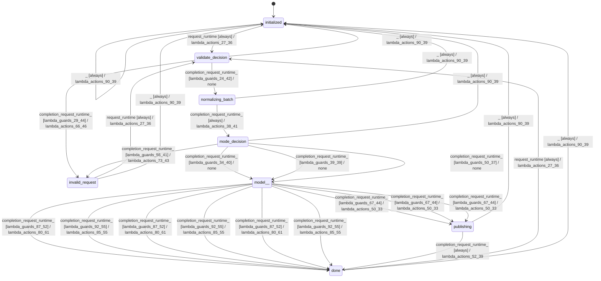

# batch_planner

Source: [`emel/batch/planner/sm.hpp`](https://github.com/stateforward/emel.cpp/blob/main/src/emel/batch/planner/sm.hpp)

## Mermaid

## Transitions

| Source | Event | Guard | Action | Target |
| --- | --- | --- | --- | --- |
| [`initialized`](https://github.com/stateforward/emel.cpp/blob/main/src/emel/batch/planner/sm.hpp) | [`request_runtime`](https://github.com/stateforward/emel.cpp/blob/main/src/emel/batch/planner/sm.hpp) | [`always`](https://github.com/stateforward/emel.cpp/blob/main/src/emel/batch/planner/sm.hpp) | [`lambda_actions_27_36`](https://github.com/stateforward/emel.cpp/blob/main/src/emel/batch/planner/sm.hpp) | [`validate_decision`](https://github.com/stateforward/emel.cpp/blob/main/src/emel/batch/planner/sm.hpp) |
| [`validate_decision`](https://github.com/stateforward/emel.cpp/blob/main/src/emel/batch/planner/sm.hpp) | [`completion<request_runtime>`](https://github.com/stateforward/emel.cpp/blob/main/src/emel/batch/planner/sm.hpp) | [`lambda_guards_24_42`](https://github.com/stateforward/emel.cpp/blob/main/src/emel/batch/planner/sm.hpp) | [`none`](https://github.com/stateforward/emel.cpp/blob/main/src/emel/batch/planner/sm.hpp) | [`normalizing_batch`](https://github.com/stateforward/emel.cpp/blob/main/src/emel/batch/planner/sm.hpp) |
| [`validate_decision`](https://github.com/stateforward/emel.cpp/blob/main/src/emel/batch/planner/sm.hpp) | [`completion<request_runtime>`](https://github.com/stateforward/emel.cpp/blob/main/src/emel/batch/planner/sm.hpp) | [`lambda_guards_29_44`](https://github.com/stateforward/emel.cpp/blob/main/src/emel/batch/planner/sm.hpp) | [`lambda_actions_66_46`](https://github.com/stateforward/emel.cpp/blob/main/src/emel/batch/planner/sm.hpp) | [`invalid_request`](https://github.com/stateforward/emel.cpp/blob/main/src/emel/batch/planner/sm.hpp) |
| [`normalizing_batch`](https://github.com/stateforward/emel.cpp/blob/main/src/emel/batch/planner/sm.hpp) | [`completion<request_runtime>`](https://github.com/stateforward/emel.cpp/blob/main/src/emel/batch/planner/sm.hpp) | [`always`](https://github.com/stateforward/emel.cpp/blob/main/src/emel/batch/planner/sm.hpp) | [`lambda_actions_38_41`](https://github.com/stateforward/emel.cpp/blob/main/src/emel/batch/planner/sm.hpp) | [`mode_decision`](https://github.com/stateforward/emel.cpp/blob/main/src/emel/batch/planner/sm.hpp) |
| [`mode_decision`](https://github.com/stateforward/emel.cpp/blob/main/src/emel/batch/planner/sm.hpp) | [`completion<request_runtime>`](https://github.com/stateforward/emel.cpp/blob/main/src/emel/batch/planner/sm.hpp) | [`lambda_guards_34_40`](https://github.com/stateforward/emel.cpp/blob/main/src/emel/batch/planner/sm.hpp) | [`none`](https://github.com/stateforward/emel.cpp/blob/main/src/emel/batch/planner/sm.hpp) | [`model>>`](https://github.com/stateforward/emel.cpp/blob/main/src/emel/batch/planner/sm.hpp) |
| [`mode_decision`](https://github.com/stateforward/emel.cpp/blob/main/src/emel/batch/planner/sm.hpp) | [`completion<request_runtime>`](https://github.com/stateforward/emel.cpp/blob/main/src/emel/batch/planner/sm.hpp) | [`lambda_guards_39_39`](https://github.com/stateforward/emel.cpp/blob/main/src/emel/batch/planner/sm.hpp) | [`none`](https://github.com/stateforward/emel.cpp/blob/main/src/emel/batch/planner/sm.hpp) | [`model>>`](https://github.com/stateforward/emel.cpp/blob/main/src/emel/batch/planner/sm.hpp) |
| [`mode_decision`](https://github.com/stateforward/emel.cpp/blob/main/src/emel/batch/planner/sm.hpp) | [`completion<request_runtime>`](https://github.com/stateforward/emel.cpp/blob/main/src/emel/batch/planner/sm.hpp) | [`lambda_guards_50_37`](https://github.com/stateforward/emel.cpp/blob/main/src/emel/batch/planner/sm.hpp) | [`none`](https://github.com/stateforward/emel.cpp/blob/main/src/emel/batch/planner/sm.hpp) | [`model>>`](https://github.com/stateforward/emel.cpp/blob/main/src/emel/batch/planner/sm.hpp) |
| [`mode_decision`](https://github.com/stateforward/emel.cpp/blob/main/src/emel/batch/planner/sm.hpp) | [`completion<request_runtime>`](https://github.com/stateforward/emel.cpp/blob/main/src/emel/batch/planner/sm.hpp) | [`lambda_guards_56_41`](https://github.com/stateforward/emel.cpp/blob/main/src/emel/batch/planner/sm.hpp) | [`lambda_actions_73_43`](https://github.com/stateforward/emel.cpp/blob/main/src/emel/batch/planner/sm.hpp) | [`invalid_request`](https://github.com/stateforward/emel.cpp/blob/main/src/emel/batch/planner/sm.hpp) |
| [`model>>`](https://github.com/stateforward/emel.cpp/blob/main/src/emel/batch/planner/sm.hpp) | [`completion<request_runtime>`](https://github.com/stateforward/emel.cpp/blob/main/src/emel/batch/planner/sm.hpp) | [`lambda_guards_67_44`](https://github.com/stateforward/emel.cpp/blob/main/src/emel/batch/planner/sm.hpp) | [`lambda_actions_50_33`](https://github.com/stateforward/emel.cpp/blob/main/src/emel/batch/planner/sm.hpp) | [`publishing`](https://github.com/stateforward/emel.cpp/blob/main/src/emel/batch/planner/sm.hpp) |
| [`model>>`](https://github.com/stateforward/emel.cpp/blob/main/src/emel/batch/planner/sm.hpp) | [`completion<request_runtime>`](https://github.com/stateforward/emel.cpp/blob/main/src/emel/batch/planner/sm.hpp) | [`lambda_guards_87_52`](https://github.com/stateforward/emel.cpp/blob/main/src/emel/batch/planner/sm.hpp) | [`lambda_actions_80_61`](https://github.com/stateforward/emel.cpp/blob/main/src/emel/batch/planner/sm.hpp) | [`done`](https://github.com/stateforward/emel.cpp/blob/main/src/emel/batch/planner/sm.hpp) |
| [`model>>`](https://github.com/stateforward/emel.cpp/blob/main/src/emel/batch/planner/sm.hpp) | [`completion<request_runtime>`](https://github.com/stateforward/emel.cpp/blob/main/src/emel/batch/planner/sm.hpp) | [`lambda_guards_92_55`](https://github.com/stateforward/emel.cpp/blob/main/src/emel/batch/planner/sm.hpp) | [`lambda_actions_85_55`](https://github.com/stateforward/emel.cpp/blob/main/src/emel/batch/planner/sm.hpp) | [`done`](https://github.com/stateforward/emel.cpp/blob/main/src/emel/batch/planner/sm.hpp) |
| [`model>>`](https://github.com/stateforward/emel.cpp/blob/main/src/emel/batch/planner/sm.hpp) | [`completion<request_runtime>`](https://github.com/stateforward/emel.cpp/blob/main/src/emel/batch/planner/sm.hpp) | [`lambda_guards_67_44`](https://github.com/stateforward/emel.cpp/blob/main/src/emel/batch/planner/sm.hpp) | [`lambda_actions_50_33`](https://github.com/stateforward/emel.cpp/blob/main/src/emel/batch/planner/sm.hpp) | [`publishing`](https://github.com/stateforward/emel.cpp/blob/main/src/emel/batch/planner/sm.hpp) |
| [`model>>`](https://github.com/stateforward/emel.cpp/blob/main/src/emel/batch/planner/sm.hpp) | [`completion<request_runtime>`](https://github.com/stateforward/emel.cpp/blob/main/src/emel/batch/planner/sm.hpp) | [`lambda_guards_87_52`](https://github.com/stateforward/emel.cpp/blob/main/src/emel/batch/planner/sm.hpp) | [`lambda_actions_80_61`](https://github.com/stateforward/emel.cpp/blob/main/src/emel/batch/planner/sm.hpp) | [`done`](https://github.com/stateforward/emel.cpp/blob/main/src/emel/batch/planner/sm.hpp) |
| [`model>>`](https://github.com/stateforward/emel.cpp/blob/main/src/emel/batch/planner/sm.hpp) | [`completion<request_runtime>`](https://github.com/stateforward/emel.cpp/blob/main/src/emel/batch/planner/sm.hpp) | [`lambda_guards_92_55`](https://github.com/stateforward/emel.cpp/blob/main/src/emel/batch/planner/sm.hpp) | [`lambda_actions_85_55`](https://github.com/stateforward/emel.cpp/blob/main/src/emel/batch/planner/sm.hpp) | [`done`](https://github.com/stateforward/emel.cpp/blob/main/src/emel/batch/planner/sm.hpp) |
| [`model>>`](https://github.com/stateforward/emel.cpp/blob/main/src/emel/batch/planner/sm.hpp) | [`completion<request_runtime>`](https://github.com/stateforward/emel.cpp/blob/main/src/emel/batch/planner/sm.hpp) | [`lambda_guards_67_44`](https://github.com/stateforward/emel.cpp/blob/main/src/emel/batch/planner/sm.hpp) | [`lambda_actions_50_33`](https://github.com/stateforward/emel.cpp/blob/main/src/emel/batch/planner/sm.hpp) | [`publishing`](https://github.com/stateforward/emel.cpp/blob/main/src/emel/batch/planner/sm.hpp) |
| [`model>>`](https://github.com/stateforward/emel.cpp/blob/main/src/emel/batch/planner/sm.hpp) | [`completion<request_runtime>`](https://github.com/stateforward/emel.cpp/blob/main/src/emel/batch/planner/sm.hpp) | [`lambda_guards_87_52`](https://github.com/stateforward/emel.cpp/blob/main/src/emel/batch/planner/sm.hpp) | [`lambda_actions_80_61`](https://github.com/stateforward/emel.cpp/blob/main/src/emel/batch/planner/sm.hpp) | [`done`](https://github.com/stateforward/emel.cpp/blob/main/src/emel/batch/planner/sm.hpp) |
| [`model>>`](https://github.com/stateforward/emel.cpp/blob/main/src/emel/batch/planner/sm.hpp) | [`completion<request_runtime>`](https://github.com/stateforward/emel.cpp/blob/main/src/emel/batch/planner/sm.hpp) | [`lambda_guards_92_55`](https://github.com/stateforward/emel.cpp/blob/main/src/emel/batch/planner/sm.hpp) | [`lambda_actions_85_55`](https://github.com/stateforward/emel.cpp/blob/main/src/emel/batch/planner/sm.hpp) | [`done`](https://github.com/stateforward/emel.cpp/blob/main/src/emel/batch/planner/sm.hpp) |
| [`publishing`](https://github.com/stateforward/emel.cpp/blob/main/src/emel/batch/planner/sm.hpp) | [`completion<request_runtime>`](https://github.com/stateforward/emel.cpp/blob/main/src/emel/batch/planner/sm.hpp) | [`always`](https://github.com/stateforward/emel.cpp/blob/main/src/emel/batch/planner/sm.hpp) | [`lambda_actions_52_39`](https://github.com/stateforward/emel.cpp/blob/main/src/emel/batch/planner/sm.hpp) | [`done`](https://github.com/stateforward/emel.cpp/blob/main/src/emel/batch/planner/sm.hpp) |
| [`done`](https://github.com/stateforward/emel.cpp/blob/main/src/emel/batch/planner/sm.hpp) | [`request_runtime`](https://github.com/stateforward/emel.cpp/blob/main/src/emel/batch/planner/sm.hpp) | [`always`](https://github.com/stateforward/emel.cpp/blob/main/src/emel/batch/planner/sm.hpp) | [`lambda_actions_27_36`](https://github.com/stateforward/emel.cpp/blob/main/src/emel/batch/planner/sm.hpp) | [`validate_decision`](https://github.com/stateforward/emel.cpp/blob/main/src/emel/batch/planner/sm.hpp) |
| [`invalid_request`](https://github.com/stateforward/emel.cpp/blob/main/src/emel/batch/planner/sm.hpp) | [`request_runtime`](https://github.com/stateforward/emel.cpp/blob/main/src/emel/batch/planner/sm.hpp) | [`always`](https://github.com/stateforward/emel.cpp/blob/main/src/emel/batch/planner/sm.hpp) | [`lambda_actions_27_36`](https://github.com/stateforward/emel.cpp/blob/main/src/emel/batch/planner/sm.hpp) | [`validate_decision`](https://github.com/stateforward/emel.cpp/blob/main/src/emel/batch/planner/sm.hpp) |
| [`initialized`](https://github.com/stateforward/emel.cpp/blob/main/src/emel/batch/planner/sm.hpp) | [`_`](https://github.com/stateforward/emel.cpp/blob/main/src/emel/batch/planner/sm.hpp) | [`always`](https://github.com/stateforward/emel.cpp/blob/main/src/emel/batch/planner/sm.hpp) | [`lambda_actions_90_39`](https://github.com/stateforward/emel.cpp/blob/main/src/emel/batch/planner/sm.hpp) | [`initialized`](https://github.com/stateforward/emel.cpp/blob/main/src/emel/batch/planner/sm.hpp) |
| [`validate_decision`](https://github.com/stateforward/emel.cpp/blob/main/src/emel/batch/planner/sm.hpp) | [`_`](https://github.com/stateforward/emel.cpp/blob/main/src/emel/batch/planner/sm.hpp) | [`always`](https://github.com/stateforward/emel.cpp/blob/main/src/emel/batch/planner/sm.hpp) | [`lambda_actions_90_39`](https://github.com/stateforward/emel.cpp/blob/main/src/emel/batch/planner/sm.hpp) | [`initialized`](https://github.com/stateforward/emel.cpp/blob/main/src/emel/batch/planner/sm.hpp) |
| [`normalizing_batch`](https://github.com/stateforward/emel.cpp/blob/main/src/emel/batch/planner/sm.hpp) | [`_`](https://github.com/stateforward/emel.cpp/blob/main/src/emel/batch/planner/sm.hpp) | [`always`](https://github.com/stateforward/emel.cpp/blob/main/src/emel/batch/planner/sm.hpp) | [`lambda_actions_90_39`](https://github.com/stateforward/emel.cpp/blob/main/src/emel/batch/planner/sm.hpp) | [`initialized`](https://github.com/stateforward/emel.cpp/blob/main/src/emel/batch/planner/sm.hpp) |
| [`mode_decision`](https://github.com/stateforward/emel.cpp/blob/main/src/emel/batch/planner/sm.hpp) | [`_`](https://github.com/stateforward/emel.cpp/blob/main/src/emel/batch/planner/sm.hpp) | [`always`](https://github.com/stateforward/emel.cpp/blob/main/src/emel/batch/planner/sm.hpp) | [`lambda_actions_90_39`](https://github.com/stateforward/emel.cpp/blob/main/src/emel/batch/planner/sm.hpp) | [`initialized`](https://github.com/stateforward/emel.cpp/blob/main/src/emel/batch/planner/sm.hpp) |
| [`publishing`](https://github.com/stateforward/emel.cpp/blob/main/src/emel/batch/planner/sm.hpp) | [`_`](https://github.com/stateforward/emel.cpp/blob/main/src/emel/batch/planner/sm.hpp) | [`always`](https://github.com/stateforward/emel.cpp/blob/main/src/emel/batch/planner/sm.hpp) | [`lambda_actions_90_39`](https://github.com/stateforward/emel.cpp/blob/main/src/emel/batch/planner/sm.hpp) | [`initialized`](https://github.com/stateforward/emel.cpp/blob/main/src/emel/batch/planner/sm.hpp) |
| [`done`](https://github.com/stateforward/emel.cpp/blob/main/src/emel/batch/planner/sm.hpp) | [`_`](https://github.com/stateforward/emel.cpp/blob/main/src/emel/batch/planner/sm.hpp) | [`always`](https://github.com/stateforward/emel.cpp/blob/main/src/emel/batch/planner/sm.hpp) | [`lambda_actions_90_39`](https://github.com/stateforward/emel.cpp/blob/main/src/emel/batch/planner/sm.hpp) | [`initialized`](https://github.com/stateforward/emel.cpp/blob/main/src/emel/batch/planner/sm.hpp) |
| [`invalid_request`](https://github.com/stateforward/emel.cpp/blob/main/src/emel/batch/planner/sm.hpp) | [`_`](https://github.com/stateforward/emel.cpp/blob/main/src/emel/batch/planner/sm.hpp) | [`always`](https://github.com/stateforward/emel.cpp/blob/main/src/emel/batch/planner/sm.hpp) | [`lambda_actions_90_39`](https://github.com/stateforward/emel.cpp/blob/main/src/emel/batch/planner/sm.hpp) | [`initialized`](https://github.com/stateforward/emel.cpp/blob/main/src/emel/batch/planner/sm.hpp) |
