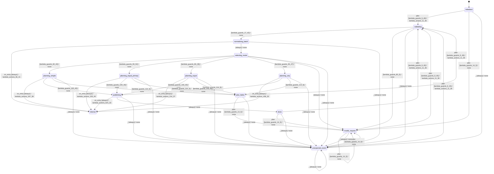

# batch_planner

Source: [`emel/batch/planner/sm.hpp`](https://github.com/stateforward/emel.cpp/blob/main/src/emel/batch/planner/sm.hpp)

## Mermaid

## Transitions

| Source | Event | Guard | Action | Target |
| --- | --- | --- | --- | --- |
| [`initialized`](https://github.com/stateforward/emel.cpp/blob/main/src/emel/batch/planner/sm.hpp) | [`plan`](https://github.com/stateforward/emel.cpp/blob/main/src/emel/batch/planner/sm.hpp) | [`lambda_guards_9_45`](https://github.com/stateforward/emel.cpp/blob/main/src/emel/batch/planner/sm.hpp) | [`lambda_actions_11_36`](https://github.com/stateforward/emel.cpp/blob/main/src/emel/batch/planner/sm.hpp) | [`validating`](https://github.com/stateforward/emel.cpp/blob/main/src/emel/batch/planner/sm.hpp) |
| [`initialized`](https://github.com/stateforward/emel.cpp/blob/main/src/emel/batch/planner/sm.hpp) | [`plan`](https://github.com/stateforward/emel.cpp/blob/main/src/emel/batch/planner/sm.hpp) | [`lambda_guards_14_5`](https://github.com/stateforward/emel.cpp/blob/main/src/emel/batch/planner/sm.hpp) | [`none`](https://github.com/stateforward/emel.cpp/blob/main/src/emel/batch/planner/sm.hpp) | [`invalid_request`](https://github.com/stateforward/emel.cpp/blob/main/src/emel/batch/planner/sm.hpp) |
| [`validating`](https://github.com/stateforward/emel.cpp/blob/main/src/emel/batch/planner/sm.hpp) | - | [`lambda_guards_17_42`](https://github.com/stateforward/emel.cpp/blob/main/src/emel/batch/planner/sm.hpp) | [`none`](https://github.com/stateforward/emel.cpp/blob/main/src/emel/batch/planner/sm.hpp) | [`normalizing_batch`](https://github.com/stateforward/emel.cpp/blob/main/src/emel/batch/planner/sm.hpp) |
| [`validating`](https://github.com/stateforward/emel.cpp/blob/main/src/emel/batch/planner/sm.hpp) | - | [`lambda_guards_80_5`](https://github.com/stateforward/emel.cpp/blob/main/src/emel/batch/planner/sm.hpp) | [`none`](https://github.com/stateforward/emel.cpp/blob/main/src/emel/batch/planner/sm.hpp) | [`invalid_request`](https://github.com/stateforward/emel.cpp/blob/main/src/emel/batch/planner/sm.hpp) |
| [`normalizing_batch`](https://github.com/stateforward/emel.cpp/blob/main/src/emel/batch/planner/sm.hpp) | [`on_entry`](https://github.com/stateforward/emel.cpp/blob/main/src/emel/batch/planner/sm.hpp) | [`always`](https://github.com/stateforward/emel.cpp/blob/main/src/emel/batch/planner/sm.hpp) | [`lambda_actions_36_41`](https://github.com/stateforward/emel.cpp/blob/main/src/emel/batch/planner/sm.hpp) | [`internal`](https://github.com/stateforward/emel.cpp/blob/main/src/emel/batch/planner/sm.hpp) |
| [`normalizing_batch`](https://github.com/stateforward/emel.cpp/blob/main/src/emel/batch/planner/sm.hpp) | - | [`always`](https://github.com/stateforward/emel.cpp/blob/main/src/emel/batch/planner/sm.hpp) | [`none`](https://github.com/stateforward/emel.cpp/blob/main/src/emel/batch/planner/sm.hpp) | [`selecting_mode`](https://github.com/stateforward/emel.cpp/blob/main/src/emel/batch/planner/sm.hpp) |
| [`selecting_mode`](https://github.com/stateforward/emel.cpp/blob/main/src/emel/batch/planner/sm.hpp) | - | [`lambda_guards_82_40`](https://github.com/stateforward/emel.cpp/blob/main/src/emel/batch/planner/sm.hpp) | [`none`](https://github.com/stateforward/emel.cpp/blob/main/src/emel/batch/planner/sm.hpp) | [`planning_simple`](https://github.com/stateforward/emel.cpp/blob/main/src/emel/batch/planner/sm.hpp) |
| [`selecting_mode`](https://github.com/stateforward/emel.cpp/blob/main/src/emel/batch/planner/sm.hpp) | - | [`lambda_guards_90_52`](https://github.com/stateforward/emel.cpp/blob/main/src/emel/batch/planner/sm.hpp) | [`none`](https://github.com/stateforward/emel.cpp/blob/main/src/emel/batch/planner/sm.hpp) | [`planning_equal_primary`](https://github.com/stateforward/emel.cpp/blob/main/src/emel/batch/planner/sm.hpp) |
| [`selecting_mode`](https://github.com/stateforward/emel.cpp/blob/main/src/emel/batch/planner/sm.hpp) | - | [`lambda_guards_86_39`](https://github.com/stateforward/emel.cpp/blob/main/src/emel/batch/planner/sm.hpp) | [`none`](https://github.com/stateforward/emel.cpp/blob/main/src/emel/batch/planner/sm.hpp) | [`planning_equal`](https://github.com/stateforward/emel.cpp/blob/main/src/emel/batch/planner/sm.hpp) |
| [`selecting_mode`](https://github.com/stateforward/emel.cpp/blob/main/src/emel/batch/planner/sm.hpp) | - | [`lambda_guards_95_37`](https://github.com/stateforward/emel.cpp/blob/main/src/emel/batch/planner/sm.hpp) | [`none`](https://github.com/stateforward/emel.cpp/blob/main/src/emel/batch/planner/sm.hpp) | [`planning_seq`](https://github.com/stateforward/emel.cpp/blob/main/src/emel/batch/planner/sm.hpp) |
| [`selecting_mode`](https://github.com/stateforward/emel.cpp/blob/main/src/emel/batch/planner/sm.hpp) | - | [`always`](https://github.com/stateforward/emel.cpp/blob/main/src/emel/batch/planner/sm.hpp) | [`none`](https://github.com/stateforward/emel.cpp/blob/main/src/emel/batch/planner/sm.hpp) | [`invalid_request`](https://github.com/stateforward/emel.cpp/blob/main/src/emel/batch/planner/sm.hpp) |
| [`planning_simple`](https://github.com/stateforward/emel.cpp/blob/main/src/emel/batch/planner/sm.hpp) | [`on_entry`](https://github.com/stateforward/emel.cpp/blob/main/src/emel/batch/planner/sm.hpp) | [`always`](https://github.com/stateforward/emel.cpp/blob/main/src/emel/batch/planner/sm.hpp) | [`lambda_actions_187_38`](https://github.com/stateforward/emel.cpp/blob/main/src/emel/batch/planner/sm.hpp) | [`internal`](https://github.com/stateforward/emel.cpp/blob/main/src/emel/batch/planner/sm.hpp) |
| [`planning_simple`](https://github.com/stateforward/emel.cpp/blob/main/src/emel/batch/planner/sm.hpp) | - | [`lambda_guards_100_40`](https://github.com/stateforward/emel.cpp/blob/main/src/emel/batch/planner/sm.hpp) | [`none`](https://github.com/stateforward/emel.cpp/blob/main/src/emel/batch/planner/sm.hpp) | [`publishing`](https://github.com/stateforward/emel.cpp/blob/main/src/emel/batch/planner/sm.hpp) |
| [`planning_simple`](https://github.com/stateforward/emel.cpp/blob/main/src/emel/batch/planner/sm.hpp) | - | [`lambda_guards_114_5`](https://github.com/stateforward/emel.cpp/blob/main/src/emel/batch/planner/sm.hpp) | [`none`](https://github.com/stateforward/emel.cpp/blob/main/src/emel/batch/planner/sm.hpp) | [`plan_failed`](https://github.com/stateforward/emel.cpp/blob/main/src/emel/batch/planner/sm.hpp) |
| [`planning_equal`](https://github.com/stateforward/emel.cpp/blob/main/src/emel/batch/planner/sm.hpp) | [`on_entry`](https://github.com/stateforward/emel.cpp/blob/main/src/emel/batch/planner/sm.hpp) | [`always`](https://github.com/stateforward/emel.cpp/blob/main/src/emel/batch/planner/sm.hpp) | [`lambda_actions_214_37`](https://github.com/stateforward/emel.cpp/blob/main/src/emel/batch/planner/sm.hpp) | [`internal`](https://github.com/stateforward/emel.cpp/blob/main/src/emel/batch/planner/sm.hpp) |
| [`planning_equal`](https://github.com/stateforward/emel.cpp/blob/main/src/emel/batch/planner/sm.hpp) | - | [`lambda_guards_100_40`](https://github.com/stateforward/emel.cpp/blob/main/src/emel/batch/planner/sm.hpp) | [`none`](https://github.com/stateforward/emel.cpp/blob/main/src/emel/batch/planner/sm.hpp) | [`publishing`](https://github.com/stateforward/emel.cpp/blob/main/src/emel/batch/planner/sm.hpp) |
| [`planning_equal`](https://github.com/stateforward/emel.cpp/blob/main/src/emel/batch/planner/sm.hpp) | - | [`lambda_guards_114_5`](https://github.com/stateforward/emel.cpp/blob/main/src/emel/batch/planner/sm.hpp) | [`none`](https://github.com/stateforward/emel.cpp/blob/main/src/emel/batch/planner/sm.hpp) | [`plan_failed`](https://github.com/stateforward/emel.cpp/blob/main/src/emel/batch/planner/sm.hpp) |
| [`planning_equal_primary`](https://github.com/stateforward/emel.cpp/blob/main/src/emel/batch/planner/sm.hpp) | [`on_entry`](https://github.com/stateforward/emel.cpp/blob/main/src/emel/batch/planner/sm.hpp) | [`always`](https://github.com/stateforward/emel.cpp/blob/main/src/emel/batch/planner/sm.hpp) | [`lambda_actions_333_45`](https://github.com/stateforward/emel.cpp/blob/main/src/emel/batch/planner/sm.hpp) | [`internal`](https://github.com/stateforward/emel.cpp/blob/main/src/emel/batch/planner/sm.hpp) |
| [`planning_equal_primary`](https://github.com/stateforward/emel.cpp/blob/main/src/emel/batch/planner/sm.hpp) | - | [`lambda_guards_100_40`](https://github.com/stateforward/emel.cpp/blob/main/src/emel/batch/planner/sm.hpp) | [`none`](https://github.com/stateforward/emel.cpp/blob/main/src/emel/batch/planner/sm.hpp) | [`publishing`](https://github.com/stateforward/emel.cpp/blob/main/src/emel/batch/planner/sm.hpp) |
| [`planning_equal_primary`](https://github.com/stateforward/emel.cpp/blob/main/src/emel/batch/planner/sm.hpp) | - | [`lambda_guards_114_5`](https://github.com/stateforward/emel.cpp/blob/main/src/emel/batch/planner/sm.hpp) | [`none`](https://github.com/stateforward/emel.cpp/blob/main/src/emel/batch/planner/sm.hpp) | [`plan_failed`](https://github.com/stateforward/emel.cpp/blob/main/src/emel/batch/planner/sm.hpp) |
| [`planning_seq`](https://github.com/stateforward/emel.cpp/blob/main/src/emel/batch/planner/sm.hpp) | [`on_entry`](https://github.com/stateforward/emel.cpp/blob/main/src/emel/batch/planner/sm.hpp) | [`always`](https://github.com/stateforward/emel.cpp/blob/main/src/emel/batch/planner/sm.hpp) | [`lambda_actions_458_35`](https://github.com/stateforward/emel.cpp/blob/main/src/emel/batch/planner/sm.hpp) | [`internal`](https://github.com/stateforward/emel.cpp/blob/main/src/emel/batch/planner/sm.hpp) |
| [`planning_seq`](https://github.com/stateforward/emel.cpp/blob/main/src/emel/batch/planner/sm.hpp) | - | [`lambda_guards_100_40`](https://github.com/stateforward/emel.cpp/blob/main/src/emel/batch/planner/sm.hpp) | [`none`](https://github.com/stateforward/emel.cpp/blob/main/src/emel/batch/planner/sm.hpp) | [`publishing`](https://github.com/stateforward/emel.cpp/blob/main/src/emel/batch/planner/sm.hpp) |
| [`planning_seq`](https://github.com/stateforward/emel.cpp/blob/main/src/emel/batch/planner/sm.hpp) | - | [`lambda_guards_114_5`](https://github.com/stateforward/emel.cpp/blob/main/src/emel/batch/planner/sm.hpp) | [`none`](https://github.com/stateforward/emel.cpp/blob/main/src/emel/batch/planner/sm.hpp) | [`plan_failed`](https://github.com/stateforward/emel.cpp/blob/main/src/emel/batch/planner/sm.hpp) |
| [`publishing`](https://github.com/stateforward/emel.cpp/blob/main/src/emel/batch/planner/sm.hpp) | [`on_entry`](https://github.com/stateforward/emel.cpp/blob/main/src/emel/batch/planner/sm.hpp) | [`always`](https://github.com/stateforward/emel.cpp/blob/main/src/emel/batch/planner/sm.hpp) | [`lambda_actions_524_33`](https://github.com/stateforward/emel.cpp/blob/main/src/emel/batch/planner/sm.hpp) | [`internal`](https://github.com/stateforward/emel.cpp/blob/main/src/emel/batch/planner/sm.hpp) |
| [`publishing`](https://github.com/stateforward/emel.cpp/blob/main/src/emel/batch/planner/sm.hpp) | - | [`always`](https://github.com/stateforward/emel.cpp/blob/main/src/emel/batch/planner/sm.hpp) | [`none`](https://github.com/stateforward/emel.cpp/blob/main/src/emel/batch/planner/sm.hpp) | [`done`](https://github.com/stateforward/emel.cpp/blob/main/src/emel/batch/planner/sm.hpp) |
| [`done`](https://github.com/stateforward/emel.cpp/blob/main/src/emel/batch/planner/sm.hpp) | [`plan`](https://github.com/stateforward/emel.cpp/blob/main/src/emel/batch/planner/sm.hpp) | [`lambda_guards_9_45`](https://github.com/stateforward/emel.cpp/blob/main/src/emel/batch/planner/sm.hpp) | [`lambda_actions_11_36`](https://github.com/stateforward/emel.cpp/blob/main/src/emel/batch/planner/sm.hpp) | [`validating`](https://github.com/stateforward/emel.cpp/blob/main/src/emel/batch/planner/sm.hpp) |
| [`done`](https://github.com/stateforward/emel.cpp/blob/main/src/emel/batch/planner/sm.hpp) | [`plan`](https://github.com/stateforward/emel.cpp/blob/main/src/emel/batch/planner/sm.hpp) | [`lambda_guards_14_5`](https://github.com/stateforward/emel.cpp/blob/main/src/emel/batch/planner/sm.hpp) | [`none`](https://github.com/stateforward/emel.cpp/blob/main/src/emel/batch/planner/sm.hpp) | [`invalid_request`](https://github.com/stateforward/emel.cpp/blob/main/src/emel/batch/planner/sm.hpp) |
| [`invalid_request`](https://github.com/stateforward/emel.cpp/blob/main/src/emel/batch/planner/sm.hpp) | [`plan`](https://github.com/stateforward/emel.cpp/blob/main/src/emel/batch/planner/sm.hpp) | [`lambda_guards_9_45`](https://github.com/stateforward/emel.cpp/blob/main/src/emel/batch/planner/sm.hpp) | [`lambda_actions_11_36`](https://github.com/stateforward/emel.cpp/blob/main/src/emel/batch/planner/sm.hpp) | [`validating`](https://github.com/stateforward/emel.cpp/blob/main/src/emel/batch/planner/sm.hpp) |
| [`invalid_request`](https://github.com/stateforward/emel.cpp/blob/main/src/emel/batch/planner/sm.hpp) | [`plan`](https://github.com/stateforward/emel.cpp/blob/main/src/emel/batch/planner/sm.hpp) | [`lambda_guards_14_5`](https://github.com/stateforward/emel.cpp/blob/main/src/emel/batch/planner/sm.hpp) | [`none`](https://github.com/stateforward/emel.cpp/blob/main/src/emel/batch/planner/sm.hpp) | [`invalid_request`](https://github.com/stateforward/emel.cpp/blob/main/src/emel/batch/planner/sm.hpp) |
| [`plan_failed`](https://github.com/stateforward/emel.cpp/blob/main/src/emel/batch/planner/sm.hpp) | [`plan`](https://github.com/stateforward/emel.cpp/blob/main/src/emel/batch/planner/sm.hpp) | [`lambda_guards_9_45`](https://github.com/stateforward/emel.cpp/blob/main/src/emel/batch/planner/sm.hpp) | [`lambda_actions_11_36`](https://github.com/stateforward/emel.cpp/blob/main/src/emel/batch/planner/sm.hpp) | [`validating`](https://github.com/stateforward/emel.cpp/blob/main/src/emel/batch/planner/sm.hpp) |
| [`plan_failed`](https://github.com/stateforward/emel.cpp/blob/main/src/emel/batch/planner/sm.hpp) | [`plan`](https://github.com/stateforward/emel.cpp/blob/main/src/emel/batch/planner/sm.hpp) | [`lambda_guards_14_5`](https://github.com/stateforward/emel.cpp/blob/main/src/emel/batch/planner/sm.hpp) | [`none`](https://github.com/stateforward/emel.cpp/blob/main/src/emel/batch/planner/sm.hpp) | [`invalid_request`](https://github.com/stateforward/emel.cpp/blob/main/src/emel/batch/planner/sm.hpp) |
| [`unexpected_event`](https://github.com/stateforward/emel.cpp/blob/main/src/emel/batch/planner/sm.hpp) | [`plan`](https://github.com/stateforward/emel.cpp/blob/main/src/emel/batch/planner/sm.hpp) | [`lambda_guards_9_45`](https://github.com/stateforward/emel.cpp/blob/main/src/emel/batch/planner/sm.hpp) | [`lambda_actions_11_36`](https://github.com/stateforward/emel.cpp/blob/main/src/emel/batch/planner/sm.hpp) | [`validating`](https://github.com/stateforward/emel.cpp/blob/main/src/emel/batch/planner/sm.hpp) |
| [`unexpected_event`](https://github.com/stateforward/emel.cpp/blob/main/src/emel/batch/planner/sm.hpp) | [`plan`](https://github.com/stateforward/emel.cpp/blob/main/src/emel/batch/planner/sm.hpp) | [`lambda_guards_14_5`](https://github.com/stateforward/emel.cpp/blob/main/src/emel/batch/planner/sm.hpp) | [`none`](https://github.com/stateforward/emel.cpp/blob/main/src/emel/batch/planner/sm.hpp) | [`invalid_request`](https://github.com/stateforward/emel.cpp/blob/main/src/emel/batch/planner/sm.hpp) |
| [`initialized`](https://github.com/stateforward/emel.cpp/blob/main/src/emel/batch/planner/sm.hpp) | [`_`](https://github.com/stateforward/emel.cpp/blob/main/src/emel/batch/planner/sm.hpp) | [`always`](https://github.com/stateforward/emel.cpp/blob/main/src/emel/batch/planner/sm.hpp) | [`none`](https://github.com/stateforward/emel.cpp/blob/main/src/emel/batch/planner/sm.hpp) | [`unexpected_event`](https://github.com/stateforward/emel.cpp/blob/main/src/emel/batch/planner/sm.hpp) |
| [`validating`](https://github.com/stateforward/emel.cpp/blob/main/src/emel/batch/planner/sm.hpp) | [`_`](https://github.com/stateforward/emel.cpp/blob/main/src/emel/batch/planner/sm.hpp) | [`always`](https://github.com/stateforward/emel.cpp/blob/main/src/emel/batch/planner/sm.hpp) | [`none`](https://github.com/stateforward/emel.cpp/blob/main/src/emel/batch/planner/sm.hpp) | [`unexpected_event`](https://github.com/stateforward/emel.cpp/blob/main/src/emel/batch/planner/sm.hpp) |
| [`normalizing_batch`](https://github.com/stateforward/emel.cpp/blob/main/src/emel/batch/planner/sm.hpp) | [`_`](https://github.com/stateforward/emel.cpp/blob/main/src/emel/batch/planner/sm.hpp) | [`always`](https://github.com/stateforward/emel.cpp/blob/main/src/emel/batch/planner/sm.hpp) | [`none`](https://github.com/stateforward/emel.cpp/blob/main/src/emel/batch/planner/sm.hpp) | [`unexpected_event`](https://github.com/stateforward/emel.cpp/blob/main/src/emel/batch/planner/sm.hpp) |
| [`selecting_mode`](https://github.com/stateforward/emel.cpp/blob/main/src/emel/batch/planner/sm.hpp) | [`_`](https://github.com/stateforward/emel.cpp/blob/main/src/emel/batch/planner/sm.hpp) | [`always`](https://github.com/stateforward/emel.cpp/blob/main/src/emel/batch/planner/sm.hpp) | [`none`](https://github.com/stateforward/emel.cpp/blob/main/src/emel/batch/planner/sm.hpp) | [`unexpected_event`](https://github.com/stateforward/emel.cpp/blob/main/src/emel/batch/planner/sm.hpp) |
| [`planning_simple`](https://github.com/stateforward/emel.cpp/blob/main/src/emel/batch/planner/sm.hpp) | [`_`](https://github.com/stateforward/emel.cpp/blob/main/src/emel/batch/planner/sm.hpp) | [`always`](https://github.com/stateforward/emel.cpp/blob/main/src/emel/batch/planner/sm.hpp) | [`none`](https://github.com/stateforward/emel.cpp/blob/main/src/emel/batch/planner/sm.hpp) | [`unexpected_event`](https://github.com/stateforward/emel.cpp/blob/main/src/emel/batch/planner/sm.hpp) |
| [`planning_equal`](https://github.com/stateforward/emel.cpp/blob/main/src/emel/batch/planner/sm.hpp) | [`_`](https://github.com/stateforward/emel.cpp/blob/main/src/emel/batch/planner/sm.hpp) | [`always`](https://github.com/stateforward/emel.cpp/blob/main/src/emel/batch/planner/sm.hpp) | [`none`](https://github.com/stateforward/emel.cpp/blob/main/src/emel/batch/planner/sm.hpp) | [`unexpected_event`](https://github.com/stateforward/emel.cpp/blob/main/src/emel/batch/planner/sm.hpp) |
| [`planning_equal_primary`](https://github.com/stateforward/emel.cpp/blob/main/src/emel/batch/planner/sm.hpp) | [`_`](https://github.com/stateforward/emel.cpp/blob/main/src/emel/batch/planner/sm.hpp) | [`always`](https://github.com/stateforward/emel.cpp/blob/main/src/emel/batch/planner/sm.hpp) | [`none`](https://github.com/stateforward/emel.cpp/blob/main/src/emel/batch/planner/sm.hpp) | [`unexpected_event`](https://github.com/stateforward/emel.cpp/blob/main/src/emel/batch/planner/sm.hpp) |
| [`planning_seq`](https://github.com/stateforward/emel.cpp/blob/main/src/emel/batch/planner/sm.hpp) | [`_`](https://github.com/stateforward/emel.cpp/blob/main/src/emel/batch/planner/sm.hpp) | [`always`](https://github.com/stateforward/emel.cpp/blob/main/src/emel/batch/planner/sm.hpp) | [`none`](https://github.com/stateforward/emel.cpp/blob/main/src/emel/batch/planner/sm.hpp) | [`unexpected_event`](https://github.com/stateforward/emel.cpp/blob/main/src/emel/batch/planner/sm.hpp) |
| [`publishing`](https://github.com/stateforward/emel.cpp/blob/main/src/emel/batch/planner/sm.hpp) | [`_`](https://github.com/stateforward/emel.cpp/blob/main/src/emel/batch/planner/sm.hpp) | [`always`](https://github.com/stateforward/emel.cpp/blob/main/src/emel/batch/planner/sm.hpp) | [`none`](https://github.com/stateforward/emel.cpp/blob/main/src/emel/batch/planner/sm.hpp) | [`unexpected_event`](https://github.com/stateforward/emel.cpp/blob/main/src/emel/batch/planner/sm.hpp) |
| [`done`](https://github.com/stateforward/emel.cpp/blob/main/src/emel/batch/planner/sm.hpp) | [`_`](https://github.com/stateforward/emel.cpp/blob/main/src/emel/batch/planner/sm.hpp) | [`always`](https://github.com/stateforward/emel.cpp/blob/main/src/emel/batch/planner/sm.hpp) | [`none`](https://github.com/stateforward/emel.cpp/blob/main/src/emel/batch/planner/sm.hpp) | [`unexpected_event`](https://github.com/stateforward/emel.cpp/blob/main/src/emel/batch/planner/sm.hpp) |
| [`invalid_request`](https://github.com/stateforward/emel.cpp/blob/main/src/emel/batch/planner/sm.hpp) | [`_`](https://github.com/stateforward/emel.cpp/blob/main/src/emel/batch/planner/sm.hpp) | [`always`](https://github.com/stateforward/emel.cpp/blob/main/src/emel/batch/planner/sm.hpp) | [`none`](https://github.com/stateforward/emel.cpp/blob/main/src/emel/batch/planner/sm.hpp) | [`unexpected_event`](https://github.com/stateforward/emel.cpp/blob/main/src/emel/batch/planner/sm.hpp) |
| [`plan_failed`](https://github.com/stateforward/emel.cpp/blob/main/src/emel/batch/planner/sm.hpp) | [`_`](https://github.com/stateforward/emel.cpp/blob/main/src/emel/batch/planner/sm.hpp) | [`always`](https://github.com/stateforward/emel.cpp/blob/main/src/emel/batch/planner/sm.hpp) | [`none`](https://github.com/stateforward/emel.cpp/blob/main/src/emel/batch/planner/sm.hpp) | [`unexpected_event`](https://github.com/stateforward/emel.cpp/blob/main/src/emel/batch/planner/sm.hpp) |
| [`unexpected_event`](https://github.com/stateforward/emel.cpp/blob/main/src/emel/batch/planner/sm.hpp) | [`_`](https://github.com/stateforward/emel.cpp/blob/main/src/emel/batch/planner/sm.hpp) | [`always`](https://github.com/stateforward/emel.cpp/blob/main/src/emel/batch/planner/sm.hpp) | [`none`](https://github.com/stateforward/emel.cpp/blob/main/src/emel/batch/planner/sm.hpp) | [`unexpected_event`](https://github.com/stateforward/emel.cpp/blob/main/src/emel/batch/planner/sm.hpp) |
