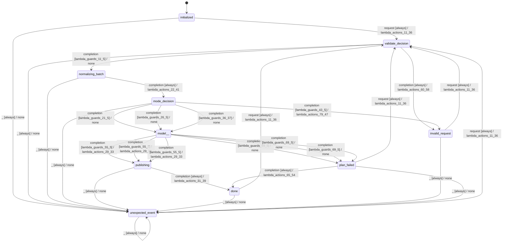

# batch_planner

Source: [`emel/batch/planner/sm.hpp`](https://github.com/stateforward/emel.cpp/blob/main/src/emel/batch/planner/sm.hpp)

## Mermaid

## Transitions

| Source | Event | Guard | Action | Target |
| --- | --- | --- | --- | --- |
| [`initialized`](https://github.com/stateforward/emel.cpp/blob/main/src/emel/batch/planner/sm.hpp) | [`request`](https://github.com/stateforward/emel.cpp/blob/main/src/emel/batch/planner/sm.hpp) | [`always`](https://github.com/stateforward/emel.cpp/blob/main/src/emel/batch/planner/sm.hpp) | [`lambda_actions_11_36`](https://github.com/stateforward/emel.cpp/blob/main/src/emel/batch/planner/sm.hpp) | [`validate_decision`](https://github.com/stateforward/emel.cpp/blob/main/src/emel/batch/planner/sm.hpp) |
| [`validate_decision`](https://github.com/stateforward/emel.cpp/blob/main/src/emel/batch/planner/sm.hpp) | [`completion`](https://github.com/stateforward/emel.cpp/blob/main/src/emel/batch/planner/sm.hpp) | [`lambda_guards_11_5`](https://github.com/stateforward/emel.cpp/blob/main/src/emel/batch/planner/sm.hpp) | [`none`](https://github.com/stateforward/emel.cpp/blob/main/src/emel/batch/planner/sm.hpp) | [`normalizing_batch`](https://github.com/stateforward/emel.cpp/blob/main/src/emel/batch/planner/sm.hpp) |
| [`validate_decision`](https://github.com/stateforward/emel.cpp/blob/main/src/emel/batch/planner/sm.hpp) | [`completion`](https://github.com/stateforward/emel.cpp/blob/main/src/emel/batch/planner/sm.hpp) | [`always`](https://github.com/stateforward/emel.cpp/blob/main/src/emel/batch/planner/sm.hpp) | [`lambda_actions_60_58`](https://github.com/stateforward/emel.cpp/blob/main/src/emel/batch/planner/sm.hpp) | [`invalid_request`](https://github.com/stateforward/emel.cpp/blob/main/src/emel/batch/planner/sm.hpp) |
| [`normalizing_batch`](https://github.com/stateforward/emel.cpp/blob/main/src/emel/batch/planner/sm.hpp) | [`completion`](https://github.com/stateforward/emel.cpp/blob/main/src/emel/batch/planner/sm.hpp) | [`always`](https://github.com/stateforward/emel.cpp/blob/main/src/emel/batch/planner/sm.hpp) | [`lambda_actions_22_41`](https://github.com/stateforward/emel.cpp/blob/main/src/emel/batch/planner/sm.hpp) | [`mode_decision`](https://github.com/stateforward/emel.cpp/blob/main/src/emel/batch/planner/sm.hpp) |
| [`mode_decision`](https://github.com/stateforward/emel.cpp/blob/main/src/emel/batch/planner/sm.hpp) | [`completion`](https://github.com/stateforward/emel.cpp/blob/main/src/emel/batch/planner/sm.hpp) | [`lambda_guards_21_5`](https://github.com/stateforward/emel.cpp/blob/main/src/emel/batch/planner/sm.hpp) | [`none`](https://github.com/stateforward/emel.cpp/blob/main/src/emel/batch/planner/sm.hpp) | [`model>>`](https://github.com/stateforward/emel.cpp/blob/main/src/emel/batch/planner/sm.hpp) |
| [`mode_decision`](https://github.com/stateforward/emel.cpp/blob/main/src/emel/batch/planner/sm.hpp) | [`completion`](https://github.com/stateforward/emel.cpp/blob/main/src/emel/batch/planner/sm.hpp) | [`lambda_guards_26_5`](https://github.com/stateforward/emel.cpp/blob/main/src/emel/batch/planner/sm.hpp) | [`none`](https://github.com/stateforward/emel.cpp/blob/main/src/emel/batch/planner/sm.hpp) | [`model>>`](https://github.com/stateforward/emel.cpp/blob/main/src/emel/batch/planner/sm.hpp) |
| [`mode_decision`](https://github.com/stateforward/emel.cpp/blob/main/src/emel/batch/planner/sm.hpp) | [`completion`](https://github.com/stateforward/emel.cpp/blob/main/src/emel/batch/planner/sm.hpp) | [`lambda_guards_36_37`](https://github.com/stateforward/emel.cpp/blob/main/src/emel/batch/planner/sm.hpp) | [`none`](https://github.com/stateforward/emel.cpp/blob/main/src/emel/batch/planner/sm.hpp) | [`model>>`](https://github.com/stateforward/emel.cpp/blob/main/src/emel/batch/planner/sm.hpp) |
| [`mode_decision`](https://github.com/stateforward/emel.cpp/blob/main/src/emel/batch/planner/sm.hpp) | [`completion`](https://github.com/stateforward/emel.cpp/blob/main/src/emel/batch/planner/sm.hpp) | [`lambda_guards_43_5`](https://github.com/stateforward/emel.cpp/blob/main/src/emel/batch/planner/sm.hpp) | [`lambda_actions_79_47`](https://github.com/stateforward/emel.cpp/blob/main/src/emel/batch/planner/sm.hpp) | [`invalid_request`](https://github.com/stateforward/emel.cpp/blob/main/src/emel/batch/planner/sm.hpp) |
| [`model>>`](https://github.com/stateforward/emel.cpp/blob/main/src/emel/batch/planner/sm.hpp) | [`completion`](https://github.com/stateforward/emel.cpp/blob/main/src/emel/batch/planner/sm.hpp) | [`lambda_guards_55_5`](https://github.com/stateforward/emel.cpp/blob/main/src/emel/batch/planner/sm.hpp) | [`lambda_actions_29_33`](https://github.com/stateforward/emel.cpp/blob/main/src/emel/batch/planner/sm.hpp) | [`publishing`](https://github.com/stateforward/emel.cpp/blob/main/src/emel/batch/planner/sm.hpp) |
| [`model>>`](https://github.com/stateforward/emel.cpp/blob/main/src/emel/batch/planner/sm.hpp) | [`completion`](https://github.com/stateforward/emel.cpp/blob/main/src/emel/batch/planner/sm.hpp) | [`lambda_guards_69_5`](https://github.com/stateforward/emel.cpp/blob/main/src/emel/batch/planner/sm.hpp) | [`none`](https://github.com/stateforward/emel.cpp/blob/main/src/emel/batch/planner/sm.hpp) | [`plan_failed`](https://github.com/stateforward/emel.cpp/blob/main/src/emel/batch/planner/sm.hpp) |
| [`model>>`](https://github.com/stateforward/emel.cpp/blob/main/src/emel/batch/planner/sm.hpp) | [`completion`](https://github.com/stateforward/emel.cpp/blob/main/src/emel/batch/planner/sm.hpp) | [`lambda_guards_55_5`](https://github.com/stateforward/emel.cpp/blob/main/src/emel/batch/planner/sm.hpp) | [`lambda_actions_29_33`](https://github.com/stateforward/emel.cpp/blob/main/src/emel/batch/planner/sm.hpp) | [`publishing`](https://github.com/stateforward/emel.cpp/blob/main/src/emel/batch/planner/sm.hpp) |
| [`model>>`](https://github.com/stateforward/emel.cpp/blob/main/src/emel/batch/planner/sm.hpp) | [`completion`](https://github.com/stateforward/emel.cpp/blob/main/src/emel/batch/planner/sm.hpp) | [`lambda_guards_69_5`](https://github.com/stateforward/emel.cpp/blob/main/src/emel/batch/planner/sm.hpp) | [`none`](https://github.com/stateforward/emel.cpp/blob/main/src/emel/batch/planner/sm.hpp) | [`plan_failed`](https://github.com/stateforward/emel.cpp/blob/main/src/emel/batch/planner/sm.hpp) |
| [`model>>`](https://github.com/stateforward/emel.cpp/blob/main/src/emel/batch/planner/sm.hpp) | [`completion`](https://github.com/stateforward/emel.cpp/blob/main/src/emel/batch/planner/sm.hpp) | [`lambda_guards_55_5`](https://github.com/stateforward/emel.cpp/blob/main/src/emel/batch/planner/sm.hpp) | [`lambda_actions_29_33`](https://github.com/stateforward/emel.cpp/blob/main/src/emel/batch/planner/sm.hpp) | [`publishing`](https://github.com/stateforward/emel.cpp/blob/main/src/emel/batch/planner/sm.hpp) |
| [`model>>`](https://github.com/stateforward/emel.cpp/blob/main/src/emel/batch/planner/sm.hpp) | [`completion`](https://github.com/stateforward/emel.cpp/blob/main/src/emel/batch/planner/sm.hpp) | [`lambda_guards_69_5`](https://github.com/stateforward/emel.cpp/blob/main/src/emel/batch/planner/sm.hpp) | [`none`](https://github.com/stateforward/emel.cpp/blob/main/src/emel/batch/planner/sm.hpp) | [`plan_failed`](https://github.com/stateforward/emel.cpp/blob/main/src/emel/batch/planner/sm.hpp) |
| [`publishing`](https://github.com/stateforward/emel.cpp/blob/main/src/emel/batch/planner/sm.hpp) | [`completion`](https://github.com/stateforward/emel.cpp/blob/main/src/emel/batch/planner/sm.hpp) | [`always`](https://github.com/stateforward/emel.cpp/blob/main/src/emel/batch/planner/sm.hpp) | [`lambda_actions_31_39`](https://github.com/stateforward/emel.cpp/blob/main/src/emel/batch/planner/sm.hpp) | [`done`](https://github.com/stateforward/emel.cpp/blob/main/src/emel/batch/planner/sm.hpp) |
| [`done`](https://github.com/stateforward/emel.cpp/blob/main/src/emel/batch/planner/sm.hpp) | [`request`](https://github.com/stateforward/emel.cpp/blob/main/src/emel/batch/planner/sm.hpp) | [`always`](https://github.com/stateforward/emel.cpp/blob/main/src/emel/batch/planner/sm.hpp) | [`lambda_actions_11_36`](https://github.com/stateforward/emel.cpp/blob/main/src/emel/batch/planner/sm.hpp) | [`validate_decision`](https://github.com/stateforward/emel.cpp/blob/main/src/emel/batch/planner/sm.hpp) |
| [`invalid_request`](https://github.com/stateforward/emel.cpp/blob/main/src/emel/batch/planner/sm.hpp) | [`request`](https://github.com/stateforward/emel.cpp/blob/main/src/emel/batch/planner/sm.hpp) | [`always`](https://github.com/stateforward/emel.cpp/blob/main/src/emel/batch/planner/sm.hpp) | [`lambda_actions_11_36`](https://github.com/stateforward/emel.cpp/blob/main/src/emel/batch/planner/sm.hpp) | [`validate_decision`](https://github.com/stateforward/emel.cpp/blob/main/src/emel/batch/planner/sm.hpp) |
| [`plan_failed`](https://github.com/stateforward/emel.cpp/blob/main/src/emel/batch/planner/sm.hpp) | [`completion`](https://github.com/stateforward/emel.cpp/blob/main/src/emel/batch/planner/sm.hpp) | [`always`](https://github.com/stateforward/emel.cpp/blob/main/src/emel/batch/planner/sm.hpp) | [`lambda_actions_65_54`](https://github.com/stateforward/emel.cpp/blob/main/src/emel/batch/planner/sm.hpp) | [`done`](https://github.com/stateforward/emel.cpp/blob/main/src/emel/batch/planner/sm.hpp) |
| [`plan_failed`](https://github.com/stateforward/emel.cpp/blob/main/src/emel/batch/planner/sm.hpp) | [`request`](https://github.com/stateforward/emel.cpp/blob/main/src/emel/batch/planner/sm.hpp) | [`always`](https://github.com/stateforward/emel.cpp/blob/main/src/emel/batch/planner/sm.hpp) | [`lambda_actions_11_36`](https://github.com/stateforward/emel.cpp/blob/main/src/emel/batch/planner/sm.hpp) | [`validate_decision`](https://github.com/stateforward/emel.cpp/blob/main/src/emel/batch/planner/sm.hpp) |
| [`unexpected_event`](https://github.com/stateforward/emel.cpp/blob/main/src/emel/batch/planner/sm.hpp) | [`request`](https://github.com/stateforward/emel.cpp/blob/main/src/emel/batch/planner/sm.hpp) | [`always`](https://github.com/stateforward/emel.cpp/blob/main/src/emel/batch/planner/sm.hpp) | [`lambda_actions_11_36`](https://github.com/stateforward/emel.cpp/blob/main/src/emel/batch/planner/sm.hpp) | [`validate_decision`](https://github.com/stateforward/emel.cpp/blob/main/src/emel/batch/planner/sm.hpp) |
| [`initialized`](https://github.com/stateforward/emel.cpp/blob/main/src/emel/batch/planner/sm.hpp) | [`_`](https://github.com/stateforward/emel.cpp/blob/main/src/emel/batch/planner/sm.hpp) | [`always`](https://github.com/stateforward/emel.cpp/blob/main/src/emel/batch/planner/sm.hpp) | [`none`](https://github.com/stateforward/emel.cpp/blob/main/src/emel/batch/planner/sm.hpp) | [`unexpected_event`](https://github.com/stateforward/emel.cpp/blob/main/src/emel/batch/planner/sm.hpp) |
| [`validate_decision`](https://github.com/stateforward/emel.cpp/blob/main/src/emel/batch/planner/sm.hpp) | [`_`](https://github.com/stateforward/emel.cpp/blob/main/src/emel/batch/planner/sm.hpp) | [`always`](https://github.com/stateforward/emel.cpp/blob/main/src/emel/batch/planner/sm.hpp) | [`none`](https://github.com/stateforward/emel.cpp/blob/main/src/emel/batch/planner/sm.hpp) | [`unexpected_event`](https://github.com/stateforward/emel.cpp/blob/main/src/emel/batch/planner/sm.hpp) |
| [`normalizing_batch`](https://github.com/stateforward/emel.cpp/blob/main/src/emel/batch/planner/sm.hpp) | [`_`](https://github.com/stateforward/emel.cpp/blob/main/src/emel/batch/planner/sm.hpp) | [`always`](https://github.com/stateforward/emel.cpp/blob/main/src/emel/batch/planner/sm.hpp) | [`none`](https://github.com/stateforward/emel.cpp/blob/main/src/emel/batch/planner/sm.hpp) | [`unexpected_event`](https://github.com/stateforward/emel.cpp/blob/main/src/emel/batch/planner/sm.hpp) |
| [`mode_decision`](https://github.com/stateforward/emel.cpp/blob/main/src/emel/batch/planner/sm.hpp) | [`_`](https://github.com/stateforward/emel.cpp/blob/main/src/emel/batch/planner/sm.hpp) | [`always`](https://github.com/stateforward/emel.cpp/blob/main/src/emel/batch/planner/sm.hpp) | [`none`](https://github.com/stateforward/emel.cpp/blob/main/src/emel/batch/planner/sm.hpp) | [`unexpected_event`](https://github.com/stateforward/emel.cpp/blob/main/src/emel/batch/planner/sm.hpp) |
| [`publishing`](https://github.com/stateforward/emel.cpp/blob/main/src/emel/batch/planner/sm.hpp) | [`_`](https://github.com/stateforward/emel.cpp/blob/main/src/emel/batch/planner/sm.hpp) | [`always`](https://github.com/stateforward/emel.cpp/blob/main/src/emel/batch/planner/sm.hpp) | [`none`](https://github.com/stateforward/emel.cpp/blob/main/src/emel/batch/planner/sm.hpp) | [`unexpected_event`](https://github.com/stateforward/emel.cpp/blob/main/src/emel/batch/planner/sm.hpp) |
| [`done`](https://github.com/stateforward/emel.cpp/blob/main/src/emel/batch/planner/sm.hpp) | [`_`](https://github.com/stateforward/emel.cpp/blob/main/src/emel/batch/planner/sm.hpp) | [`always`](https://github.com/stateforward/emel.cpp/blob/main/src/emel/batch/planner/sm.hpp) | [`none`](https://github.com/stateforward/emel.cpp/blob/main/src/emel/batch/planner/sm.hpp) | [`unexpected_event`](https://github.com/stateforward/emel.cpp/blob/main/src/emel/batch/planner/sm.hpp) |
| [`invalid_request`](https://github.com/stateforward/emel.cpp/blob/main/src/emel/batch/planner/sm.hpp) | [`_`](https://github.com/stateforward/emel.cpp/blob/main/src/emel/batch/planner/sm.hpp) | [`always`](https://github.com/stateforward/emel.cpp/blob/main/src/emel/batch/planner/sm.hpp) | [`none`](https://github.com/stateforward/emel.cpp/blob/main/src/emel/batch/planner/sm.hpp) | [`unexpected_event`](https://github.com/stateforward/emel.cpp/blob/main/src/emel/batch/planner/sm.hpp) |
| [`plan_failed`](https://github.com/stateforward/emel.cpp/blob/main/src/emel/batch/planner/sm.hpp) | [`_`](https://github.com/stateforward/emel.cpp/blob/main/src/emel/batch/planner/sm.hpp) | [`always`](https://github.com/stateforward/emel.cpp/blob/main/src/emel/batch/planner/sm.hpp) | [`none`](https://github.com/stateforward/emel.cpp/blob/main/src/emel/batch/planner/sm.hpp) | [`unexpected_event`](https://github.com/stateforward/emel.cpp/blob/main/src/emel/batch/planner/sm.hpp) |
| [`unexpected_event`](https://github.com/stateforward/emel.cpp/blob/main/src/emel/batch/planner/sm.hpp) | [`_`](https://github.com/stateforward/emel.cpp/blob/main/src/emel/batch/planner/sm.hpp) | [`always`](https://github.com/stateforward/emel.cpp/blob/main/src/emel/batch/planner/sm.hpp) | [`none`](https://github.com/stateforward/emel.cpp/blob/main/src/emel/batch/planner/sm.hpp) | [`unexpected_event`](https://github.com/stateforward/emel.cpp/blob/main/src/emel/batch/planner/sm.hpp) |
