# batch_planner_modes_equal

Source: [`emel/batch/planner/modes/equal/sm.hpp`](https://github.com/stateforward/emel.cpp/blob/main/src/emel/batch/planner/modes/equal/sm.hpp)

## Mermaid

```mermaid
stateDiagram-v2
  direction TB
  [*] --> preparing
  preparing --> planning : completion_request_runtime_ [always] / lambda_actions_283_39
  planning --> planning_mode_decision : completion_request_runtime_ [always] / none
  planning_mode_decision --> planning_fast_input_decision : completion_request_runtime_ [lambda_guards_13_5] / none
  planning_mode_decision --> planning_general_input_decision : completion_request_runtime_ [lambda_guards_19_5] / none
  planning_general_input_decision --> planning_general_capacity_decision : completion_request_runtime_ [lambda_guards_510_5] / none
  planning_general_input_decision --> planning_failed : completion_request_runtime_ [lambda_guards_31_5] / lambda_actions_258_48
  planning_general_capacity_decision --> planning_failed : completion_request_runtime_ [lambda_guards_70_5] / lambda_actions_273_48
  planning_general_capacity_decision --> planning_failed : completion_request_runtime_ [lambda_guards_82_5] / lambda_actions_278_50
  planning_general_capacity_decision --> planning_general_group_scan_decision : completion_request_runtime_ [lambda_guards_516_5] / none
  planning_general_group_scan_decision --> planning_failed : completion_request_runtime_ [lambda_guards_217_5] / lambda_actions_268_56
  planning_general_group_scan_decision --> planning_general_progress_decision : completion_request_runtime_ [lambda_guards_223_5] / none
  planning_general_progress_decision --> planning_failed : completion_request_runtime_ [lambda_guards_484_5] / lambda_actions_268_56
  planning_general_progress_decision --> planning_general_execute : completion_request_runtime_ [lambda_guards_478_5] / none
  planning_general_execute --> planning_general_result_decision : completion_request_runtime_ [always] / lambda_actions_253_45
  planning_fast_input_decision --> planning_failed : completion_request_runtime_ [lambda_guards_31_5] / lambda_actions_258_48
  planning_fast_input_decision --> planning_failed : completion_request_runtime_ [lambda_guards_43_5] / lambda_actions_263_50
  planning_fast_input_decision --> planning_failed : completion_request_runtime_ [lambda_guards_115_5] / lambda_actions_263_50
  planning_fast_input_decision --> planning_fast_capacity_decision : completion_request_runtime_ [lambda_guards_502_5] / none
  planning_fast_capacity_decision --> planning_failed : completion_request_runtime_ [lambda_guards_70_5] / lambda_actions_273_48
  planning_fast_capacity_decision --> planning_failed : completion_request_runtime_ [lambda_guards_82_5] / lambda_actions_278_50
  planning_fast_capacity_decision --> planning_fast_group_scan_decision : completion_request_runtime_ [lambda_guards_516_5] / none
  planning_fast_group_scan_decision --> planning_failed : completion_request_runtime_ [lambda_guards_229_5] / lambda_actions_268_56
  planning_fast_group_scan_decision --> planning_fast_progress_decision : completion_request_runtime_ [lambda_guards_235_5] / none
  planning_fast_progress_decision --> planning_failed : completion_request_runtime_ [lambda_guards_496_5] / lambda_actions_268_56
  planning_fast_progress_decision --> planning_fast_execute : completion_request_runtime_ [lambda_guards_490_5] / none
  planning_fast_execute --> planning_fast_result_decision : completion_request_runtime_ [always] / lambda_actions_248_55
  planning_general_result_decision --> planning_done : completion_request_runtime_ [lambda_guards_521_44] / none
  planning_general_result_decision --> planning_failed : completion_request_runtime_ [lambda_guards_526_41] / lambda_actions_268_56
  planning_fast_result_decision --> planning_done : completion_request_runtime_ [lambda_guards_521_44] / none
  planning_fast_result_decision --> planning_failed : completion_request_runtime_ [lambda_guards_526_41] / lambda_actions_268_56
  planning_done --> terminate : [always] / none
  planning_failed --> terminate : [always] / none
  preparing --> planning_failed : _ [always] / none
  planning --> planning_failed : _ [always] / none
  planning_mode_decision --> planning_failed : _ [always] / none
  planning_fast_input_decision --> planning_failed : _ [always] / none
  planning_fast_capacity_decision --> planning_failed : _ [always] / none
  planning_fast_group_scan_decision --> planning_failed : _ [always] / none
  planning_fast_progress_decision --> planning_failed : _ [always] / none
  planning_fast_execute --> planning_failed : _ [always] / none
  planning_general_input_decision --> planning_failed : _ [always] / none
  planning_general_capacity_decision --> planning_failed : _ [always] / none
  planning_general_group_scan_decision --> planning_failed : _ [always] / none
  planning_general_progress_decision --> planning_failed : _ [always] / none
  planning_general_execute --> planning_failed : _ [always] / none
  planning_general_result_decision --> planning_failed : _ [always] / none
  planning_fast_result_decision --> planning_failed : _ [always] / none
  planning_done --> planning_failed : _ [always] / none
  planning_failed --> planning_failed : _ [always] / none
```

## Transitions

| Source | Event | Guard | Action | Target |
| --- | --- | --- | --- | --- |
| [`preparing`](https://github.com/stateforward/emel.cpp/blob/main/src/emel/batch/planner/modes/equal/sm.hpp) | [`completion<request_runtime>`](https://github.com/stateforward/emel.cpp/blob/main/src/emel/batch/planner/modes/equal/sm.hpp) | [`always`](https://github.com/stateforward/emel.cpp/blob/main/src/emel/batch/planner/modes/equal/sm.hpp) | [`lambda_actions_283_39`](https://github.com/stateforward/emel.cpp/blob/main/src/emel/batch/planner/modes/equal/sm.hpp) | [`planning`](https://github.com/stateforward/emel.cpp/blob/main/src/emel/batch/planner/modes/equal/sm.hpp) |
| [`planning`](https://github.com/stateforward/emel.cpp/blob/main/src/emel/batch/planner/modes/equal/sm.hpp) | [`completion<request_runtime>`](https://github.com/stateforward/emel.cpp/blob/main/src/emel/batch/planner/modes/equal/sm.hpp) | [`always`](https://github.com/stateforward/emel.cpp/blob/main/src/emel/batch/planner/modes/equal/sm.hpp) | [`none`](https://github.com/stateforward/emel.cpp/blob/main/src/emel/batch/planner/modes/equal/sm.hpp) | [`planning_mode_decision`](https://github.com/stateforward/emel.cpp/blob/main/src/emel/batch/planner/modes/equal/sm.hpp) |
| [`planning_mode_decision`](https://github.com/stateforward/emel.cpp/blob/main/src/emel/batch/planner/modes/equal/sm.hpp) | [`completion<request_runtime>`](https://github.com/stateforward/emel.cpp/blob/main/src/emel/batch/planner/modes/equal/sm.hpp) | [`lambda_guards_13_5`](https://github.com/stateforward/emel.cpp/blob/main/src/emel/batch/planner/modes/equal/sm.hpp) | [`none`](https://github.com/stateforward/emel.cpp/blob/main/src/emel/batch/planner/modes/equal/sm.hpp) | [`planning_fast_input_decision`](https://github.com/stateforward/emel.cpp/blob/main/src/emel/batch/planner/modes/equal/sm.hpp) |
| [`planning_mode_decision`](https://github.com/stateforward/emel.cpp/blob/main/src/emel/batch/planner/modes/equal/sm.hpp) | [`completion<request_runtime>`](https://github.com/stateforward/emel.cpp/blob/main/src/emel/batch/planner/modes/equal/sm.hpp) | [`lambda_guards_19_5`](https://github.com/stateforward/emel.cpp/blob/main/src/emel/batch/planner/modes/equal/sm.hpp) | [`none`](https://github.com/stateforward/emel.cpp/blob/main/src/emel/batch/planner/modes/equal/sm.hpp) | [`planning_general_input_decision`](https://github.com/stateforward/emel.cpp/blob/main/src/emel/batch/planner/modes/equal/sm.hpp) |
| [`planning_general_input_decision`](https://github.com/stateforward/emel.cpp/blob/main/src/emel/batch/planner/modes/equal/sm.hpp) | [`completion<request_runtime>`](https://github.com/stateforward/emel.cpp/blob/main/src/emel/batch/planner/modes/equal/sm.hpp) | [`lambda_guards_510_5`](https://github.com/stateforward/emel.cpp/blob/main/src/emel/batch/planner/modes/equal/sm.hpp) | [`none`](https://github.com/stateforward/emel.cpp/blob/main/src/emel/batch/planner/modes/equal/sm.hpp) | [`planning_general_capacity_decision`](https://github.com/stateforward/emel.cpp/blob/main/src/emel/batch/planner/modes/equal/sm.hpp) |
| [`planning_general_input_decision`](https://github.com/stateforward/emel.cpp/blob/main/src/emel/batch/planner/modes/equal/sm.hpp) | [`completion<request_runtime>`](https://github.com/stateforward/emel.cpp/blob/main/src/emel/batch/planner/modes/equal/sm.hpp) | [`lambda_guards_31_5`](https://github.com/stateforward/emel.cpp/blob/main/src/emel/batch/planner/modes/equal/sm.hpp) | [`lambda_actions_258_48`](https://github.com/stateforward/emel.cpp/blob/main/src/emel/batch/planner/modes/equal/sm.hpp) | [`planning_failed`](https://github.com/stateforward/emel.cpp/blob/main/src/emel/batch/planner/modes/equal/sm.hpp) |
| [`planning_general_capacity_decision`](https://github.com/stateforward/emel.cpp/blob/main/src/emel/batch/planner/modes/equal/sm.hpp) | [`completion<request_runtime>`](https://github.com/stateforward/emel.cpp/blob/main/src/emel/batch/planner/modes/equal/sm.hpp) | [`lambda_guards_70_5`](https://github.com/stateforward/emel.cpp/blob/main/src/emel/batch/planner/modes/equal/sm.hpp) | [`lambda_actions_273_48`](https://github.com/stateforward/emel.cpp/blob/main/src/emel/batch/planner/modes/equal/sm.hpp) | [`planning_failed`](https://github.com/stateforward/emel.cpp/blob/main/src/emel/batch/planner/modes/equal/sm.hpp) |
| [`planning_general_capacity_decision`](https://github.com/stateforward/emel.cpp/blob/main/src/emel/batch/planner/modes/equal/sm.hpp) | [`completion<request_runtime>`](https://github.com/stateforward/emel.cpp/blob/main/src/emel/batch/planner/modes/equal/sm.hpp) | [`lambda_guards_82_5`](https://github.com/stateforward/emel.cpp/blob/main/src/emel/batch/planner/modes/equal/sm.hpp) | [`lambda_actions_278_50`](https://github.com/stateforward/emel.cpp/blob/main/src/emel/batch/planner/modes/equal/sm.hpp) | [`planning_failed`](https://github.com/stateforward/emel.cpp/blob/main/src/emel/batch/planner/modes/equal/sm.hpp) |
| [`planning_general_capacity_decision`](https://github.com/stateforward/emel.cpp/blob/main/src/emel/batch/planner/modes/equal/sm.hpp) | [`completion<request_runtime>`](https://github.com/stateforward/emel.cpp/blob/main/src/emel/batch/planner/modes/equal/sm.hpp) | [`lambda_guards_516_5`](https://github.com/stateforward/emel.cpp/blob/main/src/emel/batch/planner/modes/equal/sm.hpp) | [`none`](https://github.com/stateforward/emel.cpp/blob/main/src/emel/batch/planner/modes/equal/sm.hpp) | [`planning_general_group_scan_decision`](https://github.com/stateforward/emel.cpp/blob/main/src/emel/batch/planner/modes/equal/sm.hpp) |
| [`planning_general_group_scan_decision`](https://github.com/stateforward/emel.cpp/blob/main/src/emel/batch/planner/modes/equal/sm.hpp) | [`completion<request_runtime>`](https://github.com/stateforward/emel.cpp/blob/main/src/emel/batch/planner/modes/equal/sm.hpp) | [`lambda_guards_217_5`](https://github.com/stateforward/emel.cpp/blob/main/src/emel/batch/planner/modes/equal/sm.hpp) | [`lambda_actions_268_56`](https://github.com/stateforward/emel.cpp/blob/main/src/emel/batch/planner/modes/equal/sm.hpp) | [`planning_failed`](https://github.com/stateforward/emel.cpp/blob/main/src/emel/batch/planner/modes/equal/sm.hpp) |
| [`planning_general_group_scan_decision`](https://github.com/stateforward/emel.cpp/blob/main/src/emel/batch/planner/modes/equal/sm.hpp) | [`completion<request_runtime>`](https://github.com/stateforward/emel.cpp/blob/main/src/emel/batch/planner/modes/equal/sm.hpp) | [`lambda_guards_223_5`](https://github.com/stateforward/emel.cpp/blob/main/src/emel/batch/planner/modes/equal/sm.hpp) | [`none`](https://github.com/stateforward/emel.cpp/blob/main/src/emel/batch/planner/modes/equal/sm.hpp) | [`planning_general_progress_decision`](https://github.com/stateforward/emel.cpp/blob/main/src/emel/batch/planner/modes/equal/sm.hpp) |
| [`planning_general_progress_decision`](https://github.com/stateforward/emel.cpp/blob/main/src/emel/batch/planner/modes/equal/sm.hpp) | [`completion<request_runtime>`](https://github.com/stateforward/emel.cpp/blob/main/src/emel/batch/planner/modes/equal/sm.hpp) | [`lambda_guards_484_5`](https://github.com/stateforward/emel.cpp/blob/main/src/emel/batch/planner/modes/equal/sm.hpp) | [`lambda_actions_268_56`](https://github.com/stateforward/emel.cpp/blob/main/src/emel/batch/planner/modes/equal/sm.hpp) | [`planning_failed`](https://github.com/stateforward/emel.cpp/blob/main/src/emel/batch/planner/modes/equal/sm.hpp) |
| [`planning_general_progress_decision`](https://github.com/stateforward/emel.cpp/blob/main/src/emel/batch/planner/modes/equal/sm.hpp) | [`completion<request_runtime>`](https://github.com/stateforward/emel.cpp/blob/main/src/emel/batch/planner/modes/equal/sm.hpp) | [`lambda_guards_478_5`](https://github.com/stateforward/emel.cpp/blob/main/src/emel/batch/planner/modes/equal/sm.hpp) | [`none`](https://github.com/stateforward/emel.cpp/blob/main/src/emel/batch/planner/modes/equal/sm.hpp) | [`planning_general_execute`](https://github.com/stateforward/emel.cpp/blob/main/src/emel/batch/planner/modes/equal/sm.hpp) |
| [`planning_general_execute`](https://github.com/stateforward/emel.cpp/blob/main/src/emel/batch/planner/modes/equal/sm.hpp) | [`completion<request_runtime>`](https://github.com/stateforward/emel.cpp/blob/main/src/emel/batch/planner/modes/equal/sm.hpp) | [`always`](https://github.com/stateforward/emel.cpp/blob/main/src/emel/batch/planner/modes/equal/sm.hpp) | [`lambda_actions_253_45`](https://github.com/stateforward/emel.cpp/blob/main/src/emel/batch/planner/modes/equal/sm.hpp) | [`planning_general_result_decision`](https://github.com/stateforward/emel.cpp/blob/main/src/emel/batch/planner/modes/equal/sm.hpp) |
| [`planning_fast_input_decision`](https://github.com/stateforward/emel.cpp/blob/main/src/emel/batch/planner/modes/equal/sm.hpp) | [`completion<request_runtime>`](https://github.com/stateforward/emel.cpp/blob/main/src/emel/batch/planner/modes/equal/sm.hpp) | [`lambda_guards_31_5`](https://github.com/stateforward/emel.cpp/blob/main/src/emel/batch/planner/modes/equal/sm.hpp) | [`lambda_actions_258_48`](https://github.com/stateforward/emel.cpp/blob/main/src/emel/batch/planner/modes/equal/sm.hpp) | [`planning_failed`](https://github.com/stateforward/emel.cpp/blob/main/src/emel/batch/planner/modes/equal/sm.hpp) |
| [`planning_fast_input_decision`](https://github.com/stateforward/emel.cpp/blob/main/src/emel/batch/planner/modes/equal/sm.hpp) | [`completion<request_runtime>`](https://github.com/stateforward/emel.cpp/blob/main/src/emel/batch/planner/modes/equal/sm.hpp) | [`lambda_guards_43_5`](https://github.com/stateforward/emel.cpp/blob/main/src/emel/batch/planner/modes/equal/sm.hpp) | [`lambda_actions_263_50`](https://github.com/stateforward/emel.cpp/blob/main/src/emel/batch/planner/modes/equal/sm.hpp) | [`planning_failed`](https://github.com/stateforward/emel.cpp/blob/main/src/emel/batch/planner/modes/equal/sm.hpp) |
| [`planning_fast_input_decision`](https://github.com/stateforward/emel.cpp/blob/main/src/emel/batch/planner/modes/equal/sm.hpp) | [`completion<request_runtime>`](https://github.com/stateforward/emel.cpp/blob/main/src/emel/batch/planner/modes/equal/sm.hpp) | [`lambda_guards_115_5`](https://github.com/stateforward/emel.cpp/blob/main/src/emel/batch/planner/modes/equal/sm.hpp) | [`lambda_actions_263_50`](https://github.com/stateforward/emel.cpp/blob/main/src/emel/batch/planner/modes/equal/sm.hpp) | [`planning_failed`](https://github.com/stateforward/emel.cpp/blob/main/src/emel/batch/planner/modes/equal/sm.hpp) |
| [`planning_fast_input_decision`](https://github.com/stateforward/emel.cpp/blob/main/src/emel/batch/planner/modes/equal/sm.hpp) | [`completion<request_runtime>`](https://github.com/stateforward/emel.cpp/blob/main/src/emel/batch/planner/modes/equal/sm.hpp) | [`lambda_guards_502_5`](https://github.com/stateforward/emel.cpp/blob/main/src/emel/batch/planner/modes/equal/sm.hpp) | [`none`](https://github.com/stateforward/emel.cpp/blob/main/src/emel/batch/planner/modes/equal/sm.hpp) | [`planning_fast_capacity_decision`](https://github.com/stateforward/emel.cpp/blob/main/src/emel/batch/planner/modes/equal/sm.hpp) |
| [`planning_fast_capacity_decision`](https://github.com/stateforward/emel.cpp/blob/main/src/emel/batch/planner/modes/equal/sm.hpp) | [`completion<request_runtime>`](https://github.com/stateforward/emel.cpp/blob/main/src/emel/batch/planner/modes/equal/sm.hpp) | [`lambda_guards_70_5`](https://github.com/stateforward/emel.cpp/blob/main/src/emel/batch/planner/modes/equal/sm.hpp) | [`lambda_actions_273_48`](https://github.com/stateforward/emel.cpp/blob/main/src/emel/batch/planner/modes/equal/sm.hpp) | [`planning_failed`](https://github.com/stateforward/emel.cpp/blob/main/src/emel/batch/planner/modes/equal/sm.hpp) |
| [`planning_fast_capacity_decision`](https://github.com/stateforward/emel.cpp/blob/main/src/emel/batch/planner/modes/equal/sm.hpp) | [`completion<request_runtime>`](https://github.com/stateforward/emel.cpp/blob/main/src/emel/batch/planner/modes/equal/sm.hpp) | [`lambda_guards_82_5`](https://github.com/stateforward/emel.cpp/blob/main/src/emel/batch/planner/modes/equal/sm.hpp) | [`lambda_actions_278_50`](https://github.com/stateforward/emel.cpp/blob/main/src/emel/batch/planner/modes/equal/sm.hpp) | [`planning_failed`](https://github.com/stateforward/emel.cpp/blob/main/src/emel/batch/planner/modes/equal/sm.hpp) |
| [`planning_fast_capacity_decision`](https://github.com/stateforward/emel.cpp/blob/main/src/emel/batch/planner/modes/equal/sm.hpp) | [`completion<request_runtime>`](https://github.com/stateforward/emel.cpp/blob/main/src/emel/batch/planner/modes/equal/sm.hpp) | [`lambda_guards_516_5`](https://github.com/stateforward/emel.cpp/blob/main/src/emel/batch/planner/modes/equal/sm.hpp) | [`none`](https://github.com/stateforward/emel.cpp/blob/main/src/emel/batch/planner/modes/equal/sm.hpp) | [`planning_fast_group_scan_decision`](https://github.com/stateforward/emel.cpp/blob/main/src/emel/batch/planner/modes/equal/sm.hpp) |
| [`planning_fast_group_scan_decision`](https://github.com/stateforward/emel.cpp/blob/main/src/emel/batch/planner/modes/equal/sm.hpp) | [`completion<request_runtime>`](https://github.com/stateforward/emel.cpp/blob/main/src/emel/batch/planner/modes/equal/sm.hpp) | [`lambda_guards_229_5`](https://github.com/stateforward/emel.cpp/blob/main/src/emel/batch/planner/modes/equal/sm.hpp) | [`lambda_actions_268_56`](https://github.com/stateforward/emel.cpp/blob/main/src/emel/batch/planner/modes/equal/sm.hpp) | [`planning_failed`](https://github.com/stateforward/emel.cpp/blob/main/src/emel/batch/planner/modes/equal/sm.hpp) |
| [`planning_fast_group_scan_decision`](https://github.com/stateforward/emel.cpp/blob/main/src/emel/batch/planner/modes/equal/sm.hpp) | [`completion<request_runtime>`](https://github.com/stateforward/emel.cpp/blob/main/src/emel/batch/planner/modes/equal/sm.hpp) | [`lambda_guards_235_5`](https://github.com/stateforward/emel.cpp/blob/main/src/emel/batch/planner/modes/equal/sm.hpp) | [`none`](https://github.com/stateforward/emel.cpp/blob/main/src/emel/batch/planner/modes/equal/sm.hpp) | [`planning_fast_progress_decision`](https://github.com/stateforward/emel.cpp/blob/main/src/emel/batch/planner/modes/equal/sm.hpp) |
| [`planning_fast_progress_decision`](https://github.com/stateforward/emel.cpp/blob/main/src/emel/batch/planner/modes/equal/sm.hpp) | [`completion<request_runtime>`](https://github.com/stateforward/emel.cpp/blob/main/src/emel/batch/planner/modes/equal/sm.hpp) | [`lambda_guards_496_5`](https://github.com/stateforward/emel.cpp/blob/main/src/emel/batch/planner/modes/equal/sm.hpp) | [`lambda_actions_268_56`](https://github.com/stateforward/emel.cpp/blob/main/src/emel/batch/planner/modes/equal/sm.hpp) | [`planning_failed`](https://github.com/stateforward/emel.cpp/blob/main/src/emel/batch/planner/modes/equal/sm.hpp) |
| [`planning_fast_progress_decision`](https://github.com/stateforward/emel.cpp/blob/main/src/emel/batch/planner/modes/equal/sm.hpp) | [`completion<request_runtime>`](https://github.com/stateforward/emel.cpp/blob/main/src/emel/batch/planner/modes/equal/sm.hpp) | [`lambda_guards_490_5`](https://github.com/stateforward/emel.cpp/blob/main/src/emel/batch/planner/modes/equal/sm.hpp) | [`none`](https://github.com/stateforward/emel.cpp/blob/main/src/emel/batch/planner/modes/equal/sm.hpp) | [`planning_fast_execute`](https://github.com/stateforward/emel.cpp/blob/main/src/emel/batch/planner/modes/equal/sm.hpp) |
| [`planning_fast_execute`](https://github.com/stateforward/emel.cpp/blob/main/src/emel/batch/planner/modes/equal/sm.hpp) | [`completion<request_runtime>`](https://github.com/stateforward/emel.cpp/blob/main/src/emel/batch/planner/modes/equal/sm.hpp) | [`always`](https://github.com/stateforward/emel.cpp/blob/main/src/emel/batch/planner/modes/equal/sm.hpp) | [`lambda_actions_248_55`](https://github.com/stateforward/emel.cpp/blob/main/src/emel/batch/planner/modes/equal/sm.hpp) | [`planning_fast_result_decision`](https://github.com/stateforward/emel.cpp/blob/main/src/emel/batch/planner/modes/equal/sm.hpp) |
| [`planning_general_result_decision`](https://github.com/stateforward/emel.cpp/blob/main/src/emel/batch/planner/modes/equal/sm.hpp) | [`completion<request_runtime>`](https://github.com/stateforward/emel.cpp/blob/main/src/emel/batch/planner/modes/equal/sm.hpp) | [`lambda_guards_521_44`](https://github.com/stateforward/emel.cpp/blob/main/src/emel/batch/planner/modes/equal/sm.hpp) | [`none`](https://github.com/stateforward/emel.cpp/blob/main/src/emel/batch/planner/modes/equal/sm.hpp) | [`planning_done`](https://github.com/stateforward/emel.cpp/blob/main/src/emel/batch/planner/modes/equal/sm.hpp) |
| [`planning_general_result_decision`](https://github.com/stateforward/emel.cpp/blob/main/src/emel/batch/planner/modes/equal/sm.hpp) | [`completion<request_runtime>`](https://github.com/stateforward/emel.cpp/blob/main/src/emel/batch/planner/modes/equal/sm.hpp) | [`lambda_guards_526_41`](https://github.com/stateforward/emel.cpp/blob/main/src/emel/batch/planner/modes/equal/sm.hpp) | [`lambda_actions_268_56`](https://github.com/stateforward/emel.cpp/blob/main/src/emel/batch/planner/modes/equal/sm.hpp) | [`planning_failed`](https://github.com/stateforward/emel.cpp/blob/main/src/emel/batch/planner/modes/equal/sm.hpp) |
| [`planning_fast_result_decision`](https://github.com/stateforward/emel.cpp/blob/main/src/emel/batch/planner/modes/equal/sm.hpp) | [`completion<request_runtime>`](https://github.com/stateforward/emel.cpp/blob/main/src/emel/batch/planner/modes/equal/sm.hpp) | [`lambda_guards_521_44`](https://github.com/stateforward/emel.cpp/blob/main/src/emel/batch/planner/modes/equal/sm.hpp) | [`none`](https://github.com/stateforward/emel.cpp/blob/main/src/emel/batch/planner/modes/equal/sm.hpp) | [`planning_done`](https://github.com/stateforward/emel.cpp/blob/main/src/emel/batch/planner/modes/equal/sm.hpp) |
| [`planning_fast_result_decision`](https://github.com/stateforward/emel.cpp/blob/main/src/emel/batch/planner/modes/equal/sm.hpp) | [`completion<request_runtime>`](https://github.com/stateforward/emel.cpp/blob/main/src/emel/batch/planner/modes/equal/sm.hpp) | [`lambda_guards_526_41`](https://github.com/stateforward/emel.cpp/blob/main/src/emel/batch/planner/modes/equal/sm.hpp) | [`lambda_actions_268_56`](https://github.com/stateforward/emel.cpp/blob/main/src/emel/batch/planner/modes/equal/sm.hpp) | [`planning_failed`](https://github.com/stateforward/emel.cpp/blob/main/src/emel/batch/planner/modes/equal/sm.hpp) |
| [`planning_done`](https://github.com/stateforward/emel.cpp/blob/main/src/emel/batch/planner/modes/equal/sm.hpp) | - | [`always`](https://github.com/stateforward/emel.cpp/blob/main/src/emel/batch/planner/modes/equal/sm.hpp) | [`none`](https://github.com/stateforward/emel.cpp/blob/main/src/emel/batch/planner/modes/equal/sm.hpp) | [`terminate`](https://github.com/stateforward/emel.cpp/blob/main/src/emel/batch/planner/modes/equal/sm.hpp) |
| [`planning_failed`](https://github.com/stateforward/emel.cpp/blob/main/src/emel/batch/planner/modes/equal/sm.hpp) | - | [`always`](https://github.com/stateforward/emel.cpp/blob/main/src/emel/batch/planner/modes/equal/sm.hpp) | [`none`](https://github.com/stateforward/emel.cpp/blob/main/src/emel/batch/planner/modes/equal/sm.hpp) | [`terminate`](https://github.com/stateforward/emel.cpp/blob/main/src/emel/batch/planner/modes/equal/sm.hpp) |
| [`preparing`](https://github.com/stateforward/emel.cpp/blob/main/src/emel/batch/planner/modes/equal/sm.hpp) | [`_`](https://github.com/stateforward/emel.cpp/blob/main/src/emel/batch/planner/modes/equal/sm.hpp) | [`always`](https://github.com/stateforward/emel.cpp/blob/main/src/emel/batch/planner/modes/equal/sm.hpp) | [`none`](https://github.com/stateforward/emel.cpp/blob/main/src/emel/batch/planner/modes/equal/sm.hpp) | [`planning_failed`](https://github.com/stateforward/emel.cpp/blob/main/src/emel/batch/planner/modes/equal/sm.hpp) |
| [`planning`](https://github.com/stateforward/emel.cpp/blob/main/src/emel/batch/planner/modes/equal/sm.hpp) | [`_`](https://github.com/stateforward/emel.cpp/blob/main/src/emel/batch/planner/modes/equal/sm.hpp) | [`always`](https://github.com/stateforward/emel.cpp/blob/main/src/emel/batch/planner/modes/equal/sm.hpp) | [`none`](https://github.com/stateforward/emel.cpp/blob/main/src/emel/batch/planner/modes/equal/sm.hpp) | [`planning_failed`](https://github.com/stateforward/emel.cpp/blob/main/src/emel/batch/planner/modes/equal/sm.hpp) |
| [`planning_mode_decision`](https://github.com/stateforward/emel.cpp/blob/main/src/emel/batch/planner/modes/equal/sm.hpp) | [`_`](https://github.com/stateforward/emel.cpp/blob/main/src/emel/batch/planner/modes/equal/sm.hpp) | [`always`](https://github.com/stateforward/emel.cpp/blob/main/src/emel/batch/planner/modes/equal/sm.hpp) | [`none`](https://github.com/stateforward/emel.cpp/blob/main/src/emel/batch/planner/modes/equal/sm.hpp) | [`planning_failed`](https://github.com/stateforward/emel.cpp/blob/main/src/emel/batch/planner/modes/equal/sm.hpp) |
| [`planning_fast_input_decision`](https://github.com/stateforward/emel.cpp/blob/main/src/emel/batch/planner/modes/equal/sm.hpp) | [`_`](https://github.com/stateforward/emel.cpp/blob/main/src/emel/batch/planner/modes/equal/sm.hpp) | [`always`](https://github.com/stateforward/emel.cpp/blob/main/src/emel/batch/planner/modes/equal/sm.hpp) | [`none`](https://github.com/stateforward/emel.cpp/blob/main/src/emel/batch/planner/modes/equal/sm.hpp) | [`planning_failed`](https://github.com/stateforward/emel.cpp/blob/main/src/emel/batch/planner/modes/equal/sm.hpp) |
| [`planning_fast_capacity_decision`](https://github.com/stateforward/emel.cpp/blob/main/src/emel/batch/planner/modes/equal/sm.hpp) | [`_`](https://github.com/stateforward/emel.cpp/blob/main/src/emel/batch/planner/modes/equal/sm.hpp) | [`always`](https://github.com/stateforward/emel.cpp/blob/main/src/emel/batch/planner/modes/equal/sm.hpp) | [`none`](https://github.com/stateforward/emel.cpp/blob/main/src/emel/batch/planner/modes/equal/sm.hpp) | [`planning_failed`](https://github.com/stateforward/emel.cpp/blob/main/src/emel/batch/planner/modes/equal/sm.hpp) |
| [`planning_fast_group_scan_decision`](https://github.com/stateforward/emel.cpp/blob/main/src/emel/batch/planner/modes/equal/sm.hpp) | [`_`](https://github.com/stateforward/emel.cpp/blob/main/src/emel/batch/planner/modes/equal/sm.hpp) | [`always`](https://github.com/stateforward/emel.cpp/blob/main/src/emel/batch/planner/modes/equal/sm.hpp) | [`none`](https://github.com/stateforward/emel.cpp/blob/main/src/emel/batch/planner/modes/equal/sm.hpp) | [`planning_failed`](https://github.com/stateforward/emel.cpp/blob/main/src/emel/batch/planner/modes/equal/sm.hpp) |
| [`planning_fast_progress_decision`](https://github.com/stateforward/emel.cpp/blob/main/src/emel/batch/planner/modes/equal/sm.hpp) | [`_`](https://github.com/stateforward/emel.cpp/blob/main/src/emel/batch/planner/modes/equal/sm.hpp) | [`always`](https://github.com/stateforward/emel.cpp/blob/main/src/emel/batch/planner/modes/equal/sm.hpp) | [`none`](https://github.com/stateforward/emel.cpp/blob/main/src/emel/batch/planner/modes/equal/sm.hpp) | [`planning_failed`](https://github.com/stateforward/emel.cpp/blob/main/src/emel/batch/planner/modes/equal/sm.hpp) |
| [`planning_fast_execute`](https://github.com/stateforward/emel.cpp/blob/main/src/emel/batch/planner/modes/equal/sm.hpp) | [`_`](https://github.com/stateforward/emel.cpp/blob/main/src/emel/batch/planner/modes/equal/sm.hpp) | [`always`](https://github.com/stateforward/emel.cpp/blob/main/src/emel/batch/planner/modes/equal/sm.hpp) | [`none`](https://github.com/stateforward/emel.cpp/blob/main/src/emel/batch/planner/modes/equal/sm.hpp) | [`planning_failed`](https://github.com/stateforward/emel.cpp/blob/main/src/emel/batch/planner/modes/equal/sm.hpp) |
| [`planning_general_input_decision`](https://github.com/stateforward/emel.cpp/blob/main/src/emel/batch/planner/modes/equal/sm.hpp) | [`_`](https://github.com/stateforward/emel.cpp/blob/main/src/emel/batch/planner/modes/equal/sm.hpp) | [`always`](https://github.com/stateforward/emel.cpp/blob/main/src/emel/batch/planner/modes/equal/sm.hpp) | [`none`](https://github.com/stateforward/emel.cpp/blob/main/src/emel/batch/planner/modes/equal/sm.hpp) | [`planning_failed`](https://github.com/stateforward/emel.cpp/blob/main/src/emel/batch/planner/modes/equal/sm.hpp) |
| [`planning_general_capacity_decision`](https://github.com/stateforward/emel.cpp/blob/main/src/emel/batch/planner/modes/equal/sm.hpp) | [`_`](https://github.com/stateforward/emel.cpp/blob/main/src/emel/batch/planner/modes/equal/sm.hpp) | [`always`](https://github.com/stateforward/emel.cpp/blob/main/src/emel/batch/planner/modes/equal/sm.hpp) | [`none`](https://github.com/stateforward/emel.cpp/blob/main/src/emel/batch/planner/modes/equal/sm.hpp) | [`planning_failed`](https://github.com/stateforward/emel.cpp/blob/main/src/emel/batch/planner/modes/equal/sm.hpp) |
| [`planning_general_group_scan_decision`](https://github.com/stateforward/emel.cpp/blob/main/src/emel/batch/planner/modes/equal/sm.hpp) | [`_`](https://github.com/stateforward/emel.cpp/blob/main/src/emel/batch/planner/modes/equal/sm.hpp) | [`always`](https://github.com/stateforward/emel.cpp/blob/main/src/emel/batch/planner/modes/equal/sm.hpp) | [`none`](https://github.com/stateforward/emel.cpp/blob/main/src/emel/batch/planner/modes/equal/sm.hpp) | [`planning_failed`](https://github.com/stateforward/emel.cpp/blob/main/src/emel/batch/planner/modes/equal/sm.hpp) |
| [`planning_general_progress_decision`](https://github.com/stateforward/emel.cpp/blob/main/src/emel/batch/planner/modes/equal/sm.hpp) | [`_`](https://github.com/stateforward/emel.cpp/blob/main/src/emel/batch/planner/modes/equal/sm.hpp) | [`always`](https://github.com/stateforward/emel.cpp/blob/main/src/emel/batch/planner/modes/equal/sm.hpp) | [`none`](https://github.com/stateforward/emel.cpp/blob/main/src/emel/batch/planner/modes/equal/sm.hpp) | [`planning_failed`](https://github.com/stateforward/emel.cpp/blob/main/src/emel/batch/planner/modes/equal/sm.hpp) |
| [`planning_general_execute`](https://github.com/stateforward/emel.cpp/blob/main/src/emel/batch/planner/modes/equal/sm.hpp) | [`_`](https://github.com/stateforward/emel.cpp/blob/main/src/emel/batch/planner/modes/equal/sm.hpp) | [`always`](https://github.com/stateforward/emel.cpp/blob/main/src/emel/batch/planner/modes/equal/sm.hpp) | [`none`](https://github.com/stateforward/emel.cpp/blob/main/src/emel/batch/planner/modes/equal/sm.hpp) | [`planning_failed`](https://github.com/stateforward/emel.cpp/blob/main/src/emel/batch/planner/modes/equal/sm.hpp) |
| [`planning_general_result_decision`](https://github.com/stateforward/emel.cpp/blob/main/src/emel/batch/planner/modes/equal/sm.hpp) | [`_`](https://github.com/stateforward/emel.cpp/blob/main/src/emel/batch/planner/modes/equal/sm.hpp) | [`always`](https://github.com/stateforward/emel.cpp/blob/main/src/emel/batch/planner/modes/equal/sm.hpp) | [`none`](https://github.com/stateforward/emel.cpp/blob/main/src/emel/batch/planner/modes/equal/sm.hpp) | [`planning_failed`](https://github.com/stateforward/emel.cpp/blob/main/src/emel/batch/planner/modes/equal/sm.hpp) |
| [`planning_fast_result_decision`](https://github.com/stateforward/emel.cpp/blob/main/src/emel/batch/planner/modes/equal/sm.hpp) | [`_`](https://github.com/stateforward/emel.cpp/blob/main/src/emel/batch/planner/modes/equal/sm.hpp) | [`always`](https://github.com/stateforward/emel.cpp/blob/main/src/emel/batch/planner/modes/equal/sm.hpp) | [`none`](https://github.com/stateforward/emel.cpp/blob/main/src/emel/batch/planner/modes/equal/sm.hpp) | [`planning_failed`](https://github.com/stateforward/emel.cpp/blob/main/src/emel/batch/planner/modes/equal/sm.hpp) |
| [`planning_done`](https://github.com/stateforward/emel.cpp/blob/main/src/emel/batch/planner/modes/equal/sm.hpp) | [`_`](https://github.com/stateforward/emel.cpp/blob/main/src/emel/batch/planner/modes/equal/sm.hpp) | [`always`](https://github.com/stateforward/emel.cpp/blob/main/src/emel/batch/planner/modes/equal/sm.hpp) | [`none`](https://github.com/stateforward/emel.cpp/blob/main/src/emel/batch/planner/modes/equal/sm.hpp) | [`planning_failed`](https://github.com/stateforward/emel.cpp/blob/main/src/emel/batch/planner/modes/equal/sm.hpp) |
| [`planning_failed`](https://github.com/stateforward/emel.cpp/blob/main/src/emel/batch/planner/modes/equal/sm.hpp) | [`_`](https://github.com/stateforward/emel.cpp/blob/main/src/emel/batch/planner/modes/equal/sm.hpp) | [`always`](https://github.com/stateforward/emel.cpp/blob/main/src/emel/batch/planner/modes/equal/sm.hpp) | [`none`](https://github.com/stateforward/emel.cpp/blob/main/src/emel/batch/planner/modes/equal/sm.hpp) | [`planning_failed`](https://github.com/stateforward/emel.cpp/blob/main/src/emel/batch/planner/modes/equal/sm.hpp) |
