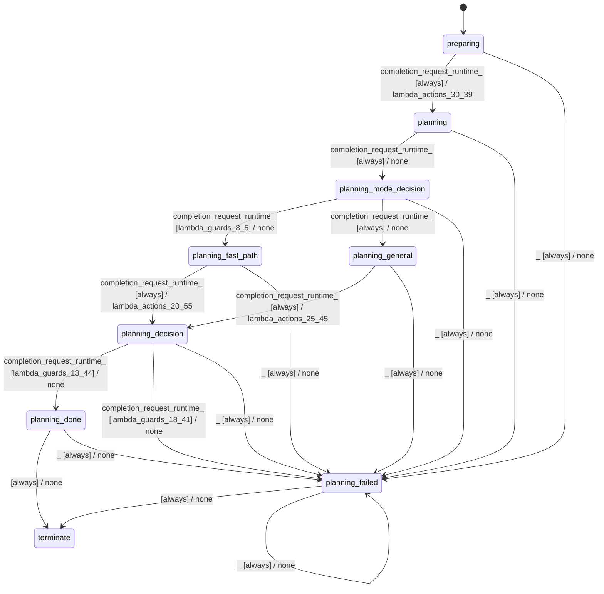

# batch_planner_modes_equal

Source: [`emel/batch/planner/modes/equal/sm.hpp`](https://github.com/stateforward/emel.cpp/blob/main/src/emel/batch/planner/modes/equal/sm.hpp)

## Mermaid

## Transitions

| Source | Event | Guard | Action | Target |
| --- | --- | --- | --- | --- |
| [`preparing`](https://github.com/stateforward/emel.cpp/blob/main/src/emel/batch/planner/modes/equal/sm.hpp) | [`completion<request_runtime>`](https://github.com/stateforward/emel.cpp/blob/main/src/emel/batch/planner/modes/equal/sm.hpp) | [`always`](https://github.com/stateforward/emel.cpp/blob/main/src/emel/batch/planner/modes/equal/sm.hpp) | [`lambda_actions_30_39`](https://github.com/stateforward/emel.cpp/blob/main/src/emel/batch/planner/modes/equal/sm.hpp) | [`planning`](https://github.com/stateforward/emel.cpp/blob/main/src/emel/batch/planner/modes/equal/sm.hpp) |
| [`planning`](https://github.com/stateforward/emel.cpp/blob/main/src/emel/batch/planner/modes/equal/sm.hpp) | [`completion<request_runtime>`](https://github.com/stateforward/emel.cpp/blob/main/src/emel/batch/planner/modes/equal/sm.hpp) | [`always`](https://github.com/stateforward/emel.cpp/blob/main/src/emel/batch/planner/modes/equal/sm.hpp) | [`none`](https://github.com/stateforward/emel.cpp/blob/main/src/emel/batch/planner/modes/equal/sm.hpp) | [`planning_mode_decision`](https://github.com/stateforward/emel.cpp/blob/main/src/emel/batch/planner/modes/equal/sm.hpp) |
| [`planning_mode_decision`](https://github.com/stateforward/emel.cpp/blob/main/src/emel/batch/planner/modes/equal/sm.hpp) | [`completion<request_runtime>`](https://github.com/stateforward/emel.cpp/blob/main/src/emel/batch/planner/modes/equal/sm.hpp) | [`lambda_guards_8_5`](https://github.com/stateforward/emel.cpp/blob/main/src/emel/batch/planner/modes/equal/sm.hpp) | [`none`](https://github.com/stateforward/emel.cpp/blob/main/src/emel/batch/planner/modes/equal/sm.hpp) | [`planning_fast_path`](https://github.com/stateforward/emel.cpp/blob/main/src/emel/batch/planner/modes/equal/sm.hpp) |
| [`planning_mode_decision`](https://github.com/stateforward/emel.cpp/blob/main/src/emel/batch/planner/modes/equal/sm.hpp) | [`completion<request_runtime>`](https://github.com/stateforward/emel.cpp/blob/main/src/emel/batch/planner/modes/equal/sm.hpp) | [`always`](https://github.com/stateforward/emel.cpp/blob/main/src/emel/batch/planner/modes/equal/sm.hpp) | [`none`](https://github.com/stateforward/emel.cpp/blob/main/src/emel/batch/planner/modes/equal/sm.hpp) | [`planning_general`](https://github.com/stateforward/emel.cpp/blob/main/src/emel/batch/planner/modes/equal/sm.hpp) |
| [`planning_fast_path`](https://github.com/stateforward/emel.cpp/blob/main/src/emel/batch/planner/modes/equal/sm.hpp) | [`completion<request_runtime>`](https://github.com/stateforward/emel.cpp/blob/main/src/emel/batch/planner/modes/equal/sm.hpp) | [`always`](https://github.com/stateforward/emel.cpp/blob/main/src/emel/batch/planner/modes/equal/sm.hpp) | [`lambda_actions_20_55`](https://github.com/stateforward/emel.cpp/blob/main/src/emel/batch/planner/modes/equal/sm.hpp) | [`planning_decision`](https://github.com/stateforward/emel.cpp/blob/main/src/emel/batch/planner/modes/equal/sm.hpp) |
| [`planning_general`](https://github.com/stateforward/emel.cpp/blob/main/src/emel/batch/planner/modes/equal/sm.hpp) | [`completion<request_runtime>`](https://github.com/stateforward/emel.cpp/blob/main/src/emel/batch/planner/modes/equal/sm.hpp) | [`always`](https://github.com/stateforward/emel.cpp/blob/main/src/emel/batch/planner/modes/equal/sm.hpp) | [`lambda_actions_25_45`](https://github.com/stateforward/emel.cpp/blob/main/src/emel/batch/planner/modes/equal/sm.hpp) | [`planning_decision`](https://github.com/stateforward/emel.cpp/blob/main/src/emel/batch/planner/modes/equal/sm.hpp) |
| [`planning_decision`](https://github.com/stateforward/emel.cpp/blob/main/src/emel/batch/planner/modes/equal/sm.hpp) | [`completion<request_runtime>`](https://github.com/stateforward/emel.cpp/blob/main/src/emel/batch/planner/modes/equal/sm.hpp) | [`lambda_guards_13_44`](https://github.com/stateforward/emel.cpp/blob/main/src/emel/batch/planner/modes/equal/sm.hpp) | [`none`](https://github.com/stateforward/emel.cpp/blob/main/src/emel/batch/planner/modes/equal/sm.hpp) | [`planning_done`](https://github.com/stateforward/emel.cpp/blob/main/src/emel/batch/planner/modes/equal/sm.hpp) |
| [`planning_decision`](https://github.com/stateforward/emel.cpp/blob/main/src/emel/batch/planner/modes/equal/sm.hpp) | [`completion<request_runtime>`](https://github.com/stateforward/emel.cpp/blob/main/src/emel/batch/planner/modes/equal/sm.hpp) | [`lambda_guards_18_41`](https://github.com/stateforward/emel.cpp/blob/main/src/emel/batch/planner/modes/equal/sm.hpp) | [`none`](https://github.com/stateforward/emel.cpp/blob/main/src/emel/batch/planner/modes/equal/sm.hpp) | [`planning_failed`](https://github.com/stateforward/emel.cpp/blob/main/src/emel/batch/planner/modes/equal/sm.hpp) |
| [`planning_done`](https://github.com/stateforward/emel.cpp/blob/main/src/emel/batch/planner/modes/equal/sm.hpp) | - | [`always`](https://github.com/stateforward/emel.cpp/blob/main/src/emel/batch/planner/modes/equal/sm.hpp) | [`none`](https://github.com/stateforward/emel.cpp/blob/main/src/emel/batch/planner/modes/equal/sm.hpp) | [`terminate`](https://github.com/stateforward/emel.cpp/blob/main/src/emel/batch/planner/modes/equal/sm.hpp) |
| [`planning_failed`](https://github.com/stateforward/emel.cpp/blob/main/src/emel/batch/planner/modes/equal/sm.hpp) | - | [`always`](https://github.com/stateforward/emel.cpp/blob/main/src/emel/batch/planner/modes/equal/sm.hpp) | [`none`](https://github.com/stateforward/emel.cpp/blob/main/src/emel/batch/planner/modes/equal/sm.hpp) | [`terminate`](https://github.com/stateforward/emel.cpp/blob/main/src/emel/batch/planner/modes/equal/sm.hpp) |
| [`preparing`](https://github.com/stateforward/emel.cpp/blob/main/src/emel/batch/planner/modes/equal/sm.hpp) | [`_`](https://github.com/stateforward/emel.cpp/blob/main/src/emel/batch/planner/modes/equal/sm.hpp) | [`always`](https://github.com/stateforward/emel.cpp/blob/main/src/emel/batch/planner/modes/equal/sm.hpp) | [`none`](https://github.com/stateforward/emel.cpp/blob/main/src/emel/batch/planner/modes/equal/sm.hpp) | [`planning_failed`](https://github.com/stateforward/emel.cpp/blob/main/src/emel/batch/planner/modes/equal/sm.hpp) |
| [`planning`](https://github.com/stateforward/emel.cpp/blob/main/src/emel/batch/planner/modes/equal/sm.hpp) | [`_`](https://github.com/stateforward/emel.cpp/blob/main/src/emel/batch/planner/modes/equal/sm.hpp) | [`always`](https://github.com/stateforward/emel.cpp/blob/main/src/emel/batch/planner/modes/equal/sm.hpp) | [`none`](https://github.com/stateforward/emel.cpp/blob/main/src/emel/batch/planner/modes/equal/sm.hpp) | [`planning_failed`](https://github.com/stateforward/emel.cpp/blob/main/src/emel/batch/planner/modes/equal/sm.hpp) |
| [`planning_mode_decision`](https://github.com/stateforward/emel.cpp/blob/main/src/emel/batch/planner/modes/equal/sm.hpp) | [`_`](https://github.com/stateforward/emel.cpp/blob/main/src/emel/batch/planner/modes/equal/sm.hpp) | [`always`](https://github.com/stateforward/emel.cpp/blob/main/src/emel/batch/planner/modes/equal/sm.hpp) | [`none`](https://github.com/stateforward/emel.cpp/blob/main/src/emel/batch/planner/modes/equal/sm.hpp) | [`planning_failed`](https://github.com/stateforward/emel.cpp/blob/main/src/emel/batch/planner/modes/equal/sm.hpp) |
| [`planning_fast_path`](https://github.com/stateforward/emel.cpp/blob/main/src/emel/batch/planner/modes/equal/sm.hpp) | [`_`](https://github.com/stateforward/emel.cpp/blob/main/src/emel/batch/planner/modes/equal/sm.hpp) | [`always`](https://github.com/stateforward/emel.cpp/blob/main/src/emel/batch/planner/modes/equal/sm.hpp) | [`none`](https://github.com/stateforward/emel.cpp/blob/main/src/emel/batch/planner/modes/equal/sm.hpp) | [`planning_failed`](https://github.com/stateforward/emel.cpp/blob/main/src/emel/batch/planner/modes/equal/sm.hpp) |
| [`planning_general`](https://github.com/stateforward/emel.cpp/blob/main/src/emel/batch/planner/modes/equal/sm.hpp) | [`_`](https://github.com/stateforward/emel.cpp/blob/main/src/emel/batch/planner/modes/equal/sm.hpp) | [`always`](https://github.com/stateforward/emel.cpp/blob/main/src/emel/batch/planner/modes/equal/sm.hpp) | [`none`](https://github.com/stateforward/emel.cpp/blob/main/src/emel/batch/planner/modes/equal/sm.hpp) | [`planning_failed`](https://github.com/stateforward/emel.cpp/blob/main/src/emel/batch/planner/modes/equal/sm.hpp) |
| [`planning_decision`](https://github.com/stateforward/emel.cpp/blob/main/src/emel/batch/planner/modes/equal/sm.hpp) | [`_`](https://github.com/stateforward/emel.cpp/blob/main/src/emel/batch/planner/modes/equal/sm.hpp) | [`always`](https://github.com/stateforward/emel.cpp/blob/main/src/emel/batch/planner/modes/equal/sm.hpp) | [`none`](https://github.com/stateforward/emel.cpp/blob/main/src/emel/batch/planner/modes/equal/sm.hpp) | [`planning_failed`](https://github.com/stateforward/emel.cpp/blob/main/src/emel/batch/planner/modes/equal/sm.hpp) |
| [`planning_done`](https://github.com/stateforward/emel.cpp/blob/main/src/emel/batch/planner/modes/equal/sm.hpp) | [`_`](https://github.com/stateforward/emel.cpp/blob/main/src/emel/batch/planner/modes/equal/sm.hpp) | [`always`](https://github.com/stateforward/emel.cpp/blob/main/src/emel/batch/planner/modes/equal/sm.hpp) | [`none`](https://github.com/stateforward/emel.cpp/blob/main/src/emel/batch/planner/modes/equal/sm.hpp) | [`planning_failed`](https://github.com/stateforward/emel.cpp/blob/main/src/emel/batch/planner/modes/equal/sm.hpp) |
| [`planning_failed`](https://github.com/stateforward/emel.cpp/blob/main/src/emel/batch/planner/modes/equal/sm.hpp) | [`_`](https://github.com/stateforward/emel.cpp/blob/main/src/emel/batch/planner/modes/equal/sm.hpp) | [`always`](https://github.com/stateforward/emel.cpp/blob/main/src/emel/batch/planner/modes/equal/sm.hpp) | [`none`](https://github.com/stateforward/emel.cpp/blob/main/src/emel/batch/planner/modes/equal/sm.hpp) | [`planning_failed`](https://github.com/stateforward/emel.cpp/blob/main/src/emel/batch/planner/modes/equal/sm.hpp) |
