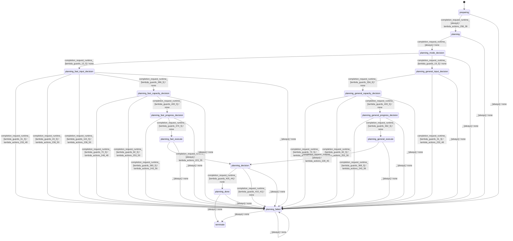

# batch_planner_modes_equal

Source: [`emel/batch/planner/modes/equal/sm.hpp`](https://github.com/stateforward/emel.cpp/blob/main/src/emel/batch/planner/modes/equal/sm.hpp)

## Mermaid

## Transitions

| Source | Event | Guard | Action | Target |
| --- | --- | --- | --- | --- |
| [`preparing`](https://github.com/stateforward/emel.cpp/blob/main/src/emel/batch/planner/modes/equal/sm.hpp) | [`completion<request_runtime>`](https://github.com/stateforward/emel.cpp/blob/main/src/emel/batch/planner/modes/equal/sm.hpp) | [`always`](https://github.com/stateforward/emel.cpp/blob/main/src/emel/batch/planner/modes/equal/sm.hpp) | [`lambda_actions_258_39`](https://github.com/stateforward/emel.cpp/blob/main/src/emel/batch/planner/modes/equal/sm.hpp) | [`planning`](https://github.com/stateforward/emel.cpp/blob/main/src/emel/batch/planner/modes/equal/sm.hpp) |
| [`planning`](https://github.com/stateforward/emel.cpp/blob/main/src/emel/batch/planner/modes/equal/sm.hpp) | [`completion<request_runtime>`](https://github.com/stateforward/emel.cpp/blob/main/src/emel/batch/planner/modes/equal/sm.hpp) | [`always`](https://github.com/stateforward/emel.cpp/blob/main/src/emel/batch/planner/modes/equal/sm.hpp) | [`none`](https://github.com/stateforward/emel.cpp/blob/main/src/emel/batch/planner/modes/equal/sm.hpp) | [`planning_mode_decision`](https://github.com/stateforward/emel.cpp/blob/main/src/emel/batch/planner/modes/equal/sm.hpp) |
| [`planning_mode_decision`](https://github.com/stateforward/emel.cpp/blob/main/src/emel/batch/planner/modes/equal/sm.hpp) | [`completion<request_runtime>`](https://github.com/stateforward/emel.cpp/blob/main/src/emel/batch/planner/modes/equal/sm.hpp) | [`lambda_guards_13_5`](https://github.com/stateforward/emel.cpp/blob/main/src/emel/batch/planner/modes/equal/sm.hpp) | [`none`](https://github.com/stateforward/emel.cpp/blob/main/src/emel/batch/planner/modes/equal/sm.hpp) | [`planning_fast_input_decision`](https://github.com/stateforward/emel.cpp/blob/main/src/emel/batch/planner/modes/equal/sm.hpp) |
| [`planning_mode_decision`](https://github.com/stateforward/emel.cpp/blob/main/src/emel/batch/planner/modes/equal/sm.hpp) | [`completion<request_runtime>`](https://github.com/stateforward/emel.cpp/blob/main/src/emel/batch/planner/modes/equal/sm.hpp) | [`lambda_guards_19_5`](https://github.com/stateforward/emel.cpp/blob/main/src/emel/batch/planner/modes/equal/sm.hpp) | [`none`](https://github.com/stateforward/emel.cpp/blob/main/src/emel/batch/planner/modes/equal/sm.hpp) | [`planning_general_input_decision`](https://github.com/stateforward/emel.cpp/blob/main/src/emel/batch/planner/modes/equal/sm.hpp) |
| [`planning_general_input_decision`](https://github.com/stateforward/emel.cpp/blob/main/src/emel/batch/planner/modes/equal/sm.hpp) | [`completion<request_runtime>`](https://github.com/stateforward/emel.cpp/blob/main/src/emel/batch/planner/modes/equal/sm.hpp) | [`lambda_guards_394_5`](https://github.com/stateforward/emel.cpp/blob/main/src/emel/batch/planner/modes/equal/sm.hpp) | [`none`](https://github.com/stateforward/emel.cpp/blob/main/src/emel/batch/planner/modes/equal/sm.hpp) | [`planning_general_capacity_decision`](https://github.com/stateforward/emel.cpp/blob/main/src/emel/batch/planner/modes/equal/sm.hpp) |
| [`planning_general_input_decision`](https://github.com/stateforward/emel.cpp/blob/main/src/emel/batch/planner/modes/equal/sm.hpp) | [`completion<request_runtime>`](https://github.com/stateforward/emel.cpp/blob/main/src/emel/batch/planner/modes/equal/sm.hpp) | [`lambda_guards_31_5`](https://github.com/stateforward/emel.cpp/blob/main/src/emel/batch/planner/modes/equal/sm.hpp) | [`lambda_actions_233_48`](https://github.com/stateforward/emel.cpp/blob/main/src/emel/batch/planner/modes/equal/sm.hpp) | [`planning_failed`](https://github.com/stateforward/emel.cpp/blob/main/src/emel/batch/planner/modes/equal/sm.hpp) |
| [`planning_general_capacity_decision`](https://github.com/stateforward/emel.cpp/blob/main/src/emel/batch/planner/modes/equal/sm.hpp) | [`completion<request_runtime>`](https://github.com/stateforward/emel.cpp/blob/main/src/emel/batch/planner/modes/equal/sm.hpp) | [`lambda_guards_70_5`](https://github.com/stateforward/emel.cpp/blob/main/src/emel/batch/planner/modes/equal/sm.hpp) | [`lambda_actions_248_48`](https://github.com/stateforward/emel.cpp/blob/main/src/emel/batch/planner/modes/equal/sm.hpp) | [`planning_failed`](https://github.com/stateforward/emel.cpp/blob/main/src/emel/batch/planner/modes/equal/sm.hpp) |
| [`planning_general_capacity_decision`](https://github.com/stateforward/emel.cpp/blob/main/src/emel/batch/planner/modes/equal/sm.hpp) | [`completion<request_runtime>`](https://github.com/stateforward/emel.cpp/blob/main/src/emel/batch/planner/modes/equal/sm.hpp) | [`lambda_guards_82_5`](https://github.com/stateforward/emel.cpp/blob/main/src/emel/batch/planner/modes/equal/sm.hpp) | [`lambda_actions_253_50`](https://github.com/stateforward/emel.cpp/blob/main/src/emel/batch/planner/modes/equal/sm.hpp) | [`planning_failed`](https://github.com/stateforward/emel.cpp/blob/main/src/emel/batch/planner/modes/equal/sm.hpp) |
| [`planning_general_capacity_decision`](https://github.com/stateforward/emel.cpp/blob/main/src/emel/batch/planner/modes/equal/sm.hpp) | [`completion<request_runtime>`](https://github.com/stateforward/emel.cpp/blob/main/src/emel/batch/planner/modes/equal/sm.hpp) | [`lambda_guards_400_5`](https://github.com/stateforward/emel.cpp/blob/main/src/emel/batch/planner/modes/equal/sm.hpp) | [`none`](https://github.com/stateforward/emel.cpp/blob/main/src/emel/batch/planner/modes/equal/sm.hpp) | [`planning_general_progress_decision`](https://github.com/stateforward/emel.cpp/blob/main/src/emel/batch/planner/modes/equal/sm.hpp) |
| [`planning_general_progress_decision`](https://github.com/stateforward/emel.cpp/blob/main/src/emel/batch/planner/modes/equal/sm.hpp) | [`completion<request_runtime>`](https://github.com/stateforward/emel.cpp/blob/main/src/emel/batch/planner/modes/equal/sm.hpp) | [`lambda_guards_368_5`](https://github.com/stateforward/emel.cpp/blob/main/src/emel/batch/planner/modes/equal/sm.hpp) | [`lambda_actions_243_56`](https://github.com/stateforward/emel.cpp/blob/main/src/emel/batch/planner/modes/equal/sm.hpp) | [`planning_failed`](https://github.com/stateforward/emel.cpp/blob/main/src/emel/batch/planner/modes/equal/sm.hpp) |
| [`planning_general_progress_decision`](https://github.com/stateforward/emel.cpp/blob/main/src/emel/batch/planner/modes/equal/sm.hpp) | [`completion<request_runtime>`](https://github.com/stateforward/emel.cpp/blob/main/src/emel/batch/planner/modes/equal/sm.hpp) | [`lambda_guards_362_5`](https://github.com/stateforward/emel.cpp/blob/main/src/emel/batch/planner/modes/equal/sm.hpp) | [`none`](https://github.com/stateforward/emel.cpp/blob/main/src/emel/batch/planner/modes/equal/sm.hpp) | [`planning_general_execute`](https://github.com/stateforward/emel.cpp/blob/main/src/emel/batch/planner/modes/equal/sm.hpp) |
| [`planning_general_execute`](https://github.com/stateforward/emel.cpp/blob/main/src/emel/batch/planner/modes/equal/sm.hpp) | [`completion<request_runtime>`](https://github.com/stateforward/emel.cpp/blob/main/src/emel/batch/planner/modes/equal/sm.hpp) | [`always`](https://github.com/stateforward/emel.cpp/blob/main/src/emel/batch/planner/modes/equal/sm.hpp) | [`lambda_actions_228_45`](https://github.com/stateforward/emel.cpp/blob/main/src/emel/batch/planner/modes/equal/sm.hpp) | [`planning_decision`](https://github.com/stateforward/emel.cpp/blob/main/src/emel/batch/planner/modes/equal/sm.hpp) |
| [`planning_fast_input_decision`](https://github.com/stateforward/emel.cpp/blob/main/src/emel/batch/planner/modes/equal/sm.hpp) | [`completion<request_runtime>`](https://github.com/stateforward/emel.cpp/blob/main/src/emel/batch/planner/modes/equal/sm.hpp) | [`lambda_guards_31_5`](https://github.com/stateforward/emel.cpp/blob/main/src/emel/batch/planner/modes/equal/sm.hpp) | [`lambda_actions_233_48`](https://github.com/stateforward/emel.cpp/blob/main/src/emel/batch/planner/modes/equal/sm.hpp) | [`planning_failed`](https://github.com/stateforward/emel.cpp/blob/main/src/emel/batch/planner/modes/equal/sm.hpp) |
| [`planning_fast_input_decision`](https://github.com/stateforward/emel.cpp/blob/main/src/emel/batch/planner/modes/equal/sm.hpp) | [`completion<request_runtime>`](https://github.com/stateforward/emel.cpp/blob/main/src/emel/batch/planner/modes/equal/sm.hpp) | [`lambda_guards_43_5`](https://github.com/stateforward/emel.cpp/blob/main/src/emel/batch/planner/modes/equal/sm.hpp) | [`lambda_actions_238_50`](https://github.com/stateforward/emel.cpp/blob/main/src/emel/batch/planner/modes/equal/sm.hpp) | [`planning_failed`](https://github.com/stateforward/emel.cpp/blob/main/src/emel/batch/planner/modes/equal/sm.hpp) |
| [`planning_fast_input_decision`](https://github.com/stateforward/emel.cpp/blob/main/src/emel/batch/planner/modes/equal/sm.hpp) | [`completion<request_runtime>`](https://github.com/stateforward/emel.cpp/blob/main/src/emel/batch/planner/modes/equal/sm.hpp) | [`lambda_guards_115_5`](https://github.com/stateforward/emel.cpp/blob/main/src/emel/batch/planner/modes/equal/sm.hpp) | [`lambda_actions_238_50`](https://github.com/stateforward/emel.cpp/blob/main/src/emel/batch/planner/modes/equal/sm.hpp) | [`planning_failed`](https://github.com/stateforward/emel.cpp/blob/main/src/emel/batch/planner/modes/equal/sm.hpp) |
| [`planning_fast_input_decision`](https://github.com/stateforward/emel.cpp/blob/main/src/emel/batch/planner/modes/equal/sm.hpp) | [`completion<request_runtime>`](https://github.com/stateforward/emel.cpp/blob/main/src/emel/batch/planner/modes/equal/sm.hpp) | [`lambda_guards_386_5`](https://github.com/stateforward/emel.cpp/blob/main/src/emel/batch/planner/modes/equal/sm.hpp) | [`none`](https://github.com/stateforward/emel.cpp/blob/main/src/emel/batch/planner/modes/equal/sm.hpp) | [`planning_fast_capacity_decision`](https://github.com/stateforward/emel.cpp/blob/main/src/emel/batch/planner/modes/equal/sm.hpp) |
| [`planning_fast_capacity_decision`](https://github.com/stateforward/emel.cpp/blob/main/src/emel/batch/planner/modes/equal/sm.hpp) | [`completion<request_runtime>`](https://github.com/stateforward/emel.cpp/blob/main/src/emel/batch/planner/modes/equal/sm.hpp) | [`lambda_guards_70_5`](https://github.com/stateforward/emel.cpp/blob/main/src/emel/batch/planner/modes/equal/sm.hpp) | [`lambda_actions_248_48`](https://github.com/stateforward/emel.cpp/blob/main/src/emel/batch/planner/modes/equal/sm.hpp) | [`planning_failed`](https://github.com/stateforward/emel.cpp/blob/main/src/emel/batch/planner/modes/equal/sm.hpp) |
| [`planning_fast_capacity_decision`](https://github.com/stateforward/emel.cpp/blob/main/src/emel/batch/planner/modes/equal/sm.hpp) | [`completion<request_runtime>`](https://github.com/stateforward/emel.cpp/blob/main/src/emel/batch/planner/modes/equal/sm.hpp) | [`lambda_guards_82_5`](https://github.com/stateforward/emel.cpp/blob/main/src/emel/batch/planner/modes/equal/sm.hpp) | [`lambda_actions_253_50`](https://github.com/stateforward/emel.cpp/blob/main/src/emel/batch/planner/modes/equal/sm.hpp) | [`planning_failed`](https://github.com/stateforward/emel.cpp/blob/main/src/emel/batch/planner/modes/equal/sm.hpp) |
| [`planning_fast_capacity_decision`](https://github.com/stateforward/emel.cpp/blob/main/src/emel/batch/planner/modes/equal/sm.hpp) | [`completion<request_runtime>`](https://github.com/stateforward/emel.cpp/blob/main/src/emel/batch/planner/modes/equal/sm.hpp) | [`lambda_guards_400_5`](https://github.com/stateforward/emel.cpp/blob/main/src/emel/batch/planner/modes/equal/sm.hpp) | [`none`](https://github.com/stateforward/emel.cpp/blob/main/src/emel/batch/planner/modes/equal/sm.hpp) | [`planning_fast_progress_decision`](https://github.com/stateforward/emel.cpp/blob/main/src/emel/batch/planner/modes/equal/sm.hpp) |
| [`planning_fast_progress_decision`](https://github.com/stateforward/emel.cpp/blob/main/src/emel/batch/planner/modes/equal/sm.hpp) | [`completion<request_runtime>`](https://github.com/stateforward/emel.cpp/blob/main/src/emel/batch/planner/modes/equal/sm.hpp) | [`lambda_guards_380_5`](https://github.com/stateforward/emel.cpp/blob/main/src/emel/batch/planner/modes/equal/sm.hpp) | [`lambda_actions_243_56`](https://github.com/stateforward/emel.cpp/blob/main/src/emel/batch/planner/modes/equal/sm.hpp) | [`planning_failed`](https://github.com/stateforward/emel.cpp/blob/main/src/emel/batch/planner/modes/equal/sm.hpp) |
| [`planning_fast_progress_decision`](https://github.com/stateforward/emel.cpp/blob/main/src/emel/batch/planner/modes/equal/sm.hpp) | [`completion<request_runtime>`](https://github.com/stateforward/emel.cpp/blob/main/src/emel/batch/planner/modes/equal/sm.hpp) | [`lambda_guards_374_5`](https://github.com/stateforward/emel.cpp/blob/main/src/emel/batch/planner/modes/equal/sm.hpp) | [`none`](https://github.com/stateforward/emel.cpp/blob/main/src/emel/batch/planner/modes/equal/sm.hpp) | [`planning_fast_execute`](https://github.com/stateforward/emel.cpp/blob/main/src/emel/batch/planner/modes/equal/sm.hpp) |
| [`planning_fast_execute`](https://github.com/stateforward/emel.cpp/blob/main/src/emel/batch/planner/modes/equal/sm.hpp) | [`completion<request_runtime>`](https://github.com/stateforward/emel.cpp/blob/main/src/emel/batch/planner/modes/equal/sm.hpp) | [`always`](https://github.com/stateforward/emel.cpp/blob/main/src/emel/batch/planner/modes/equal/sm.hpp) | [`lambda_actions_223_55`](https://github.com/stateforward/emel.cpp/blob/main/src/emel/batch/planner/modes/equal/sm.hpp) | [`planning_decision`](https://github.com/stateforward/emel.cpp/blob/main/src/emel/batch/planner/modes/equal/sm.hpp) |
| [`planning_decision`](https://github.com/stateforward/emel.cpp/blob/main/src/emel/batch/planner/modes/equal/sm.hpp) | [`completion<request_runtime>`](https://github.com/stateforward/emel.cpp/blob/main/src/emel/batch/planner/modes/equal/sm.hpp) | [`lambda_guards_405_44`](https://github.com/stateforward/emel.cpp/blob/main/src/emel/batch/planner/modes/equal/sm.hpp) | [`none`](https://github.com/stateforward/emel.cpp/blob/main/src/emel/batch/planner/modes/equal/sm.hpp) | [`planning_done`](https://github.com/stateforward/emel.cpp/blob/main/src/emel/batch/planner/modes/equal/sm.hpp) |
| [`planning_decision`](https://github.com/stateforward/emel.cpp/blob/main/src/emel/batch/planner/modes/equal/sm.hpp) | [`completion<request_runtime>`](https://github.com/stateforward/emel.cpp/blob/main/src/emel/batch/planner/modes/equal/sm.hpp) | [`lambda_guards_410_41`](https://github.com/stateforward/emel.cpp/blob/main/src/emel/batch/planner/modes/equal/sm.hpp) | [`none`](https://github.com/stateforward/emel.cpp/blob/main/src/emel/batch/planner/modes/equal/sm.hpp) | [`planning_failed`](https://github.com/stateforward/emel.cpp/blob/main/src/emel/batch/planner/modes/equal/sm.hpp) |
| [`planning_done`](https://github.com/stateforward/emel.cpp/blob/main/src/emel/batch/planner/modes/equal/sm.hpp) | - | [`always`](https://github.com/stateforward/emel.cpp/blob/main/src/emel/batch/planner/modes/equal/sm.hpp) | [`none`](https://github.com/stateforward/emel.cpp/blob/main/src/emel/batch/planner/modes/equal/sm.hpp) | [`terminate`](https://github.com/stateforward/emel.cpp/blob/main/src/emel/batch/planner/modes/equal/sm.hpp) |
| [`planning_failed`](https://github.com/stateforward/emel.cpp/blob/main/src/emel/batch/planner/modes/equal/sm.hpp) | - | [`always`](https://github.com/stateforward/emel.cpp/blob/main/src/emel/batch/planner/modes/equal/sm.hpp) | [`none`](https://github.com/stateforward/emel.cpp/blob/main/src/emel/batch/planner/modes/equal/sm.hpp) | [`terminate`](https://github.com/stateforward/emel.cpp/blob/main/src/emel/batch/planner/modes/equal/sm.hpp) |
| [`preparing`](https://github.com/stateforward/emel.cpp/blob/main/src/emel/batch/planner/modes/equal/sm.hpp) | [`_`](https://github.com/stateforward/emel.cpp/blob/main/src/emel/batch/planner/modes/equal/sm.hpp) | [`always`](https://github.com/stateforward/emel.cpp/blob/main/src/emel/batch/planner/modes/equal/sm.hpp) | [`none`](https://github.com/stateforward/emel.cpp/blob/main/src/emel/batch/planner/modes/equal/sm.hpp) | [`planning_failed`](https://github.com/stateforward/emel.cpp/blob/main/src/emel/batch/planner/modes/equal/sm.hpp) |
| [`planning`](https://github.com/stateforward/emel.cpp/blob/main/src/emel/batch/planner/modes/equal/sm.hpp) | [`_`](https://github.com/stateforward/emel.cpp/blob/main/src/emel/batch/planner/modes/equal/sm.hpp) | [`always`](https://github.com/stateforward/emel.cpp/blob/main/src/emel/batch/planner/modes/equal/sm.hpp) | [`none`](https://github.com/stateforward/emel.cpp/blob/main/src/emel/batch/planner/modes/equal/sm.hpp) | [`planning_failed`](https://github.com/stateforward/emel.cpp/blob/main/src/emel/batch/planner/modes/equal/sm.hpp) |
| [`planning_mode_decision`](https://github.com/stateforward/emel.cpp/blob/main/src/emel/batch/planner/modes/equal/sm.hpp) | [`_`](https://github.com/stateforward/emel.cpp/blob/main/src/emel/batch/planner/modes/equal/sm.hpp) | [`always`](https://github.com/stateforward/emel.cpp/blob/main/src/emel/batch/planner/modes/equal/sm.hpp) | [`none`](https://github.com/stateforward/emel.cpp/blob/main/src/emel/batch/planner/modes/equal/sm.hpp) | [`planning_failed`](https://github.com/stateforward/emel.cpp/blob/main/src/emel/batch/planner/modes/equal/sm.hpp) |
| [`planning_fast_input_decision`](https://github.com/stateforward/emel.cpp/blob/main/src/emel/batch/planner/modes/equal/sm.hpp) | [`_`](https://github.com/stateforward/emel.cpp/blob/main/src/emel/batch/planner/modes/equal/sm.hpp) | [`always`](https://github.com/stateforward/emel.cpp/blob/main/src/emel/batch/planner/modes/equal/sm.hpp) | [`none`](https://github.com/stateforward/emel.cpp/blob/main/src/emel/batch/planner/modes/equal/sm.hpp) | [`planning_failed`](https://github.com/stateforward/emel.cpp/blob/main/src/emel/batch/planner/modes/equal/sm.hpp) |
| [`planning_fast_capacity_decision`](https://github.com/stateforward/emel.cpp/blob/main/src/emel/batch/planner/modes/equal/sm.hpp) | [`_`](https://github.com/stateforward/emel.cpp/blob/main/src/emel/batch/planner/modes/equal/sm.hpp) | [`always`](https://github.com/stateforward/emel.cpp/blob/main/src/emel/batch/planner/modes/equal/sm.hpp) | [`none`](https://github.com/stateforward/emel.cpp/blob/main/src/emel/batch/planner/modes/equal/sm.hpp) | [`planning_failed`](https://github.com/stateforward/emel.cpp/blob/main/src/emel/batch/planner/modes/equal/sm.hpp) |
| [`planning_fast_progress_decision`](https://github.com/stateforward/emel.cpp/blob/main/src/emel/batch/planner/modes/equal/sm.hpp) | [`_`](https://github.com/stateforward/emel.cpp/blob/main/src/emel/batch/planner/modes/equal/sm.hpp) | [`always`](https://github.com/stateforward/emel.cpp/blob/main/src/emel/batch/planner/modes/equal/sm.hpp) | [`none`](https://github.com/stateforward/emel.cpp/blob/main/src/emel/batch/planner/modes/equal/sm.hpp) | [`planning_failed`](https://github.com/stateforward/emel.cpp/blob/main/src/emel/batch/planner/modes/equal/sm.hpp) |
| [`planning_fast_execute`](https://github.com/stateforward/emel.cpp/blob/main/src/emel/batch/planner/modes/equal/sm.hpp) | [`_`](https://github.com/stateforward/emel.cpp/blob/main/src/emel/batch/planner/modes/equal/sm.hpp) | [`always`](https://github.com/stateforward/emel.cpp/blob/main/src/emel/batch/planner/modes/equal/sm.hpp) | [`none`](https://github.com/stateforward/emel.cpp/blob/main/src/emel/batch/planner/modes/equal/sm.hpp) | [`planning_failed`](https://github.com/stateforward/emel.cpp/blob/main/src/emel/batch/planner/modes/equal/sm.hpp) |
| [`planning_general_input_decision`](https://github.com/stateforward/emel.cpp/blob/main/src/emel/batch/planner/modes/equal/sm.hpp) | [`_`](https://github.com/stateforward/emel.cpp/blob/main/src/emel/batch/planner/modes/equal/sm.hpp) | [`always`](https://github.com/stateforward/emel.cpp/blob/main/src/emel/batch/planner/modes/equal/sm.hpp) | [`none`](https://github.com/stateforward/emel.cpp/blob/main/src/emel/batch/planner/modes/equal/sm.hpp) | [`planning_failed`](https://github.com/stateforward/emel.cpp/blob/main/src/emel/batch/planner/modes/equal/sm.hpp) |
| [`planning_general_capacity_decision`](https://github.com/stateforward/emel.cpp/blob/main/src/emel/batch/planner/modes/equal/sm.hpp) | [`_`](https://github.com/stateforward/emel.cpp/blob/main/src/emel/batch/planner/modes/equal/sm.hpp) | [`always`](https://github.com/stateforward/emel.cpp/blob/main/src/emel/batch/planner/modes/equal/sm.hpp) | [`none`](https://github.com/stateforward/emel.cpp/blob/main/src/emel/batch/planner/modes/equal/sm.hpp) | [`planning_failed`](https://github.com/stateforward/emel.cpp/blob/main/src/emel/batch/planner/modes/equal/sm.hpp) |
| [`planning_general_progress_decision`](https://github.com/stateforward/emel.cpp/blob/main/src/emel/batch/planner/modes/equal/sm.hpp) | [`_`](https://github.com/stateforward/emel.cpp/blob/main/src/emel/batch/planner/modes/equal/sm.hpp) | [`always`](https://github.com/stateforward/emel.cpp/blob/main/src/emel/batch/planner/modes/equal/sm.hpp) | [`none`](https://github.com/stateforward/emel.cpp/blob/main/src/emel/batch/planner/modes/equal/sm.hpp) | [`planning_failed`](https://github.com/stateforward/emel.cpp/blob/main/src/emel/batch/planner/modes/equal/sm.hpp) |
| [`planning_general_execute`](https://github.com/stateforward/emel.cpp/blob/main/src/emel/batch/planner/modes/equal/sm.hpp) | [`_`](https://github.com/stateforward/emel.cpp/blob/main/src/emel/batch/planner/modes/equal/sm.hpp) | [`always`](https://github.com/stateforward/emel.cpp/blob/main/src/emel/batch/planner/modes/equal/sm.hpp) | [`none`](https://github.com/stateforward/emel.cpp/blob/main/src/emel/batch/planner/modes/equal/sm.hpp) | [`planning_failed`](https://github.com/stateforward/emel.cpp/blob/main/src/emel/batch/planner/modes/equal/sm.hpp) |
| [`planning_decision`](https://github.com/stateforward/emel.cpp/blob/main/src/emel/batch/planner/modes/equal/sm.hpp) | [`_`](https://github.com/stateforward/emel.cpp/blob/main/src/emel/batch/planner/modes/equal/sm.hpp) | [`always`](https://github.com/stateforward/emel.cpp/blob/main/src/emel/batch/planner/modes/equal/sm.hpp) | [`none`](https://github.com/stateforward/emel.cpp/blob/main/src/emel/batch/planner/modes/equal/sm.hpp) | [`planning_failed`](https://github.com/stateforward/emel.cpp/blob/main/src/emel/batch/planner/modes/equal/sm.hpp) |
| [`planning_done`](https://github.com/stateforward/emel.cpp/blob/main/src/emel/batch/planner/modes/equal/sm.hpp) | [`_`](https://github.com/stateforward/emel.cpp/blob/main/src/emel/batch/planner/modes/equal/sm.hpp) | [`always`](https://github.com/stateforward/emel.cpp/blob/main/src/emel/batch/planner/modes/equal/sm.hpp) | [`none`](https://github.com/stateforward/emel.cpp/blob/main/src/emel/batch/planner/modes/equal/sm.hpp) | [`planning_failed`](https://github.com/stateforward/emel.cpp/blob/main/src/emel/batch/planner/modes/equal/sm.hpp) |
| [`planning_failed`](https://github.com/stateforward/emel.cpp/blob/main/src/emel/batch/planner/modes/equal/sm.hpp) | [`_`](https://github.com/stateforward/emel.cpp/blob/main/src/emel/batch/planner/modes/equal/sm.hpp) | [`always`](https://github.com/stateforward/emel.cpp/blob/main/src/emel/batch/planner/modes/equal/sm.hpp) | [`none`](https://github.com/stateforward/emel.cpp/blob/main/src/emel/batch/planner/modes/equal/sm.hpp) | [`planning_failed`](https://github.com/stateforward/emel.cpp/blob/main/src/emel/batch/planner/modes/equal/sm.hpp) |
