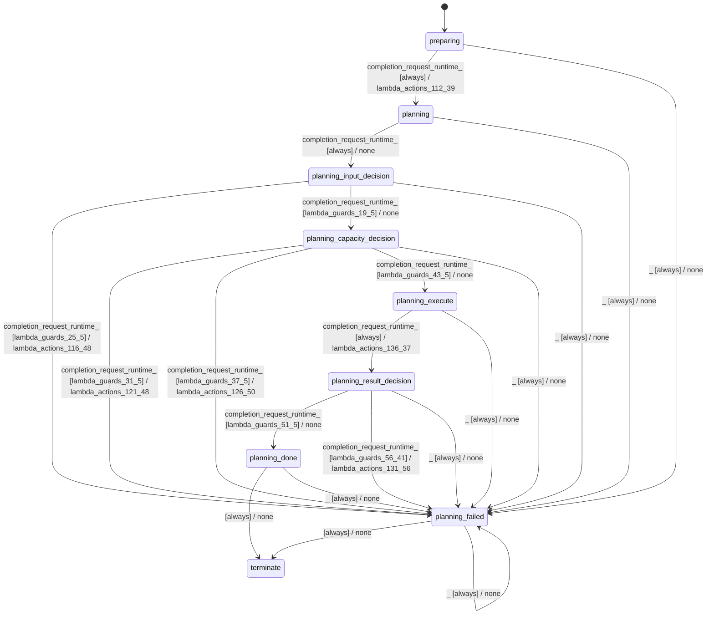

# batch_planner_modes_sequential

Source: [`emel/batch/planner/modes/sequential/sm.hpp`](https://github.com/stateforward/emel.cpp/blob/main/src/emel/batch/planner/modes/sequential/sm.hpp)

## Mermaid

## Transitions

| Source | Event | Guard | Action | Target |
| --- | --- | --- | --- | --- |
| [`preparing`](https://github.com/stateforward/emel.cpp/blob/main/src/emel/batch/planner/modes/sequential/sm.hpp) | [`completion<request_runtime>`](https://github.com/stateforward/emel.cpp/blob/main/src/emel/batch/planner/modes/sequential/sm.hpp) | [`always`](https://github.com/stateforward/emel.cpp/blob/main/src/emel/batch/planner/modes/sequential/sm.hpp) | [`lambda_actions_112_39`](https://github.com/stateforward/emel.cpp/blob/main/src/emel/batch/planner/modes/sequential/sm.hpp) | [`planning`](https://github.com/stateforward/emel.cpp/blob/main/src/emel/batch/planner/modes/sequential/sm.hpp) |
| [`planning`](https://github.com/stateforward/emel.cpp/blob/main/src/emel/batch/planner/modes/sequential/sm.hpp) | [`completion<request_runtime>`](https://github.com/stateforward/emel.cpp/blob/main/src/emel/batch/planner/modes/sequential/sm.hpp) | [`always`](https://github.com/stateforward/emel.cpp/blob/main/src/emel/batch/planner/modes/sequential/sm.hpp) | [`none`](https://github.com/stateforward/emel.cpp/blob/main/src/emel/batch/planner/modes/sequential/sm.hpp) | [`planning_input_decision`](https://github.com/stateforward/emel.cpp/blob/main/src/emel/batch/planner/modes/sequential/sm.hpp) |
| [`planning_input_decision`](https://github.com/stateforward/emel.cpp/blob/main/src/emel/batch/planner/modes/sequential/sm.hpp) | [`completion<request_runtime>`](https://github.com/stateforward/emel.cpp/blob/main/src/emel/batch/planner/modes/sequential/sm.hpp) | [`lambda_guards_25_5`](https://github.com/stateforward/emel.cpp/blob/main/src/emel/batch/planner/modes/sequential/sm.hpp) | [`lambda_actions_116_48`](https://github.com/stateforward/emel.cpp/blob/main/src/emel/batch/planner/modes/sequential/sm.hpp) | [`planning_failed`](https://github.com/stateforward/emel.cpp/blob/main/src/emel/batch/planner/modes/sequential/sm.hpp) |
| [`planning_input_decision`](https://github.com/stateforward/emel.cpp/blob/main/src/emel/batch/planner/modes/sequential/sm.hpp) | [`completion<request_runtime>`](https://github.com/stateforward/emel.cpp/blob/main/src/emel/batch/planner/modes/sequential/sm.hpp) | [`lambda_guards_19_5`](https://github.com/stateforward/emel.cpp/blob/main/src/emel/batch/planner/modes/sequential/sm.hpp) | [`none`](https://github.com/stateforward/emel.cpp/blob/main/src/emel/batch/planner/modes/sequential/sm.hpp) | [`planning_capacity_decision`](https://github.com/stateforward/emel.cpp/blob/main/src/emel/batch/planner/modes/sequential/sm.hpp) |
| [`planning_capacity_decision`](https://github.com/stateforward/emel.cpp/blob/main/src/emel/batch/planner/modes/sequential/sm.hpp) | [`completion<request_runtime>`](https://github.com/stateforward/emel.cpp/blob/main/src/emel/batch/planner/modes/sequential/sm.hpp) | [`lambda_guards_31_5`](https://github.com/stateforward/emel.cpp/blob/main/src/emel/batch/planner/modes/sequential/sm.hpp) | [`lambda_actions_121_48`](https://github.com/stateforward/emel.cpp/blob/main/src/emel/batch/planner/modes/sequential/sm.hpp) | [`planning_failed`](https://github.com/stateforward/emel.cpp/blob/main/src/emel/batch/planner/modes/sequential/sm.hpp) |
| [`planning_capacity_decision`](https://github.com/stateforward/emel.cpp/blob/main/src/emel/batch/planner/modes/sequential/sm.hpp) | [`completion<request_runtime>`](https://github.com/stateforward/emel.cpp/blob/main/src/emel/batch/planner/modes/sequential/sm.hpp) | [`lambda_guards_37_5`](https://github.com/stateforward/emel.cpp/blob/main/src/emel/batch/planner/modes/sequential/sm.hpp) | [`lambda_actions_126_50`](https://github.com/stateforward/emel.cpp/blob/main/src/emel/batch/planner/modes/sequential/sm.hpp) | [`planning_failed`](https://github.com/stateforward/emel.cpp/blob/main/src/emel/batch/planner/modes/sequential/sm.hpp) |
| [`planning_capacity_decision`](https://github.com/stateforward/emel.cpp/blob/main/src/emel/batch/planner/modes/sequential/sm.hpp) | [`completion<request_runtime>`](https://github.com/stateforward/emel.cpp/blob/main/src/emel/batch/planner/modes/sequential/sm.hpp) | [`lambda_guards_43_5`](https://github.com/stateforward/emel.cpp/blob/main/src/emel/batch/planner/modes/sequential/sm.hpp) | [`none`](https://github.com/stateforward/emel.cpp/blob/main/src/emel/batch/planner/modes/sequential/sm.hpp) | [`planning_execute`](https://github.com/stateforward/emel.cpp/blob/main/src/emel/batch/planner/modes/sequential/sm.hpp) |
| [`planning_execute`](https://github.com/stateforward/emel.cpp/blob/main/src/emel/batch/planner/modes/sequential/sm.hpp) | [`completion<request_runtime>`](https://github.com/stateforward/emel.cpp/blob/main/src/emel/batch/planner/modes/sequential/sm.hpp) | [`always`](https://github.com/stateforward/emel.cpp/blob/main/src/emel/batch/planner/modes/sequential/sm.hpp) | [`lambda_actions_136_37`](https://github.com/stateforward/emel.cpp/blob/main/src/emel/batch/planner/modes/sequential/sm.hpp) | [`planning_result_decision`](https://github.com/stateforward/emel.cpp/blob/main/src/emel/batch/planner/modes/sequential/sm.hpp) |
| [`planning_result_decision`](https://github.com/stateforward/emel.cpp/blob/main/src/emel/batch/planner/modes/sequential/sm.hpp) | [`completion<request_runtime>`](https://github.com/stateforward/emel.cpp/blob/main/src/emel/batch/planner/modes/sequential/sm.hpp) | [`lambda_guards_51_5`](https://github.com/stateforward/emel.cpp/blob/main/src/emel/batch/planner/modes/sequential/sm.hpp) | [`none`](https://github.com/stateforward/emel.cpp/blob/main/src/emel/batch/planner/modes/sequential/sm.hpp) | [`planning_done`](https://github.com/stateforward/emel.cpp/blob/main/src/emel/batch/planner/modes/sequential/sm.hpp) |
| [`planning_result_decision`](https://github.com/stateforward/emel.cpp/blob/main/src/emel/batch/planner/modes/sequential/sm.hpp) | [`completion<request_runtime>`](https://github.com/stateforward/emel.cpp/blob/main/src/emel/batch/planner/modes/sequential/sm.hpp) | [`lambda_guards_56_41`](https://github.com/stateforward/emel.cpp/blob/main/src/emel/batch/planner/modes/sequential/sm.hpp) | [`lambda_actions_131_56`](https://github.com/stateforward/emel.cpp/blob/main/src/emel/batch/planner/modes/sequential/sm.hpp) | [`planning_failed`](https://github.com/stateforward/emel.cpp/blob/main/src/emel/batch/planner/modes/sequential/sm.hpp) |
| [`planning_done`](https://github.com/stateforward/emel.cpp/blob/main/src/emel/batch/planner/modes/sequential/sm.hpp) | - | [`always`](https://github.com/stateforward/emel.cpp/blob/main/src/emel/batch/planner/modes/sequential/sm.hpp) | [`none`](https://github.com/stateforward/emel.cpp/blob/main/src/emel/batch/planner/modes/sequential/sm.hpp) | [`terminate`](https://github.com/stateforward/emel.cpp/blob/main/src/emel/batch/planner/modes/sequential/sm.hpp) |
| [`planning_failed`](https://github.com/stateforward/emel.cpp/blob/main/src/emel/batch/planner/modes/sequential/sm.hpp) | - | [`always`](https://github.com/stateforward/emel.cpp/blob/main/src/emel/batch/planner/modes/sequential/sm.hpp) | [`none`](https://github.com/stateforward/emel.cpp/blob/main/src/emel/batch/planner/modes/sequential/sm.hpp) | [`terminate`](https://github.com/stateforward/emel.cpp/blob/main/src/emel/batch/planner/modes/sequential/sm.hpp) |
| [`planning_done`](https://github.com/stateforward/emel.cpp/blob/main/src/emel/batch/planner/modes/sequential/sm.hpp) | [`_`](https://github.com/stateforward/emel.cpp/blob/main/src/emel/batch/planner/modes/sequential/sm.hpp) | [`always`](https://github.com/stateforward/emel.cpp/blob/main/src/emel/batch/planner/modes/sequential/sm.hpp) | [`none`](https://github.com/stateforward/emel.cpp/blob/main/src/emel/batch/planner/modes/sequential/sm.hpp) | [`planning_failed`](https://github.com/stateforward/emel.cpp/blob/main/src/emel/batch/planner/modes/sequential/sm.hpp) |
| [`planning_failed`](https://github.com/stateforward/emel.cpp/blob/main/src/emel/batch/planner/modes/sequential/sm.hpp) | [`_`](https://github.com/stateforward/emel.cpp/blob/main/src/emel/batch/planner/modes/sequential/sm.hpp) | [`always`](https://github.com/stateforward/emel.cpp/blob/main/src/emel/batch/planner/modes/sequential/sm.hpp) | [`none`](https://github.com/stateforward/emel.cpp/blob/main/src/emel/batch/planner/modes/sequential/sm.hpp) | [`planning_failed`](https://github.com/stateforward/emel.cpp/blob/main/src/emel/batch/planner/modes/sequential/sm.hpp) |
| [`preparing`](https://github.com/stateforward/emel.cpp/blob/main/src/emel/batch/planner/modes/sequential/sm.hpp) | [`_`](https://github.com/stateforward/emel.cpp/blob/main/src/emel/batch/planner/modes/sequential/sm.hpp) | [`always`](https://github.com/stateforward/emel.cpp/blob/main/src/emel/batch/planner/modes/sequential/sm.hpp) | [`none`](https://github.com/stateforward/emel.cpp/blob/main/src/emel/batch/planner/modes/sequential/sm.hpp) | [`planning_failed`](https://github.com/stateforward/emel.cpp/blob/main/src/emel/batch/planner/modes/sequential/sm.hpp) |
| [`planning`](https://github.com/stateforward/emel.cpp/blob/main/src/emel/batch/planner/modes/sequential/sm.hpp) | [`_`](https://github.com/stateforward/emel.cpp/blob/main/src/emel/batch/planner/modes/sequential/sm.hpp) | [`always`](https://github.com/stateforward/emel.cpp/blob/main/src/emel/batch/planner/modes/sequential/sm.hpp) | [`none`](https://github.com/stateforward/emel.cpp/blob/main/src/emel/batch/planner/modes/sequential/sm.hpp) | [`planning_failed`](https://github.com/stateforward/emel.cpp/blob/main/src/emel/batch/planner/modes/sequential/sm.hpp) |
| [`planning_input_decision`](https://github.com/stateforward/emel.cpp/blob/main/src/emel/batch/planner/modes/sequential/sm.hpp) | [`_`](https://github.com/stateforward/emel.cpp/blob/main/src/emel/batch/planner/modes/sequential/sm.hpp) | [`always`](https://github.com/stateforward/emel.cpp/blob/main/src/emel/batch/planner/modes/sequential/sm.hpp) | [`none`](https://github.com/stateforward/emel.cpp/blob/main/src/emel/batch/planner/modes/sequential/sm.hpp) | [`planning_failed`](https://github.com/stateforward/emel.cpp/blob/main/src/emel/batch/planner/modes/sequential/sm.hpp) |
| [`planning_capacity_decision`](https://github.com/stateforward/emel.cpp/blob/main/src/emel/batch/planner/modes/sequential/sm.hpp) | [`_`](https://github.com/stateforward/emel.cpp/blob/main/src/emel/batch/planner/modes/sequential/sm.hpp) | [`always`](https://github.com/stateforward/emel.cpp/blob/main/src/emel/batch/planner/modes/sequential/sm.hpp) | [`none`](https://github.com/stateforward/emel.cpp/blob/main/src/emel/batch/planner/modes/sequential/sm.hpp) | [`planning_failed`](https://github.com/stateforward/emel.cpp/blob/main/src/emel/batch/planner/modes/sequential/sm.hpp) |
| [`planning_execute`](https://github.com/stateforward/emel.cpp/blob/main/src/emel/batch/planner/modes/sequential/sm.hpp) | [`_`](https://github.com/stateforward/emel.cpp/blob/main/src/emel/batch/planner/modes/sequential/sm.hpp) | [`always`](https://github.com/stateforward/emel.cpp/blob/main/src/emel/batch/planner/modes/sequential/sm.hpp) | [`none`](https://github.com/stateforward/emel.cpp/blob/main/src/emel/batch/planner/modes/sequential/sm.hpp) | [`planning_failed`](https://github.com/stateforward/emel.cpp/blob/main/src/emel/batch/planner/modes/sequential/sm.hpp) |
| [`planning_result_decision`](https://github.com/stateforward/emel.cpp/blob/main/src/emel/batch/planner/modes/sequential/sm.hpp) | [`_`](https://github.com/stateforward/emel.cpp/blob/main/src/emel/batch/planner/modes/sequential/sm.hpp) | [`always`](https://github.com/stateforward/emel.cpp/blob/main/src/emel/batch/planner/modes/sequential/sm.hpp) | [`none`](https://github.com/stateforward/emel.cpp/blob/main/src/emel/batch/planner/modes/sequential/sm.hpp) | [`planning_failed`](https://github.com/stateforward/emel.cpp/blob/main/src/emel/batch/planner/modes/sequential/sm.hpp) |
