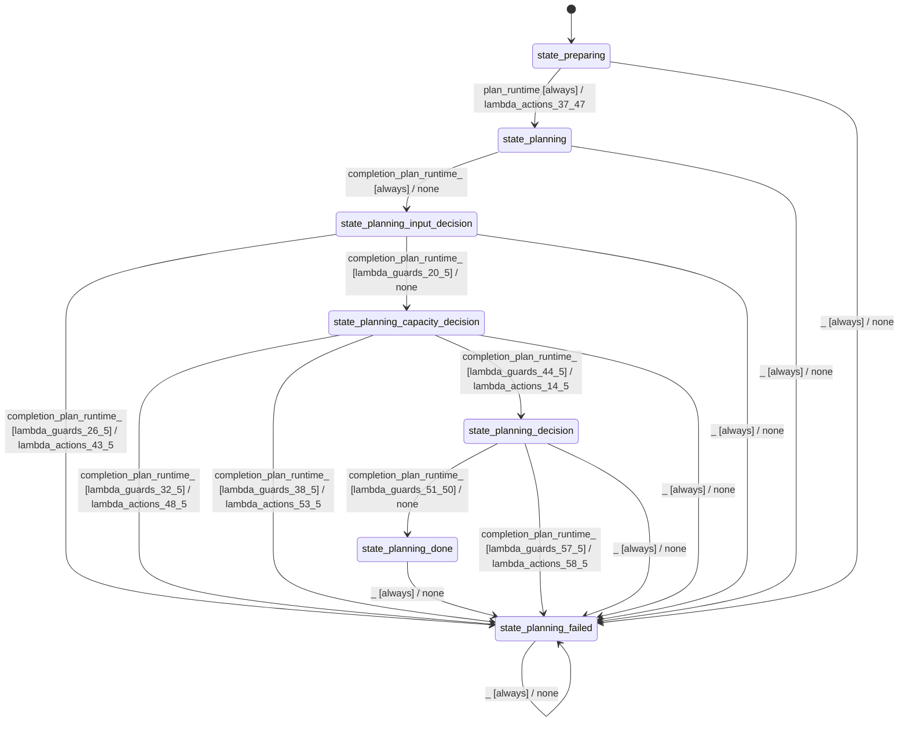

# batch_planner_modes_simple

Source: [`emel/batch/planner/modes/simple/sm.hpp`](https://github.com/stateforward/emel.cpp/blob/main/src/emel/batch/planner/modes/simple/sm.hpp)

## Mermaid

## Transitions

| Source | Event | Guard | Action | Target |
| --- | --- | --- | --- | --- |
| [`state_preparing`](https://github.com/stateforward/emel.cpp/blob/main/src/emel/batch/planner/modes/simple/sm.hpp) | [`plan_runtime`](https://github.com/stateforward/emel.cpp/blob/main/src/emel/batch/planner/modes/simple/sm.hpp) | [`always`](https://github.com/stateforward/emel.cpp/blob/main/src/emel/batch/planner/modes/simple/sm.hpp) | [`lambda_actions_37_47`](https://github.com/stateforward/emel.cpp/blob/main/src/emel/batch/planner/modes/simple/sm.hpp) | [`state_planning`](https://github.com/stateforward/emel.cpp/blob/main/src/emel/batch/planner/modes/simple/sm.hpp) |
| [`state_planning`](https://github.com/stateforward/emel.cpp/blob/main/src/emel/batch/planner/modes/simple/sm.hpp) | [`completion<plan_runtime>`](https://github.com/stateforward/emel.cpp/blob/main/src/emel/batch/planner/modes/simple/sm.hpp) | [`always`](https://github.com/stateforward/emel.cpp/blob/main/src/emel/batch/planner/modes/simple/sm.hpp) | [`none`](https://github.com/stateforward/emel.cpp/blob/main/src/emel/batch/planner/modes/simple/sm.hpp) | [`state_planning_input_decision`](https://github.com/stateforward/emel.cpp/blob/main/src/emel/batch/planner/modes/simple/sm.hpp) |
| [`state_planning_input_decision`](https://github.com/stateforward/emel.cpp/blob/main/src/emel/batch/planner/modes/simple/sm.hpp) | [`completion<plan_runtime>`](https://github.com/stateforward/emel.cpp/blob/main/src/emel/batch/planner/modes/simple/sm.hpp) | [`lambda_guards_26_5`](https://github.com/stateforward/emel.cpp/blob/main/src/emel/batch/planner/modes/simple/sm.hpp) | [`lambda_actions_43_5`](https://github.com/stateforward/emel.cpp/blob/main/src/emel/batch/planner/modes/simple/sm.hpp) | [`state_planning_failed`](https://github.com/stateforward/emel.cpp/blob/main/src/emel/batch/planner/modes/simple/sm.hpp) |
| [`state_planning_input_decision`](https://github.com/stateforward/emel.cpp/blob/main/src/emel/batch/planner/modes/simple/sm.hpp) | [`completion<plan_runtime>`](https://github.com/stateforward/emel.cpp/blob/main/src/emel/batch/planner/modes/simple/sm.hpp) | [`lambda_guards_20_5`](https://github.com/stateforward/emel.cpp/blob/main/src/emel/batch/planner/modes/simple/sm.hpp) | [`none`](https://github.com/stateforward/emel.cpp/blob/main/src/emel/batch/planner/modes/simple/sm.hpp) | [`state_planning_capacity_decision`](https://github.com/stateforward/emel.cpp/blob/main/src/emel/batch/planner/modes/simple/sm.hpp) |
| [`state_planning_capacity_decision`](https://github.com/stateforward/emel.cpp/blob/main/src/emel/batch/planner/modes/simple/sm.hpp) | [`completion<plan_runtime>`](https://github.com/stateforward/emel.cpp/blob/main/src/emel/batch/planner/modes/simple/sm.hpp) | [`lambda_guards_32_5`](https://github.com/stateforward/emel.cpp/blob/main/src/emel/batch/planner/modes/simple/sm.hpp) | [`lambda_actions_48_5`](https://github.com/stateforward/emel.cpp/blob/main/src/emel/batch/planner/modes/simple/sm.hpp) | [`state_planning_failed`](https://github.com/stateforward/emel.cpp/blob/main/src/emel/batch/planner/modes/simple/sm.hpp) |
| [`state_planning_capacity_decision`](https://github.com/stateforward/emel.cpp/blob/main/src/emel/batch/planner/modes/simple/sm.hpp) | [`completion<plan_runtime>`](https://github.com/stateforward/emel.cpp/blob/main/src/emel/batch/planner/modes/simple/sm.hpp) | [`lambda_guards_38_5`](https://github.com/stateforward/emel.cpp/blob/main/src/emel/batch/planner/modes/simple/sm.hpp) | [`lambda_actions_53_5`](https://github.com/stateforward/emel.cpp/blob/main/src/emel/batch/planner/modes/simple/sm.hpp) | [`state_planning_failed`](https://github.com/stateforward/emel.cpp/blob/main/src/emel/batch/planner/modes/simple/sm.hpp) |
| [`state_planning_capacity_decision`](https://github.com/stateforward/emel.cpp/blob/main/src/emel/batch/planner/modes/simple/sm.hpp) | [`completion<plan_runtime>`](https://github.com/stateforward/emel.cpp/blob/main/src/emel/batch/planner/modes/simple/sm.hpp) | [`lambda_guards_44_5`](https://github.com/stateforward/emel.cpp/blob/main/src/emel/batch/planner/modes/simple/sm.hpp) | [`lambda_actions_14_5`](https://github.com/stateforward/emel.cpp/blob/main/src/emel/batch/planner/modes/simple/sm.hpp) | [`state_planning_decision`](https://github.com/stateforward/emel.cpp/blob/main/src/emel/batch/planner/modes/simple/sm.hpp) |
| [`state_planning_decision`](https://github.com/stateforward/emel.cpp/blob/main/src/emel/batch/planner/modes/simple/sm.hpp) | [`completion<plan_runtime>`](https://github.com/stateforward/emel.cpp/blob/main/src/emel/batch/planner/modes/simple/sm.hpp) | [`lambda_guards_51_50`](https://github.com/stateforward/emel.cpp/blob/main/src/emel/batch/planner/modes/simple/sm.hpp) | [`none`](https://github.com/stateforward/emel.cpp/blob/main/src/emel/batch/planner/modes/simple/sm.hpp) | [`state_planning_done`](https://github.com/stateforward/emel.cpp/blob/main/src/emel/batch/planner/modes/simple/sm.hpp) |
| [`state_planning_decision`](https://github.com/stateforward/emel.cpp/blob/main/src/emel/batch/planner/modes/simple/sm.hpp) | [`completion<plan_runtime>`](https://github.com/stateforward/emel.cpp/blob/main/src/emel/batch/planner/modes/simple/sm.hpp) | [`lambda_guards_57_5`](https://github.com/stateforward/emel.cpp/blob/main/src/emel/batch/planner/modes/simple/sm.hpp) | [`lambda_actions_58_5`](https://github.com/stateforward/emel.cpp/blob/main/src/emel/batch/planner/modes/simple/sm.hpp) | [`state_planning_failed`](https://github.com/stateforward/emel.cpp/blob/main/src/emel/batch/planner/modes/simple/sm.hpp) |
| [`state_planning_done`](https://github.com/stateforward/emel.cpp/blob/main/src/emel/batch/planner/modes/simple/sm.hpp) | [`_`](https://github.com/stateforward/emel.cpp/blob/main/src/emel/batch/planner/modes/simple/sm.hpp) | [`always`](https://github.com/stateforward/emel.cpp/blob/main/src/emel/batch/planner/modes/simple/sm.hpp) | [`none`](https://github.com/stateforward/emel.cpp/blob/main/src/emel/batch/planner/modes/simple/sm.hpp) | [`state_planning_failed`](https://github.com/stateforward/emel.cpp/blob/main/src/emel/batch/planner/modes/simple/sm.hpp) |
| [`state_planning_failed`](https://github.com/stateforward/emel.cpp/blob/main/src/emel/batch/planner/modes/simple/sm.hpp) | [`_`](https://github.com/stateforward/emel.cpp/blob/main/src/emel/batch/planner/modes/simple/sm.hpp) | [`always`](https://github.com/stateforward/emel.cpp/blob/main/src/emel/batch/planner/modes/simple/sm.hpp) | [`none`](https://github.com/stateforward/emel.cpp/blob/main/src/emel/batch/planner/modes/simple/sm.hpp) | [`state_planning_failed`](https://github.com/stateforward/emel.cpp/blob/main/src/emel/batch/planner/modes/simple/sm.hpp) |
| [`state_preparing`](https://github.com/stateforward/emel.cpp/blob/main/src/emel/batch/planner/modes/simple/sm.hpp) | [`_`](https://github.com/stateforward/emel.cpp/blob/main/src/emel/batch/planner/modes/simple/sm.hpp) | [`always`](https://github.com/stateforward/emel.cpp/blob/main/src/emel/batch/planner/modes/simple/sm.hpp) | [`none`](https://github.com/stateforward/emel.cpp/blob/main/src/emel/batch/planner/modes/simple/sm.hpp) | [`state_planning_failed`](https://github.com/stateforward/emel.cpp/blob/main/src/emel/batch/planner/modes/simple/sm.hpp) |
| [`state_planning`](https://github.com/stateforward/emel.cpp/blob/main/src/emel/batch/planner/modes/simple/sm.hpp) | [`_`](https://github.com/stateforward/emel.cpp/blob/main/src/emel/batch/planner/modes/simple/sm.hpp) | [`always`](https://github.com/stateforward/emel.cpp/blob/main/src/emel/batch/planner/modes/simple/sm.hpp) | [`none`](https://github.com/stateforward/emel.cpp/blob/main/src/emel/batch/planner/modes/simple/sm.hpp) | [`state_planning_failed`](https://github.com/stateforward/emel.cpp/blob/main/src/emel/batch/planner/modes/simple/sm.hpp) |
| [`state_planning_input_decision`](https://github.com/stateforward/emel.cpp/blob/main/src/emel/batch/planner/modes/simple/sm.hpp) | [`_`](https://github.com/stateforward/emel.cpp/blob/main/src/emel/batch/planner/modes/simple/sm.hpp) | [`always`](https://github.com/stateforward/emel.cpp/blob/main/src/emel/batch/planner/modes/simple/sm.hpp) | [`none`](https://github.com/stateforward/emel.cpp/blob/main/src/emel/batch/planner/modes/simple/sm.hpp) | [`state_planning_failed`](https://github.com/stateforward/emel.cpp/blob/main/src/emel/batch/planner/modes/simple/sm.hpp) |
| [`state_planning_capacity_decision`](https://github.com/stateforward/emel.cpp/blob/main/src/emel/batch/planner/modes/simple/sm.hpp) | [`_`](https://github.com/stateforward/emel.cpp/blob/main/src/emel/batch/planner/modes/simple/sm.hpp) | [`always`](https://github.com/stateforward/emel.cpp/blob/main/src/emel/batch/planner/modes/simple/sm.hpp) | [`none`](https://github.com/stateforward/emel.cpp/blob/main/src/emel/batch/planner/modes/simple/sm.hpp) | [`state_planning_failed`](https://github.com/stateforward/emel.cpp/blob/main/src/emel/batch/planner/modes/simple/sm.hpp) |
| [`state_planning_decision`](https://github.com/stateforward/emel.cpp/blob/main/src/emel/batch/planner/modes/simple/sm.hpp) | [`_`](https://github.com/stateforward/emel.cpp/blob/main/src/emel/batch/planner/modes/simple/sm.hpp) | [`always`](https://github.com/stateforward/emel.cpp/blob/main/src/emel/batch/planner/modes/simple/sm.hpp) | [`none`](https://github.com/stateforward/emel.cpp/blob/main/src/emel/batch/planner/modes/simple/sm.hpp) | [`state_planning_failed`](https://github.com/stateforward/emel.cpp/blob/main/src/emel/batch/planner/modes/simple/sm.hpp) |
