# batch_sanitizer

Source: [`emel/batch/sanitizer/sm.hpp`](https://github.com/stateforward/emel.cpp/blob/main/src/emel/batch/sanitizer/sm.hpp)

## Mermaid

```mermaid
stateDiagram-v2
  [*] --> emel__batch__sanitizer__initialized
  emel__batch__sanitizer__initialized --> emel__batch__sanitizer__sanitizing : emel__batch__sanitizer__event__sanitize_decode [boost__sml__aux__zero_wrapper_emel__batch__sanitizer__guard__valid_request_] / boost__sml__aux__zero_wrapper_emel__batch__sanitizer__action__begin_sanitize_
  emel__batch__sanitizer__initialized --> emel__batch__sanitizer__errored : emel__batch__sanitizer__event__sanitize_decode [boost__sml__aux__zero_wrapper_emel__batch__sanitizer__guard__invalid_request_] / boost__sml__aux__zero_wrapper_emel__batch__sanitizer__action__reject_invalid_sanitize_
  emel__batch__sanitizer__sanitizing --> emel__batch__sanitizer__sanitize_decision : [boost__sml__front__always] / boost__sml__aux__zero_wrapper_emel__batch__sanitizer__action__run_sanitize_decode_
  emel__batch__sanitizer__sanitize_decision --> emel__batch__sanitizer__errored : [boost__sml__aux__zero_wrapper_emel__batch__sanitizer__guard__phase_failed_] / boost__sml__front__none
  emel__batch__sanitizer__sanitize_decision --> emel__batch__sanitizer__done : [boost__sml__aux__zero_wrapper_emel__batch__sanitizer__guard__phase_ok_] / boost__sml__aux__zero_wrapper_emel__batch__sanitizer__action__mark_done_
  emel__batch__sanitizer__done --> emel__batch__sanitizer__sanitizing : emel__batch__sanitizer__event__sanitize_decode [boost__sml__aux__zero_wrapper_emel__batch__sanitizer__guard__valid_request_] / boost__sml__aux__zero_wrapper_emel__batch__sanitizer__action__begin_sanitize_
  emel__batch__sanitizer__done --> emel__batch__sanitizer__errored : emel__batch__sanitizer__event__sanitize_decode [boost__sml__aux__zero_wrapper_emel__batch__sanitizer__guard__invalid_request_] / boost__sml__aux__zero_wrapper_emel__batch__sanitizer__action__reject_invalid_sanitize_
  emel__batch__sanitizer__errored --> emel__batch__sanitizer__sanitizing : emel__batch__sanitizer__event__sanitize_decode [boost__sml__aux__zero_wrapper_emel__batch__sanitizer__guard__valid_request_] / boost__sml__aux__zero_wrapper_emel__batch__sanitizer__action__begin_sanitize_
  emel__batch__sanitizer__errored --> emel__batch__sanitizer__errored : emel__batch__sanitizer__event__sanitize_decode [boost__sml__aux__zero_wrapper_emel__batch__sanitizer__guard__invalid_request_] / boost__sml__aux__zero_wrapper_emel__batch__sanitizer__action__reject_invalid_sanitize_
  emel__batch__sanitizer__unexpected --> emel__batch__sanitizer__sanitizing : emel__batch__sanitizer__event__sanitize_decode [boost__sml__aux__zero_wrapper_emel__batch__sanitizer__guard__valid_request_] / boost__sml__aux__zero_wrapper_emel__batch__sanitizer__action__begin_sanitize_
  emel__batch__sanitizer__unexpected --> emel__batch__sanitizer__errored : emel__batch__sanitizer__event__sanitize_decode [boost__sml__aux__zero_wrapper_emel__batch__sanitizer__guard__invalid_request_] / boost__sml__aux__zero_wrapper_emel__batch__sanitizer__action__reject_invalid_sanitize_
  emel__batch__sanitizer__initialized --> emel__batch__sanitizer__unexpected : boost__sml__back___ [boost__sml__front__always] / boost__sml__aux__zero_wrapper_emel__batch__sanitizer__action__on_unexpected_
  emel__batch__sanitizer__sanitizing --> emel__batch__sanitizer__unexpected : boost__sml__back___ [boost__sml__front__always] / boost__sml__aux__zero_wrapper_emel__batch__sanitizer__action__on_unexpected_
  emel__batch__sanitizer__sanitize_decision --> emel__batch__sanitizer__unexpected : boost__sml__back___ [boost__sml__front__always] / boost__sml__aux__zero_wrapper_emel__batch__sanitizer__action__on_unexpected_
  emel__batch__sanitizer__done --> emel__batch__sanitizer__unexpected : boost__sml__back___ [boost__sml__front__always] / boost__sml__aux__zero_wrapper_emel__batch__sanitizer__action__on_unexpected_
  emel__batch__sanitizer__errored --> emel__batch__sanitizer__unexpected : boost__sml__back___ [boost__sml__front__always] / boost__sml__aux__zero_wrapper_emel__batch__sanitizer__action__on_unexpected_
  emel__batch__sanitizer__unexpected --> emel__batch__sanitizer__unexpected : boost__sml__back___ [boost__sml__front__always] / boost__sml__aux__zero_wrapper_emel__batch__sanitizer__action__on_unexpected_
```

## Transitions

| Source | Event | Guard | Action | Target |
| --- | --- | --- | --- | --- |
| [`initialized`](https://github.com/stateforward/emel.cpp/blob/main/src/emel/batch/sanitizer/sm.hpp) | [`sanitize_decode`](https://github.com/stateforward/emel.cpp/blob/main/src/emel/batch/sanitizer/sm.hpp) | [`valid_request>`](https://github.com/stateforward/emel.cpp/blob/main/src/emel/batch/sanitizer/sm.hpp) | [`begin_sanitize>`](https://github.com/stateforward/emel.cpp/blob/main/src/emel/batch/sanitizer/sm.hpp) | [`sanitizing`](https://github.com/stateforward/emel.cpp/blob/main/src/emel/batch/sanitizer/sm.hpp) |
| [`initialized`](https://github.com/stateforward/emel.cpp/blob/main/src/emel/batch/sanitizer/sm.hpp) | [`sanitize_decode`](https://github.com/stateforward/emel.cpp/blob/main/src/emel/batch/sanitizer/sm.hpp) | [`invalid_request>`](https://github.com/stateforward/emel.cpp/blob/main/src/emel/batch/sanitizer/sm.hpp) | [`reject_invalid_sanitize>`](https://github.com/stateforward/emel.cpp/blob/main/src/emel/batch/sanitizer/sm.hpp) | [`errored`](https://github.com/stateforward/emel.cpp/blob/main/src/emel/batch/sanitizer/sm.hpp) |
| [`sanitizing`](https://github.com/stateforward/emel.cpp/blob/main/src/emel/batch/sanitizer/sm.hpp) | - | [`always`](https://github.com/stateforward/emel.cpp/blob/main/src/emel/batch/sanitizer/sm.hpp) | [`run_sanitize_decode>`](https://github.com/stateforward/emel.cpp/blob/main/src/emel/batch/sanitizer/sm.hpp) | [`sanitize_decision`](https://github.com/stateforward/emel.cpp/blob/main/src/emel/batch/sanitizer/sm.hpp) |
| [`sanitize_decision`](https://github.com/stateforward/emel.cpp/blob/main/src/emel/batch/sanitizer/sm.hpp) | - | [`phase_failed>`](https://github.com/stateforward/emel.cpp/blob/main/src/emel/batch/sanitizer/sm.hpp) | [`none`](https://github.com/stateforward/emel.cpp/blob/main/src/emel/batch/sanitizer/sm.hpp) | [`errored`](https://github.com/stateforward/emel.cpp/blob/main/src/emel/batch/sanitizer/sm.hpp) |
| [`sanitize_decision`](https://github.com/stateforward/emel.cpp/blob/main/src/emel/batch/sanitizer/sm.hpp) | - | [`phase_ok>`](https://github.com/stateforward/emel.cpp/blob/main/src/emel/batch/sanitizer/sm.hpp) | [`mark_done>`](https://github.com/stateforward/emel.cpp/blob/main/src/emel/batch/sanitizer/sm.hpp) | [`done`](https://github.com/stateforward/emel.cpp/blob/main/src/emel/batch/sanitizer/sm.hpp) |
| [`done`](https://github.com/stateforward/emel.cpp/blob/main/src/emel/batch/sanitizer/sm.hpp) | [`sanitize_decode`](https://github.com/stateforward/emel.cpp/blob/main/src/emel/batch/sanitizer/sm.hpp) | [`valid_request>`](https://github.com/stateforward/emel.cpp/blob/main/src/emel/batch/sanitizer/sm.hpp) | [`begin_sanitize>`](https://github.com/stateforward/emel.cpp/blob/main/src/emel/batch/sanitizer/sm.hpp) | [`sanitizing`](https://github.com/stateforward/emel.cpp/blob/main/src/emel/batch/sanitizer/sm.hpp) |
| [`done`](https://github.com/stateforward/emel.cpp/blob/main/src/emel/batch/sanitizer/sm.hpp) | [`sanitize_decode`](https://github.com/stateforward/emel.cpp/blob/main/src/emel/batch/sanitizer/sm.hpp) | [`invalid_request>`](https://github.com/stateforward/emel.cpp/blob/main/src/emel/batch/sanitizer/sm.hpp) | [`reject_invalid_sanitize>`](https://github.com/stateforward/emel.cpp/blob/main/src/emel/batch/sanitizer/sm.hpp) | [`errored`](https://github.com/stateforward/emel.cpp/blob/main/src/emel/batch/sanitizer/sm.hpp) |
| [`errored`](https://github.com/stateforward/emel.cpp/blob/main/src/emel/batch/sanitizer/sm.hpp) | [`sanitize_decode`](https://github.com/stateforward/emel.cpp/blob/main/src/emel/batch/sanitizer/sm.hpp) | [`valid_request>`](https://github.com/stateforward/emel.cpp/blob/main/src/emel/batch/sanitizer/sm.hpp) | [`begin_sanitize>`](https://github.com/stateforward/emel.cpp/blob/main/src/emel/batch/sanitizer/sm.hpp) | [`sanitizing`](https://github.com/stateforward/emel.cpp/blob/main/src/emel/batch/sanitizer/sm.hpp) |
| [`errored`](https://github.com/stateforward/emel.cpp/blob/main/src/emel/batch/sanitizer/sm.hpp) | [`sanitize_decode`](https://github.com/stateforward/emel.cpp/blob/main/src/emel/batch/sanitizer/sm.hpp) | [`invalid_request>`](https://github.com/stateforward/emel.cpp/blob/main/src/emel/batch/sanitizer/sm.hpp) | [`reject_invalid_sanitize>`](https://github.com/stateforward/emel.cpp/blob/main/src/emel/batch/sanitizer/sm.hpp) | [`errored`](https://github.com/stateforward/emel.cpp/blob/main/src/emel/batch/sanitizer/sm.hpp) |
| [`unexpected`](https://github.com/stateforward/emel.cpp/blob/main/src/emel/batch/sanitizer/sm.hpp) | [`sanitize_decode`](https://github.com/stateforward/emel.cpp/blob/main/src/emel/batch/sanitizer/sm.hpp) | [`valid_request>`](https://github.com/stateforward/emel.cpp/blob/main/src/emel/batch/sanitizer/sm.hpp) | [`begin_sanitize>`](https://github.com/stateforward/emel.cpp/blob/main/src/emel/batch/sanitizer/sm.hpp) | [`sanitizing`](https://github.com/stateforward/emel.cpp/blob/main/src/emel/batch/sanitizer/sm.hpp) |
| [`unexpected`](https://github.com/stateforward/emel.cpp/blob/main/src/emel/batch/sanitizer/sm.hpp) | [`sanitize_decode`](https://github.com/stateforward/emel.cpp/blob/main/src/emel/batch/sanitizer/sm.hpp) | [`invalid_request>`](https://github.com/stateforward/emel.cpp/blob/main/src/emel/batch/sanitizer/sm.hpp) | [`reject_invalid_sanitize>`](https://github.com/stateforward/emel.cpp/blob/main/src/emel/batch/sanitizer/sm.hpp) | [`errored`](https://github.com/stateforward/emel.cpp/blob/main/src/emel/batch/sanitizer/sm.hpp) |
| [`initialized`](https://github.com/stateforward/emel.cpp/blob/main/src/emel/batch/sanitizer/sm.hpp) | [`_`](https://github.com/stateforward/emel.cpp/blob/main/src/emel/batch/sanitizer/sm.hpp) | [`always`](https://github.com/stateforward/emel.cpp/blob/main/src/emel/batch/sanitizer/sm.hpp) | [`on_unexpected>`](https://github.com/stateforward/emel.cpp/blob/main/src/emel/batch/sanitizer/sm.hpp) | [`unexpected`](https://github.com/stateforward/emel.cpp/blob/main/src/emel/batch/sanitizer/sm.hpp) |
| [`sanitizing`](https://github.com/stateforward/emel.cpp/blob/main/src/emel/batch/sanitizer/sm.hpp) | [`_`](https://github.com/stateforward/emel.cpp/blob/main/src/emel/batch/sanitizer/sm.hpp) | [`always`](https://github.com/stateforward/emel.cpp/blob/main/src/emel/batch/sanitizer/sm.hpp) | [`on_unexpected>`](https://github.com/stateforward/emel.cpp/blob/main/src/emel/batch/sanitizer/sm.hpp) | [`unexpected`](https://github.com/stateforward/emel.cpp/blob/main/src/emel/batch/sanitizer/sm.hpp) |
| [`sanitize_decision`](https://github.com/stateforward/emel.cpp/blob/main/src/emel/batch/sanitizer/sm.hpp) | [`_`](https://github.com/stateforward/emel.cpp/blob/main/src/emel/batch/sanitizer/sm.hpp) | [`always`](https://github.com/stateforward/emel.cpp/blob/main/src/emel/batch/sanitizer/sm.hpp) | [`on_unexpected>`](https://github.com/stateforward/emel.cpp/blob/main/src/emel/batch/sanitizer/sm.hpp) | [`unexpected`](https://github.com/stateforward/emel.cpp/blob/main/src/emel/batch/sanitizer/sm.hpp) |
| [`done`](https://github.com/stateforward/emel.cpp/blob/main/src/emel/batch/sanitizer/sm.hpp) | [`_`](https://github.com/stateforward/emel.cpp/blob/main/src/emel/batch/sanitizer/sm.hpp) | [`always`](https://github.com/stateforward/emel.cpp/blob/main/src/emel/batch/sanitizer/sm.hpp) | [`on_unexpected>`](https://github.com/stateforward/emel.cpp/blob/main/src/emel/batch/sanitizer/sm.hpp) | [`unexpected`](https://github.com/stateforward/emel.cpp/blob/main/src/emel/batch/sanitizer/sm.hpp) |
| [`errored`](https://github.com/stateforward/emel.cpp/blob/main/src/emel/batch/sanitizer/sm.hpp) | [`_`](https://github.com/stateforward/emel.cpp/blob/main/src/emel/batch/sanitizer/sm.hpp) | [`always`](https://github.com/stateforward/emel.cpp/blob/main/src/emel/batch/sanitizer/sm.hpp) | [`on_unexpected>`](https://github.com/stateforward/emel.cpp/blob/main/src/emel/batch/sanitizer/sm.hpp) | [`unexpected`](https://github.com/stateforward/emel.cpp/blob/main/src/emel/batch/sanitizer/sm.hpp) |
| [`unexpected`](https://github.com/stateforward/emel.cpp/blob/main/src/emel/batch/sanitizer/sm.hpp) | [`_`](https://github.com/stateforward/emel.cpp/blob/main/src/emel/batch/sanitizer/sm.hpp) | [`always`](https://github.com/stateforward/emel.cpp/blob/main/src/emel/batch/sanitizer/sm.hpp) | [`on_unexpected>`](https://github.com/stateforward/emel.cpp/blob/main/src/emel/batch/sanitizer/sm.hpp) | [`unexpected`](https://github.com/stateforward/emel.cpp/blob/main/src/emel/batch/sanitizer/sm.hpp) |
