# batch_splitter

Source: [`emel/batch/splitter/sm.hpp`](https://github.com/stateforward/emel.cpp/blob/main/src/emel/batch/splitter/sm.hpp)

## Mermaid

```mermaid
stateDiagram-v2
  [*] --> emel__batch__splitter__initialized
  emel__batch__splitter__initialized --> emel__batch__splitter__validating : emel__batch__splitter__event__split [boost__sml__front__always] / boost__sml__aux__zero_wrapper_emel__batch__splitter__action___lambda_at__Users_gabrielwillen_VSCode_stateforward_emel_emel_cpp_src_emel_batch_splitter_actions_hpp_29_37__
  emel__batch__splitter__validating --> boost__sml__front__internal : on_entry [boost__sml__front__always] / boost__sml__aux__zero_wrapper__lambda_at__Users_gabrielwillen_VSCode_stateforward_emel_emel_cpp_src_emel_batch_splitter_sm_hpp_45_11__
  emel__batch__splitter__validating --> emel__batch__splitter__validating : emel__batch__splitter__event__validate [boost__sml__front__always] / boost__sml__aux__zero_wrapper_emel__batch__splitter__action___lambda_at__Users_gabrielwillen_VSCode_stateforward_emel_emel_cpp_src_emel_batch_splitter_actions_hpp_52_38__
  emel__batch__splitter__validating --> emel__batch__splitter__normalizing_batch : emel__batch__splitter__events__validate_done [boost__sml__front__always] / boost__sml__front__none
  emel__batch__splitter__validating --> emel__batch__splitter__errored : emel__batch__splitter__events__validate_error [boost__sml__front__always] / boost__sml__front__none
  emel__batch__splitter__normalizing_batch --> boost__sml__front__internal : on_entry [boost__sml__front__always] / boost__sml__aux__zero_wrapper__lambda_at__Users_gabrielwillen_VSCode_stateforward_emel_emel_cpp_src_emel_batch_splitter_sm_hpp_80_11__
  emel__batch__splitter__normalizing_batch --> emel__batch__splitter__normalizing_batch : emel__batch__splitter__event__normalize_batch [boost__sml__front__always] / boost__sml__aux__zero_wrapper_emel__batch__splitter__action___lambda_at__Users_gabrielwillen_VSCode_stateforward_emel_emel_cpp_src_emel_batch_splitter_actions_hpp_77_45__
  emel__batch__splitter__normalizing_batch --> emel__batch__splitter__splitting : emel__batch__splitter__events__normalize_done [boost__sml__front__always] / boost__sml__front__none
  emel__batch__splitter__normalizing_batch --> emel__batch__splitter__errored : emel__batch__splitter__events__normalize_error [boost__sml__front__always] / boost__sml__front__none
  emel__batch__splitter__splitting --> boost__sml__front__internal : on_entry [boost__sml__front__always] / boost__sml__aux__zero_wrapper__lambda_at__Users_gabrielwillen_VSCode_stateforward_emel_emel_cpp_src_emel_batch_splitter_sm_hpp_103_11__
  emel__batch__splitter__splitting --> emel__batch__splitter__splitting : emel__batch__splitter__event__create_ubatches [boost__sml__front__always] / boost__sml__aux__zero_wrapper_emel__batch__splitter__action___lambda_at__Users_gabrielwillen_VSCode_stateforward_emel_emel_cpp_src_emel_batch_splitter_actions_hpp_110_45__
  emel__batch__splitter__splitting --> emel__batch__splitter__publishing : emel__batch__splitter__events__split_done [boost__sml__front__always] / boost__sml__front__none
  emel__batch__splitter__splitting --> emel__batch__splitter__errored : emel__batch__splitter__events__split_error [boost__sml__front__always] / boost__sml__front__none
  emel__batch__splitter__publishing --> boost__sml__front__internal : on_entry [boost__sml__front__always] / boost__sml__aux__zero_wrapper__lambda_at__Users_gabrielwillen_VSCode_stateforward_emel_emel_cpp_src_emel_batch_splitter_sm_hpp_126_11__
  emel__batch__splitter__publishing --> emel__batch__splitter__publishing : emel__batch__splitter__event__publish [boost__sml__front__always] / boost__sml__aux__zero_wrapper_emel__batch__splitter__action___lambda_at__Users_gabrielwillen_VSCode_stateforward_emel_emel_cpp_src_emel_batch_splitter_actions_hpp_326_37__
  emel__batch__splitter__publishing --> emel__batch__splitter__done : emel__batch__splitter__events__publish_done [boost__sml__front__always] / boost__sml__front__none
  emel__batch__splitter__publishing --> emel__batch__splitter__errored : emel__batch__splitter__events__publish_error [boost__sml__front__always] / boost__sml__front__none
  emel__batch__splitter__done --> boost__sml__front__internal : on_entry [boost__sml__front__always] / boost__sml__aux__zero_wrapper__lambda_at__Users_gabrielwillen_VSCode_stateforward_emel_emel_cpp_src_emel_batch_splitter_sm_hpp_148_11__
  emel__batch__splitter__done --> emel__batch__splitter__initialized : emel__batch__splitter__events__splitting_done [boost__sml__front__always] / boost__sml__aux__zero_wrapper_emel__batch__splitter__action___lambda_at__Users_gabrielwillen_VSCode_stateforward_emel_emel_cpp_src_emel_batch_splitter_actions_hpp_332_43__
  emel__batch__splitter__done --> emel__batch__splitter__initialized : emel__batch__splitter__events__splitting_error [boost__sml__front__always] / boost__sml__aux__zero_wrapper_emel__batch__splitter__action___lambda_at__Users_gabrielwillen_VSCode_stateforward_emel_emel_cpp_src_emel_batch_splitter_actions_hpp_352_44__
  emel__batch__splitter__errored --> boost__sml__front__internal : on_entry [boost__sml__front__always] / boost__sml__aux__zero_wrapper__lambda_at__Users_gabrielwillen_VSCode_stateforward_emel_emel_cpp_src_emel_batch_splitter_sm_hpp_175_11__
  emel__batch__splitter__errored --> emel__batch__splitter__initialized : emel__batch__splitter__events__splitting_error [boost__sml__front__always] / boost__sml__aux__zero_wrapper_emel__batch__splitter__action___lambda_at__Users_gabrielwillen_VSCode_stateforward_emel_emel_cpp_src_emel_batch_splitter_actions_hpp_352_44__
```

## Transitions

| Source | Event | Guard | Action | Target |
| --- | --- | --- | --- | --- |
| [`initialized`](https://github.com/stateforward/emel.cpp/blob/main/src/emel/batch/splitter/sm.hpp) | [`split`](https://github.com/stateforward/emel.cpp/blob/main/src/emel/batch/splitter/sm.hpp) | [`always`](https://github.com/stateforward/emel.cpp/blob/main/src/emel/batch/splitter/sm.hpp) | [`(lambda at /Users/gabrielwillen/VSCode/stateforward/emel/emel.cpp/src/emel/batch/splitter/actions.hpp:29:37)>`](https://github.com/stateforward/emel.cpp/blob/main/src/emel/batch/splitter/sm.hpp) | [`validating`](https://github.com/stateforward/emel.cpp/blob/main/src/emel/batch/splitter/sm.hpp) |
| [`validating`](https://github.com/stateforward/emel.cpp/blob/main/src/emel/batch/splitter/sm.hpp) | [`on_entry`](https://github.com/stateforward/emel.cpp/blob/main/src/emel/batch/splitter/sm.hpp) | [`always`](https://github.com/stateforward/emel.cpp/blob/main/src/emel/batch/splitter/sm.hpp) | [`zero_wrapper<(lambda at /Users/gabrielwillen/VSCode/stateforward/emel/emel.cpp/src/emel/batch/splitter/sm.hpp:45:11)>`](https://github.com/stateforward/emel.cpp/blob/main/src/emel/batch/splitter/sm.hpp) | [`internal`](https://github.com/stateforward/emel.cpp/blob/main/src/emel/batch/splitter/sm.hpp) |
| [`validating`](https://github.com/stateforward/emel.cpp/blob/main/src/emel/batch/splitter/sm.hpp) | [`validate`](https://github.com/stateforward/emel.cpp/blob/main/src/emel/batch/splitter/sm.hpp) | [`always`](https://github.com/stateforward/emel.cpp/blob/main/src/emel/batch/splitter/sm.hpp) | [`(lambda at /Users/gabrielwillen/VSCode/stateforward/emel/emel.cpp/src/emel/batch/splitter/actions.hpp:52:38)>`](https://github.com/stateforward/emel.cpp/blob/main/src/emel/batch/splitter/sm.hpp) | [`validating`](https://github.com/stateforward/emel.cpp/blob/main/src/emel/batch/splitter/sm.hpp) |
| [`validating`](https://github.com/stateforward/emel.cpp/blob/main/src/emel/batch/splitter/sm.hpp) | [`validate_done`](https://github.com/stateforward/emel.cpp/blob/main/src/emel/batch/splitter/sm.hpp) | [`always`](https://github.com/stateforward/emel.cpp/blob/main/src/emel/batch/splitter/sm.hpp) | [`none`](https://github.com/stateforward/emel.cpp/blob/main/src/emel/batch/splitter/sm.hpp) | [`normalizing_batch`](https://github.com/stateforward/emel.cpp/blob/main/src/emel/batch/splitter/sm.hpp) |
| [`validating`](https://github.com/stateforward/emel.cpp/blob/main/src/emel/batch/splitter/sm.hpp) | [`validate_error`](https://github.com/stateforward/emel.cpp/blob/main/src/emel/batch/splitter/sm.hpp) | [`always`](https://github.com/stateforward/emel.cpp/blob/main/src/emel/batch/splitter/sm.hpp) | [`none`](https://github.com/stateforward/emel.cpp/blob/main/src/emel/batch/splitter/sm.hpp) | [`errored`](https://github.com/stateforward/emel.cpp/blob/main/src/emel/batch/splitter/sm.hpp) |
| [`normalizing_batch`](https://github.com/stateforward/emel.cpp/blob/main/src/emel/batch/splitter/sm.hpp) | [`on_entry`](https://github.com/stateforward/emel.cpp/blob/main/src/emel/batch/splitter/sm.hpp) | [`always`](https://github.com/stateforward/emel.cpp/blob/main/src/emel/batch/splitter/sm.hpp) | [`zero_wrapper<(lambda at /Users/gabrielwillen/VSCode/stateforward/emel/emel.cpp/src/emel/batch/splitter/sm.hpp:80:11)>`](https://github.com/stateforward/emel.cpp/blob/main/src/emel/batch/splitter/sm.hpp) | [`internal`](https://github.com/stateforward/emel.cpp/blob/main/src/emel/batch/splitter/sm.hpp) |
| [`normalizing_batch`](https://github.com/stateforward/emel.cpp/blob/main/src/emel/batch/splitter/sm.hpp) | [`normalize_batch`](https://github.com/stateforward/emel.cpp/blob/main/src/emel/batch/splitter/sm.hpp) | [`always`](https://github.com/stateforward/emel.cpp/blob/main/src/emel/batch/splitter/sm.hpp) | [`(lambda at /Users/gabrielwillen/VSCode/stateforward/emel/emel.cpp/src/emel/batch/splitter/actions.hpp:77:45)>`](https://github.com/stateforward/emel.cpp/blob/main/src/emel/batch/splitter/sm.hpp) | [`normalizing_batch`](https://github.com/stateforward/emel.cpp/blob/main/src/emel/batch/splitter/sm.hpp) |
| [`normalizing_batch`](https://github.com/stateforward/emel.cpp/blob/main/src/emel/batch/splitter/sm.hpp) | [`normalize_done`](https://github.com/stateforward/emel.cpp/blob/main/src/emel/batch/splitter/sm.hpp) | [`always`](https://github.com/stateforward/emel.cpp/blob/main/src/emel/batch/splitter/sm.hpp) | [`none`](https://github.com/stateforward/emel.cpp/blob/main/src/emel/batch/splitter/sm.hpp) | [`splitting`](https://github.com/stateforward/emel.cpp/blob/main/src/emel/batch/splitter/sm.hpp) |
| [`normalizing_batch`](https://github.com/stateforward/emel.cpp/blob/main/src/emel/batch/splitter/sm.hpp) | [`normalize_error`](https://github.com/stateforward/emel.cpp/blob/main/src/emel/batch/splitter/sm.hpp) | [`always`](https://github.com/stateforward/emel.cpp/blob/main/src/emel/batch/splitter/sm.hpp) | [`none`](https://github.com/stateforward/emel.cpp/blob/main/src/emel/batch/splitter/sm.hpp) | [`errored`](https://github.com/stateforward/emel.cpp/blob/main/src/emel/batch/splitter/sm.hpp) |
| [`splitting`](https://github.com/stateforward/emel.cpp/blob/main/src/emel/batch/splitter/sm.hpp) | [`on_entry`](https://github.com/stateforward/emel.cpp/blob/main/src/emel/batch/splitter/sm.hpp) | [`always`](https://github.com/stateforward/emel.cpp/blob/main/src/emel/batch/splitter/sm.hpp) | [`zero_wrapper<(lambda at /Users/gabrielwillen/VSCode/stateforward/emel/emel.cpp/src/emel/batch/splitter/sm.hpp:103:11)>`](https://github.com/stateforward/emel.cpp/blob/main/src/emel/batch/splitter/sm.hpp) | [`internal`](https://github.com/stateforward/emel.cpp/blob/main/src/emel/batch/splitter/sm.hpp) |
| [`splitting`](https://github.com/stateforward/emel.cpp/blob/main/src/emel/batch/splitter/sm.hpp) | [`create_ubatches`](https://github.com/stateforward/emel.cpp/blob/main/src/emel/batch/splitter/sm.hpp) | [`always`](https://github.com/stateforward/emel.cpp/blob/main/src/emel/batch/splitter/sm.hpp) | [`(lambda at /Users/gabrielwillen/VSCode/stateforward/emel/emel.cpp/src/emel/batch/splitter/actions.hpp:110:45)>`](https://github.com/stateforward/emel.cpp/blob/main/src/emel/batch/splitter/sm.hpp) | [`splitting`](https://github.com/stateforward/emel.cpp/blob/main/src/emel/batch/splitter/sm.hpp) |
| [`splitting`](https://github.com/stateforward/emel.cpp/blob/main/src/emel/batch/splitter/sm.hpp) | [`split_done`](https://github.com/stateforward/emel.cpp/blob/main/src/emel/batch/splitter/sm.hpp) | [`always`](https://github.com/stateforward/emel.cpp/blob/main/src/emel/batch/splitter/sm.hpp) | [`none`](https://github.com/stateforward/emel.cpp/blob/main/src/emel/batch/splitter/sm.hpp) | [`publishing`](https://github.com/stateforward/emel.cpp/blob/main/src/emel/batch/splitter/sm.hpp) |
| [`splitting`](https://github.com/stateforward/emel.cpp/blob/main/src/emel/batch/splitter/sm.hpp) | [`split_error`](https://github.com/stateforward/emel.cpp/blob/main/src/emel/batch/splitter/sm.hpp) | [`always`](https://github.com/stateforward/emel.cpp/blob/main/src/emel/batch/splitter/sm.hpp) | [`none`](https://github.com/stateforward/emel.cpp/blob/main/src/emel/batch/splitter/sm.hpp) | [`errored`](https://github.com/stateforward/emel.cpp/blob/main/src/emel/batch/splitter/sm.hpp) |
| [`publishing`](https://github.com/stateforward/emel.cpp/blob/main/src/emel/batch/splitter/sm.hpp) | [`on_entry`](https://github.com/stateforward/emel.cpp/blob/main/src/emel/batch/splitter/sm.hpp) | [`always`](https://github.com/stateforward/emel.cpp/blob/main/src/emel/batch/splitter/sm.hpp) | [`zero_wrapper<(lambda at /Users/gabrielwillen/VSCode/stateforward/emel/emel.cpp/src/emel/batch/splitter/sm.hpp:126:11)>`](https://github.com/stateforward/emel.cpp/blob/main/src/emel/batch/splitter/sm.hpp) | [`internal`](https://github.com/stateforward/emel.cpp/blob/main/src/emel/batch/splitter/sm.hpp) |
| [`publishing`](https://github.com/stateforward/emel.cpp/blob/main/src/emel/batch/splitter/sm.hpp) | [`publish`](https://github.com/stateforward/emel.cpp/blob/main/src/emel/batch/splitter/sm.hpp) | [`always`](https://github.com/stateforward/emel.cpp/blob/main/src/emel/batch/splitter/sm.hpp) | [`(lambda at /Users/gabrielwillen/VSCode/stateforward/emel/emel.cpp/src/emel/batch/splitter/actions.hpp:326:37)>`](https://github.com/stateforward/emel.cpp/blob/main/src/emel/batch/splitter/sm.hpp) | [`publishing`](https://github.com/stateforward/emel.cpp/blob/main/src/emel/batch/splitter/sm.hpp) |
| [`publishing`](https://github.com/stateforward/emel.cpp/blob/main/src/emel/batch/splitter/sm.hpp) | [`publish_done`](https://github.com/stateforward/emel.cpp/blob/main/src/emel/batch/splitter/sm.hpp) | [`always`](https://github.com/stateforward/emel.cpp/blob/main/src/emel/batch/splitter/sm.hpp) | [`none`](https://github.com/stateforward/emel.cpp/blob/main/src/emel/batch/splitter/sm.hpp) | [`done`](https://github.com/stateforward/emel.cpp/blob/main/src/emel/batch/splitter/sm.hpp) |
| [`publishing`](https://github.com/stateforward/emel.cpp/blob/main/src/emel/batch/splitter/sm.hpp) | [`publish_error`](https://github.com/stateforward/emel.cpp/blob/main/src/emel/batch/splitter/sm.hpp) | [`always`](https://github.com/stateforward/emel.cpp/blob/main/src/emel/batch/splitter/sm.hpp) | [`none`](https://github.com/stateforward/emel.cpp/blob/main/src/emel/batch/splitter/sm.hpp) | [`errored`](https://github.com/stateforward/emel.cpp/blob/main/src/emel/batch/splitter/sm.hpp) |
| [`done`](https://github.com/stateforward/emel.cpp/blob/main/src/emel/batch/splitter/sm.hpp) | [`on_entry`](https://github.com/stateforward/emel.cpp/blob/main/src/emel/batch/splitter/sm.hpp) | [`always`](https://github.com/stateforward/emel.cpp/blob/main/src/emel/batch/splitter/sm.hpp) | [`zero_wrapper<(lambda at /Users/gabrielwillen/VSCode/stateforward/emel/emel.cpp/src/emel/batch/splitter/sm.hpp:148:11)>`](https://github.com/stateforward/emel.cpp/blob/main/src/emel/batch/splitter/sm.hpp) | [`internal`](https://github.com/stateforward/emel.cpp/blob/main/src/emel/batch/splitter/sm.hpp) |
| [`done`](https://github.com/stateforward/emel.cpp/blob/main/src/emel/batch/splitter/sm.hpp) | [`splitting_done`](https://github.com/stateforward/emel.cpp/blob/main/src/emel/batch/splitter/sm.hpp) | [`always`](https://github.com/stateforward/emel.cpp/blob/main/src/emel/batch/splitter/sm.hpp) | [`(lambda at /Users/gabrielwillen/VSCode/stateforward/emel/emel.cpp/src/emel/batch/splitter/actions.hpp:332:43)>`](https://github.com/stateforward/emel.cpp/blob/main/src/emel/batch/splitter/sm.hpp) | [`initialized`](https://github.com/stateforward/emel.cpp/blob/main/src/emel/batch/splitter/sm.hpp) |
| [`done`](https://github.com/stateforward/emel.cpp/blob/main/src/emel/batch/splitter/sm.hpp) | [`splitting_error`](https://github.com/stateforward/emel.cpp/blob/main/src/emel/batch/splitter/sm.hpp) | [`always`](https://github.com/stateforward/emel.cpp/blob/main/src/emel/batch/splitter/sm.hpp) | [`(lambda at /Users/gabrielwillen/VSCode/stateforward/emel/emel.cpp/src/emel/batch/splitter/actions.hpp:352:44)>`](https://github.com/stateforward/emel.cpp/blob/main/src/emel/batch/splitter/sm.hpp) | [`initialized`](https://github.com/stateforward/emel.cpp/blob/main/src/emel/batch/splitter/sm.hpp) |
| [`errored`](https://github.com/stateforward/emel.cpp/blob/main/src/emel/batch/splitter/sm.hpp) | [`on_entry`](https://github.com/stateforward/emel.cpp/blob/main/src/emel/batch/splitter/sm.hpp) | [`always`](https://github.com/stateforward/emel.cpp/blob/main/src/emel/batch/splitter/sm.hpp) | [`zero_wrapper<(lambda at /Users/gabrielwillen/VSCode/stateforward/emel/emel.cpp/src/emel/batch/splitter/sm.hpp:175:11)>`](https://github.com/stateforward/emel.cpp/blob/main/src/emel/batch/splitter/sm.hpp) | [`internal`](https://github.com/stateforward/emel.cpp/blob/main/src/emel/batch/splitter/sm.hpp) |
| [`errored`](https://github.com/stateforward/emel.cpp/blob/main/src/emel/batch/splitter/sm.hpp) | [`splitting_error`](https://github.com/stateforward/emel.cpp/blob/main/src/emel/batch/splitter/sm.hpp) | [`always`](https://github.com/stateforward/emel.cpp/blob/main/src/emel/batch/splitter/sm.hpp) | [`(lambda at /Users/gabrielwillen/VSCode/stateforward/emel/emel.cpp/src/emel/batch/splitter/actions.hpp:352:44)>`](https://github.com/stateforward/emel.cpp/blob/main/src/emel/batch/splitter/sm.hpp) | [`initialized`](https://github.com/stateforward/emel.cpp/blob/main/src/emel/batch/splitter/sm.hpp) |
