# buffer_allocator

Source: [`emel/buffer/allocator/sm.hpp`](https://github.com/stateforward/emel.cpp/blob/main/emel/buffer/allocator/sm.hpp)

## Mermaid

```mermaid
stateDiagram-v2
  [*] --> uninitialized
  uninitialized --> initializing : emel__buffer__allocator__event__initialize [boost__sml__front__always] / boost__sml__aux__zero_wrapper_emel__buffer__allocator__action__begin_initialize_
  initializing --> boost__sml__front__internal : on_entry [boost__sml__front__always] / boost__sml__aux__zero_wrapper__lambda_at__Users_gabrielwillen_VSCode_stateforward_emel_emel_cpp_src_emel_buffer_allocator_sm_hpp_106_11__
  initializing --> ready : emel__buffer__allocator__events__initialize_done [boost__sml__front__always] / boost__sml__aux__zero_wrapper_emel__buffer__allocator__action__on_initialize_done_
  initializing --> failed : emel__buffer__allocator__events__initialize_error [boost__sml__front__always] / boost__sml__aux__zero_wrapper_emel__buffer__allocator__action__on_initialize_error_
  ready --> reserving_n_size : emel__buffer__allocator__event__reserve_n_size [boost__sml__front__always] / boost__sml__aux__zero_wrapper_emel__buffer__allocator__action__begin_reserve_n_size_
  allocated --> reserving_n_size : emel__buffer__allocator__event__reserve_n_size [boost__sml__front__always] / boost__sml__aux__zero_wrapper_emel__buffer__allocator__action__begin_reserve_n_size_
  reserving_n_size --> boost__sml__front__internal : on_entry [boost__sml__front__always] / boost__sml__aux__zero_wrapper__lambda_at__Users_gabrielwillen_VSCode_stateforward_emel_emel_cpp_src_emel_buffer_allocator_sm_hpp_124_11__
  reserving_n_size --> ready : emel__buffer__allocator__events__reserve_n_size_done [boost__sml__front__always] / boost__sml__aux__zero_wrapper_emel__buffer__allocator__action__on_reserve_n_size_done_
  reserving_n_size --> failed : emel__buffer__allocator__events__reserve_n_size_error [boost__sml__front__always] / boost__sml__aux__zero_wrapper_emel__buffer__allocator__action__on_reserve_n_size_error_
  ready --> reserving : emel__buffer__allocator__event__reserve_n [boost__sml__front__always] / boost__sml__aux__zero_wrapper_emel__buffer__allocator__action__begin_reserve_n_
  allocated --> reserving : emel__buffer__allocator__event__reserve_n [boost__sml__front__always] / boost__sml__aux__zero_wrapper_emel__buffer__allocator__action__begin_reserve_n_
  ready --> reserving : emel__buffer__allocator__event__reserve [boost__sml__front__always] / boost__sml__aux__zero_wrapper_emel__buffer__allocator__action__begin_reserve_
  allocated --> reserving : emel__buffer__allocator__event__reserve [boost__sml__front__always] / boost__sml__aux__zero_wrapper_emel__buffer__allocator__action__begin_reserve_
  reserving --> boost__sml__front__internal : on_entry [boost__sml__front__always] / boost__sml__aux__zero_wrapper__lambda_at__Users_gabrielwillen_VSCode_stateforward_emel_emel_cpp_src_emel_buffer_allocator_sm_hpp_146_11__
  reserving --> boost__sml__front__internal : on_entry [boost__sml__front__always] / boost__sml__aux__zero_wrapper__lambda_at__Users_gabrielwillen_VSCode_stateforward_emel_emel_cpp_src_emel_buffer_allocator_sm_hpp_155_11__
  reserving --> ready : emel__buffer__allocator__events__reserve_done [boost__sml__front__always] / boost__sml__aux__zero_wrapper_emel__buffer__allocator__action__on_reserve_done_
  reserving --> failed : emel__buffer__allocator__events__reserve_error [boost__sml__front__always] / boost__sml__aux__zero_wrapper_emel__buffer__allocator__action__on_reserve_error_
  ready --> allocating_graph : emel__buffer__allocator__event__alloc_graph [boost__sml__front__always] / boost__sml__aux__zero_wrapper_emel__buffer__allocator__action__begin_alloc_graph_
  allocated --> allocating_graph : emel__buffer__allocator__event__alloc_graph [boost__sml__front__always] / boost__sml__aux__zero_wrapper_emel__buffer__allocator__action__begin_alloc_graph_
  allocating_graph --> boost__sml__front__internal : on_entry [boost__sml__front__always] / boost__sml__aux__zero_wrapper__lambda_at__Users_gabrielwillen_VSCode_stateforward_emel_emel_cpp_src_emel_buffer_allocator_sm_hpp_173_11__
  allocating_graph --> allocated : emel__buffer__allocator__events__alloc_graph_done [boost__sml__front__always] / boost__sml__aux__zero_wrapper_emel__buffer__allocator__action__on_alloc_graph_done_
  allocating_graph --> failed : emel__buffer__allocator__events__alloc_graph_error [boost__sml__front__always] / boost__sml__aux__zero_wrapper_emel__buffer__allocator__action__on_alloc_graph_error_
  uninitialized --> releasing : emel__buffer__allocator__event__release [boost__sml__front__always] / boost__sml__aux__zero_wrapper_emel__buffer__allocator__action__begin_release_
  initializing --> releasing : emel__buffer__allocator__event__release [boost__sml__front__always] / boost__sml__aux__zero_wrapper_emel__buffer__allocator__action__begin_release_
  ready --> releasing : emel__buffer__allocator__event__release [boost__sml__front__always] / boost__sml__aux__zero_wrapper_emel__buffer__allocator__action__begin_release_
  reserving_n_size --> releasing : emel__buffer__allocator__event__release [boost__sml__front__always] / boost__sml__aux__zero_wrapper_emel__buffer__allocator__action__begin_release_
  reserving --> releasing : emel__buffer__allocator__event__release [boost__sml__front__always] / boost__sml__aux__zero_wrapper_emel__buffer__allocator__action__begin_release_
  allocating_graph --> releasing : emel__buffer__allocator__event__release [boost__sml__front__always] / boost__sml__aux__zero_wrapper_emel__buffer__allocator__action__begin_release_
  allocated --> releasing : emel__buffer__allocator__event__release [boost__sml__front__always] / boost__sml__aux__zero_wrapper_emel__buffer__allocator__action__begin_release_
  failed --> releasing : emel__buffer__allocator__event__release [boost__sml__front__always] / boost__sml__aux__zero_wrapper_emel__buffer__allocator__action__begin_release_
  releasing --> boost__sml__front__internal : on_entry [boost__sml__front__always] / boost__sml__aux__zero_wrapper__lambda_at__Users_gabrielwillen_VSCode_stateforward_emel_emel_cpp_src_emel_buffer_allocator_sm_hpp_203_11__
  releasing --> uninitialized : emel__buffer__allocator__events__release_done [boost__sml__front__always] / boost__sml__aux__zero_wrapper_emel__buffer__allocator__action__on_release_done_
  releasing --> failed : emel__buffer__allocator__events__release_error [boost__sml__front__always] / boost__sml__aux__zero_wrapper_emel__buffer__allocator__action__on_release_error_
  uninitialized --> failed : boost__sml__back___ [boost__sml__front__always] / boost__sml__aux__zero_wrapper_emel__buffer__allocator__action__on_unexpected_
  initializing --> failed : boost__sml__back___ [boost__sml__front__always] / boost__sml__aux__zero_wrapper_emel__buffer__allocator__action__on_unexpected_
  ready --> failed : boost__sml__back___ [boost__sml__front__always] / boost__sml__aux__zero_wrapper_emel__buffer__allocator__action__on_unexpected_
  reserving_n_size --> failed : boost__sml__back___ [boost__sml__front__always] / boost__sml__aux__zero_wrapper_emel__buffer__allocator__action__on_unexpected_
  reserving --> failed : boost__sml__back___ [boost__sml__front__always] / boost__sml__aux__zero_wrapper_emel__buffer__allocator__action__on_unexpected_
  allocating_graph --> failed : boost__sml__back___ [boost__sml__front__always] / boost__sml__aux__zero_wrapper_emel__buffer__allocator__action__on_unexpected_
  allocated --> failed : boost__sml__back___ [boost__sml__front__always] / boost__sml__aux__zero_wrapper_emel__buffer__allocator__action__on_unexpected_
  releasing --> failed : boost__sml__back___ [boost__sml__front__always] / boost__sml__aux__zero_wrapper_emel__buffer__allocator__action__on_unexpected_
  failed --> failed : boost__sml__back___ [boost__sml__front__always] / boost__sml__aux__zero_wrapper_emel__buffer__allocator__action__on_unexpected_
```

## Transitions

| Source | Event | Guard | Action | Target |
| --- | --- | --- | --- | --- |
| [`uninitialized`](https://github.com/stateforward/emel.cpp/blob/main/emel/buffer/allocator/sm.hpp) | [`initialize`](https://github.com/stateforward/emel.cpp/blob/main/emel/buffer/allocator/sm.hpp) | [`always`](https://github.com/stateforward/emel.cpp/blob/main/emel/buffer/allocator/sm.hpp) | [`begin_initialize>`](https://github.com/stateforward/emel.cpp/blob/main/emel/buffer/allocator/sm.hpp) | [`initializing`](https://github.com/stateforward/emel.cpp/blob/main/emel/buffer/allocator/sm.hpp) |
| [`initializing`](https://github.com/stateforward/emel.cpp/blob/main/emel/buffer/allocator/sm.hpp) | [`on_entry`](https://github.com/stateforward/emel.cpp/blob/main/emel/buffer/allocator/sm.hpp) | [`always`](https://github.com/stateforward/emel.cpp/blob/main/emel/buffer/allocator/sm.hpp) | [`zero_wrapper<(lambda at /Users/gabrielwillen/VSCode/stateforward/emel/emel.cpp/src/emel/buffer/allocator/sm.hpp:106:11)>`](https://github.com/stateforward/emel.cpp/blob/main/emel/buffer/allocator/sm.hpp) | [`internal`](https://github.com/stateforward/emel.cpp/blob/main/emel/buffer/allocator/sm.hpp) |
| [`initializing`](https://github.com/stateforward/emel.cpp/blob/main/emel/buffer/allocator/sm.hpp) | [`initialize_done`](https://github.com/stateforward/emel.cpp/blob/main/emel/buffer/allocator/sm.hpp) | [`always`](https://github.com/stateforward/emel.cpp/blob/main/emel/buffer/allocator/sm.hpp) | [`on_initialize_done>`](https://github.com/stateforward/emel.cpp/blob/main/emel/buffer/allocator/sm.hpp) | [`ready`](https://github.com/stateforward/emel.cpp/blob/main/emel/buffer/allocator/sm.hpp) |
| [`initializing`](https://github.com/stateforward/emel.cpp/blob/main/emel/buffer/allocator/sm.hpp) | [`initialize_error`](https://github.com/stateforward/emel.cpp/blob/main/emel/buffer/allocator/sm.hpp) | [`always`](https://github.com/stateforward/emel.cpp/blob/main/emel/buffer/allocator/sm.hpp) | [`on_initialize_error>`](https://github.com/stateforward/emel.cpp/blob/main/emel/buffer/allocator/sm.hpp) | [`failed`](https://github.com/stateforward/emel.cpp/blob/main/emel/buffer/allocator/sm.hpp) |
| [`ready`](https://github.com/stateforward/emel.cpp/blob/main/emel/buffer/allocator/sm.hpp) | [`reserve_n_size`](https://github.com/stateforward/emel.cpp/blob/main/emel/buffer/allocator/sm.hpp) | [`always`](https://github.com/stateforward/emel.cpp/blob/main/emel/buffer/allocator/sm.hpp) | [`begin_reserve_n_size>`](https://github.com/stateforward/emel.cpp/blob/main/emel/buffer/allocator/sm.hpp) | [`reserving_n_size`](https://github.com/stateforward/emel.cpp/blob/main/emel/buffer/allocator/sm.hpp) |
| [`allocated`](https://github.com/stateforward/emel.cpp/blob/main/emel/buffer/allocator/sm.hpp) | [`reserve_n_size`](https://github.com/stateforward/emel.cpp/blob/main/emel/buffer/allocator/sm.hpp) | [`always`](https://github.com/stateforward/emel.cpp/blob/main/emel/buffer/allocator/sm.hpp) | [`begin_reserve_n_size>`](https://github.com/stateforward/emel.cpp/blob/main/emel/buffer/allocator/sm.hpp) | [`reserving_n_size`](https://github.com/stateforward/emel.cpp/blob/main/emel/buffer/allocator/sm.hpp) |
| [`reserving_n_size`](https://github.com/stateforward/emel.cpp/blob/main/emel/buffer/allocator/sm.hpp) | [`on_entry`](https://github.com/stateforward/emel.cpp/blob/main/emel/buffer/allocator/sm.hpp) | [`always`](https://github.com/stateforward/emel.cpp/blob/main/emel/buffer/allocator/sm.hpp) | [`zero_wrapper<(lambda at /Users/gabrielwillen/VSCode/stateforward/emel/emel.cpp/src/emel/buffer/allocator/sm.hpp:124:11)>`](https://github.com/stateforward/emel.cpp/blob/main/emel/buffer/allocator/sm.hpp) | [`internal`](https://github.com/stateforward/emel.cpp/blob/main/emel/buffer/allocator/sm.hpp) |
| [`reserving_n_size`](https://github.com/stateforward/emel.cpp/blob/main/emel/buffer/allocator/sm.hpp) | [`reserve_n_size_done`](https://github.com/stateforward/emel.cpp/blob/main/emel/buffer/allocator/sm.hpp) | [`always`](https://github.com/stateforward/emel.cpp/blob/main/emel/buffer/allocator/sm.hpp) | [`on_reserve_n_size_done>`](https://github.com/stateforward/emel.cpp/blob/main/emel/buffer/allocator/sm.hpp) | [`ready`](https://github.com/stateforward/emel.cpp/blob/main/emel/buffer/allocator/sm.hpp) |
| [`reserving_n_size`](https://github.com/stateforward/emel.cpp/blob/main/emel/buffer/allocator/sm.hpp) | [`reserve_n_size_error`](https://github.com/stateforward/emel.cpp/blob/main/emel/buffer/allocator/sm.hpp) | [`always`](https://github.com/stateforward/emel.cpp/blob/main/emel/buffer/allocator/sm.hpp) | [`on_reserve_n_size_error>`](https://github.com/stateforward/emel.cpp/blob/main/emel/buffer/allocator/sm.hpp) | [`failed`](https://github.com/stateforward/emel.cpp/blob/main/emel/buffer/allocator/sm.hpp) |
| [`ready`](https://github.com/stateforward/emel.cpp/blob/main/emel/buffer/allocator/sm.hpp) | [`reserve_n`](https://github.com/stateforward/emel.cpp/blob/main/emel/buffer/allocator/sm.hpp) | [`always`](https://github.com/stateforward/emel.cpp/blob/main/emel/buffer/allocator/sm.hpp) | [`begin_reserve_n>`](https://github.com/stateforward/emel.cpp/blob/main/emel/buffer/allocator/sm.hpp) | [`reserving`](https://github.com/stateforward/emel.cpp/blob/main/emel/buffer/allocator/sm.hpp) |
| [`allocated`](https://github.com/stateforward/emel.cpp/blob/main/emel/buffer/allocator/sm.hpp) | [`reserve_n`](https://github.com/stateforward/emel.cpp/blob/main/emel/buffer/allocator/sm.hpp) | [`always`](https://github.com/stateforward/emel.cpp/blob/main/emel/buffer/allocator/sm.hpp) | [`begin_reserve_n>`](https://github.com/stateforward/emel.cpp/blob/main/emel/buffer/allocator/sm.hpp) | [`reserving`](https://github.com/stateforward/emel.cpp/blob/main/emel/buffer/allocator/sm.hpp) |
| [`ready`](https://github.com/stateforward/emel.cpp/blob/main/emel/buffer/allocator/sm.hpp) | [`reserve`](https://github.com/stateforward/emel.cpp/blob/main/emel/buffer/allocator/sm.hpp) | [`always`](https://github.com/stateforward/emel.cpp/blob/main/emel/buffer/allocator/sm.hpp) | [`begin_reserve>`](https://github.com/stateforward/emel.cpp/blob/main/emel/buffer/allocator/sm.hpp) | [`reserving`](https://github.com/stateforward/emel.cpp/blob/main/emel/buffer/allocator/sm.hpp) |
| [`allocated`](https://github.com/stateforward/emel.cpp/blob/main/emel/buffer/allocator/sm.hpp) | [`reserve`](https://github.com/stateforward/emel.cpp/blob/main/emel/buffer/allocator/sm.hpp) | [`always`](https://github.com/stateforward/emel.cpp/blob/main/emel/buffer/allocator/sm.hpp) | [`begin_reserve>`](https://github.com/stateforward/emel.cpp/blob/main/emel/buffer/allocator/sm.hpp) | [`reserving`](https://github.com/stateforward/emel.cpp/blob/main/emel/buffer/allocator/sm.hpp) |
| [`reserving`](https://github.com/stateforward/emel.cpp/blob/main/emel/buffer/allocator/sm.hpp) | [`on_entry`](https://github.com/stateforward/emel.cpp/blob/main/emel/buffer/allocator/sm.hpp) | [`always`](https://github.com/stateforward/emel.cpp/blob/main/emel/buffer/allocator/sm.hpp) | [`zero_wrapper<(lambda at /Users/gabrielwillen/VSCode/stateforward/emel/emel.cpp/src/emel/buffer/allocator/sm.hpp:146:11)>`](https://github.com/stateforward/emel.cpp/blob/main/emel/buffer/allocator/sm.hpp) | [`internal`](https://github.com/stateforward/emel.cpp/blob/main/emel/buffer/allocator/sm.hpp) |
| [`reserving`](https://github.com/stateforward/emel.cpp/blob/main/emel/buffer/allocator/sm.hpp) | [`on_entry`](https://github.com/stateforward/emel.cpp/blob/main/emel/buffer/allocator/sm.hpp) | [`always`](https://github.com/stateforward/emel.cpp/blob/main/emel/buffer/allocator/sm.hpp) | [`zero_wrapper<(lambda at /Users/gabrielwillen/VSCode/stateforward/emel/emel.cpp/src/emel/buffer/allocator/sm.hpp:155:11)>`](https://github.com/stateforward/emel.cpp/blob/main/emel/buffer/allocator/sm.hpp) | [`internal`](https://github.com/stateforward/emel.cpp/blob/main/emel/buffer/allocator/sm.hpp) |
| [`reserving`](https://github.com/stateforward/emel.cpp/blob/main/emel/buffer/allocator/sm.hpp) | [`reserve_done`](https://github.com/stateforward/emel.cpp/blob/main/emel/buffer/allocator/sm.hpp) | [`always`](https://github.com/stateforward/emel.cpp/blob/main/emel/buffer/allocator/sm.hpp) | [`on_reserve_done>`](https://github.com/stateforward/emel.cpp/blob/main/emel/buffer/allocator/sm.hpp) | [`ready`](https://github.com/stateforward/emel.cpp/blob/main/emel/buffer/allocator/sm.hpp) |
| [`reserving`](https://github.com/stateforward/emel.cpp/blob/main/emel/buffer/allocator/sm.hpp) | [`reserve_error`](https://github.com/stateforward/emel.cpp/blob/main/emel/buffer/allocator/sm.hpp) | [`always`](https://github.com/stateforward/emel.cpp/blob/main/emel/buffer/allocator/sm.hpp) | [`on_reserve_error>`](https://github.com/stateforward/emel.cpp/blob/main/emel/buffer/allocator/sm.hpp) | [`failed`](https://github.com/stateforward/emel.cpp/blob/main/emel/buffer/allocator/sm.hpp) |
| [`ready`](https://github.com/stateforward/emel.cpp/blob/main/emel/buffer/allocator/sm.hpp) | [`alloc_graph`](https://github.com/stateforward/emel.cpp/blob/main/emel/buffer/allocator/sm.hpp) | [`always`](https://github.com/stateforward/emel.cpp/blob/main/emel/buffer/allocator/sm.hpp) | [`begin_alloc_graph>`](https://github.com/stateforward/emel.cpp/blob/main/emel/buffer/allocator/sm.hpp) | [`allocating_graph`](https://github.com/stateforward/emel.cpp/blob/main/emel/buffer/allocator/sm.hpp) |
| [`allocated`](https://github.com/stateforward/emel.cpp/blob/main/emel/buffer/allocator/sm.hpp) | [`alloc_graph`](https://github.com/stateforward/emel.cpp/blob/main/emel/buffer/allocator/sm.hpp) | [`always`](https://github.com/stateforward/emel.cpp/blob/main/emel/buffer/allocator/sm.hpp) | [`begin_alloc_graph>`](https://github.com/stateforward/emel.cpp/blob/main/emel/buffer/allocator/sm.hpp) | [`allocating_graph`](https://github.com/stateforward/emel.cpp/blob/main/emel/buffer/allocator/sm.hpp) |
| [`allocating_graph`](https://github.com/stateforward/emel.cpp/blob/main/emel/buffer/allocator/sm.hpp) | [`on_entry`](https://github.com/stateforward/emel.cpp/blob/main/emel/buffer/allocator/sm.hpp) | [`always`](https://github.com/stateforward/emel.cpp/blob/main/emel/buffer/allocator/sm.hpp) | [`zero_wrapper<(lambda at /Users/gabrielwillen/VSCode/stateforward/emel/emel.cpp/src/emel/buffer/allocator/sm.hpp:173:11)>`](https://github.com/stateforward/emel.cpp/blob/main/emel/buffer/allocator/sm.hpp) | [`internal`](https://github.com/stateforward/emel.cpp/blob/main/emel/buffer/allocator/sm.hpp) |
| [`allocating_graph`](https://github.com/stateforward/emel.cpp/blob/main/emel/buffer/allocator/sm.hpp) | [`alloc_graph_done`](https://github.com/stateforward/emel.cpp/blob/main/emel/buffer/allocator/sm.hpp) | [`always`](https://github.com/stateforward/emel.cpp/blob/main/emel/buffer/allocator/sm.hpp) | [`on_alloc_graph_done>`](https://github.com/stateforward/emel.cpp/blob/main/emel/buffer/allocator/sm.hpp) | [`allocated`](https://github.com/stateforward/emel.cpp/blob/main/emel/buffer/allocator/sm.hpp) |
| [`allocating_graph`](https://github.com/stateforward/emel.cpp/blob/main/emel/buffer/allocator/sm.hpp) | [`alloc_graph_error`](https://github.com/stateforward/emel.cpp/blob/main/emel/buffer/allocator/sm.hpp) | [`always`](https://github.com/stateforward/emel.cpp/blob/main/emel/buffer/allocator/sm.hpp) | [`on_alloc_graph_error>`](https://github.com/stateforward/emel.cpp/blob/main/emel/buffer/allocator/sm.hpp) | [`failed`](https://github.com/stateforward/emel.cpp/blob/main/emel/buffer/allocator/sm.hpp) |
| [`uninitialized`](https://github.com/stateforward/emel.cpp/blob/main/emel/buffer/allocator/sm.hpp) | [`release`](https://github.com/stateforward/emel.cpp/blob/main/emel/buffer/allocator/sm.hpp) | [`always`](https://github.com/stateforward/emel.cpp/blob/main/emel/buffer/allocator/sm.hpp) | [`begin_release>`](https://github.com/stateforward/emel.cpp/blob/main/emel/buffer/allocator/sm.hpp) | [`releasing`](https://github.com/stateforward/emel.cpp/blob/main/emel/buffer/allocator/sm.hpp) |
| [`initializing`](https://github.com/stateforward/emel.cpp/blob/main/emel/buffer/allocator/sm.hpp) | [`release`](https://github.com/stateforward/emel.cpp/blob/main/emel/buffer/allocator/sm.hpp) | [`always`](https://github.com/stateforward/emel.cpp/blob/main/emel/buffer/allocator/sm.hpp) | [`begin_release>`](https://github.com/stateforward/emel.cpp/blob/main/emel/buffer/allocator/sm.hpp) | [`releasing`](https://github.com/stateforward/emel.cpp/blob/main/emel/buffer/allocator/sm.hpp) |
| [`ready`](https://github.com/stateforward/emel.cpp/blob/main/emel/buffer/allocator/sm.hpp) | [`release`](https://github.com/stateforward/emel.cpp/blob/main/emel/buffer/allocator/sm.hpp) | [`always`](https://github.com/stateforward/emel.cpp/blob/main/emel/buffer/allocator/sm.hpp) | [`begin_release>`](https://github.com/stateforward/emel.cpp/blob/main/emel/buffer/allocator/sm.hpp) | [`releasing`](https://github.com/stateforward/emel.cpp/blob/main/emel/buffer/allocator/sm.hpp) |
| [`reserving_n_size`](https://github.com/stateforward/emel.cpp/blob/main/emel/buffer/allocator/sm.hpp) | [`release`](https://github.com/stateforward/emel.cpp/blob/main/emel/buffer/allocator/sm.hpp) | [`always`](https://github.com/stateforward/emel.cpp/blob/main/emel/buffer/allocator/sm.hpp) | [`begin_release>`](https://github.com/stateforward/emel.cpp/blob/main/emel/buffer/allocator/sm.hpp) | [`releasing`](https://github.com/stateforward/emel.cpp/blob/main/emel/buffer/allocator/sm.hpp) |
| [`reserving`](https://github.com/stateforward/emel.cpp/blob/main/emel/buffer/allocator/sm.hpp) | [`release`](https://github.com/stateforward/emel.cpp/blob/main/emel/buffer/allocator/sm.hpp) | [`always`](https://github.com/stateforward/emel.cpp/blob/main/emel/buffer/allocator/sm.hpp) | [`begin_release>`](https://github.com/stateforward/emel.cpp/blob/main/emel/buffer/allocator/sm.hpp) | [`releasing`](https://github.com/stateforward/emel.cpp/blob/main/emel/buffer/allocator/sm.hpp) |
| [`allocating_graph`](https://github.com/stateforward/emel.cpp/blob/main/emel/buffer/allocator/sm.hpp) | [`release`](https://github.com/stateforward/emel.cpp/blob/main/emel/buffer/allocator/sm.hpp) | [`always`](https://github.com/stateforward/emel.cpp/blob/main/emel/buffer/allocator/sm.hpp) | [`begin_release>`](https://github.com/stateforward/emel.cpp/blob/main/emel/buffer/allocator/sm.hpp) | [`releasing`](https://github.com/stateforward/emel.cpp/blob/main/emel/buffer/allocator/sm.hpp) |
| [`allocated`](https://github.com/stateforward/emel.cpp/blob/main/emel/buffer/allocator/sm.hpp) | [`release`](https://github.com/stateforward/emel.cpp/blob/main/emel/buffer/allocator/sm.hpp) | [`always`](https://github.com/stateforward/emel.cpp/blob/main/emel/buffer/allocator/sm.hpp) | [`begin_release>`](https://github.com/stateforward/emel.cpp/blob/main/emel/buffer/allocator/sm.hpp) | [`releasing`](https://github.com/stateforward/emel.cpp/blob/main/emel/buffer/allocator/sm.hpp) |
| [`failed`](https://github.com/stateforward/emel.cpp/blob/main/emel/buffer/allocator/sm.hpp) | [`release`](https://github.com/stateforward/emel.cpp/blob/main/emel/buffer/allocator/sm.hpp) | [`always`](https://github.com/stateforward/emel.cpp/blob/main/emel/buffer/allocator/sm.hpp) | [`begin_release>`](https://github.com/stateforward/emel.cpp/blob/main/emel/buffer/allocator/sm.hpp) | [`releasing`](https://github.com/stateforward/emel.cpp/blob/main/emel/buffer/allocator/sm.hpp) |
| [`releasing`](https://github.com/stateforward/emel.cpp/blob/main/emel/buffer/allocator/sm.hpp) | [`on_entry`](https://github.com/stateforward/emel.cpp/blob/main/emel/buffer/allocator/sm.hpp) | [`always`](https://github.com/stateforward/emel.cpp/blob/main/emel/buffer/allocator/sm.hpp) | [`zero_wrapper<(lambda at /Users/gabrielwillen/VSCode/stateforward/emel/emel.cpp/src/emel/buffer/allocator/sm.hpp:203:11)>`](https://github.com/stateforward/emel.cpp/blob/main/emel/buffer/allocator/sm.hpp) | [`internal`](https://github.com/stateforward/emel.cpp/blob/main/emel/buffer/allocator/sm.hpp) |
| [`releasing`](https://github.com/stateforward/emel.cpp/blob/main/emel/buffer/allocator/sm.hpp) | [`release_done`](https://github.com/stateforward/emel.cpp/blob/main/emel/buffer/allocator/sm.hpp) | [`always`](https://github.com/stateforward/emel.cpp/blob/main/emel/buffer/allocator/sm.hpp) | [`on_release_done>`](https://github.com/stateforward/emel.cpp/blob/main/emel/buffer/allocator/sm.hpp) | [`uninitialized`](https://github.com/stateforward/emel.cpp/blob/main/emel/buffer/allocator/sm.hpp) |
| [`releasing`](https://github.com/stateforward/emel.cpp/blob/main/emel/buffer/allocator/sm.hpp) | [`release_error`](https://github.com/stateforward/emel.cpp/blob/main/emel/buffer/allocator/sm.hpp) | [`always`](https://github.com/stateforward/emel.cpp/blob/main/emel/buffer/allocator/sm.hpp) | [`on_release_error>`](https://github.com/stateforward/emel.cpp/blob/main/emel/buffer/allocator/sm.hpp) | [`failed`](https://github.com/stateforward/emel.cpp/blob/main/emel/buffer/allocator/sm.hpp) |
| [`uninitialized`](https://github.com/stateforward/emel.cpp/blob/main/emel/buffer/allocator/sm.hpp) | [`_`](https://github.com/stateforward/emel.cpp/blob/main/emel/buffer/allocator/sm.hpp) | [`always`](https://github.com/stateforward/emel.cpp/blob/main/emel/buffer/allocator/sm.hpp) | [`on_unexpected>`](https://github.com/stateforward/emel.cpp/blob/main/emel/buffer/allocator/sm.hpp) | [`failed`](https://github.com/stateforward/emel.cpp/blob/main/emel/buffer/allocator/sm.hpp) |
| [`initializing`](https://github.com/stateforward/emel.cpp/blob/main/emel/buffer/allocator/sm.hpp) | [`_`](https://github.com/stateforward/emel.cpp/blob/main/emel/buffer/allocator/sm.hpp) | [`always`](https://github.com/stateforward/emel.cpp/blob/main/emel/buffer/allocator/sm.hpp) | [`on_unexpected>`](https://github.com/stateforward/emel.cpp/blob/main/emel/buffer/allocator/sm.hpp) | [`failed`](https://github.com/stateforward/emel.cpp/blob/main/emel/buffer/allocator/sm.hpp) |
| [`ready`](https://github.com/stateforward/emel.cpp/blob/main/emel/buffer/allocator/sm.hpp) | [`_`](https://github.com/stateforward/emel.cpp/blob/main/emel/buffer/allocator/sm.hpp) | [`always`](https://github.com/stateforward/emel.cpp/blob/main/emel/buffer/allocator/sm.hpp) | [`on_unexpected>`](https://github.com/stateforward/emel.cpp/blob/main/emel/buffer/allocator/sm.hpp) | [`failed`](https://github.com/stateforward/emel.cpp/blob/main/emel/buffer/allocator/sm.hpp) |
| [`reserving_n_size`](https://github.com/stateforward/emel.cpp/blob/main/emel/buffer/allocator/sm.hpp) | [`_`](https://github.com/stateforward/emel.cpp/blob/main/emel/buffer/allocator/sm.hpp) | [`always`](https://github.com/stateforward/emel.cpp/blob/main/emel/buffer/allocator/sm.hpp) | [`on_unexpected>`](https://github.com/stateforward/emel.cpp/blob/main/emel/buffer/allocator/sm.hpp) | [`failed`](https://github.com/stateforward/emel.cpp/blob/main/emel/buffer/allocator/sm.hpp) |
| [`reserving`](https://github.com/stateforward/emel.cpp/blob/main/emel/buffer/allocator/sm.hpp) | [`_`](https://github.com/stateforward/emel.cpp/blob/main/emel/buffer/allocator/sm.hpp) | [`always`](https://github.com/stateforward/emel.cpp/blob/main/emel/buffer/allocator/sm.hpp) | [`on_unexpected>`](https://github.com/stateforward/emel.cpp/blob/main/emel/buffer/allocator/sm.hpp) | [`failed`](https://github.com/stateforward/emel.cpp/blob/main/emel/buffer/allocator/sm.hpp) |
| [`allocating_graph`](https://github.com/stateforward/emel.cpp/blob/main/emel/buffer/allocator/sm.hpp) | [`_`](https://github.com/stateforward/emel.cpp/blob/main/emel/buffer/allocator/sm.hpp) | [`always`](https://github.com/stateforward/emel.cpp/blob/main/emel/buffer/allocator/sm.hpp) | [`on_unexpected>`](https://github.com/stateforward/emel.cpp/blob/main/emel/buffer/allocator/sm.hpp) | [`failed`](https://github.com/stateforward/emel.cpp/blob/main/emel/buffer/allocator/sm.hpp) |
| [`allocated`](https://github.com/stateforward/emel.cpp/blob/main/emel/buffer/allocator/sm.hpp) | [`_`](https://github.com/stateforward/emel.cpp/blob/main/emel/buffer/allocator/sm.hpp) | [`always`](https://github.com/stateforward/emel.cpp/blob/main/emel/buffer/allocator/sm.hpp) | [`on_unexpected>`](https://github.com/stateforward/emel.cpp/blob/main/emel/buffer/allocator/sm.hpp) | [`failed`](https://github.com/stateforward/emel.cpp/blob/main/emel/buffer/allocator/sm.hpp) |
| [`releasing`](https://github.com/stateforward/emel.cpp/blob/main/emel/buffer/allocator/sm.hpp) | [`_`](https://github.com/stateforward/emel.cpp/blob/main/emel/buffer/allocator/sm.hpp) | [`always`](https://github.com/stateforward/emel.cpp/blob/main/emel/buffer/allocator/sm.hpp) | [`on_unexpected>`](https://github.com/stateforward/emel.cpp/blob/main/emel/buffer/allocator/sm.hpp) | [`failed`](https://github.com/stateforward/emel.cpp/blob/main/emel/buffer/allocator/sm.hpp) |
| [`failed`](https://github.com/stateforward/emel.cpp/blob/main/emel/buffer/allocator/sm.hpp) | [`_`](https://github.com/stateforward/emel.cpp/blob/main/emel/buffer/allocator/sm.hpp) | [`always`](https://github.com/stateforward/emel.cpp/blob/main/emel/buffer/allocator/sm.hpp) | [`on_unexpected>`](https://github.com/stateforward/emel.cpp/blob/main/emel/buffer/allocator/sm.hpp) | [`failed`](https://github.com/stateforward/emel.cpp/blob/main/emel/buffer/allocator/sm.hpp) |
