# buffer_chunk_allocator

Source: [`emel/buffer/chunk_allocator/sm.hpp`](https://github.com/stateforward/emel.cpp/blob/main/src/emel/buffer/chunk_allocator/sm.hpp)

## Mermaid

```mermaid
stateDiagram-v2
  direction TB
  [*] --> ready
  ready --> configuring : configure [can_configure_] / begin_configure_
  ready --> failed : configure [always] / reject_invalid_
  configuring --> applying_configure : [always] / run_validate_configure_
  applying_configure --> configure_final : [always] / run_apply_configure_
  configure_final --> failed : [lambda_guards_11_38] / on_configure_error_
  configure_final --> ready : [lambda_guards_7_34] / on_configure_done_
  ready --> validating_allocate : allocate [can_allocate_] / begin_allocate_
  ready --> failed : allocate [always] / reject_invalid_
  validating_allocate --> selecting_block : [always] / run_validate_allocate_
  selecting_block --> ensuring_chunk : [always] / run_select_block_
  ensuring_chunk --> ensure_final : [always] / run_ensure_chunk_
  ensure_final --> failed : [lambda_guards_11_38] / on_allocate_error_
  ensure_final --> allocate_final : [lambda_guards_7_34] / run_commit_allocate_
  allocate_final --> failed : [lambda_guards_11_38] / on_allocate_error_
  allocate_final --> ready : [lambda_guards_7_34] / on_allocate_done_
  ready --> validating_release : release [can_release_] / begin_release_
  ready --> failed : release [always] / reject_invalid_
  validating_release --> merging_release : [always] / run_validate_release_
  merging_release --> release_final : [always] / run_merge_release_
  release_final --> failed : [lambda_guards_11_38] / on_release_error_
  release_final --> ready : [lambda_guards_7_34] / on_release_done_
  ready --> resetting : reset [always] / begin_reset_
  configuring --> resetting : reset [always] / begin_reset_
  applying_configure --> resetting : reset [always] / begin_reset_
  configure_final --> resetting : reset [always] / begin_reset_
  validating_allocate --> resetting : reset [always] / begin_reset_
  selecting_block --> resetting : reset [always] / begin_reset_
  ensuring_chunk --> resetting : reset [always] / begin_reset_
  ensure_final --> resetting : reset [always] / begin_reset_
  allocate_final --> resetting : reset [always] / begin_reset_
  validating_release --> resetting : reset [always] / begin_reset_
  merging_release --> resetting : reset [always] / begin_reset_
  release_final --> resetting : reset [always] / begin_reset_
  failed --> resetting : reset [always] / begin_reset_
  resetting --> reset_final : [always] / run_apply_reset_
  reset_final --> failed : [lambda_guards_11_38] / on_reset_error_
  reset_final --> ready : [lambda_guards_7_34] / on_reset_done_
  failed --> ready : [lambda_guards_15_32] / none
  configuring --> failed : configure [always] / on_unexpected_
  configuring --> failed : allocate [always] / on_unexpected_
  configuring --> failed : release [always] / on_unexpected_
  applying_configure --> failed : configure [always] / on_unexpected_
  applying_configure --> failed : allocate [always] / on_unexpected_
  applying_configure --> failed : release [always] / on_unexpected_
  configure_final --> failed : configure [always] / on_unexpected_
  configure_final --> failed : allocate [always] / on_unexpected_
  configure_final --> failed : release [always] / on_unexpected_
  validating_allocate --> failed : configure [always] / on_unexpected_
  validating_allocate --> failed : allocate [always] / on_unexpected_
  validating_allocate --> failed : release [always] / on_unexpected_
  selecting_block --> failed : configure [always] / on_unexpected_
  selecting_block --> failed : allocate [always] / on_unexpected_
  selecting_block --> failed : release [always] / on_unexpected_
  ensuring_chunk --> failed : configure [always] / on_unexpected_
  ensuring_chunk --> failed : allocate [always] / on_unexpected_
  ensuring_chunk --> failed : release [always] / on_unexpected_
  ensure_final --> failed : configure [always] / on_unexpected_
  ensure_final --> failed : allocate [always] / on_unexpected_
  ensure_final --> failed : release [always] / on_unexpected_
  allocate_final --> failed : configure [always] / on_unexpected_
  allocate_final --> failed : allocate [always] / on_unexpected_
  allocate_final --> failed : release [always] / on_unexpected_
  validating_release --> failed : configure [always] / on_unexpected_
  validating_release --> failed : allocate [always] / on_unexpected_
  validating_release --> failed : release [always] / on_unexpected_
  merging_release --> failed : configure [always] / on_unexpected_
  merging_release --> failed : allocate [always] / on_unexpected_
  merging_release --> failed : release [always] / on_unexpected_
  release_final --> failed : configure [always] / on_unexpected_
  release_final --> failed : allocate [always] / on_unexpected_
  release_final --> failed : release [always] / on_unexpected_
  resetting --> failed : configure [always] / on_unexpected_
  resetting --> failed : allocate [always] / on_unexpected_
  resetting --> failed : release [always] / on_unexpected_
  resetting --> failed : reset [always] / on_unexpected_
  reset_final --> failed : configure [always] / on_unexpected_
  reset_final --> failed : allocate [always] / on_unexpected_
  reset_final --> failed : release [always] / on_unexpected_
  reset_final --> failed : reset [always] / on_unexpected_
  failed --> failed : configure [always] / on_unexpected_
  failed --> failed : allocate [always] / on_unexpected_
  failed --> failed : release [always] / on_unexpected_
```

## Transitions

| Source | Event | Guard | Action | Target |
| --- | --- | --- | --- | --- |
| [`ready`](https://github.com/stateforward/emel.cpp/blob/main/src/emel/buffer/chunk_allocator/sm.hpp) | [`configure`](https://github.com/stateforward/emel.cpp/blob/main/src/emel/buffer/chunk_allocator/sm.hpp) | [`can_configure>`](https://github.com/stateforward/emel.cpp/blob/main/src/emel/buffer/chunk_allocator/sm.hpp) | [`begin_configure>`](https://github.com/stateforward/emel.cpp/blob/main/src/emel/buffer/chunk_allocator/sm.hpp) | [`configuring`](https://github.com/stateforward/emel.cpp/blob/main/src/emel/buffer/chunk_allocator/sm.hpp) |
| [`ready`](https://github.com/stateforward/emel.cpp/blob/main/src/emel/buffer/chunk_allocator/sm.hpp) | [`configure`](https://github.com/stateforward/emel.cpp/blob/main/src/emel/buffer/chunk_allocator/sm.hpp) | [`always`](https://github.com/stateforward/emel.cpp/blob/main/src/emel/buffer/chunk_allocator/sm.hpp) | [`reject_invalid>`](https://github.com/stateforward/emel.cpp/blob/main/src/emel/buffer/chunk_allocator/sm.hpp) | [`failed`](https://github.com/stateforward/emel.cpp/blob/main/src/emel/buffer/chunk_allocator/sm.hpp) |
| [`configuring`](https://github.com/stateforward/emel.cpp/blob/main/src/emel/buffer/chunk_allocator/sm.hpp) | - | [`always`](https://github.com/stateforward/emel.cpp/blob/main/src/emel/buffer/chunk_allocator/sm.hpp) | [`run_validate_configure>`](https://github.com/stateforward/emel.cpp/blob/main/src/emel/buffer/chunk_allocator/sm.hpp) | [`applying_configure`](https://github.com/stateforward/emel.cpp/blob/main/src/emel/buffer/chunk_allocator/sm.hpp) |
| [`applying_configure`](https://github.com/stateforward/emel.cpp/blob/main/src/emel/buffer/chunk_allocator/sm.hpp) | - | [`always`](https://github.com/stateforward/emel.cpp/blob/main/src/emel/buffer/chunk_allocator/sm.hpp) | [`run_apply_configure>`](https://github.com/stateforward/emel.cpp/blob/main/src/emel/buffer/chunk_allocator/sm.hpp) | [`configure_final`](https://github.com/stateforward/emel.cpp/blob/main/src/emel/buffer/chunk_allocator/sm.hpp) |
| [`configure_final`](https://github.com/stateforward/emel.cpp/blob/main/src/emel/buffer/chunk_allocator/sm.hpp) | - | [`lambda_guards_11_38`](https://github.com/stateforward/emel.cpp/blob/main/src/emel/buffer/chunk_allocator/sm.hpp) | [`on_configure_error>`](https://github.com/stateforward/emel.cpp/blob/main/src/emel/buffer/chunk_allocator/sm.hpp) | [`failed`](https://github.com/stateforward/emel.cpp/blob/main/src/emel/buffer/chunk_allocator/sm.hpp) |
| [`configure_final`](https://github.com/stateforward/emel.cpp/blob/main/src/emel/buffer/chunk_allocator/sm.hpp) | - | [`lambda_guards_7_34`](https://github.com/stateforward/emel.cpp/blob/main/src/emel/buffer/chunk_allocator/sm.hpp) | [`on_configure_done>`](https://github.com/stateforward/emel.cpp/blob/main/src/emel/buffer/chunk_allocator/sm.hpp) | [`ready`](https://github.com/stateforward/emel.cpp/blob/main/src/emel/buffer/chunk_allocator/sm.hpp) |
| [`ready`](https://github.com/stateforward/emel.cpp/blob/main/src/emel/buffer/chunk_allocator/sm.hpp) | [`allocate`](https://github.com/stateforward/emel.cpp/blob/main/src/emel/buffer/chunk_allocator/sm.hpp) | [`can_allocate>`](https://github.com/stateforward/emel.cpp/blob/main/src/emel/buffer/chunk_allocator/sm.hpp) | [`begin_allocate>`](https://github.com/stateforward/emel.cpp/blob/main/src/emel/buffer/chunk_allocator/sm.hpp) | [`validating_allocate`](https://github.com/stateforward/emel.cpp/blob/main/src/emel/buffer/chunk_allocator/sm.hpp) |
| [`ready`](https://github.com/stateforward/emel.cpp/blob/main/src/emel/buffer/chunk_allocator/sm.hpp) | [`allocate`](https://github.com/stateforward/emel.cpp/blob/main/src/emel/buffer/chunk_allocator/sm.hpp) | [`always`](https://github.com/stateforward/emel.cpp/blob/main/src/emel/buffer/chunk_allocator/sm.hpp) | [`reject_invalid>`](https://github.com/stateforward/emel.cpp/blob/main/src/emel/buffer/chunk_allocator/sm.hpp) | [`failed`](https://github.com/stateforward/emel.cpp/blob/main/src/emel/buffer/chunk_allocator/sm.hpp) |
| [`validating_allocate`](https://github.com/stateforward/emel.cpp/blob/main/src/emel/buffer/chunk_allocator/sm.hpp) | - | [`always`](https://github.com/stateforward/emel.cpp/blob/main/src/emel/buffer/chunk_allocator/sm.hpp) | [`run_validate_allocate>`](https://github.com/stateforward/emel.cpp/blob/main/src/emel/buffer/chunk_allocator/sm.hpp) | [`selecting_block`](https://github.com/stateforward/emel.cpp/blob/main/src/emel/buffer/chunk_allocator/sm.hpp) |
| [`selecting_block`](https://github.com/stateforward/emel.cpp/blob/main/src/emel/buffer/chunk_allocator/sm.hpp) | - | [`always`](https://github.com/stateforward/emel.cpp/blob/main/src/emel/buffer/chunk_allocator/sm.hpp) | [`run_select_block>`](https://github.com/stateforward/emel.cpp/blob/main/src/emel/buffer/chunk_allocator/sm.hpp) | [`ensuring_chunk`](https://github.com/stateforward/emel.cpp/blob/main/src/emel/buffer/chunk_allocator/sm.hpp) |
| [`ensuring_chunk`](https://github.com/stateforward/emel.cpp/blob/main/src/emel/buffer/chunk_allocator/sm.hpp) | - | [`always`](https://github.com/stateforward/emel.cpp/blob/main/src/emel/buffer/chunk_allocator/sm.hpp) | [`run_ensure_chunk>`](https://github.com/stateforward/emel.cpp/blob/main/src/emel/buffer/chunk_allocator/sm.hpp) | [`ensure_final`](https://github.com/stateforward/emel.cpp/blob/main/src/emel/buffer/chunk_allocator/sm.hpp) |
| [`ensure_final`](https://github.com/stateforward/emel.cpp/blob/main/src/emel/buffer/chunk_allocator/sm.hpp) | - | [`lambda_guards_11_38`](https://github.com/stateforward/emel.cpp/blob/main/src/emel/buffer/chunk_allocator/sm.hpp) | [`on_allocate_error>`](https://github.com/stateforward/emel.cpp/blob/main/src/emel/buffer/chunk_allocator/sm.hpp) | [`failed`](https://github.com/stateforward/emel.cpp/blob/main/src/emel/buffer/chunk_allocator/sm.hpp) |
| [`ensure_final`](https://github.com/stateforward/emel.cpp/blob/main/src/emel/buffer/chunk_allocator/sm.hpp) | - | [`lambda_guards_7_34`](https://github.com/stateforward/emel.cpp/blob/main/src/emel/buffer/chunk_allocator/sm.hpp) | [`run_commit_allocate>`](https://github.com/stateforward/emel.cpp/blob/main/src/emel/buffer/chunk_allocator/sm.hpp) | [`allocate_final`](https://github.com/stateforward/emel.cpp/blob/main/src/emel/buffer/chunk_allocator/sm.hpp) |
| [`allocate_final`](https://github.com/stateforward/emel.cpp/blob/main/src/emel/buffer/chunk_allocator/sm.hpp) | - | [`lambda_guards_11_38`](https://github.com/stateforward/emel.cpp/blob/main/src/emel/buffer/chunk_allocator/sm.hpp) | [`on_allocate_error>`](https://github.com/stateforward/emel.cpp/blob/main/src/emel/buffer/chunk_allocator/sm.hpp) | [`failed`](https://github.com/stateforward/emel.cpp/blob/main/src/emel/buffer/chunk_allocator/sm.hpp) |
| [`allocate_final`](https://github.com/stateforward/emel.cpp/blob/main/src/emel/buffer/chunk_allocator/sm.hpp) | - | [`lambda_guards_7_34`](https://github.com/stateforward/emel.cpp/blob/main/src/emel/buffer/chunk_allocator/sm.hpp) | [`on_allocate_done>`](https://github.com/stateforward/emel.cpp/blob/main/src/emel/buffer/chunk_allocator/sm.hpp) | [`ready`](https://github.com/stateforward/emel.cpp/blob/main/src/emel/buffer/chunk_allocator/sm.hpp) |
| [`ready`](https://github.com/stateforward/emel.cpp/blob/main/src/emel/buffer/chunk_allocator/sm.hpp) | [`release`](https://github.com/stateforward/emel.cpp/blob/main/src/emel/buffer/chunk_allocator/sm.hpp) | [`can_release>`](https://github.com/stateforward/emel.cpp/blob/main/src/emel/buffer/chunk_allocator/sm.hpp) | [`begin_release>`](https://github.com/stateforward/emel.cpp/blob/main/src/emel/buffer/chunk_allocator/sm.hpp) | [`validating_release`](https://github.com/stateforward/emel.cpp/blob/main/src/emel/buffer/chunk_allocator/sm.hpp) |
| [`ready`](https://github.com/stateforward/emel.cpp/blob/main/src/emel/buffer/chunk_allocator/sm.hpp) | [`release`](https://github.com/stateforward/emel.cpp/blob/main/src/emel/buffer/chunk_allocator/sm.hpp) | [`always`](https://github.com/stateforward/emel.cpp/blob/main/src/emel/buffer/chunk_allocator/sm.hpp) | [`reject_invalid>`](https://github.com/stateforward/emel.cpp/blob/main/src/emel/buffer/chunk_allocator/sm.hpp) | [`failed`](https://github.com/stateforward/emel.cpp/blob/main/src/emel/buffer/chunk_allocator/sm.hpp) |
| [`validating_release`](https://github.com/stateforward/emel.cpp/blob/main/src/emel/buffer/chunk_allocator/sm.hpp) | - | [`always`](https://github.com/stateforward/emel.cpp/blob/main/src/emel/buffer/chunk_allocator/sm.hpp) | [`run_validate_release>`](https://github.com/stateforward/emel.cpp/blob/main/src/emel/buffer/chunk_allocator/sm.hpp) | [`merging_release`](https://github.com/stateforward/emel.cpp/blob/main/src/emel/buffer/chunk_allocator/sm.hpp) |
| [`merging_release`](https://github.com/stateforward/emel.cpp/blob/main/src/emel/buffer/chunk_allocator/sm.hpp) | - | [`always`](https://github.com/stateforward/emel.cpp/blob/main/src/emel/buffer/chunk_allocator/sm.hpp) | [`run_merge_release>`](https://github.com/stateforward/emel.cpp/blob/main/src/emel/buffer/chunk_allocator/sm.hpp) | [`release_final`](https://github.com/stateforward/emel.cpp/blob/main/src/emel/buffer/chunk_allocator/sm.hpp) |
| [`release_final`](https://github.com/stateforward/emel.cpp/blob/main/src/emel/buffer/chunk_allocator/sm.hpp) | - | [`lambda_guards_11_38`](https://github.com/stateforward/emel.cpp/blob/main/src/emel/buffer/chunk_allocator/sm.hpp) | [`on_release_error>`](https://github.com/stateforward/emel.cpp/blob/main/src/emel/buffer/chunk_allocator/sm.hpp) | [`failed`](https://github.com/stateforward/emel.cpp/blob/main/src/emel/buffer/chunk_allocator/sm.hpp) |
| [`release_final`](https://github.com/stateforward/emel.cpp/blob/main/src/emel/buffer/chunk_allocator/sm.hpp) | - | [`lambda_guards_7_34`](https://github.com/stateforward/emel.cpp/blob/main/src/emel/buffer/chunk_allocator/sm.hpp) | [`on_release_done>`](https://github.com/stateforward/emel.cpp/blob/main/src/emel/buffer/chunk_allocator/sm.hpp) | [`ready`](https://github.com/stateforward/emel.cpp/blob/main/src/emel/buffer/chunk_allocator/sm.hpp) |
| [`ready`](https://github.com/stateforward/emel.cpp/blob/main/src/emel/buffer/chunk_allocator/sm.hpp) | [`reset`](https://github.com/stateforward/emel.cpp/blob/main/src/emel/buffer/chunk_allocator/sm.hpp) | [`always`](https://github.com/stateforward/emel.cpp/blob/main/src/emel/buffer/chunk_allocator/sm.hpp) | [`begin_reset>`](https://github.com/stateforward/emel.cpp/blob/main/src/emel/buffer/chunk_allocator/sm.hpp) | [`resetting`](https://github.com/stateforward/emel.cpp/blob/main/src/emel/buffer/chunk_allocator/sm.hpp) |
| [`configuring`](https://github.com/stateforward/emel.cpp/blob/main/src/emel/buffer/chunk_allocator/sm.hpp) | [`reset`](https://github.com/stateforward/emel.cpp/blob/main/src/emel/buffer/chunk_allocator/sm.hpp) | [`always`](https://github.com/stateforward/emel.cpp/blob/main/src/emel/buffer/chunk_allocator/sm.hpp) | [`begin_reset>`](https://github.com/stateforward/emel.cpp/blob/main/src/emel/buffer/chunk_allocator/sm.hpp) | [`resetting`](https://github.com/stateforward/emel.cpp/blob/main/src/emel/buffer/chunk_allocator/sm.hpp) |
| [`applying_configure`](https://github.com/stateforward/emel.cpp/blob/main/src/emel/buffer/chunk_allocator/sm.hpp) | [`reset`](https://github.com/stateforward/emel.cpp/blob/main/src/emel/buffer/chunk_allocator/sm.hpp) | [`always`](https://github.com/stateforward/emel.cpp/blob/main/src/emel/buffer/chunk_allocator/sm.hpp) | [`begin_reset>`](https://github.com/stateforward/emel.cpp/blob/main/src/emel/buffer/chunk_allocator/sm.hpp) | [`resetting`](https://github.com/stateforward/emel.cpp/blob/main/src/emel/buffer/chunk_allocator/sm.hpp) |
| [`configure_final`](https://github.com/stateforward/emel.cpp/blob/main/src/emel/buffer/chunk_allocator/sm.hpp) | [`reset`](https://github.com/stateforward/emel.cpp/blob/main/src/emel/buffer/chunk_allocator/sm.hpp) | [`always`](https://github.com/stateforward/emel.cpp/blob/main/src/emel/buffer/chunk_allocator/sm.hpp) | [`begin_reset>`](https://github.com/stateforward/emel.cpp/blob/main/src/emel/buffer/chunk_allocator/sm.hpp) | [`resetting`](https://github.com/stateforward/emel.cpp/blob/main/src/emel/buffer/chunk_allocator/sm.hpp) |
| [`validating_allocate`](https://github.com/stateforward/emel.cpp/blob/main/src/emel/buffer/chunk_allocator/sm.hpp) | [`reset`](https://github.com/stateforward/emel.cpp/blob/main/src/emel/buffer/chunk_allocator/sm.hpp) | [`always`](https://github.com/stateforward/emel.cpp/blob/main/src/emel/buffer/chunk_allocator/sm.hpp) | [`begin_reset>`](https://github.com/stateforward/emel.cpp/blob/main/src/emel/buffer/chunk_allocator/sm.hpp) | [`resetting`](https://github.com/stateforward/emel.cpp/blob/main/src/emel/buffer/chunk_allocator/sm.hpp) |
| [`selecting_block`](https://github.com/stateforward/emel.cpp/blob/main/src/emel/buffer/chunk_allocator/sm.hpp) | [`reset`](https://github.com/stateforward/emel.cpp/blob/main/src/emel/buffer/chunk_allocator/sm.hpp) | [`always`](https://github.com/stateforward/emel.cpp/blob/main/src/emel/buffer/chunk_allocator/sm.hpp) | [`begin_reset>`](https://github.com/stateforward/emel.cpp/blob/main/src/emel/buffer/chunk_allocator/sm.hpp) | [`resetting`](https://github.com/stateforward/emel.cpp/blob/main/src/emel/buffer/chunk_allocator/sm.hpp) |
| [`ensuring_chunk`](https://github.com/stateforward/emel.cpp/blob/main/src/emel/buffer/chunk_allocator/sm.hpp) | [`reset`](https://github.com/stateforward/emel.cpp/blob/main/src/emel/buffer/chunk_allocator/sm.hpp) | [`always`](https://github.com/stateforward/emel.cpp/blob/main/src/emel/buffer/chunk_allocator/sm.hpp) | [`begin_reset>`](https://github.com/stateforward/emel.cpp/blob/main/src/emel/buffer/chunk_allocator/sm.hpp) | [`resetting`](https://github.com/stateforward/emel.cpp/blob/main/src/emel/buffer/chunk_allocator/sm.hpp) |
| [`ensure_final`](https://github.com/stateforward/emel.cpp/blob/main/src/emel/buffer/chunk_allocator/sm.hpp) | [`reset`](https://github.com/stateforward/emel.cpp/blob/main/src/emel/buffer/chunk_allocator/sm.hpp) | [`always`](https://github.com/stateforward/emel.cpp/blob/main/src/emel/buffer/chunk_allocator/sm.hpp) | [`begin_reset>`](https://github.com/stateforward/emel.cpp/blob/main/src/emel/buffer/chunk_allocator/sm.hpp) | [`resetting`](https://github.com/stateforward/emel.cpp/blob/main/src/emel/buffer/chunk_allocator/sm.hpp) |
| [`allocate_final`](https://github.com/stateforward/emel.cpp/blob/main/src/emel/buffer/chunk_allocator/sm.hpp) | [`reset`](https://github.com/stateforward/emel.cpp/blob/main/src/emel/buffer/chunk_allocator/sm.hpp) | [`always`](https://github.com/stateforward/emel.cpp/blob/main/src/emel/buffer/chunk_allocator/sm.hpp) | [`begin_reset>`](https://github.com/stateforward/emel.cpp/blob/main/src/emel/buffer/chunk_allocator/sm.hpp) | [`resetting`](https://github.com/stateforward/emel.cpp/blob/main/src/emel/buffer/chunk_allocator/sm.hpp) |
| [`validating_release`](https://github.com/stateforward/emel.cpp/blob/main/src/emel/buffer/chunk_allocator/sm.hpp) | [`reset`](https://github.com/stateforward/emel.cpp/blob/main/src/emel/buffer/chunk_allocator/sm.hpp) | [`always`](https://github.com/stateforward/emel.cpp/blob/main/src/emel/buffer/chunk_allocator/sm.hpp) | [`begin_reset>`](https://github.com/stateforward/emel.cpp/blob/main/src/emel/buffer/chunk_allocator/sm.hpp) | [`resetting`](https://github.com/stateforward/emel.cpp/blob/main/src/emel/buffer/chunk_allocator/sm.hpp) |
| [`merging_release`](https://github.com/stateforward/emel.cpp/blob/main/src/emel/buffer/chunk_allocator/sm.hpp) | [`reset`](https://github.com/stateforward/emel.cpp/blob/main/src/emel/buffer/chunk_allocator/sm.hpp) | [`always`](https://github.com/stateforward/emel.cpp/blob/main/src/emel/buffer/chunk_allocator/sm.hpp) | [`begin_reset>`](https://github.com/stateforward/emel.cpp/blob/main/src/emel/buffer/chunk_allocator/sm.hpp) | [`resetting`](https://github.com/stateforward/emel.cpp/blob/main/src/emel/buffer/chunk_allocator/sm.hpp) |
| [`release_final`](https://github.com/stateforward/emel.cpp/blob/main/src/emel/buffer/chunk_allocator/sm.hpp) | [`reset`](https://github.com/stateforward/emel.cpp/blob/main/src/emel/buffer/chunk_allocator/sm.hpp) | [`always`](https://github.com/stateforward/emel.cpp/blob/main/src/emel/buffer/chunk_allocator/sm.hpp) | [`begin_reset>`](https://github.com/stateforward/emel.cpp/blob/main/src/emel/buffer/chunk_allocator/sm.hpp) | [`resetting`](https://github.com/stateforward/emel.cpp/blob/main/src/emel/buffer/chunk_allocator/sm.hpp) |
| [`failed`](https://github.com/stateforward/emel.cpp/blob/main/src/emel/buffer/chunk_allocator/sm.hpp) | [`reset`](https://github.com/stateforward/emel.cpp/blob/main/src/emel/buffer/chunk_allocator/sm.hpp) | [`always`](https://github.com/stateforward/emel.cpp/blob/main/src/emel/buffer/chunk_allocator/sm.hpp) | [`begin_reset>`](https://github.com/stateforward/emel.cpp/blob/main/src/emel/buffer/chunk_allocator/sm.hpp) | [`resetting`](https://github.com/stateforward/emel.cpp/blob/main/src/emel/buffer/chunk_allocator/sm.hpp) |
| [`resetting`](https://github.com/stateforward/emel.cpp/blob/main/src/emel/buffer/chunk_allocator/sm.hpp) | - | [`always`](https://github.com/stateforward/emel.cpp/blob/main/src/emel/buffer/chunk_allocator/sm.hpp) | [`run_apply_reset>`](https://github.com/stateforward/emel.cpp/blob/main/src/emel/buffer/chunk_allocator/sm.hpp) | [`reset_final`](https://github.com/stateforward/emel.cpp/blob/main/src/emel/buffer/chunk_allocator/sm.hpp) |
| [`reset_final`](https://github.com/stateforward/emel.cpp/blob/main/src/emel/buffer/chunk_allocator/sm.hpp) | - | [`lambda_guards_11_38`](https://github.com/stateforward/emel.cpp/blob/main/src/emel/buffer/chunk_allocator/sm.hpp) | [`on_reset_error>`](https://github.com/stateforward/emel.cpp/blob/main/src/emel/buffer/chunk_allocator/sm.hpp) | [`failed`](https://github.com/stateforward/emel.cpp/blob/main/src/emel/buffer/chunk_allocator/sm.hpp) |
| [`reset_final`](https://github.com/stateforward/emel.cpp/blob/main/src/emel/buffer/chunk_allocator/sm.hpp) | - | [`lambda_guards_7_34`](https://github.com/stateforward/emel.cpp/blob/main/src/emel/buffer/chunk_allocator/sm.hpp) | [`on_reset_done>`](https://github.com/stateforward/emel.cpp/blob/main/src/emel/buffer/chunk_allocator/sm.hpp) | [`ready`](https://github.com/stateforward/emel.cpp/blob/main/src/emel/buffer/chunk_allocator/sm.hpp) |
| [`failed`](https://github.com/stateforward/emel.cpp/blob/main/src/emel/buffer/chunk_allocator/sm.hpp) | - | [`lambda_guards_15_32`](https://github.com/stateforward/emel.cpp/blob/main/src/emel/buffer/chunk_allocator/sm.hpp) | [`none`](https://github.com/stateforward/emel.cpp/blob/main/src/emel/buffer/chunk_allocator/sm.hpp) | [`ready`](https://github.com/stateforward/emel.cpp/blob/main/src/emel/buffer/chunk_allocator/sm.hpp) |
| [`configuring`](https://github.com/stateforward/emel.cpp/blob/main/src/emel/buffer/chunk_allocator/sm.hpp) | [`configure`](https://github.com/stateforward/emel.cpp/blob/main/src/emel/buffer/chunk_allocator/sm.hpp) | [`always`](https://github.com/stateforward/emel.cpp/blob/main/src/emel/buffer/chunk_allocator/sm.hpp) | [`on_unexpected>`](https://github.com/stateforward/emel.cpp/blob/main/src/emel/buffer/chunk_allocator/sm.hpp) | [`failed`](https://github.com/stateforward/emel.cpp/blob/main/src/emel/buffer/chunk_allocator/sm.hpp) |
| [`configuring`](https://github.com/stateforward/emel.cpp/blob/main/src/emel/buffer/chunk_allocator/sm.hpp) | [`allocate`](https://github.com/stateforward/emel.cpp/blob/main/src/emel/buffer/chunk_allocator/sm.hpp) | [`always`](https://github.com/stateforward/emel.cpp/blob/main/src/emel/buffer/chunk_allocator/sm.hpp) | [`on_unexpected>`](https://github.com/stateforward/emel.cpp/blob/main/src/emel/buffer/chunk_allocator/sm.hpp) | [`failed`](https://github.com/stateforward/emel.cpp/blob/main/src/emel/buffer/chunk_allocator/sm.hpp) |
| [`configuring`](https://github.com/stateforward/emel.cpp/blob/main/src/emel/buffer/chunk_allocator/sm.hpp) | [`release`](https://github.com/stateforward/emel.cpp/blob/main/src/emel/buffer/chunk_allocator/sm.hpp) | [`always`](https://github.com/stateforward/emel.cpp/blob/main/src/emel/buffer/chunk_allocator/sm.hpp) | [`on_unexpected>`](https://github.com/stateforward/emel.cpp/blob/main/src/emel/buffer/chunk_allocator/sm.hpp) | [`failed`](https://github.com/stateforward/emel.cpp/blob/main/src/emel/buffer/chunk_allocator/sm.hpp) |
| [`applying_configure`](https://github.com/stateforward/emel.cpp/blob/main/src/emel/buffer/chunk_allocator/sm.hpp) | [`configure`](https://github.com/stateforward/emel.cpp/blob/main/src/emel/buffer/chunk_allocator/sm.hpp) | [`always`](https://github.com/stateforward/emel.cpp/blob/main/src/emel/buffer/chunk_allocator/sm.hpp) | [`on_unexpected>`](https://github.com/stateforward/emel.cpp/blob/main/src/emel/buffer/chunk_allocator/sm.hpp) | [`failed`](https://github.com/stateforward/emel.cpp/blob/main/src/emel/buffer/chunk_allocator/sm.hpp) |
| [`applying_configure`](https://github.com/stateforward/emel.cpp/blob/main/src/emel/buffer/chunk_allocator/sm.hpp) | [`allocate`](https://github.com/stateforward/emel.cpp/blob/main/src/emel/buffer/chunk_allocator/sm.hpp) | [`always`](https://github.com/stateforward/emel.cpp/blob/main/src/emel/buffer/chunk_allocator/sm.hpp) | [`on_unexpected>`](https://github.com/stateforward/emel.cpp/blob/main/src/emel/buffer/chunk_allocator/sm.hpp) | [`failed`](https://github.com/stateforward/emel.cpp/blob/main/src/emel/buffer/chunk_allocator/sm.hpp) |
| [`applying_configure`](https://github.com/stateforward/emel.cpp/blob/main/src/emel/buffer/chunk_allocator/sm.hpp) | [`release`](https://github.com/stateforward/emel.cpp/blob/main/src/emel/buffer/chunk_allocator/sm.hpp) | [`always`](https://github.com/stateforward/emel.cpp/blob/main/src/emel/buffer/chunk_allocator/sm.hpp) | [`on_unexpected>`](https://github.com/stateforward/emel.cpp/blob/main/src/emel/buffer/chunk_allocator/sm.hpp) | [`failed`](https://github.com/stateforward/emel.cpp/blob/main/src/emel/buffer/chunk_allocator/sm.hpp) |
| [`configure_final`](https://github.com/stateforward/emel.cpp/blob/main/src/emel/buffer/chunk_allocator/sm.hpp) | [`configure`](https://github.com/stateforward/emel.cpp/blob/main/src/emel/buffer/chunk_allocator/sm.hpp) | [`always`](https://github.com/stateforward/emel.cpp/blob/main/src/emel/buffer/chunk_allocator/sm.hpp) | [`on_unexpected>`](https://github.com/stateforward/emel.cpp/blob/main/src/emel/buffer/chunk_allocator/sm.hpp) | [`failed`](https://github.com/stateforward/emel.cpp/blob/main/src/emel/buffer/chunk_allocator/sm.hpp) |
| [`configure_final`](https://github.com/stateforward/emel.cpp/blob/main/src/emel/buffer/chunk_allocator/sm.hpp) | [`allocate`](https://github.com/stateforward/emel.cpp/blob/main/src/emel/buffer/chunk_allocator/sm.hpp) | [`always`](https://github.com/stateforward/emel.cpp/blob/main/src/emel/buffer/chunk_allocator/sm.hpp) | [`on_unexpected>`](https://github.com/stateforward/emel.cpp/blob/main/src/emel/buffer/chunk_allocator/sm.hpp) | [`failed`](https://github.com/stateforward/emel.cpp/blob/main/src/emel/buffer/chunk_allocator/sm.hpp) |
| [`configure_final`](https://github.com/stateforward/emel.cpp/blob/main/src/emel/buffer/chunk_allocator/sm.hpp) | [`release`](https://github.com/stateforward/emel.cpp/blob/main/src/emel/buffer/chunk_allocator/sm.hpp) | [`always`](https://github.com/stateforward/emel.cpp/blob/main/src/emel/buffer/chunk_allocator/sm.hpp) | [`on_unexpected>`](https://github.com/stateforward/emel.cpp/blob/main/src/emel/buffer/chunk_allocator/sm.hpp) | [`failed`](https://github.com/stateforward/emel.cpp/blob/main/src/emel/buffer/chunk_allocator/sm.hpp) |
| [`validating_allocate`](https://github.com/stateforward/emel.cpp/blob/main/src/emel/buffer/chunk_allocator/sm.hpp) | [`configure`](https://github.com/stateforward/emel.cpp/blob/main/src/emel/buffer/chunk_allocator/sm.hpp) | [`always`](https://github.com/stateforward/emel.cpp/blob/main/src/emel/buffer/chunk_allocator/sm.hpp) | [`on_unexpected>`](https://github.com/stateforward/emel.cpp/blob/main/src/emel/buffer/chunk_allocator/sm.hpp) | [`failed`](https://github.com/stateforward/emel.cpp/blob/main/src/emel/buffer/chunk_allocator/sm.hpp) |
| [`validating_allocate`](https://github.com/stateforward/emel.cpp/blob/main/src/emel/buffer/chunk_allocator/sm.hpp) | [`allocate`](https://github.com/stateforward/emel.cpp/blob/main/src/emel/buffer/chunk_allocator/sm.hpp) | [`always`](https://github.com/stateforward/emel.cpp/blob/main/src/emel/buffer/chunk_allocator/sm.hpp) | [`on_unexpected>`](https://github.com/stateforward/emel.cpp/blob/main/src/emel/buffer/chunk_allocator/sm.hpp) | [`failed`](https://github.com/stateforward/emel.cpp/blob/main/src/emel/buffer/chunk_allocator/sm.hpp) |
| [`validating_allocate`](https://github.com/stateforward/emel.cpp/blob/main/src/emel/buffer/chunk_allocator/sm.hpp) | [`release`](https://github.com/stateforward/emel.cpp/blob/main/src/emel/buffer/chunk_allocator/sm.hpp) | [`always`](https://github.com/stateforward/emel.cpp/blob/main/src/emel/buffer/chunk_allocator/sm.hpp) | [`on_unexpected>`](https://github.com/stateforward/emel.cpp/blob/main/src/emel/buffer/chunk_allocator/sm.hpp) | [`failed`](https://github.com/stateforward/emel.cpp/blob/main/src/emel/buffer/chunk_allocator/sm.hpp) |
| [`selecting_block`](https://github.com/stateforward/emel.cpp/blob/main/src/emel/buffer/chunk_allocator/sm.hpp) | [`configure`](https://github.com/stateforward/emel.cpp/blob/main/src/emel/buffer/chunk_allocator/sm.hpp) | [`always`](https://github.com/stateforward/emel.cpp/blob/main/src/emel/buffer/chunk_allocator/sm.hpp) | [`on_unexpected>`](https://github.com/stateforward/emel.cpp/blob/main/src/emel/buffer/chunk_allocator/sm.hpp) | [`failed`](https://github.com/stateforward/emel.cpp/blob/main/src/emel/buffer/chunk_allocator/sm.hpp) |
| [`selecting_block`](https://github.com/stateforward/emel.cpp/blob/main/src/emel/buffer/chunk_allocator/sm.hpp) | [`allocate`](https://github.com/stateforward/emel.cpp/blob/main/src/emel/buffer/chunk_allocator/sm.hpp) | [`always`](https://github.com/stateforward/emel.cpp/blob/main/src/emel/buffer/chunk_allocator/sm.hpp) | [`on_unexpected>`](https://github.com/stateforward/emel.cpp/blob/main/src/emel/buffer/chunk_allocator/sm.hpp) | [`failed`](https://github.com/stateforward/emel.cpp/blob/main/src/emel/buffer/chunk_allocator/sm.hpp) |
| [`selecting_block`](https://github.com/stateforward/emel.cpp/blob/main/src/emel/buffer/chunk_allocator/sm.hpp) | [`release`](https://github.com/stateforward/emel.cpp/blob/main/src/emel/buffer/chunk_allocator/sm.hpp) | [`always`](https://github.com/stateforward/emel.cpp/blob/main/src/emel/buffer/chunk_allocator/sm.hpp) | [`on_unexpected>`](https://github.com/stateforward/emel.cpp/blob/main/src/emel/buffer/chunk_allocator/sm.hpp) | [`failed`](https://github.com/stateforward/emel.cpp/blob/main/src/emel/buffer/chunk_allocator/sm.hpp) |
| [`ensuring_chunk`](https://github.com/stateforward/emel.cpp/blob/main/src/emel/buffer/chunk_allocator/sm.hpp) | [`configure`](https://github.com/stateforward/emel.cpp/blob/main/src/emel/buffer/chunk_allocator/sm.hpp) | [`always`](https://github.com/stateforward/emel.cpp/blob/main/src/emel/buffer/chunk_allocator/sm.hpp) | [`on_unexpected>`](https://github.com/stateforward/emel.cpp/blob/main/src/emel/buffer/chunk_allocator/sm.hpp) | [`failed`](https://github.com/stateforward/emel.cpp/blob/main/src/emel/buffer/chunk_allocator/sm.hpp) |
| [`ensuring_chunk`](https://github.com/stateforward/emel.cpp/blob/main/src/emel/buffer/chunk_allocator/sm.hpp) | [`allocate`](https://github.com/stateforward/emel.cpp/blob/main/src/emel/buffer/chunk_allocator/sm.hpp) | [`always`](https://github.com/stateforward/emel.cpp/blob/main/src/emel/buffer/chunk_allocator/sm.hpp) | [`on_unexpected>`](https://github.com/stateforward/emel.cpp/blob/main/src/emel/buffer/chunk_allocator/sm.hpp) | [`failed`](https://github.com/stateforward/emel.cpp/blob/main/src/emel/buffer/chunk_allocator/sm.hpp) |
| [`ensuring_chunk`](https://github.com/stateforward/emel.cpp/blob/main/src/emel/buffer/chunk_allocator/sm.hpp) | [`release`](https://github.com/stateforward/emel.cpp/blob/main/src/emel/buffer/chunk_allocator/sm.hpp) | [`always`](https://github.com/stateforward/emel.cpp/blob/main/src/emel/buffer/chunk_allocator/sm.hpp) | [`on_unexpected>`](https://github.com/stateforward/emel.cpp/blob/main/src/emel/buffer/chunk_allocator/sm.hpp) | [`failed`](https://github.com/stateforward/emel.cpp/blob/main/src/emel/buffer/chunk_allocator/sm.hpp) |
| [`ensure_final`](https://github.com/stateforward/emel.cpp/blob/main/src/emel/buffer/chunk_allocator/sm.hpp) | [`configure`](https://github.com/stateforward/emel.cpp/blob/main/src/emel/buffer/chunk_allocator/sm.hpp) | [`always`](https://github.com/stateforward/emel.cpp/blob/main/src/emel/buffer/chunk_allocator/sm.hpp) | [`on_unexpected>`](https://github.com/stateforward/emel.cpp/blob/main/src/emel/buffer/chunk_allocator/sm.hpp) | [`failed`](https://github.com/stateforward/emel.cpp/blob/main/src/emel/buffer/chunk_allocator/sm.hpp) |
| [`ensure_final`](https://github.com/stateforward/emel.cpp/blob/main/src/emel/buffer/chunk_allocator/sm.hpp) | [`allocate`](https://github.com/stateforward/emel.cpp/blob/main/src/emel/buffer/chunk_allocator/sm.hpp) | [`always`](https://github.com/stateforward/emel.cpp/blob/main/src/emel/buffer/chunk_allocator/sm.hpp) | [`on_unexpected>`](https://github.com/stateforward/emel.cpp/blob/main/src/emel/buffer/chunk_allocator/sm.hpp) | [`failed`](https://github.com/stateforward/emel.cpp/blob/main/src/emel/buffer/chunk_allocator/sm.hpp) |
| [`ensure_final`](https://github.com/stateforward/emel.cpp/blob/main/src/emel/buffer/chunk_allocator/sm.hpp) | [`release`](https://github.com/stateforward/emel.cpp/blob/main/src/emel/buffer/chunk_allocator/sm.hpp) | [`always`](https://github.com/stateforward/emel.cpp/blob/main/src/emel/buffer/chunk_allocator/sm.hpp) | [`on_unexpected>`](https://github.com/stateforward/emel.cpp/blob/main/src/emel/buffer/chunk_allocator/sm.hpp) | [`failed`](https://github.com/stateforward/emel.cpp/blob/main/src/emel/buffer/chunk_allocator/sm.hpp) |
| [`allocate_final`](https://github.com/stateforward/emel.cpp/blob/main/src/emel/buffer/chunk_allocator/sm.hpp) | [`configure`](https://github.com/stateforward/emel.cpp/blob/main/src/emel/buffer/chunk_allocator/sm.hpp) | [`always`](https://github.com/stateforward/emel.cpp/blob/main/src/emel/buffer/chunk_allocator/sm.hpp) | [`on_unexpected>`](https://github.com/stateforward/emel.cpp/blob/main/src/emel/buffer/chunk_allocator/sm.hpp) | [`failed`](https://github.com/stateforward/emel.cpp/blob/main/src/emel/buffer/chunk_allocator/sm.hpp) |
| [`allocate_final`](https://github.com/stateforward/emel.cpp/blob/main/src/emel/buffer/chunk_allocator/sm.hpp) | [`allocate`](https://github.com/stateforward/emel.cpp/blob/main/src/emel/buffer/chunk_allocator/sm.hpp) | [`always`](https://github.com/stateforward/emel.cpp/blob/main/src/emel/buffer/chunk_allocator/sm.hpp) | [`on_unexpected>`](https://github.com/stateforward/emel.cpp/blob/main/src/emel/buffer/chunk_allocator/sm.hpp) | [`failed`](https://github.com/stateforward/emel.cpp/blob/main/src/emel/buffer/chunk_allocator/sm.hpp) |
| [`allocate_final`](https://github.com/stateforward/emel.cpp/blob/main/src/emel/buffer/chunk_allocator/sm.hpp) | [`release`](https://github.com/stateforward/emel.cpp/blob/main/src/emel/buffer/chunk_allocator/sm.hpp) | [`always`](https://github.com/stateforward/emel.cpp/blob/main/src/emel/buffer/chunk_allocator/sm.hpp) | [`on_unexpected>`](https://github.com/stateforward/emel.cpp/blob/main/src/emel/buffer/chunk_allocator/sm.hpp) | [`failed`](https://github.com/stateforward/emel.cpp/blob/main/src/emel/buffer/chunk_allocator/sm.hpp) |
| [`validating_release`](https://github.com/stateforward/emel.cpp/blob/main/src/emel/buffer/chunk_allocator/sm.hpp) | [`configure`](https://github.com/stateforward/emel.cpp/blob/main/src/emel/buffer/chunk_allocator/sm.hpp) | [`always`](https://github.com/stateforward/emel.cpp/blob/main/src/emel/buffer/chunk_allocator/sm.hpp) | [`on_unexpected>`](https://github.com/stateforward/emel.cpp/blob/main/src/emel/buffer/chunk_allocator/sm.hpp) | [`failed`](https://github.com/stateforward/emel.cpp/blob/main/src/emel/buffer/chunk_allocator/sm.hpp) |
| [`validating_release`](https://github.com/stateforward/emel.cpp/blob/main/src/emel/buffer/chunk_allocator/sm.hpp) | [`allocate`](https://github.com/stateforward/emel.cpp/blob/main/src/emel/buffer/chunk_allocator/sm.hpp) | [`always`](https://github.com/stateforward/emel.cpp/blob/main/src/emel/buffer/chunk_allocator/sm.hpp) | [`on_unexpected>`](https://github.com/stateforward/emel.cpp/blob/main/src/emel/buffer/chunk_allocator/sm.hpp) | [`failed`](https://github.com/stateforward/emel.cpp/blob/main/src/emel/buffer/chunk_allocator/sm.hpp) |
| [`validating_release`](https://github.com/stateforward/emel.cpp/blob/main/src/emel/buffer/chunk_allocator/sm.hpp) | [`release`](https://github.com/stateforward/emel.cpp/blob/main/src/emel/buffer/chunk_allocator/sm.hpp) | [`always`](https://github.com/stateforward/emel.cpp/blob/main/src/emel/buffer/chunk_allocator/sm.hpp) | [`on_unexpected>`](https://github.com/stateforward/emel.cpp/blob/main/src/emel/buffer/chunk_allocator/sm.hpp) | [`failed`](https://github.com/stateforward/emel.cpp/blob/main/src/emel/buffer/chunk_allocator/sm.hpp) |
| [`merging_release`](https://github.com/stateforward/emel.cpp/blob/main/src/emel/buffer/chunk_allocator/sm.hpp) | [`configure`](https://github.com/stateforward/emel.cpp/blob/main/src/emel/buffer/chunk_allocator/sm.hpp) | [`always`](https://github.com/stateforward/emel.cpp/blob/main/src/emel/buffer/chunk_allocator/sm.hpp) | [`on_unexpected>`](https://github.com/stateforward/emel.cpp/blob/main/src/emel/buffer/chunk_allocator/sm.hpp) | [`failed`](https://github.com/stateforward/emel.cpp/blob/main/src/emel/buffer/chunk_allocator/sm.hpp) |
| [`merging_release`](https://github.com/stateforward/emel.cpp/blob/main/src/emel/buffer/chunk_allocator/sm.hpp) | [`allocate`](https://github.com/stateforward/emel.cpp/blob/main/src/emel/buffer/chunk_allocator/sm.hpp) | [`always`](https://github.com/stateforward/emel.cpp/blob/main/src/emel/buffer/chunk_allocator/sm.hpp) | [`on_unexpected>`](https://github.com/stateforward/emel.cpp/blob/main/src/emel/buffer/chunk_allocator/sm.hpp) | [`failed`](https://github.com/stateforward/emel.cpp/blob/main/src/emel/buffer/chunk_allocator/sm.hpp) |
| [`merging_release`](https://github.com/stateforward/emel.cpp/blob/main/src/emel/buffer/chunk_allocator/sm.hpp) | [`release`](https://github.com/stateforward/emel.cpp/blob/main/src/emel/buffer/chunk_allocator/sm.hpp) | [`always`](https://github.com/stateforward/emel.cpp/blob/main/src/emel/buffer/chunk_allocator/sm.hpp) | [`on_unexpected>`](https://github.com/stateforward/emel.cpp/blob/main/src/emel/buffer/chunk_allocator/sm.hpp) | [`failed`](https://github.com/stateforward/emel.cpp/blob/main/src/emel/buffer/chunk_allocator/sm.hpp) |
| [`release_final`](https://github.com/stateforward/emel.cpp/blob/main/src/emel/buffer/chunk_allocator/sm.hpp) | [`configure`](https://github.com/stateforward/emel.cpp/blob/main/src/emel/buffer/chunk_allocator/sm.hpp) | [`always`](https://github.com/stateforward/emel.cpp/blob/main/src/emel/buffer/chunk_allocator/sm.hpp) | [`on_unexpected>`](https://github.com/stateforward/emel.cpp/blob/main/src/emel/buffer/chunk_allocator/sm.hpp) | [`failed`](https://github.com/stateforward/emel.cpp/blob/main/src/emel/buffer/chunk_allocator/sm.hpp) |
| [`release_final`](https://github.com/stateforward/emel.cpp/blob/main/src/emel/buffer/chunk_allocator/sm.hpp) | [`allocate`](https://github.com/stateforward/emel.cpp/blob/main/src/emel/buffer/chunk_allocator/sm.hpp) | [`always`](https://github.com/stateforward/emel.cpp/blob/main/src/emel/buffer/chunk_allocator/sm.hpp) | [`on_unexpected>`](https://github.com/stateforward/emel.cpp/blob/main/src/emel/buffer/chunk_allocator/sm.hpp) | [`failed`](https://github.com/stateforward/emel.cpp/blob/main/src/emel/buffer/chunk_allocator/sm.hpp) |
| [`release_final`](https://github.com/stateforward/emel.cpp/blob/main/src/emel/buffer/chunk_allocator/sm.hpp) | [`release`](https://github.com/stateforward/emel.cpp/blob/main/src/emel/buffer/chunk_allocator/sm.hpp) | [`always`](https://github.com/stateforward/emel.cpp/blob/main/src/emel/buffer/chunk_allocator/sm.hpp) | [`on_unexpected>`](https://github.com/stateforward/emel.cpp/blob/main/src/emel/buffer/chunk_allocator/sm.hpp) | [`failed`](https://github.com/stateforward/emel.cpp/blob/main/src/emel/buffer/chunk_allocator/sm.hpp) |
| [`resetting`](https://github.com/stateforward/emel.cpp/blob/main/src/emel/buffer/chunk_allocator/sm.hpp) | [`configure`](https://github.com/stateforward/emel.cpp/blob/main/src/emel/buffer/chunk_allocator/sm.hpp) | [`always`](https://github.com/stateforward/emel.cpp/blob/main/src/emel/buffer/chunk_allocator/sm.hpp) | [`on_unexpected>`](https://github.com/stateforward/emel.cpp/blob/main/src/emel/buffer/chunk_allocator/sm.hpp) | [`failed`](https://github.com/stateforward/emel.cpp/blob/main/src/emel/buffer/chunk_allocator/sm.hpp) |
| [`resetting`](https://github.com/stateforward/emel.cpp/blob/main/src/emel/buffer/chunk_allocator/sm.hpp) | [`allocate`](https://github.com/stateforward/emel.cpp/blob/main/src/emel/buffer/chunk_allocator/sm.hpp) | [`always`](https://github.com/stateforward/emel.cpp/blob/main/src/emel/buffer/chunk_allocator/sm.hpp) | [`on_unexpected>`](https://github.com/stateforward/emel.cpp/blob/main/src/emel/buffer/chunk_allocator/sm.hpp) | [`failed`](https://github.com/stateforward/emel.cpp/blob/main/src/emel/buffer/chunk_allocator/sm.hpp) |
| [`resetting`](https://github.com/stateforward/emel.cpp/blob/main/src/emel/buffer/chunk_allocator/sm.hpp) | [`release`](https://github.com/stateforward/emel.cpp/blob/main/src/emel/buffer/chunk_allocator/sm.hpp) | [`always`](https://github.com/stateforward/emel.cpp/blob/main/src/emel/buffer/chunk_allocator/sm.hpp) | [`on_unexpected>`](https://github.com/stateforward/emel.cpp/blob/main/src/emel/buffer/chunk_allocator/sm.hpp) | [`failed`](https://github.com/stateforward/emel.cpp/blob/main/src/emel/buffer/chunk_allocator/sm.hpp) |
| [`resetting`](https://github.com/stateforward/emel.cpp/blob/main/src/emel/buffer/chunk_allocator/sm.hpp) | [`reset`](https://github.com/stateforward/emel.cpp/blob/main/src/emel/buffer/chunk_allocator/sm.hpp) | [`always`](https://github.com/stateforward/emel.cpp/blob/main/src/emel/buffer/chunk_allocator/sm.hpp) | [`on_unexpected>`](https://github.com/stateforward/emel.cpp/blob/main/src/emel/buffer/chunk_allocator/sm.hpp) | [`failed`](https://github.com/stateforward/emel.cpp/blob/main/src/emel/buffer/chunk_allocator/sm.hpp) |
| [`reset_final`](https://github.com/stateforward/emel.cpp/blob/main/src/emel/buffer/chunk_allocator/sm.hpp) | [`configure`](https://github.com/stateforward/emel.cpp/blob/main/src/emel/buffer/chunk_allocator/sm.hpp) | [`always`](https://github.com/stateforward/emel.cpp/blob/main/src/emel/buffer/chunk_allocator/sm.hpp) | [`on_unexpected>`](https://github.com/stateforward/emel.cpp/blob/main/src/emel/buffer/chunk_allocator/sm.hpp) | [`failed`](https://github.com/stateforward/emel.cpp/blob/main/src/emel/buffer/chunk_allocator/sm.hpp) |
| [`reset_final`](https://github.com/stateforward/emel.cpp/blob/main/src/emel/buffer/chunk_allocator/sm.hpp) | [`allocate`](https://github.com/stateforward/emel.cpp/blob/main/src/emel/buffer/chunk_allocator/sm.hpp) | [`always`](https://github.com/stateforward/emel.cpp/blob/main/src/emel/buffer/chunk_allocator/sm.hpp) | [`on_unexpected>`](https://github.com/stateforward/emel.cpp/blob/main/src/emel/buffer/chunk_allocator/sm.hpp) | [`failed`](https://github.com/stateforward/emel.cpp/blob/main/src/emel/buffer/chunk_allocator/sm.hpp) |
| [`reset_final`](https://github.com/stateforward/emel.cpp/blob/main/src/emel/buffer/chunk_allocator/sm.hpp) | [`release`](https://github.com/stateforward/emel.cpp/blob/main/src/emel/buffer/chunk_allocator/sm.hpp) | [`always`](https://github.com/stateforward/emel.cpp/blob/main/src/emel/buffer/chunk_allocator/sm.hpp) | [`on_unexpected>`](https://github.com/stateforward/emel.cpp/blob/main/src/emel/buffer/chunk_allocator/sm.hpp) | [`failed`](https://github.com/stateforward/emel.cpp/blob/main/src/emel/buffer/chunk_allocator/sm.hpp) |
| [`reset_final`](https://github.com/stateforward/emel.cpp/blob/main/src/emel/buffer/chunk_allocator/sm.hpp) | [`reset`](https://github.com/stateforward/emel.cpp/blob/main/src/emel/buffer/chunk_allocator/sm.hpp) | [`always`](https://github.com/stateforward/emel.cpp/blob/main/src/emel/buffer/chunk_allocator/sm.hpp) | [`on_unexpected>`](https://github.com/stateforward/emel.cpp/blob/main/src/emel/buffer/chunk_allocator/sm.hpp) | [`failed`](https://github.com/stateforward/emel.cpp/blob/main/src/emel/buffer/chunk_allocator/sm.hpp) |
| [`failed`](https://github.com/stateforward/emel.cpp/blob/main/src/emel/buffer/chunk_allocator/sm.hpp) | [`configure`](https://github.com/stateforward/emel.cpp/blob/main/src/emel/buffer/chunk_allocator/sm.hpp) | [`always`](https://github.com/stateforward/emel.cpp/blob/main/src/emel/buffer/chunk_allocator/sm.hpp) | [`on_unexpected>`](https://github.com/stateforward/emel.cpp/blob/main/src/emel/buffer/chunk_allocator/sm.hpp) | [`failed`](https://github.com/stateforward/emel.cpp/blob/main/src/emel/buffer/chunk_allocator/sm.hpp) |
| [`failed`](https://github.com/stateforward/emel.cpp/blob/main/src/emel/buffer/chunk_allocator/sm.hpp) | [`allocate`](https://github.com/stateforward/emel.cpp/blob/main/src/emel/buffer/chunk_allocator/sm.hpp) | [`always`](https://github.com/stateforward/emel.cpp/blob/main/src/emel/buffer/chunk_allocator/sm.hpp) | [`on_unexpected>`](https://github.com/stateforward/emel.cpp/blob/main/src/emel/buffer/chunk_allocator/sm.hpp) | [`failed`](https://github.com/stateforward/emel.cpp/blob/main/src/emel/buffer/chunk_allocator/sm.hpp) |
| [`failed`](https://github.com/stateforward/emel.cpp/blob/main/src/emel/buffer/chunk_allocator/sm.hpp) | [`release`](https://github.com/stateforward/emel.cpp/blob/main/src/emel/buffer/chunk_allocator/sm.hpp) | [`always`](https://github.com/stateforward/emel.cpp/blob/main/src/emel/buffer/chunk_allocator/sm.hpp) | [`on_unexpected>`](https://github.com/stateforward/emel.cpp/blob/main/src/emel/buffer/chunk_allocator/sm.hpp) | [`failed`](https://github.com/stateforward/emel.cpp/blob/main/src/emel/buffer/chunk_allocator/sm.hpp) |
