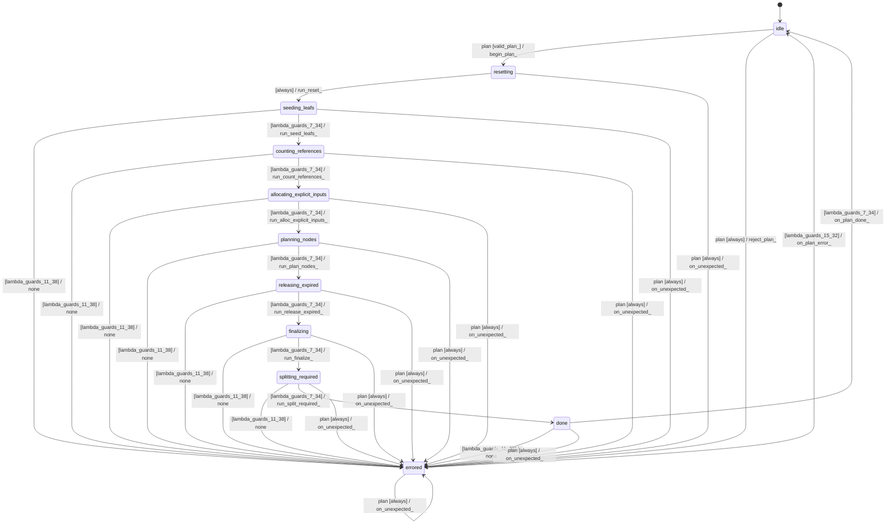

# buffer_planner

Source: [`emel/buffer/planner/sm.hpp`](https://github.com/stateforward/emel.cpp/blob/main/src/emel/buffer/planner/sm.hpp)

## Mermaid

## Transitions

| Source | Event | Guard | Action | Target |
| --- | --- | --- | --- | --- |
| [`idle`](https://github.com/stateforward/emel.cpp/blob/main/src/emel/buffer/planner/sm.hpp) | [`plan`](https://github.com/stateforward/emel.cpp/blob/main/src/emel/buffer/planner/sm.hpp) | [`valid_plan>`](https://github.com/stateforward/emel.cpp/blob/main/src/emel/buffer/planner/sm.hpp) | [`begin_plan>`](https://github.com/stateforward/emel.cpp/blob/main/src/emel/buffer/planner/sm.hpp) | [`resetting`](https://github.com/stateforward/emel.cpp/blob/main/src/emel/buffer/planner/sm.hpp) |
| [`idle`](https://github.com/stateforward/emel.cpp/blob/main/src/emel/buffer/planner/sm.hpp) | [`plan`](https://github.com/stateforward/emel.cpp/blob/main/src/emel/buffer/planner/sm.hpp) | [`always`](https://github.com/stateforward/emel.cpp/blob/main/src/emel/buffer/planner/sm.hpp) | [`reject_plan>`](https://github.com/stateforward/emel.cpp/blob/main/src/emel/buffer/planner/sm.hpp) | [`errored`](https://github.com/stateforward/emel.cpp/blob/main/src/emel/buffer/planner/sm.hpp) |
| [`resetting`](https://github.com/stateforward/emel.cpp/blob/main/src/emel/buffer/planner/sm.hpp) | - | [`always`](https://github.com/stateforward/emel.cpp/blob/main/src/emel/buffer/planner/sm.hpp) | [`run_reset>`](https://github.com/stateforward/emel.cpp/blob/main/src/emel/buffer/planner/sm.hpp) | [`seeding_leafs`](https://github.com/stateforward/emel.cpp/blob/main/src/emel/buffer/planner/sm.hpp) |
| [`seeding_leafs`](https://github.com/stateforward/emel.cpp/blob/main/src/emel/buffer/planner/sm.hpp) | - | [`lambda_guards_11_38`](https://github.com/stateforward/emel.cpp/blob/main/src/emel/buffer/planner/sm.hpp) | [`none`](https://github.com/stateforward/emel.cpp/blob/main/src/emel/buffer/planner/sm.hpp) | [`errored`](https://github.com/stateforward/emel.cpp/blob/main/src/emel/buffer/planner/sm.hpp) |
| [`seeding_leafs`](https://github.com/stateforward/emel.cpp/blob/main/src/emel/buffer/planner/sm.hpp) | - | [`lambda_guards_7_34`](https://github.com/stateforward/emel.cpp/blob/main/src/emel/buffer/planner/sm.hpp) | [`run_seed_leafs>`](https://github.com/stateforward/emel.cpp/blob/main/src/emel/buffer/planner/sm.hpp) | [`counting_references`](https://github.com/stateforward/emel.cpp/blob/main/src/emel/buffer/planner/sm.hpp) |
| [`counting_references`](https://github.com/stateforward/emel.cpp/blob/main/src/emel/buffer/planner/sm.hpp) | - | [`lambda_guards_11_38`](https://github.com/stateforward/emel.cpp/blob/main/src/emel/buffer/planner/sm.hpp) | [`none`](https://github.com/stateforward/emel.cpp/blob/main/src/emel/buffer/planner/sm.hpp) | [`errored`](https://github.com/stateforward/emel.cpp/blob/main/src/emel/buffer/planner/sm.hpp) |
| [`counting_references`](https://github.com/stateforward/emel.cpp/blob/main/src/emel/buffer/planner/sm.hpp) | - | [`lambda_guards_7_34`](https://github.com/stateforward/emel.cpp/blob/main/src/emel/buffer/planner/sm.hpp) | [`run_count_references>`](https://github.com/stateforward/emel.cpp/blob/main/src/emel/buffer/planner/sm.hpp) | [`allocating_explicit_inputs`](https://github.com/stateforward/emel.cpp/blob/main/src/emel/buffer/planner/sm.hpp) |
| [`allocating_explicit_inputs`](https://github.com/stateforward/emel.cpp/blob/main/src/emel/buffer/planner/sm.hpp) | - | [`lambda_guards_11_38`](https://github.com/stateforward/emel.cpp/blob/main/src/emel/buffer/planner/sm.hpp) | [`none`](https://github.com/stateforward/emel.cpp/blob/main/src/emel/buffer/planner/sm.hpp) | [`errored`](https://github.com/stateforward/emel.cpp/blob/main/src/emel/buffer/planner/sm.hpp) |
| [`allocating_explicit_inputs`](https://github.com/stateforward/emel.cpp/blob/main/src/emel/buffer/planner/sm.hpp) | - | [`lambda_guards_7_34`](https://github.com/stateforward/emel.cpp/blob/main/src/emel/buffer/planner/sm.hpp) | [`run_alloc_explicit_inputs>`](https://github.com/stateforward/emel.cpp/blob/main/src/emel/buffer/planner/sm.hpp) | [`planning_nodes`](https://github.com/stateforward/emel.cpp/blob/main/src/emel/buffer/planner/sm.hpp) |
| [`planning_nodes`](https://github.com/stateforward/emel.cpp/blob/main/src/emel/buffer/planner/sm.hpp) | - | [`lambda_guards_11_38`](https://github.com/stateforward/emel.cpp/blob/main/src/emel/buffer/planner/sm.hpp) | [`none`](https://github.com/stateforward/emel.cpp/blob/main/src/emel/buffer/planner/sm.hpp) | [`errored`](https://github.com/stateforward/emel.cpp/blob/main/src/emel/buffer/planner/sm.hpp) |
| [`planning_nodes`](https://github.com/stateforward/emel.cpp/blob/main/src/emel/buffer/planner/sm.hpp) | - | [`lambda_guards_7_34`](https://github.com/stateforward/emel.cpp/blob/main/src/emel/buffer/planner/sm.hpp) | [`run_plan_nodes>`](https://github.com/stateforward/emel.cpp/blob/main/src/emel/buffer/planner/sm.hpp) | [`releasing_expired`](https://github.com/stateforward/emel.cpp/blob/main/src/emel/buffer/planner/sm.hpp) |
| [`releasing_expired`](https://github.com/stateforward/emel.cpp/blob/main/src/emel/buffer/planner/sm.hpp) | - | [`lambda_guards_11_38`](https://github.com/stateforward/emel.cpp/blob/main/src/emel/buffer/planner/sm.hpp) | [`none`](https://github.com/stateforward/emel.cpp/blob/main/src/emel/buffer/planner/sm.hpp) | [`errored`](https://github.com/stateforward/emel.cpp/blob/main/src/emel/buffer/planner/sm.hpp) |
| [`releasing_expired`](https://github.com/stateforward/emel.cpp/blob/main/src/emel/buffer/planner/sm.hpp) | - | [`lambda_guards_7_34`](https://github.com/stateforward/emel.cpp/blob/main/src/emel/buffer/planner/sm.hpp) | [`run_release_expired>`](https://github.com/stateforward/emel.cpp/blob/main/src/emel/buffer/planner/sm.hpp) | [`finalizing`](https://github.com/stateforward/emel.cpp/blob/main/src/emel/buffer/planner/sm.hpp) |
| [`finalizing`](https://github.com/stateforward/emel.cpp/blob/main/src/emel/buffer/planner/sm.hpp) | - | [`lambda_guards_11_38`](https://github.com/stateforward/emel.cpp/blob/main/src/emel/buffer/planner/sm.hpp) | [`none`](https://github.com/stateforward/emel.cpp/blob/main/src/emel/buffer/planner/sm.hpp) | [`errored`](https://github.com/stateforward/emel.cpp/blob/main/src/emel/buffer/planner/sm.hpp) |
| [`finalizing`](https://github.com/stateforward/emel.cpp/blob/main/src/emel/buffer/planner/sm.hpp) | - | [`lambda_guards_7_34`](https://github.com/stateforward/emel.cpp/blob/main/src/emel/buffer/planner/sm.hpp) | [`run_finalize>`](https://github.com/stateforward/emel.cpp/blob/main/src/emel/buffer/planner/sm.hpp) | [`splitting_required`](https://github.com/stateforward/emel.cpp/blob/main/src/emel/buffer/planner/sm.hpp) |
| [`splitting_required`](https://github.com/stateforward/emel.cpp/blob/main/src/emel/buffer/planner/sm.hpp) | - | [`lambda_guards_11_38`](https://github.com/stateforward/emel.cpp/blob/main/src/emel/buffer/planner/sm.hpp) | [`none`](https://github.com/stateforward/emel.cpp/blob/main/src/emel/buffer/planner/sm.hpp) | [`errored`](https://github.com/stateforward/emel.cpp/blob/main/src/emel/buffer/planner/sm.hpp) |
| [`splitting_required`](https://github.com/stateforward/emel.cpp/blob/main/src/emel/buffer/planner/sm.hpp) | - | [`lambda_guards_7_34`](https://github.com/stateforward/emel.cpp/blob/main/src/emel/buffer/planner/sm.hpp) | [`run_split_required>`](https://github.com/stateforward/emel.cpp/blob/main/src/emel/buffer/planner/sm.hpp) | [`done`](https://github.com/stateforward/emel.cpp/blob/main/src/emel/buffer/planner/sm.hpp) |
| [`done`](https://github.com/stateforward/emel.cpp/blob/main/src/emel/buffer/planner/sm.hpp) | - | [`lambda_guards_11_38`](https://github.com/stateforward/emel.cpp/blob/main/src/emel/buffer/planner/sm.hpp) | [`none`](https://github.com/stateforward/emel.cpp/blob/main/src/emel/buffer/planner/sm.hpp) | [`errored`](https://github.com/stateforward/emel.cpp/blob/main/src/emel/buffer/planner/sm.hpp) |
| [`done`](https://github.com/stateforward/emel.cpp/blob/main/src/emel/buffer/planner/sm.hpp) | - | [`lambda_guards_7_34`](https://github.com/stateforward/emel.cpp/blob/main/src/emel/buffer/planner/sm.hpp) | [`on_plan_done>`](https://github.com/stateforward/emel.cpp/blob/main/src/emel/buffer/planner/sm.hpp) | [`idle`](https://github.com/stateforward/emel.cpp/blob/main/src/emel/buffer/planner/sm.hpp) |
| [`errored`](https://github.com/stateforward/emel.cpp/blob/main/src/emel/buffer/planner/sm.hpp) | - | [`lambda_guards_15_32`](https://github.com/stateforward/emel.cpp/blob/main/src/emel/buffer/planner/sm.hpp) | [`on_plan_error>`](https://github.com/stateforward/emel.cpp/blob/main/src/emel/buffer/planner/sm.hpp) | [`idle`](https://github.com/stateforward/emel.cpp/blob/main/src/emel/buffer/planner/sm.hpp) |
| [`resetting`](https://github.com/stateforward/emel.cpp/blob/main/src/emel/buffer/planner/sm.hpp) | [`plan`](https://github.com/stateforward/emel.cpp/blob/main/src/emel/buffer/planner/sm.hpp) | [`always`](https://github.com/stateforward/emel.cpp/blob/main/src/emel/buffer/planner/sm.hpp) | [`on_unexpected>`](https://github.com/stateforward/emel.cpp/blob/main/src/emel/buffer/planner/sm.hpp) | [`errored`](https://github.com/stateforward/emel.cpp/blob/main/src/emel/buffer/planner/sm.hpp) |
| [`seeding_leafs`](https://github.com/stateforward/emel.cpp/blob/main/src/emel/buffer/planner/sm.hpp) | [`plan`](https://github.com/stateforward/emel.cpp/blob/main/src/emel/buffer/planner/sm.hpp) | [`always`](https://github.com/stateforward/emel.cpp/blob/main/src/emel/buffer/planner/sm.hpp) | [`on_unexpected>`](https://github.com/stateforward/emel.cpp/blob/main/src/emel/buffer/planner/sm.hpp) | [`errored`](https://github.com/stateforward/emel.cpp/blob/main/src/emel/buffer/planner/sm.hpp) |
| [`counting_references`](https://github.com/stateforward/emel.cpp/blob/main/src/emel/buffer/planner/sm.hpp) | [`plan`](https://github.com/stateforward/emel.cpp/blob/main/src/emel/buffer/planner/sm.hpp) | [`always`](https://github.com/stateforward/emel.cpp/blob/main/src/emel/buffer/planner/sm.hpp) | [`on_unexpected>`](https://github.com/stateforward/emel.cpp/blob/main/src/emel/buffer/planner/sm.hpp) | [`errored`](https://github.com/stateforward/emel.cpp/blob/main/src/emel/buffer/planner/sm.hpp) |
| [`allocating_explicit_inputs`](https://github.com/stateforward/emel.cpp/blob/main/src/emel/buffer/planner/sm.hpp) | [`plan`](https://github.com/stateforward/emel.cpp/blob/main/src/emel/buffer/planner/sm.hpp) | [`always`](https://github.com/stateforward/emel.cpp/blob/main/src/emel/buffer/planner/sm.hpp) | [`on_unexpected>`](https://github.com/stateforward/emel.cpp/blob/main/src/emel/buffer/planner/sm.hpp) | [`errored`](https://github.com/stateforward/emel.cpp/blob/main/src/emel/buffer/planner/sm.hpp) |
| [`planning_nodes`](https://github.com/stateforward/emel.cpp/blob/main/src/emel/buffer/planner/sm.hpp) | [`plan`](https://github.com/stateforward/emel.cpp/blob/main/src/emel/buffer/planner/sm.hpp) | [`always`](https://github.com/stateforward/emel.cpp/blob/main/src/emel/buffer/planner/sm.hpp) | [`on_unexpected>`](https://github.com/stateforward/emel.cpp/blob/main/src/emel/buffer/planner/sm.hpp) | [`errored`](https://github.com/stateforward/emel.cpp/blob/main/src/emel/buffer/planner/sm.hpp) |
| [`releasing_expired`](https://github.com/stateforward/emel.cpp/blob/main/src/emel/buffer/planner/sm.hpp) | [`plan`](https://github.com/stateforward/emel.cpp/blob/main/src/emel/buffer/planner/sm.hpp) | [`always`](https://github.com/stateforward/emel.cpp/blob/main/src/emel/buffer/planner/sm.hpp) | [`on_unexpected>`](https://github.com/stateforward/emel.cpp/blob/main/src/emel/buffer/planner/sm.hpp) | [`errored`](https://github.com/stateforward/emel.cpp/blob/main/src/emel/buffer/planner/sm.hpp) |
| [`finalizing`](https://github.com/stateforward/emel.cpp/blob/main/src/emel/buffer/planner/sm.hpp) | [`plan`](https://github.com/stateforward/emel.cpp/blob/main/src/emel/buffer/planner/sm.hpp) | [`always`](https://github.com/stateforward/emel.cpp/blob/main/src/emel/buffer/planner/sm.hpp) | [`on_unexpected>`](https://github.com/stateforward/emel.cpp/blob/main/src/emel/buffer/planner/sm.hpp) | [`errored`](https://github.com/stateforward/emel.cpp/blob/main/src/emel/buffer/planner/sm.hpp) |
| [`splitting_required`](https://github.com/stateforward/emel.cpp/blob/main/src/emel/buffer/planner/sm.hpp) | [`plan`](https://github.com/stateforward/emel.cpp/blob/main/src/emel/buffer/planner/sm.hpp) | [`always`](https://github.com/stateforward/emel.cpp/blob/main/src/emel/buffer/planner/sm.hpp) | [`on_unexpected>`](https://github.com/stateforward/emel.cpp/blob/main/src/emel/buffer/planner/sm.hpp) | [`errored`](https://github.com/stateforward/emel.cpp/blob/main/src/emel/buffer/planner/sm.hpp) |
| [`done`](https://github.com/stateforward/emel.cpp/blob/main/src/emel/buffer/planner/sm.hpp) | [`plan`](https://github.com/stateforward/emel.cpp/blob/main/src/emel/buffer/planner/sm.hpp) | [`always`](https://github.com/stateforward/emel.cpp/blob/main/src/emel/buffer/planner/sm.hpp) | [`on_unexpected>`](https://github.com/stateforward/emel.cpp/blob/main/src/emel/buffer/planner/sm.hpp) | [`errored`](https://github.com/stateforward/emel.cpp/blob/main/src/emel/buffer/planner/sm.hpp) |
| [`errored`](https://github.com/stateforward/emel.cpp/blob/main/src/emel/buffer/planner/sm.hpp) | [`plan`](https://github.com/stateforward/emel.cpp/blob/main/src/emel/buffer/planner/sm.hpp) | [`always`](https://github.com/stateforward/emel.cpp/blob/main/src/emel/buffer/planner/sm.hpp) | [`on_unexpected>`](https://github.com/stateforward/emel.cpp/blob/main/src/emel/buffer/planner/sm.hpp) | [`errored`](https://github.com/stateforward/emel.cpp/blob/main/src/emel/buffer/planner/sm.hpp) |
