# buffer_planner

Source: [`emel/buffer/planner/sm.hpp`](https://github.com/stateforward/emel.cpp/blob/main/src/emel/buffer/planner/sm.hpp)

## Mermaid

```mermaid
stateDiagram-v2
  [*] --> idle
  idle --> resetting : emel__buffer__planner__event__plan [boost__sml__aux__zero_wrapper_emel__buffer__planner__guard__valid_plan_] / boost__sml__aux__zero_wrapper_emel__buffer__planner__action__begin_plan_
  idle --> errored : emel__buffer__planner__event__plan [boost__sml__front__always] / boost__sml__aux__zero_wrapper_emel__buffer__planner__action__reject_plan_
  resetting --> boost__sml__front__internal : on_entry [boost__sml__front__always] / boost__sml__aux__zero_wrapper__lambda_at__Users_gabrielwillen_VSCode_stateforward_emel_emel_cpp_src_emel_buffer_planner_sm_hpp_75_11__
  resetting --> seeding_leafs : emel__buffer__planner__event__reset_done [boost__sml__front__always] / boost__sml__front__none
  resetting --> errored : emel__buffer__planner__event__reset_error [boost__sml__front__always] / boost__sml__front__none
  seeding_leafs --> boost__sml__front__internal : on_entry [boost__sml__front__always] / boost__sml__aux__zero_wrapper__lambda_at__Users_gabrielwillen_VSCode_stateforward_emel_emel_cpp_src_emel_buffer_planner_sm_hpp_94_11__
  seeding_leafs --> counting_references : emel__buffer__planner__event__seed_leafs_done [boost__sml__front__always] / boost__sml__front__none
  seeding_leafs --> errored : emel__buffer__planner__event__seed_leafs_error [boost__sml__front__always] / boost__sml__front__none
  counting_references --> boost__sml__front__internal : on_entry [boost__sml__front__always] / boost__sml__aux__zero_wrapper__lambda_at__Users_gabrielwillen_VSCode_stateforward_emel_emel_cpp_src_emel_buffer_planner_sm_hpp_116_11__
  counting_references --> allocating_explicit_inputs : emel__buffer__planner__event__count_references_done [boost__sml__front__always] / boost__sml__front__none
  counting_references --> errored : emel__buffer__planner__event__count_references_error [boost__sml__front__always] / boost__sml__front__none
  allocating_explicit_inputs --> boost__sml__front__internal : on_entry [boost__sml__front__always] / boost__sml__aux__zero_wrapper__lambda_at__Users_gabrielwillen_VSCode_stateforward_emel_emel_cpp_src_emel_buffer_planner_sm_hpp_139_11__
  allocating_explicit_inputs --> planning_nodes : emel__buffer__planner__event__alloc_explicit_inputs_done [boost__sml__front__always] / boost__sml__front__none
  allocating_explicit_inputs --> errored : emel__buffer__planner__event__alloc_explicit_inputs_error [boost__sml__front__always] / boost__sml__front__none
  planning_nodes --> boost__sml__front__internal : on_entry [boost__sml__front__always] / boost__sml__aux__zero_wrapper__lambda_at__Users_gabrielwillen_VSCode_stateforward_emel_emel_cpp_src_emel_buffer_planner_sm_hpp_163_11__
  planning_nodes --> releasing_expired : emel__buffer__planner__event__plan_nodes_done [boost__sml__front__always] / boost__sml__front__none
  planning_nodes --> errored : emel__buffer__planner__event__plan_nodes_error [boost__sml__front__always] / boost__sml__front__none
  releasing_expired --> boost__sml__front__internal : on_entry [boost__sml__front__always] / boost__sml__aux__zero_wrapper__lambda_at__Users_gabrielwillen_VSCode_stateforward_emel_emel_cpp_src_emel_buffer_planner_sm_hpp_187_11__
  releasing_expired --> finalizing : emel__buffer__planner__event__release_expired_done [boost__sml__front__always] / boost__sml__front__none
  releasing_expired --> errored : emel__buffer__planner__event__release_expired_error [boost__sml__front__always] / boost__sml__front__none
  finalizing --> boost__sml__front__internal : on_entry [boost__sml__front__always] / boost__sml__aux__zero_wrapper__lambda_at__Users_gabrielwillen_VSCode_stateforward_emel_emel_cpp_src_emel_buffer_planner_sm_hpp_211_11__
  finalizing --> splitting_required : emel__buffer__planner__event__finalize_done [boost__sml__front__always] / boost__sml__front__none
  finalizing --> errored : emel__buffer__planner__event__finalize_error [boost__sml__front__always] / boost__sml__front__none
  splitting_required --> boost__sml__front__internal : on_entry [boost__sml__front__always] / boost__sml__aux__zero_wrapper__lambda_at__Users_gabrielwillen_VSCode_stateforward_emel_emel_cpp_src_emel_buffer_planner_sm_hpp_234_11__
  splitting_required --> done : emel__buffer__planner__event__split_required_done [boost__sml__front__always] / boost__sml__front__none
  splitting_required --> errored : emel__buffer__planner__event__split_required_error [boost__sml__front__always] / boost__sml__front__none
  done --> boost__sml__front__internal : on_entry [boost__sml__front__always] / boost__sml__aux__zero_wrapper__lambda_at__Users_gabrielwillen_VSCode_stateforward_emel_emel_cpp_src_emel_buffer_planner_sm_hpp_259_11__
  done --> idle : emel__buffer__planner__events__plan_done [boost__sml__front__always] / boost__sml__aux__zero_wrapper_emel__buffer__planner__action__on_plan_done_
  errored --> boost__sml__front__internal : on_entry [boost__sml__front__always] / boost__sml__aux__zero_wrapper__lambda_at__Users_gabrielwillen_VSCode_stateforward_emel_emel_cpp_src_emel_buffer_planner_sm_hpp_275_11__
  errored --> idle : emel__buffer__planner__events__plan_error [boost__sml__front__always] / boost__sml__aux__zero_wrapper_emel__buffer__planner__action__on_plan_error_
  idle --> errored : boost__sml__back___ [boost__sml__front__always] / boost__sml__aux__zero_wrapper_emel__buffer__planner__action__on_unexpected_
  resetting --> errored : boost__sml__back___ [boost__sml__front__always] / boost__sml__aux__zero_wrapper_emel__buffer__planner__action__on_unexpected_
  seeding_leafs --> errored : boost__sml__back___ [boost__sml__front__always] / boost__sml__aux__zero_wrapper_emel__buffer__planner__action__on_unexpected_
  counting_references --> errored : boost__sml__back___ [boost__sml__front__always] / boost__sml__aux__zero_wrapper_emel__buffer__planner__action__on_unexpected_
  allocating_explicit_inputs --> errored : boost__sml__back___ [boost__sml__front__always] / boost__sml__aux__zero_wrapper_emel__buffer__planner__action__on_unexpected_
  planning_nodes --> errored : boost__sml__back___ [boost__sml__front__always] / boost__sml__aux__zero_wrapper_emel__buffer__planner__action__on_unexpected_
  releasing_expired --> errored : boost__sml__back___ [boost__sml__front__always] / boost__sml__aux__zero_wrapper_emel__buffer__planner__action__on_unexpected_
  finalizing --> errored : boost__sml__back___ [boost__sml__front__always] / boost__sml__aux__zero_wrapper_emel__buffer__planner__action__on_unexpected_
  splitting_required --> errored : boost__sml__back___ [boost__sml__front__always] / boost__sml__aux__zero_wrapper_emel__buffer__planner__action__on_unexpected_
  done --> errored : boost__sml__back___ [boost__sml__front__always] / boost__sml__aux__zero_wrapper_emel__buffer__planner__action__on_unexpected_
  errored --> errored : boost__sml__back___ [boost__sml__front__always] / boost__sml__aux__zero_wrapper_emel__buffer__planner__action__on_unexpected_
```

## Transitions

| Source | Event | Guard | Action | Target |
| --- | --- | --- | --- | --- |
| [`idle`](https://github.com/stateforward/emel.cpp/blob/main/src/emel/buffer/planner/sm.hpp) | [`plan`](https://github.com/stateforward/emel.cpp/blob/main/src/emel/buffer/planner/sm.hpp) | [`valid_plan>`](https://github.com/stateforward/emel.cpp/blob/main/src/emel/buffer/planner/sm.hpp) | [`begin_plan>`](https://github.com/stateforward/emel.cpp/blob/main/src/emel/buffer/planner/sm.hpp) | [`resetting`](https://github.com/stateforward/emel.cpp/blob/main/src/emel/buffer/planner/sm.hpp) |
| [`idle`](https://github.com/stateforward/emel.cpp/blob/main/src/emel/buffer/planner/sm.hpp) | [`plan`](https://github.com/stateforward/emel.cpp/blob/main/src/emel/buffer/planner/sm.hpp) | [`always`](https://github.com/stateforward/emel.cpp/blob/main/src/emel/buffer/planner/sm.hpp) | [`reject_plan>`](https://github.com/stateforward/emel.cpp/blob/main/src/emel/buffer/planner/sm.hpp) | [`errored`](https://github.com/stateforward/emel.cpp/blob/main/src/emel/buffer/planner/sm.hpp) |
| [`resetting`](https://github.com/stateforward/emel.cpp/blob/main/src/emel/buffer/planner/sm.hpp) | [`on_entry`](https://github.com/stateforward/emel.cpp/blob/main/src/emel/buffer/planner/sm.hpp) | [`always`](https://github.com/stateforward/emel.cpp/blob/main/src/emel/buffer/planner/sm.hpp) | [`zero_wrapper<(lambda at /Users/gabrielwillen/VSCode/stateforward/emel/emel.cpp/src/emel/buffer/planner/sm.hpp:75:11)>`](https://github.com/stateforward/emel.cpp/blob/main/src/emel/buffer/planner/sm.hpp) | [`internal`](https://github.com/stateforward/emel.cpp/blob/main/src/emel/buffer/planner/sm.hpp) |
| [`resetting`](https://github.com/stateforward/emel.cpp/blob/main/src/emel/buffer/planner/sm.hpp) | [`reset_done`](https://github.com/stateforward/emel.cpp/blob/main/src/emel/buffer/planner/sm.hpp) | [`always`](https://github.com/stateforward/emel.cpp/blob/main/src/emel/buffer/planner/sm.hpp) | [`none`](https://github.com/stateforward/emel.cpp/blob/main/src/emel/buffer/planner/sm.hpp) | [`seeding_leafs`](https://github.com/stateforward/emel.cpp/blob/main/src/emel/buffer/planner/sm.hpp) |
| [`resetting`](https://github.com/stateforward/emel.cpp/blob/main/src/emel/buffer/planner/sm.hpp) | [`reset_error`](https://github.com/stateforward/emel.cpp/blob/main/src/emel/buffer/planner/sm.hpp) | [`always`](https://github.com/stateforward/emel.cpp/blob/main/src/emel/buffer/planner/sm.hpp) | [`none`](https://github.com/stateforward/emel.cpp/blob/main/src/emel/buffer/planner/sm.hpp) | [`errored`](https://github.com/stateforward/emel.cpp/blob/main/src/emel/buffer/planner/sm.hpp) |
| [`seeding_leafs`](https://github.com/stateforward/emel.cpp/blob/main/src/emel/buffer/planner/sm.hpp) | [`on_entry`](https://github.com/stateforward/emel.cpp/blob/main/src/emel/buffer/planner/sm.hpp) | [`always`](https://github.com/stateforward/emel.cpp/blob/main/src/emel/buffer/planner/sm.hpp) | [`zero_wrapper<(lambda at /Users/gabrielwillen/VSCode/stateforward/emel/emel.cpp/src/emel/buffer/planner/sm.hpp:94:11)>`](https://github.com/stateforward/emel.cpp/blob/main/src/emel/buffer/planner/sm.hpp) | [`internal`](https://github.com/stateforward/emel.cpp/blob/main/src/emel/buffer/planner/sm.hpp) |
| [`seeding_leafs`](https://github.com/stateforward/emel.cpp/blob/main/src/emel/buffer/planner/sm.hpp) | [`seed_leafs_done`](https://github.com/stateforward/emel.cpp/blob/main/src/emel/buffer/planner/sm.hpp) | [`always`](https://github.com/stateforward/emel.cpp/blob/main/src/emel/buffer/planner/sm.hpp) | [`none`](https://github.com/stateforward/emel.cpp/blob/main/src/emel/buffer/planner/sm.hpp) | [`counting_references`](https://github.com/stateforward/emel.cpp/blob/main/src/emel/buffer/planner/sm.hpp) |
| [`seeding_leafs`](https://github.com/stateforward/emel.cpp/blob/main/src/emel/buffer/planner/sm.hpp) | [`seed_leafs_error`](https://github.com/stateforward/emel.cpp/blob/main/src/emel/buffer/planner/sm.hpp) | [`always`](https://github.com/stateforward/emel.cpp/blob/main/src/emel/buffer/planner/sm.hpp) | [`none`](https://github.com/stateforward/emel.cpp/blob/main/src/emel/buffer/planner/sm.hpp) | [`errored`](https://github.com/stateforward/emel.cpp/blob/main/src/emel/buffer/planner/sm.hpp) |
| [`counting_references`](https://github.com/stateforward/emel.cpp/blob/main/src/emel/buffer/planner/sm.hpp) | [`on_entry`](https://github.com/stateforward/emel.cpp/blob/main/src/emel/buffer/planner/sm.hpp) | [`always`](https://github.com/stateforward/emel.cpp/blob/main/src/emel/buffer/planner/sm.hpp) | [`zero_wrapper<(lambda at /Users/gabrielwillen/VSCode/stateforward/emel/emel.cpp/src/emel/buffer/planner/sm.hpp:116:11)>`](https://github.com/stateforward/emel.cpp/blob/main/src/emel/buffer/planner/sm.hpp) | [`internal`](https://github.com/stateforward/emel.cpp/blob/main/src/emel/buffer/planner/sm.hpp) |
| [`counting_references`](https://github.com/stateforward/emel.cpp/blob/main/src/emel/buffer/planner/sm.hpp) | [`count_references_done`](https://github.com/stateforward/emel.cpp/blob/main/src/emel/buffer/planner/sm.hpp) | [`always`](https://github.com/stateforward/emel.cpp/blob/main/src/emel/buffer/planner/sm.hpp) | [`none`](https://github.com/stateforward/emel.cpp/blob/main/src/emel/buffer/planner/sm.hpp) | [`allocating_explicit_inputs`](https://github.com/stateforward/emel.cpp/blob/main/src/emel/buffer/planner/sm.hpp) |
| [`counting_references`](https://github.com/stateforward/emel.cpp/blob/main/src/emel/buffer/planner/sm.hpp) | [`count_references_error`](https://github.com/stateforward/emel.cpp/blob/main/src/emel/buffer/planner/sm.hpp) | [`always`](https://github.com/stateforward/emel.cpp/blob/main/src/emel/buffer/planner/sm.hpp) | [`none`](https://github.com/stateforward/emel.cpp/blob/main/src/emel/buffer/planner/sm.hpp) | [`errored`](https://github.com/stateforward/emel.cpp/blob/main/src/emel/buffer/planner/sm.hpp) |
| [`allocating_explicit_inputs`](https://github.com/stateforward/emel.cpp/blob/main/src/emel/buffer/planner/sm.hpp) | [`on_entry`](https://github.com/stateforward/emel.cpp/blob/main/src/emel/buffer/planner/sm.hpp) | [`always`](https://github.com/stateforward/emel.cpp/blob/main/src/emel/buffer/planner/sm.hpp) | [`zero_wrapper<(lambda at /Users/gabrielwillen/VSCode/stateforward/emel/emel.cpp/src/emel/buffer/planner/sm.hpp:139:11)>`](https://github.com/stateforward/emel.cpp/blob/main/src/emel/buffer/planner/sm.hpp) | [`internal`](https://github.com/stateforward/emel.cpp/blob/main/src/emel/buffer/planner/sm.hpp) |
| [`allocating_explicit_inputs`](https://github.com/stateforward/emel.cpp/blob/main/src/emel/buffer/planner/sm.hpp) | [`alloc_explicit_inputs_done`](https://github.com/stateforward/emel.cpp/blob/main/src/emel/buffer/planner/sm.hpp) | [`always`](https://github.com/stateforward/emel.cpp/blob/main/src/emel/buffer/planner/sm.hpp) | [`none`](https://github.com/stateforward/emel.cpp/blob/main/src/emel/buffer/planner/sm.hpp) | [`planning_nodes`](https://github.com/stateforward/emel.cpp/blob/main/src/emel/buffer/planner/sm.hpp) |
| [`allocating_explicit_inputs`](https://github.com/stateforward/emel.cpp/blob/main/src/emel/buffer/planner/sm.hpp) | [`alloc_explicit_inputs_error`](https://github.com/stateforward/emel.cpp/blob/main/src/emel/buffer/planner/sm.hpp) | [`always`](https://github.com/stateforward/emel.cpp/blob/main/src/emel/buffer/planner/sm.hpp) | [`none`](https://github.com/stateforward/emel.cpp/blob/main/src/emel/buffer/planner/sm.hpp) | [`errored`](https://github.com/stateforward/emel.cpp/blob/main/src/emel/buffer/planner/sm.hpp) |
| [`planning_nodes`](https://github.com/stateforward/emel.cpp/blob/main/src/emel/buffer/planner/sm.hpp) | [`on_entry`](https://github.com/stateforward/emel.cpp/blob/main/src/emel/buffer/planner/sm.hpp) | [`always`](https://github.com/stateforward/emel.cpp/blob/main/src/emel/buffer/planner/sm.hpp) | [`zero_wrapper<(lambda at /Users/gabrielwillen/VSCode/stateforward/emel/emel.cpp/src/emel/buffer/planner/sm.hpp:163:11)>`](https://github.com/stateforward/emel.cpp/blob/main/src/emel/buffer/planner/sm.hpp) | [`internal`](https://github.com/stateforward/emel.cpp/blob/main/src/emel/buffer/planner/sm.hpp) |
| [`planning_nodes`](https://github.com/stateforward/emel.cpp/blob/main/src/emel/buffer/planner/sm.hpp) | [`plan_nodes_done`](https://github.com/stateforward/emel.cpp/blob/main/src/emel/buffer/planner/sm.hpp) | [`always`](https://github.com/stateforward/emel.cpp/blob/main/src/emel/buffer/planner/sm.hpp) | [`none`](https://github.com/stateforward/emel.cpp/blob/main/src/emel/buffer/planner/sm.hpp) | [`releasing_expired`](https://github.com/stateforward/emel.cpp/blob/main/src/emel/buffer/planner/sm.hpp) |
| [`planning_nodes`](https://github.com/stateforward/emel.cpp/blob/main/src/emel/buffer/planner/sm.hpp) | [`plan_nodes_error`](https://github.com/stateforward/emel.cpp/blob/main/src/emel/buffer/planner/sm.hpp) | [`always`](https://github.com/stateforward/emel.cpp/blob/main/src/emel/buffer/planner/sm.hpp) | [`none`](https://github.com/stateforward/emel.cpp/blob/main/src/emel/buffer/planner/sm.hpp) | [`errored`](https://github.com/stateforward/emel.cpp/blob/main/src/emel/buffer/planner/sm.hpp) |
| [`releasing_expired`](https://github.com/stateforward/emel.cpp/blob/main/src/emel/buffer/planner/sm.hpp) | [`on_entry`](https://github.com/stateforward/emel.cpp/blob/main/src/emel/buffer/planner/sm.hpp) | [`always`](https://github.com/stateforward/emel.cpp/blob/main/src/emel/buffer/planner/sm.hpp) | [`zero_wrapper<(lambda at /Users/gabrielwillen/VSCode/stateforward/emel/emel.cpp/src/emel/buffer/planner/sm.hpp:187:11)>`](https://github.com/stateforward/emel.cpp/blob/main/src/emel/buffer/planner/sm.hpp) | [`internal`](https://github.com/stateforward/emel.cpp/blob/main/src/emel/buffer/planner/sm.hpp) |
| [`releasing_expired`](https://github.com/stateforward/emel.cpp/blob/main/src/emel/buffer/planner/sm.hpp) | [`release_expired_done`](https://github.com/stateforward/emel.cpp/blob/main/src/emel/buffer/planner/sm.hpp) | [`always`](https://github.com/stateforward/emel.cpp/blob/main/src/emel/buffer/planner/sm.hpp) | [`none`](https://github.com/stateforward/emel.cpp/blob/main/src/emel/buffer/planner/sm.hpp) | [`finalizing`](https://github.com/stateforward/emel.cpp/blob/main/src/emel/buffer/planner/sm.hpp) |
| [`releasing_expired`](https://github.com/stateforward/emel.cpp/blob/main/src/emel/buffer/planner/sm.hpp) | [`release_expired_error`](https://github.com/stateforward/emel.cpp/blob/main/src/emel/buffer/planner/sm.hpp) | [`always`](https://github.com/stateforward/emel.cpp/blob/main/src/emel/buffer/planner/sm.hpp) | [`none`](https://github.com/stateforward/emel.cpp/blob/main/src/emel/buffer/planner/sm.hpp) | [`errored`](https://github.com/stateforward/emel.cpp/blob/main/src/emel/buffer/planner/sm.hpp) |
| [`finalizing`](https://github.com/stateforward/emel.cpp/blob/main/src/emel/buffer/planner/sm.hpp) | [`on_entry`](https://github.com/stateforward/emel.cpp/blob/main/src/emel/buffer/planner/sm.hpp) | [`always`](https://github.com/stateforward/emel.cpp/blob/main/src/emel/buffer/planner/sm.hpp) | [`zero_wrapper<(lambda at /Users/gabrielwillen/VSCode/stateforward/emel/emel.cpp/src/emel/buffer/planner/sm.hpp:211:11)>`](https://github.com/stateforward/emel.cpp/blob/main/src/emel/buffer/planner/sm.hpp) | [`internal`](https://github.com/stateforward/emel.cpp/blob/main/src/emel/buffer/planner/sm.hpp) |
| [`finalizing`](https://github.com/stateforward/emel.cpp/blob/main/src/emel/buffer/planner/sm.hpp) | [`finalize_done`](https://github.com/stateforward/emel.cpp/blob/main/src/emel/buffer/planner/sm.hpp) | [`always`](https://github.com/stateforward/emel.cpp/blob/main/src/emel/buffer/planner/sm.hpp) | [`none`](https://github.com/stateforward/emel.cpp/blob/main/src/emel/buffer/planner/sm.hpp) | [`splitting_required`](https://github.com/stateforward/emel.cpp/blob/main/src/emel/buffer/planner/sm.hpp) |
| [`finalizing`](https://github.com/stateforward/emel.cpp/blob/main/src/emel/buffer/planner/sm.hpp) | [`finalize_error`](https://github.com/stateforward/emel.cpp/blob/main/src/emel/buffer/planner/sm.hpp) | [`always`](https://github.com/stateforward/emel.cpp/blob/main/src/emel/buffer/planner/sm.hpp) | [`none`](https://github.com/stateforward/emel.cpp/blob/main/src/emel/buffer/planner/sm.hpp) | [`errored`](https://github.com/stateforward/emel.cpp/blob/main/src/emel/buffer/planner/sm.hpp) |
| [`splitting_required`](https://github.com/stateforward/emel.cpp/blob/main/src/emel/buffer/planner/sm.hpp) | [`on_entry`](https://github.com/stateforward/emel.cpp/blob/main/src/emel/buffer/planner/sm.hpp) | [`always`](https://github.com/stateforward/emel.cpp/blob/main/src/emel/buffer/planner/sm.hpp) | [`zero_wrapper<(lambda at /Users/gabrielwillen/VSCode/stateforward/emel/emel.cpp/src/emel/buffer/planner/sm.hpp:234:11)>`](https://github.com/stateforward/emel.cpp/blob/main/src/emel/buffer/planner/sm.hpp) | [`internal`](https://github.com/stateforward/emel.cpp/blob/main/src/emel/buffer/planner/sm.hpp) |
| [`splitting_required`](https://github.com/stateforward/emel.cpp/blob/main/src/emel/buffer/planner/sm.hpp) | [`split_required_done`](https://github.com/stateforward/emel.cpp/blob/main/src/emel/buffer/planner/sm.hpp) | [`always`](https://github.com/stateforward/emel.cpp/blob/main/src/emel/buffer/planner/sm.hpp) | [`none`](https://github.com/stateforward/emel.cpp/blob/main/src/emel/buffer/planner/sm.hpp) | [`done`](https://github.com/stateforward/emel.cpp/blob/main/src/emel/buffer/planner/sm.hpp) |
| [`splitting_required`](https://github.com/stateforward/emel.cpp/blob/main/src/emel/buffer/planner/sm.hpp) | [`split_required_error`](https://github.com/stateforward/emel.cpp/blob/main/src/emel/buffer/planner/sm.hpp) | [`always`](https://github.com/stateforward/emel.cpp/blob/main/src/emel/buffer/planner/sm.hpp) | [`none`](https://github.com/stateforward/emel.cpp/blob/main/src/emel/buffer/planner/sm.hpp) | [`errored`](https://github.com/stateforward/emel.cpp/blob/main/src/emel/buffer/planner/sm.hpp) |
| [`done`](https://github.com/stateforward/emel.cpp/blob/main/src/emel/buffer/planner/sm.hpp) | [`on_entry`](https://github.com/stateforward/emel.cpp/blob/main/src/emel/buffer/planner/sm.hpp) | [`always`](https://github.com/stateforward/emel.cpp/blob/main/src/emel/buffer/planner/sm.hpp) | [`zero_wrapper<(lambda at /Users/gabrielwillen/VSCode/stateforward/emel/emel.cpp/src/emel/buffer/planner/sm.hpp:259:11)>`](https://github.com/stateforward/emel.cpp/blob/main/src/emel/buffer/planner/sm.hpp) | [`internal`](https://github.com/stateforward/emel.cpp/blob/main/src/emel/buffer/planner/sm.hpp) |
| [`done`](https://github.com/stateforward/emel.cpp/blob/main/src/emel/buffer/planner/sm.hpp) | [`plan_done`](https://github.com/stateforward/emel.cpp/blob/main/src/emel/buffer/planner/sm.hpp) | [`always`](https://github.com/stateforward/emel.cpp/blob/main/src/emel/buffer/planner/sm.hpp) | [`on_plan_done>`](https://github.com/stateforward/emel.cpp/blob/main/src/emel/buffer/planner/sm.hpp) | [`idle`](https://github.com/stateforward/emel.cpp/blob/main/src/emel/buffer/planner/sm.hpp) |
| [`errored`](https://github.com/stateforward/emel.cpp/blob/main/src/emel/buffer/planner/sm.hpp) | [`on_entry`](https://github.com/stateforward/emel.cpp/blob/main/src/emel/buffer/planner/sm.hpp) | [`always`](https://github.com/stateforward/emel.cpp/blob/main/src/emel/buffer/planner/sm.hpp) | [`zero_wrapper<(lambda at /Users/gabrielwillen/VSCode/stateforward/emel/emel.cpp/src/emel/buffer/planner/sm.hpp:275:11)>`](https://github.com/stateforward/emel.cpp/blob/main/src/emel/buffer/planner/sm.hpp) | [`internal`](https://github.com/stateforward/emel.cpp/blob/main/src/emel/buffer/planner/sm.hpp) |
| [`errored`](https://github.com/stateforward/emel.cpp/blob/main/src/emel/buffer/planner/sm.hpp) | [`plan_error`](https://github.com/stateforward/emel.cpp/blob/main/src/emel/buffer/planner/sm.hpp) | [`always`](https://github.com/stateforward/emel.cpp/blob/main/src/emel/buffer/planner/sm.hpp) | [`on_plan_error>`](https://github.com/stateforward/emel.cpp/blob/main/src/emel/buffer/planner/sm.hpp) | [`idle`](https://github.com/stateforward/emel.cpp/blob/main/src/emel/buffer/planner/sm.hpp) |
| [`idle`](https://github.com/stateforward/emel.cpp/blob/main/src/emel/buffer/planner/sm.hpp) | [`_`](https://github.com/stateforward/emel.cpp/blob/main/src/emel/buffer/planner/sm.hpp) | [`always`](https://github.com/stateforward/emel.cpp/blob/main/src/emel/buffer/planner/sm.hpp) | [`on_unexpected>`](https://github.com/stateforward/emel.cpp/blob/main/src/emel/buffer/planner/sm.hpp) | [`errored`](https://github.com/stateforward/emel.cpp/blob/main/src/emel/buffer/planner/sm.hpp) |
| [`resetting`](https://github.com/stateforward/emel.cpp/blob/main/src/emel/buffer/planner/sm.hpp) | [`_`](https://github.com/stateforward/emel.cpp/blob/main/src/emel/buffer/planner/sm.hpp) | [`always`](https://github.com/stateforward/emel.cpp/blob/main/src/emel/buffer/planner/sm.hpp) | [`on_unexpected>`](https://github.com/stateforward/emel.cpp/blob/main/src/emel/buffer/planner/sm.hpp) | [`errored`](https://github.com/stateforward/emel.cpp/blob/main/src/emel/buffer/planner/sm.hpp) |
| [`seeding_leafs`](https://github.com/stateforward/emel.cpp/blob/main/src/emel/buffer/planner/sm.hpp) | [`_`](https://github.com/stateforward/emel.cpp/blob/main/src/emel/buffer/planner/sm.hpp) | [`always`](https://github.com/stateforward/emel.cpp/blob/main/src/emel/buffer/planner/sm.hpp) | [`on_unexpected>`](https://github.com/stateforward/emel.cpp/blob/main/src/emel/buffer/planner/sm.hpp) | [`errored`](https://github.com/stateforward/emel.cpp/blob/main/src/emel/buffer/planner/sm.hpp) |
| [`counting_references`](https://github.com/stateforward/emel.cpp/blob/main/src/emel/buffer/planner/sm.hpp) | [`_`](https://github.com/stateforward/emel.cpp/blob/main/src/emel/buffer/planner/sm.hpp) | [`always`](https://github.com/stateforward/emel.cpp/blob/main/src/emel/buffer/planner/sm.hpp) | [`on_unexpected>`](https://github.com/stateforward/emel.cpp/blob/main/src/emel/buffer/planner/sm.hpp) | [`errored`](https://github.com/stateforward/emel.cpp/blob/main/src/emel/buffer/planner/sm.hpp) |
| [`allocating_explicit_inputs`](https://github.com/stateforward/emel.cpp/blob/main/src/emel/buffer/planner/sm.hpp) | [`_`](https://github.com/stateforward/emel.cpp/blob/main/src/emel/buffer/planner/sm.hpp) | [`always`](https://github.com/stateforward/emel.cpp/blob/main/src/emel/buffer/planner/sm.hpp) | [`on_unexpected>`](https://github.com/stateforward/emel.cpp/blob/main/src/emel/buffer/planner/sm.hpp) | [`errored`](https://github.com/stateforward/emel.cpp/blob/main/src/emel/buffer/planner/sm.hpp) |
| [`planning_nodes`](https://github.com/stateforward/emel.cpp/blob/main/src/emel/buffer/planner/sm.hpp) | [`_`](https://github.com/stateforward/emel.cpp/blob/main/src/emel/buffer/planner/sm.hpp) | [`always`](https://github.com/stateforward/emel.cpp/blob/main/src/emel/buffer/planner/sm.hpp) | [`on_unexpected>`](https://github.com/stateforward/emel.cpp/blob/main/src/emel/buffer/planner/sm.hpp) | [`errored`](https://github.com/stateforward/emel.cpp/blob/main/src/emel/buffer/planner/sm.hpp) |
| [`releasing_expired`](https://github.com/stateforward/emel.cpp/blob/main/src/emel/buffer/planner/sm.hpp) | [`_`](https://github.com/stateforward/emel.cpp/blob/main/src/emel/buffer/planner/sm.hpp) | [`always`](https://github.com/stateforward/emel.cpp/blob/main/src/emel/buffer/planner/sm.hpp) | [`on_unexpected>`](https://github.com/stateforward/emel.cpp/blob/main/src/emel/buffer/planner/sm.hpp) | [`errored`](https://github.com/stateforward/emel.cpp/blob/main/src/emel/buffer/planner/sm.hpp) |
| [`finalizing`](https://github.com/stateforward/emel.cpp/blob/main/src/emel/buffer/planner/sm.hpp) | [`_`](https://github.com/stateforward/emel.cpp/blob/main/src/emel/buffer/planner/sm.hpp) | [`always`](https://github.com/stateforward/emel.cpp/blob/main/src/emel/buffer/planner/sm.hpp) | [`on_unexpected>`](https://github.com/stateforward/emel.cpp/blob/main/src/emel/buffer/planner/sm.hpp) | [`errored`](https://github.com/stateforward/emel.cpp/blob/main/src/emel/buffer/planner/sm.hpp) |
| [`splitting_required`](https://github.com/stateforward/emel.cpp/blob/main/src/emel/buffer/planner/sm.hpp) | [`_`](https://github.com/stateforward/emel.cpp/blob/main/src/emel/buffer/planner/sm.hpp) | [`always`](https://github.com/stateforward/emel.cpp/blob/main/src/emel/buffer/planner/sm.hpp) | [`on_unexpected>`](https://github.com/stateforward/emel.cpp/blob/main/src/emel/buffer/planner/sm.hpp) | [`errored`](https://github.com/stateforward/emel.cpp/blob/main/src/emel/buffer/planner/sm.hpp) |
| [`done`](https://github.com/stateforward/emel.cpp/blob/main/src/emel/buffer/planner/sm.hpp) | [`_`](https://github.com/stateforward/emel.cpp/blob/main/src/emel/buffer/planner/sm.hpp) | [`always`](https://github.com/stateforward/emel.cpp/blob/main/src/emel/buffer/planner/sm.hpp) | [`on_unexpected>`](https://github.com/stateforward/emel.cpp/blob/main/src/emel/buffer/planner/sm.hpp) | [`errored`](https://github.com/stateforward/emel.cpp/blob/main/src/emel/buffer/planner/sm.hpp) |
| [`errored`](https://github.com/stateforward/emel.cpp/blob/main/src/emel/buffer/planner/sm.hpp) | [`_`](https://github.com/stateforward/emel.cpp/blob/main/src/emel/buffer/planner/sm.hpp) | [`always`](https://github.com/stateforward/emel.cpp/blob/main/src/emel/buffer/planner/sm.hpp) | [`on_unexpected>`](https://github.com/stateforward/emel.cpp/blob/main/src/emel/buffer/planner/sm.hpp) | [`errored`](https://github.com/stateforward/emel.cpp/blob/main/src/emel/buffer/planner/sm.hpp) |
