# buffer_realloc_analyzer

Source: [`emel/buffer/realloc_analyzer/sm.hpp`](https://github.com/stateforward/emel.cpp/blob/main/src/emel/buffer/realloc_analyzer/sm.hpp)

## Mermaid

```mermaid
stateDiagram-v2
  [*] --> idle
  idle --> validating : emel__buffer__realloc_analyzer__event__analyze [boost__sml__front__always] / boost__sml__aux__zero_wrapper_emel__buffer__realloc_analyzer__action__begin_analyze_
  validating --> boost__sml__front__internal : on_entry [boost__sml__front__always] / boost__sml__aux__zero_wrapper__lambda_at__Users_gabrielwillen_VSCode_stateforward_emel_emel_cpp_src_emel_buffer_realloc_analyzer_sm_hpp_65_11__
  validating --> validating : emel__buffer__realloc_analyzer__event__validate [boost__sml__front__always] / boost__sml__aux__zero_wrapper_emel__buffer__realloc_analyzer__action__run_validate_
  validating --> evaluating : emel__buffer__realloc_analyzer__events__validate_done [boost__sml__front__always] / boost__sml__front__none
  validating --> failed : emel__buffer__realloc_analyzer__events__validate_error [boost__sml__front__always] / boost__sml__front__none
  evaluating --> boost__sml__front__internal : on_entry [boost__sml__front__always] / boost__sml__aux__zero_wrapper__lambda_at__Users_gabrielwillen_VSCode_stateforward_emel_emel_cpp_src_emel_buffer_realloc_analyzer_sm_hpp_94_11__
  evaluating --> evaluating : emel__buffer__realloc_analyzer__event__evaluate [boost__sml__front__always] / boost__sml__aux__zero_wrapper_emel__buffer__realloc_analyzer__action__run_evaluate_
  evaluating --> publishing : emel__buffer__realloc_analyzer__events__evaluate_done [boost__sml__front__always] / boost__sml__front__none
  evaluating --> failed : emel__buffer__realloc_analyzer__events__evaluate_error [boost__sml__front__always] / boost__sml__front__none
  publishing --> boost__sml__front__internal : on_entry [boost__sml__front__always] / boost__sml__aux__zero_wrapper__lambda_at__Users_gabrielwillen_VSCode_stateforward_emel_emel_cpp_src_emel_buffer_realloc_analyzer_sm_hpp_123_11__
  publishing --> publishing : emel__buffer__realloc_analyzer__event__publish [boost__sml__front__always] / boost__sml__aux__zero_wrapper_emel__buffer__realloc_analyzer__action__run_publish_
  publishing --> done : emel__buffer__realloc_analyzer__events__publish_done [boost__sml__front__always] / boost__sml__front__none
  publishing --> failed : emel__buffer__realloc_analyzer__events__publish_error [boost__sml__front__always] / boost__sml__front__none
  done --> boost__sml__front__internal : on_entry [boost__sml__front__always] / boost__sml__aux__zero_wrapper__lambda_at__Users_gabrielwillen_VSCode_stateforward_emel_emel_cpp_src_emel_buffer_realloc_analyzer_sm_hpp_148_11__
  done --> idle : emel__buffer__realloc_analyzer__events__analyze_done [boost__sml__front__always] / boost__sml__aux__zero_wrapper_emel__buffer__realloc_analyzer__action__on_analyze_done_
  done --> idle : emel__buffer__realloc_analyzer__events__analyze_error [boost__sml__front__always] / boost__sml__aux__zero_wrapper_emel__buffer__realloc_analyzer__action__on_analyze_error_
  idle --> resetting : emel__buffer__realloc_analyzer__event__reset [boost__sml__front__always] / boost__sml__aux__zero_wrapper_emel__buffer__realloc_analyzer__action__begin_reset_
  validating --> resetting : emel__buffer__realloc_analyzer__event__reset [boost__sml__front__always] / boost__sml__aux__zero_wrapper_emel__buffer__realloc_analyzer__action__begin_reset_
  evaluating --> resetting : emel__buffer__realloc_analyzer__event__reset [boost__sml__front__always] / boost__sml__aux__zero_wrapper_emel__buffer__realloc_analyzer__action__begin_reset_
  publishing --> resetting : emel__buffer__realloc_analyzer__event__reset [boost__sml__front__always] / boost__sml__aux__zero_wrapper_emel__buffer__realloc_analyzer__action__begin_reset_
  done --> resetting : emel__buffer__realloc_analyzer__event__reset [boost__sml__front__always] / boost__sml__aux__zero_wrapper_emel__buffer__realloc_analyzer__action__begin_reset_
  failed --> resetting : emel__buffer__realloc_analyzer__event__reset [boost__sml__front__always] / boost__sml__aux__zero_wrapper_emel__buffer__realloc_analyzer__action__begin_reset_
  resetting --> boost__sml__front__internal : on_entry [boost__sml__front__always] / boost__sml__aux__zero_wrapper__lambda_at__Users_gabrielwillen_VSCode_stateforward_emel_emel_cpp_src_emel_buffer_realloc_analyzer_sm_hpp_172_11__
  resetting --> idle : emel__buffer__realloc_analyzer__events__reset_done [boost__sml__front__always] / boost__sml__aux__zero_wrapper_emel__buffer__realloc_analyzer__action__on_reset_done_
  resetting --> failed : emel__buffer__realloc_analyzer__events__reset_error [boost__sml__front__always] / boost__sml__aux__zero_wrapper_emel__buffer__realloc_analyzer__action__on_reset_error_
  failed --> boost__sml__front__internal : on_entry [boost__sml__front__always] / boost__sml__aux__zero_wrapper__lambda_at__Users_gabrielwillen_VSCode_stateforward_emel_emel_cpp_src_emel_buffer_realloc_analyzer_sm_hpp_184_11__
  failed --> idle : emel__buffer__realloc_analyzer__events__analyze_error [boost__sml__front__always] / boost__sml__aux__zero_wrapper_emel__buffer__realloc_analyzer__action__on_analyze_error_
  idle --> failed : boost__sml__back___ [boost__sml__front__always] / boost__sml__aux__zero_wrapper_emel__buffer__realloc_analyzer__action__on_unexpected_
  validating --> failed : boost__sml__back___ [boost__sml__front__always] / boost__sml__aux__zero_wrapper_emel__buffer__realloc_analyzer__action__on_unexpected_
  evaluating --> failed : boost__sml__back___ [boost__sml__front__always] / boost__sml__aux__zero_wrapper_emel__buffer__realloc_analyzer__action__on_unexpected_
  publishing --> failed : boost__sml__back___ [boost__sml__front__always] / boost__sml__aux__zero_wrapper_emel__buffer__realloc_analyzer__action__on_unexpected_
  done --> failed : boost__sml__back___ [boost__sml__front__always] / boost__sml__aux__zero_wrapper_emel__buffer__realloc_analyzer__action__on_unexpected_
  resetting --> failed : boost__sml__back___ [boost__sml__front__always] / boost__sml__aux__zero_wrapper_emel__buffer__realloc_analyzer__action__on_unexpected_
  failed --> failed : boost__sml__back___ [boost__sml__front__always] / boost__sml__aux__zero_wrapper_emel__buffer__realloc_analyzer__action__on_unexpected_
```

## Transitions

| Source | Event | Guard | Action | Target |
| --- | --- | --- | --- | --- |
| [`idle`](https://github.com/stateforward/emel.cpp/blob/main/src/emel/buffer/realloc_analyzer/sm.hpp) | [`analyze`](https://github.com/stateforward/emel.cpp/blob/main/src/emel/buffer/realloc_analyzer/sm.hpp) | [`always`](https://github.com/stateforward/emel.cpp/blob/main/src/emel/buffer/realloc_analyzer/sm.hpp) | [`begin_analyze>`](https://github.com/stateforward/emel.cpp/blob/main/src/emel/buffer/realloc_analyzer/sm.hpp) | [`validating`](https://github.com/stateforward/emel.cpp/blob/main/src/emel/buffer/realloc_analyzer/sm.hpp) |
| [`validating`](https://github.com/stateforward/emel.cpp/blob/main/src/emel/buffer/realloc_analyzer/sm.hpp) | [`on_entry`](https://github.com/stateforward/emel.cpp/blob/main/src/emel/buffer/realloc_analyzer/sm.hpp) | [`always`](https://github.com/stateforward/emel.cpp/blob/main/src/emel/buffer/realloc_analyzer/sm.hpp) | [`zero_wrapper<(lambda at /Users/gabrielwillen/VSCode/stateforward/emel/emel.cpp/src/emel/buffer/realloc_analyzer/sm.hpp:65:11)>`](https://github.com/stateforward/emel.cpp/blob/main/src/emel/buffer/realloc_analyzer/sm.hpp) | [`internal`](https://github.com/stateforward/emel.cpp/blob/main/src/emel/buffer/realloc_analyzer/sm.hpp) |
| [`validating`](https://github.com/stateforward/emel.cpp/blob/main/src/emel/buffer/realloc_analyzer/sm.hpp) | [`validate`](https://github.com/stateforward/emel.cpp/blob/main/src/emel/buffer/realloc_analyzer/sm.hpp) | [`always`](https://github.com/stateforward/emel.cpp/blob/main/src/emel/buffer/realloc_analyzer/sm.hpp) | [`run_validate>`](https://github.com/stateforward/emel.cpp/blob/main/src/emel/buffer/realloc_analyzer/sm.hpp) | [`validating`](https://github.com/stateforward/emel.cpp/blob/main/src/emel/buffer/realloc_analyzer/sm.hpp) |
| [`validating`](https://github.com/stateforward/emel.cpp/blob/main/src/emel/buffer/realloc_analyzer/sm.hpp) | [`validate_done`](https://github.com/stateforward/emel.cpp/blob/main/src/emel/buffer/realloc_analyzer/sm.hpp) | [`always`](https://github.com/stateforward/emel.cpp/blob/main/src/emel/buffer/realloc_analyzer/sm.hpp) | [`none`](https://github.com/stateforward/emel.cpp/blob/main/src/emel/buffer/realloc_analyzer/sm.hpp) | [`evaluating`](https://github.com/stateforward/emel.cpp/blob/main/src/emel/buffer/realloc_analyzer/sm.hpp) |
| [`validating`](https://github.com/stateforward/emel.cpp/blob/main/src/emel/buffer/realloc_analyzer/sm.hpp) | [`validate_error`](https://github.com/stateforward/emel.cpp/blob/main/src/emel/buffer/realloc_analyzer/sm.hpp) | [`always`](https://github.com/stateforward/emel.cpp/blob/main/src/emel/buffer/realloc_analyzer/sm.hpp) | [`none`](https://github.com/stateforward/emel.cpp/blob/main/src/emel/buffer/realloc_analyzer/sm.hpp) | [`failed`](https://github.com/stateforward/emel.cpp/blob/main/src/emel/buffer/realloc_analyzer/sm.hpp) |
| [`evaluating`](https://github.com/stateforward/emel.cpp/blob/main/src/emel/buffer/realloc_analyzer/sm.hpp) | [`on_entry`](https://github.com/stateforward/emel.cpp/blob/main/src/emel/buffer/realloc_analyzer/sm.hpp) | [`always`](https://github.com/stateforward/emel.cpp/blob/main/src/emel/buffer/realloc_analyzer/sm.hpp) | [`zero_wrapper<(lambda at /Users/gabrielwillen/VSCode/stateforward/emel/emel.cpp/src/emel/buffer/realloc_analyzer/sm.hpp:94:11)>`](https://github.com/stateforward/emel.cpp/blob/main/src/emel/buffer/realloc_analyzer/sm.hpp) | [`internal`](https://github.com/stateforward/emel.cpp/blob/main/src/emel/buffer/realloc_analyzer/sm.hpp) |
| [`evaluating`](https://github.com/stateforward/emel.cpp/blob/main/src/emel/buffer/realloc_analyzer/sm.hpp) | [`evaluate`](https://github.com/stateforward/emel.cpp/blob/main/src/emel/buffer/realloc_analyzer/sm.hpp) | [`always`](https://github.com/stateforward/emel.cpp/blob/main/src/emel/buffer/realloc_analyzer/sm.hpp) | [`run_evaluate>`](https://github.com/stateforward/emel.cpp/blob/main/src/emel/buffer/realloc_analyzer/sm.hpp) | [`evaluating`](https://github.com/stateforward/emel.cpp/blob/main/src/emel/buffer/realloc_analyzer/sm.hpp) |
| [`evaluating`](https://github.com/stateforward/emel.cpp/blob/main/src/emel/buffer/realloc_analyzer/sm.hpp) | [`evaluate_done`](https://github.com/stateforward/emel.cpp/blob/main/src/emel/buffer/realloc_analyzer/sm.hpp) | [`always`](https://github.com/stateforward/emel.cpp/blob/main/src/emel/buffer/realloc_analyzer/sm.hpp) | [`none`](https://github.com/stateforward/emel.cpp/blob/main/src/emel/buffer/realloc_analyzer/sm.hpp) | [`publishing`](https://github.com/stateforward/emel.cpp/blob/main/src/emel/buffer/realloc_analyzer/sm.hpp) |
| [`evaluating`](https://github.com/stateforward/emel.cpp/blob/main/src/emel/buffer/realloc_analyzer/sm.hpp) | [`evaluate_error`](https://github.com/stateforward/emel.cpp/blob/main/src/emel/buffer/realloc_analyzer/sm.hpp) | [`always`](https://github.com/stateforward/emel.cpp/blob/main/src/emel/buffer/realloc_analyzer/sm.hpp) | [`none`](https://github.com/stateforward/emel.cpp/blob/main/src/emel/buffer/realloc_analyzer/sm.hpp) | [`failed`](https://github.com/stateforward/emel.cpp/blob/main/src/emel/buffer/realloc_analyzer/sm.hpp) |
| [`publishing`](https://github.com/stateforward/emel.cpp/blob/main/src/emel/buffer/realloc_analyzer/sm.hpp) | [`on_entry`](https://github.com/stateforward/emel.cpp/blob/main/src/emel/buffer/realloc_analyzer/sm.hpp) | [`always`](https://github.com/stateforward/emel.cpp/blob/main/src/emel/buffer/realloc_analyzer/sm.hpp) | [`zero_wrapper<(lambda at /Users/gabrielwillen/VSCode/stateforward/emel/emel.cpp/src/emel/buffer/realloc_analyzer/sm.hpp:123:11)>`](https://github.com/stateforward/emel.cpp/blob/main/src/emel/buffer/realloc_analyzer/sm.hpp) | [`internal`](https://github.com/stateforward/emel.cpp/blob/main/src/emel/buffer/realloc_analyzer/sm.hpp) |
| [`publishing`](https://github.com/stateforward/emel.cpp/blob/main/src/emel/buffer/realloc_analyzer/sm.hpp) | [`publish`](https://github.com/stateforward/emel.cpp/blob/main/src/emel/buffer/realloc_analyzer/sm.hpp) | [`always`](https://github.com/stateforward/emel.cpp/blob/main/src/emel/buffer/realloc_analyzer/sm.hpp) | [`run_publish>`](https://github.com/stateforward/emel.cpp/blob/main/src/emel/buffer/realloc_analyzer/sm.hpp) | [`publishing`](https://github.com/stateforward/emel.cpp/blob/main/src/emel/buffer/realloc_analyzer/sm.hpp) |
| [`publishing`](https://github.com/stateforward/emel.cpp/blob/main/src/emel/buffer/realloc_analyzer/sm.hpp) | [`publish_done`](https://github.com/stateforward/emel.cpp/blob/main/src/emel/buffer/realloc_analyzer/sm.hpp) | [`always`](https://github.com/stateforward/emel.cpp/blob/main/src/emel/buffer/realloc_analyzer/sm.hpp) | [`none`](https://github.com/stateforward/emel.cpp/blob/main/src/emel/buffer/realloc_analyzer/sm.hpp) | [`done`](https://github.com/stateforward/emel.cpp/blob/main/src/emel/buffer/realloc_analyzer/sm.hpp) |
| [`publishing`](https://github.com/stateforward/emel.cpp/blob/main/src/emel/buffer/realloc_analyzer/sm.hpp) | [`publish_error`](https://github.com/stateforward/emel.cpp/blob/main/src/emel/buffer/realloc_analyzer/sm.hpp) | [`always`](https://github.com/stateforward/emel.cpp/blob/main/src/emel/buffer/realloc_analyzer/sm.hpp) | [`none`](https://github.com/stateforward/emel.cpp/blob/main/src/emel/buffer/realloc_analyzer/sm.hpp) | [`failed`](https://github.com/stateforward/emel.cpp/blob/main/src/emel/buffer/realloc_analyzer/sm.hpp) |
| [`done`](https://github.com/stateforward/emel.cpp/blob/main/src/emel/buffer/realloc_analyzer/sm.hpp) | [`on_entry`](https://github.com/stateforward/emel.cpp/blob/main/src/emel/buffer/realloc_analyzer/sm.hpp) | [`always`](https://github.com/stateforward/emel.cpp/blob/main/src/emel/buffer/realloc_analyzer/sm.hpp) | [`zero_wrapper<(lambda at /Users/gabrielwillen/VSCode/stateforward/emel/emel.cpp/src/emel/buffer/realloc_analyzer/sm.hpp:148:11)>`](https://github.com/stateforward/emel.cpp/blob/main/src/emel/buffer/realloc_analyzer/sm.hpp) | [`internal`](https://github.com/stateforward/emel.cpp/blob/main/src/emel/buffer/realloc_analyzer/sm.hpp) |
| [`done`](https://github.com/stateforward/emel.cpp/blob/main/src/emel/buffer/realloc_analyzer/sm.hpp) | [`analyze_done`](https://github.com/stateforward/emel.cpp/blob/main/src/emel/buffer/realloc_analyzer/sm.hpp) | [`always`](https://github.com/stateforward/emel.cpp/blob/main/src/emel/buffer/realloc_analyzer/sm.hpp) | [`on_analyze_done>`](https://github.com/stateforward/emel.cpp/blob/main/src/emel/buffer/realloc_analyzer/sm.hpp) | [`idle`](https://github.com/stateforward/emel.cpp/blob/main/src/emel/buffer/realloc_analyzer/sm.hpp) |
| [`done`](https://github.com/stateforward/emel.cpp/blob/main/src/emel/buffer/realloc_analyzer/sm.hpp) | [`analyze_error`](https://github.com/stateforward/emel.cpp/blob/main/src/emel/buffer/realloc_analyzer/sm.hpp) | [`always`](https://github.com/stateforward/emel.cpp/blob/main/src/emel/buffer/realloc_analyzer/sm.hpp) | [`on_analyze_error>`](https://github.com/stateforward/emel.cpp/blob/main/src/emel/buffer/realloc_analyzer/sm.hpp) | [`idle`](https://github.com/stateforward/emel.cpp/blob/main/src/emel/buffer/realloc_analyzer/sm.hpp) |
| [`idle`](https://github.com/stateforward/emel.cpp/blob/main/src/emel/buffer/realloc_analyzer/sm.hpp) | [`reset`](https://github.com/stateforward/emel.cpp/blob/main/src/emel/buffer/realloc_analyzer/sm.hpp) | [`always`](https://github.com/stateforward/emel.cpp/blob/main/src/emel/buffer/realloc_analyzer/sm.hpp) | [`begin_reset>`](https://github.com/stateforward/emel.cpp/blob/main/src/emel/buffer/realloc_analyzer/sm.hpp) | [`resetting`](https://github.com/stateforward/emel.cpp/blob/main/src/emel/buffer/realloc_analyzer/sm.hpp) |
| [`validating`](https://github.com/stateforward/emel.cpp/blob/main/src/emel/buffer/realloc_analyzer/sm.hpp) | [`reset`](https://github.com/stateforward/emel.cpp/blob/main/src/emel/buffer/realloc_analyzer/sm.hpp) | [`always`](https://github.com/stateforward/emel.cpp/blob/main/src/emel/buffer/realloc_analyzer/sm.hpp) | [`begin_reset>`](https://github.com/stateforward/emel.cpp/blob/main/src/emel/buffer/realloc_analyzer/sm.hpp) | [`resetting`](https://github.com/stateforward/emel.cpp/blob/main/src/emel/buffer/realloc_analyzer/sm.hpp) |
| [`evaluating`](https://github.com/stateforward/emel.cpp/blob/main/src/emel/buffer/realloc_analyzer/sm.hpp) | [`reset`](https://github.com/stateforward/emel.cpp/blob/main/src/emel/buffer/realloc_analyzer/sm.hpp) | [`always`](https://github.com/stateforward/emel.cpp/blob/main/src/emel/buffer/realloc_analyzer/sm.hpp) | [`begin_reset>`](https://github.com/stateforward/emel.cpp/blob/main/src/emel/buffer/realloc_analyzer/sm.hpp) | [`resetting`](https://github.com/stateforward/emel.cpp/blob/main/src/emel/buffer/realloc_analyzer/sm.hpp) |
| [`publishing`](https://github.com/stateforward/emel.cpp/blob/main/src/emel/buffer/realloc_analyzer/sm.hpp) | [`reset`](https://github.com/stateforward/emel.cpp/blob/main/src/emel/buffer/realloc_analyzer/sm.hpp) | [`always`](https://github.com/stateforward/emel.cpp/blob/main/src/emel/buffer/realloc_analyzer/sm.hpp) | [`begin_reset>`](https://github.com/stateforward/emel.cpp/blob/main/src/emel/buffer/realloc_analyzer/sm.hpp) | [`resetting`](https://github.com/stateforward/emel.cpp/blob/main/src/emel/buffer/realloc_analyzer/sm.hpp) |
| [`done`](https://github.com/stateforward/emel.cpp/blob/main/src/emel/buffer/realloc_analyzer/sm.hpp) | [`reset`](https://github.com/stateforward/emel.cpp/blob/main/src/emel/buffer/realloc_analyzer/sm.hpp) | [`always`](https://github.com/stateforward/emel.cpp/blob/main/src/emel/buffer/realloc_analyzer/sm.hpp) | [`begin_reset>`](https://github.com/stateforward/emel.cpp/blob/main/src/emel/buffer/realloc_analyzer/sm.hpp) | [`resetting`](https://github.com/stateforward/emel.cpp/blob/main/src/emel/buffer/realloc_analyzer/sm.hpp) |
| [`failed`](https://github.com/stateforward/emel.cpp/blob/main/src/emel/buffer/realloc_analyzer/sm.hpp) | [`reset`](https://github.com/stateforward/emel.cpp/blob/main/src/emel/buffer/realloc_analyzer/sm.hpp) | [`always`](https://github.com/stateforward/emel.cpp/blob/main/src/emel/buffer/realloc_analyzer/sm.hpp) | [`begin_reset>`](https://github.com/stateforward/emel.cpp/blob/main/src/emel/buffer/realloc_analyzer/sm.hpp) | [`resetting`](https://github.com/stateforward/emel.cpp/blob/main/src/emel/buffer/realloc_analyzer/sm.hpp) |
| [`resetting`](https://github.com/stateforward/emel.cpp/blob/main/src/emel/buffer/realloc_analyzer/sm.hpp) | [`on_entry`](https://github.com/stateforward/emel.cpp/blob/main/src/emel/buffer/realloc_analyzer/sm.hpp) | [`always`](https://github.com/stateforward/emel.cpp/blob/main/src/emel/buffer/realloc_analyzer/sm.hpp) | [`zero_wrapper<(lambda at /Users/gabrielwillen/VSCode/stateforward/emel/emel.cpp/src/emel/buffer/realloc_analyzer/sm.hpp:172:11)>`](https://github.com/stateforward/emel.cpp/blob/main/src/emel/buffer/realloc_analyzer/sm.hpp) | [`internal`](https://github.com/stateforward/emel.cpp/blob/main/src/emel/buffer/realloc_analyzer/sm.hpp) |
| [`resetting`](https://github.com/stateforward/emel.cpp/blob/main/src/emel/buffer/realloc_analyzer/sm.hpp) | [`reset_done`](https://github.com/stateforward/emel.cpp/blob/main/src/emel/buffer/realloc_analyzer/sm.hpp) | [`always`](https://github.com/stateforward/emel.cpp/blob/main/src/emel/buffer/realloc_analyzer/sm.hpp) | [`on_reset_done>`](https://github.com/stateforward/emel.cpp/blob/main/src/emel/buffer/realloc_analyzer/sm.hpp) | [`idle`](https://github.com/stateforward/emel.cpp/blob/main/src/emel/buffer/realloc_analyzer/sm.hpp) |
| [`resetting`](https://github.com/stateforward/emel.cpp/blob/main/src/emel/buffer/realloc_analyzer/sm.hpp) | [`reset_error`](https://github.com/stateforward/emel.cpp/blob/main/src/emel/buffer/realloc_analyzer/sm.hpp) | [`always`](https://github.com/stateforward/emel.cpp/blob/main/src/emel/buffer/realloc_analyzer/sm.hpp) | [`on_reset_error>`](https://github.com/stateforward/emel.cpp/blob/main/src/emel/buffer/realloc_analyzer/sm.hpp) | [`failed`](https://github.com/stateforward/emel.cpp/blob/main/src/emel/buffer/realloc_analyzer/sm.hpp) |
| [`failed`](https://github.com/stateforward/emel.cpp/blob/main/src/emel/buffer/realloc_analyzer/sm.hpp) | [`on_entry`](https://github.com/stateforward/emel.cpp/blob/main/src/emel/buffer/realloc_analyzer/sm.hpp) | [`always`](https://github.com/stateforward/emel.cpp/blob/main/src/emel/buffer/realloc_analyzer/sm.hpp) | [`zero_wrapper<(lambda at /Users/gabrielwillen/VSCode/stateforward/emel/emel.cpp/src/emel/buffer/realloc_analyzer/sm.hpp:184:11)>`](https://github.com/stateforward/emel.cpp/blob/main/src/emel/buffer/realloc_analyzer/sm.hpp) | [`internal`](https://github.com/stateforward/emel.cpp/blob/main/src/emel/buffer/realloc_analyzer/sm.hpp) |
| [`failed`](https://github.com/stateforward/emel.cpp/blob/main/src/emel/buffer/realloc_analyzer/sm.hpp) | [`analyze_error`](https://github.com/stateforward/emel.cpp/blob/main/src/emel/buffer/realloc_analyzer/sm.hpp) | [`always`](https://github.com/stateforward/emel.cpp/blob/main/src/emel/buffer/realloc_analyzer/sm.hpp) | [`on_analyze_error>`](https://github.com/stateforward/emel.cpp/blob/main/src/emel/buffer/realloc_analyzer/sm.hpp) | [`idle`](https://github.com/stateforward/emel.cpp/blob/main/src/emel/buffer/realloc_analyzer/sm.hpp) |
| [`idle`](https://github.com/stateforward/emel.cpp/blob/main/src/emel/buffer/realloc_analyzer/sm.hpp) | [`_`](https://github.com/stateforward/emel.cpp/blob/main/src/emel/buffer/realloc_analyzer/sm.hpp) | [`always`](https://github.com/stateforward/emel.cpp/blob/main/src/emel/buffer/realloc_analyzer/sm.hpp) | [`on_unexpected>`](https://github.com/stateforward/emel.cpp/blob/main/src/emel/buffer/realloc_analyzer/sm.hpp) | [`failed`](https://github.com/stateforward/emel.cpp/blob/main/src/emel/buffer/realloc_analyzer/sm.hpp) |
| [`validating`](https://github.com/stateforward/emel.cpp/blob/main/src/emel/buffer/realloc_analyzer/sm.hpp) | [`_`](https://github.com/stateforward/emel.cpp/blob/main/src/emel/buffer/realloc_analyzer/sm.hpp) | [`always`](https://github.com/stateforward/emel.cpp/blob/main/src/emel/buffer/realloc_analyzer/sm.hpp) | [`on_unexpected>`](https://github.com/stateforward/emel.cpp/blob/main/src/emel/buffer/realloc_analyzer/sm.hpp) | [`failed`](https://github.com/stateforward/emel.cpp/blob/main/src/emel/buffer/realloc_analyzer/sm.hpp) |
| [`evaluating`](https://github.com/stateforward/emel.cpp/blob/main/src/emel/buffer/realloc_analyzer/sm.hpp) | [`_`](https://github.com/stateforward/emel.cpp/blob/main/src/emel/buffer/realloc_analyzer/sm.hpp) | [`always`](https://github.com/stateforward/emel.cpp/blob/main/src/emel/buffer/realloc_analyzer/sm.hpp) | [`on_unexpected>`](https://github.com/stateforward/emel.cpp/blob/main/src/emel/buffer/realloc_analyzer/sm.hpp) | [`failed`](https://github.com/stateforward/emel.cpp/blob/main/src/emel/buffer/realloc_analyzer/sm.hpp) |
| [`publishing`](https://github.com/stateforward/emel.cpp/blob/main/src/emel/buffer/realloc_analyzer/sm.hpp) | [`_`](https://github.com/stateforward/emel.cpp/blob/main/src/emel/buffer/realloc_analyzer/sm.hpp) | [`always`](https://github.com/stateforward/emel.cpp/blob/main/src/emel/buffer/realloc_analyzer/sm.hpp) | [`on_unexpected>`](https://github.com/stateforward/emel.cpp/blob/main/src/emel/buffer/realloc_analyzer/sm.hpp) | [`failed`](https://github.com/stateforward/emel.cpp/blob/main/src/emel/buffer/realloc_analyzer/sm.hpp) |
| [`done`](https://github.com/stateforward/emel.cpp/blob/main/src/emel/buffer/realloc_analyzer/sm.hpp) | [`_`](https://github.com/stateforward/emel.cpp/blob/main/src/emel/buffer/realloc_analyzer/sm.hpp) | [`always`](https://github.com/stateforward/emel.cpp/blob/main/src/emel/buffer/realloc_analyzer/sm.hpp) | [`on_unexpected>`](https://github.com/stateforward/emel.cpp/blob/main/src/emel/buffer/realloc_analyzer/sm.hpp) | [`failed`](https://github.com/stateforward/emel.cpp/blob/main/src/emel/buffer/realloc_analyzer/sm.hpp) |
| [`resetting`](https://github.com/stateforward/emel.cpp/blob/main/src/emel/buffer/realloc_analyzer/sm.hpp) | [`_`](https://github.com/stateforward/emel.cpp/blob/main/src/emel/buffer/realloc_analyzer/sm.hpp) | [`always`](https://github.com/stateforward/emel.cpp/blob/main/src/emel/buffer/realloc_analyzer/sm.hpp) | [`on_unexpected>`](https://github.com/stateforward/emel.cpp/blob/main/src/emel/buffer/realloc_analyzer/sm.hpp) | [`failed`](https://github.com/stateforward/emel.cpp/blob/main/src/emel/buffer/realloc_analyzer/sm.hpp) |
| [`failed`](https://github.com/stateforward/emel.cpp/blob/main/src/emel/buffer/realloc_analyzer/sm.hpp) | [`_`](https://github.com/stateforward/emel.cpp/blob/main/src/emel/buffer/realloc_analyzer/sm.hpp) | [`always`](https://github.com/stateforward/emel.cpp/blob/main/src/emel/buffer/realloc_analyzer/sm.hpp) | [`on_unexpected>`](https://github.com/stateforward/emel.cpp/blob/main/src/emel/buffer/realloc_analyzer/sm.hpp) | [`failed`](https://github.com/stateforward/emel.cpp/blob/main/src/emel/buffer/realloc_analyzer/sm.hpp) |
