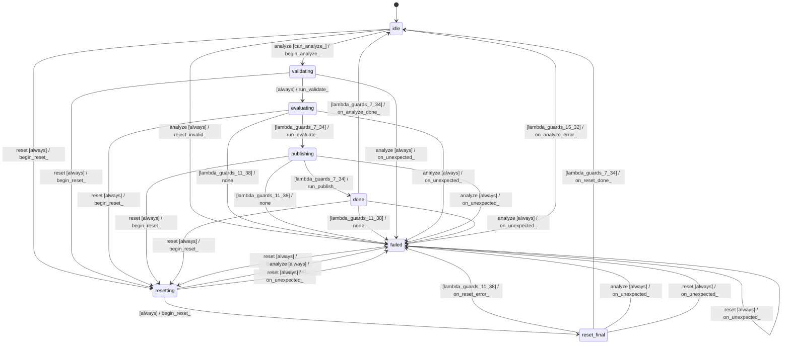

# buffer_realloc_analyzer

Source: [`emel/buffer/realloc_analyzer/sm.hpp`](https://github.com/stateforward/emel.cpp/blob/main/src/emel/buffer/realloc_analyzer/sm.hpp)

## Mermaid

## Transitions

| Source | Event | Guard | Action | Target |
| --- | --- | --- | --- | --- |
| [`idle`](https://github.com/stateforward/emel.cpp/blob/main/src/emel/buffer/realloc_analyzer/sm.hpp) | [`analyze`](https://github.com/stateforward/emel.cpp/blob/main/src/emel/buffer/realloc_analyzer/sm.hpp) | [`can_analyze>`](https://github.com/stateforward/emel.cpp/blob/main/src/emel/buffer/realloc_analyzer/sm.hpp) | [`begin_analyze>`](https://github.com/stateforward/emel.cpp/blob/main/src/emel/buffer/realloc_analyzer/sm.hpp) | [`validating`](https://github.com/stateforward/emel.cpp/blob/main/src/emel/buffer/realloc_analyzer/sm.hpp) |
| [`idle`](https://github.com/stateforward/emel.cpp/blob/main/src/emel/buffer/realloc_analyzer/sm.hpp) | [`analyze`](https://github.com/stateforward/emel.cpp/blob/main/src/emel/buffer/realloc_analyzer/sm.hpp) | [`always`](https://github.com/stateforward/emel.cpp/blob/main/src/emel/buffer/realloc_analyzer/sm.hpp) | [`reject_invalid>`](https://github.com/stateforward/emel.cpp/blob/main/src/emel/buffer/realloc_analyzer/sm.hpp) | [`failed`](https://github.com/stateforward/emel.cpp/blob/main/src/emel/buffer/realloc_analyzer/sm.hpp) |
| [`validating`](https://github.com/stateforward/emel.cpp/blob/main/src/emel/buffer/realloc_analyzer/sm.hpp) | - | [`always`](https://github.com/stateforward/emel.cpp/blob/main/src/emel/buffer/realloc_analyzer/sm.hpp) | [`run_validate>`](https://github.com/stateforward/emel.cpp/blob/main/src/emel/buffer/realloc_analyzer/sm.hpp) | [`evaluating`](https://github.com/stateforward/emel.cpp/blob/main/src/emel/buffer/realloc_analyzer/sm.hpp) |
| [`evaluating`](https://github.com/stateforward/emel.cpp/blob/main/src/emel/buffer/realloc_analyzer/sm.hpp) | - | [`lambda_guards_11_38`](https://github.com/stateforward/emel.cpp/blob/main/src/emel/buffer/realloc_analyzer/sm.hpp) | [`none`](https://github.com/stateforward/emel.cpp/blob/main/src/emel/buffer/realloc_analyzer/sm.hpp) | [`failed`](https://github.com/stateforward/emel.cpp/blob/main/src/emel/buffer/realloc_analyzer/sm.hpp) |
| [`evaluating`](https://github.com/stateforward/emel.cpp/blob/main/src/emel/buffer/realloc_analyzer/sm.hpp) | - | [`lambda_guards_7_34`](https://github.com/stateforward/emel.cpp/blob/main/src/emel/buffer/realloc_analyzer/sm.hpp) | [`run_evaluate>`](https://github.com/stateforward/emel.cpp/blob/main/src/emel/buffer/realloc_analyzer/sm.hpp) | [`publishing`](https://github.com/stateforward/emel.cpp/blob/main/src/emel/buffer/realloc_analyzer/sm.hpp) |
| [`publishing`](https://github.com/stateforward/emel.cpp/blob/main/src/emel/buffer/realloc_analyzer/sm.hpp) | - | [`lambda_guards_11_38`](https://github.com/stateforward/emel.cpp/blob/main/src/emel/buffer/realloc_analyzer/sm.hpp) | [`none`](https://github.com/stateforward/emel.cpp/blob/main/src/emel/buffer/realloc_analyzer/sm.hpp) | [`failed`](https://github.com/stateforward/emel.cpp/blob/main/src/emel/buffer/realloc_analyzer/sm.hpp) |
| [`publishing`](https://github.com/stateforward/emel.cpp/blob/main/src/emel/buffer/realloc_analyzer/sm.hpp) | - | [`lambda_guards_7_34`](https://github.com/stateforward/emel.cpp/blob/main/src/emel/buffer/realloc_analyzer/sm.hpp) | [`run_publish>`](https://github.com/stateforward/emel.cpp/blob/main/src/emel/buffer/realloc_analyzer/sm.hpp) | [`done`](https://github.com/stateforward/emel.cpp/blob/main/src/emel/buffer/realloc_analyzer/sm.hpp) |
| [`done`](https://github.com/stateforward/emel.cpp/blob/main/src/emel/buffer/realloc_analyzer/sm.hpp) | - | [`lambda_guards_11_38`](https://github.com/stateforward/emel.cpp/blob/main/src/emel/buffer/realloc_analyzer/sm.hpp) | [`none`](https://github.com/stateforward/emel.cpp/blob/main/src/emel/buffer/realloc_analyzer/sm.hpp) | [`failed`](https://github.com/stateforward/emel.cpp/blob/main/src/emel/buffer/realloc_analyzer/sm.hpp) |
| [`done`](https://github.com/stateforward/emel.cpp/blob/main/src/emel/buffer/realloc_analyzer/sm.hpp) | - | [`lambda_guards_7_34`](https://github.com/stateforward/emel.cpp/blob/main/src/emel/buffer/realloc_analyzer/sm.hpp) | [`on_analyze_done>`](https://github.com/stateforward/emel.cpp/blob/main/src/emel/buffer/realloc_analyzer/sm.hpp) | [`idle`](https://github.com/stateforward/emel.cpp/blob/main/src/emel/buffer/realloc_analyzer/sm.hpp) |
| [`failed`](https://github.com/stateforward/emel.cpp/blob/main/src/emel/buffer/realloc_analyzer/sm.hpp) | - | [`lambda_guards_15_32`](https://github.com/stateforward/emel.cpp/blob/main/src/emel/buffer/realloc_analyzer/sm.hpp) | [`on_analyze_error>`](https://github.com/stateforward/emel.cpp/blob/main/src/emel/buffer/realloc_analyzer/sm.hpp) | [`idle`](https://github.com/stateforward/emel.cpp/blob/main/src/emel/buffer/realloc_analyzer/sm.hpp) |
| [`idle`](https://github.com/stateforward/emel.cpp/blob/main/src/emel/buffer/realloc_analyzer/sm.hpp) | [`reset`](https://github.com/stateforward/emel.cpp/blob/main/src/emel/buffer/realloc_analyzer/sm.hpp) | [`always`](https://github.com/stateforward/emel.cpp/blob/main/src/emel/buffer/realloc_analyzer/sm.hpp) | [`begin_reset>`](https://github.com/stateforward/emel.cpp/blob/main/src/emel/buffer/realloc_analyzer/sm.hpp) | [`resetting`](https://github.com/stateforward/emel.cpp/blob/main/src/emel/buffer/realloc_analyzer/sm.hpp) |
| [`validating`](https://github.com/stateforward/emel.cpp/blob/main/src/emel/buffer/realloc_analyzer/sm.hpp) | [`reset`](https://github.com/stateforward/emel.cpp/blob/main/src/emel/buffer/realloc_analyzer/sm.hpp) | [`always`](https://github.com/stateforward/emel.cpp/blob/main/src/emel/buffer/realloc_analyzer/sm.hpp) | [`begin_reset>`](https://github.com/stateforward/emel.cpp/blob/main/src/emel/buffer/realloc_analyzer/sm.hpp) | [`resetting`](https://github.com/stateforward/emel.cpp/blob/main/src/emel/buffer/realloc_analyzer/sm.hpp) |
| [`evaluating`](https://github.com/stateforward/emel.cpp/blob/main/src/emel/buffer/realloc_analyzer/sm.hpp) | [`reset`](https://github.com/stateforward/emel.cpp/blob/main/src/emel/buffer/realloc_analyzer/sm.hpp) | [`always`](https://github.com/stateforward/emel.cpp/blob/main/src/emel/buffer/realloc_analyzer/sm.hpp) | [`begin_reset>`](https://github.com/stateforward/emel.cpp/blob/main/src/emel/buffer/realloc_analyzer/sm.hpp) | [`resetting`](https://github.com/stateforward/emel.cpp/blob/main/src/emel/buffer/realloc_analyzer/sm.hpp) |
| [`publishing`](https://github.com/stateforward/emel.cpp/blob/main/src/emel/buffer/realloc_analyzer/sm.hpp) | [`reset`](https://github.com/stateforward/emel.cpp/blob/main/src/emel/buffer/realloc_analyzer/sm.hpp) | [`always`](https://github.com/stateforward/emel.cpp/blob/main/src/emel/buffer/realloc_analyzer/sm.hpp) | [`begin_reset>`](https://github.com/stateforward/emel.cpp/blob/main/src/emel/buffer/realloc_analyzer/sm.hpp) | [`resetting`](https://github.com/stateforward/emel.cpp/blob/main/src/emel/buffer/realloc_analyzer/sm.hpp) |
| [`done`](https://github.com/stateforward/emel.cpp/blob/main/src/emel/buffer/realloc_analyzer/sm.hpp) | [`reset`](https://github.com/stateforward/emel.cpp/blob/main/src/emel/buffer/realloc_analyzer/sm.hpp) | [`always`](https://github.com/stateforward/emel.cpp/blob/main/src/emel/buffer/realloc_analyzer/sm.hpp) | [`begin_reset>`](https://github.com/stateforward/emel.cpp/blob/main/src/emel/buffer/realloc_analyzer/sm.hpp) | [`resetting`](https://github.com/stateforward/emel.cpp/blob/main/src/emel/buffer/realloc_analyzer/sm.hpp) |
| [`failed`](https://github.com/stateforward/emel.cpp/blob/main/src/emel/buffer/realloc_analyzer/sm.hpp) | [`reset`](https://github.com/stateforward/emel.cpp/blob/main/src/emel/buffer/realloc_analyzer/sm.hpp) | [`always`](https://github.com/stateforward/emel.cpp/blob/main/src/emel/buffer/realloc_analyzer/sm.hpp) | [`begin_reset>`](https://github.com/stateforward/emel.cpp/blob/main/src/emel/buffer/realloc_analyzer/sm.hpp) | [`resetting`](https://github.com/stateforward/emel.cpp/blob/main/src/emel/buffer/realloc_analyzer/sm.hpp) |
| [`resetting`](https://github.com/stateforward/emel.cpp/blob/main/src/emel/buffer/realloc_analyzer/sm.hpp) | - | [`always`](https://github.com/stateforward/emel.cpp/blob/main/src/emel/buffer/realloc_analyzer/sm.hpp) | [`begin_reset>`](https://github.com/stateforward/emel.cpp/blob/main/src/emel/buffer/realloc_analyzer/sm.hpp) | [`reset_final`](https://github.com/stateforward/emel.cpp/blob/main/src/emel/buffer/realloc_analyzer/sm.hpp) |
| [`reset_final`](https://github.com/stateforward/emel.cpp/blob/main/src/emel/buffer/realloc_analyzer/sm.hpp) | - | [`lambda_guards_11_38`](https://github.com/stateforward/emel.cpp/blob/main/src/emel/buffer/realloc_analyzer/sm.hpp) | [`on_reset_error>`](https://github.com/stateforward/emel.cpp/blob/main/src/emel/buffer/realloc_analyzer/sm.hpp) | [`failed`](https://github.com/stateforward/emel.cpp/blob/main/src/emel/buffer/realloc_analyzer/sm.hpp) |
| [`reset_final`](https://github.com/stateforward/emel.cpp/blob/main/src/emel/buffer/realloc_analyzer/sm.hpp) | - | [`lambda_guards_7_34`](https://github.com/stateforward/emel.cpp/blob/main/src/emel/buffer/realloc_analyzer/sm.hpp) | [`on_reset_done>`](https://github.com/stateforward/emel.cpp/blob/main/src/emel/buffer/realloc_analyzer/sm.hpp) | [`idle`](https://github.com/stateforward/emel.cpp/blob/main/src/emel/buffer/realloc_analyzer/sm.hpp) |
| [`validating`](https://github.com/stateforward/emel.cpp/blob/main/src/emel/buffer/realloc_analyzer/sm.hpp) | [`analyze`](https://github.com/stateforward/emel.cpp/blob/main/src/emel/buffer/realloc_analyzer/sm.hpp) | [`always`](https://github.com/stateforward/emel.cpp/blob/main/src/emel/buffer/realloc_analyzer/sm.hpp) | [`on_unexpected>`](https://github.com/stateforward/emel.cpp/blob/main/src/emel/buffer/realloc_analyzer/sm.hpp) | [`failed`](https://github.com/stateforward/emel.cpp/blob/main/src/emel/buffer/realloc_analyzer/sm.hpp) |
| [`evaluating`](https://github.com/stateforward/emel.cpp/blob/main/src/emel/buffer/realloc_analyzer/sm.hpp) | [`analyze`](https://github.com/stateforward/emel.cpp/blob/main/src/emel/buffer/realloc_analyzer/sm.hpp) | [`always`](https://github.com/stateforward/emel.cpp/blob/main/src/emel/buffer/realloc_analyzer/sm.hpp) | [`on_unexpected>`](https://github.com/stateforward/emel.cpp/blob/main/src/emel/buffer/realloc_analyzer/sm.hpp) | [`failed`](https://github.com/stateforward/emel.cpp/blob/main/src/emel/buffer/realloc_analyzer/sm.hpp) |
| [`publishing`](https://github.com/stateforward/emel.cpp/blob/main/src/emel/buffer/realloc_analyzer/sm.hpp) | [`analyze`](https://github.com/stateforward/emel.cpp/blob/main/src/emel/buffer/realloc_analyzer/sm.hpp) | [`always`](https://github.com/stateforward/emel.cpp/blob/main/src/emel/buffer/realloc_analyzer/sm.hpp) | [`on_unexpected>`](https://github.com/stateforward/emel.cpp/blob/main/src/emel/buffer/realloc_analyzer/sm.hpp) | [`failed`](https://github.com/stateforward/emel.cpp/blob/main/src/emel/buffer/realloc_analyzer/sm.hpp) |
| [`done`](https://github.com/stateforward/emel.cpp/blob/main/src/emel/buffer/realloc_analyzer/sm.hpp) | [`analyze`](https://github.com/stateforward/emel.cpp/blob/main/src/emel/buffer/realloc_analyzer/sm.hpp) | [`always`](https://github.com/stateforward/emel.cpp/blob/main/src/emel/buffer/realloc_analyzer/sm.hpp) | [`on_unexpected>`](https://github.com/stateforward/emel.cpp/blob/main/src/emel/buffer/realloc_analyzer/sm.hpp) | [`failed`](https://github.com/stateforward/emel.cpp/blob/main/src/emel/buffer/realloc_analyzer/sm.hpp) |
| [`resetting`](https://github.com/stateforward/emel.cpp/blob/main/src/emel/buffer/realloc_analyzer/sm.hpp) | [`analyze`](https://github.com/stateforward/emel.cpp/blob/main/src/emel/buffer/realloc_analyzer/sm.hpp) | [`always`](https://github.com/stateforward/emel.cpp/blob/main/src/emel/buffer/realloc_analyzer/sm.hpp) | [`on_unexpected>`](https://github.com/stateforward/emel.cpp/blob/main/src/emel/buffer/realloc_analyzer/sm.hpp) | [`failed`](https://github.com/stateforward/emel.cpp/blob/main/src/emel/buffer/realloc_analyzer/sm.hpp) |
| [`reset_final`](https://github.com/stateforward/emel.cpp/blob/main/src/emel/buffer/realloc_analyzer/sm.hpp) | [`analyze`](https://github.com/stateforward/emel.cpp/blob/main/src/emel/buffer/realloc_analyzer/sm.hpp) | [`always`](https://github.com/stateforward/emel.cpp/blob/main/src/emel/buffer/realloc_analyzer/sm.hpp) | [`on_unexpected>`](https://github.com/stateforward/emel.cpp/blob/main/src/emel/buffer/realloc_analyzer/sm.hpp) | [`failed`](https://github.com/stateforward/emel.cpp/blob/main/src/emel/buffer/realloc_analyzer/sm.hpp) |
| [`failed`](https://github.com/stateforward/emel.cpp/blob/main/src/emel/buffer/realloc_analyzer/sm.hpp) | [`analyze`](https://github.com/stateforward/emel.cpp/blob/main/src/emel/buffer/realloc_analyzer/sm.hpp) | [`always`](https://github.com/stateforward/emel.cpp/blob/main/src/emel/buffer/realloc_analyzer/sm.hpp) | [`on_unexpected>`](https://github.com/stateforward/emel.cpp/blob/main/src/emel/buffer/realloc_analyzer/sm.hpp) | [`failed`](https://github.com/stateforward/emel.cpp/blob/main/src/emel/buffer/realloc_analyzer/sm.hpp) |
| [`resetting`](https://github.com/stateforward/emel.cpp/blob/main/src/emel/buffer/realloc_analyzer/sm.hpp) | [`reset`](https://github.com/stateforward/emel.cpp/blob/main/src/emel/buffer/realloc_analyzer/sm.hpp) | [`always`](https://github.com/stateforward/emel.cpp/blob/main/src/emel/buffer/realloc_analyzer/sm.hpp) | [`on_unexpected>`](https://github.com/stateforward/emel.cpp/blob/main/src/emel/buffer/realloc_analyzer/sm.hpp) | [`failed`](https://github.com/stateforward/emel.cpp/blob/main/src/emel/buffer/realloc_analyzer/sm.hpp) |
| [`reset_final`](https://github.com/stateforward/emel.cpp/blob/main/src/emel/buffer/realloc_analyzer/sm.hpp) | [`reset`](https://github.com/stateforward/emel.cpp/blob/main/src/emel/buffer/realloc_analyzer/sm.hpp) | [`always`](https://github.com/stateforward/emel.cpp/blob/main/src/emel/buffer/realloc_analyzer/sm.hpp) | [`on_unexpected>`](https://github.com/stateforward/emel.cpp/blob/main/src/emel/buffer/realloc_analyzer/sm.hpp) | [`failed`](https://github.com/stateforward/emel.cpp/blob/main/src/emel/buffer/realloc_analyzer/sm.hpp) |
| [`failed`](https://github.com/stateforward/emel.cpp/blob/main/src/emel/buffer/realloc_analyzer/sm.hpp) | [`reset`](https://github.com/stateforward/emel.cpp/blob/main/src/emel/buffer/realloc_analyzer/sm.hpp) | [`always`](https://github.com/stateforward/emel.cpp/blob/main/src/emel/buffer/realloc_analyzer/sm.hpp) | [`on_unexpected>`](https://github.com/stateforward/emel.cpp/blob/main/src/emel/buffer/realloc_analyzer/sm.hpp) | [`failed`](https://github.com/stateforward/emel.cpp/blob/main/src/emel/buffer/realloc_analyzer/sm.hpp) |
