# decoder

Source: [`emel/decoder/sm.hpp`](https://github.com/stateforward/emel.cpp/blob/main/src/emel/decoder/sm.hpp)

## Mermaid

```mermaid
stateDiagram-v2
  direction TB
  [*] --> emel__decoder__initialized
  emel__decoder__initialized --> emel__decoder__validating_request : emel__decoder__event__decode [boost__sml__front__always] / boost__sml__aux__zero_wrapper_emel__decoder__action__begin_decode_
  emel__decoder__validating_request --> emel__decoder__errored : [boost__sml__aux__zero_wrapper_emel__decoder__guard___lambda_at__Users_gabrielwillen_VSCode_stateforward_emel_emel_cpp_tools_docsgen_______src_emel_decoder_guards_hpp_63_46__] / boost__sml__aux__zero_wrapper_emel__decoder__action__reject_invalid_validate_
  emel__decoder__validating_request --> emel__decoder__validate_decision : [boost__sml__aux__zero_wrapper_emel__decoder__guard___lambda_at__Users_gabrielwillen_VSCode_stateforward_emel_emel_cpp_tools_docsgen_______src_emel_decoder_guards_hpp_26_44__] / boost__sml__aux__zero_wrapper_emel__decoder__action__run_validate_
  emel__decoder__validate_decision --> emel__decoder__errored : [boost__sml__aux__zero_wrapper_emel__decoder__guard___lambda_at__Users_gabrielwillen_VSCode_stateforward_emel_emel_cpp_tools_docsgen_______src_emel_decoder_guards_hpp_103_38__] / boost__sml__front__none
  emel__decoder__validate_decision --> emel__decoder__sanitizing_batch : [boost__sml__aux__zero_wrapper_emel__decoder__guard___lambda_at__Users_gabrielwillen_VSCode_stateforward_emel_emel_cpp_tools_docsgen_______src_emel_decoder_guards_hpp_99_34__] / boost__sml__front__none
  emel__decoder__sanitizing_batch --> emel__decoder__sanitize_decision : [boost__sml__front__always] / boost__sml__aux__zero_wrapper_emel__decoder__action__run_sanitize_batch_
  emel__decoder__sanitize_decision --> emel__decoder__errored : [boost__sml__aux__zero_wrapper_emel__decoder__guard___lambda_at__Users_gabrielwillen_VSCode_stateforward_emel_emel_cpp_tools_docsgen_______src_emel_decoder_guards_hpp_103_38__] / boost__sml__front__none
  emel__decoder__sanitize_decision --> emel__decoder__initializing_batch : [boost__sml__aux__zero_wrapper_emel__decoder__guard___lambda_at__Users_gabrielwillen_VSCode_stateforward_emel_emel_cpp_tools_docsgen_______src_emel_decoder_guards_hpp_99_34__] / boost__sml__front__none
  emel__decoder__initializing_batch --> emel__decoder__initialize_batch_decision : [boost__sml__front__always] / boost__sml__aux__zero_wrapper_emel__decoder__action__run_initialize_batch_
  emel__decoder__initialize_batch_decision --> emel__decoder__errored : [boost__sml__aux__zero_wrapper_emel__decoder__guard___lambda_at__Users_gabrielwillen_VSCode_stateforward_emel_emel_cpp_tools_docsgen_______src_emel_decoder_guards_hpp_103_38__] / boost__sml__front__none
  emel__decoder__initialize_batch_decision --> emel__decoder__updating_memory_pre : [boost__sml__aux__zero_wrapper_emel__decoder__guard___lambda_at__Users_gabrielwillen_VSCode_stateforward_emel_emel_cpp_tools_docsgen_______src_emel_decoder_guards_hpp_99_34__] / boost__sml__front__none
  emel__decoder__updating_memory_pre --> emel__decoder__update_memory_decision : [boost__sml__front__always] / boost__sml__aux__zero_wrapper_emel__decoder__action__run_update_memory_
  emel__decoder__update_memory_decision --> emel__decoder__errored : [boost__sml__aux__zero_wrapper_emel__decoder__guard___lambda_at__Users_gabrielwillen_VSCode_stateforward_emel_emel_cpp_tools_docsgen_______src_emel_decoder_guards_hpp_103_38__] / boost__sml__front__none
  emel__decoder__update_memory_decision --> emel__decoder__preparing_memory_batch_initial : [boost__sml__aux__zero_wrapper_emel__decoder__guard___lambda_at__Users_gabrielwillen_VSCode_stateforward_emel_emel_cpp_tools_docsgen_______src_emel_decoder_guards_hpp_99_34__] / boost__sml__front__none
  emel__decoder__preparing_memory_batch_initial --> emel__decoder__prepare_memory_batch_initial_decision : [boost__sml__front__always] / boost__sml__aux__zero_wrapper_emel__decoder__action__run_prepare_memory_batch_
  emel__decoder__prepare_memory_batch_initial_decision --> emel__decoder__optimizing_memory : [boost__sml__aux__zero_wrapper_emel__decoder__guard___lambda_at__Users_gabrielwillen_VSCode_stateforward_emel_emel_cpp_tools_docsgen_______src_emel_decoder_guards_hpp_115_48__] / boost__sml__front__none
  emel__decoder__prepare_memory_batch_initial_decision --> emel__decoder__errored : [boost__sml__aux__zero_wrapper_emel__decoder__guard___lambda_at__Users_gabrielwillen_VSCode_stateforward_emel_emel_cpp_tools_docsgen_______src_emel_decoder_guards_hpp_119_48__] / boost__sml__front__none
  emel__decoder__prepare_memory_batch_initial_decision --> emel__decoder__reserving_output : [boost__sml__aux__zero_wrapper_emel__decoder__guard___lambda_at__Users_gabrielwillen_VSCode_stateforward_emel_emel_cpp_tools_docsgen_______src_emel_decoder_guards_hpp_99_34__] / boost__sml__front__none
  emel__decoder__optimizing_memory --> emel__decoder__optimize_memory_decision : [boost__sml__front__always] / boost__sml__aux__zero_wrapper_emel__decoder__action__run_optimize_memory_
  emel__decoder__optimize_memory_decision --> emel__decoder__errored : [boost__sml__aux__zero_wrapper_emel__decoder__guard___lambda_at__Users_gabrielwillen_VSCode_stateforward_emel_emel_cpp_tools_docsgen_______src_emel_decoder_guards_hpp_103_38__] / boost__sml__front__none
  emel__decoder__optimize_memory_decision --> emel__decoder__preparing_memory_batch_retry : [boost__sml__aux__zero_wrapper_emel__decoder__guard___lambda_at__Users_gabrielwillen_VSCode_stateforward_emel_emel_cpp_tools_docsgen_______src_emel_decoder_guards_hpp_99_34__] / boost__sml__front__none
  emel__decoder__preparing_memory_batch_retry --> emel__decoder__prepare_memory_batch_retry_decision : [boost__sml__front__always] / boost__sml__aux__zero_wrapper_emel__decoder__action__run_prepare_memory_batch_
  emel__decoder__prepare_memory_batch_retry_decision --> emel__decoder__errored : [boost__sml__aux__zero_wrapper_emel__decoder__guard___lambda_at__Users_gabrielwillen_VSCode_stateforward_emel_emel_cpp_tools_docsgen_______src_emel_decoder_guards_hpp_103_38__] / boost__sml__front__none
  emel__decoder__prepare_memory_batch_retry_decision --> emel__decoder__reserving_output : [boost__sml__aux__zero_wrapper_emel__decoder__guard___lambda_at__Users_gabrielwillen_VSCode_stateforward_emel_emel_cpp_tools_docsgen_______src_emel_decoder_guards_hpp_99_34__] / boost__sml__front__none
  emel__decoder__reserving_output --> emel__decoder__errored : [boost__sml__aux__zero_wrapper_emel__decoder__guard___lambda_at__Users_gabrielwillen_VSCode_stateforward_emel_emel_cpp_tools_docsgen_______src_emel_decoder_guards_hpp_71_47__] / boost__sml__aux__zero_wrapper_emel__decoder__action__reject_invalid_reserve_output_
  emel__decoder__reserving_output --> emel__decoder__reserve_decision : [boost__sml__aux__zero_wrapper_emel__decoder__guard___lambda_at__Users_gabrielwillen_VSCode_stateforward_emel_emel_cpp_tools_docsgen_______src_emel_decoder_guards_hpp_67_45__] / boost__sml__aux__zero_wrapper_emel__decoder__action__run_reserve_output_
  emel__decoder__reserve_decision --> emel__decoder__errored : [boost__sml__aux__zero_wrapper_emel__decoder__guard___lambda_at__Users_gabrielwillen_VSCode_stateforward_emel_emel_cpp_tools_docsgen_______src_emel_decoder_guards_hpp_103_38__] / boost__sml__front__none
  emel__decoder__reserve_decision --> emel__decoder__processing_ubatch : [boost__sml__aux__zero_wrapper_emel__decoder__guard___lambda_at__Users_gabrielwillen_VSCode_stateforward_emel_emel_cpp_tools_docsgen_______src_emel_decoder_guards_hpp_99_34__] / boost__sml__front__none
  emel__decoder__processing_ubatch --> emel__decoder__finalizing_outputs : [boost__sml__aux__zero_wrapper_emel__decoder__guard___lambda_at__Users_gabrielwillen_VSCode_stateforward_emel_emel_cpp_tools_docsgen_______src_emel_decoder_guards_hpp_11_42__] / boost__sml__front__none
  emel__decoder__processing_ubatch --> emel__decoder__ubatch_decision : [boost__sml__aux__zero_wrapper_emel__decoder__guard___lambda_at__Users_gabrielwillen_VSCode_stateforward_emel_emel_cpp_tools_docsgen_______src_emel_decoder_guards_hpp_87_47__] / boost__sml__aux__zero_wrapper_emel__decoder__action__on_invalid_ubatch_size_
  emel__decoder__processing_ubatch --> emel__decoder__ubatch_decision : [boost__sml__aux__zero_wrapper_emel__decoder__guard___lambda_at__Users_gabrielwillen_VSCode_stateforward_emel_emel_cpp_tools_docsgen_______src_emel_decoder_guards_hpp_83_44__] / boost__sml__aux__zero_wrapper_emel__decoder__action__run_process_ubatch_
  emel__decoder__ubatch_decision --> emel__decoder__handling_ubatch_failure : [boost__sml__aux__zero_wrapper_emel__decoder__guard___lambda_at__Users_gabrielwillen_VSCode_stateforward_emel_emel_cpp_tools_docsgen_______src_emel_decoder_guards_hpp_103_38__] / boost__sml__front__none
  emel__decoder__ubatch_decision --> emel__decoder__processing_ubatch : [boost__sml__aux__zero_wrapper_emel__decoder__guard___lambda_at__Users_gabrielwillen_VSCode_stateforward_emel_emel_cpp_tools_docsgen_______src_emel_decoder_guards_hpp_99_34__] / boost__sml__front__none
  emel__decoder__handling_ubatch_failure --> emel__decoder__rollback_decision : [boost__sml__front__always] / boost__sml__aux__zero_wrapper_emel__decoder__action__run_rollback_ubatch_
  emel__decoder__rollback_decision --> emel__decoder__errored : [boost__sml__aux__zero_wrapper_emel__decoder__guard___lambda_at__Users_gabrielwillen_VSCode_stateforward_emel_emel_cpp_tools_docsgen_______src_emel_decoder_guards_hpp_103_38__] / boost__sml__aux__zero_wrapper_emel__decoder__action__capture_rollback_error_
  emel__decoder__rollback_decision --> emel__decoder__errored : [boost__sml__aux__zero_wrapper_emel__decoder__guard___lambda_at__Users_gabrielwillen_VSCode_stateforward_emel_emel_cpp_tools_docsgen_______src_emel_decoder_guards_hpp_99_34__] / boost__sml__aux__zero_wrapper_emel__decoder__action__capture_ubatch_error_
  emel__decoder__finalizing_outputs --> emel__decoder__finalize_decision : [boost__sml__front__always] / boost__sml__aux__zero_wrapper_emel__decoder__action__run_finalize_outputs_
  emel__decoder__finalize_decision --> emel__decoder__errored : [boost__sml__aux__zero_wrapper_emel__decoder__guard___lambda_at__Users_gabrielwillen_VSCode_stateforward_emel_emel_cpp_tools_docsgen_______src_emel_decoder_guards_hpp_103_38__] / boost__sml__front__none
  emel__decoder__finalize_decision --> emel__decoder__done : [boost__sml__aux__zero_wrapper_emel__decoder__guard___lambda_at__Users_gabrielwillen_VSCode_stateforward_emel_emel_cpp_tools_docsgen_______src_emel_decoder_guards_hpp_99_34__] / boost__sml__front__none
  emel__decoder__done --> emel__decoder__initialized : [boost__sml__front__always] / boost__sml__aux__zero_wrapper_emel__decoder__action__mark_done_
  emel__decoder__errored --> emel__decoder__initialized : [boost__sml__front__always] / boost__sml__aux__zero_wrapper_emel__decoder__action__ensure_last_error_
  emel__decoder__validating_request --> emel__decoder__errored : emel__decoder__event__decode [boost__sml__front__always] / boost__sml__aux__zero_wrapper_emel__decoder__action__on_unexpected_
  emel__decoder__validate_decision --> emel__decoder__errored : emel__decoder__event__decode [boost__sml__front__always] / boost__sml__aux__zero_wrapper_emel__decoder__action__on_unexpected_
  emel__decoder__sanitizing_batch --> emel__decoder__errored : emel__decoder__event__decode [boost__sml__front__always] / boost__sml__aux__zero_wrapper_emel__decoder__action__on_unexpected_
  emel__decoder__sanitize_decision --> emel__decoder__errored : emel__decoder__event__decode [boost__sml__front__always] / boost__sml__aux__zero_wrapper_emel__decoder__action__on_unexpected_
  emel__decoder__initializing_batch --> emel__decoder__errored : emel__decoder__event__decode [boost__sml__front__always] / boost__sml__aux__zero_wrapper_emel__decoder__action__on_unexpected_
  emel__decoder__initialize_batch_decision --> emel__decoder__errored : emel__decoder__event__decode [boost__sml__front__always] / boost__sml__aux__zero_wrapper_emel__decoder__action__on_unexpected_
  emel__decoder__updating_memory_pre --> emel__decoder__errored : emel__decoder__event__decode [boost__sml__front__always] / boost__sml__aux__zero_wrapper_emel__decoder__action__on_unexpected_
  emel__decoder__update_memory_decision --> emel__decoder__errored : emel__decoder__event__decode [boost__sml__front__always] / boost__sml__aux__zero_wrapper_emel__decoder__action__on_unexpected_
  emel__decoder__preparing_memory_batch_initial --> emel__decoder__errored : emel__decoder__event__decode [boost__sml__front__always] / boost__sml__aux__zero_wrapper_emel__decoder__action__on_unexpected_
  emel__decoder__prepare_memory_batch_initial_decision --> emel__decoder__errored : emel__decoder__event__decode [boost__sml__front__always] / boost__sml__aux__zero_wrapper_emel__decoder__action__on_unexpected_
  emel__decoder__optimizing_memory --> emel__decoder__errored : emel__decoder__event__decode [boost__sml__front__always] / boost__sml__aux__zero_wrapper_emel__decoder__action__on_unexpected_
  emel__decoder__optimize_memory_decision --> emel__decoder__errored : emel__decoder__event__decode [boost__sml__front__always] / boost__sml__aux__zero_wrapper_emel__decoder__action__on_unexpected_
  emel__decoder__preparing_memory_batch_retry --> emel__decoder__errored : emel__decoder__event__decode [boost__sml__front__always] / boost__sml__aux__zero_wrapper_emel__decoder__action__on_unexpected_
  emel__decoder__prepare_memory_batch_retry_decision --> emel__decoder__errored : emel__decoder__event__decode [boost__sml__front__always] / boost__sml__aux__zero_wrapper_emel__decoder__action__on_unexpected_
  emel__decoder__reserving_output --> emel__decoder__errored : emel__decoder__event__decode [boost__sml__front__always] / boost__sml__aux__zero_wrapper_emel__decoder__action__on_unexpected_
  emel__decoder__reserve_decision --> emel__decoder__errored : emel__decoder__event__decode [boost__sml__front__always] / boost__sml__aux__zero_wrapper_emel__decoder__action__on_unexpected_
  emel__decoder__processing_ubatch --> emel__decoder__errored : emel__decoder__event__decode [boost__sml__front__always] / boost__sml__aux__zero_wrapper_emel__decoder__action__on_unexpected_
  emel__decoder__ubatch_decision --> emel__decoder__errored : emel__decoder__event__decode [boost__sml__front__always] / boost__sml__aux__zero_wrapper_emel__decoder__action__on_unexpected_
  emel__decoder__handling_ubatch_failure --> emel__decoder__errored : emel__decoder__event__decode [boost__sml__front__always] / boost__sml__aux__zero_wrapper_emel__decoder__action__on_unexpected_
  emel__decoder__rollback_decision --> emel__decoder__errored : emel__decoder__event__decode [boost__sml__front__always] / boost__sml__aux__zero_wrapper_emel__decoder__action__on_unexpected_
  emel__decoder__finalizing_outputs --> emel__decoder__errored : emel__decoder__event__decode [boost__sml__front__always] / boost__sml__aux__zero_wrapper_emel__decoder__action__on_unexpected_
  emel__decoder__finalize_decision --> emel__decoder__errored : emel__decoder__event__decode [boost__sml__front__always] / boost__sml__aux__zero_wrapper_emel__decoder__action__on_unexpected_
  emel__decoder__done --> emel__decoder__errored : emel__decoder__event__decode [boost__sml__front__always] / boost__sml__aux__zero_wrapper_emel__decoder__action__on_unexpected_
  emel__decoder__errored --> emel__decoder__errored : emel__decoder__event__decode [boost__sml__front__always] / boost__sml__aux__zero_wrapper_emel__decoder__action__on_unexpected_
```

## Transitions

| Source | Event | Guard | Action | Target |
| --- | --- | --- | --- | --- |
| [`initialized`](https://github.com/stateforward/emel.cpp/blob/main/src/emel/decoder/sm.hpp) | [`decode`](https://github.com/stateforward/emel.cpp/blob/main/src/emel/decoder/sm.hpp) | [`always`](https://github.com/stateforward/emel.cpp/blob/main/src/emel/decoder/sm.hpp) | [`begin_decode>`](https://github.com/stateforward/emel.cpp/blob/main/src/emel/decoder/sm.hpp) | [`validating_request`](https://github.com/stateforward/emel.cpp/blob/main/src/emel/decoder/sm.hpp) |
| [`validating_request`](https://github.com/stateforward/emel.cpp/blob/main/src/emel/decoder/sm.hpp) | - | [`(lambda at /Users/gabrielwillen/VSCode/stateforward/emel/emel.cpp/tools/docsgen/../../src/emel/decoder/guards.hpp:63:46)>`](https://github.com/stateforward/emel.cpp/blob/main/src/emel/decoder/sm.hpp) | [`reject_invalid_validate>`](https://github.com/stateforward/emel.cpp/blob/main/src/emel/decoder/sm.hpp) | [`errored`](https://github.com/stateforward/emel.cpp/blob/main/src/emel/decoder/sm.hpp) |
| [`validating_request`](https://github.com/stateforward/emel.cpp/blob/main/src/emel/decoder/sm.hpp) | - | [`(lambda at /Users/gabrielwillen/VSCode/stateforward/emel/emel.cpp/tools/docsgen/../../src/emel/decoder/guards.hpp:26:44)>`](https://github.com/stateforward/emel.cpp/blob/main/src/emel/decoder/sm.hpp) | [`run_validate>`](https://github.com/stateforward/emel.cpp/blob/main/src/emel/decoder/sm.hpp) | [`validate_decision`](https://github.com/stateforward/emel.cpp/blob/main/src/emel/decoder/sm.hpp) |
| [`validate_decision`](https://github.com/stateforward/emel.cpp/blob/main/src/emel/decoder/sm.hpp) | - | [`(lambda at /Users/gabrielwillen/VSCode/stateforward/emel/emel.cpp/tools/docsgen/../../src/emel/decoder/guards.hpp:103:38)>`](https://github.com/stateforward/emel.cpp/blob/main/src/emel/decoder/sm.hpp) | [`none`](https://github.com/stateforward/emel.cpp/blob/main/src/emel/decoder/sm.hpp) | [`errored`](https://github.com/stateforward/emel.cpp/blob/main/src/emel/decoder/sm.hpp) |
| [`validate_decision`](https://github.com/stateforward/emel.cpp/blob/main/src/emel/decoder/sm.hpp) | - | [`(lambda at /Users/gabrielwillen/VSCode/stateforward/emel/emel.cpp/tools/docsgen/../../src/emel/decoder/guards.hpp:99:34)>`](https://github.com/stateforward/emel.cpp/blob/main/src/emel/decoder/sm.hpp) | [`none`](https://github.com/stateforward/emel.cpp/blob/main/src/emel/decoder/sm.hpp) | [`sanitizing_batch`](https://github.com/stateforward/emel.cpp/blob/main/src/emel/decoder/sm.hpp) |
| [`sanitizing_batch`](https://github.com/stateforward/emel.cpp/blob/main/src/emel/decoder/sm.hpp) | - | [`always`](https://github.com/stateforward/emel.cpp/blob/main/src/emel/decoder/sm.hpp) | [`run_sanitize_batch>`](https://github.com/stateforward/emel.cpp/blob/main/src/emel/decoder/sm.hpp) | [`sanitize_decision`](https://github.com/stateforward/emel.cpp/blob/main/src/emel/decoder/sm.hpp) |
| [`sanitize_decision`](https://github.com/stateforward/emel.cpp/blob/main/src/emel/decoder/sm.hpp) | - | [`(lambda at /Users/gabrielwillen/VSCode/stateforward/emel/emel.cpp/tools/docsgen/../../src/emel/decoder/guards.hpp:103:38)>`](https://github.com/stateforward/emel.cpp/blob/main/src/emel/decoder/sm.hpp) | [`none`](https://github.com/stateforward/emel.cpp/blob/main/src/emel/decoder/sm.hpp) | [`errored`](https://github.com/stateforward/emel.cpp/blob/main/src/emel/decoder/sm.hpp) |
| [`sanitize_decision`](https://github.com/stateforward/emel.cpp/blob/main/src/emel/decoder/sm.hpp) | - | [`(lambda at /Users/gabrielwillen/VSCode/stateforward/emel/emel.cpp/tools/docsgen/../../src/emel/decoder/guards.hpp:99:34)>`](https://github.com/stateforward/emel.cpp/blob/main/src/emel/decoder/sm.hpp) | [`none`](https://github.com/stateforward/emel.cpp/blob/main/src/emel/decoder/sm.hpp) | [`initializing_batch`](https://github.com/stateforward/emel.cpp/blob/main/src/emel/decoder/sm.hpp) |
| [`initializing_batch`](https://github.com/stateforward/emel.cpp/blob/main/src/emel/decoder/sm.hpp) | - | [`always`](https://github.com/stateforward/emel.cpp/blob/main/src/emel/decoder/sm.hpp) | [`run_initialize_batch>`](https://github.com/stateforward/emel.cpp/blob/main/src/emel/decoder/sm.hpp) | [`initialize_batch_decision`](https://github.com/stateforward/emel.cpp/blob/main/src/emel/decoder/sm.hpp) |
| [`initialize_batch_decision`](https://github.com/stateforward/emel.cpp/blob/main/src/emel/decoder/sm.hpp) | - | [`(lambda at /Users/gabrielwillen/VSCode/stateforward/emel/emel.cpp/tools/docsgen/../../src/emel/decoder/guards.hpp:103:38)>`](https://github.com/stateforward/emel.cpp/blob/main/src/emel/decoder/sm.hpp) | [`none`](https://github.com/stateforward/emel.cpp/blob/main/src/emel/decoder/sm.hpp) | [`errored`](https://github.com/stateforward/emel.cpp/blob/main/src/emel/decoder/sm.hpp) |
| [`initialize_batch_decision`](https://github.com/stateforward/emel.cpp/blob/main/src/emel/decoder/sm.hpp) | - | [`(lambda at /Users/gabrielwillen/VSCode/stateforward/emel/emel.cpp/tools/docsgen/../../src/emel/decoder/guards.hpp:99:34)>`](https://github.com/stateforward/emel.cpp/blob/main/src/emel/decoder/sm.hpp) | [`none`](https://github.com/stateforward/emel.cpp/blob/main/src/emel/decoder/sm.hpp) | [`updating_memory_pre`](https://github.com/stateforward/emel.cpp/blob/main/src/emel/decoder/sm.hpp) |
| [`updating_memory_pre`](https://github.com/stateforward/emel.cpp/blob/main/src/emel/decoder/sm.hpp) | - | [`always`](https://github.com/stateforward/emel.cpp/blob/main/src/emel/decoder/sm.hpp) | [`run_update_memory>`](https://github.com/stateforward/emel.cpp/blob/main/src/emel/decoder/sm.hpp) | [`update_memory_decision`](https://github.com/stateforward/emel.cpp/blob/main/src/emel/decoder/sm.hpp) |
| [`update_memory_decision`](https://github.com/stateforward/emel.cpp/blob/main/src/emel/decoder/sm.hpp) | - | [`(lambda at /Users/gabrielwillen/VSCode/stateforward/emel/emel.cpp/tools/docsgen/../../src/emel/decoder/guards.hpp:103:38)>`](https://github.com/stateforward/emel.cpp/blob/main/src/emel/decoder/sm.hpp) | [`none`](https://github.com/stateforward/emel.cpp/blob/main/src/emel/decoder/sm.hpp) | [`errored`](https://github.com/stateforward/emel.cpp/blob/main/src/emel/decoder/sm.hpp) |
| [`update_memory_decision`](https://github.com/stateforward/emel.cpp/blob/main/src/emel/decoder/sm.hpp) | - | [`(lambda at /Users/gabrielwillen/VSCode/stateforward/emel/emel.cpp/tools/docsgen/../../src/emel/decoder/guards.hpp:99:34)>`](https://github.com/stateforward/emel.cpp/blob/main/src/emel/decoder/sm.hpp) | [`none`](https://github.com/stateforward/emel.cpp/blob/main/src/emel/decoder/sm.hpp) | [`preparing_memory_batch_initial`](https://github.com/stateforward/emel.cpp/blob/main/src/emel/decoder/sm.hpp) |
| [`preparing_memory_batch_initial`](https://github.com/stateforward/emel.cpp/blob/main/src/emel/decoder/sm.hpp) | - | [`always`](https://github.com/stateforward/emel.cpp/blob/main/src/emel/decoder/sm.hpp) | [`run_prepare_memory_batch>`](https://github.com/stateforward/emel.cpp/blob/main/src/emel/decoder/sm.hpp) | [`prepare_memory_batch_initial_decision`](https://github.com/stateforward/emel.cpp/blob/main/src/emel/decoder/sm.hpp) |
| [`prepare_memory_batch_initial_decision`](https://github.com/stateforward/emel.cpp/blob/main/src/emel/decoder/sm.hpp) | - | [`(lambda at /Users/gabrielwillen/VSCode/stateforward/emel/emel.cpp/tools/docsgen/../../src/emel/decoder/guards.hpp:115:48)>`](https://github.com/stateforward/emel.cpp/blob/main/src/emel/decoder/sm.hpp) | [`none`](https://github.com/stateforward/emel.cpp/blob/main/src/emel/decoder/sm.hpp) | [`optimizing_memory`](https://github.com/stateforward/emel.cpp/blob/main/src/emel/decoder/sm.hpp) |
| [`prepare_memory_batch_initial_decision`](https://github.com/stateforward/emel.cpp/blob/main/src/emel/decoder/sm.hpp) | - | [`(lambda at /Users/gabrielwillen/VSCode/stateforward/emel/emel.cpp/tools/docsgen/../../src/emel/decoder/guards.hpp:119:48)>`](https://github.com/stateforward/emel.cpp/blob/main/src/emel/decoder/sm.hpp) | [`none`](https://github.com/stateforward/emel.cpp/blob/main/src/emel/decoder/sm.hpp) | [`errored`](https://github.com/stateforward/emel.cpp/blob/main/src/emel/decoder/sm.hpp) |
| [`prepare_memory_batch_initial_decision`](https://github.com/stateforward/emel.cpp/blob/main/src/emel/decoder/sm.hpp) | - | [`(lambda at /Users/gabrielwillen/VSCode/stateforward/emel/emel.cpp/tools/docsgen/../../src/emel/decoder/guards.hpp:99:34)>`](https://github.com/stateforward/emel.cpp/blob/main/src/emel/decoder/sm.hpp) | [`none`](https://github.com/stateforward/emel.cpp/blob/main/src/emel/decoder/sm.hpp) | [`reserving_output`](https://github.com/stateforward/emel.cpp/blob/main/src/emel/decoder/sm.hpp) |
| [`optimizing_memory`](https://github.com/stateforward/emel.cpp/blob/main/src/emel/decoder/sm.hpp) | - | [`always`](https://github.com/stateforward/emel.cpp/blob/main/src/emel/decoder/sm.hpp) | [`run_optimize_memory>`](https://github.com/stateforward/emel.cpp/blob/main/src/emel/decoder/sm.hpp) | [`optimize_memory_decision`](https://github.com/stateforward/emel.cpp/blob/main/src/emel/decoder/sm.hpp) |
| [`optimize_memory_decision`](https://github.com/stateforward/emel.cpp/blob/main/src/emel/decoder/sm.hpp) | - | [`(lambda at /Users/gabrielwillen/VSCode/stateforward/emel/emel.cpp/tools/docsgen/../../src/emel/decoder/guards.hpp:103:38)>`](https://github.com/stateforward/emel.cpp/blob/main/src/emel/decoder/sm.hpp) | [`none`](https://github.com/stateforward/emel.cpp/blob/main/src/emel/decoder/sm.hpp) | [`errored`](https://github.com/stateforward/emel.cpp/blob/main/src/emel/decoder/sm.hpp) |
| [`optimize_memory_decision`](https://github.com/stateforward/emel.cpp/blob/main/src/emel/decoder/sm.hpp) | - | [`(lambda at /Users/gabrielwillen/VSCode/stateforward/emel/emel.cpp/tools/docsgen/../../src/emel/decoder/guards.hpp:99:34)>`](https://github.com/stateforward/emel.cpp/blob/main/src/emel/decoder/sm.hpp) | [`none`](https://github.com/stateforward/emel.cpp/blob/main/src/emel/decoder/sm.hpp) | [`preparing_memory_batch_retry`](https://github.com/stateforward/emel.cpp/blob/main/src/emel/decoder/sm.hpp) |
| [`preparing_memory_batch_retry`](https://github.com/stateforward/emel.cpp/blob/main/src/emel/decoder/sm.hpp) | - | [`always`](https://github.com/stateforward/emel.cpp/blob/main/src/emel/decoder/sm.hpp) | [`run_prepare_memory_batch>`](https://github.com/stateforward/emel.cpp/blob/main/src/emel/decoder/sm.hpp) | [`prepare_memory_batch_retry_decision`](https://github.com/stateforward/emel.cpp/blob/main/src/emel/decoder/sm.hpp) |
| [`prepare_memory_batch_retry_decision`](https://github.com/stateforward/emel.cpp/blob/main/src/emel/decoder/sm.hpp) | - | [`(lambda at /Users/gabrielwillen/VSCode/stateforward/emel/emel.cpp/tools/docsgen/../../src/emel/decoder/guards.hpp:103:38)>`](https://github.com/stateforward/emel.cpp/blob/main/src/emel/decoder/sm.hpp) | [`none`](https://github.com/stateforward/emel.cpp/blob/main/src/emel/decoder/sm.hpp) | [`errored`](https://github.com/stateforward/emel.cpp/blob/main/src/emel/decoder/sm.hpp) |
| [`prepare_memory_batch_retry_decision`](https://github.com/stateforward/emel.cpp/blob/main/src/emel/decoder/sm.hpp) | - | [`(lambda at /Users/gabrielwillen/VSCode/stateforward/emel/emel.cpp/tools/docsgen/../../src/emel/decoder/guards.hpp:99:34)>`](https://github.com/stateforward/emel.cpp/blob/main/src/emel/decoder/sm.hpp) | [`none`](https://github.com/stateforward/emel.cpp/blob/main/src/emel/decoder/sm.hpp) | [`reserving_output`](https://github.com/stateforward/emel.cpp/blob/main/src/emel/decoder/sm.hpp) |
| [`reserving_output`](https://github.com/stateforward/emel.cpp/blob/main/src/emel/decoder/sm.hpp) | - | [`(lambda at /Users/gabrielwillen/VSCode/stateforward/emel/emel.cpp/tools/docsgen/../../src/emel/decoder/guards.hpp:71:47)>`](https://github.com/stateforward/emel.cpp/blob/main/src/emel/decoder/sm.hpp) | [`reject_invalid_reserve_output>`](https://github.com/stateforward/emel.cpp/blob/main/src/emel/decoder/sm.hpp) | [`errored`](https://github.com/stateforward/emel.cpp/blob/main/src/emel/decoder/sm.hpp) |
| [`reserving_output`](https://github.com/stateforward/emel.cpp/blob/main/src/emel/decoder/sm.hpp) | - | [`(lambda at /Users/gabrielwillen/VSCode/stateforward/emel/emel.cpp/tools/docsgen/../../src/emel/decoder/guards.hpp:67:45)>`](https://github.com/stateforward/emel.cpp/blob/main/src/emel/decoder/sm.hpp) | [`run_reserve_output>`](https://github.com/stateforward/emel.cpp/blob/main/src/emel/decoder/sm.hpp) | [`reserve_decision`](https://github.com/stateforward/emel.cpp/blob/main/src/emel/decoder/sm.hpp) |
| [`reserve_decision`](https://github.com/stateforward/emel.cpp/blob/main/src/emel/decoder/sm.hpp) | - | [`(lambda at /Users/gabrielwillen/VSCode/stateforward/emel/emel.cpp/tools/docsgen/../../src/emel/decoder/guards.hpp:103:38)>`](https://github.com/stateforward/emel.cpp/blob/main/src/emel/decoder/sm.hpp) | [`none`](https://github.com/stateforward/emel.cpp/blob/main/src/emel/decoder/sm.hpp) | [`errored`](https://github.com/stateforward/emel.cpp/blob/main/src/emel/decoder/sm.hpp) |
| [`reserve_decision`](https://github.com/stateforward/emel.cpp/blob/main/src/emel/decoder/sm.hpp) | - | [`(lambda at /Users/gabrielwillen/VSCode/stateforward/emel/emel.cpp/tools/docsgen/../../src/emel/decoder/guards.hpp:99:34)>`](https://github.com/stateforward/emel.cpp/blob/main/src/emel/decoder/sm.hpp) | [`none`](https://github.com/stateforward/emel.cpp/blob/main/src/emel/decoder/sm.hpp) | [`processing_ubatch`](https://github.com/stateforward/emel.cpp/blob/main/src/emel/decoder/sm.hpp) |
| [`processing_ubatch`](https://github.com/stateforward/emel.cpp/blob/main/src/emel/decoder/sm.hpp) | - | [`(lambda at /Users/gabrielwillen/VSCode/stateforward/emel/emel.cpp/tools/docsgen/../../src/emel/decoder/guards.hpp:11:42)>`](https://github.com/stateforward/emel.cpp/blob/main/src/emel/decoder/sm.hpp) | [`none`](https://github.com/stateforward/emel.cpp/blob/main/src/emel/decoder/sm.hpp) | [`finalizing_outputs`](https://github.com/stateforward/emel.cpp/blob/main/src/emel/decoder/sm.hpp) |
| [`processing_ubatch`](https://github.com/stateforward/emel.cpp/blob/main/src/emel/decoder/sm.hpp) | - | [`(lambda at /Users/gabrielwillen/VSCode/stateforward/emel/emel.cpp/tools/docsgen/../../src/emel/decoder/guards.hpp:87:47)>`](https://github.com/stateforward/emel.cpp/blob/main/src/emel/decoder/sm.hpp) | [`on_invalid_ubatch_size>`](https://github.com/stateforward/emel.cpp/blob/main/src/emel/decoder/sm.hpp) | [`ubatch_decision`](https://github.com/stateforward/emel.cpp/blob/main/src/emel/decoder/sm.hpp) |
| [`processing_ubatch`](https://github.com/stateforward/emel.cpp/blob/main/src/emel/decoder/sm.hpp) | - | [`(lambda at /Users/gabrielwillen/VSCode/stateforward/emel/emel.cpp/tools/docsgen/../../src/emel/decoder/guards.hpp:83:44)>`](https://github.com/stateforward/emel.cpp/blob/main/src/emel/decoder/sm.hpp) | [`run_process_ubatch>`](https://github.com/stateforward/emel.cpp/blob/main/src/emel/decoder/sm.hpp) | [`ubatch_decision`](https://github.com/stateforward/emel.cpp/blob/main/src/emel/decoder/sm.hpp) |
| [`ubatch_decision`](https://github.com/stateforward/emel.cpp/blob/main/src/emel/decoder/sm.hpp) | - | [`(lambda at /Users/gabrielwillen/VSCode/stateforward/emel/emel.cpp/tools/docsgen/../../src/emel/decoder/guards.hpp:103:38)>`](https://github.com/stateforward/emel.cpp/blob/main/src/emel/decoder/sm.hpp) | [`none`](https://github.com/stateforward/emel.cpp/blob/main/src/emel/decoder/sm.hpp) | [`handling_ubatch_failure`](https://github.com/stateforward/emel.cpp/blob/main/src/emel/decoder/sm.hpp) |
| [`ubatch_decision`](https://github.com/stateforward/emel.cpp/blob/main/src/emel/decoder/sm.hpp) | - | [`(lambda at /Users/gabrielwillen/VSCode/stateforward/emel/emel.cpp/tools/docsgen/../../src/emel/decoder/guards.hpp:99:34)>`](https://github.com/stateforward/emel.cpp/blob/main/src/emel/decoder/sm.hpp) | [`none`](https://github.com/stateforward/emel.cpp/blob/main/src/emel/decoder/sm.hpp) | [`processing_ubatch`](https://github.com/stateforward/emel.cpp/blob/main/src/emel/decoder/sm.hpp) |
| [`handling_ubatch_failure`](https://github.com/stateforward/emel.cpp/blob/main/src/emel/decoder/sm.hpp) | - | [`always`](https://github.com/stateforward/emel.cpp/blob/main/src/emel/decoder/sm.hpp) | [`run_rollback_ubatch>`](https://github.com/stateforward/emel.cpp/blob/main/src/emel/decoder/sm.hpp) | [`rollback_decision`](https://github.com/stateforward/emel.cpp/blob/main/src/emel/decoder/sm.hpp) |
| [`rollback_decision`](https://github.com/stateforward/emel.cpp/blob/main/src/emel/decoder/sm.hpp) | - | [`(lambda at /Users/gabrielwillen/VSCode/stateforward/emel/emel.cpp/tools/docsgen/../../src/emel/decoder/guards.hpp:103:38)>`](https://github.com/stateforward/emel.cpp/blob/main/src/emel/decoder/sm.hpp) | [`capture_rollback_error>`](https://github.com/stateforward/emel.cpp/blob/main/src/emel/decoder/sm.hpp) | [`errored`](https://github.com/stateforward/emel.cpp/blob/main/src/emel/decoder/sm.hpp) |
| [`rollback_decision`](https://github.com/stateforward/emel.cpp/blob/main/src/emel/decoder/sm.hpp) | - | [`(lambda at /Users/gabrielwillen/VSCode/stateforward/emel/emel.cpp/tools/docsgen/../../src/emel/decoder/guards.hpp:99:34)>`](https://github.com/stateforward/emel.cpp/blob/main/src/emel/decoder/sm.hpp) | [`capture_ubatch_error>`](https://github.com/stateforward/emel.cpp/blob/main/src/emel/decoder/sm.hpp) | [`errored`](https://github.com/stateforward/emel.cpp/blob/main/src/emel/decoder/sm.hpp) |
| [`finalizing_outputs`](https://github.com/stateforward/emel.cpp/blob/main/src/emel/decoder/sm.hpp) | - | [`always`](https://github.com/stateforward/emel.cpp/blob/main/src/emel/decoder/sm.hpp) | [`run_finalize_outputs>`](https://github.com/stateforward/emel.cpp/blob/main/src/emel/decoder/sm.hpp) | [`finalize_decision`](https://github.com/stateforward/emel.cpp/blob/main/src/emel/decoder/sm.hpp) |
| [`finalize_decision`](https://github.com/stateforward/emel.cpp/blob/main/src/emel/decoder/sm.hpp) | - | [`(lambda at /Users/gabrielwillen/VSCode/stateforward/emel/emel.cpp/tools/docsgen/../../src/emel/decoder/guards.hpp:103:38)>`](https://github.com/stateforward/emel.cpp/blob/main/src/emel/decoder/sm.hpp) | [`none`](https://github.com/stateforward/emel.cpp/blob/main/src/emel/decoder/sm.hpp) | [`errored`](https://github.com/stateforward/emel.cpp/blob/main/src/emel/decoder/sm.hpp) |
| [`finalize_decision`](https://github.com/stateforward/emel.cpp/blob/main/src/emel/decoder/sm.hpp) | - | [`(lambda at /Users/gabrielwillen/VSCode/stateforward/emel/emel.cpp/tools/docsgen/../../src/emel/decoder/guards.hpp:99:34)>`](https://github.com/stateforward/emel.cpp/blob/main/src/emel/decoder/sm.hpp) | [`none`](https://github.com/stateforward/emel.cpp/blob/main/src/emel/decoder/sm.hpp) | [`done`](https://github.com/stateforward/emel.cpp/blob/main/src/emel/decoder/sm.hpp) |
| [`done`](https://github.com/stateforward/emel.cpp/blob/main/src/emel/decoder/sm.hpp) | - | [`always`](https://github.com/stateforward/emel.cpp/blob/main/src/emel/decoder/sm.hpp) | [`mark_done>`](https://github.com/stateforward/emel.cpp/blob/main/src/emel/decoder/sm.hpp) | [`initialized`](https://github.com/stateforward/emel.cpp/blob/main/src/emel/decoder/sm.hpp) |
| [`errored`](https://github.com/stateforward/emel.cpp/blob/main/src/emel/decoder/sm.hpp) | - | [`always`](https://github.com/stateforward/emel.cpp/blob/main/src/emel/decoder/sm.hpp) | [`ensure_last_error>`](https://github.com/stateforward/emel.cpp/blob/main/src/emel/decoder/sm.hpp) | [`initialized`](https://github.com/stateforward/emel.cpp/blob/main/src/emel/decoder/sm.hpp) |
| [`validating_request`](https://github.com/stateforward/emel.cpp/blob/main/src/emel/decoder/sm.hpp) | [`decode`](https://github.com/stateforward/emel.cpp/blob/main/src/emel/decoder/sm.hpp) | [`always`](https://github.com/stateforward/emel.cpp/blob/main/src/emel/decoder/sm.hpp) | [`on_unexpected>`](https://github.com/stateforward/emel.cpp/blob/main/src/emel/decoder/sm.hpp) | [`errored`](https://github.com/stateforward/emel.cpp/blob/main/src/emel/decoder/sm.hpp) |
| [`validate_decision`](https://github.com/stateforward/emel.cpp/blob/main/src/emel/decoder/sm.hpp) | [`decode`](https://github.com/stateforward/emel.cpp/blob/main/src/emel/decoder/sm.hpp) | [`always`](https://github.com/stateforward/emel.cpp/blob/main/src/emel/decoder/sm.hpp) | [`on_unexpected>`](https://github.com/stateforward/emel.cpp/blob/main/src/emel/decoder/sm.hpp) | [`errored`](https://github.com/stateforward/emel.cpp/blob/main/src/emel/decoder/sm.hpp) |
| [`sanitizing_batch`](https://github.com/stateforward/emel.cpp/blob/main/src/emel/decoder/sm.hpp) | [`decode`](https://github.com/stateforward/emel.cpp/blob/main/src/emel/decoder/sm.hpp) | [`always`](https://github.com/stateforward/emel.cpp/blob/main/src/emel/decoder/sm.hpp) | [`on_unexpected>`](https://github.com/stateforward/emel.cpp/blob/main/src/emel/decoder/sm.hpp) | [`errored`](https://github.com/stateforward/emel.cpp/blob/main/src/emel/decoder/sm.hpp) |
| [`sanitize_decision`](https://github.com/stateforward/emel.cpp/blob/main/src/emel/decoder/sm.hpp) | [`decode`](https://github.com/stateforward/emel.cpp/blob/main/src/emel/decoder/sm.hpp) | [`always`](https://github.com/stateforward/emel.cpp/blob/main/src/emel/decoder/sm.hpp) | [`on_unexpected>`](https://github.com/stateforward/emel.cpp/blob/main/src/emel/decoder/sm.hpp) | [`errored`](https://github.com/stateforward/emel.cpp/blob/main/src/emel/decoder/sm.hpp) |
| [`initializing_batch`](https://github.com/stateforward/emel.cpp/blob/main/src/emel/decoder/sm.hpp) | [`decode`](https://github.com/stateforward/emel.cpp/blob/main/src/emel/decoder/sm.hpp) | [`always`](https://github.com/stateforward/emel.cpp/blob/main/src/emel/decoder/sm.hpp) | [`on_unexpected>`](https://github.com/stateforward/emel.cpp/blob/main/src/emel/decoder/sm.hpp) | [`errored`](https://github.com/stateforward/emel.cpp/blob/main/src/emel/decoder/sm.hpp) |
| [`initialize_batch_decision`](https://github.com/stateforward/emel.cpp/blob/main/src/emel/decoder/sm.hpp) | [`decode`](https://github.com/stateforward/emel.cpp/blob/main/src/emel/decoder/sm.hpp) | [`always`](https://github.com/stateforward/emel.cpp/blob/main/src/emel/decoder/sm.hpp) | [`on_unexpected>`](https://github.com/stateforward/emel.cpp/blob/main/src/emel/decoder/sm.hpp) | [`errored`](https://github.com/stateforward/emel.cpp/blob/main/src/emel/decoder/sm.hpp) |
| [`updating_memory_pre`](https://github.com/stateforward/emel.cpp/blob/main/src/emel/decoder/sm.hpp) | [`decode`](https://github.com/stateforward/emel.cpp/blob/main/src/emel/decoder/sm.hpp) | [`always`](https://github.com/stateforward/emel.cpp/blob/main/src/emel/decoder/sm.hpp) | [`on_unexpected>`](https://github.com/stateforward/emel.cpp/blob/main/src/emel/decoder/sm.hpp) | [`errored`](https://github.com/stateforward/emel.cpp/blob/main/src/emel/decoder/sm.hpp) |
| [`update_memory_decision`](https://github.com/stateforward/emel.cpp/blob/main/src/emel/decoder/sm.hpp) | [`decode`](https://github.com/stateforward/emel.cpp/blob/main/src/emel/decoder/sm.hpp) | [`always`](https://github.com/stateforward/emel.cpp/blob/main/src/emel/decoder/sm.hpp) | [`on_unexpected>`](https://github.com/stateforward/emel.cpp/blob/main/src/emel/decoder/sm.hpp) | [`errored`](https://github.com/stateforward/emel.cpp/blob/main/src/emel/decoder/sm.hpp) |
| [`preparing_memory_batch_initial`](https://github.com/stateforward/emel.cpp/blob/main/src/emel/decoder/sm.hpp) | [`decode`](https://github.com/stateforward/emel.cpp/blob/main/src/emel/decoder/sm.hpp) | [`always`](https://github.com/stateforward/emel.cpp/blob/main/src/emel/decoder/sm.hpp) | [`on_unexpected>`](https://github.com/stateforward/emel.cpp/blob/main/src/emel/decoder/sm.hpp) | [`errored`](https://github.com/stateforward/emel.cpp/blob/main/src/emel/decoder/sm.hpp) |
| [`prepare_memory_batch_initial_decision`](https://github.com/stateforward/emel.cpp/blob/main/src/emel/decoder/sm.hpp) | [`decode`](https://github.com/stateforward/emel.cpp/blob/main/src/emel/decoder/sm.hpp) | [`always`](https://github.com/stateforward/emel.cpp/blob/main/src/emel/decoder/sm.hpp) | [`on_unexpected>`](https://github.com/stateforward/emel.cpp/blob/main/src/emel/decoder/sm.hpp) | [`errored`](https://github.com/stateforward/emel.cpp/blob/main/src/emel/decoder/sm.hpp) |
| [`optimizing_memory`](https://github.com/stateforward/emel.cpp/blob/main/src/emel/decoder/sm.hpp) | [`decode`](https://github.com/stateforward/emel.cpp/blob/main/src/emel/decoder/sm.hpp) | [`always`](https://github.com/stateforward/emel.cpp/blob/main/src/emel/decoder/sm.hpp) | [`on_unexpected>`](https://github.com/stateforward/emel.cpp/blob/main/src/emel/decoder/sm.hpp) | [`errored`](https://github.com/stateforward/emel.cpp/blob/main/src/emel/decoder/sm.hpp) |
| [`optimize_memory_decision`](https://github.com/stateforward/emel.cpp/blob/main/src/emel/decoder/sm.hpp) | [`decode`](https://github.com/stateforward/emel.cpp/blob/main/src/emel/decoder/sm.hpp) | [`always`](https://github.com/stateforward/emel.cpp/blob/main/src/emel/decoder/sm.hpp) | [`on_unexpected>`](https://github.com/stateforward/emel.cpp/blob/main/src/emel/decoder/sm.hpp) | [`errored`](https://github.com/stateforward/emel.cpp/blob/main/src/emel/decoder/sm.hpp) |
| [`preparing_memory_batch_retry`](https://github.com/stateforward/emel.cpp/blob/main/src/emel/decoder/sm.hpp) | [`decode`](https://github.com/stateforward/emel.cpp/blob/main/src/emel/decoder/sm.hpp) | [`always`](https://github.com/stateforward/emel.cpp/blob/main/src/emel/decoder/sm.hpp) | [`on_unexpected>`](https://github.com/stateforward/emel.cpp/blob/main/src/emel/decoder/sm.hpp) | [`errored`](https://github.com/stateforward/emel.cpp/blob/main/src/emel/decoder/sm.hpp) |
| [`prepare_memory_batch_retry_decision`](https://github.com/stateforward/emel.cpp/blob/main/src/emel/decoder/sm.hpp) | [`decode`](https://github.com/stateforward/emel.cpp/blob/main/src/emel/decoder/sm.hpp) | [`always`](https://github.com/stateforward/emel.cpp/blob/main/src/emel/decoder/sm.hpp) | [`on_unexpected>`](https://github.com/stateforward/emel.cpp/blob/main/src/emel/decoder/sm.hpp) | [`errored`](https://github.com/stateforward/emel.cpp/blob/main/src/emel/decoder/sm.hpp) |
| [`reserving_output`](https://github.com/stateforward/emel.cpp/blob/main/src/emel/decoder/sm.hpp) | [`decode`](https://github.com/stateforward/emel.cpp/blob/main/src/emel/decoder/sm.hpp) | [`always`](https://github.com/stateforward/emel.cpp/blob/main/src/emel/decoder/sm.hpp) | [`on_unexpected>`](https://github.com/stateforward/emel.cpp/blob/main/src/emel/decoder/sm.hpp) | [`errored`](https://github.com/stateforward/emel.cpp/blob/main/src/emel/decoder/sm.hpp) |
| [`reserve_decision`](https://github.com/stateforward/emel.cpp/blob/main/src/emel/decoder/sm.hpp) | [`decode`](https://github.com/stateforward/emel.cpp/blob/main/src/emel/decoder/sm.hpp) | [`always`](https://github.com/stateforward/emel.cpp/blob/main/src/emel/decoder/sm.hpp) | [`on_unexpected>`](https://github.com/stateforward/emel.cpp/blob/main/src/emel/decoder/sm.hpp) | [`errored`](https://github.com/stateforward/emel.cpp/blob/main/src/emel/decoder/sm.hpp) |
| [`processing_ubatch`](https://github.com/stateforward/emel.cpp/blob/main/src/emel/decoder/sm.hpp) | [`decode`](https://github.com/stateforward/emel.cpp/blob/main/src/emel/decoder/sm.hpp) | [`always`](https://github.com/stateforward/emel.cpp/blob/main/src/emel/decoder/sm.hpp) | [`on_unexpected>`](https://github.com/stateforward/emel.cpp/blob/main/src/emel/decoder/sm.hpp) | [`errored`](https://github.com/stateforward/emel.cpp/blob/main/src/emel/decoder/sm.hpp) |
| [`ubatch_decision`](https://github.com/stateforward/emel.cpp/blob/main/src/emel/decoder/sm.hpp) | [`decode`](https://github.com/stateforward/emel.cpp/blob/main/src/emel/decoder/sm.hpp) | [`always`](https://github.com/stateforward/emel.cpp/blob/main/src/emel/decoder/sm.hpp) | [`on_unexpected>`](https://github.com/stateforward/emel.cpp/blob/main/src/emel/decoder/sm.hpp) | [`errored`](https://github.com/stateforward/emel.cpp/blob/main/src/emel/decoder/sm.hpp) |
| [`handling_ubatch_failure`](https://github.com/stateforward/emel.cpp/blob/main/src/emel/decoder/sm.hpp) | [`decode`](https://github.com/stateforward/emel.cpp/blob/main/src/emel/decoder/sm.hpp) | [`always`](https://github.com/stateforward/emel.cpp/blob/main/src/emel/decoder/sm.hpp) | [`on_unexpected>`](https://github.com/stateforward/emel.cpp/blob/main/src/emel/decoder/sm.hpp) | [`errored`](https://github.com/stateforward/emel.cpp/blob/main/src/emel/decoder/sm.hpp) |
| [`rollback_decision`](https://github.com/stateforward/emel.cpp/blob/main/src/emel/decoder/sm.hpp) | [`decode`](https://github.com/stateforward/emel.cpp/blob/main/src/emel/decoder/sm.hpp) | [`always`](https://github.com/stateforward/emel.cpp/blob/main/src/emel/decoder/sm.hpp) | [`on_unexpected>`](https://github.com/stateforward/emel.cpp/blob/main/src/emel/decoder/sm.hpp) | [`errored`](https://github.com/stateforward/emel.cpp/blob/main/src/emel/decoder/sm.hpp) |
| [`finalizing_outputs`](https://github.com/stateforward/emel.cpp/blob/main/src/emel/decoder/sm.hpp) | [`decode`](https://github.com/stateforward/emel.cpp/blob/main/src/emel/decoder/sm.hpp) | [`always`](https://github.com/stateforward/emel.cpp/blob/main/src/emel/decoder/sm.hpp) | [`on_unexpected>`](https://github.com/stateforward/emel.cpp/blob/main/src/emel/decoder/sm.hpp) | [`errored`](https://github.com/stateforward/emel.cpp/blob/main/src/emel/decoder/sm.hpp) |
| [`finalize_decision`](https://github.com/stateforward/emel.cpp/blob/main/src/emel/decoder/sm.hpp) | [`decode`](https://github.com/stateforward/emel.cpp/blob/main/src/emel/decoder/sm.hpp) | [`always`](https://github.com/stateforward/emel.cpp/blob/main/src/emel/decoder/sm.hpp) | [`on_unexpected>`](https://github.com/stateforward/emel.cpp/blob/main/src/emel/decoder/sm.hpp) | [`errored`](https://github.com/stateforward/emel.cpp/blob/main/src/emel/decoder/sm.hpp) |
| [`done`](https://github.com/stateforward/emel.cpp/blob/main/src/emel/decoder/sm.hpp) | [`decode`](https://github.com/stateforward/emel.cpp/blob/main/src/emel/decoder/sm.hpp) | [`always`](https://github.com/stateforward/emel.cpp/blob/main/src/emel/decoder/sm.hpp) | [`on_unexpected>`](https://github.com/stateforward/emel.cpp/blob/main/src/emel/decoder/sm.hpp) | [`errored`](https://github.com/stateforward/emel.cpp/blob/main/src/emel/decoder/sm.hpp) |
| [`errored`](https://github.com/stateforward/emel.cpp/blob/main/src/emel/decoder/sm.hpp) | [`decode`](https://github.com/stateforward/emel.cpp/blob/main/src/emel/decoder/sm.hpp) | [`always`](https://github.com/stateforward/emel.cpp/blob/main/src/emel/decoder/sm.hpp) | [`on_unexpected>`](https://github.com/stateforward/emel.cpp/blob/main/src/emel/decoder/sm.hpp) | [`errored`](https://github.com/stateforward/emel.cpp/blob/main/src/emel/decoder/sm.hpp) |
