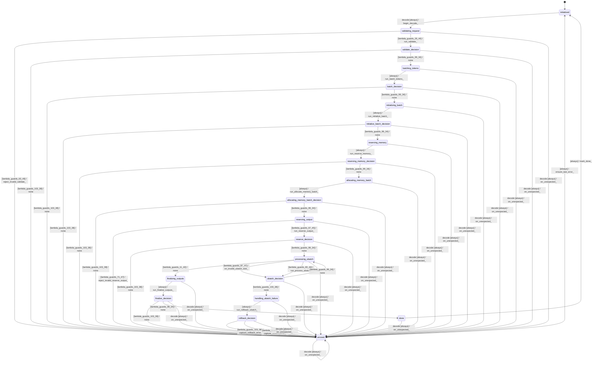

# decoder

Source: [`emel/decoder/sm.hpp`](https://github.com/stateforward/emel.cpp/blob/main/src/emel/decoder/sm.hpp)

## Mermaid

```mermaid
stateDiagram-v2
  direction TB
  [*] --> initialized
  initialized --> validating_request : decode [always] / begin_decode_
  validating_request --> errored : [lambda_guards_63_46] / reject_invalid_validate_
  validating_request --> validate_decision : [lambda_guards_26_44] / run_validate_
  validate_decision --> errored : [lambda_guards_103_38] / none
  validate_decision --> batching_tokens : [lambda_guards_99_34] / none
  batching_tokens --> batch_decision : [always] / run_batch_tokens_
  batch_decision --> errored : [lambda_guards_103_38] / none
  batch_decision --> initializing_batch : [lambda_guards_99_34] / none
  initializing_batch --> initialize_batch_decision : [always] / run_initialize_batch_
  initialize_batch_decision --> errored : [lambda_guards_103_38] / none
  initialize_batch_decision --> reserving_memory : [lambda_guards_99_34] / none
  reserving_memory --> reserving_memory_decision : [always] / run_reserve_memory_
  reserving_memory_decision --> errored : [lambda_guards_103_38] / none
  reserving_memory_decision --> allocating_memory_batch : [lambda_guards_99_34] / none
  allocating_memory_batch --> allocating_memory_batch_decision : [always] / run_allocate_memory_batch_
  allocating_memory_batch_decision --> errored : [lambda_guards_103_38] / none
  allocating_memory_batch_decision --> reserving_output : [lambda_guards_99_34] / none
  reserving_output --> errored : [lambda_guards_71_47] / reject_invalid_reserve_output_
  reserving_output --> reserve_decision : [lambda_guards_67_45] / run_reserve_output_
  reserve_decision --> errored : [lambda_guards_103_38] / none
  reserve_decision --> processing_ubatch : [lambda_guards_99_34] / none
  processing_ubatch --> finalizing_outputs : [lambda_guards_11_42] / none
  processing_ubatch --> ubatch_decision : [lambda_guards_87_47] / on_invalid_ubatch_size_
  processing_ubatch --> ubatch_decision : [lambda_guards_83_44] / run_process_ubatch_
  ubatch_decision --> handling_ubatch_failure : [lambda_guards_103_38] / none
  ubatch_decision --> processing_ubatch : [lambda_guards_99_34] / none
  handling_ubatch_failure --> rollback_decision : [always] / run_rollback_ubatch_
  rollback_decision --> errored : [lambda_guards_103_38] / capture_rollback_error_
  rollback_decision --> errored : [lambda_guards_99_34] / capture_ubatch_error_
  finalizing_outputs --> finalize_decision : [always] / run_finalize_outputs_
  finalize_decision --> errored : [lambda_guards_103_38] / none
  finalize_decision --> done : [lambda_guards_99_34] / none
  done --> initialized : [always] / mark_done_
  errored --> initialized : [always] / ensure_last_error_
  validating_request --> errored : decode [always] / on_unexpected_
  validate_decision --> errored : decode [always] / on_unexpected_
  batching_tokens --> errored : decode [always] / on_unexpected_
  batch_decision --> errored : decode [always] / on_unexpected_
  initializing_batch --> errored : decode [always] / on_unexpected_
  initialize_batch_decision --> errored : decode [always] / on_unexpected_
  reserving_memory --> errored : decode [always] / on_unexpected_
  reserving_memory_decision --> errored : decode [always] / on_unexpected_
  allocating_memory_batch --> errored : decode [always] / on_unexpected_
  allocating_memory_batch_decision --> errored : decode [always] / on_unexpected_
  reserving_output --> errored : decode [always] / on_unexpected_
  reserve_decision --> errored : decode [always] / on_unexpected_
  processing_ubatch --> errored : decode [always] / on_unexpected_
  ubatch_decision --> errored : decode [always] / on_unexpected_
  handling_ubatch_failure --> errored : decode [always] / on_unexpected_
  rollback_decision --> errored : decode [always] / on_unexpected_
  finalizing_outputs --> errored : decode [always] / on_unexpected_
  finalize_decision --> errored : decode [always] / on_unexpected_
  done --> errored : decode [always] / on_unexpected_
  errored --> errored : decode [always] / on_unexpected_
```

## Transitions

| Source | Event | Guard | Action | Target |
| --- | --- | --- | --- | --- |
| [`initialized`](https://github.com/stateforward/emel.cpp/blob/main/src/emel/decoder/sm.hpp) | [`decode`](https://github.com/stateforward/emel.cpp/blob/main/src/emel/decoder/sm.hpp) | [`always`](https://github.com/stateforward/emel.cpp/blob/main/src/emel/decoder/sm.hpp) | [`begin_decode>`](https://github.com/stateforward/emel.cpp/blob/main/src/emel/decoder/sm.hpp) | [`validating_request`](https://github.com/stateforward/emel.cpp/blob/main/src/emel/decoder/sm.hpp) |
| [`validating_request`](https://github.com/stateforward/emel.cpp/blob/main/src/emel/decoder/sm.hpp) | - | [`lambda_guards_63_46`](https://github.com/stateforward/emel.cpp/blob/main/src/emel/decoder/sm.hpp) | [`reject_invalid_validate>`](https://github.com/stateforward/emel.cpp/blob/main/src/emel/decoder/sm.hpp) | [`errored`](https://github.com/stateforward/emel.cpp/blob/main/src/emel/decoder/sm.hpp) |
| [`validating_request`](https://github.com/stateforward/emel.cpp/blob/main/src/emel/decoder/sm.hpp) | - | [`lambda_guards_26_44`](https://github.com/stateforward/emel.cpp/blob/main/src/emel/decoder/sm.hpp) | [`run_validate>`](https://github.com/stateforward/emel.cpp/blob/main/src/emel/decoder/sm.hpp) | [`validate_decision`](https://github.com/stateforward/emel.cpp/blob/main/src/emel/decoder/sm.hpp) |
| [`validate_decision`](https://github.com/stateforward/emel.cpp/blob/main/src/emel/decoder/sm.hpp) | - | [`lambda_guards_103_38`](https://github.com/stateforward/emel.cpp/blob/main/src/emel/decoder/sm.hpp) | [`none`](https://github.com/stateforward/emel.cpp/blob/main/src/emel/decoder/sm.hpp) | [`errored`](https://github.com/stateforward/emel.cpp/blob/main/src/emel/decoder/sm.hpp) |
| [`validate_decision`](https://github.com/stateforward/emel.cpp/blob/main/src/emel/decoder/sm.hpp) | - | [`lambda_guards_99_34`](https://github.com/stateforward/emel.cpp/blob/main/src/emel/decoder/sm.hpp) | [`none`](https://github.com/stateforward/emel.cpp/blob/main/src/emel/decoder/sm.hpp) | [`batching_tokens`](https://github.com/stateforward/emel.cpp/blob/main/src/emel/decoder/sm.hpp) |
| [`batching_tokens`](https://github.com/stateforward/emel.cpp/blob/main/src/emel/decoder/sm.hpp) | - | [`always`](https://github.com/stateforward/emel.cpp/blob/main/src/emel/decoder/sm.hpp) | [`run_batch_tokens>`](https://github.com/stateforward/emel.cpp/blob/main/src/emel/decoder/sm.hpp) | [`batch_decision`](https://github.com/stateforward/emel.cpp/blob/main/src/emel/decoder/sm.hpp) |
| [`batch_decision`](https://github.com/stateforward/emel.cpp/blob/main/src/emel/decoder/sm.hpp) | - | [`lambda_guards_103_38`](https://github.com/stateforward/emel.cpp/blob/main/src/emel/decoder/sm.hpp) | [`none`](https://github.com/stateforward/emel.cpp/blob/main/src/emel/decoder/sm.hpp) | [`errored`](https://github.com/stateforward/emel.cpp/blob/main/src/emel/decoder/sm.hpp) |
| [`batch_decision`](https://github.com/stateforward/emel.cpp/blob/main/src/emel/decoder/sm.hpp) | - | [`lambda_guards_99_34`](https://github.com/stateforward/emel.cpp/blob/main/src/emel/decoder/sm.hpp) | [`none`](https://github.com/stateforward/emel.cpp/blob/main/src/emel/decoder/sm.hpp) | [`initializing_batch`](https://github.com/stateforward/emel.cpp/blob/main/src/emel/decoder/sm.hpp) |
| [`initializing_batch`](https://github.com/stateforward/emel.cpp/blob/main/src/emel/decoder/sm.hpp) | - | [`always`](https://github.com/stateforward/emel.cpp/blob/main/src/emel/decoder/sm.hpp) | [`run_initialize_batch>`](https://github.com/stateforward/emel.cpp/blob/main/src/emel/decoder/sm.hpp) | [`initialize_batch_decision`](https://github.com/stateforward/emel.cpp/blob/main/src/emel/decoder/sm.hpp) |
| [`initialize_batch_decision`](https://github.com/stateforward/emel.cpp/blob/main/src/emel/decoder/sm.hpp) | - | [`lambda_guards_103_38`](https://github.com/stateforward/emel.cpp/blob/main/src/emel/decoder/sm.hpp) | [`none`](https://github.com/stateforward/emel.cpp/blob/main/src/emel/decoder/sm.hpp) | [`errored`](https://github.com/stateforward/emel.cpp/blob/main/src/emel/decoder/sm.hpp) |
| [`initialize_batch_decision`](https://github.com/stateforward/emel.cpp/blob/main/src/emel/decoder/sm.hpp) | - | [`lambda_guards_99_34`](https://github.com/stateforward/emel.cpp/blob/main/src/emel/decoder/sm.hpp) | [`none`](https://github.com/stateforward/emel.cpp/blob/main/src/emel/decoder/sm.hpp) | [`reserving_memory`](https://github.com/stateforward/emel.cpp/blob/main/src/emel/decoder/sm.hpp) |
| [`reserving_memory`](https://github.com/stateforward/emel.cpp/blob/main/src/emel/decoder/sm.hpp) | - | [`always`](https://github.com/stateforward/emel.cpp/blob/main/src/emel/decoder/sm.hpp) | [`run_reserve_memory>`](https://github.com/stateforward/emel.cpp/blob/main/src/emel/decoder/sm.hpp) | [`reserving_memory_decision`](https://github.com/stateforward/emel.cpp/blob/main/src/emel/decoder/sm.hpp) |
| [`reserving_memory_decision`](https://github.com/stateforward/emel.cpp/blob/main/src/emel/decoder/sm.hpp) | - | [`lambda_guards_103_38`](https://github.com/stateforward/emel.cpp/blob/main/src/emel/decoder/sm.hpp) | [`none`](https://github.com/stateforward/emel.cpp/blob/main/src/emel/decoder/sm.hpp) | [`errored`](https://github.com/stateforward/emel.cpp/blob/main/src/emel/decoder/sm.hpp) |
| [`reserving_memory_decision`](https://github.com/stateforward/emel.cpp/blob/main/src/emel/decoder/sm.hpp) | - | [`lambda_guards_99_34`](https://github.com/stateforward/emel.cpp/blob/main/src/emel/decoder/sm.hpp) | [`none`](https://github.com/stateforward/emel.cpp/blob/main/src/emel/decoder/sm.hpp) | [`allocating_memory_batch`](https://github.com/stateforward/emel.cpp/blob/main/src/emel/decoder/sm.hpp) |
| [`allocating_memory_batch`](https://github.com/stateforward/emel.cpp/blob/main/src/emel/decoder/sm.hpp) | - | [`always`](https://github.com/stateforward/emel.cpp/blob/main/src/emel/decoder/sm.hpp) | [`run_allocate_memory_batch>`](https://github.com/stateforward/emel.cpp/blob/main/src/emel/decoder/sm.hpp) | [`allocating_memory_batch_decision`](https://github.com/stateforward/emel.cpp/blob/main/src/emel/decoder/sm.hpp) |
| [`allocating_memory_batch_decision`](https://github.com/stateforward/emel.cpp/blob/main/src/emel/decoder/sm.hpp) | - | [`lambda_guards_103_38`](https://github.com/stateforward/emel.cpp/blob/main/src/emel/decoder/sm.hpp) | [`none`](https://github.com/stateforward/emel.cpp/blob/main/src/emel/decoder/sm.hpp) | [`errored`](https://github.com/stateforward/emel.cpp/blob/main/src/emel/decoder/sm.hpp) |
| [`allocating_memory_batch_decision`](https://github.com/stateforward/emel.cpp/blob/main/src/emel/decoder/sm.hpp) | - | [`lambda_guards_99_34`](https://github.com/stateforward/emel.cpp/blob/main/src/emel/decoder/sm.hpp) | [`none`](https://github.com/stateforward/emel.cpp/blob/main/src/emel/decoder/sm.hpp) | [`reserving_output`](https://github.com/stateforward/emel.cpp/blob/main/src/emel/decoder/sm.hpp) |
| [`reserving_output`](https://github.com/stateforward/emel.cpp/blob/main/src/emel/decoder/sm.hpp) | - | [`lambda_guards_71_47`](https://github.com/stateforward/emel.cpp/blob/main/src/emel/decoder/sm.hpp) | [`reject_invalid_reserve_output>`](https://github.com/stateforward/emel.cpp/blob/main/src/emel/decoder/sm.hpp) | [`errored`](https://github.com/stateforward/emel.cpp/blob/main/src/emel/decoder/sm.hpp) |
| [`reserving_output`](https://github.com/stateforward/emel.cpp/blob/main/src/emel/decoder/sm.hpp) | - | [`lambda_guards_67_45`](https://github.com/stateforward/emel.cpp/blob/main/src/emel/decoder/sm.hpp) | [`run_reserve_output>`](https://github.com/stateforward/emel.cpp/blob/main/src/emel/decoder/sm.hpp) | [`reserve_decision`](https://github.com/stateforward/emel.cpp/blob/main/src/emel/decoder/sm.hpp) |
| [`reserve_decision`](https://github.com/stateforward/emel.cpp/blob/main/src/emel/decoder/sm.hpp) | - | [`lambda_guards_103_38`](https://github.com/stateforward/emel.cpp/blob/main/src/emel/decoder/sm.hpp) | [`none`](https://github.com/stateforward/emel.cpp/blob/main/src/emel/decoder/sm.hpp) | [`errored`](https://github.com/stateforward/emel.cpp/blob/main/src/emel/decoder/sm.hpp) |
| [`reserve_decision`](https://github.com/stateforward/emel.cpp/blob/main/src/emel/decoder/sm.hpp) | - | [`lambda_guards_99_34`](https://github.com/stateforward/emel.cpp/blob/main/src/emel/decoder/sm.hpp) | [`none`](https://github.com/stateforward/emel.cpp/blob/main/src/emel/decoder/sm.hpp) | [`processing_ubatch`](https://github.com/stateforward/emel.cpp/blob/main/src/emel/decoder/sm.hpp) |
| [`processing_ubatch`](https://github.com/stateforward/emel.cpp/blob/main/src/emel/decoder/sm.hpp) | - | [`lambda_guards_11_42`](https://github.com/stateforward/emel.cpp/blob/main/src/emel/decoder/sm.hpp) | [`none`](https://github.com/stateforward/emel.cpp/blob/main/src/emel/decoder/sm.hpp) | [`finalizing_outputs`](https://github.com/stateforward/emel.cpp/blob/main/src/emel/decoder/sm.hpp) |
| [`processing_ubatch`](https://github.com/stateforward/emel.cpp/blob/main/src/emel/decoder/sm.hpp) | - | [`lambda_guards_87_47`](https://github.com/stateforward/emel.cpp/blob/main/src/emel/decoder/sm.hpp) | [`on_invalid_ubatch_size>`](https://github.com/stateforward/emel.cpp/blob/main/src/emel/decoder/sm.hpp) | [`ubatch_decision`](https://github.com/stateforward/emel.cpp/blob/main/src/emel/decoder/sm.hpp) |
| [`processing_ubatch`](https://github.com/stateforward/emel.cpp/blob/main/src/emel/decoder/sm.hpp) | - | [`lambda_guards_83_44`](https://github.com/stateforward/emel.cpp/blob/main/src/emel/decoder/sm.hpp) | [`run_process_ubatch>`](https://github.com/stateforward/emel.cpp/blob/main/src/emel/decoder/sm.hpp) | [`ubatch_decision`](https://github.com/stateforward/emel.cpp/blob/main/src/emel/decoder/sm.hpp) |
| [`ubatch_decision`](https://github.com/stateforward/emel.cpp/blob/main/src/emel/decoder/sm.hpp) | - | [`lambda_guards_103_38`](https://github.com/stateforward/emel.cpp/blob/main/src/emel/decoder/sm.hpp) | [`none`](https://github.com/stateforward/emel.cpp/blob/main/src/emel/decoder/sm.hpp) | [`handling_ubatch_failure`](https://github.com/stateforward/emel.cpp/blob/main/src/emel/decoder/sm.hpp) |
| [`ubatch_decision`](https://github.com/stateforward/emel.cpp/blob/main/src/emel/decoder/sm.hpp) | - | [`lambda_guards_99_34`](https://github.com/stateforward/emel.cpp/blob/main/src/emel/decoder/sm.hpp) | [`none`](https://github.com/stateforward/emel.cpp/blob/main/src/emel/decoder/sm.hpp) | [`processing_ubatch`](https://github.com/stateforward/emel.cpp/blob/main/src/emel/decoder/sm.hpp) |
| [`handling_ubatch_failure`](https://github.com/stateforward/emel.cpp/blob/main/src/emel/decoder/sm.hpp) | - | [`always`](https://github.com/stateforward/emel.cpp/blob/main/src/emel/decoder/sm.hpp) | [`run_rollback_ubatch>`](https://github.com/stateforward/emel.cpp/blob/main/src/emel/decoder/sm.hpp) | [`rollback_decision`](https://github.com/stateforward/emel.cpp/blob/main/src/emel/decoder/sm.hpp) |
| [`rollback_decision`](https://github.com/stateforward/emel.cpp/blob/main/src/emel/decoder/sm.hpp) | - | [`lambda_guards_103_38`](https://github.com/stateforward/emel.cpp/blob/main/src/emel/decoder/sm.hpp) | [`capture_rollback_error>`](https://github.com/stateforward/emel.cpp/blob/main/src/emel/decoder/sm.hpp) | [`errored`](https://github.com/stateforward/emel.cpp/blob/main/src/emel/decoder/sm.hpp) |
| [`rollback_decision`](https://github.com/stateforward/emel.cpp/blob/main/src/emel/decoder/sm.hpp) | - | [`lambda_guards_99_34`](https://github.com/stateforward/emel.cpp/blob/main/src/emel/decoder/sm.hpp) | [`capture_ubatch_error>`](https://github.com/stateforward/emel.cpp/blob/main/src/emel/decoder/sm.hpp) | [`errored`](https://github.com/stateforward/emel.cpp/blob/main/src/emel/decoder/sm.hpp) |
| [`finalizing_outputs`](https://github.com/stateforward/emel.cpp/blob/main/src/emel/decoder/sm.hpp) | - | [`always`](https://github.com/stateforward/emel.cpp/blob/main/src/emel/decoder/sm.hpp) | [`run_finalize_outputs>`](https://github.com/stateforward/emel.cpp/blob/main/src/emel/decoder/sm.hpp) | [`finalize_decision`](https://github.com/stateforward/emel.cpp/blob/main/src/emel/decoder/sm.hpp) |
| [`finalize_decision`](https://github.com/stateforward/emel.cpp/blob/main/src/emel/decoder/sm.hpp) | - | [`lambda_guards_103_38`](https://github.com/stateforward/emel.cpp/blob/main/src/emel/decoder/sm.hpp) | [`none`](https://github.com/stateforward/emel.cpp/blob/main/src/emel/decoder/sm.hpp) | [`errored`](https://github.com/stateforward/emel.cpp/blob/main/src/emel/decoder/sm.hpp) |
| [`finalize_decision`](https://github.com/stateforward/emel.cpp/blob/main/src/emel/decoder/sm.hpp) | - | [`lambda_guards_99_34`](https://github.com/stateforward/emel.cpp/blob/main/src/emel/decoder/sm.hpp) | [`none`](https://github.com/stateforward/emel.cpp/blob/main/src/emel/decoder/sm.hpp) | [`done`](https://github.com/stateforward/emel.cpp/blob/main/src/emel/decoder/sm.hpp) |
| [`done`](https://github.com/stateforward/emel.cpp/blob/main/src/emel/decoder/sm.hpp) | - | [`always`](https://github.com/stateforward/emel.cpp/blob/main/src/emel/decoder/sm.hpp) | [`mark_done>`](https://github.com/stateforward/emel.cpp/blob/main/src/emel/decoder/sm.hpp) | [`initialized`](https://github.com/stateforward/emel.cpp/blob/main/src/emel/decoder/sm.hpp) |
| [`errored`](https://github.com/stateforward/emel.cpp/blob/main/src/emel/decoder/sm.hpp) | - | [`always`](https://github.com/stateforward/emel.cpp/blob/main/src/emel/decoder/sm.hpp) | [`ensure_last_error>`](https://github.com/stateforward/emel.cpp/blob/main/src/emel/decoder/sm.hpp) | [`initialized`](https://github.com/stateforward/emel.cpp/blob/main/src/emel/decoder/sm.hpp) |
| [`validating_request`](https://github.com/stateforward/emel.cpp/blob/main/src/emel/decoder/sm.hpp) | [`decode`](https://github.com/stateforward/emel.cpp/blob/main/src/emel/decoder/sm.hpp) | [`always`](https://github.com/stateforward/emel.cpp/blob/main/src/emel/decoder/sm.hpp) | [`on_unexpected>`](https://github.com/stateforward/emel.cpp/blob/main/src/emel/decoder/sm.hpp) | [`errored`](https://github.com/stateforward/emel.cpp/blob/main/src/emel/decoder/sm.hpp) |
| [`validate_decision`](https://github.com/stateforward/emel.cpp/blob/main/src/emel/decoder/sm.hpp) | [`decode`](https://github.com/stateforward/emel.cpp/blob/main/src/emel/decoder/sm.hpp) | [`always`](https://github.com/stateforward/emel.cpp/blob/main/src/emel/decoder/sm.hpp) | [`on_unexpected>`](https://github.com/stateforward/emel.cpp/blob/main/src/emel/decoder/sm.hpp) | [`errored`](https://github.com/stateforward/emel.cpp/blob/main/src/emel/decoder/sm.hpp) |
| [`batching_tokens`](https://github.com/stateforward/emel.cpp/blob/main/src/emel/decoder/sm.hpp) | [`decode`](https://github.com/stateforward/emel.cpp/blob/main/src/emel/decoder/sm.hpp) | [`always`](https://github.com/stateforward/emel.cpp/blob/main/src/emel/decoder/sm.hpp) | [`on_unexpected>`](https://github.com/stateforward/emel.cpp/blob/main/src/emel/decoder/sm.hpp) | [`errored`](https://github.com/stateforward/emel.cpp/blob/main/src/emel/decoder/sm.hpp) |
| [`batch_decision`](https://github.com/stateforward/emel.cpp/blob/main/src/emel/decoder/sm.hpp) | [`decode`](https://github.com/stateforward/emel.cpp/blob/main/src/emel/decoder/sm.hpp) | [`always`](https://github.com/stateforward/emel.cpp/blob/main/src/emel/decoder/sm.hpp) | [`on_unexpected>`](https://github.com/stateforward/emel.cpp/blob/main/src/emel/decoder/sm.hpp) | [`errored`](https://github.com/stateforward/emel.cpp/blob/main/src/emel/decoder/sm.hpp) |
| [`initializing_batch`](https://github.com/stateforward/emel.cpp/blob/main/src/emel/decoder/sm.hpp) | [`decode`](https://github.com/stateforward/emel.cpp/blob/main/src/emel/decoder/sm.hpp) | [`always`](https://github.com/stateforward/emel.cpp/blob/main/src/emel/decoder/sm.hpp) | [`on_unexpected>`](https://github.com/stateforward/emel.cpp/blob/main/src/emel/decoder/sm.hpp) | [`errored`](https://github.com/stateforward/emel.cpp/blob/main/src/emel/decoder/sm.hpp) |
| [`initialize_batch_decision`](https://github.com/stateforward/emel.cpp/blob/main/src/emel/decoder/sm.hpp) | [`decode`](https://github.com/stateforward/emel.cpp/blob/main/src/emel/decoder/sm.hpp) | [`always`](https://github.com/stateforward/emel.cpp/blob/main/src/emel/decoder/sm.hpp) | [`on_unexpected>`](https://github.com/stateforward/emel.cpp/blob/main/src/emel/decoder/sm.hpp) | [`errored`](https://github.com/stateforward/emel.cpp/blob/main/src/emel/decoder/sm.hpp) |
| [`reserving_memory`](https://github.com/stateforward/emel.cpp/blob/main/src/emel/decoder/sm.hpp) | [`decode`](https://github.com/stateforward/emel.cpp/blob/main/src/emel/decoder/sm.hpp) | [`always`](https://github.com/stateforward/emel.cpp/blob/main/src/emel/decoder/sm.hpp) | [`on_unexpected>`](https://github.com/stateforward/emel.cpp/blob/main/src/emel/decoder/sm.hpp) | [`errored`](https://github.com/stateforward/emel.cpp/blob/main/src/emel/decoder/sm.hpp) |
| [`reserving_memory_decision`](https://github.com/stateforward/emel.cpp/blob/main/src/emel/decoder/sm.hpp) | [`decode`](https://github.com/stateforward/emel.cpp/blob/main/src/emel/decoder/sm.hpp) | [`always`](https://github.com/stateforward/emel.cpp/blob/main/src/emel/decoder/sm.hpp) | [`on_unexpected>`](https://github.com/stateforward/emel.cpp/blob/main/src/emel/decoder/sm.hpp) | [`errored`](https://github.com/stateforward/emel.cpp/blob/main/src/emel/decoder/sm.hpp) |
| [`allocating_memory_batch`](https://github.com/stateforward/emel.cpp/blob/main/src/emel/decoder/sm.hpp) | [`decode`](https://github.com/stateforward/emel.cpp/blob/main/src/emel/decoder/sm.hpp) | [`always`](https://github.com/stateforward/emel.cpp/blob/main/src/emel/decoder/sm.hpp) | [`on_unexpected>`](https://github.com/stateforward/emel.cpp/blob/main/src/emel/decoder/sm.hpp) | [`errored`](https://github.com/stateforward/emel.cpp/blob/main/src/emel/decoder/sm.hpp) |
| [`allocating_memory_batch_decision`](https://github.com/stateforward/emel.cpp/blob/main/src/emel/decoder/sm.hpp) | [`decode`](https://github.com/stateforward/emel.cpp/blob/main/src/emel/decoder/sm.hpp) | [`always`](https://github.com/stateforward/emel.cpp/blob/main/src/emel/decoder/sm.hpp) | [`on_unexpected>`](https://github.com/stateforward/emel.cpp/blob/main/src/emel/decoder/sm.hpp) | [`errored`](https://github.com/stateforward/emel.cpp/blob/main/src/emel/decoder/sm.hpp) |
| [`reserving_output`](https://github.com/stateforward/emel.cpp/blob/main/src/emel/decoder/sm.hpp) | [`decode`](https://github.com/stateforward/emel.cpp/blob/main/src/emel/decoder/sm.hpp) | [`always`](https://github.com/stateforward/emel.cpp/blob/main/src/emel/decoder/sm.hpp) | [`on_unexpected>`](https://github.com/stateforward/emel.cpp/blob/main/src/emel/decoder/sm.hpp) | [`errored`](https://github.com/stateforward/emel.cpp/blob/main/src/emel/decoder/sm.hpp) |
| [`reserve_decision`](https://github.com/stateforward/emel.cpp/blob/main/src/emel/decoder/sm.hpp) | [`decode`](https://github.com/stateforward/emel.cpp/blob/main/src/emel/decoder/sm.hpp) | [`always`](https://github.com/stateforward/emel.cpp/blob/main/src/emel/decoder/sm.hpp) | [`on_unexpected>`](https://github.com/stateforward/emel.cpp/blob/main/src/emel/decoder/sm.hpp) | [`errored`](https://github.com/stateforward/emel.cpp/blob/main/src/emel/decoder/sm.hpp) |
| [`processing_ubatch`](https://github.com/stateforward/emel.cpp/blob/main/src/emel/decoder/sm.hpp) | [`decode`](https://github.com/stateforward/emel.cpp/blob/main/src/emel/decoder/sm.hpp) | [`always`](https://github.com/stateforward/emel.cpp/blob/main/src/emel/decoder/sm.hpp) | [`on_unexpected>`](https://github.com/stateforward/emel.cpp/blob/main/src/emel/decoder/sm.hpp) | [`errored`](https://github.com/stateforward/emel.cpp/blob/main/src/emel/decoder/sm.hpp) |
| [`ubatch_decision`](https://github.com/stateforward/emel.cpp/blob/main/src/emel/decoder/sm.hpp) | [`decode`](https://github.com/stateforward/emel.cpp/blob/main/src/emel/decoder/sm.hpp) | [`always`](https://github.com/stateforward/emel.cpp/blob/main/src/emel/decoder/sm.hpp) | [`on_unexpected>`](https://github.com/stateforward/emel.cpp/blob/main/src/emel/decoder/sm.hpp) | [`errored`](https://github.com/stateforward/emel.cpp/blob/main/src/emel/decoder/sm.hpp) |
| [`handling_ubatch_failure`](https://github.com/stateforward/emel.cpp/blob/main/src/emel/decoder/sm.hpp) | [`decode`](https://github.com/stateforward/emel.cpp/blob/main/src/emel/decoder/sm.hpp) | [`always`](https://github.com/stateforward/emel.cpp/blob/main/src/emel/decoder/sm.hpp) | [`on_unexpected>`](https://github.com/stateforward/emel.cpp/blob/main/src/emel/decoder/sm.hpp) | [`errored`](https://github.com/stateforward/emel.cpp/blob/main/src/emel/decoder/sm.hpp) |
| [`rollback_decision`](https://github.com/stateforward/emel.cpp/blob/main/src/emel/decoder/sm.hpp) | [`decode`](https://github.com/stateforward/emel.cpp/blob/main/src/emel/decoder/sm.hpp) | [`always`](https://github.com/stateforward/emel.cpp/blob/main/src/emel/decoder/sm.hpp) | [`on_unexpected>`](https://github.com/stateforward/emel.cpp/blob/main/src/emel/decoder/sm.hpp) | [`errored`](https://github.com/stateforward/emel.cpp/blob/main/src/emel/decoder/sm.hpp) |
| [`finalizing_outputs`](https://github.com/stateforward/emel.cpp/blob/main/src/emel/decoder/sm.hpp) | [`decode`](https://github.com/stateforward/emel.cpp/blob/main/src/emel/decoder/sm.hpp) | [`always`](https://github.com/stateforward/emel.cpp/blob/main/src/emel/decoder/sm.hpp) | [`on_unexpected>`](https://github.com/stateforward/emel.cpp/blob/main/src/emel/decoder/sm.hpp) | [`errored`](https://github.com/stateforward/emel.cpp/blob/main/src/emel/decoder/sm.hpp) |
| [`finalize_decision`](https://github.com/stateforward/emel.cpp/blob/main/src/emel/decoder/sm.hpp) | [`decode`](https://github.com/stateforward/emel.cpp/blob/main/src/emel/decoder/sm.hpp) | [`always`](https://github.com/stateforward/emel.cpp/blob/main/src/emel/decoder/sm.hpp) | [`on_unexpected>`](https://github.com/stateforward/emel.cpp/blob/main/src/emel/decoder/sm.hpp) | [`errored`](https://github.com/stateforward/emel.cpp/blob/main/src/emel/decoder/sm.hpp) |
| [`done`](https://github.com/stateforward/emel.cpp/blob/main/src/emel/decoder/sm.hpp) | [`decode`](https://github.com/stateforward/emel.cpp/blob/main/src/emel/decoder/sm.hpp) | [`always`](https://github.com/stateforward/emel.cpp/blob/main/src/emel/decoder/sm.hpp) | [`on_unexpected>`](https://github.com/stateforward/emel.cpp/blob/main/src/emel/decoder/sm.hpp) | [`errored`](https://github.com/stateforward/emel.cpp/blob/main/src/emel/decoder/sm.hpp) |
| [`errored`](https://github.com/stateforward/emel.cpp/blob/main/src/emel/decoder/sm.hpp) | [`decode`](https://github.com/stateforward/emel.cpp/blob/main/src/emel/decoder/sm.hpp) | [`always`](https://github.com/stateforward/emel.cpp/blob/main/src/emel/decoder/sm.hpp) | [`on_unexpected>`](https://github.com/stateforward/emel.cpp/blob/main/src/emel/decoder/sm.hpp) | [`errored`](https://github.com/stateforward/emel.cpp/blob/main/src/emel/decoder/sm.hpp) |
