# decoder_compute_executor

Source: [`emel/decoder/compute_executor/sm.hpp`](https://github.com/stateforward/emel.cpp/blob/main/src/emel/decoder/compute_executor/sm.hpp)

## Mermaid

```mermaid
stateDiagram-v2
  direction TB
  [*] --> emel__decoder__compute_executor__initialized
  emel__decoder__compute_executor__initialized --> emel__decoder__compute_executor__validating : emel__decoder__compute_executor__event__execute [boost__sml__aux__zero_wrapper_emel__decoder__compute_executor__guard__valid_execute_request_] / boost__sml__aux__zero_wrapper_emel__decoder__compute_executor__action__begin_execute_
  emel__decoder__compute_executor__initialized --> emel__decoder__compute_executor__errored : emel__decoder__compute_executor__event__execute [boost__sml__aux__zero_wrapper_emel__decoder__compute_executor__guard__invalid_execute_request_] / boost__sml__aux__zero_wrapper_emel__decoder__compute_executor__action__reject_invalid_execute_
  emel__decoder__compute_executor__validating --> emel__decoder__compute_executor__validate_decision : [boost__sml__front__always] / boost__sml__aux__zero_wrapper_emel__decoder__compute_executor__action__run_validate_
  emel__decoder__compute_executor__validate_decision --> emel__decoder__compute_executor__errored : [boost__sml__aux__zero_wrapper_emel__decoder__compute_executor__guard___lambda_at__Users_gabrielwillen_VSCode_stateforward_emel_emel_cpp_tools_docsgen_______src_emel_decoder_compute_executor_guards_hpp_19_38__] / boost__sml__front__none
  emel__decoder__compute_executor__validate_decision --> emel__decoder__compute_executor__prepare_decision : [boost__sml__aux__zero_wrapper_emel__decoder__compute_executor__guard___lambda_at__Users_gabrielwillen_VSCode_stateforward_emel_emel_cpp_tools_docsgen_______src_emel_decoder_compute_executor_guards_hpp_15_34__] / boost__sml__aux__zero_wrapper_emel__decoder__compute_executor__action__run_prepare_graph_
  emel__decoder__compute_executor__prepare_decision --> emel__decoder__compute_executor__errored : [boost__sml__aux__zero_wrapper_emel__decoder__compute_executor__guard___lambda_at__Users_gabrielwillen_VSCode_stateforward_emel_emel_cpp_tools_docsgen_______src_emel_decoder_compute_executor_guards_hpp_19_38__] / boost__sml__front__none
  emel__decoder__compute_executor__prepare_decision --> emel__decoder__compute_executor__binding_inputs : [boost__sml__aux__zero_wrapper_emel__decoder__compute_executor__guard___lambda_at__Users_gabrielwillen_VSCode_stateforward_emel_emel_cpp_tools_docsgen_______src_emel_decoder_compute_executor_guards_hpp_7_38__] / boost__sml__front__none
  emel__decoder__compute_executor__prepare_decision --> emel__decoder__compute_executor__allocating_graph : [boost__sml__aux__zero_wrapper_emel__decoder__compute_executor__guard___lambda_at__Users_gabrielwillen_VSCode_stateforward_emel_emel_cpp_tools_docsgen_______src_emel_decoder_compute_executor_guards_hpp_11_48__] / boost__sml__front__none
  emel__decoder__compute_executor__allocating_graph --> emel__decoder__compute_executor__alloc_decision : [boost__sml__front__always] / boost__sml__aux__zero_wrapper_emel__decoder__compute_executor__action__run_alloc_graph_
  emel__decoder__compute_executor__alloc_decision --> emel__decoder__compute_executor__errored : [boost__sml__aux__zero_wrapper_emel__decoder__compute_executor__guard___lambda_at__Users_gabrielwillen_VSCode_stateforward_emel_emel_cpp_tools_docsgen_______src_emel_decoder_compute_executor_guards_hpp_19_38__] / boost__sml__front__none
  emel__decoder__compute_executor__alloc_decision --> emel__decoder__compute_executor__binding_inputs : [boost__sml__aux__zero_wrapper_emel__decoder__compute_executor__guard___lambda_at__Users_gabrielwillen_VSCode_stateforward_emel_emel_cpp_tools_docsgen_______src_emel_decoder_compute_executor_guards_hpp_15_34__] / boost__sml__front__none
  emel__decoder__compute_executor__binding_inputs --> emel__decoder__compute_executor__bind_decision : [boost__sml__front__always] / boost__sml__aux__zero_wrapper_emel__decoder__compute_executor__action__run_bind_inputs_
  emel__decoder__compute_executor__bind_decision --> emel__decoder__compute_executor__errored : [boost__sml__aux__zero_wrapper_emel__decoder__compute_executor__guard___lambda_at__Users_gabrielwillen_VSCode_stateforward_emel_emel_cpp_tools_docsgen_______src_emel_decoder_compute_executor_guards_hpp_19_38__] / boost__sml__front__none
  emel__decoder__compute_executor__bind_decision --> emel__decoder__compute_executor__running_backend : [boost__sml__aux__zero_wrapper_emel__decoder__compute_executor__guard___lambda_at__Users_gabrielwillen_VSCode_stateforward_emel_emel_cpp_tools_docsgen_______src_emel_decoder_compute_executor_guards_hpp_15_34__] / boost__sml__front__none
  emel__decoder__compute_executor__running_backend --> emel__decoder__compute_executor__backend_decision : [boost__sml__front__always] / boost__sml__aux__zero_wrapper_emel__decoder__compute_executor__action__run_backend_
  emel__decoder__compute_executor__backend_decision --> emel__decoder__compute_executor__errored : [boost__sml__aux__zero_wrapper_emel__decoder__compute_executor__guard___lambda_at__Users_gabrielwillen_VSCode_stateforward_emel_emel_cpp_tools_docsgen_______src_emel_decoder_compute_executor_guards_hpp_19_38__] / boost__sml__front__none
  emel__decoder__compute_executor__backend_decision --> emel__decoder__compute_executor__extracting_outputs : [boost__sml__aux__zero_wrapper_emel__decoder__compute_executor__guard___lambda_at__Users_gabrielwillen_VSCode_stateforward_emel_emel_cpp_tools_docsgen_______src_emel_decoder_compute_executor_guards_hpp_15_34__] / boost__sml__front__none
  emel__decoder__compute_executor__extracting_outputs --> emel__decoder__compute_executor__extract_decision : [boost__sml__front__always] / boost__sml__aux__zero_wrapper_emel__decoder__compute_executor__action__run_extract_outputs_
  emel__decoder__compute_executor__extract_decision --> emel__decoder__compute_executor__errored : [boost__sml__aux__zero_wrapper_emel__decoder__compute_executor__guard___lambda_at__Users_gabrielwillen_VSCode_stateforward_emel_emel_cpp_tools_docsgen_______src_emel_decoder_compute_executor_guards_hpp_19_38__] / boost__sml__front__none
  emel__decoder__compute_executor__extract_decision --> emel__decoder__compute_executor__done : [boost__sml__aux__zero_wrapper_emel__decoder__compute_executor__guard___lambda_at__Users_gabrielwillen_VSCode_stateforward_emel_emel_cpp_tools_docsgen_______src_emel_decoder_compute_executor_guards_hpp_15_34__] / boost__sml__front__none
  emel__decoder__compute_executor__done --> emel__decoder__compute_executor__initialized : [boost__sml__front__always] / boost__sml__aux__zero_wrapper_emel__decoder__compute_executor__action__mark_done_
  emel__decoder__compute_executor__errored --> emel__decoder__compute_executor__initialized : [boost__sml__front__always] / boost__sml__aux__zero_wrapper_emel__decoder__compute_executor__action__ensure_last_error_
  emel__decoder__compute_executor__validating --> emel__decoder__compute_executor__errored : emel__decoder__compute_executor__event__execute [boost__sml__front__always] / boost__sml__aux__zero_wrapper_emel__decoder__compute_executor__action__on_unexpected_
  emel__decoder__compute_executor__validate_decision --> emel__decoder__compute_executor__errored : emel__decoder__compute_executor__event__execute [boost__sml__front__always] / boost__sml__aux__zero_wrapper_emel__decoder__compute_executor__action__on_unexpected_
  emel__decoder__compute_executor__prepare_decision --> emel__decoder__compute_executor__errored : emel__decoder__compute_executor__event__execute [boost__sml__front__always] / boost__sml__aux__zero_wrapper_emel__decoder__compute_executor__action__on_unexpected_
  emel__decoder__compute_executor__allocating_graph --> emel__decoder__compute_executor__errored : emel__decoder__compute_executor__event__execute [boost__sml__front__always] / boost__sml__aux__zero_wrapper_emel__decoder__compute_executor__action__on_unexpected_
  emel__decoder__compute_executor__alloc_decision --> emel__decoder__compute_executor__errored : emel__decoder__compute_executor__event__execute [boost__sml__front__always] / boost__sml__aux__zero_wrapper_emel__decoder__compute_executor__action__on_unexpected_
  emel__decoder__compute_executor__binding_inputs --> emel__decoder__compute_executor__errored : emel__decoder__compute_executor__event__execute [boost__sml__front__always] / boost__sml__aux__zero_wrapper_emel__decoder__compute_executor__action__on_unexpected_
  emel__decoder__compute_executor__bind_decision --> emel__decoder__compute_executor__errored : emel__decoder__compute_executor__event__execute [boost__sml__front__always] / boost__sml__aux__zero_wrapper_emel__decoder__compute_executor__action__on_unexpected_
  emel__decoder__compute_executor__running_backend --> emel__decoder__compute_executor__errored : emel__decoder__compute_executor__event__execute [boost__sml__front__always] / boost__sml__aux__zero_wrapper_emel__decoder__compute_executor__action__on_unexpected_
  emel__decoder__compute_executor__backend_decision --> emel__decoder__compute_executor__errored : emel__decoder__compute_executor__event__execute [boost__sml__front__always] / boost__sml__aux__zero_wrapper_emel__decoder__compute_executor__action__on_unexpected_
  emel__decoder__compute_executor__extracting_outputs --> emel__decoder__compute_executor__errored : emel__decoder__compute_executor__event__execute [boost__sml__front__always] / boost__sml__aux__zero_wrapper_emel__decoder__compute_executor__action__on_unexpected_
  emel__decoder__compute_executor__extract_decision --> emel__decoder__compute_executor__errored : emel__decoder__compute_executor__event__execute [boost__sml__front__always] / boost__sml__aux__zero_wrapper_emel__decoder__compute_executor__action__on_unexpected_
  emel__decoder__compute_executor__done --> emel__decoder__compute_executor__errored : emel__decoder__compute_executor__event__execute [boost__sml__front__always] / boost__sml__aux__zero_wrapper_emel__decoder__compute_executor__action__on_unexpected_
  emel__decoder__compute_executor__errored --> emel__decoder__compute_executor__errored : emel__decoder__compute_executor__event__execute [boost__sml__front__always] / boost__sml__aux__zero_wrapper_emel__decoder__compute_executor__action__on_unexpected_
```

## Transitions

| Source | Event | Guard | Action | Target |
| --- | --- | --- | --- | --- |
| [`initialized`](https://github.com/stateforward/emel.cpp/blob/main/src/emel/decoder/compute_executor/sm.hpp) | [`execute`](https://github.com/stateforward/emel.cpp/blob/main/src/emel/decoder/compute_executor/sm.hpp) | [`valid_execute_request>`](https://github.com/stateforward/emel.cpp/blob/main/src/emel/decoder/compute_executor/sm.hpp) | [`begin_execute>`](https://github.com/stateforward/emel.cpp/blob/main/src/emel/decoder/compute_executor/sm.hpp) | [`validating`](https://github.com/stateforward/emel.cpp/blob/main/src/emel/decoder/compute_executor/sm.hpp) |
| [`initialized`](https://github.com/stateforward/emel.cpp/blob/main/src/emel/decoder/compute_executor/sm.hpp) | [`execute`](https://github.com/stateforward/emel.cpp/blob/main/src/emel/decoder/compute_executor/sm.hpp) | [`invalid_execute_request>`](https://github.com/stateforward/emel.cpp/blob/main/src/emel/decoder/compute_executor/sm.hpp) | [`reject_invalid_execute>`](https://github.com/stateforward/emel.cpp/blob/main/src/emel/decoder/compute_executor/sm.hpp) | [`errored`](https://github.com/stateforward/emel.cpp/blob/main/src/emel/decoder/compute_executor/sm.hpp) |
| [`validating`](https://github.com/stateforward/emel.cpp/blob/main/src/emel/decoder/compute_executor/sm.hpp) | - | [`always`](https://github.com/stateforward/emel.cpp/blob/main/src/emel/decoder/compute_executor/sm.hpp) | [`run_validate>`](https://github.com/stateforward/emel.cpp/blob/main/src/emel/decoder/compute_executor/sm.hpp) | [`validate_decision`](https://github.com/stateforward/emel.cpp/blob/main/src/emel/decoder/compute_executor/sm.hpp) |
| [`validate_decision`](https://github.com/stateforward/emel.cpp/blob/main/src/emel/decoder/compute_executor/sm.hpp) | - | [`(lambda at /Users/gabrielwillen/VSCode/stateforward/emel/emel.cpp/tools/docsgen/../../src/emel/decoder/compute_executor/guards.hpp:19:38)>`](https://github.com/stateforward/emel.cpp/blob/main/src/emel/decoder/compute_executor/sm.hpp) | [`none`](https://github.com/stateforward/emel.cpp/blob/main/src/emel/decoder/compute_executor/sm.hpp) | [`errored`](https://github.com/stateforward/emel.cpp/blob/main/src/emel/decoder/compute_executor/sm.hpp) |
| [`validate_decision`](https://github.com/stateforward/emel.cpp/blob/main/src/emel/decoder/compute_executor/sm.hpp) | - | [`(lambda at /Users/gabrielwillen/VSCode/stateforward/emel/emel.cpp/tools/docsgen/../../src/emel/decoder/compute_executor/guards.hpp:15:34)>`](https://github.com/stateforward/emel.cpp/blob/main/src/emel/decoder/compute_executor/sm.hpp) | [`run_prepare_graph>`](https://github.com/stateforward/emel.cpp/blob/main/src/emel/decoder/compute_executor/sm.hpp) | [`prepare_decision`](https://github.com/stateforward/emel.cpp/blob/main/src/emel/decoder/compute_executor/sm.hpp) |
| [`prepare_decision`](https://github.com/stateforward/emel.cpp/blob/main/src/emel/decoder/compute_executor/sm.hpp) | - | [`(lambda at /Users/gabrielwillen/VSCode/stateforward/emel/emel.cpp/tools/docsgen/../../src/emel/decoder/compute_executor/guards.hpp:19:38)>`](https://github.com/stateforward/emel.cpp/blob/main/src/emel/decoder/compute_executor/sm.hpp) | [`none`](https://github.com/stateforward/emel.cpp/blob/main/src/emel/decoder/compute_executor/sm.hpp) | [`errored`](https://github.com/stateforward/emel.cpp/blob/main/src/emel/decoder/compute_executor/sm.hpp) |
| [`prepare_decision`](https://github.com/stateforward/emel.cpp/blob/main/src/emel/decoder/compute_executor/sm.hpp) | - | [`(lambda at /Users/gabrielwillen/VSCode/stateforward/emel/emel.cpp/tools/docsgen/../../src/emel/decoder/compute_executor/guards.hpp:7:38)>`](https://github.com/stateforward/emel.cpp/blob/main/src/emel/decoder/compute_executor/sm.hpp) | [`none`](https://github.com/stateforward/emel.cpp/blob/main/src/emel/decoder/compute_executor/sm.hpp) | [`binding_inputs`](https://github.com/stateforward/emel.cpp/blob/main/src/emel/decoder/compute_executor/sm.hpp) |
| [`prepare_decision`](https://github.com/stateforward/emel.cpp/blob/main/src/emel/decoder/compute_executor/sm.hpp) | - | [`(lambda at /Users/gabrielwillen/VSCode/stateforward/emel/emel.cpp/tools/docsgen/../../src/emel/decoder/compute_executor/guards.hpp:11:48)>`](https://github.com/stateforward/emel.cpp/blob/main/src/emel/decoder/compute_executor/sm.hpp) | [`none`](https://github.com/stateforward/emel.cpp/blob/main/src/emel/decoder/compute_executor/sm.hpp) | [`allocating_graph`](https://github.com/stateforward/emel.cpp/blob/main/src/emel/decoder/compute_executor/sm.hpp) |
| [`allocating_graph`](https://github.com/stateforward/emel.cpp/blob/main/src/emel/decoder/compute_executor/sm.hpp) | - | [`always`](https://github.com/stateforward/emel.cpp/blob/main/src/emel/decoder/compute_executor/sm.hpp) | [`run_alloc_graph>`](https://github.com/stateforward/emel.cpp/blob/main/src/emel/decoder/compute_executor/sm.hpp) | [`alloc_decision`](https://github.com/stateforward/emel.cpp/blob/main/src/emel/decoder/compute_executor/sm.hpp) |
| [`alloc_decision`](https://github.com/stateforward/emel.cpp/blob/main/src/emel/decoder/compute_executor/sm.hpp) | - | [`(lambda at /Users/gabrielwillen/VSCode/stateforward/emel/emel.cpp/tools/docsgen/../../src/emel/decoder/compute_executor/guards.hpp:19:38)>`](https://github.com/stateforward/emel.cpp/blob/main/src/emel/decoder/compute_executor/sm.hpp) | [`none`](https://github.com/stateforward/emel.cpp/blob/main/src/emel/decoder/compute_executor/sm.hpp) | [`errored`](https://github.com/stateforward/emel.cpp/blob/main/src/emel/decoder/compute_executor/sm.hpp) |
| [`alloc_decision`](https://github.com/stateforward/emel.cpp/blob/main/src/emel/decoder/compute_executor/sm.hpp) | - | [`(lambda at /Users/gabrielwillen/VSCode/stateforward/emel/emel.cpp/tools/docsgen/../../src/emel/decoder/compute_executor/guards.hpp:15:34)>`](https://github.com/stateforward/emel.cpp/blob/main/src/emel/decoder/compute_executor/sm.hpp) | [`none`](https://github.com/stateforward/emel.cpp/blob/main/src/emel/decoder/compute_executor/sm.hpp) | [`binding_inputs`](https://github.com/stateforward/emel.cpp/blob/main/src/emel/decoder/compute_executor/sm.hpp) |
| [`binding_inputs`](https://github.com/stateforward/emel.cpp/blob/main/src/emel/decoder/compute_executor/sm.hpp) | - | [`always`](https://github.com/stateforward/emel.cpp/blob/main/src/emel/decoder/compute_executor/sm.hpp) | [`run_bind_inputs>`](https://github.com/stateforward/emel.cpp/blob/main/src/emel/decoder/compute_executor/sm.hpp) | [`bind_decision`](https://github.com/stateforward/emel.cpp/blob/main/src/emel/decoder/compute_executor/sm.hpp) |
| [`bind_decision`](https://github.com/stateforward/emel.cpp/blob/main/src/emel/decoder/compute_executor/sm.hpp) | - | [`(lambda at /Users/gabrielwillen/VSCode/stateforward/emel/emel.cpp/tools/docsgen/../../src/emel/decoder/compute_executor/guards.hpp:19:38)>`](https://github.com/stateforward/emel.cpp/blob/main/src/emel/decoder/compute_executor/sm.hpp) | [`none`](https://github.com/stateforward/emel.cpp/blob/main/src/emel/decoder/compute_executor/sm.hpp) | [`errored`](https://github.com/stateforward/emel.cpp/blob/main/src/emel/decoder/compute_executor/sm.hpp) |
| [`bind_decision`](https://github.com/stateforward/emel.cpp/blob/main/src/emel/decoder/compute_executor/sm.hpp) | - | [`(lambda at /Users/gabrielwillen/VSCode/stateforward/emel/emel.cpp/tools/docsgen/../../src/emel/decoder/compute_executor/guards.hpp:15:34)>`](https://github.com/stateforward/emel.cpp/blob/main/src/emel/decoder/compute_executor/sm.hpp) | [`none`](https://github.com/stateforward/emel.cpp/blob/main/src/emel/decoder/compute_executor/sm.hpp) | [`running_backend`](https://github.com/stateforward/emel.cpp/blob/main/src/emel/decoder/compute_executor/sm.hpp) |
| [`running_backend`](https://github.com/stateforward/emel.cpp/blob/main/src/emel/decoder/compute_executor/sm.hpp) | - | [`always`](https://github.com/stateforward/emel.cpp/blob/main/src/emel/decoder/compute_executor/sm.hpp) | [`run_backend>`](https://github.com/stateforward/emel.cpp/blob/main/src/emel/decoder/compute_executor/sm.hpp) | [`backend_decision`](https://github.com/stateforward/emel.cpp/blob/main/src/emel/decoder/compute_executor/sm.hpp) |
| [`backend_decision`](https://github.com/stateforward/emel.cpp/blob/main/src/emel/decoder/compute_executor/sm.hpp) | - | [`(lambda at /Users/gabrielwillen/VSCode/stateforward/emel/emel.cpp/tools/docsgen/../../src/emel/decoder/compute_executor/guards.hpp:19:38)>`](https://github.com/stateforward/emel.cpp/blob/main/src/emel/decoder/compute_executor/sm.hpp) | [`none`](https://github.com/stateforward/emel.cpp/blob/main/src/emel/decoder/compute_executor/sm.hpp) | [`errored`](https://github.com/stateforward/emel.cpp/blob/main/src/emel/decoder/compute_executor/sm.hpp) |
| [`backend_decision`](https://github.com/stateforward/emel.cpp/blob/main/src/emel/decoder/compute_executor/sm.hpp) | - | [`(lambda at /Users/gabrielwillen/VSCode/stateforward/emel/emel.cpp/tools/docsgen/../../src/emel/decoder/compute_executor/guards.hpp:15:34)>`](https://github.com/stateforward/emel.cpp/blob/main/src/emel/decoder/compute_executor/sm.hpp) | [`none`](https://github.com/stateforward/emel.cpp/blob/main/src/emel/decoder/compute_executor/sm.hpp) | [`extracting_outputs`](https://github.com/stateforward/emel.cpp/blob/main/src/emel/decoder/compute_executor/sm.hpp) |
| [`extracting_outputs`](https://github.com/stateforward/emel.cpp/blob/main/src/emel/decoder/compute_executor/sm.hpp) | - | [`always`](https://github.com/stateforward/emel.cpp/blob/main/src/emel/decoder/compute_executor/sm.hpp) | [`run_extract_outputs>`](https://github.com/stateforward/emel.cpp/blob/main/src/emel/decoder/compute_executor/sm.hpp) | [`extract_decision`](https://github.com/stateforward/emel.cpp/blob/main/src/emel/decoder/compute_executor/sm.hpp) |
| [`extract_decision`](https://github.com/stateforward/emel.cpp/blob/main/src/emel/decoder/compute_executor/sm.hpp) | - | [`(lambda at /Users/gabrielwillen/VSCode/stateforward/emel/emel.cpp/tools/docsgen/../../src/emel/decoder/compute_executor/guards.hpp:19:38)>`](https://github.com/stateforward/emel.cpp/blob/main/src/emel/decoder/compute_executor/sm.hpp) | [`none`](https://github.com/stateforward/emel.cpp/blob/main/src/emel/decoder/compute_executor/sm.hpp) | [`errored`](https://github.com/stateforward/emel.cpp/blob/main/src/emel/decoder/compute_executor/sm.hpp) |
| [`extract_decision`](https://github.com/stateforward/emel.cpp/blob/main/src/emel/decoder/compute_executor/sm.hpp) | - | [`(lambda at /Users/gabrielwillen/VSCode/stateforward/emel/emel.cpp/tools/docsgen/../../src/emel/decoder/compute_executor/guards.hpp:15:34)>`](https://github.com/stateforward/emel.cpp/blob/main/src/emel/decoder/compute_executor/sm.hpp) | [`none`](https://github.com/stateforward/emel.cpp/blob/main/src/emel/decoder/compute_executor/sm.hpp) | [`done`](https://github.com/stateforward/emel.cpp/blob/main/src/emel/decoder/compute_executor/sm.hpp) |
| [`done`](https://github.com/stateforward/emel.cpp/blob/main/src/emel/decoder/compute_executor/sm.hpp) | - | [`always`](https://github.com/stateforward/emel.cpp/blob/main/src/emel/decoder/compute_executor/sm.hpp) | [`mark_done>`](https://github.com/stateforward/emel.cpp/blob/main/src/emel/decoder/compute_executor/sm.hpp) | [`initialized`](https://github.com/stateforward/emel.cpp/blob/main/src/emel/decoder/compute_executor/sm.hpp) |
| [`errored`](https://github.com/stateforward/emel.cpp/blob/main/src/emel/decoder/compute_executor/sm.hpp) | - | [`always`](https://github.com/stateforward/emel.cpp/blob/main/src/emel/decoder/compute_executor/sm.hpp) | [`ensure_last_error>`](https://github.com/stateforward/emel.cpp/blob/main/src/emel/decoder/compute_executor/sm.hpp) | [`initialized`](https://github.com/stateforward/emel.cpp/blob/main/src/emel/decoder/compute_executor/sm.hpp) |
| [`validating`](https://github.com/stateforward/emel.cpp/blob/main/src/emel/decoder/compute_executor/sm.hpp) | [`execute`](https://github.com/stateforward/emel.cpp/blob/main/src/emel/decoder/compute_executor/sm.hpp) | [`always`](https://github.com/stateforward/emel.cpp/blob/main/src/emel/decoder/compute_executor/sm.hpp) | [`on_unexpected>`](https://github.com/stateforward/emel.cpp/blob/main/src/emel/decoder/compute_executor/sm.hpp) | [`errored`](https://github.com/stateforward/emel.cpp/blob/main/src/emel/decoder/compute_executor/sm.hpp) |
| [`validate_decision`](https://github.com/stateforward/emel.cpp/blob/main/src/emel/decoder/compute_executor/sm.hpp) | [`execute`](https://github.com/stateforward/emel.cpp/blob/main/src/emel/decoder/compute_executor/sm.hpp) | [`always`](https://github.com/stateforward/emel.cpp/blob/main/src/emel/decoder/compute_executor/sm.hpp) | [`on_unexpected>`](https://github.com/stateforward/emel.cpp/blob/main/src/emel/decoder/compute_executor/sm.hpp) | [`errored`](https://github.com/stateforward/emel.cpp/blob/main/src/emel/decoder/compute_executor/sm.hpp) |
| [`prepare_decision`](https://github.com/stateforward/emel.cpp/blob/main/src/emel/decoder/compute_executor/sm.hpp) | [`execute`](https://github.com/stateforward/emel.cpp/blob/main/src/emel/decoder/compute_executor/sm.hpp) | [`always`](https://github.com/stateforward/emel.cpp/blob/main/src/emel/decoder/compute_executor/sm.hpp) | [`on_unexpected>`](https://github.com/stateforward/emel.cpp/blob/main/src/emel/decoder/compute_executor/sm.hpp) | [`errored`](https://github.com/stateforward/emel.cpp/blob/main/src/emel/decoder/compute_executor/sm.hpp) |
| [`allocating_graph`](https://github.com/stateforward/emel.cpp/blob/main/src/emel/decoder/compute_executor/sm.hpp) | [`execute`](https://github.com/stateforward/emel.cpp/blob/main/src/emel/decoder/compute_executor/sm.hpp) | [`always`](https://github.com/stateforward/emel.cpp/blob/main/src/emel/decoder/compute_executor/sm.hpp) | [`on_unexpected>`](https://github.com/stateforward/emel.cpp/blob/main/src/emel/decoder/compute_executor/sm.hpp) | [`errored`](https://github.com/stateforward/emel.cpp/blob/main/src/emel/decoder/compute_executor/sm.hpp) |
| [`alloc_decision`](https://github.com/stateforward/emel.cpp/blob/main/src/emel/decoder/compute_executor/sm.hpp) | [`execute`](https://github.com/stateforward/emel.cpp/blob/main/src/emel/decoder/compute_executor/sm.hpp) | [`always`](https://github.com/stateforward/emel.cpp/blob/main/src/emel/decoder/compute_executor/sm.hpp) | [`on_unexpected>`](https://github.com/stateforward/emel.cpp/blob/main/src/emel/decoder/compute_executor/sm.hpp) | [`errored`](https://github.com/stateforward/emel.cpp/blob/main/src/emel/decoder/compute_executor/sm.hpp) |
| [`binding_inputs`](https://github.com/stateforward/emel.cpp/blob/main/src/emel/decoder/compute_executor/sm.hpp) | [`execute`](https://github.com/stateforward/emel.cpp/blob/main/src/emel/decoder/compute_executor/sm.hpp) | [`always`](https://github.com/stateforward/emel.cpp/blob/main/src/emel/decoder/compute_executor/sm.hpp) | [`on_unexpected>`](https://github.com/stateforward/emel.cpp/blob/main/src/emel/decoder/compute_executor/sm.hpp) | [`errored`](https://github.com/stateforward/emel.cpp/blob/main/src/emel/decoder/compute_executor/sm.hpp) |
| [`bind_decision`](https://github.com/stateforward/emel.cpp/blob/main/src/emel/decoder/compute_executor/sm.hpp) | [`execute`](https://github.com/stateforward/emel.cpp/blob/main/src/emel/decoder/compute_executor/sm.hpp) | [`always`](https://github.com/stateforward/emel.cpp/blob/main/src/emel/decoder/compute_executor/sm.hpp) | [`on_unexpected>`](https://github.com/stateforward/emel.cpp/blob/main/src/emel/decoder/compute_executor/sm.hpp) | [`errored`](https://github.com/stateforward/emel.cpp/blob/main/src/emel/decoder/compute_executor/sm.hpp) |
| [`running_backend`](https://github.com/stateforward/emel.cpp/blob/main/src/emel/decoder/compute_executor/sm.hpp) | [`execute`](https://github.com/stateforward/emel.cpp/blob/main/src/emel/decoder/compute_executor/sm.hpp) | [`always`](https://github.com/stateforward/emel.cpp/blob/main/src/emel/decoder/compute_executor/sm.hpp) | [`on_unexpected>`](https://github.com/stateforward/emel.cpp/blob/main/src/emel/decoder/compute_executor/sm.hpp) | [`errored`](https://github.com/stateforward/emel.cpp/blob/main/src/emel/decoder/compute_executor/sm.hpp) |
| [`backend_decision`](https://github.com/stateforward/emel.cpp/blob/main/src/emel/decoder/compute_executor/sm.hpp) | [`execute`](https://github.com/stateforward/emel.cpp/blob/main/src/emel/decoder/compute_executor/sm.hpp) | [`always`](https://github.com/stateforward/emel.cpp/blob/main/src/emel/decoder/compute_executor/sm.hpp) | [`on_unexpected>`](https://github.com/stateforward/emel.cpp/blob/main/src/emel/decoder/compute_executor/sm.hpp) | [`errored`](https://github.com/stateforward/emel.cpp/blob/main/src/emel/decoder/compute_executor/sm.hpp) |
| [`extracting_outputs`](https://github.com/stateforward/emel.cpp/blob/main/src/emel/decoder/compute_executor/sm.hpp) | [`execute`](https://github.com/stateforward/emel.cpp/blob/main/src/emel/decoder/compute_executor/sm.hpp) | [`always`](https://github.com/stateforward/emel.cpp/blob/main/src/emel/decoder/compute_executor/sm.hpp) | [`on_unexpected>`](https://github.com/stateforward/emel.cpp/blob/main/src/emel/decoder/compute_executor/sm.hpp) | [`errored`](https://github.com/stateforward/emel.cpp/blob/main/src/emel/decoder/compute_executor/sm.hpp) |
| [`extract_decision`](https://github.com/stateforward/emel.cpp/blob/main/src/emel/decoder/compute_executor/sm.hpp) | [`execute`](https://github.com/stateforward/emel.cpp/blob/main/src/emel/decoder/compute_executor/sm.hpp) | [`always`](https://github.com/stateforward/emel.cpp/blob/main/src/emel/decoder/compute_executor/sm.hpp) | [`on_unexpected>`](https://github.com/stateforward/emel.cpp/blob/main/src/emel/decoder/compute_executor/sm.hpp) | [`errored`](https://github.com/stateforward/emel.cpp/blob/main/src/emel/decoder/compute_executor/sm.hpp) |
| [`done`](https://github.com/stateforward/emel.cpp/blob/main/src/emel/decoder/compute_executor/sm.hpp) | [`execute`](https://github.com/stateforward/emel.cpp/blob/main/src/emel/decoder/compute_executor/sm.hpp) | [`always`](https://github.com/stateforward/emel.cpp/blob/main/src/emel/decoder/compute_executor/sm.hpp) | [`on_unexpected>`](https://github.com/stateforward/emel.cpp/blob/main/src/emel/decoder/compute_executor/sm.hpp) | [`errored`](https://github.com/stateforward/emel.cpp/blob/main/src/emel/decoder/compute_executor/sm.hpp) |
| [`errored`](https://github.com/stateforward/emel.cpp/blob/main/src/emel/decoder/compute_executor/sm.hpp) | [`execute`](https://github.com/stateforward/emel.cpp/blob/main/src/emel/decoder/compute_executor/sm.hpp) | [`always`](https://github.com/stateforward/emel.cpp/blob/main/src/emel/decoder/compute_executor/sm.hpp) | [`on_unexpected>`](https://github.com/stateforward/emel.cpp/blob/main/src/emel/decoder/compute_executor/sm.hpp) | [`errored`](https://github.com/stateforward/emel.cpp/blob/main/src/emel/decoder/compute_executor/sm.hpp) |
