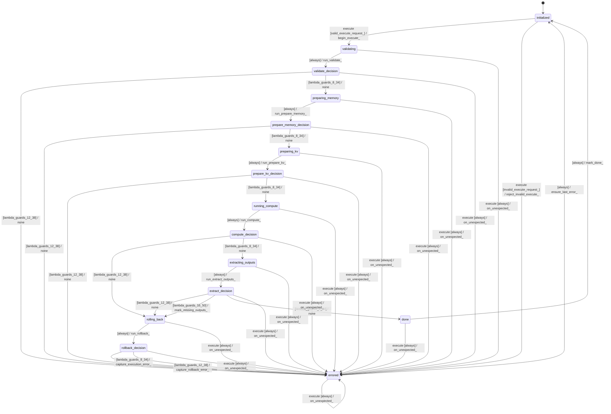

# decoder_ubatch_executor

Source: [`emel/decoder/ubatch_executor/sm.hpp`](https://github.com/stateforward/emel.cpp/blob/main/src/emel/decoder/ubatch_executor/sm.hpp)

## Mermaid

## Transitions

| Source | Event | Guard | Action | Target |
| --- | --- | --- | --- | --- |
| [`initialized`](https://github.com/stateforward/emel.cpp/blob/main/src/emel/decoder/ubatch_executor/sm.hpp) | [`execute`](https://github.com/stateforward/emel.cpp/blob/main/src/emel/decoder/ubatch_executor/sm.hpp) | [`valid_execute_request>`](https://github.com/stateforward/emel.cpp/blob/main/src/emel/decoder/ubatch_executor/sm.hpp) | [`begin_execute>`](https://github.com/stateforward/emel.cpp/blob/main/src/emel/decoder/ubatch_executor/sm.hpp) | [`validating`](https://github.com/stateforward/emel.cpp/blob/main/src/emel/decoder/ubatch_executor/sm.hpp) |
| [`initialized`](https://github.com/stateforward/emel.cpp/blob/main/src/emel/decoder/ubatch_executor/sm.hpp) | [`execute`](https://github.com/stateforward/emel.cpp/blob/main/src/emel/decoder/ubatch_executor/sm.hpp) | [`invalid_execute_request>`](https://github.com/stateforward/emel.cpp/blob/main/src/emel/decoder/ubatch_executor/sm.hpp) | [`reject_invalid_execute>`](https://github.com/stateforward/emel.cpp/blob/main/src/emel/decoder/ubatch_executor/sm.hpp) | [`errored`](https://github.com/stateforward/emel.cpp/blob/main/src/emel/decoder/ubatch_executor/sm.hpp) |
| [`validating`](https://github.com/stateforward/emel.cpp/blob/main/src/emel/decoder/ubatch_executor/sm.hpp) | - | [`always`](https://github.com/stateforward/emel.cpp/blob/main/src/emel/decoder/ubatch_executor/sm.hpp) | [`run_validate>`](https://github.com/stateforward/emel.cpp/blob/main/src/emel/decoder/ubatch_executor/sm.hpp) | [`validate_decision`](https://github.com/stateforward/emel.cpp/blob/main/src/emel/decoder/ubatch_executor/sm.hpp) |
| [`validate_decision`](https://github.com/stateforward/emel.cpp/blob/main/src/emel/decoder/ubatch_executor/sm.hpp) | - | [`lambda_guards_12_38`](https://github.com/stateforward/emel.cpp/blob/main/src/emel/decoder/ubatch_executor/sm.hpp) | [`none`](https://github.com/stateforward/emel.cpp/blob/main/src/emel/decoder/ubatch_executor/sm.hpp) | [`errored`](https://github.com/stateforward/emel.cpp/blob/main/src/emel/decoder/ubatch_executor/sm.hpp) |
| [`validate_decision`](https://github.com/stateforward/emel.cpp/blob/main/src/emel/decoder/ubatch_executor/sm.hpp) | - | [`lambda_guards_8_34`](https://github.com/stateforward/emel.cpp/blob/main/src/emel/decoder/ubatch_executor/sm.hpp) | [`none`](https://github.com/stateforward/emel.cpp/blob/main/src/emel/decoder/ubatch_executor/sm.hpp) | [`preparing_memory`](https://github.com/stateforward/emel.cpp/blob/main/src/emel/decoder/ubatch_executor/sm.hpp) |
| [`preparing_memory`](https://github.com/stateforward/emel.cpp/blob/main/src/emel/decoder/ubatch_executor/sm.hpp) | - | [`always`](https://github.com/stateforward/emel.cpp/blob/main/src/emel/decoder/ubatch_executor/sm.hpp) | [`run_prepare_memory>`](https://github.com/stateforward/emel.cpp/blob/main/src/emel/decoder/ubatch_executor/sm.hpp) | [`prepare_memory_decision`](https://github.com/stateforward/emel.cpp/blob/main/src/emel/decoder/ubatch_executor/sm.hpp) |
| [`prepare_memory_decision`](https://github.com/stateforward/emel.cpp/blob/main/src/emel/decoder/ubatch_executor/sm.hpp) | - | [`lambda_guards_12_38`](https://github.com/stateforward/emel.cpp/blob/main/src/emel/decoder/ubatch_executor/sm.hpp) | [`none`](https://github.com/stateforward/emel.cpp/blob/main/src/emel/decoder/ubatch_executor/sm.hpp) | [`errored`](https://github.com/stateforward/emel.cpp/blob/main/src/emel/decoder/ubatch_executor/sm.hpp) |
| [`prepare_memory_decision`](https://github.com/stateforward/emel.cpp/blob/main/src/emel/decoder/ubatch_executor/sm.hpp) | - | [`lambda_guards_8_34`](https://github.com/stateforward/emel.cpp/blob/main/src/emel/decoder/ubatch_executor/sm.hpp) | [`none`](https://github.com/stateforward/emel.cpp/blob/main/src/emel/decoder/ubatch_executor/sm.hpp) | [`preparing_kv`](https://github.com/stateforward/emel.cpp/blob/main/src/emel/decoder/ubatch_executor/sm.hpp) |
| [`preparing_kv`](https://github.com/stateforward/emel.cpp/blob/main/src/emel/decoder/ubatch_executor/sm.hpp) | - | [`always`](https://github.com/stateforward/emel.cpp/blob/main/src/emel/decoder/ubatch_executor/sm.hpp) | [`run_prepare_kv>`](https://github.com/stateforward/emel.cpp/blob/main/src/emel/decoder/ubatch_executor/sm.hpp) | [`prepare_kv_decision`](https://github.com/stateforward/emel.cpp/blob/main/src/emel/decoder/ubatch_executor/sm.hpp) |
| [`prepare_kv_decision`](https://github.com/stateforward/emel.cpp/blob/main/src/emel/decoder/ubatch_executor/sm.hpp) | - | [`lambda_guards_12_38`](https://github.com/stateforward/emel.cpp/blob/main/src/emel/decoder/ubatch_executor/sm.hpp) | [`none`](https://github.com/stateforward/emel.cpp/blob/main/src/emel/decoder/ubatch_executor/sm.hpp) | [`errored`](https://github.com/stateforward/emel.cpp/blob/main/src/emel/decoder/ubatch_executor/sm.hpp) |
| [`prepare_kv_decision`](https://github.com/stateforward/emel.cpp/blob/main/src/emel/decoder/ubatch_executor/sm.hpp) | - | [`lambda_guards_8_34`](https://github.com/stateforward/emel.cpp/blob/main/src/emel/decoder/ubatch_executor/sm.hpp) | [`none`](https://github.com/stateforward/emel.cpp/blob/main/src/emel/decoder/ubatch_executor/sm.hpp) | [`running_compute`](https://github.com/stateforward/emel.cpp/blob/main/src/emel/decoder/ubatch_executor/sm.hpp) |
| [`running_compute`](https://github.com/stateforward/emel.cpp/blob/main/src/emel/decoder/ubatch_executor/sm.hpp) | - | [`always`](https://github.com/stateforward/emel.cpp/blob/main/src/emel/decoder/ubatch_executor/sm.hpp) | [`run_compute>`](https://github.com/stateforward/emel.cpp/blob/main/src/emel/decoder/ubatch_executor/sm.hpp) | [`compute_decision`](https://github.com/stateforward/emel.cpp/blob/main/src/emel/decoder/ubatch_executor/sm.hpp) |
| [`compute_decision`](https://github.com/stateforward/emel.cpp/blob/main/src/emel/decoder/ubatch_executor/sm.hpp) | - | [`lambda_guards_12_38`](https://github.com/stateforward/emel.cpp/blob/main/src/emel/decoder/ubatch_executor/sm.hpp) | [`none`](https://github.com/stateforward/emel.cpp/blob/main/src/emel/decoder/ubatch_executor/sm.hpp) | [`rolling_back`](https://github.com/stateforward/emel.cpp/blob/main/src/emel/decoder/ubatch_executor/sm.hpp) |
| [`compute_decision`](https://github.com/stateforward/emel.cpp/blob/main/src/emel/decoder/ubatch_executor/sm.hpp) | - | [`lambda_guards_8_34`](https://github.com/stateforward/emel.cpp/blob/main/src/emel/decoder/ubatch_executor/sm.hpp) | [`none`](https://github.com/stateforward/emel.cpp/blob/main/src/emel/decoder/ubatch_executor/sm.hpp) | [`extracting_outputs`](https://github.com/stateforward/emel.cpp/blob/main/src/emel/decoder/ubatch_executor/sm.hpp) |
| [`extracting_outputs`](https://github.com/stateforward/emel.cpp/blob/main/src/emel/decoder/ubatch_executor/sm.hpp) | - | [`always`](https://github.com/stateforward/emel.cpp/blob/main/src/emel/decoder/ubatch_executor/sm.hpp) | [`run_extract_outputs>`](https://github.com/stateforward/emel.cpp/blob/main/src/emel/decoder/ubatch_executor/sm.hpp) | [`extract_decision`](https://github.com/stateforward/emel.cpp/blob/main/src/emel/decoder/ubatch_executor/sm.hpp) |
| [`extract_decision`](https://github.com/stateforward/emel.cpp/blob/main/src/emel/decoder/ubatch_executor/sm.hpp) | - | [`lambda_guards_12_38`](https://github.com/stateforward/emel.cpp/blob/main/src/emel/decoder/ubatch_executor/sm.hpp) | [`none`](https://github.com/stateforward/emel.cpp/blob/main/src/emel/decoder/ubatch_executor/sm.hpp) | [`rolling_back`](https://github.com/stateforward/emel.cpp/blob/main/src/emel/decoder/ubatch_executor/sm.hpp) |
| [`extract_decision`](https://github.com/stateforward/emel.cpp/blob/main/src/emel/decoder/ubatch_executor/sm.hpp) | - | [`lambda_guards_16_50`](https://github.com/stateforward/emel.cpp/blob/main/src/emel/decoder/ubatch_executor/sm.hpp) | [`mark_missing_outputs>`](https://github.com/stateforward/emel.cpp/blob/main/src/emel/decoder/ubatch_executor/sm.hpp) | [`rolling_back`](https://github.com/stateforward/emel.cpp/blob/main/src/emel/decoder/ubatch_executor/sm.hpp) |
| [`extract_decision`](https://github.com/stateforward/emel.cpp/blob/main/src/emel/decoder/ubatch_executor/sm.hpp) | - | [`lambda_guards_8_34`](https://github.com/stateforward/emel.cpp/blob/main/src/emel/decoder/ubatch_executor/sm.hpp) | [`none`](https://github.com/stateforward/emel.cpp/blob/main/src/emel/decoder/ubatch_executor/sm.hpp) | [`done`](https://github.com/stateforward/emel.cpp/blob/main/src/emel/decoder/ubatch_executor/sm.hpp) |
| [`rolling_back`](https://github.com/stateforward/emel.cpp/blob/main/src/emel/decoder/ubatch_executor/sm.hpp) | - | [`always`](https://github.com/stateforward/emel.cpp/blob/main/src/emel/decoder/ubatch_executor/sm.hpp) | [`run_rollback>`](https://github.com/stateforward/emel.cpp/blob/main/src/emel/decoder/ubatch_executor/sm.hpp) | [`rollback_decision`](https://github.com/stateforward/emel.cpp/blob/main/src/emel/decoder/ubatch_executor/sm.hpp) |
| [`rollback_decision`](https://github.com/stateforward/emel.cpp/blob/main/src/emel/decoder/ubatch_executor/sm.hpp) | - | [`lambda_guards_12_38`](https://github.com/stateforward/emel.cpp/blob/main/src/emel/decoder/ubatch_executor/sm.hpp) | [`capture_rollback_error>`](https://github.com/stateforward/emel.cpp/blob/main/src/emel/decoder/ubatch_executor/sm.hpp) | [`errored`](https://github.com/stateforward/emel.cpp/blob/main/src/emel/decoder/ubatch_executor/sm.hpp) |
| [`rollback_decision`](https://github.com/stateforward/emel.cpp/blob/main/src/emel/decoder/ubatch_executor/sm.hpp) | - | [`lambda_guards_8_34`](https://github.com/stateforward/emel.cpp/blob/main/src/emel/decoder/ubatch_executor/sm.hpp) | [`capture_execution_error>`](https://github.com/stateforward/emel.cpp/blob/main/src/emel/decoder/ubatch_executor/sm.hpp) | [`errored`](https://github.com/stateforward/emel.cpp/blob/main/src/emel/decoder/ubatch_executor/sm.hpp) |
| [`done`](https://github.com/stateforward/emel.cpp/blob/main/src/emel/decoder/ubatch_executor/sm.hpp) | - | [`always`](https://github.com/stateforward/emel.cpp/blob/main/src/emel/decoder/ubatch_executor/sm.hpp) | [`mark_done>`](https://github.com/stateforward/emel.cpp/blob/main/src/emel/decoder/ubatch_executor/sm.hpp) | [`initialized`](https://github.com/stateforward/emel.cpp/blob/main/src/emel/decoder/ubatch_executor/sm.hpp) |
| [`errored`](https://github.com/stateforward/emel.cpp/blob/main/src/emel/decoder/ubatch_executor/sm.hpp) | - | [`always`](https://github.com/stateforward/emel.cpp/blob/main/src/emel/decoder/ubatch_executor/sm.hpp) | [`ensure_last_error>`](https://github.com/stateforward/emel.cpp/blob/main/src/emel/decoder/ubatch_executor/sm.hpp) | [`initialized`](https://github.com/stateforward/emel.cpp/blob/main/src/emel/decoder/ubatch_executor/sm.hpp) |
| [`validating`](https://github.com/stateforward/emel.cpp/blob/main/src/emel/decoder/ubatch_executor/sm.hpp) | [`execute`](https://github.com/stateforward/emel.cpp/blob/main/src/emel/decoder/ubatch_executor/sm.hpp) | [`always`](https://github.com/stateforward/emel.cpp/blob/main/src/emel/decoder/ubatch_executor/sm.hpp) | [`on_unexpected>`](https://github.com/stateforward/emel.cpp/blob/main/src/emel/decoder/ubatch_executor/sm.hpp) | [`errored`](https://github.com/stateforward/emel.cpp/blob/main/src/emel/decoder/ubatch_executor/sm.hpp) |
| [`validate_decision`](https://github.com/stateforward/emel.cpp/blob/main/src/emel/decoder/ubatch_executor/sm.hpp) | [`execute`](https://github.com/stateforward/emel.cpp/blob/main/src/emel/decoder/ubatch_executor/sm.hpp) | [`always`](https://github.com/stateforward/emel.cpp/blob/main/src/emel/decoder/ubatch_executor/sm.hpp) | [`on_unexpected>`](https://github.com/stateforward/emel.cpp/blob/main/src/emel/decoder/ubatch_executor/sm.hpp) | [`errored`](https://github.com/stateforward/emel.cpp/blob/main/src/emel/decoder/ubatch_executor/sm.hpp) |
| [`preparing_memory`](https://github.com/stateforward/emel.cpp/blob/main/src/emel/decoder/ubatch_executor/sm.hpp) | [`execute`](https://github.com/stateforward/emel.cpp/blob/main/src/emel/decoder/ubatch_executor/sm.hpp) | [`always`](https://github.com/stateforward/emel.cpp/blob/main/src/emel/decoder/ubatch_executor/sm.hpp) | [`on_unexpected>`](https://github.com/stateforward/emel.cpp/blob/main/src/emel/decoder/ubatch_executor/sm.hpp) | [`errored`](https://github.com/stateforward/emel.cpp/blob/main/src/emel/decoder/ubatch_executor/sm.hpp) |
| [`prepare_memory_decision`](https://github.com/stateforward/emel.cpp/blob/main/src/emel/decoder/ubatch_executor/sm.hpp) | [`execute`](https://github.com/stateforward/emel.cpp/blob/main/src/emel/decoder/ubatch_executor/sm.hpp) | [`always`](https://github.com/stateforward/emel.cpp/blob/main/src/emel/decoder/ubatch_executor/sm.hpp) | [`on_unexpected>`](https://github.com/stateforward/emel.cpp/blob/main/src/emel/decoder/ubatch_executor/sm.hpp) | [`errored`](https://github.com/stateforward/emel.cpp/blob/main/src/emel/decoder/ubatch_executor/sm.hpp) |
| [`preparing_kv`](https://github.com/stateforward/emel.cpp/blob/main/src/emel/decoder/ubatch_executor/sm.hpp) | [`execute`](https://github.com/stateforward/emel.cpp/blob/main/src/emel/decoder/ubatch_executor/sm.hpp) | [`always`](https://github.com/stateforward/emel.cpp/blob/main/src/emel/decoder/ubatch_executor/sm.hpp) | [`on_unexpected>`](https://github.com/stateforward/emel.cpp/blob/main/src/emel/decoder/ubatch_executor/sm.hpp) | [`errored`](https://github.com/stateforward/emel.cpp/blob/main/src/emel/decoder/ubatch_executor/sm.hpp) |
| [`prepare_kv_decision`](https://github.com/stateforward/emel.cpp/blob/main/src/emel/decoder/ubatch_executor/sm.hpp) | [`execute`](https://github.com/stateforward/emel.cpp/blob/main/src/emel/decoder/ubatch_executor/sm.hpp) | [`always`](https://github.com/stateforward/emel.cpp/blob/main/src/emel/decoder/ubatch_executor/sm.hpp) | [`on_unexpected>`](https://github.com/stateforward/emel.cpp/blob/main/src/emel/decoder/ubatch_executor/sm.hpp) | [`errored`](https://github.com/stateforward/emel.cpp/blob/main/src/emel/decoder/ubatch_executor/sm.hpp) |
| [`running_compute`](https://github.com/stateforward/emel.cpp/blob/main/src/emel/decoder/ubatch_executor/sm.hpp) | [`execute`](https://github.com/stateforward/emel.cpp/blob/main/src/emel/decoder/ubatch_executor/sm.hpp) | [`always`](https://github.com/stateforward/emel.cpp/blob/main/src/emel/decoder/ubatch_executor/sm.hpp) | [`on_unexpected>`](https://github.com/stateforward/emel.cpp/blob/main/src/emel/decoder/ubatch_executor/sm.hpp) | [`errored`](https://github.com/stateforward/emel.cpp/blob/main/src/emel/decoder/ubatch_executor/sm.hpp) |
| [`compute_decision`](https://github.com/stateforward/emel.cpp/blob/main/src/emel/decoder/ubatch_executor/sm.hpp) | [`execute`](https://github.com/stateforward/emel.cpp/blob/main/src/emel/decoder/ubatch_executor/sm.hpp) | [`always`](https://github.com/stateforward/emel.cpp/blob/main/src/emel/decoder/ubatch_executor/sm.hpp) | [`on_unexpected>`](https://github.com/stateforward/emel.cpp/blob/main/src/emel/decoder/ubatch_executor/sm.hpp) | [`errored`](https://github.com/stateforward/emel.cpp/blob/main/src/emel/decoder/ubatch_executor/sm.hpp) |
| [`extracting_outputs`](https://github.com/stateforward/emel.cpp/blob/main/src/emel/decoder/ubatch_executor/sm.hpp) | [`execute`](https://github.com/stateforward/emel.cpp/blob/main/src/emel/decoder/ubatch_executor/sm.hpp) | [`always`](https://github.com/stateforward/emel.cpp/blob/main/src/emel/decoder/ubatch_executor/sm.hpp) | [`on_unexpected>`](https://github.com/stateforward/emel.cpp/blob/main/src/emel/decoder/ubatch_executor/sm.hpp) | [`errored`](https://github.com/stateforward/emel.cpp/blob/main/src/emel/decoder/ubatch_executor/sm.hpp) |
| [`extract_decision`](https://github.com/stateforward/emel.cpp/blob/main/src/emel/decoder/ubatch_executor/sm.hpp) | [`execute`](https://github.com/stateforward/emel.cpp/blob/main/src/emel/decoder/ubatch_executor/sm.hpp) | [`always`](https://github.com/stateforward/emel.cpp/blob/main/src/emel/decoder/ubatch_executor/sm.hpp) | [`on_unexpected>`](https://github.com/stateforward/emel.cpp/blob/main/src/emel/decoder/ubatch_executor/sm.hpp) | [`errored`](https://github.com/stateforward/emel.cpp/blob/main/src/emel/decoder/ubatch_executor/sm.hpp) |
| [`rolling_back`](https://github.com/stateforward/emel.cpp/blob/main/src/emel/decoder/ubatch_executor/sm.hpp) | [`execute`](https://github.com/stateforward/emel.cpp/blob/main/src/emel/decoder/ubatch_executor/sm.hpp) | [`always`](https://github.com/stateforward/emel.cpp/blob/main/src/emel/decoder/ubatch_executor/sm.hpp) | [`on_unexpected>`](https://github.com/stateforward/emel.cpp/blob/main/src/emel/decoder/ubatch_executor/sm.hpp) | [`errored`](https://github.com/stateforward/emel.cpp/blob/main/src/emel/decoder/ubatch_executor/sm.hpp) |
| [`rollback_decision`](https://github.com/stateforward/emel.cpp/blob/main/src/emel/decoder/ubatch_executor/sm.hpp) | [`execute`](https://github.com/stateforward/emel.cpp/blob/main/src/emel/decoder/ubatch_executor/sm.hpp) | [`always`](https://github.com/stateforward/emel.cpp/blob/main/src/emel/decoder/ubatch_executor/sm.hpp) | [`on_unexpected>`](https://github.com/stateforward/emel.cpp/blob/main/src/emel/decoder/ubatch_executor/sm.hpp) | [`errored`](https://github.com/stateforward/emel.cpp/blob/main/src/emel/decoder/ubatch_executor/sm.hpp) |
| [`done`](https://github.com/stateforward/emel.cpp/blob/main/src/emel/decoder/ubatch_executor/sm.hpp) | [`execute`](https://github.com/stateforward/emel.cpp/blob/main/src/emel/decoder/ubatch_executor/sm.hpp) | [`always`](https://github.com/stateforward/emel.cpp/blob/main/src/emel/decoder/ubatch_executor/sm.hpp) | [`on_unexpected>`](https://github.com/stateforward/emel.cpp/blob/main/src/emel/decoder/ubatch_executor/sm.hpp) | [`errored`](https://github.com/stateforward/emel.cpp/blob/main/src/emel/decoder/ubatch_executor/sm.hpp) |
| [`errored`](https://github.com/stateforward/emel.cpp/blob/main/src/emel/decoder/ubatch_executor/sm.hpp) | [`execute`](https://github.com/stateforward/emel.cpp/blob/main/src/emel/decoder/ubatch_executor/sm.hpp) | [`always`](https://github.com/stateforward/emel.cpp/blob/main/src/emel/decoder/ubatch_executor/sm.hpp) | [`on_unexpected>`](https://github.com/stateforward/emel.cpp/blob/main/src/emel/decoder/ubatch_executor/sm.hpp) | [`errored`](https://github.com/stateforward/emel.cpp/blob/main/src/emel/decoder/ubatch_executor/sm.hpp) |
