# encoder

Source: [`emel/encoder/sm.hpp`](https://github.com/stateforward/emel.cpp/blob/main/emel/encoder/sm.hpp)

## Mermaid

```mermaid
stateDiagram-v2
  [*] --> initialized
  initialized --> pretokenizing : emel__encoder__event__encode [boost__sml__front__always] / boost__sml__aux__zero_wrapper_emel__encoder__action___lambda_at__Users_gabrielwillen_VSCode_stateforward_emel_emel_cpp_src_emel_encoder_actions_hpp_5_45__
  pretokenizing --> selecting_algorithm : emel__encoder__event__pretokenizing_done [boost__sml__front__always] / boost__sml__aux__zero_wrapper_emel__encoder__action___lambda_at__Users_gabrielwillen_VSCode_stateforward_emel_emel_cpp_src_emel_encoder_actions_hpp_6_47__
  pretokenizing --> errored : emel__encoder__event__pretokenizing_error [boost__sml__front__always] / boost__sml__aux__zero_wrapper_emel__encoder__action___lambda_at__Users_gabrielwillen_VSCode_stateforward_emel_emel_cpp_src_emel_encoder_actions_hpp_7_48__
  selecting_algorithm --> merging : emel__encoder__event__algorithm_selected [boost__sml__aux__zero_wrapper_emel__encoder__guard___lambda_at__Users_gabrielwillen_VSCode_stateforward_emel_emel_cpp_src_emel_encoder_guards_hpp_9_37__] / boost__sml__front__none
  selecting_algorithm --> searching : emel__encoder__event__algorithm_selected [boost__sml__aux__zero_wrapper_emel__encoder__guard___lambda_at__Users_gabrielwillen_VSCode_stateforward_emel_emel_cpp_src_emel_encoder_guards_hpp_12_39__] / boost__sml__front__none
  selecting_algorithm --> scanning : emel__encoder__event__algorithm_selected [boost__sml__aux__zero_wrapper_emel__encoder__guard___lambda_at__Users_gabrielwillen_VSCode_stateforward_emel_emel_cpp_src_emel_encoder_guards_hpp_15_38__] / boost__sml__front__none
  merging --> emitting_tokens : emel__encoder__event__algorithm_step_done [boost__sml__front__always] / boost__sml__aux__zero_wrapper_emel__encoder__action___lambda_at__Users_gabrielwillen_VSCode_stateforward_emel_emel_cpp_src_emel_encoder_actions_hpp_8_48__
  merging --> errored : emel__encoder__event__algorithm_step_error [boost__sml__front__always] / boost__sml__aux__zero_wrapper_emel__encoder__action___lambda_at__Users_gabrielwillen_VSCode_stateforward_emel_emel_cpp_src_emel_encoder_actions_hpp_9_49__
  searching --> emitting_tokens : emel__encoder__event__algorithm_step_done [boost__sml__front__always] / boost__sml__aux__zero_wrapper_emel__encoder__action___lambda_at__Users_gabrielwillen_VSCode_stateforward_emel_emel_cpp_src_emel_encoder_actions_hpp_8_48__
  searching --> errored : emel__encoder__event__algorithm_step_error [boost__sml__front__always] / boost__sml__aux__zero_wrapper_emel__encoder__action___lambda_at__Users_gabrielwillen_VSCode_stateforward_emel_emel_cpp_src_emel_encoder_actions_hpp_9_49__
  scanning --> emitting_tokens : emel__encoder__event__algorithm_step_done [boost__sml__front__always] / boost__sml__aux__zero_wrapper_emel__encoder__action___lambda_at__Users_gabrielwillen_VSCode_stateforward_emel_emel_cpp_src_emel_encoder_actions_hpp_8_48__
  scanning --> errored : emel__encoder__event__algorithm_step_error [boost__sml__front__always] / boost__sml__aux__zero_wrapper_emel__encoder__action___lambda_at__Users_gabrielwillen_VSCode_stateforward_emel_emel_cpp_src_emel_encoder_actions_hpp_9_49__
  emitting_tokens --> applying_backend_postrules : emel__encoder__event__emission_done [boost__sml__front__always] / boost__sml__aux__zero_wrapper_emel__encoder__action___lambda_at__Users_gabrielwillen_VSCode_stateforward_emel_emel_cpp_src_emel_encoder_actions_hpp_10_42__
  emitting_tokens --> errored : emel__encoder__event__emission_error [boost__sml__front__always] / boost__sml__aux__zero_wrapper_emel__encoder__action___lambda_at__Users_gabrielwillen_VSCode_stateforward_emel_emel_cpp_src_emel_encoder_actions_hpp_11_43__
  applying_backend_postrules --> done : emel__encoder__event__postrules_done [boost__sml__front__always] / boost__sml__aux__zero_wrapper_emel__encoder__action___lambda_at__Users_gabrielwillen_VSCode_stateforward_emel_emel_cpp_src_emel_encoder_actions_hpp_12_43__
  applying_backend_postrules --> errored : emel__encoder__event__postrules_error [boost__sml__front__always] / boost__sml__aux__zero_wrapper_emel__encoder__action___lambda_at__Users_gabrielwillen_VSCode_stateforward_emel_emel_cpp_src_emel_encoder_actions_hpp_13_44__
  done --> done : emel__encoder__event__tokenized_done [boost__sml__front__always] / boost__sml__aux__zero_wrapper_emel__encoder__action___lambda_at__Users_gabrielwillen_VSCode_stateforward_emel_emel_cpp_src_emel_encoder_actions_hpp_14_57__
  errored --> errored : emel__encoder__event__tokenized_error [boost__sml__front__always] / boost__sml__aux__zero_wrapper_emel__encoder__action___lambda_at__Users_gabrielwillen_VSCode_stateforward_emel_emel_cpp_src_emel_encoder_actions_hpp_15_58__
```

## Transitions

| Source | Event | Guard | Action | Target |
| --- | --- | --- | --- | --- |
| [`initialized`](https://github.com/stateforward/emel.cpp/blob/main/emel/encoder/sm.hpp) | [`encode`](https://github.com/stateforward/emel.cpp/blob/main/emel/encoder/sm.hpp) | [`always`](https://github.com/stateforward/emel.cpp/blob/main/emel/encoder/sm.hpp) | [`(lambda at /Users/gabrielwillen/VSCode/stateforward/emel/emel.cpp/src/emel/encoder/actions.hpp:5:45)>`](https://github.com/stateforward/emel.cpp/blob/main/emel/encoder/sm.hpp) | [`pretokenizing`](https://github.com/stateforward/emel.cpp/blob/main/emel/encoder/sm.hpp) |
| [`pretokenizing`](https://github.com/stateforward/emel.cpp/blob/main/emel/encoder/sm.hpp) | [`pretokenizing_done`](https://github.com/stateforward/emel.cpp/blob/main/emel/encoder/sm.hpp) | [`always`](https://github.com/stateforward/emel.cpp/blob/main/emel/encoder/sm.hpp) | [`(lambda at /Users/gabrielwillen/VSCode/stateforward/emel/emel.cpp/src/emel/encoder/actions.hpp:6:47)>`](https://github.com/stateforward/emel.cpp/blob/main/emel/encoder/sm.hpp) | [`selecting_algorithm`](https://github.com/stateforward/emel.cpp/blob/main/emel/encoder/sm.hpp) |
| [`pretokenizing`](https://github.com/stateforward/emel.cpp/blob/main/emel/encoder/sm.hpp) | [`pretokenizing_error`](https://github.com/stateforward/emel.cpp/blob/main/emel/encoder/sm.hpp) | [`always`](https://github.com/stateforward/emel.cpp/blob/main/emel/encoder/sm.hpp) | [`(lambda at /Users/gabrielwillen/VSCode/stateforward/emel/emel.cpp/src/emel/encoder/actions.hpp:7:48)>`](https://github.com/stateforward/emel.cpp/blob/main/emel/encoder/sm.hpp) | [`errored`](https://github.com/stateforward/emel.cpp/blob/main/emel/encoder/sm.hpp) |
| [`selecting_algorithm`](https://github.com/stateforward/emel.cpp/blob/main/emel/encoder/sm.hpp) | [`algorithm_selected`](https://github.com/stateforward/emel.cpp/blob/main/emel/encoder/sm.hpp) | [`(lambda at /Users/gabrielwillen/VSCode/stateforward/emel/emel.cpp/src/emel/encoder/guards.hpp:9:37)>`](https://github.com/stateforward/emel.cpp/blob/main/emel/encoder/sm.hpp) | [`none`](https://github.com/stateforward/emel.cpp/blob/main/emel/encoder/sm.hpp) | [`merging`](https://github.com/stateforward/emel.cpp/blob/main/emel/encoder/sm.hpp) |
| [`selecting_algorithm`](https://github.com/stateforward/emel.cpp/blob/main/emel/encoder/sm.hpp) | [`algorithm_selected`](https://github.com/stateforward/emel.cpp/blob/main/emel/encoder/sm.hpp) | [`(lambda at /Users/gabrielwillen/VSCode/stateforward/emel/emel.cpp/src/emel/encoder/guards.hpp:12:39)>`](https://github.com/stateforward/emel.cpp/blob/main/emel/encoder/sm.hpp) | [`none`](https://github.com/stateforward/emel.cpp/blob/main/emel/encoder/sm.hpp) | [`searching`](https://github.com/stateforward/emel.cpp/blob/main/emel/encoder/sm.hpp) |
| [`selecting_algorithm`](https://github.com/stateforward/emel.cpp/blob/main/emel/encoder/sm.hpp) | [`algorithm_selected`](https://github.com/stateforward/emel.cpp/blob/main/emel/encoder/sm.hpp) | [`(lambda at /Users/gabrielwillen/VSCode/stateforward/emel/emel.cpp/src/emel/encoder/guards.hpp:15:38)>`](https://github.com/stateforward/emel.cpp/blob/main/emel/encoder/sm.hpp) | [`none`](https://github.com/stateforward/emel.cpp/blob/main/emel/encoder/sm.hpp) | [`scanning`](https://github.com/stateforward/emel.cpp/blob/main/emel/encoder/sm.hpp) |
| [`merging`](https://github.com/stateforward/emel.cpp/blob/main/emel/encoder/sm.hpp) | [`algorithm_step_done`](https://github.com/stateforward/emel.cpp/blob/main/emel/encoder/sm.hpp) | [`always`](https://github.com/stateforward/emel.cpp/blob/main/emel/encoder/sm.hpp) | [`(lambda at /Users/gabrielwillen/VSCode/stateforward/emel/emel.cpp/src/emel/encoder/actions.hpp:8:48)>`](https://github.com/stateforward/emel.cpp/blob/main/emel/encoder/sm.hpp) | [`emitting_tokens`](https://github.com/stateforward/emel.cpp/blob/main/emel/encoder/sm.hpp) |
| [`merging`](https://github.com/stateforward/emel.cpp/blob/main/emel/encoder/sm.hpp) | [`algorithm_step_error`](https://github.com/stateforward/emel.cpp/blob/main/emel/encoder/sm.hpp) | [`always`](https://github.com/stateforward/emel.cpp/blob/main/emel/encoder/sm.hpp) | [`(lambda at /Users/gabrielwillen/VSCode/stateforward/emel/emel.cpp/src/emel/encoder/actions.hpp:9:49)>`](https://github.com/stateforward/emel.cpp/blob/main/emel/encoder/sm.hpp) | [`errored`](https://github.com/stateforward/emel.cpp/blob/main/emel/encoder/sm.hpp) |
| [`searching`](https://github.com/stateforward/emel.cpp/blob/main/emel/encoder/sm.hpp) | [`algorithm_step_done`](https://github.com/stateforward/emel.cpp/blob/main/emel/encoder/sm.hpp) | [`always`](https://github.com/stateforward/emel.cpp/blob/main/emel/encoder/sm.hpp) | [`(lambda at /Users/gabrielwillen/VSCode/stateforward/emel/emel.cpp/src/emel/encoder/actions.hpp:8:48)>`](https://github.com/stateforward/emel.cpp/blob/main/emel/encoder/sm.hpp) | [`emitting_tokens`](https://github.com/stateforward/emel.cpp/blob/main/emel/encoder/sm.hpp) |
| [`searching`](https://github.com/stateforward/emel.cpp/blob/main/emel/encoder/sm.hpp) | [`algorithm_step_error`](https://github.com/stateforward/emel.cpp/blob/main/emel/encoder/sm.hpp) | [`always`](https://github.com/stateforward/emel.cpp/blob/main/emel/encoder/sm.hpp) | [`(lambda at /Users/gabrielwillen/VSCode/stateforward/emel/emel.cpp/src/emel/encoder/actions.hpp:9:49)>`](https://github.com/stateforward/emel.cpp/blob/main/emel/encoder/sm.hpp) | [`errored`](https://github.com/stateforward/emel.cpp/blob/main/emel/encoder/sm.hpp) |
| [`scanning`](https://github.com/stateforward/emel.cpp/blob/main/emel/encoder/sm.hpp) | [`algorithm_step_done`](https://github.com/stateforward/emel.cpp/blob/main/emel/encoder/sm.hpp) | [`always`](https://github.com/stateforward/emel.cpp/blob/main/emel/encoder/sm.hpp) | [`(lambda at /Users/gabrielwillen/VSCode/stateforward/emel/emel.cpp/src/emel/encoder/actions.hpp:8:48)>`](https://github.com/stateforward/emel.cpp/blob/main/emel/encoder/sm.hpp) | [`emitting_tokens`](https://github.com/stateforward/emel.cpp/blob/main/emel/encoder/sm.hpp) |
| [`scanning`](https://github.com/stateforward/emel.cpp/blob/main/emel/encoder/sm.hpp) | [`algorithm_step_error`](https://github.com/stateforward/emel.cpp/blob/main/emel/encoder/sm.hpp) | [`always`](https://github.com/stateforward/emel.cpp/blob/main/emel/encoder/sm.hpp) | [`(lambda at /Users/gabrielwillen/VSCode/stateforward/emel/emel.cpp/src/emel/encoder/actions.hpp:9:49)>`](https://github.com/stateforward/emel.cpp/blob/main/emel/encoder/sm.hpp) | [`errored`](https://github.com/stateforward/emel.cpp/blob/main/emel/encoder/sm.hpp) |
| [`emitting_tokens`](https://github.com/stateforward/emel.cpp/blob/main/emel/encoder/sm.hpp) | [`emission_done`](https://github.com/stateforward/emel.cpp/blob/main/emel/encoder/sm.hpp) | [`always`](https://github.com/stateforward/emel.cpp/blob/main/emel/encoder/sm.hpp) | [`(lambda at /Users/gabrielwillen/VSCode/stateforward/emel/emel.cpp/src/emel/encoder/actions.hpp:10:42)>`](https://github.com/stateforward/emel.cpp/blob/main/emel/encoder/sm.hpp) | [`applying_backend_postrules`](https://github.com/stateforward/emel.cpp/blob/main/emel/encoder/sm.hpp) |
| [`emitting_tokens`](https://github.com/stateforward/emel.cpp/blob/main/emel/encoder/sm.hpp) | [`emission_error`](https://github.com/stateforward/emel.cpp/blob/main/emel/encoder/sm.hpp) | [`always`](https://github.com/stateforward/emel.cpp/blob/main/emel/encoder/sm.hpp) | [`(lambda at /Users/gabrielwillen/VSCode/stateforward/emel/emel.cpp/src/emel/encoder/actions.hpp:11:43)>`](https://github.com/stateforward/emel.cpp/blob/main/emel/encoder/sm.hpp) | [`errored`](https://github.com/stateforward/emel.cpp/blob/main/emel/encoder/sm.hpp) |
| [`applying_backend_postrules`](https://github.com/stateforward/emel.cpp/blob/main/emel/encoder/sm.hpp) | [`postrules_done`](https://github.com/stateforward/emel.cpp/blob/main/emel/encoder/sm.hpp) | [`always`](https://github.com/stateforward/emel.cpp/blob/main/emel/encoder/sm.hpp) | [`(lambda at /Users/gabrielwillen/VSCode/stateforward/emel/emel.cpp/src/emel/encoder/actions.hpp:12:43)>`](https://github.com/stateforward/emel.cpp/blob/main/emel/encoder/sm.hpp) | [`done`](https://github.com/stateforward/emel.cpp/blob/main/emel/encoder/sm.hpp) |
| [`applying_backend_postrules`](https://github.com/stateforward/emel.cpp/blob/main/emel/encoder/sm.hpp) | [`postrules_error`](https://github.com/stateforward/emel.cpp/blob/main/emel/encoder/sm.hpp) | [`always`](https://github.com/stateforward/emel.cpp/blob/main/emel/encoder/sm.hpp) | [`(lambda at /Users/gabrielwillen/VSCode/stateforward/emel/emel.cpp/src/emel/encoder/actions.hpp:13:44)>`](https://github.com/stateforward/emel.cpp/blob/main/emel/encoder/sm.hpp) | [`errored`](https://github.com/stateforward/emel.cpp/blob/main/emel/encoder/sm.hpp) |
| [`done`](https://github.com/stateforward/emel.cpp/blob/main/emel/encoder/sm.hpp) | [`tokenized_done`](https://github.com/stateforward/emel.cpp/blob/main/emel/encoder/sm.hpp) | [`always`](https://github.com/stateforward/emel.cpp/blob/main/emel/encoder/sm.hpp) | [`(lambda at /Users/gabrielwillen/VSCode/stateforward/emel/emel.cpp/src/emel/encoder/actions.hpp:14:57)>`](https://github.com/stateforward/emel.cpp/blob/main/emel/encoder/sm.hpp) | [`done`](https://github.com/stateforward/emel.cpp/blob/main/emel/encoder/sm.hpp) |
| [`errored`](https://github.com/stateforward/emel.cpp/blob/main/emel/encoder/sm.hpp) | [`tokenized_error`](https://github.com/stateforward/emel.cpp/blob/main/emel/encoder/sm.hpp) | [`always`](https://github.com/stateforward/emel.cpp/blob/main/emel/encoder/sm.hpp) | [`(lambda at /Users/gabrielwillen/VSCode/stateforward/emel/emel.cpp/src/emel/encoder/actions.hpp:15:58)>`](https://github.com/stateforward/emel.cpp/blob/main/emel/encoder/sm.hpp) | [`errored`](https://github.com/stateforward/emel.cpp/blob/main/emel/encoder/sm.hpp) |
