# encoder_plamo2

Source: [`emel/encoder/plamo2/sm.hpp`](https://github.com/stateforward/emel.cpp/blob/main/src/emel/encoder/plamo2/sm.hpp)

## Mermaid

```mermaid
stateDiagram-v2
  [*] --> emel__encoder__plamo2__initialized
  emel__encoder__plamo2__initialized --> emel__encoder__plamo2__encoding : emel__encoder__event__encode [boost__sml__aux__zero_wrapper_emel__encoder__plamo2__guard__valid_encode_] / boost__sml__aux__zero_wrapper_emel__encoder__plamo2__action__begin_encode_
  emel__encoder__plamo2__initialized --> emel__encoder__plamo2__errored : emel__encoder__event__encode [boost__sml__aux__zero_wrapper_emel__encoder__plamo2__guard__invalid_encode_] / boost__sml__aux__zero_wrapper_emel__encoder__plamo2__action__reject_invalid_encode_
  emel__encoder__plamo2__done --> emel__encoder__plamo2__encoding : emel__encoder__event__encode [boost__sml__aux__zero_wrapper_emel__encoder__plamo2__guard__valid_encode_] / boost__sml__aux__zero_wrapper_emel__encoder__plamo2__action__begin_encode_
  emel__encoder__plamo2__done --> emel__encoder__plamo2__errored : emel__encoder__event__encode [boost__sml__aux__zero_wrapper_emel__encoder__plamo2__guard__invalid_encode_] / boost__sml__aux__zero_wrapper_emel__encoder__plamo2__action__reject_invalid_encode_
  emel__encoder__plamo2__errored --> emel__encoder__plamo2__encoding : emel__encoder__event__encode [boost__sml__aux__zero_wrapper_emel__encoder__plamo2__guard__valid_encode_] / boost__sml__aux__zero_wrapper_emel__encoder__plamo2__action__begin_encode_
  emel__encoder__plamo2__errored --> emel__encoder__plamo2__errored : emel__encoder__event__encode [boost__sml__aux__zero_wrapper_emel__encoder__plamo2__guard__invalid_encode_] / boost__sml__aux__zero_wrapper_emel__encoder__plamo2__action__reject_invalid_encode_
  emel__encoder__plamo2__unexpected --> emel__encoder__plamo2__encoding : emel__encoder__event__encode [boost__sml__aux__zero_wrapper_emel__encoder__plamo2__guard__valid_encode_] / boost__sml__aux__zero_wrapper_emel__encoder__plamo2__action__begin_encode_
  emel__encoder__plamo2__unexpected --> emel__encoder__plamo2__unexpected : emel__encoder__event__encode [boost__sml__aux__zero_wrapper_emel__encoder__plamo2__guard__invalid_encode_] / boost__sml__aux__zero_wrapper_emel__encoder__plamo2__action__reject_invalid_encode_
  emel__encoder__plamo2__encoding --> emel__encoder__plamo2__encode_decision : [boost__sml__front__always] / boost__sml__aux__zero_wrapper_emel__encoder__plamo2__action__run_encode_
  emel__encoder__plamo2__encode_decision --> emel__encoder__plamo2__done : [boost__sml__aux__zero_wrapper_emel__encoder__plamo2__guard__phase_ok_] / boost__sml__aux__zero_wrapper_emel__encoder__plamo2__action__mark_done_
  emel__encoder__plamo2__encode_decision --> emel__encoder__plamo2__errored : [boost__sml__aux__zero_wrapper_emel__encoder__plamo2__guard__phase_failed_] / boost__sml__aux__zero_wrapper_emel__encoder__plamo2__action__ensure_last_error_
  emel__encoder__plamo2__encoding --> emel__encoder__plamo2__unexpected : emel__encoder__event__encode [boost__sml__front__always] / boost__sml__aux__zero_wrapper_emel__encoder__plamo2__action__on_unexpected_
  emel__encoder__plamo2__encode_decision --> emel__encoder__plamo2__unexpected : emel__encoder__event__encode [boost__sml__front__always] / boost__sml__aux__zero_wrapper_emel__encoder__plamo2__action__on_unexpected_
  emel__encoder__plamo2__initialized --> emel__encoder__plamo2__unexpected : emel__encoder__events__encoding_done [boost__sml__front__always] / boost__sml__aux__zero_wrapper_emel__encoder__plamo2__action__on_unexpected_
  emel__encoder__plamo2__initialized --> emel__encoder__plamo2__unexpected : emel__encoder__events__encoding_error [boost__sml__front__always] / boost__sml__aux__zero_wrapper_emel__encoder__plamo2__action__on_unexpected_
  emel__encoder__plamo2__encoding --> emel__encoder__plamo2__unexpected : emel__encoder__events__encoding_done [boost__sml__front__always] / boost__sml__aux__zero_wrapper_emel__encoder__plamo2__action__on_unexpected_
  emel__encoder__plamo2__encoding --> emel__encoder__plamo2__unexpected : emel__encoder__events__encoding_error [boost__sml__front__always] / boost__sml__aux__zero_wrapper_emel__encoder__plamo2__action__on_unexpected_
  emel__encoder__plamo2__encode_decision --> emel__encoder__plamo2__unexpected : emel__encoder__events__encoding_done [boost__sml__front__always] / boost__sml__aux__zero_wrapper_emel__encoder__plamo2__action__on_unexpected_
  emel__encoder__plamo2__encode_decision --> emel__encoder__plamo2__unexpected : emel__encoder__events__encoding_error [boost__sml__front__always] / boost__sml__aux__zero_wrapper_emel__encoder__plamo2__action__on_unexpected_
  emel__encoder__plamo2__done --> emel__encoder__plamo2__unexpected : emel__encoder__events__encoding_done [boost__sml__front__always] / boost__sml__aux__zero_wrapper_emel__encoder__plamo2__action__on_unexpected_
  emel__encoder__plamo2__done --> emel__encoder__plamo2__unexpected : emel__encoder__events__encoding_error [boost__sml__front__always] / boost__sml__aux__zero_wrapper_emel__encoder__plamo2__action__on_unexpected_
  emel__encoder__plamo2__errored --> emel__encoder__plamo2__unexpected : emel__encoder__events__encoding_done [boost__sml__front__always] / boost__sml__aux__zero_wrapper_emel__encoder__plamo2__action__on_unexpected_
  emel__encoder__plamo2__errored --> emel__encoder__plamo2__unexpected : emel__encoder__events__encoding_error [boost__sml__front__always] / boost__sml__aux__zero_wrapper_emel__encoder__plamo2__action__on_unexpected_
  emel__encoder__plamo2__unexpected --> emel__encoder__plamo2__unexpected : emel__encoder__events__encoding_done [boost__sml__front__always] / boost__sml__aux__zero_wrapper_emel__encoder__plamo2__action__on_unexpected_
  emel__encoder__plamo2__unexpected --> emel__encoder__plamo2__unexpected : emel__encoder__events__encoding_error [boost__sml__front__always] / boost__sml__aux__zero_wrapper_emel__encoder__plamo2__action__on_unexpected_
  emel__encoder__plamo2__initialized --> emel__encoder__plamo2__unexpected : internal_event [boost__sml__front__always] / boost__sml__aux__zero_wrapper_emel__encoder__plamo2__action__on_unexpected_
  emel__encoder__plamo2__encoding --> emel__encoder__plamo2__unexpected : internal_event [boost__sml__front__always] / boost__sml__aux__zero_wrapper_emel__encoder__plamo2__action__on_unexpected_
  emel__encoder__plamo2__encode_decision --> emel__encoder__plamo2__unexpected : internal_event [boost__sml__front__always] / boost__sml__aux__zero_wrapper_emel__encoder__plamo2__action__on_unexpected_
  emel__encoder__plamo2__done --> emel__encoder__plamo2__unexpected : internal_event [boost__sml__front__always] / boost__sml__aux__zero_wrapper_emel__encoder__plamo2__action__on_unexpected_
  emel__encoder__plamo2__errored --> emel__encoder__plamo2__unexpected : internal_event [boost__sml__front__always] / boost__sml__aux__zero_wrapper_emel__encoder__plamo2__action__on_unexpected_
  emel__encoder__plamo2__unexpected --> emel__encoder__plamo2__unexpected : internal_event [boost__sml__front__always] / boost__sml__aux__zero_wrapper_emel__encoder__plamo2__action__on_unexpected_
```

## Transitions

| Source | Event | Guard | Action | Target |
| --- | --- | --- | --- | --- |
| [`initialized`](https://github.com/stateforward/emel.cpp/blob/main/src/emel/encoder/plamo2/sm.hpp) | [`encode`](https://github.com/stateforward/emel.cpp/blob/main/src/emel/encoder/plamo2/sm.hpp) | [`valid_encode>`](https://github.com/stateforward/emel.cpp/blob/main/src/emel/encoder/plamo2/sm.hpp) | [`begin_encode>`](https://github.com/stateforward/emel.cpp/blob/main/src/emel/encoder/plamo2/sm.hpp) | [`encoding`](https://github.com/stateforward/emel.cpp/blob/main/src/emel/encoder/plamo2/sm.hpp) |
| [`initialized`](https://github.com/stateforward/emel.cpp/blob/main/src/emel/encoder/plamo2/sm.hpp) | [`encode`](https://github.com/stateforward/emel.cpp/blob/main/src/emel/encoder/plamo2/sm.hpp) | [`invalid_encode>`](https://github.com/stateforward/emel.cpp/blob/main/src/emel/encoder/plamo2/sm.hpp) | [`reject_invalid_encode>`](https://github.com/stateforward/emel.cpp/blob/main/src/emel/encoder/plamo2/sm.hpp) | [`errored`](https://github.com/stateforward/emel.cpp/blob/main/src/emel/encoder/plamo2/sm.hpp) |
| [`done`](https://github.com/stateforward/emel.cpp/blob/main/src/emel/encoder/plamo2/sm.hpp) | [`encode`](https://github.com/stateforward/emel.cpp/blob/main/src/emel/encoder/plamo2/sm.hpp) | [`valid_encode>`](https://github.com/stateforward/emel.cpp/blob/main/src/emel/encoder/plamo2/sm.hpp) | [`begin_encode>`](https://github.com/stateforward/emel.cpp/blob/main/src/emel/encoder/plamo2/sm.hpp) | [`encoding`](https://github.com/stateforward/emel.cpp/blob/main/src/emel/encoder/plamo2/sm.hpp) |
| [`done`](https://github.com/stateforward/emel.cpp/blob/main/src/emel/encoder/plamo2/sm.hpp) | [`encode`](https://github.com/stateforward/emel.cpp/blob/main/src/emel/encoder/plamo2/sm.hpp) | [`invalid_encode>`](https://github.com/stateforward/emel.cpp/blob/main/src/emel/encoder/plamo2/sm.hpp) | [`reject_invalid_encode>`](https://github.com/stateforward/emel.cpp/blob/main/src/emel/encoder/plamo2/sm.hpp) | [`errored`](https://github.com/stateforward/emel.cpp/blob/main/src/emel/encoder/plamo2/sm.hpp) |
| [`errored`](https://github.com/stateforward/emel.cpp/blob/main/src/emel/encoder/plamo2/sm.hpp) | [`encode`](https://github.com/stateforward/emel.cpp/blob/main/src/emel/encoder/plamo2/sm.hpp) | [`valid_encode>`](https://github.com/stateforward/emel.cpp/blob/main/src/emel/encoder/plamo2/sm.hpp) | [`begin_encode>`](https://github.com/stateforward/emel.cpp/blob/main/src/emel/encoder/plamo2/sm.hpp) | [`encoding`](https://github.com/stateforward/emel.cpp/blob/main/src/emel/encoder/plamo2/sm.hpp) |
| [`errored`](https://github.com/stateforward/emel.cpp/blob/main/src/emel/encoder/plamo2/sm.hpp) | [`encode`](https://github.com/stateforward/emel.cpp/blob/main/src/emel/encoder/plamo2/sm.hpp) | [`invalid_encode>`](https://github.com/stateforward/emel.cpp/blob/main/src/emel/encoder/plamo2/sm.hpp) | [`reject_invalid_encode>`](https://github.com/stateforward/emel.cpp/blob/main/src/emel/encoder/plamo2/sm.hpp) | [`errored`](https://github.com/stateforward/emel.cpp/blob/main/src/emel/encoder/plamo2/sm.hpp) |
| [`unexpected`](https://github.com/stateforward/emel.cpp/blob/main/src/emel/encoder/plamo2/sm.hpp) | [`encode`](https://github.com/stateforward/emel.cpp/blob/main/src/emel/encoder/plamo2/sm.hpp) | [`valid_encode>`](https://github.com/stateforward/emel.cpp/blob/main/src/emel/encoder/plamo2/sm.hpp) | [`begin_encode>`](https://github.com/stateforward/emel.cpp/blob/main/src/emel/encoder/plamo2/sm.hpp) | [`encoding`](https://github.com/stateforward/emel.cpp/blob/main/src/emel/encoder/plamo2/sm.hpp) |
| [`unexpected`](https://github.com/stateforward/emel.cpp/blob/main/src/emel/encoder/plamo2/sm.hpp) | [`encode`](https://github.com/stateforward/emel.cpp/blob/main/src/emel/encoder/plamo2/sm.hpp) | [`invalid_encode>`](https://github.com/stateforward/emel.cpp/blob/main/src/emel/encoder/plamo2/sm.hpp) | [`reject_invalid_encode>`](https://github.com/stateforward/emel.cpp/blob/main/src/emel/encoder/plamo2/sm.hpp) | [`unexpected`](https://github.com/stateforward/emel.cpp/blob/main/src/emel/encoder/plamo2/sm.hpp) |
| [`encoding`](https://github.com/stateforward/emel.cpp/blob/main/src/emel/encoder/plamo2/sm.hpp) | - | [`always`](https://github.com/stateforward/emel.cpp/blob/main/src/emel/encoder/plamo2/sm.hpp) | [`run_encode>`](https://github.com/stateforward/emel.cpp/blob/main/src/emel/encoder/plamo2/sm.hpp) | [`encode_decision`](https://github.com/stateforward/emel.cpp/blob/main/src/emel/encoder/plamo2/sm.hpp) |
| [`encode_decision`](https://github.com/stateforward/emel.cpp/blob/main/src/emel/encoder/plamo2/sm.hpp) | - | [`phase_ok>`](https://github.com/stateforward/emel.cpp/blob/main/src/emel/encoder/plamo2/sm.hpp) | [`mark_done>`](https://github.com/stateforward/emel.cpp/blob/main/src/emel/encoder/plamo2/sm.hpp) | [`done`](https://github.com/stateforward/emel.cpp/blob/main/src/emel/encoder/plamo2/sm.hpp) |
| [`encode_decision`](https://github.com/stateforward/emel.cpp/blob/main/src/emel/encoder/plamo2/sm.hpp) | - | [`phase_failed>`](https://github.com/stateforward/emel.cpp/blob/main/src/emel/encoder/plamo2/sm.hpp) | [`ensure_last_error>`](https://github.com/stateforward/emel.cpp/blob/main/src/emel/encoder/plamo2/sm.hpp) | [`errored`](https://github.com/stateforward/emel.cpp/blob/main/src/emel/encoder/plamo2/sm.hpp) |
| [`encoding`](https://github.com/stateforward/emel.cpp/blob/main/src/emel/encoder/plamo2/sm.hpp) | [`encode`](https://github.com/stateforward/emel.cpp/blob/main/src/emel/encoder/plamo2/sm.hpp) | [`always`](https://github.com/stateforward/emel.cpp/blob/main/src/emel/encoder/plamo2/sm.hpp) | [`on_unexpected>`](https://github.com/stateforward/emel.cpp/blob/main/src/emel/encoder/plamo2/sm.hpp) | [`unexpected`](https://github.com/stateforward/emel.cpp/blob/main/src/emel/encoder/plamo2/sm.hpp) |
| [`encode_decision`](https://github.com/stateforward/emel.cpp/blob/main/src/emel/encoder/plamo2/sm.hpp) | [`encode`](https://github.com/stateforward/emel.cpp/blob/main/src/emel/encoder/plamo2/sm.hpp) | [`always`](https://github.com/stateforward/emel.cpp/blob/main/src/emel/encoder/plamo2/sm.hpp) | [`on_unexpected>`](https://github.com/stateforward/emel.cpp/blob/main/src/emel/encoder/plamo2/sm.hpp) | [`unexpected`](https://github.com/stateforward/emel.cpp/blob/main/src/emel/encoder/plamo2/sm.hpp) |
| [`initialized`](https://github.com/stateforward/emel.cpp/blob/main/src/emel/encoder/plamo2/sm.hpp) | [`encoding_done`](https://github.com/stateforward/emel.cpp/blob/main/src/emel/encoder/plamo2/sm.hpp) | [`always`](https://github.com/stateforward/emel.cpp/blob/main/src/emel/encoder/plamo2/sm.hpp) | [`on_unexpected>`](https://github.com/stateforward/emel.cpp/blob/main/src/emel/encoder/plamo2/sm.hpp) | [`unexpected`](https://github.com/stateforward/emel.cpp/blob/main/src/emel/encoder/plamo2/sm.hpp) |
| [`initialized`](https://github.com/stateforward/emel.cpp/blob/main/src/emel/encoder/plamo2/sm.hpp) | [`encoding_error`](https://github.com/stateforward/emel.cpp/blob/main/src/emel/encoder/plamo2/sm.hpp) | [`always`](https://github.com/stateforward/emel.cpp/blob/main/src/emel/encoder/plamo2/sm.hpp) | [`on_unexpected>`](https://github.com/stateforward/emel.cpp/blob/main/src/emel/encoder/plamo2/sm.hpp) | [`unexpected`](https://github.com/stateforward/emel.cpp/blob/main/src/emel/encoder/plamo2/sm.hpp) |
| [`encoding`](https://github.com/stateforward/emel.cpp/blob/main/src/emel/encoder/plamo2/sm.hpp) | [`encoding_done`](https://github.com/stateforward/emel.cpp/blob/main/src/emel/encoder/plamo2/sm.hpp) | [`always`](https://github.com/stateforward/emel.cpp/blob/main/src/emel/encoder/plamo2/sm.hpp) | [`on_unexpected>`](https://github.com/stateforward/emel.cpp/blob/main/src/emel/encoder/plamo2/sm.hpp) | [`unexpected`](https://github.com/stateforward/emel.cpp/blob/main/src/emel/encoder/plamo2/sm.hpp) |
| [`encoding`](https://github.com/stateforward/emel.cpp/blob/main/src/emel/encoder/plamo2/sm.hpp) | [`encoding_error`](https://github.com/stateforward/emel.cpp/blob/main/src/emel/encoder/plamo2/sm.hpp) | [`always`](https://github.com/stateforward/emel.cpp/blob/main/src/emel/encoder/plamo2/sm.hpp) | [`on_unexpected>`](https://github.com/stateforward/emel.cpp/blob/main/src/emel/encoder/plamo2/sm.hpp) | [`unexpected`](https://github.com/stateforward/emel.cpp/blob/main/src/emel/encoder/plamo2/sm.hpp) |
| [`encode_decision`](https://github.com/stateforward/emel.cpp/blob/main/src/emel/encoder/plamo2/sm.hpp) | [`encoding_done`](https://github.com/stateforward/emel.cpp/blob/main/src/emel/encoder/plamo2/sm.hpp) | [`always`](https://github.com/stateforward/emel.cpp/blob/main/src/emel/encoder/plamo2/sm.hpp) | [`on_unexpected>`](https://github.com/stateforward/emel.cpp/blob/main/src/emel/encoder/plamo2/sm.hpp) | [`unexpected`](https://github.com/stateforward/emel.cpp/blob/main/src/emel/encoder/plamo2/sm.hpp) |
| [`encode_decision`](https://github.com/stateforward/emel.cpp/blob/main/src/emel/encoder/plamo2/sm.hpp) | [`encoding_error`](https://github.com/stateforward/emel.cpp/blob/main/src/emel/encoder/plamo2/sm.hpp) | [`always`](https://github.com/stateforward/emel.cpp/blob/main/src/emel/encoder/plamo2/sm.hpp) | [`on_unexpected>`](https://github.com/stateforward/emel.cpp/blob/main/src/emel/encoder/plamo2/sm.hpp) | [`unexpected`](https://github.com/stateforward/emel.cpp/blob/main/src/emel/encoder/plamo2/sm.hpp) |
| [`done`](https://github.com/stateforward/emel.cpp/blob/main/src/emel/encoder/plamo2/sm.hpp) | [`encoding_done`](https://github.com/stateforward/emel.cpp/blob/main/src/emel/encoder/plamo2/sm.hpp) | [`always`](https://github.com/stateforward/emel.cpp/blob/main/src/emel/encoder/plamo2/sm.hpp) | [`on_unexpected>`](https://github.com/stateforward/emel.cpp/blob/main/src/emel/encoder/plamo2/sm.hpp) | [`unexpected`](https://github.com/stateforward/emel.cpp/blob/main/src/emel/encoder/plamo2/sm.hpp) |
| [`done`](https://github.com/stateforward/emel.cpp/blob/main/src/emel/encoder/plamo2/sm.hpp) | [`encoding_error`](https://github.com/stateforward/emel.cpp/blob/main/src/emel/encoder/plamo2/sm.hpp) | [`always`](https://github.com/stateforward/emel.cpp/blob/main/src/emel/encoder/plamo2/sm.hpp) | [`on_unexpected>`](https://github.com/stateforward/emel.cpp/blob/main/src/emel/encoder/plamo2/sm.hpp) | [`unexpected`](https://github.com/stateforward/emel.cpp/blob/main/src/emel/encoder/plamo2/sm.hpp) |
| [`errored`](https://github.com/stateforward/emel.cpp/blob/main/src/emel/encoder/plamo2/sm.hpp) | [`encoding_done`](https://github.com/stateforward/emel.cpp/blob/main/src/emel/encoder/plamo2/sm.hpp) | [`always`](https://github.com/stateforward/emel.cpp/blob/main/src/emel/encoder/plamo2/sm.hpp) | [`on_unexpected>`](https://github.com/stateforward/emel.cpp/blob/main/src/emel/encoder/plamo2/sm.hpp) | [`unexpected`](https://github.com/stateforward/emel.cpp/blob/main/src/emel/encoder/plamo2/sm.hpp) |
| [`errored`](https://github.com/stateforward/emel.cpp/blob/main/src/emel/encoder/plamo2/sm.hpp) | [`encoding_error`](https://github.com/stateforward/emel.cpp/blob/main/src/emel/encoder/plamo2/sm.hpp) | [`always`](https://github.com/stateforward/emel.cpp/blob/main/src/emel/encoder/plamo2/sm.hpp) | [`on_unexpected>`](https://github.com/stateforward/emel.cpp/blob/main/src/emel/encoder/plamo2/sm.hpp) | [`unexpected`](https://github.com/stateforward/emel.cpp/blob/main/src/emel/encoder/plamo2/sm.hpp) |
| [`unexpected`](https://github.com/stateforward/emel.cpp/blob/main/src/emel/encoder/plamo2/sm.hpp) | [`encoding_done`](https://github.com/stateforward/emel.cpp/blob/main/src/emel/encoder/plamo2/sm.hpp) | [`always`](https://github.com/stateforward/emel.cpp/blob/main/src/emel/encoder/plamo2/sm.hpp) | [`on_unexpected>`](https://github.com/stateforward/emel.cpp/blob/main/src/emel/encoder/plamo2/sm.hpp) | [`unexpected`](https://github.com/stateforward/emel.cpp/blob/main/src/emel/encoder/plamo2/sm.hpp) |
| [`unexpected`](https://github.com/stateforward/emel.cpp/blob/main/src/emel/encoder/plamo2/sm.hpp) | [`encoding_error`](https://github.com/stateforward/emel.cpp/blob/main/src/emel/encoder/plamo2/sm.hpp) | [`always`](https://github.com/stateforward/emel.cpp/blob/main/src/emel/encoder/plamo2/sm.hpp) | [`on_unexpected>`](https://github.com/stateforward/emel.cpp/blob/main/src/emel/encoder/plamo2/sm.hpp) | [`unexpected`](https://github.com/stateforward/emel.cpp/blob/main/src/emel/encoder/plamo2/sm.hpp) |
| [`initialized`](https://github.com/stateforward/emel.cpp/blob/main/src/emel/encoder/plamo2/sm.hpp) | [`internal_event`](https://github.com/stateforward/emel.cpp/blob/main/src/emel/encoder/plamo2/sm.hpp) | [`always`](https://github.com/stateforward/emel.cpp/blob/main/src/emel/encoder/plamo2/sm.hpp) | [`on_unexpected>`](https://github.com/stateforward/emel.cpp/blob/main/src/emel/encoder/plamo2/sm.hpp) | [`unexpected`](https://github.com/stateforward/emel.cpp/blob/main/src/emel/encoder/plamo2/sm.hpp) |
| [`encoding`](https://github.com/stateforward/emel.cpp/blob/main/src/emel/encoder/plamo2/sm.hpp) | [`internal_event`](https://github.com/stateforward/emel.cpp/blob/main/src/emel/encoder/plamo2/sm.hpp) | [`always`](https://github.com/stateforward/emel.cpp/blob/main/src/emel/encoder/plamo2/sm.hpp) | [`on_unexpected>`](https://github.com/stateforward/emel.cpp/blob/main/src/emel/encoder/plamo2/sm.hpp) | [`unexpected`](https://github.com/stateforward/emel.cpp/blob/main/src/emel/encoder/plamo2/sm.hpp) |
| [`encode_decision`](https://github.com/stateforward/emel.cpp/blob/main/src/emel/encoder/plamo2/sm.hpp) | [`internal_event`](https://github.com/stateforward/emel.cpp/blob/main/src/emel/encoder/plamo2/sm.hpp) | [`always`](https://github.com/stateforward/emel.cpp/blob/main/src/emel/encoder/plamo2/sm.hpp) | [`on_unexpected>`](https://github.com/stateforward/emel.cpp/blob/main/src/emel/encoder/plamo2/sm.hpp) | [`unexpected`](https://github.com/stateforward/emel.cpp/blob/main/src/emel/encoder/plamo2/sm.hpp) |
| [`done`](https://github.com/stateforward/emel.cpp/blob/main/src/emel/encoder/plamo2/sm.hpp) | [`internal_event`](https://github.com/stateforward/emel.cpp/blob/main/src/emel/encoder/plamo2/sm.hpp) | [`always`](https://github.com/stateforward/emel.cpp/blob/main/src/emel/encoder/plamo2/sm.hpp) | [`on_unexpected>`](https://github.com/stateforward/emel.cpp/blob/main/src/emel/encoder/plamo2/sm.hpp) | [`unexpected`](https://github.com/stateforward/emel.cpp/blob/main/src/emel/encoder/plamo2/sm.hpp) |
| [`errored`](https://github.com/stateforward/emel.cpp/blob/main/src/emel/encoder/plamo2/sm.hpp) | [`internal_event`](https://github.com/stateforward/emel.cpp/blob/main/src/emel/encoder/plamo2/sm.hpp) | [`always`](https://github.com/stateforward/emel.cpp/blob/main/src/emel/encoder/plamo2/sm.hpp) | [`on_unexpected>`](https://github.com/stateforward/emel.cpp/blob/main/src/emel/encoder/plamo2/sm.hpp) | [`unexpected`](https://github.com/stateforward/emel.cpp/blob/main/src/emel/encoder/plamo2/sm.hpp) |
| [`unexpected`](https://github.com/stateforward/emel.cpp/blob/main/src/emel/encoder/plamo2/sm.hpp) | [`internal_event`](https://github.com/stateforward/emel.cpp/blob/main/src/emel/encoder/plamo2/sm.hpp) | [`always`](https://github.com/stateforward/emel.cpp/blob/main/src/emel/encoder/plamo2/sm.hpp) | [`on_unexpected>`](https://github.com/stateforward/emel.cpp/blob/main/src/emel/encoder/plamo2/sm.hpp) | [`unexpected`](https://github.com/stateforward/emel.cpp/blob/main/src/emel/encoder/plamo2/sm.hpp) |
