# gbnf_parser

Source: [`emel/gbnf/parser/sm.hpp`](https://github.com/stateforward/emel.cpp/blob/main/src/emel/gbnf/parser/sm.hpp)

## Mermaid

```mermaid
stateDiagram-v2
  [*] --> emel__gbnf__parser__Initialized
  emel__gbnf__parser__Initialized --> emel__gbnf__parser__ParseDecision : emel__gbnf__event__parse [boost__sml__aux__zero_wrapper_emel__gbnf__parser__guard__valid_parse_] / boost__sml__aux__zero_wrapper_emel__gbnf__parser__action__run_parse_
  emel__gbnf__parser__Initialized --> emel__gbnf__parser__Errored : emel__gbnf__event__parse [boost__sml__aux__zero_wrapper_emel__gbnf__parser__guard__invalid_parse_] / boost__sml__aux__zero_wrapper_emel__gbnf__parser__action__reject_invalid_parse_
  emel__gbnf__parser__Done --> emel__gbnf__parser__ParseDecision : emel__gbnf__event__parse [boost__sml__aux__zero_wrapper_emel__gbnf__parser__guard__valid_parse_] / boost__sml__aux__zero_wrapper_emel__gbnf__parser__action__run_parse_
  emel__gbnf__parser__Done --> emel__gbnf__parser__Errored : emel__gbnf__event__parse [boost__sml__aux__zero_wrapper_emel__gbnf__parser__guard__invalid_parse_] / boost__sml__aux__zero_wrapper_emel__gbnf__parser__action__reject_invalid_parse_
  emel__gbnf__parser__Errored --> emel__gbnf__parser__ParseDecision : emel__gbnf__event__parse [boost__sml__aux__zero_wrapper_emel__gbnf__parser__guard__valid_parse_] / boost__sml__aux__zero_wrapper_emel__gbnf__parser__action__run_parse_
  emel__gbnf__parser__Errored --> emel__gbnf__parser__Errored : emel__gbnf__event__parse [boost__sml__aux__zero_wrapper_emel__gbnf__parser__guard__invalid_parse_] / boost__sml__aux__zero_wrapper_emel__gbnf__parser__action__reject_invalid_parse_
  emel__gbnf__parser__Unexpected --> emel__gbnf__parser__ParseDecision : emel__gbnf__event__parse [boost__sml__aux__zero_wrapper_emel__gbnf__parser__guard__valid_parse_] / boost__sml__aux__zero_wrapper_emel__gbnf__parser__action__run_parse_
  emel__gbnf__parser__Unexpected --> emel__gbnf__parser__Unexpected : emel__gbnf__event__parse [boost__sml__aux__zero_wrapper_emel__gbnf__parser__guard__invalid_parse_] / boost__sml__aux__zero_wrapper_emel__gbnf__parser__action__reject_invalid_parse_
  emel__gbnf__parser__ParseDecision --> emel__gbnf__parser__Done : [boost__sml__aux__zero_wrapper_emel__gbnf__parser__guard__phase_ok_] / boost__sml__front__none
  emel__gbnf__parser__ParseDecision --> emel__gbnf__parser__Errored : [boost__sml__aux__zero_wrapper_emel__gbnf__parser__guard__phase_failed_] / boost__sml__front__none
  emel__gbnf__parser__Initialized --> emel__gbnf__parser__Unexpected : boost__sml__back___ [boost__sml__aux__zero_wrapper_emel__gbnf__parser__guard__not_internal_event_] / boost__sml__aux__zero_wrapper_emel__gbnf__parser__action__on_unexpected_
  emel__gbnf__parser__ParseDecision --> emel__gbnf__parser__Unexpected : boost__sml__back___ [boost__sml__aux__zero_wrapper_emel__gbnf__parser__guard__not_internal_event_] / boost__sml__aux__zero_wrapper_emel__gbnf__parser__action__on_unexpected_
  emel__gbnf__parser__Done --> emel__gbnf__parser__Unexpected : boost__sml__back___ [boost__sml__aux__zero_wrapper_emel__gbnf__parser__guard__not_internal_event_] / boost__sml__aux__zero_wrapper_emel__gbnf__parser__action__on_unexpected_
  emel__gbnf__parser__Errored --> emel__gbnf__parser__Unexpected : boost__sml__back___ [boost__sml__aux__zero_wrapper_emel__gbnf__parser__guard__not_internal_event_] / boost__sml__aux__zero_wrapper_emel__gbnf__parser__action__on_unexpected_
  emel__gbnf__parser__Unexpected --> emel__gbnf__parser__Unexpected : boost__sml__back___ [boost__sml__aux__zero_wrapper_emel__gbnf__parser__guard__not_internal_event_] / boost__sml__aux__zero_wrapper_emel__gbnf__parser__action__on_unexpected_
```

## Transitions

| Source | Event | Guard | Action | Target |
| --- | --- | --- | --- | --- |
| [`Initialized`](https://github.com/stateforward/emel.cpp/blob/main/src/emel/gbnf/parser/sm.hpp) | [`parse`](https://github.com/stateforward/emel.cpp/blob/main/src/emel/gbnf/parser/sm.hpp) | [`valid_parse>`](https://github.com/stateforward/emel.cpp/blob/main/src/emel/gbnf/parser/sm.hpp) | [`run_parse>`](https://github.com/stateforward/emel.cpp/blob/main/src/emel/gbnf/parser/sm.hpp) | [`ParseDecision`](https://github.com/stateforward/emel.cpp/blob/main/src/emel/gbnf/parser/sm.hpp) |
| [`Initialized`](https://github.com/stateforward/emel.cpp/blob/main/src/emel/gbnf/parser/sm.hpp) | [`parse`](https://github.com/stateforward/emel.cpp/blob/main/src/emel/gbnf/parser/sm.hpp) | [`invalid_parse>`](https://github.com/stateforward/emel.cpp/blob/main/src/emel/gbnf/parser/sm.hpp) | [`reject_invalid_parse>`](https://github.com/stateforward/emel.cpp/blob/main/src/emel/gbnf/parser/sm.hpp) | [`Errored`](https://github.com/stateforward/emel.cpp/blob/main/src/emel/gbnf/parser/sm.hpp) |
| [`Done`](https://github.com/stateforward/emel.cpp/blob/main/src/emel/gbnf/parser/sm.hpp) | [`parse`](https://github.com/stateforward/emel.cpp/blob/main/src/emel/gbnf/parser/sm.hpp) | [`valid_parse>`](https://github.com/stateforward/emel.cpp/blob/main/src/emel/gbnf/parser/sm.hpp) | [`run_parse>`](https://github.com/stateforward/emel.cpp/blob/main/src/emel/gbnf/parser/sm.hpp) | [`ParseDecision`](https://github.com/stateforward/emel.cpp/blob/main/src/emel/gbnf/parser/sm.hpp) |
| [`Done`](https://github.com/stateforward/emel.cpp/blob/main/src/emel/gbnf/parser/sm.hpp) | [`parse`](https://github.com/stateforward/emel.cpp/blob/main/src/emel/gbnf/parser/sm.hpp) | [`invalid_parse>`](https://github.com/stateforward/emel.cpp/blob/main/src/emel/gbnf/parser/sm.hpp) | [`reject_invalid_parse>`](https://github.com/stateforward/emel.cpp/blob/main/src/emel/gbnf/parser/sm.hpp) | [`Errored`](https://github.com/stateforward/emel.cpp/blob/main/src/emel/gbnf/parser/sm.hpp) |
| [`Errored`](https://github.com/stateforward/emel.cpp/blob/main/src/emel/gbnf/parser/sm.hpp) | [`parse`](https://github.com/stateforward/emel.cpp/blob/main/src/emel/gbnf/parser/sm.hpp) | [`valid_parse>`](https://github.com/stateforward/emel.cpp/blob/main/src/emel/gbnf/parser/sm.hpp) | [`run_parse>`](https://github.com/stateforward/emel.cpp/blob/main/src/emel/gbnf/parser/sm.hpp) | [`ParseDecision`](https://github.com/stateforward/emel.cpp/blob/main/src/emel/gbnf/parser/sm.hpp) |
| [`Errored`](https://github.com/stateforward/emel.cpp/blob/main/src/emel/gbnf/parser/sm.hpp) | [`parse`](https://github.com/stateforward/emel.cpp/blob/main/src/emel/gbnf/parser/sm.hpp) | [`invalid_parse>`](https://github.com/stateforward/emel.cpp/blob/main/src/emel/gbnf/parser/sm.hpp) | [`reject_invalid_parse>`](https://github.com/stateforward/emel.cpp/blob/main/src/emel/gbnf/parser/sm.hpp) | [`Errored`](https://github.com/stateforward/emel.cpp/blob/main/src/emel/gbnf/parser/sm.hpp) |
| [`Unexpected`](https://github.com/stateforward/emel.cpp/blob/main/src/emel/gbnf/parser/sm.hpp) | [`parse`](https://github.com/stateforward/emel.cpp/blob/main/src/emel/gbnf/parser/sm.hpp) | [`valid_parse>`](https://github.com/stateforward/emel.cpp/blob/main/src/emel/gbnf/parser/sm.hpp) | [`run_parse>`](https://github.com/stateforward/emel.cpp/blob/main/src/emel/gbnf/parser/sm.hpp) | [`ParseDecision`](https://github.com/stateforward/emel.cpp/blob/main/src/emel/gbnf/parser/sm.hpp) |
| [`Unexpected`](https://github.com/stateforward/emel.cpp/blob/main/src/emel/gbnf/parser/sm.hpp) | [`parse`](https://github.com/stateforward/emel.cpp/blob/main/src/emel/gbnf/parser/sm.hpp) | [`invalid_parse>`](https://github.com/stateforward/emel.cpp/blob/main/src/emel/gbnf/parser/sm.hpp) | [`reject_invalid_parse>`](https://github.com/stateforward/emel.cpp/blob/main/src/emel/gbnf/parser/sm.hpp) | [`Unexpected`](https://github.com/stateforward/emel.cpp/blob/main/src/emel/gbnf/parser/sm.hpp) |
| [`ParseDecision`](https://github.com/stateforward/emel.cpp/blob/main/src/emel/gbnf/parser/sm.hpp) | - | [`phase_ok>`](https://github.com/stateforward/emel.cpp/blob/main/src/emel/gbnf/parser/sm.hpp) | [`none`](https://github.com/stateforward/emel.cpp/blob/main/src/emel/gbnf/parser/sm.hpp) | [`Done`](https://github.com/stateforward/emel.cpp/blob/main/src/emel/gbnf/parser/sm.hpp) |
| [`ParseDecision`](https://github.com/stateforward/emel.cpp/blob/main/src/emel/gbnf/parser/sm.hpp) | - | [`phase_failed>`](https://github.com/stateforward/emel.cpp/blob/main/src/emel/gbnf/parser/sm.hpp) | [`none`](https://github.com/stateforward/emel.cpp/blob/main/src/emel/gbnf/parser/sm.hpp) | [`Errored`](https://github.com/stateforward/emel.cpp/blob/main/src/emel/gbnf/parser/sm.hpp) |
| [`Initialized`](https://github.com/stateforward/emel.cpp/blob/main/src/emel/gbnf/parser/sm.hpp) | [`_`](https://github.com/stateforward/emel.cpp/blob/main/src/emel/gbnf/parser/sm.hpp) | [`not_internal_event>`](https://github.com/stateforward/emel.cpp/blob/main/src/emel/gbnf/parser/sm.hpp) | [`on_unexpected>`](https://github.com/stateforward/emel.cpp/blob/main/src/emel/gbnf/parser/sm.hpp) | [`Unexpected`](https://github.com/stateforward/emel.cpp/blob/main/src/emel/gbnf/parser/sm.hpp) |
| [`ParseDecision`](https://github.com/stateforward/emel.cpp/blob/main/src/emel/gbnf/parser/sm.hpp) | [`_`](https://github.com/stateforward/emel.cpp/blob/main/src/emel/gbnf/parser/sm.hpp) | [`not_internal_event>`](https://github.com/stateforward/emel.cpp/blob/main/src/emel/gbnf/parser/sm.hpp) | [`on_unexpected>`](https://github.com/stateforward/emel.cpp/blob/main/src/emel/gbnf/parser/sm.hpp) | [`Unexpected`](https://github.com/stateforward/emel.cpp/blob/main/src/emel/gbnf/parser/sm.hpp) |
| [`Done`](https://github.com/stateforward/emel.cpp/blob/main/src/emel/gbnf/parser/sm.hpp) | [`_`](https://github.com/stateforward/emel.cpp/blob/main/src/emel/gbnf/parser/sm.hpp) | [`not_internal_event>`](https://github.com/stateforward/emel.cpp/blob/main/src/emel/gbnf/parser/sm.hpp) | [`on_unexpected>`](https://github.com/stateforward/emel.cpp/blob/main/src/emel/gbnf/parser/sm.hpp) | [`Unexpected`](https://github.com/stateforward/emel.cpp/blob/main/src/emel/gbnf/parser/sm.hpp) |
| [`Errored`](https://github.com/stateforward/emel.cpp/blob/main/src/emel/gbnf/parser/sm.hpp) | [`_`](https://github.com/stateforward/emel.cpp/blob/main/src/emel/gbnf/parser/sm.hpp) | [`not_internal_event>`](https://github.com/stateforward/emel.cpp/blob/main/src/emel/gbnf/parser/sm.hpp) | [`on_unexpected>`](https://github.com/stateforward/emel.cpp/blob/main/src/emel/gbnf/parser/sm.hpp) | [`Unexpected`](https://github.com/stateforward/emel.cpp/blob/main/src/emel/gbnf/parser/sm.hpp) |
| [`Unexpected`](https://github.com/stateforward/emel.cpp/blob/main/src/emel/gbnf/parser/sm.hpp) | [`_`](https://github.com/stateforward/emel.cpp/blob/main/src/emel/gbnf/parser/sm.hpp) | [`not_internal_event>`](https://github.com/stateforward/emel.cpp/blob/main/src/emel/gbnf/parser/sm.hpp) | [`on_unexpected>`](https://github.com/stateforward/emel.cpp/blob/main/src/emel/gbnf/parser/sm.hpp) | [`Unexpected`](https://github.com/stateforward/emel.cpp/blob/main/src/emel/gbnf/parser/sm.hpp) |
