# gbnf_rule_parser

Source: [`emel/gbnf/rule_parser/sm.hpp`](https://github.com/stateforward/emel.cpp/blob/main/src/emel/gbnf/rule_parser/sm.hpp)

## Mermaid

```mermaid
stateDiagram-v2
  direction TB
  [*] --> ready
  ready --> expect_rule_name : parse_rules [valid_parse_] / begin_parse_
  ready --> ready : parse_rules [invalid_parse_with_dispatchable_grammar_] / reject_invalid_parse_with_dispatch_
  ready --> ready : parse_rules [invalid_parse_with_grammar_only_] / reject_invalid_parse_with_grammar_only_
  ready --> ready : parse_rules [invalid_parse_without_grammar_] / reject_invalid_parse_without_grammar_
  expect_rule_name --> expect_rule_name_decision : completion [always] / request_next_token_
  expect_rule_name_decision --> parse_decision : completion [lexer_failed_] / none
  expect_rule_name_decision --> eof_symbols_decision : completion [lexer_at_eof_] / none
  expect_rule_name_decision --> model__ : completion [token_identifier_] / set_nonterm_mode_definition_
  expect_rule_name_decision --> expect_rule_name : completion [token_newline_] / none
  expect_rule_name_decision --> parse_decision : completion [always] / consume_token_invalid_
  model__ --> parse_decision : completion [nonterm_failed_] / none
  model__ --> expect_definition : completion [nonterm_definition_done_] / apply_nonterm_definition_
  model__ --> in_rule_expression_after_term : completion [nonterm_reference_done_] / apply_nonterm_reference_
  model__ --> parse_decision : completion [always] / consume_token_invalid_
  expect_definition --> expect_definition_decision : completion [always] / request_next_token_
  expect_definition_decision --> parse_decision : completion [lexer_failed_] / none
  expect_definition_decision --> parse_decision : completion [lexer_at_eof_] / fail_eof_in_expect_definition_
  expect_definition_decision --> model__ : completion [lexer_has_token_] / none
  expect_definition_decision --> parse_decision : completion [always] / consume_token_invalid_
  model__ --> parse_decision : completion [definition_failed_] / none
  model__ --> in_rule_expression_need_term : completion [definition_done_] / consume_token_definition_operator_
  model__ --> parse_decision : completion [always] / consume_token_invalid_
  in_rule_expression_need_term --> in_rule_expression_need_term_decision : completion [always] / request_next_token_
  in_rule_expression_need_term_decision --> parse_decision : completion [lexer_failed_] / none
  in_rule_expression_need_term_decision --> model__ : completion [lexer_has_token_] / set_term_origin_need_term_
  in_rule_expression_need_term_decision --> parse_decision : completion [always] / consume_token_invalid_
  in_rule_expression_after_term --> in_rule_expression_after_term_decision : completion [always] / request_next_token_
  in_rule_expression_after_term_decision --> parse_decision : completion [lexer_failed_] / none
  in_rule_expression_after_term_decision --> eof_symbols_decision : completion [eof_can_finalize_active_rule_] / finalize_active_rule_on_eof_
  in_rule_expression_after_term_decision --> parse_decision : completion [eof_cannot_finalize_active_rule_] / consume_token_invalid_
  in_rule_expression_after_term_decision --> model__ : completion [lexer_has_token_] / set_term_origin_after_term_
  in_rule_expression_after_term_decision --> parse_decision : completion [always] / consume_token_invalid_
  model__ --> parse_decision : completion [expression_failed_] / none
  model__ --> model__ : completion [expression_done_identifier_] / set_nonterm_mode_reference_
  model__ --> model__ : completion [expression_done_non_identifier_] / none
  model__ --> parse_decision : completion [always] / consume_token_invalid_
  model__ --> parse_decision : completion [term_failed_] / none
  model__ --> in_rule_expression_after_term : completion [term_need_literal_valid_] / consume_token_literal_
  model__ --> in_rule_expression_after_term : completion [term_need_character_class_valid_] / consume_token_character_class_
  model__ --> in_rule_expression_after_term : completion [term_need_rule_reference_valid_] / consume_token_rule_reference_
  model__ --> in_rule_expression_after_term : completion [term_need_dot_valid_] / consume_token_dot_
  model__ --> in_rule_expression_need_term : completion [term_need_open_group_valid_] / consume_token_open_group_
  model__ --> in_rule_expression_need_term : completion [term_need_newline_with_group_depth_nonzero_] / none
  model__ --> parse_decision : completion [term_from_need_term_] / consume_token_invalid_
  model__ --> in_rule_expression_after_term : completion [term_after_literal_valid_] / consume_token_literal_
  model__ --> in_rule_expression_after_term : completion [term_after_character_class_valid_] / consume_token_character_class_
  model__ --> in_rule_expression_after_term : completion [term_after_rule_reference_valid_] / consume_token_rule_reference_
  model__ --> in_rule_expression_after_term : completion [term_after_dot_valid_] / consume_token_dot_
  model__ --> in_rule_expression_need_term : completion [term_after_open_group_valid_] / consume_token_open_group_
  model__ --> in_rule_expression_need_term : completion [term_after_alternation_valid_] / consume_token_alternation_
  model__ --> in_rule_expression_after_term : completion [term_after_newline_with_group_depth_nonzero_] / none
  model__ --> expect_rule_name : completion [term_after_newline_with_group_depth_zero_valid_] / finalize_active_rule_on_eof_
  model__ --> in_rule_expression_after_term : completion [term_after_close_group_valid_] / consume_token_close_group_
  model__ --> in_rule_expression_after_term : completion [term_after_quantifier_valid_] / consume_token_quantifier_
  model__ --> parse_decision : completion [term_from_after_term_] / consume_token_invalid_
  eof_symbols_decision --> parse_decision : completion [eof_can_finalize_symbols_] / none
  eof_symbols_decision --> parse_decision : completion [eof_cannot_finalize_symbols_] / consume_token_invalid_
  parse_decision --> ready : completion [phase_ok_] / dispatch_done_
  parse_decision --> ready : completion [phase_failed_] / dispatch_error_
  ready --> ready : _ [always] / on_unexpected_
  expect_rule_name --> parse_decision : _ [always] / on_unexpected_
  expect_rule_name_decision --> parse_decision : _ [always] / on_unexpected_
  expect_definition --> parse_decision : _ [always] / on_unexpected_
  expect_definition_decision --> parse_decision : _ [always] / on_unexpected_
  in_rule_expression_need_term --> parse_decision : _ [always] / on_unexpected_
  in_rule_expression_need_term_decision --> parse_decision : _ [always] / on_unexpected_
  in_rule_expression_after_term --> parse_decision : _ [always] / on_unexpected_
  in_rule_expression_after_term_decision --> parse_decision : _ [always] / on_unexpected_
  eof_symbols_decision --> parse_decision : _ [always] / on_unexpected_
  parse_decision --> ready : _ [always] / on_unexpected_
```

## Transitions

| Source | Event | Guard | Action | Target |
| --- | --- | --- | --- | --- |
| [`ready`](https://github.com/stateforward/emel.cpp/blob/main/src/emel/gbnf/rule_parser/sm.hpp) | [`parse_rules`](https://github.com/stateforward/emel.cpp/blob/main/src/emel/gbnf/rule_parser/sm.hpp) | [`valid_parse>`](https://github.com/stateforward/emel.cpp/blob/main/src/emel/gbnf/rule_parser/sm.hpp) | [`begin_parse>`](https://github.com/stateforward/emel.cpp/blob/main/src/emel/gbnf/rule_parser/sm.hpp) | [`expect_rule_name`](https://github.com/stateforward/emel.cpp/blob/main/src/emel/gbnf/rule_parser/sm.hpp) |
| [`ready`](https://github.com/stateforward/emel.cpp/blob/main/src/emel/gbnf/rule_parser/sm.hpp) | [`parse_rules`](https://github.com/stateforward/emel.cpp/blob/main/src/emel/gbnf/rule_parser/sm.hpp) | [`invalid_parse_with_dispatchable_grammar>`](https://github.com/stateforward/emel.cpp/blob/main/src/emel/gbnf/rule_parser/sm.hpp) | [`reject_invalid_parse_with_dispatch>`](https://github.com/stateforward/emel.cpp/blob/main/src/emel/gbnf/rule_parser/sm.hpp) | [`ready`](https://github.com/stateforward/emel.cpp/blob/main/src/emel/gbnf/rule_parser/sm.hpp) |
| [`ready`](https://github.com/stateforward/emel.cpp/blob/main/src/emel/gbnf/rule_parser/sm.hpp) | [`parse_rules`](https://github.com/stateforward/emel.cpp/blob/main/src/emel/gbnf/rule_parser/sm.hpp) | [`invalid_parse_with_grammar_only>`](https://github.com/stateforward/emel.cpp/blob/main/src/emel/gbnf/rule_parser/sm.hpp) | [`reject_invalid_parse_with_grammar_only>`](https://github.com/stateforward/emel.cpp/blob/main/src/emel/gbnf/rule_parser/sm.hpp) | [`ready`](https://github.com/stateforward/emel.cpp/blob/main/src/emel/gbnf/rule_parser/sm.hpp) |
| [`ready`](https://github.com/stateforward/emel.cpp/blob/main/src/emel/gbnf/rule_parser/sm.hpp) | [`parse_rules`](https://github.com/stateforward/emel.cpp/blob/main/src/emel/gbnf/rule_parser/sm.hpp) | [`invalid_parse_without_grammar>`](https://github.com/stateforward/emel.cpp/blob/main/src/emel/gbnf/rule_parser/sm.hpp) | [`reject_invalid_parse_without_grammar>`](https://github.com/stateforward/emel.cpp/blob/main/src/emel/gbnf/rule_parser/sm.hpp) | [`ready`](https://github.com/stateforward/emel.cpp/blob/main/src/emel/gbnf/rule_parser/sm.hpp) |
| [`expect_rule_name`](https://github.com/stateforward/emel.cpp/blob/main/src/emel/gbnf/rule_parser/sm.hpp) | [`completion`](https://github.com/stateforward/emel.cpp/blob/main/src/emel/gbnf/rule_parser/sm.hpp) | [`always`](https://github.com/stateforward/emel.cpp/blob/main/src/emel/gbnf/rule_parser/sm.hpp) | [`request_next_token>`](https://github.com/stateforward/emel.cpp/blob/main/src/emel/gbnf/rule_parser/sm.hpp) | [`expect_rule_name_decision`](https://github.com/stateforward/emel.cpp/blob/main/src/emel/gbnf/rule_parser/sm.hpp) |
| [`expect_rule_name_decision`](https://github.com/stateforward/emel.cpp/blob/main/src/emel/gbnf/rule_parser/sm.hpp) | [`completion`](https://github.com/stateforward/emel.cpp/blob/main/src/emel/gbnf/rule_parser/sm.hpp) | [`lexer_failed>`](https://github.com/stateforward/emel.cpp/blob/main/src/emel/gbnf/rule_parser/sm.hpp) | [`none`](https://github.com/stateforward/emel.cpp/blob/main/src/emel/gbnf/rule_parser/sm.hpp) | [`parse_decision`](https://github.com/stateforward/emel.cpp/blob/main/src/emel/gbnf/rule_parser/sm.hpp) |
| [`expect_rule_name_decision`](https://github.com/stateforward/emel.cpp/blob/main/src/emel/gbnf/rule_parser/sm.hpp) | [`completion`](https://github.com/stateforward/emel.cpp/blob/main/src/emel/gbnf/rule_parser/sm.hpp) | [`lexer_at_eof>`](https://github.com/stateforward/emel.cpp/blob/main/src/emel/gbnf/rule_parser/sm.hpp) | [`none`](https://github.com/stateforward/emel.cpp/blob/main/src/emel/gbnf/rule_parser/sm.hpp) | [`eof_symbols_decision`](https://github.com/stateforward/emel.cpp/blob/main/src/emel/gbnf/rule_parser/sm.hpp) |
| [`expect_rule_name_decision`](https://github.com/stateforward/emel.cpp/blob/main/src/emel/gbnf/rule_parser/sm.hpp) | [`completion`](https://github.com/stateforward/emel.cpp/blob/main/src/emel/gbnf/rule_parser/sm.hpp) | [`token_identifier>`](https://github.com/stateforward/emel.cpp/blob/main/src/emel/gbnf/rule_parser/sm.hpp) | [`set_nonterm_mode_definition>`](https://github.com/stateforward/emel.cpp/blob/main/src/emel/gbnf/rule_parser/sm.hpp) | [`model>>`](https://github.com/stateforward/emel.cpp/blob/main/src/emel/gbnf/rule_parser/sm.hpp) |
| [`expect_rule_name_decision`](https://github.com/stateforward/emel.cpp/blob/main/src/emel/gbnf/rule_parser/sm.hpp) | [`completion`](https://github.com/stateforward/emel.cpp/blob/main/src/emel/gbnf/rule_parser/sm.hpp) | [`token_newline>`](https://github.com/stateforward/emel.cpp/blob/main/src/emel/gbnf/rule_parser/sm.hpp) | [`none`](https://github.com/stateforward/emel.cpp/blob/main/src/emel/gbnf/rule_parser/sm.hpp) | [`expect_rule_name`](https://github.com/stateforward/emel.cpp/blob/main/src/emel/gbnf/rule_parser/sm.hpp) |
| [`expect_rule_name_decision`](https://github.com/stateforward/emel.cpp/blob/main/src/emel/gbnf/rule_parser/sm.hpp) | [`completion`](https://github.com/stateforward/emel.cpp/blob/main/src/emel/gbnf/rule_parser/sm.hpp) | [`always`](https://github.com/stateforward/emel.cpp/blob/main/src/emel/gbnf/rule_parser/sm.hpp) | [`consume_token_invalid>`](https://github.com/stateforward/emel.cpp/blob/main/src/emel/gbnf/rule_parser/sm.hpp) | [`parse_decision`](https://github.com/stateforward/emel.cpp/blob/main/src/emel/gbnf/rule_parser/sm.hpp) |
| [`model>>`](https://github.com/stateforward/emel.cpp/blob/main/src/emel/gbnf/rule_parser/sm.hpp) | [`completion`](https://github.com/stateforward/emel.cpp/blob/main/src/emel/gbnf/rule_parser/sm.hpp) | [`nonterm_failed>`](https://github.com/stateforward/emel.cpp/blob/main/src/emel/gbnf/rule_parser/sm.hpp) | [`none`](https://github.com/stateforward/emel.cpp/blob/main/src/emel/gbnf/rule_parser/sm.hpp) | [`parse_decision`](https://github.com/stateforward/emel.cpp/blob/main/src/emel/gbnf/rule_parser/sm.hpp) |
| [`model>>`](https://github.com/stateforward/emel.cpp/blob/main/src/emel/gbnf/rule_parser/sm.hpp) | [`completion`](https://github.com/stateforward/emel.cpp/blob/main/src/emel/gbnf/rule_parser/sm.hpp) | [`nonterm_definition_done>`](https://github.com/stateforward/emel.cpp/blob/main/src/emel/gbnf/rule_parser/sm.hpp) | [`apply_nonterm_definition>`](https://github.com/stateforward/emel.cpp/blob/main/src/emel/gbnf/rule_parser/sm.hpp) | [`expect_definition`](https://github.com/stateforward/emel.cpp/blob/main/src/emel/gbnf/rule_parser/sm.hpp) |
| [`model>>`](https://github.com/stateforward/emel.cpp/blob/main/src/emel/gbnf/rule_parser/sm.hpp) | [`completion`](https://github.com/stateforward/emel.cpp/blob/main/src/emel/gbnf/rule_parser/sm.hpp) | [`nonterm_reference_done>`](https://github.com/stateforward/emel.cpp/blob/main/src/emel/gbnf/rule_parser/sm.hpp) | [`apply_nonterm_reference>`](https://github.com/stateforward/emel.cpp/blob/main/src/emel/gbnf/rule_parser/sm.hpp) | [`in_rule_expression_after_term`](https://github.com/stateforward/emel.cpp/blob/main/src/emel/gbnf/rule_parser/sm.hpp) |
| [`model>>`](https://github.com/stateforward/emel.cpp/blob/main/src/emel/gbnf/rule_parser/sm.hpp) | [`completion`](https://github.com/stateforward/emel.cpp/blob/main/src/emel/gbnf/rule_parser/sm.hpp) | [`always`](https://github.com/stateforward/emel.cpp/blob/main/src/emel/gbnf/rule_parser/sm.hpp) | [`consume_token_invalid>`](https://github.com/stateforward/emel.cpp/blob/main/src/emel/gbnf/rule_parser/sm.hpp) | [`parse_decision`](https://github.com/stateforward/emel.cpp/blob/main/src/emel/gbnf/rule_parser/sm.hpp) |
| [`expect_definition`](https://github.com/stateforward/emel.cpp/blob/main/src/emel/gbnf/rule_parser/sm.hpp) | [`completion`](https://github.com/stateforward/emel.cpp/blob/main/src/emel/gbnf/rule_parser/sm.hpp) | [`always`](https://github.com/stateforward/emel.cpp/blob/main/src/emel/gbnf/rule_parser/sm.hpp) | [`request_next_token>`](https://github.com/stateforward/emel.cpp/blob/main/src/emel/gbnf/rule_parser/sm.hpp) | [`expect_definition_decision`](https://github.com/stateforward/emel.cpp/blob/main/src/emel/gbnf/rule_parser/sm.hpp) |
| [`expect_definition_decision`](https://github.com/stateforward/emel.cpp/blob/main/src/emel/gbnf/rule_parser/sm.hpp) | [`completion`](https://github.com/stateforward/emel.cpp/blob/main/src/emel/gbnf/rule_parser/sm.hpp) | [`lexer_failed>`](https://github.com/stateforward/emel.cpp/blob/main/src/emel/gbnf/rule_parser/sm.hpp) | [`none`](https://github.com/stateforward/emel.cpp/blob/main/src/emel/gbnf/rule_parser/sm.hpp) | [`parse_decision`](https://github.com/stateforward/emel.cpp/blob/main/src/emel/gbnf/rule_parser/sm.hpp) |
| [`expect_definition_decision`](https://github.com/stateforward/emel.cpp/blob/main/src/emel/gbnf/rule_parser/sm.hpp) | [`completion`](https://github.com/stateforward/emel.cpp/blob/main/src/emel/gbnf/rule_parser/sm.hpp) | [`lexer_at_eof>`](https://github.com/stateforward/emel.cpp/blob/main/src/emel/gbnf/rule_parser/sm.hpp) | [`fail_eof_in_expect_definition>`](https://github.com/stateforward/emel.cpp/blob/main/src/emel/gbnf/rule_parser/sm.hpp) | [`parse_decision`](https://github.com/stateforward/emel.cpp/blob/main/src/emel/gbnf/rule_parser/sm.hpp) |
| [`expect_definition_decision`](https://github.com/stateforward/emel.cpp/blob/main/src/emel/gbnf/rule_parser/sm.hpp) | [`completion`](https://github.com/stateforward/emel.cpp/blob/main/src/emel/gbnf/rule_parser/sm.hpp) | [`lexer_has_token>`](https://github.com/stateforward/emel.cpp/blob/main/src/emel/gbnf/rule_parser/sm.hpp) | [`none`](https://github.com/stateforward/emel.cpp/blob/main/src/emel/gbnf/rule_parser/sm.hpp) | [`model>>`](https://github.com/stateforward/emel.cpp/blob/main/src/emel/gbnf/rule_parser/sm.hpp) |
| [`expect_definition_decision`](https://github.com/stateforward/emel.cpp/blob/main/src/emel/gbnf/rule_parser/sm.hpp) | [`completion`](https://github.com/stateforward/emel.cpp/blob/main/src/emel/gbnf/rule_parser/sm.hpp) | [`always`](https://github.com/stateforward/emel.cpp/blob/main/src/emel/gbnf/rule_parser/sm.hpp) | [`consume_token_invalid>`](https://github.com/stateforward/emel.cpp/blob/main/src/emel/gbnf/rule_parser/sm.hpp) | [`parse_decision`](https://github.com/stateforward/emel.cpp/blob/main/src/emel/gbnf/rule_parser/sm.hpp) |
| [`model>>`](https://github.com/stateforward/emel.cpp/blob/main/src/emel/gbnf/rule_parser/sm.hpp) | [`completion`](https://github.com/stateforward/emel.cpp/blob/main/src/emel/gbnf/rule_parser/sm.hpp) | [`definition_failed>`](https://github.com/stateforward/emel.cpp/blob/main/src/emel/gbnf/rule_parser/sm.hpp) | [`none`](https://github.com/stateforward/emel.cpp/blob/main/src/emel/gbnf/rule_parser/sm.hpp) | [`parse_decision`](https://github.com/stateforward/emel.cpp/blob/main/src/emel/gbnf/rule_parser/sm.hpp) |
| [`model>>`](https://github.com/stateforward/emel.cpp/blob/main/src/emel/gbnf/rule_parser/sm.hpp) | [`completion`](https://github.com/stateforward/emel.cpp/blob/main/src/emel/gbnf/rule_parser/sm.hpp) | [`definition_done>`](https://github.com/stateforward/emel.cpp/blob/main/src/emel/gbnf/rule_parser/sm.hpp) | [`consume_token_definition_operator>`](https://github.com/stateforward/emel.cpp/blob/main/src/emel/gbnf/rule_parser/sm.hpp) | [`in_rule_expression_need_term`](https://github.com/stateforward/emel.cpp/blob/main/src/emel/gbnf/rule_parser/sm.hpp) |
| [`model>>`](https://github.com/stateforward/emel.cpp/blob/main/src/emel/gbnf/rule_parser/sm.hpp) | [`completion`](https://github.com/stateforward/emel.cpp/blob/main/src/emel/gbnf/rule_parser/sm.hpp) | [`always`](https://github.com/stateforward/emel.cpp/blob/main/src/emel/gbnf/rule_parser/sm.hpp) | [`consume_token_invalid>`](https://github.com/stateforward/emel.cpp/blob/main/src/emel/gbnf/rule_parser/sm.hpp) | [`parse_decision`](https://github.com/stateforward/emel.cpp/blob/main/src/emel/gbnf/rule_parser/sm.hpp) |
| [`in_rule_expression_need_term`](https://github.com/stateforward/emel.cpp/blob/main/src/emel/gbnf/rule_parser/sm.hpp) | [`completion`](https://github.com/stateforward/emel.cpp/blob/main/src/emel/gbnf/rule_parser/sm.hpp) | [`always`](https://github.com/stateforward/emel.cpp/blob/main/src/emel/gbnf/rule_parser/sm.hpp) | [`request_next_token>`](https://github.com/stateforward/emel.cpp/blob/main/src/emel/gbnf/rule_parser/sm.hpp) | [`in_rule_expression_need_term_decision`](https://github.com/stateforward/emel.cpp/blob/main/src/emel/gbnf/rule_parser/sm.hpp) |
| [`in_rule_expression_need_term_decision`](https://github.com/stateforward/emel.cpp/blob/main/src/emel/gbnf/rule_parser/sm.hpp) | [`completion`](https://github.com/stateforward/emel.cpp/blob/main/src/emel/gbnf/rule_parser/sm.hpp) | [`lexer_failed>`](https://github.com/stateforward/emel.cpp/blob/main/src/emel/gbnf/rule_parser/sm.hpp) | [`none`](https://github.com/stateforward/emel.cpp/blob/main/src/emel/gbnf/rule_parser/sm.hpp) | [`parse_decision`](https://github.com/stateforward/emel.cpp/blob/main/src/emel/gbnf/rule_parser/sm.hpp) |
| [`in_rule_expression_need_term_decision`](https://github.com/stateforward/emel.cpp/blob/main/src/emel/gbnf/rule_parser/sm.hpp) | [`completion`](https://github.com/stateforward/emel.cpp/blob/main/src/emel/gbnf/rule_parser/sm.hpp) | [`lexer_has_token>`](https://github.com/stateforward/emel.cpp/blob/main/src/emel/gbnf/rule_parser/sm.hpp) | [`set_term_origin_need_term>`](https://github.com/stateforward/emel.cpp/blob/main/src/emel/gbnf/rule_parser/sm.hpp) | [`model>>`](https://github.com/stateforward/emel.cpp/blob/main/src/emel/gbnf/rule_parser/sm.hpp) |
| [`in_rule_expression_need_term_decision`](https://github.com/stateforward/emel.cpp/blob/main/src/emel/gbnf/rule_parser/sm.hpp) | [`completion`](https://github.com/stateforward/emel.cpp/blob/main/src/emel/gbnf/rule_parser/sm.hpp) | [`always`](https://github.com/stateforward/emel.cpp/blob/main/src/emel/gbnf/rule_parser/sm.hpp) | [`consume_token_invalid>`](https://github.com/stateforward/emel.cpp/blob/main/src/emel/gbnf/rule_parser/sm.hpp) | [`parse_decision`](https://github.com/stateforward/emel.cpp/blob/main/src/emel/gbnf/rule_parser/sm.hpp) |
| [`in_rule_expression_after_term`](https://github.com/stateforward/emel.cpp/blob/main/src/emel/gbnf/rule_parser/sm.hpp) | [`completion`](https://github.com/stateforward/emel.cpp/blob/main/src/emel/gbnf/rule_parser/sm.hpp) | [`always`](https://github.com/stateforward/emel.cpp/blob/main/src/emel/gbnf/rule_parser/sm.hpp) | [`request_next_token>`](https://github.com/stateforward/emel.cpp/blob/main/src/emel/gbnf/rule_parser/sm.hpp) | [`in_rule_expression_after_term_decision`](https://github.com/stateforward/emel.cpp/blob/main/src/emel/gbnf/rule_parser/sm.hpp) |
| [`in_rule_expression_after_term_decision`](https://github.com/stateforward/emel.cpp/blob/main/src/emel/gbnf/rule_parser/sm.hpp) | [`completion`](https://github.com/stateforward/emel.cpp/blob/main/src/emel/gbnf/rule_parser/sm.hpp) | [`lexer_failed>`](https://github.com/stateforward/emel.cpp/blob/main/src/emel/gbnf/rule_parser/sm.hpp) | [`none`](https://github.com/stateforward/emel.cpp/blob/main/src/emel/gbnf/rule_parser/sm.hpp) | [`parse_decision`](https://github.com/stateforward/emel.cpp/blob/main/src/emel/gbnf/rule_parser/sm.hpp) |
| [`in_rule_expression_after_term_decision`](https://github.com/stateforward/emel.cpp/blob/main/src/emel/gbnf/rule_parser/sm.hpp) | [`completion`](https://github.com/stateforward/emel.cpp/blob/main/src/emel/gbnf/rule_parser/sm.hpp) | [`eof_can_finalize_active_rule>`](https://github.com/stateforward/emel.cpp/blob/main/src/emel/gbnf/rule_parser/sm.hpp) | [`finalize_active_rule_on_eof>`](https://github.com/stateforward/emel.cpp/blob/main/src/emel/gbnf/rule_parser/sm.hpp) | [`eof_symbols_decision`](https://github.com/stateforward/emel.cpp/blob/main/src/emel/gbnf/rule_parser/sm.hpp) |
| [`in_rule_expression_after_term_decision`](https://github.com/stateforward/emel.cpp/blob/main/src/emel/gbnf/rule_parser/sm.hpp) | [`completion`](https://github.com/stateforward/emel.cpp/blob/main/src/emel/gbnf/rule_parser/sm.hpp) | [`eof_cannot_finalize_active_rule>`](https://github.com/stateforward/emel.cpp/blob/main/src/emel/gbnf/rule_parser/sm.hpp) | [`consume_token_invalid>`](https://github.com/stateforward/emel.cpp/blob/main/src/emel/gbnf/rule_parser/sm.hpp) | [`parse_decision`](https://github.com/stateforward/emel.cpp/blob/main/src/emel/gbnf/rule_parser/sm.hpp) |
| [`in_rule_expression_after_term_decision`](https://github.com/stateforward/emel.cpp/blob/main/src/emel/gbnf/rule_parser/sm.hpp) | [`completion`](https://github.com/stateforward/emel.cpp/blob/main/src/emel/gbnf/rule_parser/sm.hpp) | [`lexer_has_token>`](https://github.com/stateforward/emel.cpp/blob/main/src/emel/gbnf/rule_parser/sm.hpp) | [`set_term_origin_after_term>`](https://github.com/stateforward/emel.cpp/blob/main/src/emel/gbnf/rule_parser/sm.hpp) | [`model>>`](https://github.com/stateforward/emel.cpp/blob/main/src/emel/gbnf/rule_parser/sm.hpp) |
| [`in_rule_expression_after_term_decision`](https://github.com/stateforward/emel.cpp/blob/main/src/emel/gbnf/rule_parser/sm.hpp) | [`completion`](https://github.com/stateforward/emel.cpp/blob/main/src/emel/gbnf/rule_parser/sm.hpp) | [`always`](https://github.com/stateforward/emel.cpp/blob/main/src/emel/gbnf/rule_parser/sm.hpp) | [`consume_token_invalid>`](https://github.com/stateforward/emel.cpp/blob/main/src/emel/gbnf/rule_parser/sm.hpp) | [`parse_decision`](https://github.com/stateforward/emel.cpp/blob/main/src/emel/gbnf/rule_parser/sm.hpp) |
| [`model>>`](https://github.com/stateforward/emel.cpp/blob/main/src/emel/gbnf/rule_parser/sm.hpp) | [`completion`](https://github.com/stateforward/emel.cpp/blob/main/src/emel/gbnf/rule_parser/sm.hpp) | [`expression_failed>`](https://github.com/stateforward/emel.cpp/blob/main/src/emel/gbnf/rule_parser/sm.hpp) | [`none`](https://github.com/stateforward/emel.cpp/blob/main/src/emel/gbnf/rule_parser/sm.hpp) | [`parse_decision`](https://github.com/stateforward/emel.cpp/blob/main/src/emel/gbnf/rule_parser/sm.hpp) |
| [`model>>`](https://github.com/stateforward/emel.cpp/blob/main/src/emel/gbnf/rule_parser/sm.hpp) | [`completion`](https://github.com/stateforward/emel.cpp/blob/main/src/emel/gbnf/rule_parser/sm.hpp) | [`expression_done_identifier>`](https://github.com/stateforward/emel.cpp/blob/main/src/emel/gbnf/rule_parser/sm.hpp) | [`set_nonterm_mode_reference>`](https://github.com/stateforward/emel.cpp/blob/main/src/emel/gbnf/rule_parser/sm.hpp) | [`model>>`](https://github.com/stateforward/emel.cpp/blob/main/src/emel/gbnf/rule_parser/sm.hpp) |
| [`model>>`](https://github.com/stateforward/emel.cpp/blob/main/src/emel/gbnf/rule_parser/sm.hpp) | [`completion`](https://github.com/stateforward/emel.cpp/blob/main/src/emel/gbnf/rule_parser/sm.hpp) | [`expression_done_non_identifier>`](https://github.com/stateforward/emel.cpp/blob/main/src/emel/gbnf/rule_parser/sm.hpp) | [`none`](https://github.com/stateforward/emel.cpp/blob/main/src/emel/gbnf/rule_parser/sm.hpp) | [`model>>`](https://github.com/stateforward/emel.cpp/blob/main/src/emel/gbnf/rule_parser/sm.hpp) |
| [`model>>`](https://github.com/stateforward/emel.cpp/blob/main/src/emel/gbnf/rule_parser/sm.hpp) | [`completion`](https://github.com/stateforward/emel.cpp/blob/main/src/emel/gbnf/rule_parser/sm.hpp) | [`always`](https://github.com/stateforward/emel.cpp/blob/main/src/emel/gbnf/rule_parser/sm.hpp) | [`consume_token_invalid>`](https://github.com/stateforward/emel.cpp/blob/main/src/emel/gbnf/rule_parser/sm.hpp) | [`parse_decision`](https://github.com/stateforward/emel.cpp/blob/main/src/emel/gbnf/rule_parser/sm.hpp) |
| [`model>>`](https://github.com/stateforward/emel.cpp/blob/main/src/emel/gbnf/rule_parser/sm.hpp) | [`completion`](https://github.com/stateforward/emel.cpp/blob/main/src/emel/gbnf/rule_parser/sm.hpp) | [`term_failed>`](https://github.com/stateforward/emel.cpp/blob/main/src/emel/gbnf/rule_parser/sm.hpp) | [`none`](https://github.com/stateforward/emel.cpp/blob/main/src/emel/gbnf/rule_parser/sm.hpp) | [`parse_decision`](https://github.com/stateforward/emel.cpp/blob/main/src/emel/gbnf/rule_parser/sm.hpp) |
| [`model>>`](https://github.com/stateforward/emel.cpp/blob/main/src/emel/gbnf/rule_parser/sm.hpp) | [`completion`](https://github.com/stateforward/emel.cpp/blob/main/src/emel/gbnf/rule_parser/sm.hpp) | [`term_need_literal_valid>`](https://github.com/stateforward/emel.cpp/blob/main/src/emel/gbnf/rule_parser/sm.hpp) | [`consume_token_literal>`](https://github.com/stateforward/emel.cpp/blob/main/src/emel/gbnf/rule_parser/sm.hpp) | [`in_rule_expression_after_term`](https://github.com/stateforward/emel.cpp/blob/main/src/emel/gbnf/rule_parser/sm.hpp) |
| [`model>>`](https://github.com/stateforward/emel.cpp/blob/main/src/emel/gbnf/rule_parser/sm.hpp) | [`completion`](https://github.com/stateforward/emel.cpp/blob/main/src/emel/gbnf/rule_parser/sm.hpp) | [`term_need_character_class_valid>`](https://github.com/stateforward/emel.cpp/blob/main/src/emel/gbnf/rule_parser/sm.hpp) | [`consume_token_character_class>`](https://github.com/stateforward/emel.cpp/blob/main/src/emel/gbnf/rule_parser/sm.hpp) | [`in_rule_expression_after_term`](https://github.com/stateforward/emel.cpp/blob/main/src/emel/gbnf/rule_parser/sm.hpp) |
| [`model>>`](https://github.com/stateforward/emel.cpp/blob/main/src/emel/gbnf/rule_parser/sm.hpp) | [`completion`](https://github.com/stateforward/emel.cpp/blob/main/src/emel/gbnf/rule_parser/sm.hpp) | [`term_need_rule_reference_valid>`](https://github.com/stateforward/emel.cpp/blob/main/src/emel/gbnf/rule_parser/sm.hpp) | [`consume_token_rule_reference>`](https://github.com/stateforward/emel.cpp/blob/main/src/emel/gbnf/rule_parser/sm.hpp) | [`in_rule_expression_after_term`](https://github.com/stateforward/emel.cpp/blob/main/src/emel/gbnf/rule_parser/sm.hpp) |
| [`model>>`](https://github.com/stateforward/emel.cpp/blob/main/src/emel/gbnf/rule_parser/sm.hpp) | [`completion`](https://github.com/stateforward/emel.cpp/blob/main/src/emel/gbnf/rule_parser/sm.hpp) | [`term_need_dot_valid>`](https://github.com/stateforward/emel.cpp/blob/main/src/emel/gbnf/rule_parser/sm.hpp) | [`consume_token_dot>`](https://github.com/stateforward/emel.cpp/blob/main/src/emel/gbnf/rule_parser/sm.hpp) | [`in_rule_expression_after_term`](https://github.com/stateforward/emel.cpp/blob/main/src/emel/gbnf/rule_parser/sm.hpp) |
| [`model>>`](https://github.com/stateforward/emel.cpp/blob/main/src/emel/gbnf/rule_parser/sm.hpp) | [`completion`](https://github.com/stateforward/emel.cpp/blob/main/src/emel/gbnf/rule_parser/sm.hpp) | [`term_need_open_group_valid>`](https://github.com/stateforward/emel.cpp/blob/main/src/emel/gbnf/rule_parser/sm.hpp) | [`consume_token_open_group>`](https://github.com/stateforward/emel.cpp/blob/main/src/emel/gbnf/rule_parser/sm.hpp) | [`in_rule_expression_need_term`](https://github.com/stateforward/emel.cpp/blob/main/src/emel/gbnf/rule_parser/sm.hpp) |
| [`model>>`](https://github.com/stateforward/emel.cpp/blob/main/src/emel/gbnf/rule_parser/sm.hpp) | [`completion`](https://github.com/stateforward/emel.cpp/blob/main/src/emel/gbnf/rule_parser/sm.hpp) | [`term_need_newline_with_group_depth_nonzero>`](https://github.com/stateforward/emel.cpp/blob/main/src/emel/gbnf/rule_parser/sm.hpp) | [`none`](https://github.com/stateforward/emel.cpp/blob/main/src/emel/gbnf/rule_parser/sm.hpp) | [`in_rule_expression_need_term`](https://github.com/stateforward/emel.cpp/blob/main/src/emel/gbnf/rule_parser/sm.hpp) |
| [`model>>`](https://github.com/stateforward/emel.cpp/blob/main/src/emel/gbnf/rule_parser/sm.hpp) | [`completion`](https://github.com/stateforward/emel.cpp/blob/main/src/emel/gbnf/rule_parser/sm.hpp) | [`term_from_need_term>`](https://github.com/stateforward/emel.cpp/blob/main/src/emel/gbnf/rule_parser/sm.hpp) | [`consume_token_invalid>`](https://github.com/stateforward/emel.cpp/blob/main/src/emel/gbnf/rule_parser/sm.hpp) | [`parse_decision`](https://github.com/stateforward/emel.cpp/blob/main/src/emel/gbnf/rule_parser/sm.hpp) |
| [`model>>`](https://github.com/stateforward/emel.cpp/blob/main/src/emel/gbnf/rule_parser/sm.hpp) | [`completion`](https://github.com/stateforward/emel.cpp/blob/main/src/emel/gbnf/rule_parser/sm.hpp) | [`term_after_literal_valid>`](https://github.com/stateforward/emel.cpp/blob/main/src/emel/gbnf/rule_parser/sm.hpp) | [`consume_token_literal>`](https://github.com/stateforward/emel.cpp/blob/main/src/emel/gbnf/rule_parser/sm.hpp) | [`in_rule_expression_after_term`](https://github.com/stateforward/emel.cpp/blob/main/src/emel/gbnf/rule_parser/sm.hpp) |
| [`model>>`](https://github.com/stateforward/emel.cpp/blob/main/src/emel/gbnf/rule_parser/sm.hpp) | [`completion`](https://github.com/stateforward/emel.cpp/blob/main/src/emel/gbnf/rule_parser/sm.hpp) | [`term_after_character_class_valid>`](https://github.com/stateforward/emel.cpp/blob/main/src/emel/gbnf/rule_parser/sm.hpp) | [`consume_token_character_class>`](https://github.com/stateforward/emel.cpp/blob/main/src/emel/gbnf/rule_parser/sm.hpp) | [`in_rule_expression_after_term`](https://github.com/stateforward/emel.cpp/blob/main/src/emel/gbnf/rule_parser/sm.hpp) |
| [`model>>`](https://github.com/stateforward/emel.cpp/blob/main/src/emel/gbnf/rule_parser/sm.hpp) | [`completion`](https://github.com/stateforward/emel.cpp/blob/main/src/emel/gbnf/rule_parser/sm.hpp) | [`term_after_rule_reference_valid>`](https://github.com/stateforward/emel.cpp/blob/main/src/emel/gbnf/rule_parser/sm.hpp) | [`consume_token_rule_reference>`](https://github.com/stateforward/emel.cpp/blob/main/src/emel/gbnf/rule_parser/sm.hpp) | [`in_rule_expression_after_term`](https://github.com/stateforward/emel.cpp/blob/main/src/emel/gbnf/rule_parser/sm.hpp) |
| [`model>>`](https://github.com/stateforward/emel.cpp/blob/main/src/emel/gbnf/rule_parser/sm.hpp) | [`completion`](https://github.com/stateforward/emel.cpp/blob/main/src/emel/gbnf/rule_parser/sm.hpp) | [`term_after_dot_valid>`](https://github.com/stateforward/emel.cpp/blob/main/src/emel/gbnf/rule_parser/sm.hpp) | [`consume_token_dot>`](https://github.com/stateforward/emel.cpp/blob/main/src/emel/gbnf/rule_parser/sm.hpp) | [`in_rule_expression_after_term`](https://github.com/stateforward/emel.cpp/blob/main/src/emel/gbnf/rule_parser/sm.hpp) |
| [`model>>`](https://github.com/stateforward/emel.cpp/blob/main/src/emel/gbnf/rule_parser/sm.hpp) | [`completion`](https://github.com/stateforward/emel.cpp/blob/main/src/emel/gbnf/rule_parser/sm.hpp) | [`term_after_open_group_valid>`](https://github.com/stateforward/emel.cpp/blob/main/src/emel/gbnf/rule_parser/sm.hpp) | [`consume_token_open_group>`](https://github.com/stateforward/emel.cpp/blob/main/src/emel/gbnf/rule_parser/sm.hpp) | [`in_rule_expression_need_term`](https://github.com/stateforward/emel.cpp/blob/main/src/emel/gbnf/rule_parser/sm.hpp) |
| [`model>>`](https://github.com/stateforward/emel.cpp/blob/main/src/emel/gbnf/rule_parser/sm.hpp) | [`completion`](https://github.com/stateforward/emel.cpp/blob/main/src/emel/gbnf/rule_parser/sm.hpp) | [`term_after_alternation_valid>`](https://github.com/stateforward/emel.cpp/blob/main/src/emel/gbnf/rule_parser/sm.hpp) | [`consume_token_alternation>`](https://github.com/stateforward/emel.cpp/blob/main/src/emel/gbnf/rule_parser/sm.hpp) | [`in_rule_expression_need_term`](https://github.com/stateforward/emel.cpp/blob/main/src/emel/gbnf/rule_parser/sm.hpp) |
| [`model>>`](https://github.com/stateforward/emel.cpp/blob/main/src/emel/gbnf/rule_parser/sm.hpp) | [`completion`](https://github.com/stateforward/emel.cpp/blob/main/src/emel/gbnf/rule_parser/sm.hpp) | [`term_after_newline_with_group_depth_nonzero>`](https://github.com/stateforward/emel.cpp/blob/main/src/emel/gbnf/rule_parser/sm.hpp) | [`none`](https://github.com/stateforward/emel.cpp/blob/main/src/emel/gbnf/rule_parser/sm.hpp) | [`in_rule_expression_after_term`](https://github.com/stateforward/emel.cpp/blob/main/src/emel/gbnf/rule_parser/sm.hpp) |
| [`model>>`](https://github.com/stateforward/emel.cpp/blob/main/src/emel/gbnf/rule_parser/sm.hpp) | [`completion`](https://github.com/stateforward/emel.cpp/blob/main/src/emel/gbnf/rule_parser/sm.hpp) | [`term_after_newline_with_group_depth_zero_valid>`](https://github.com/stateforward/emel.cpp/blob/main/src/emel/gbnf/rule_parser/sm.hpp) | [`finalize_active_rule_on_eof>`](https://github.com/stateforward/emel.cpp/blob/main/src/emel/gbnf/rule_parser/sm.hpp) | [`expect_rule_name`](https://github.com/stateforward/emel.cpp/blob/main/src/emel/gbnf/rule_parser/sm.hpp) |
| [`model>>`](https://github.com/stateforward/emel.cpp/blob/main/src/emel/gbnf/rule_parser/sm.hpp) | [`completion`](https://github.com/stateforward/emel.cpp/blob/main/src/emel/gbnf/rule_parser/sm.hpp) | [`term_after_close_group_valid>`](https://github.com/stateforward/emel.cpp/blob/main/src/emel/gbnf/rule_parser/sm.hpp) | [`consume_token_close_group>`](https://github.com/stateforward/emel.cpp/blob/main/src/emel/gbnf/rule_parser/sm.hpp) | [`in_rule_expression_after_term`](https://github.com/stateforward/emel.cpp/blob/main/src/emel/gbnf/rule_parser/sm.hpp) |
| [`model>>`](https://github.com/stateforward/emel.cpp/blob/main/src/emel/gbnf/rule_parser/sm.hpp) | [`completion`](https://github.com/stateforward/emel.cpp/blob/main/src/emel/gbnf/rule_parser/sm.hpp) | [`term_after_quantifier_valid>`](https://github.com/stateforward/emel.cpp/blob/main/src/emel/gbnf/rule_parser/sm.hpp) | [`consume_token_quantifier>`](https://github.com/stateforward/emel.cpp/blob/main/src/emel/gbnf/rule_parser/sm.hpp) | [`in_rule_expression_after_term`](https://github.com/stateforward/emel.cpp/blob/main/src/emel/gbnf/rule_parser/sm.hpp) |
| [`model>>`](https://github.com/stateforward/emel.cpp/blob/main/src/emel/gbnf/rule_parser/sm.hpp) | [`completion`](https://github.com/stateforward/emel.cpp/blob/main/src/emel/gbnf/rule_parser/sm.hpp) | [`term_from_after_term>`](https://github.com/stateforward/emel.cpp/blob/main/src/emel/gbnf/rule_parser/sm.hpp) | [`consume_token_invalid>`](https://github.com/stateforward/emel.cpp/blob/main/src/emel/gbnf/rule_parser/sm.hpp) | [`parse_decision`](https://github.com/stateforward/emel.cpp/blob/main/src/emel/gbnf/rule_parser/sm.hpp) |
| [`eof_symbols_decision`](https://github.com/stateforward/emel.cpp/blob/main/src/emel/gbnf/rule_parser/sm.hpp) | [`completion`](https://github.com/stateforward/emel.cpp/blob/main/src/emel/gbnf/rule_parser/sm.hpp) | [`eof_can_finalize_symbols>`](https://github.com/stateforward/emel.cpp/blob/main/src/emel/gbnf/rule_parser/sm.hpp) | [`none`](https://github.com/stateforward/emel.cpp/blob/main/src/emel/gbnf/rule_parser/sm.hpp) | [`parse_decision`](https://github.com/stateforward/emel.cpp/blob/main/src/emel/gbnf/rule_parser/sm.hpp) |
| [`eof_symbols_decision`](https://github.com/stateforward/emel.cpp/blob/main/src/emel/gbnf/rule_parser/sm.hpp) | [`completion`](https://github.com/stateforward/emel.cpp/blob/main/src/emel/gbnf/rule_parser/sm.hpp) | [`eof_cannot_finalize_symbols>`](https://github.com/stateforward/emel.cpp/blob/main/src/emel/gbnf/rule_parser/sm.hpp) | [`consume_token_invalid>`](https://github.com/stateforward/emel.cpp/blob/main/src/emel/gbnf/rule_parser/sm.hpp) | [`parse_decision`](https://github.com/stateforward/emel.cpp/blob/main/src/emel/gbnf/rule_parser/sm.hpp) |
| [`parse_decision`](https://github.com/stateforward/emel.cpp/blob/main/src/emel/gbnf/rule_parser/sm.hpp) | [`completion`](https://github.com/stateforward/emel.cpp/blob/main/src/emel/gbnf/rule_parser/sm.hpp) | [`phase_ok>`](https://github.com/stateforward/emel.cpp/blob/main/src/emel/gbnf/rule_parser/sm.hpp) | [`dispatch_done>`](https://github.com/stateforward/emel.cpp/blob/main/src/emel/gbnf/rule_parser/sm.hpp) | [`ready`](https://github.com/stateforward/emel.cpp/blob/main/src/emel/gbnf/rule_parser/sm.hpp) |
| [`parse_decision`](https://github.com/stateforward/emel.cpp/blob/main/src/emel/gbnf/rule_parser/sm.hpp) | [`completion`](https://github.com/stateforward/emel.cpp/blob/main/src/emel/gbnf/rule_parser/sm.hpp) | [`phase_failed>`](https://github.com/stateforward/emel.cpp/blob/main/src/emel/gbnf/rule_parser/sm.hpp) | [`dispatch_error>`](https://github.com/stateforward/emel.cpp/blob/main/src/emel/gbnf/rule_parser/sm.hpp) | [`ready`](https://github.com/stateforward/emel.cpp/blob/main/src/emel/gbnf/rule_parser/sm.hpp) |
| [`ready`](https://github.com/stateforward/emel.cpp/blob/main/src/emel/gbnf/rule_parser/sm.hpp) | [`_`](https://github.com/stateforward/emel.cpp/blob/main/src/emel/gbnf/rule_parser/sm.hpp) | [`always`](https://github.com/stateforward/emel.cpp/blob/main/src/emel/gbnf/rule_parser/sm.hpp) | [`on_unexpected>`](https://github.com/stateforward/emel.cpp/blob/main/src/emel/gbnf/rule_parser/sm.hpp) | [`ready`](https://github.com/stateforward/emel.cpp/blob/main/src/emel/gbnf/rule_parser/sm.hpp) |
| [`expect_rule_name`](https://github.com/stateforward/emel.cpp/blob/main/src/emel/gbnf/rule_parser/sm.hpp) | [`_`](https://github.com/stateforward/emel.cpp/blob/main/src/emel/gbnf/rule_parser/sm.hpp) | [`always`](https://github.com/stateforward/emel.cpp/blob/main/src/emel/gbnf/rule_parser/sm.hpp) | [`on_unexpected>`](https://github.com/stateforward/emel.cpp/blob/main/src/emel/gbnf/rule_parser/sm.hpp) | [`parse_decision`](https://github.com/stateforward/emel.cpp/blob/main/src/emel/gbnf/rule_parser/sm.hpp) |
| [`expect_rule_name_decision`](https://github.com/stateforward/emel.cpp/blob/main/src/emel/gbnf/rule_parser/sm.hpp) | [`_`](https://github.com/stateforward/emel.cpp/blob/main/src/emel/gbnf/rule_parser/sm.hpp) | [`always`](https://github.com/stateforward/emel.cpp/blob/main/src/emel/gbnf/rule_parser/sm.hpp) | [`on_unexpected>`](https://github.com/stateforward/emel.cpp/blob/main/src/emel/gbnf/rule_parser/sm.hpp) | [`parse_decision`](https://github.com/stateforward/emel.cpp/blob/main/src/emel/gbnf/rule_parser/sm.hpp) |
| [`expect_definition`](https://github.com/stateforward/emel.cpp/blob/main/src/emel/gbnf/rule_parser/sm.hpp) | [`_`](https://github.com/stateforward/emel.cpp/blob/main/src/emel/gbnf/rule_parser/sm.hpp) | [`always`](https://github.com/stateforward/emel.cpp/blob/main/src/emel/gbnf/rule_parser/sm.hpp) | [`on_unexpected>`](https://github.com/stateforward/emel.cpp/blob/main/src/emel/gbnf/rule_parser/sm.hpp) | [`parse_decision`](https://github.com/stateforward/emel.cpp/blob/main/src/emel/gbnf/rule_parser/sm.hpp) |
| [`expect_definition_decision`](https://github.com/stateforward/emel.cpp/blob/main/src/emel/gbnf/rule_parser/sm.hpp) | [`_`](https://github.com/stateforward/emel.cpp/blob/main/src/emel/gbnf/rule_parser/sm.hpp) | [`always`](https://github.com/stateforward/emel.cpp/blob/main/src/emel/gbnf/rule_parser/sm.hpp) | [`on_unexpected>`](https://github.com/stateforward/emel.cpp/blob/main/src/emel/gbnf/rule_parser/sm.hpp) | [`parse_decision`](https://github.com/stateforward/emel.cpp/blob/main/src/emel/gbnf/rule_parser/sm.hpp) |
| [`in_rule_expression_need_term`](https://github.com/stateforward/emel.cpp/blob/main/src/emel/gbnf/rule_parser/sm.hpp) | [`_`](https://github.com/stateforward/emel.cpp/blob/main/src/emel/gbnf/rule_parser/sm.hpp) | [`always`](https://github.com/stateforward/emel.cpp/blob/main/src/emel/gbnf/rule_parser/sm.hpp) | [`on_unexpected>`](https://github.com/stateforward/emel.cpp/blob/main/src/emel/gbnf/rule_parser/sm.hpp) | [`parse_decision`](https://github.com/stateforward/emel.cpp/blob/main/src/emel/gbnf/rule_parser/sm.hpp) |
| [`in_rule_expression_need_term_decision`](https://github.com/stateforward/emel.cpp/blob/main/src/emel/gbnf/rule_parser/sm.hpp) | [`_`](https://github.com/stateforward/emel.cpp/blob/main/src/emel/gbnf/rule_parser/sm.hpp) | [`always`](https://github.com/stateforward/emel.cpp/blob/main/src/emel/gbnf/rule_parser/sm.hpp) | [`on_unexpected>`](https://github.com/stateforward/emel.cpp/blob/main/src/emel/gbnf/rule_parser/sm.hpp) | [`parse_decision`](https://github.com/stateforward/emel.cpp/blob/main/src/emel/gbnf/rule_parser/sm.hpp) |
| [`in_rule_expression_after_term`](https://github.com/stateforward/emel.cpp/blob/main/src/emel/gbnf/rule_parser/sm.hpp) | [`_`](https://github.com/stateforward/emel.cpp/blob/main/src/emel/gbnf/rule_parser/sm.hpp) | [`always`](https://github.com/stateforward/emel.cpp/blob/main/src/emel/gbnf/rule_parser/sm.hpp) | [`on_unexpected>`](https://github.com/stateforward/emel.cpp/blob/main/src/emel/gbnf/rule_parser/sm.hpp) | [`parse_decision`](https://github.com/stateforward/emel.cpp/blob/main/src/emel/gbnf/rule_parser/sm.hpp) |
| [`in_rule_expression_after_term_decision`](https://github.com/stateforward/emel.cpp/blob/main/src/emel/gbnf/rule_parser/sm.hpp) | [`_`](https://github.com/stateforward/emel.cpp/blob/main/src/emel/gbnf/rule_parser/sm.hpp) | [`always`](https://github.com/stateforward/emel.cpp/blob/main/src/emel/gbnf/rule_parser/sm.hpp) | [`on_unexpected>`](https://github.com/stateforward/emel.cpp/blob/main/src/emel/gbnf/rule_parser/sm.hpp) | [`parse_decision`](https://github.com/stateforward/emel.cpp/blob/main/src/emel/gbnf/rule_parser/sm.hpp) |
| [`eof_symbols_decision`](https://github.com/stateforward/emel.cpp/blob/main/src/emel/gbnf/rule_parser/sm.hpp) | [`_`](https://github.com/stateforward/emel.cpp/blob/main/src/emel/gbnf/rule_parser/sm.hpp) | [`always`](https://github.com/stateforward/emel.cpp/blob/main/src/emel/gbnf/rule_parser/sm.hpp) | [`on_unexpected>`](https://github.com/stateforward/emel.cpp/blob/main/src/emel/gbnf/rule_parser/sm.hpp) | [`parse_decision`](https://github.com/stateforward/emel.cpp/blob/main/src/emel/gbnf/rule_parser/sm.hpp) |
| [`parse_decision`](https://github.com/stateforward/emel.cpp/blob/main/src/emel/gbnf/rule_parser/sm.hpp) | [`_`](https://github.com/stateforward/emel.cpp/blob/main/src/emel/gbnf/rule_parser/sm.hpp) | [`always`](https://github.com/stateforward/emel.cpp/blob/main/src/emel/gbnf/rule_parser/sm.hpp) | [`on_unexpected>`](https://github.com/stateforward/emel.cpp/blob/main/src/emel/gbnf/rule_parser/sm.hpp) | [`ready`](https://github.com/stateforward/emel.cpp/blob/main/src/emel/gbnf/rule_parser/sm.hpp) |
