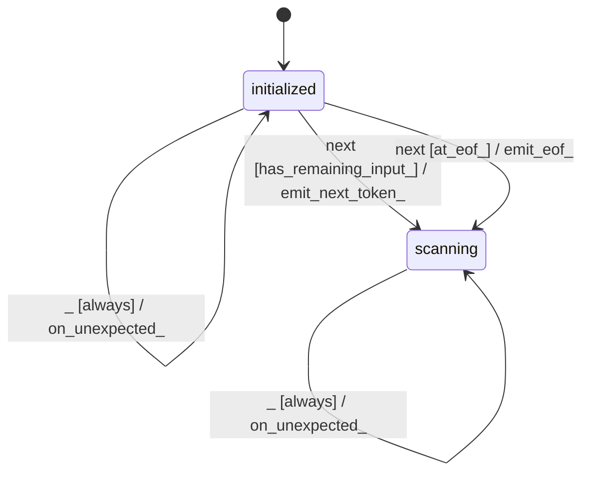

# gbnf_rule_parser_lexer

Source: [`emel/gbnf/rule_parser/lexer/sm.hpp`](https://github.com/stateforward/emel.cpp/blob/main/src/emel/gbnf/rule_parser/lexer/sm.hpp)

## Mermaid

## Transitions

| Source | Event | Guard | Action | Target |
| --- | --- | --- | --- | --- |
| [`initialized`](https://github.com/stateforward/emel.cpp/blob/main/src/emel/gbnf/rule_parser/lexer/sm.hpp) | [`next`](https://github.com/stateforward/emel.cpp/blob/main/src/emel/gbnf/rule_parser/lexer/sm.hpp) | [`invalid_next>`](https://github.com/stateforward/emel.cpp/blob/main/src/emel/gbnf/rule_parser/lexer/sm.hpp) | [`reject_invalid_next>`](https://github.com/stateforward/emel.cpp/blob/main/src/emel/gbnf/rule_parser/lexer/sm.hpp) | [`initialized`](https://github.com/stateforward/emel.cpp/blob/main/src/emel/gbnf/rule_parser/lexer/sm.hpp) |
| [`initialized`](https://github.com/stateforward/emel.cpp/blob/main/src/emel/gbnf/rule_parser/lexer/sm.hpp) | [`next`](https://github.com/stateforward/emel.cpp/blob/main/src/emel/gbnf/rule_parser/lexer/sm.hpp) | [`invalid_cursor_position>`](https://github.com/stateforward/emel.cpp/blob/main/src/emel/gbnf/rule_parser/lexer/sm.hpp) | [`reject_invalid_cursor>`](https://github.com/stateforward/emel.cpp/blob/main/src/emel/gbnf/rule_parser/lexer/sm.hpp) | [`initialized`](https://github.com/stateforward/emel.cpp/blob/main/src/emel/gbnf/rule_parser/lexer/sm.hpp) |
| [`initialized`](https://github.com/stateforward/emel.cpp/blob/main/src/emel/gbnf/rule_parser/lexer/sm.hpp) | [`next`](https://github.com/stateforward/emel.cpp/blob/main/src/emel/gbnf/rule_parser/lexer/sm.hpp) | [`has_remaining_input>`](https://github.com/stateforward/emel.cpp/blob/main/src/emel/gbnf/rule_parser/lexer/sm.hpp) | [`emit_next_token>`](https://github.com/stateforward/emel.cpp/blob/main/src/emel/gbnf/rule_parser/lexer/sm.hpp) | [`scanning`](https://github.com/stateforward/emel.cpp/blob/main/src/emel/gbnf/rule_parser/lexer/sm.hpp) |
| [`initialized`](https://github.com/stateforward/emel.cpp/blob/main/src/emel/gbnf/rule_parser/lexer/sm.hpp) | [`next`](https://github.com/stateforward/emel.cpp/blob/main/src/emel/gbnf/rule_parser/lexer/sm.hpp) | [`at_eof>`](https://github.com/stateforward/emel.cpp/blob/main/src/emel/gbnf/rule_parser/lexer/sm.hpp) | [`emit_eof>`](https://github.com/stateforward/emel.cpp/blob/main/src/emel/gbnf/rule_parser/lexer/sm.hpp) | [`scanning`](https://github.com/stateforward/emel.cpp/blob/main/src/emel/gbnf/rule_parser/lexer/sm.hpp) |
| [`scanning`](https://github.com/stateforward/emel.cpp/blob/main/src/emel/gbnf/rule_parser/lexer/sm.hpp) | [`next`](https://github.com/stateforward/emel.cpp/blob/main/src/emel/gbnf/rule_parser/lexer/sm.hpp) | [`invalid_next>`](https://github.com/stateforward/emel.cpp/blob/main/src/emel/gbnf/rule_parser/lexer/sm.hpp) | [`reject_invalid_next>`](https://github.com/stateforward/emel.cpp/blob/main/src/emel/gbnf/rule_parser/lexer/sm.hpp) | [`scanning`](https://github.com/stateforward/emel.cpp/blob/main/src/emel/gbnf/rule_parser/lexer/sm.hpp) |
| [`scanning`](https://github.com/stateforward/emel.cpp/blob/main/src/emel/gbnf/rule_parser/lexer/sm.hpp) | [`next`](https://github.com/stateforward/emel.cpp/blob/main/src/emel/gbnf/rule_parser/lexer/sm.hpp) | [`invalid_cursor_position>`](https://github.com/stateforward/emel.cpp/blob/main/src/emel/gbnf/rule_parser/lexer/sm.hpp) | [`reject_invalid_cursor>`](https://github.com/stateforward/emel.cpp/blob/main/src/emel/gbnf/rule_parser/lexer/sm.hpp) | [`scanning`](https://github.com/stateforward/emel.cpp/blob/main/src/emel/gbnf/rule_parser/lexer/sm.hpp) |
| [`scanning`](https://github.com/stateforward/emel.cpp/blob/main/src/emel/gbnf/rule_parser/lexer/sm.hpp) | [`next`](https://github.com/stateforward/emel.cpp/blob/main/src/emel/gbnf/rule_parser/lexer/sm.hpp) | [`has_remaining_input>`](https://github.com/stateforward/emel.cpp/blob/main/src/emel/gbnf/rule_parser/lexer/sm.hpp) | [`emit_next_token>`](https://github.com/stateforward/emel.cpp/blob/main/src/emel/gbnf/rule_parser/lexer/sm.hpp) | [`scanning`](https://github.com/stateforward/emel.cpp/blob/main/src/emel/gbnf/rule_parser/lexer/sm.hpp) |
| [`scanning`](https://github.com/stateforward/emel.cpp/blob/main/src/emel/gbnf/rule_parser/lexer/sm.hpp) | [`next`](https://github.com/stateforward/emel.cpp/blob/main/src/emel/gbnf/rule_parser/lexer/sm.hpp) | [`at_eof>`](https://github.com/stateforward/emel.cpp/blob/main/src/emel/gbnf/rule_parser/lexer/sm.hpp) | [`emit_eof>`](https://github.com/stateforward/emel.cpp/blob/main/src/emel/gbnf/rule_parser/lexer/sm.hpp) | [`scanning`](https://github.com/stateforward/emel.cpp/blob/main/src/emel/gbnf/rule_parser/lexer/sm.hpp) |
| [`initialized`](https://github.com/stateforward/emel.cpp/blob/main/src/emel/gbnf/rule_parser/lexer/sm.hpp) | [`_`](https://github.com/stateforward/emel.cpp/blob/main/src/emel/gbnf/rule_parser/lexer/sm.hpp) | [`always`](https://github.com/stateforward/emel.cpp/blob/main/src/emel/gbnf/rule_parser/lexer/sm.hpp) | [`on_unexpected>`](https://github.com/stateforward/emel.cpp/blob/main/src/emel/gbnf/rule_parser/lexer/sm.hpp) | [`initialized`](https://github.com/stateforward/emel.cpp/blob/main/src/emel/gbnf/rule_parser/lexer/sm.hpp) |
| [`scanning`](https://github.com/stateforward/emel.cpp/blob/main/src/emel/gbnf/rule_parser/lexer/sm.hpp) | [`_`](https://github.com/stateforward/emel.cpp/blob/main/src/emel/gbnf/rule_parser/lexer/sm.hpp) | [`always`](https://github.com/stateforward/emel.cpp/blob/main/src/emel/gbnf/rule_parser/lexer/sm.hpp) | [`on_unexpected>`](https://github.com/stateforward/emel.cpp/blob/main/src/emel/gbnf/rule_parser/lexer/sm.hpp) | [`scanning`](https://github.com/stateforward/emel.cpp/blob/main/src/emel/gbnf/rule_parser/lexer/sm.hpp) |
