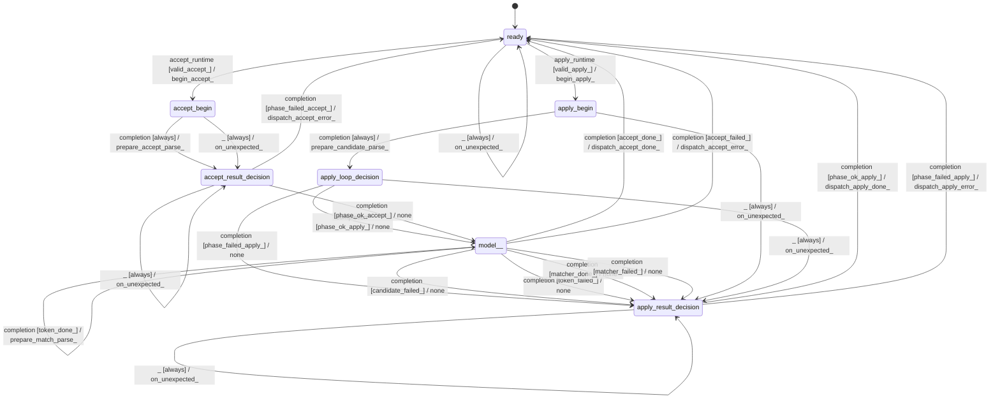

# gbnf_sampler

Source: [`emel/gbnf/sampler/sm.hpp`](https://github.com/stateforward/emel.cpp/blob/main/src/emel/gbnf/sampler/sm.hpp)

## Mermaid

## Transitions

| Source | Event | Guard | Action | Target |
| --- | --- | --- | --- | --- |
| [`ready`](https://github.com/stateforward/emel.cpp/blob/main/src/emel/gbnf/sampler/sm.hpp) | [`apply_runtime`](https://github.com/stateforward/emel.cpp/blob/main/src/emel/gbnf/sampler/sm.hpp) | [`valid_apply>`](https://github.com/stateforward/emel.cpp/blob/main/src/emel/gbnf/sampler/sm.hpp) | [`begin_apply>`](https://github.com/stateforward/emel.cpp/blob/main/src/emel/gbnf/sampler/sm.hpp) | [`apply_begin`](https://github.com/stateforward/emel.cpp/blob/main/src/emel/gbnf/sampler/sm.hpp) |
| [`ready`](https://github.com/stateforward/emel.cpp/blob/main/src/emel/gbnf/sampler/sm.hpp) | [`apply_runtime`](https://github.com/stateforward/emel.cpp/blob/main/src/emel/gbnf/sampler/sm.hpp) | [`invalid_apply>`](https://github.com/stateforward/emel.cpp/blob/main/src/emel/gbnf/sampler/sm.hpp) | [`reject_invalid_apply>`](https://github.com/stateforward/emel.cpp/blob/main/src/emel/gbnf/sampler/sm.hpp) | [`ready`](https://github.com/stateforward/emel.cpp/blob/main/src/emel/gbnf/sampler/sm.hpp) |
| [`apply_begin`](https://github.com/stateforward/emel.cpp/blob/main/src/emel/gbnf/sampler/sm.hpp) | [`completion`](https://github.com/stateforward/emel.cpp/blob/main/src/emel/gbnf/sampler/sm.hpp) | [`always`](https://github.com/stateforward/emel.cpp/blob/main/src/emel/gbnf/sampler/sm.hpp) | [`prepare_candidate_parse>`](https://github.com/stateforward/emel.cpp/blob/main/src/emel/gbnf/sampler/sm.hpp) | [`apply_loop_decision`](https://github.com/stateforward/emel.cpp/blob/main/src/emel/gbnf/sampler/sm.hpp) |
| [`apply_loop_decision`](https://github.com/stateforward/emel.cpp/blob/main/src/emel/gbnf/sampler/sm.hpp) | [`completion`](https://github.com/stateforward/emel.cpp/blob/main/src/emel/gbnf/sampler/sm.hpp) | [`phase_failed_apply>`](https://github.com/stateforward/emel.cpp/blob/main/src/emel/gbnf/sampler/sm.hpp) | [`none`](https://github.com/stateforward/emel.cpp/blob/main/src/emel/gbnf/sampler/sm.hpp) | [`apply_result_decision`](https://github.com/stateforward/emel.cpp/blob/main/src/emel/gbnf/sampler/sm.hpp) |
| [`apply_loop_decision`](https://github.com/stateforward/emel.cpp/blob/main/src/emel/gbnf/sampler/sm.hpp) | [`completion`](https://github.com/stateforward/emel.cpp/blob/main/src/emel/gbnf/sampler/sm.hpp) | [`phase_ok_apply>`](https://github.com/stateforward/emel.cpp/blob/main/src/emel/gbnf/sampler/sm.hpp) | [`none`](https://github.com/stateforward/emel.cpp/blob/main/src/emel/gbnf/sampler/sm.hpp) | [`model>>`](https://github.com/stateforward/emel.cpp/blob/main/src/emel/gbnf/sampler/sm.hpp) |
| [`model>>`](https://github.com/stateforward/emel.cpp/blob/main/src/emel/gbnf/sampler/sm.hpp) | [`completion`](https://github.com/stateforward/emel.cpp/blob/main/src/emel/gbnf/sampler/sm.hpp) | [`candidate_failed>`](https://github.com/stateforward/emel.cpp/blob/main/src/emel/gbnf/sampler/sm.hpp) | [`none`](https://github.com/stateforward/emel.cpp/blob/main/src/emel/gbnf/sampler/sm.hpp) | [`apply_result_decision`](https://github.com/stateforward/emel.cpp/blob/main/src/emel/gbnf/sampler/sm.hpp) |
| [`model>>`](https://github.com/stateforward/emel.cpp/blob/main/src/emel/gbnf/sampler/sm.hpp) | [`completion`](https://github.com/stateforward/emel.cpp/blob/main/src/emel/gbnf/sampler/sm.hpp) | [`candidate_done>`](https://github.com/stateforward/emel.cpp/blob/main/src/emel/gbnf/sampler/sm.hpp) | [`prepare_token_parse>`](https://github.com/stateforward/emel.cpp/blob/main/src/emel/gbnf/sampler/sm.hpp) | [`model>>`](https://github.com/stateforward/emel.cpp/blob/main/src/emel/gbnf/sampler/sm.hpp) |
| [`model>>`](https://github.com/stateforward/emel.cpp/blob/main/src/emel/gbnf/sampler/sm.hpp) | [`completion`](https://github.com/stateforward/emel.cpp/blob/main/src/emel/gbnf/sampler/sm.hpp) | [`token_failed>`](https://github.com/stateforward/emel.cpp/blob/main/src/emel/gbnf/sampler/sm.hpp) | [`none`](https://github.com/stateforward/emel.cpp/blob/main/src/emel/gbnf/sampler/sm.hpp) | [`apply_result_decision`](https://github.com/stateforward/emel.cpp/blob/main/src/emel/gbnf/sampler/sm.hpp) |
| [`model>>`](https://github.com/stateforward/emel.cpp/blob/main/src/emel/gbnf/sampler/sm.hpp) | [`completion`](https://github.com/stateforward/emel.cpp/blob/main/src/emel/gbnf/sampler/sm.hpp) | [`token_done>`](https://github.com/stateforward/emel.cpp/blob/main/src/emel/gbnf/sampler/sm.hpp) | [`prepare_match_parse>`](https://github.com/stateforward/emel.cpp/blob/main/src/emel/gbnf/sampler/sm.hpp) | [`model>>`](https://github.com/stateforward/emel.cpp/blob/main/src/emel/gbnf/sampler/sm.hpp) |
| [`model>>`](https://github.com/stateforward/emel.cpp/blob/main/src/emel/gbnf/sampler/sm.hpp) | [`completion`](https://github.com/stateforward/emel.cpp/blob/main/src/emel/gbnf/sampler/sm.hpp) | [`matcher_done>`](https://github.com/stateforward/emel.cpp/blob/main/src/emel/gbnf/sampler/sm.hpp) | [`none`](https://github.com/stateforward/emel.cpp/blob/main/src/emel/gbnf/sampler/sm.hpp) | [`apply_result_decision`](https://github.com/stateforward/emel.cpp/blob/main/src/emel/gbnf/sampler/sm.hpp) |
| [`model>>`](https://github.com/stateforward/emel.cpp/blob/main/src/emel/gbnf/sampler/sm.hpp) | [`completion`](https://github.com/stateforward/emel.cpp/blob/main/src/emel/gbnf/sampler/sm.hpp) | [`matcher_failed>`](https://github.com/stateforward/emel.cpp/blob/main/src/emel/gbnf/sampler/sm.hpp) | [`none`](https://github.com/stateforward/emel.cpp/blob/main/src/emel/gbnf/sampler/sm.hpp) | [`apply_result_decision`](https://github.com/stateforward/emel.cpp/blob/main/src/emel/gbnf/sampler/sm.hpp) |
| [`apply_result_decision`](https://github.com/stateforward/emel.cpp/blob/main/src/emel/gbnf/sampler/sm.hpp) | [`completion`](https://github.com/stateforward/emel.cpp/blob/main/src/emel/gbnf/sampler/sm.hpp) | [`phase_ok_apply>`](https://github.com/stateforward/emel.cpp/blob/main/src/emel/gbnf/sampler/sm.hpp) | [`dispatch_apply_done>`](https://github.com/stateforward/emel.cpp/blob/main/src/emel/gbnf/sampler/sm.hpp) | [`ready`](https://github.com/stateforward/emel.cpp/blob/main/src/emel/gbnf/sampler/sm.hpp) |
| [`apply_result_decision`](https://github.com/stateforward/emel.cpp/blob/main/src/emel/gbnf/sampler/sm.hpp) | [`completion`](https://github.com/stateforward/emel.cpp/blob/main/src/emel/gbnf/sampler/sm.hpp) | [`phase_failed_apply>`](https://github.com/stateforward/emel.cpp/blob/main/src/emel/gbnf/sampler/sm.hpp) | [`dispatch_apply_error>`](https://github.com/stateforward/emel.cpp/blob/main/src/emel/gbnf/sampler/sm.hpp) | [`ready`](https://github.com/stateforward/emel.cpp/blob/main/src/emel/gbnf/sampler/sm.hpp) |
| [`ready`](https://github.com/stateforward/emel.cpp/blob/main/src/emel/gbnf/sampler/sm.hpp) | [`accept_runtime`](https://github.com/stateforward/emel.cpp/blob/main/src/emel/gbnf/sampler/sm.hpp) | [`valid_accept>`](https://github.com/stateforward/emel.cpp/blob/main/src/emel/gbnf/sampler/sm.hpp) | [`begin_accept>`](https://github.com/stateforward/emel.cpp/blob/main/src/emel/gbnf/sampler/sm.hpp) | [`accept_begin`](https://github.com/stateforward/emel.cpp/blob/main/src/emel/gbnf/sampler/sm.hpp) |
| [`ready`](https://github.com/stateforward/emel.cpp/blob/main/src/emel/gbnf/sampler/sm.hpp) | [`accept_runtime`](https://github.com/stateforward/emel.cpp/blob/main/src/emel/gbnf/sampler/sm.hpp) | [`invalid_accept>`](https://github.com/stateforward/emel.cpp/blob/main/src/emel/gbnf/sampler/sm.hpp) | [`reject_invalid_accept>`](https://github.com/stateforward/emel.cpp/blob/main/src/emel/gbnf/sampler/sm.hpp) | [`ready`](https://github.com/stateforward/emel.cpp/blob/main/src/emel/gbnf/sampler/sm.hpp) |
| [`accept_begin`](https://github.com/stateforward/emel.cpp/blob/main/src/emel/gbnf/sampler/sm.hpp) | [`completion`](https://github.com/stateforward/emel.cpp/blob/main/src/emel/gbnf/sampler/sm.hpp) | [`always`](https://github.com/stateforward/emel.cpp/blob/main/src/emel/gbnf/sampler/sm.hpp) | [`prepare_accept_parse>`](https://github.com/stateforward/emel.cpp/blob/main/src/emel/gbnf/sampler/sm.hpp) | [`accept_result_decision`](https://github.com/stateforward/emel.cpp/blob/main/src/emel/gbnf/sampler/sm.hpp) |
| [`accept_result_decision`](https://github.com/stateforward/emel.cpp/blob/main/src/emel/gbnf/sampler/sm.hpp) | [`completion`](https://github.com/stateforward/emel.cpp/blob/main/src/emel/gbnf/sampler/sm.hpp) | [`phase_failed_accept>`](https://github.com/stateforward/emel.cpp/blob/main/src/emel/gbnf/sampler/sm.hpp) | [`dispatch_accept_error>`](https://github.com/stateforward/emel.cpp/blob/main/src/emel/gbnf/sampler/sm.hpp) | [`ready`](https://github.com/stateforward/emel.cpp/blob/main/src/emel/gbnf/sampler/sm.hpp) |
| [`accept_result_decision`](https://github.com/stateforward/emel.cpp/blob/main/src/emel/gbnf/sampler/sm.hpp) | [`completion`](https://github.com/stateforward/emel.cpp/blob/main/src/emel/gbnf/sampler/sm.hpp) | [`phase_ok_accept>`](https://github.com/stateforward/emel.cpp/blob/main/src/emel/gbnf/sampler/sm.hpp) | [`none`](https://github.com/stateforward/emel.cpp/blob/main/src/emel/gbnf/sampler/sm.hpp) | [`model>>`](https://github.com/stateforward/emel.cpp/blob/main/src/emel/gbnf/sampler/sm.hpp) |
| [`model>>`](https://github.com/stateforward/emel.cpp/blob/main/src/emel/gbnf/sampler/sm.hpp) | [`completion`](https://github.com/stateforward/emel.cpp/blob/main/src/emel/gbnf/sampler/sm.hpp) | [`accept_done>`](https://github.com/stateforward/emel.cpp/blob/main/src/emel/gbnf/sampler/sm.hpp) | [`dispatch_accept_done>`](https://github.com/stateforward/emel.cpp/blob/main/src/emel/gbnf/sampler/sm.hpp) | [`ready`](https://github.com/stateforward/emel.cpp/blob/main/src/emel/gbnf/sampler/sm.hpp) |
| [`model>>`](https://github.com/stateforward/emel.cpp/blob/main/src/emel/gbnf/sampler/sm.hpp) | [`completion`](https://github.com/stateforward/emel.cpp/blob/main/src/emel/gbnf/sampler/sm.hpp) | [`accept_failed>`](https://github.com/stateforward/emel.cpp/blob/main/src/emel/gbnf/sampler/sm.hpp) | [`dispatch_accept_error>`](https://github.com/stateforward/emel.cpp/blob/main/src/emel/gbnf/sampler/sm.hpp) | [`ready`](https://github.com/stateforward/emel.cpp/blob/main/src/emel/gbnf/sampler/sm.hpp) |
| [`ready`](https://github.com/stateforward/emel.cpp/blob/main/src/emel/gbnf/sampler/sm.hpp) | [`_`](https://github.com/stateforward/emel.cpp/blob/main/src/emel/gbnf/sampler/sm.hpp) | [`always`](https://github.com/stateforward/emel.cpp/blob/main/src/emel/gbnf/sampler/sm.hpp) | [`on_unexpected>`](https://github.com/stateforward/emel.cpp/blob/main/src/emel/gbnf/sampler/sm.hpp) | [`ready`](https://github.com/stateforward/emel.cpp/blob/main/src/emel/gbnf/sampler/sm.hpp) |
| [`apply_begin`](https://github.com/stateforward/emel.cpp/blob/main/src/emel/gbnf/sampler/sm.hpp) | [`_`](https://github.com/stateforward/emel.cpp/blob/main/src/emel/gbnf/sampler/sm.hpp) | [`always`](https://github.com/stateforward/emel.cpp/blob/main/src/emel/gbnf/sampler/sm.hpp) | [`on_unexpected>`](https://github.com/stateforward/emel.cpp/blob/main/src/emel/gbnf/sampler/sm.hpp) | [`apply_result_decision`](https://github.com/stateforward/emel.cpp/blob/main/src/emel/gbnf/sampler/sm.hpp) |
| [`apply_loop_decision`](https://github.com/stateforward/emel.cpp/blob/main/src/emel/gbnf/sampler/sm.hpp) | [`_`](https://github.com/stateforward/emel.cpp/blob/main/src/emel/gbnf/sampler/sm.hpp) | [`always`](https://github.com/stateforward/emel.cpp/blob/main/src/emel/gbnf/sampler/sm.hpp) | [`on_unexpected>`](https://github.com/stateforward/emel.cpp/blob/main/src/emel/gbnf/sampler/sm.hpp) | [`apply_result_decision`](https://github.com/stateforward/emel.cpp/blob/main/src/emel/gbnf/sampler/sm.hpp) |
| [`apply_result_decision`](https://github.com/stateforward/emel.cpp/blob/main/src/emel/gbnf/sampler/sm.hpp) | [`_`](https://github.com/stateforward/emel.cpp/blob/main/src/emel/gbnf/sampler/sm.hpp) | [`always`](https://github.com/stateforward/emel.cpp/blob/main/src/emel/gbnf/sampler/sm.hpp) | [`on_unexpected>`](https://github.com/stateforward/emel.cpp/blob/main/src/emel/gbnf/sampler/sm.hpp) | [`apply_result_decision`](https://github.com/stateforward/emel.cpp/blob/main/src/emel/gbnf/sampler/sm.hpp) |
| [`accept_begin`](https://github.com/stateforward/emel.cpp/blob/main/src/emel/gbnf/sampler/sm.hpp) | [`_`](https://github.com/stateforward/emel.cpp/blob/main/src/emel/gbnf/sampler/sm.hpp) | [`always`](https://github.com/stateforward/emel.cpp/blob/main/src/emel/gbnf/sampler/sm.hpp) | [`on_unexpected>`](https://github.com/stateforward/emel.cpp/blob/main/src/emel/gbnf/sampler/sm.hpp) | [`accept_result_decision`](https://github.com/stateforward/emel.cpp/blob/main/src/emel/gbnf/sampler/sm.hpp) |
| [`accept_result_decision`](https://github.com/stateforward/emel.cpp/blob/main/src/emel/gbnf/sampler/sm.hpp) | [`_`](https://github.com/stateforward/emel.cpp/blob/main/src/emel/gbnf/sampler/sm.hpp) | [`always`](https://github.com/stateforward/emel.cpp/blob/main/src/emel/gbnf/sampler/sm.hpp) | [`on_unexpected>`](https://github.com/stateforward/emel.cpp/blob/main/src/emel/gbnf/sampler/sm.hpp) | [`accept_result_decision`](https://github.com/stateforward/emel.cpp/blob/main/src/emel/gbnf/sampler/sm.hpp) |
