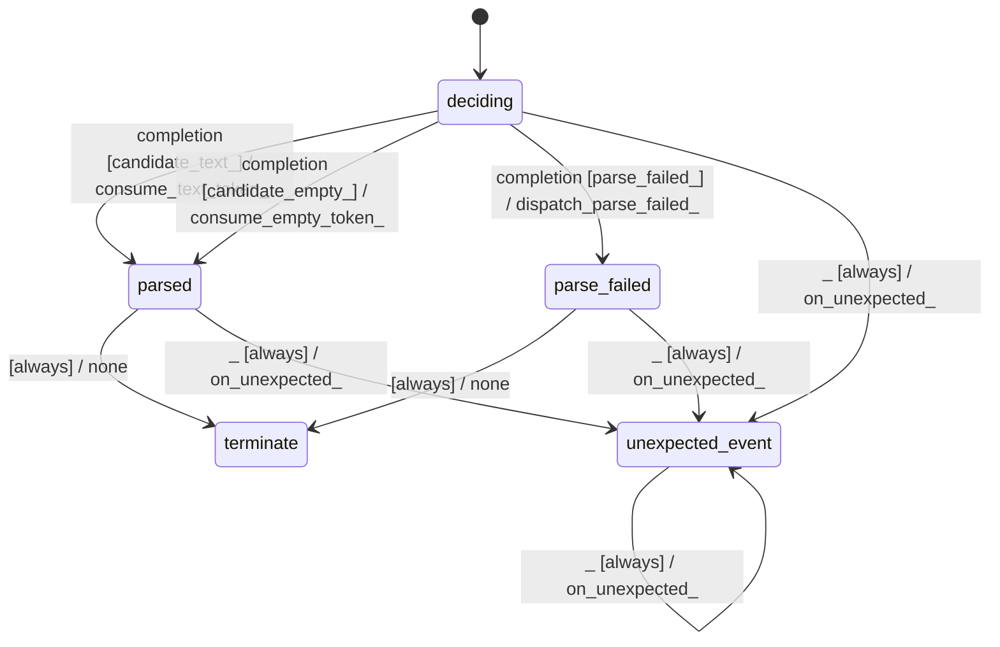

# gbnf_sampler_token_parser

Source: [`emel/gbnf/sampler/token_parser/sm.hpp`](https://github.com/stateforward/emel.cpp/blob/main/src/emel/gbnf/sampler/token_parser/sm.hpp)

## Mermaid

## Transitions

| Source | Event | Guard | Action | Target |
| --- | --- | --- | --- | --- |
| [`deciding`](https://github.com/stateforward/emel.cpp/blob/main/src/emel/gbnf/sampler/token_parser/sm.hpp) | [`completion`](https://github.com/stateforward/emel.cpp/blob/main/src/emel/gbnf/sampler/token_parser/sm.hpp) | [`candidate_text>`](https://github.com/stateforward/emel.cpp/blob/main/src/emel/gbnf/sampler/token_parser/sm.hpp) | [`consume_text_token>`](https://github.com/stateforward/emel.cpp/blob/main/src/emel/gbnf/sampler/token_parser/sm.hpp) | [`parsed`](https://github.com/stateforward/emel.cpp/blob/main/src/emel/gbnf/sampler/token_parser/sm.hpp) |
| [`deciding`](https://github.com/stateforward/emel.cpp/blob/main/src/emel/gbnf/sampler/token_parser/sm.hpp) | [`completion`](https://github.com/stateforward/emel.cpp/blob/main/src/emel/gbnf/sampler/token_parser/sm.hpp) | [`candidate_empty>`](https://github.com/stateforward/emel.cpp/blob/main/src/emel/gbnf/sampler/token_parser/sm.hpp) | [`consume_empty_token>`](https://github.com/stateforward/emel.cpp/blob/main/src/emel/gbnf/sampler/token_parser/sm.hpp) | [`parsed`](https://github.com/stateforward/emel.cpp/blob/main/src/emel/gbnf/sampler/token_parser/sm.hpp) |
| [`deciding`](https://github.com/stateforward/emel.cpp/blob/main/src/emel/gbnf/sampler/token_parser/sm.hpp) | [`completion`](https://github.com/stateforward/emel.cpp/blob/main/src/emel/gbnf/sampler/token_parser/sm.hpp) | [`parse_failed>`](https://github.com/stateforward/emel.cpp/blob/main/src/emel/gbnf/sampler/token_parser/sm.hpp) | [`dispatch_parse_failed>`](https://github.com/stateforward/emel.cpp/blob/main/src/emel/gbnf/sampler/token_parser/sm.hpp) | [`parse_failed`](https://github.com/stateforward/emel.cpp/blob/main/src/emel/gbnf/sampler/token_parser/sm.hpp) |
| [`parsed`](https://github.com/stateforward/emel.cpp/blob/main/src/emel/gbnf/sampler/token_parser/sm.hpp) | - | [`always`](https://github.com/stateforward/emel.cpp/blob/main/src/emel/gbnf/sampler/token_parser/sm.hpp) | [`none`](https://github.com/stateforward/emel.cpp/blob/main/src/emel/gbnf/sampler/token_parser/sm.hpp) | [`terminate`](https://github.com/stateforward/emel.cpp/blob/main/src/emel/gbnf/sampler/token_parser/sm.hpp) |
| [`parse_failed`](https://github.com/stateforward/emel.cpp/blob/main/src/emel/gbnf/sampler/token_parser/sm.hpp) | - | [`always`](https://github.com/stateforward/emel.cpp/blob/main/src/emel/gbnf/sampler/token_parser/sm.hpp) | [`none`](https://github.com/stateforward/emel.cpp/blob/main/src/emel/gbnf/sampler/token_parser/sm.hpp) | [`terminate`](https://github.com/stateforward/emel.cpp/blob/main/src/emel/gbnf/sampler/token_parser/sm.hpp) |
| [`deciding`](https://github.com/stateforward/emel.cpp/blob/main/src/emel/gbnf/sampler/token_parser/sm.hpp) | [`_`](https://github.com/stateforward/emel.cpp/blob/main/src/emel/gbnf/sampler/token_parser/sm.hpp) | [`always`](https://github.com/stateforward/emel.cpp/blob/main/src/emel/gbnf/sampler/token_parser/sm.hpp) | [`on_unexpected>`](https://github.com/stateforward/emel.cpp/blob/main/src/emel/gbnf/sampler/token_parser/sm.hpp) | [`unexpected_event`](https://github.com/stateforward/emel.cpp/blob/main/src/emel/gbnf/sampler/token_parser/sm.hpp) |
| [`parsed`](https://github.com/stateforward/emel.cpp/blob/main/src/emel/gbnf/sampler/token_parser/sm.hpp) | [`_`](https://github.com/stateforward/emel.cpp/blob/main/src/emel/gbnf/sampler/token_parser/sm.hpp) | [`always`](https://github.com/stateforward/emel.cpp/blob/main/src/emel/gbnf/sampler/token_parser/sm.hpp) | [`on_unexpected>`](https://github.com/stateforward/emel.cpp/blob/main/src/emel/gbnf/sampler/token_parser/sm.hpp) | [`unexpected_event`](https://github.com/stateforward/emel.cpp/blob/main/src/emel/gbnf/sampler/token_parser/sm.hpp) |
| [`parse_failed`](https://github.com/stateforward/emel.cpp/blob/main/src/emel/gbnf/sampler/token_parser/sm.hpp) | [`_`](https://github.com/stateforward/emel.cpp/blob/main/src/emel/gbnf/sampler/token_parser/sm.hpp) | [`always`](https://github.com/stateforward/emel.cpp/blob/main/src/emel/gbnf/sampler/token_parser/sm.hpp) | [`on_unexpected>`](https://github.com/stateforward/emel.cpp/blob/main/src/emel/gbnf/sampler/token_parser/sm.hpp) | [`unexpected_event`](https://github.com/stateforward/emel.cpp/blob/main/src/emel/gbnf/sampler/token_parser/sm.hpp) |
| [`unexpected_event`](https://github.com/stateforward/emel.cpp/blob/main/src/emel/gbnf/sampler/token_parser/sm.hpp) | [`_`](https://github.com/stateforward/emel.cpp/blob/main/src/emel/gbnf/sampler/token_parser/sm.hpp) | [`always`](https://github.com/stateforward/emel.cpp/blob/main/src/emel/gbnf/sampler/token_parser/sm.hpp) | [`on_unexpected>`](https://github.com/stateforward/emel.cpp/blob/main/src/emel/gbnf/sampler/token_parser/sm.hpp) | [`unexpected_event`](https://github.com/stateforward/emel.cpp/blob/main/src/emel/gbnf/sampler/token_parser/sm.hpp) |
