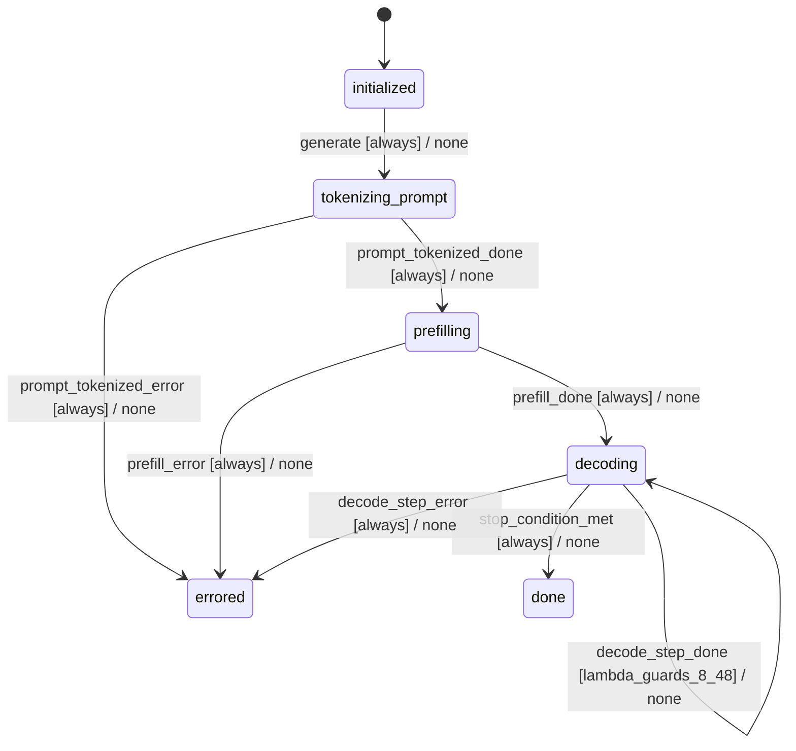

# generator

Source: [`emel/generator/sm.hpp`](https://github.com/stateforward/emel.cpp/blob/main/src/emel/generator/sm.hpp)

## Mermaid

## Transitions

| Source | Event | Guard | Action | Target |
| --- | --- | --- | --- | --- |
| [`initialized`](https://github.com/stateforward/emel.cpp/blob/main/src/emel/generator/sm.hpp) | [`generate`](https://github.com/stateforward/emel.cpp/blob/main/src/emel/generator/sm.hpp) | [`always`](https://github.com/stateforward/emel.cpp/blob/main/src/emel/generator/sm.hpp) | [`none`](https://github.com/stateforward/emel.cpp/blob/main/src/emel/generator/sm.hpp) | [`tokenizing_prompt`](https://github.com/stateforward/emel.cpp/blob/main/src/emel/generator/sm.hpp) |
| [`tokenizing_prompt`](https://github.com/stateforward/emel.cpp/blob/main/src/emel/generator/sm.hpp) | [`prompt_tokenized_done`](https://github.com/stateforward/emel.cpp/blob/main/src/emel/generator/sm.hpp) | [`always`](https://github.com/stateforward/emel.cpp/blob/main/src/emel/generator/sm.hpp) | [`none`](https://github.com/stateforward/emel.cpp/blob/main/src/emel/generator/sm.hpp) | [`prefilling`](https://github.com/stateforward/emel.cpp/blob/main/src/emel/generator/sm.hpp) |
| [`tokenizing_prompt`](https://github.com/stateforward/emel.cpp/blob/main/src/emel/generator/sm.hpp) | [`prompt_tokenized_error`](https://github.com/stateforward/emel.cpp/blob/main/src/emel/generator/sm.hpp) | [`always`](https://github.com/stateforward/emel.cpp/blob/main/src/emel/generator/sm.hpp) | [`none`](https://github.com/stateforward/emel.cpp/blob/main/src/emel/generator/sm.hpp) | [`errored`](https://github.com/stateforward/emel.cpp/blob/main/src/emel/generator/sm.hpp) |
| [`prefilling`](https://github.com/stateforward/emel.cpp/blob/main/src/emel/generator/sm.hpp) | [`prefill_done`](https://github.com/stateforward/emel.cpp/blob/main/src/emel/generator/sm.hpp) | [`always`](https://github.com/stateforward/emel.cpp/blob/main/src/emel/generator/sm.hpp) | [`none`](https://github.com/stateforward/emel.cpp/blob/main/src/emel/generator/sm.hpp) | [`decoding`](https://github.com/stateforward/emel.cpp/blob/main/src/emel/generator/sm.hpp) |
| [`prefilling`](https://github.com/stateforward/emel.cpp/blob/main/src/emel/generator/sm.hpp) | [`prefill_error`](https://github.com/stateforward/emel.cpp/blob/main/src/emel/generator/sm.hpp) | [`always`](https://github.com/stateforward/emel.cpp/blob/main/src/emel/generator/sm.hpp) | [`none`](https://github.com/stateforward/emel.cpp/blob/main/src/emel/generator/sm.hpp) | [`errored`](https://github.com/stateforward/emel.cpp/blob/main/src/emel/generator/sm.hpp) |
| [`decoding`](https://github.com/stateforward/emel.cpp/blob/main/src/emel/generator/sm.hpp) | [`decode_step_done`](https://github.com/stateforward/emel.cpp/blob/main/src/emel/generator/sm.hpp) | [`lambda_guards_8_48`](https://github.com/stateforward/emel.cpp/blob/main/src/emel/generator/sm.hpp) | [`none`](https://github.com/stateforward/emel.cpp/blob/main/src/emel/generator/sm.hpp) | [`decoding`](https://github.com/stateforward/emel.cpp/blob/main/src/emel/generator/sm.hpp) |
| [`decoding`](https://github.com/stateforward/emel.cpp/blob/main/src/emel/generator/sm.hpp) | [`stop_condition_met`](https://github.com/stateforward/emel.cpp/blob/main/src/emel/generator/sm.hpp) | [`always`](https://github.com/stateforward/emel.cpp/blob/main/src/emel/generator/sm.hpp) | [`none`](https://github.com/stateforward/emel.cpp/blob/main/src/emel/generator/sm.hpp) | [`done`](https://github.com/stateforward/emel.cpp/blob/main/src/emel/generator/sm.hpp) |
| [`decoding`](https://github.com/stateforward/emel.cpp/blob/main/src/emel/generator/sm.hpp) | [`decode_step_error`](https://github.com/stateforward/emel.cpp/blob/main/src/emel/generator/sm.hpp) | [`always`](https://github.com/stateforward/emel.cpp/blob/main/src/emel/generator/sm.hpp) | [`none`](https://github.com/stateforward/emel.cpp/blob/main/src/emel/generator/sm.hpp) | [`errored`](https://github.com/stateforward/emel.cpp/blob/main/src/emel/generator/sm.hpp) |
