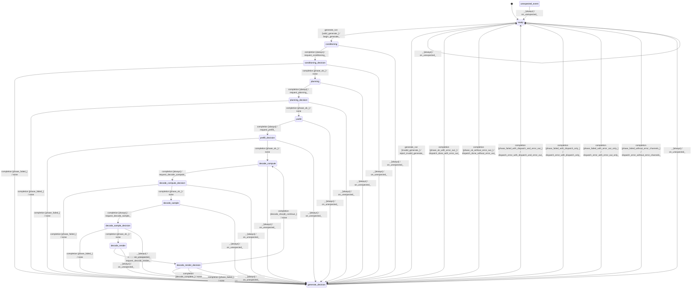

# generator

Source: [`emel/generator/sm.hpp`](https://github.com/stateforward/emel.cpp/blob/main/src/emel/generator/sm.hpp)

## Mermaid

```mermaid
stateDiagram-v2
  direction TB
  [*] --> ready
  ready --> conditioning : generate_run [valid_generate_] / begin_generate_
  ready --> generate_decision : generate_run [invalid_generate_] / reject_invalid_generate_
  conditioning --> conditioning_decision : completion [always] / request_conditioning_
  conditioning_decision --> generate_decision : completion [phase_failed_] / none
  conditioning_decision --> planning : completion [phase_ok_] / none
  planning --> planning_decision : completion [always] / request_planning_
  planning_decision --> generate_decision : completion [phase_failed_] / none
  planning_decision --> prefill : completion [phase_ok_] / none
  prefill --> prefill_decision : completion [always] / request_prefill_
  prefill_decision --> generate_decision : completion [phase_failed_] / none
  prefill_decision --> decode_compute : completion [phase_ok_] / none
  decode_compute --> decode_compute_decision : completion [always] / request_decode_compute_
  decode_compute_decision --> generate_decision : completion [phase_failed_] / none
  decode_compute_decision --> decode_sample : completion [phase_ok_] / none
  decode_sample --> decode_sample_decision : completion [always] / request_decode_sample_
  decode_sample_decision --> generate_decision : completion [phase_failed_] / none
  decode_sample_decision --> decode_render : completion [phase_ok_] / none
  decode_render --> decode_render_decision : completion [always] / request_decode_render_
  decode_render_decision --> generate_decision : completion [phase_failed_] / none
  decode_render_decision --> decode_compute : completion [decode_should_continue_] / none
  decode_render_decision --> generate_decision : completion [decode_complete_] / none
  generate_decision --> ready : completion [phase_ok_with_error_out_] / dispatch_done_with_error_out_
  generate_decision --> ready : completion [phase_ok_without_error_out_] / dispatch_done_without_error_out_
  generate_decision --> ready : completion [phase_failed_with_dispatch_and_error_out_] / dispatch_error_with_dispatch_and_error_out_
  generate_decision --> ready : completion [phase_failed_with_dispatch_only_] / dispatch_error_with_dispatch_only_
  generate_decision --> ready : completion [phase_failed_with_error_out_only_] / dispatch_error_with_error_out_only_
  generate_decision --> ready : completion [phase_failed_without_error_channels_] / dispatch_error_without_error_channels_
  ready --> ready : _ [always] / on_unexpected_
  conditioning --> generate_decision : _ [always] / on_unexpected_
  conditioning_decision --> generate_decision : _ [always] / on_unexpected_
  planning --> generate_decision : _ [always] / on_unexpected_
  planning_decision --> generate_decision : _ [always] / on_unexpected_
  prefill --> generate_decision : _ [always] / on_unexpected_
  prefill_decision --> generate_decision : _ [always] / on_unexpected_
  decode_compute --> generate_decision : _ [always] / on_unexpected_
  decode_compute_decision --> generate_decision : _ [always] / on_unexpected_
  decode_sample --> generate_decision : _ [always] / on_unexpected_
  decode_sample_decision --> generate_decision : _ [always] / on_unexpected_
  decode_render --> generate_decision : _ [always] / on_unexpected_
  decode_render_decision --> generate_decision : _ [always] / on_unexpected_
  generate_decision --> ready : _ [always] / on_unexpected_
  unexpected_event --> ready : _ [always] / on_unexpected_
```

## Transitions

| Source | Event | Guard | Action | Target |
| --- | --- | --- | --- | --- |
| [`ready`](https://github.com/stateforward/emel.cpp/blob/main/src/emel/generator/sm.hpp) | [`generate_run`](https://github.com/stateforward/emel.cpp/blob/main/src/emel/generator/sm.hpp) | [`valid_generate>`](https://github.com/stateforward/emel.cpp/blob/main/src/emel/generator/sm.hpp) | [`begin_generate>`](https://github.com/stateforward/emel.cpp/blob/main/src/emel/generator/sm.hpp) | [`conditioning`](https://github.com/stateforward/emel.cpp/blob/main/src/emel/generator/sm.hpp) |
| [`ready`](https://github.com/stateforward/emel.cpp/blob/main/src/emel/generator/sm.hpp) | [`generate_run`](https://github.com/stateforward/emel.cpp/blob/main/src/emel/generator/sm.hpp) | [`invalid_generate>`](https://github.com/stateforward/emel.cpp/blob/main/src/emel/generator/sm.hpp) | [`reject_invalid_generate>`](https://github.com/stateforward/emel.cpp/blob/main/src/emel/generator/sm.hpp) | [`generate_decision`](https://github.com/stateforward/emel.cpp/blob/main/src/emel/generator/sm.hpp) |
| [`conditioning`](https://github.com/stateforward/emel.cpp/blob/main/src/emel/generator/sm.hpp) | [`completion`](https://github.com/stateforward/emel.cpp/blob/main/src/emel/generator/sm.hpp) | [`always`](https://github.com/stateforward/emel.cpp/blob/main/src/emel/generator/sm.hpp) | [`request_conditioning>`](https://github.com/stateforward/emel.cpp/blob/main/src/emel/generator/sm.hpp) | [`conditioning_decision`](https://github.com/stateforward/emel.cpp/blob/main/src/emel/generator/sm.hpp) |
| [`conditioning_decision`](https://github.com/stateforward/emel.cpp/blob/main/src/emel/generator/sm.hpp) | [`completion`](https://github.com/stateforward/emel.cpp/blob/main/src/emel/generator/sm.hpp) | [`phase_failed>`](https://github.com/stateforward/emel.cpp/blob/main/src/emel/generator/sm.hpp) | [`none`](https://github.com/stateforward/emel.cpp/blob/main/src/emel/generator/sm.hpp) | [`generate_decision`](https://github.com/stateforward/emel.cpp/blob/main/src/emel/generator/sm.hpp) |
| [`conditioning_decision`](https://github.com/stateforward/emel.cpp/blob/main/src/emel/generator/sm.hpp) | [`completion`](https://github.com/stateforward/emel.cpp/blob/main/src/emel/generator/sm.hpp) | [`phase_ok>`](https://github.com/stateforward/emel.cpp/blob/main/src/emel/generator/sm.hpp) | [`none`](https://github.com/stateforward/emel.cpp/blob/main/src/emel/generator/sm.hpp) | [`planning`](https://github.com/stateforward/emel.cpp/blob/main/src/emel/generator/sm.hpp) |
| [`planning`](https://github.com/stateforward/emel.cpp/blob/main/src/emel/generator/sm.hpp) | [`completion`](https://github.com/stateforward/emel.cpp/blob/main/src/emel/generator/sm.hpp) | [`always`](https://github.com/stateforward/emel.cpp/blob/main/src/emel/generator/sm.hpp) | [`request_planning>`](https://github.com/stateforward/emel.cpp/blob/main/src/emel/generator/sm.hpp) | [`planning_decision`](https://github.com/stateforward/emel.cpp/blob/main/src/emel/generator/sm.hpp) |
| [`planning_decision`](https://github.com/stateforward/emel.cpp/blob/main/src/emel/generator/sm.hpp) | [`completion`](https://github.com/stateforward/emel.cpp/blob/main/src/emel/generator/sm.hpp) | [`phase_failed>`](https://github.com/stateforward/emel.cpp/blob/main/src/emel/generator/sm.hpp) | [`none`](https://github.com/stateforward/emel.cpp/blob/main/src/emel/generator/sm.hpp) | [`generate_decision`](https://github.com/stateforward/emel.cpp/blob/main/src/emel/generator/sm.hpp) |
| [`planning_decision`](https://github.com/stateforward/emel.cpp/blob/main/src/emel/generator/sm.hpp) | [`completion`](https://github.com/stateforward/emel.cpp/blob/main/src/emel/generator/sm.hpp) | [`phase_ok>`](https://github.com/stateforward/emel.cpp/blob/main/src/emel/generator/sm.hpp) | [`none`](https://github.com/stateforward/emel.cpp/blob/main/src/emel/generator/sm.hpp) | [`prefill`](https://github.com/stateforward/emel.cpp/blob/main/src/emel/generator/sm.hpp) |
| [`prefill`](https://github.com/stateforward/emel.cpp/blob/main/src/emel/generator/sm.hpp) | [`completion`](https://github.com/stateforward/emel.cpp/blob/main/src/emel/generator/sm.hpp) | [`always`](https://github.com/stateforward/emel.cpp/blob/main/src/emel/generator/sm.hpp) | [`request_prefill>`](https://github.com/stateforward/emel.cpp/blob/main/src/emel/generator/sm.hpp) | [`prefill_decision`](https://github.com/stateforward/emel.cpp/blob/main/src/emel/generator/sm.hpp) |
| [`prefill_decision`](https://github.com/stateforward/emel.cpp/blob/main/src/emel/generator/sm.hpp) | [`completion`](https://github.com/stateforward/emel.cpp/blob/main/src/emel/generator/sm.hpp) | [`phase_failed>`](https://github.com/stateforward/emel.cpp/blob/main/src/emel/generator/sm.hpp) | [`none`](https://github.com/stateforward/emel.cpp/blob/main/src/emel/generator/sm.hpp) | [`generate_decision`](https://github.com/stateforward/emel.cpp/blob/main/src/emel/generator/sm.hpp) |
| [`prefill_decision`](https://github.com/stateforward/emel.cpp/blob/main/src/emel/generator/sm.hpp) | [`completion`](https://github.com/stateforward/emel.cpp/blob/main/src/emel/generator/sm.hpp) | [`phase_ok>`](https://github.com/stateforward/emel.cpp/blob/main/src/emel/generator/sm.hpp) | [`none`](https://github.com/stateforward/emel.cpp/blob/main/src/emel/generator/sm.hpp) | [`decode_compute`](https://github.com/stateforward/emel.cpp/blob/main/src/emel/generator/sm.hpp) |
| [`decode_compute`](https://github.com/stateforward/emel.cpp/blob/main/src/emel/generator/sm.hpp) | [`completion`](https://github.com/stateforward/emel.cpp/blob/main/src/emel/generator/sm.hpp) | [`always`](https://github.com/stateforward/emel.cpp/blob/main/src/emel/generator/sm.hpp) | [`request_decode_compute>`](https://github.com/stateforward/emel.cpp/blob/main/src/emel/generator/sm.hpp) | [`decode_compute_decision`](https://github.com/stateforward/emel.cpp/blob/main/src/emel/generator/sm.hpp) |
| [`decode_compute_decision`](https://github.com/stateforward/emel.cpp/blob/main/src/emel/generator/sm.hpp) | [`completion`](https://github.com/stateforward/emel.cpp/blob/main/src/emel/generator/sm.hpp) | [`phase_failed>`](https://github.com/stateforward/emel.cpp/blob/main/src/emel/generator/sm.hpp) | [`none`](https://github.com/stateforward/emel.cpp/blob/main/src/emel/generator/sm.hpp) | [`generate_decision`](https://github.com/stateforward/emel.cpp/blob/main/src/emel/generator/sm.hpp) |
| [`decode_compute_decision`](https://github.com/stateforward/emel.cpp/blob/main/src/emel/generator/sm.hpp) | [`completion`](https://github.com/stateforward/emel.cpp/blob/main/src/emel/generator/sm.hpp) | [`phase_ok>`](https://github.com/stateforward/emel.cpp/blob/main/src/emel/generator/sm.hpp) | [`none`](https://github.com/stateforward/emel.cpp/blob/main/src/emel/generator/sm.hpp) | [`decode_sample`](https://github.com/stateforward/emel.cpp/blob/main/src/emel/generator/sm.hpp) |
| [`decode_sample`](https://github.com/stateforward/emel.cpp/blob/main/src/emel/generator/sm.hpp) | [`completion`](https://github.com/stateforward/emel.cpp/blob/main/src/emel/generator/sm.hpp) | [`always`](https://github.com/stateforward/emel.cpp/blob/main/src/emel/generator/sm.hpp) | [`request_decode_sample>`](https://github.com/stateforward/emel.cpp/blob/main/src/emel/generator/sm.hpp) | [`decode_sample_decision`](https://github.com/stateforward/emel.cpp/blob/main/src/emel/generator/sm.hpp) |
| [`decode_sample_decision`](https://github.com/stateforward/emel.cpp/blob/main/src/emel/generator/sm.hpp) | [`completion`](https://github.com/stateforward/emel.cpp/blob/main/src/emel/generator/sm.hpp) | [`phase_failed>`](https://github.com/stateforward/emel.cpp/blob/main/src/emel/generator/sm.hpp) | [`none`](https://github.com/stateforward/emel.cpp/blob/main/src/emel/generator/sm.hpp) | [`generate_decision`](https://github.com/stateforward/emel.cpp/blob/main/src/emel/generator/sm.hpp) |
| [`decode_sample_decision`](https://github.com/stateforward/emel.cpp/blob/main/src/emel/generator/sm.hpp) | [`completion`](https://github.com/stateforward/emel.cpp/blob/main/src/emel/generator/sm.hpp) | [`phase_ok>`](https://github.com/stateforward/emel.cpp/blob/main/src/emel/generator/sm.hpp) | [`none`](https://github.com/stateforward/emel.cpp/blob/main/src/emel/generator/sm.hpp) | [`decode_render`](https://github.com/stateforward/emel.cpp/blob/main/src/emel/generator/sm.hpp) |
| [`decode_render`](https://github.com/stateforward/emel.cpp/blob/main/src/emel/generator/sm.hpp) | [`completion`](https://github.com/stateforward/emel.cpp/blob/main/src/emel/generator/sm.hpp) | [`always`](https://github.com/stateforward/emel.cpp/blob/main/src/emel/generator/sm.hpp) | [`request_decode_render>`](https://github.com/stateforward/emel.cpp/blob/main/src/emel/generator/sm.hpp) | [`decode_render_decision`](https://github.com/stateforward/emel.cpp/blob/main/src/emel/generator/sm.hpp) |
| [`decode_render_decision`](https://github.com/stateforward/emel.cpp/blob/main/src/emel/generator/sm.hpp) | [`completion`](https://github.com/stateforward/emel.cpp/blob/main/src/emel/generator/sm.hpp) | [`phase_failed>`](https://github.com/stateforward/emel.cpp/blob/main/src/emel/generator/sm.hpp) | [`none`](https://github.com/stateforward/emel.cpp/blob/main/src/emel/generator/sm.hpp) | [`generate_decision`](https://github.com/stateforward/emel.cpp/blob/main/src/emel/generator/sm.hpp) |
| [`decode_render_decision`](https://github.com/stateforward/emel.cpp/blob/main/src/emel/generator/sm.hpp) | [`completion`](https://github.com/stateforward/emel.cpp/blob/main/src/emel/generator/sm.hpp) | [`decode_should_continue>`](https://github.com/stateforward/emel.cpp/blob/main/src/emel/generator/sm.hpp) | [`none`](https://github.com/stateforward/emel.cpp/blob/main/src/emel/generator/sm.hpp) | [`decode_compute`](https://github.com/stateforward/emel.cpp/blob/main/src/emel/generator/sm.hpp) |
| [`decode_render_decision`](https://github.com/stateforward/emel.cpp/blob/main/src/emel/generator/sm.hpp) | [`completion`](https://github.com/stateforward/emel.cpp/blob/main/src/emel/generator/sm.hpp) | [`decode_complete>`](https://github.com/stateforward/emel.cpp/blob/main/src/emel/generator/sm.hpp) | [`none`](https://github.com/stateforward/emel.cpp/blob/main/src/emel/generator/sm.hpp) | [`generate_decision`](https://github.com/stateforward/emel.cpp/blob/main/src/emel/generator/sm.hpp) |
| [`generate_decision`](https://github.com/stateforward/emel.cpp/blob/main/src/emel/generator/sm.hpp) | [`completion`](https://github.com/stateforward/emel.cpp/blob/main/src/emel/generator/sm.hpp) | [`phase_ok_with_error_out>`](https://github.com/stateforward/emel.cpp/blob/main/src/emel/generator/sm.hpp) | [`dispatch_done_with_error_out>`](https://github.com/stateforward/emel.cpp/blob/main/src/emel/generator/sm.hpp) | [`ready`](https://github.com/stateforward/emel.cpp/blob/main/src/emel/generator/sm.hpp) |
| [`generate_decision`](https://github.com/stateforward/emel.cpp/blob/main/src/emel/generator/sm.hpp) | [`completion`](https://github.com/stateforward/emel.cpp/blob/main/src/emel/generator/sm.hpp) | [`phase_ok_without_error_out>`](https://github.com/stateforward/emel.cpp/blob/main/src/emel/generator/sm.hpp) | [`dispatch_done_without_error_out>`](https://github.com/stateforward/emel.cpp/blob/main/src/emel/generator/sm.hpp) | [`ready`](https://github.com/stateforward/emel.cpp/blob/main/src/emel/generator/sm.hpp) |
| [`generate_decision`](https://github.com/stateforward/emel.cpp/blob/main/src/emel/generator/sm.hpp) | [`completion`](https://github.com/stateforward/emel.cpp/blob/main/src/emel/generator/sm.hpp) | [`phase_failed_with_dispatch_and_error_out>`](https://github.com/stateforward/emel.cpp/blob/main/src/emel/generator/sm.hpp) | [`dispatch_error_with_dispatch_and_error_out>`](https://github.com/stateforward/emel.cpp/blob/main/src/emel/generator/sm.hpp) | [`ready`](https://github.com/stateforward/emel.cpp/blob/main/src/emel/generator/sm.hpp) |
| [`generate_decision`](https://github.com/stateforward/emel.cpp/blob/main/src/emel/generator/sm.hpp) | [`completion`](https://github.com/stateforward/emel.cpp/blob/main/src/emel/generator/sm.hpp) | [`phase_failed_with_dispatch_only>`](https://github.com/stateforward/emel.cpp/blob/main/src/emel/generator/sm.hpp) | [`dispatch_error_with_dispatch_only>`](https://github.com/stateforward/emel.cpp/blob/main/src/emel/generator/sm.hpp) | [`ready`](https://github.com/stateforward/emel.cpp/blob/main/src/emel/generator/sm.hpp) |
| [`generate_decision`](https://github.com/stateforward/emel.cpp/blob/main/src/emel/generator/sm.hpp) | [`completion`](https://github.com/stateforward/emel.cpp/blob/main/src/emel/generator/sm.hpp) | [`phase_failed_with_error_out_only>`](https://github.com/stateforward/emel.cpp/blob/main/src/emel/generator/sm.hpp) | [`dispatch_error_with_error_out_only>`](https://github.com/stateforward/emel.cpp/blob/main/src/emel/generator/sm.hpp) | [`ready`](https://github.com/stateforward/emel.cpp/blob/main/src/emel/generator/sm.hpp) |
| [`generate_decision`](https://github.com/stateforward/emel.cpp/blob/main/src/emel/generator/sm.hpp) | [`completion`](https://github.com/stateforward/emel.cpp/blob/main/src/emel/generator/sm.hpp) | [`phase_failed_without_error_channels>`](https://github.com/stateforward/emel.cpp/blob/main/src/emel/generator/sm.hpp) | [`dispatch_error_without_error_channels>`](https://github.com/stateforward/emel.cpp/blob/main/src/emel/generator/sm.hpp) | [`ready`](https://github.com/stateforward/emel.cpp/blob/main/src/emel/generator/sm.hpp) |
| [`ready`](https://github.com/stateforward/emel.cpp/blob/main/src/emel/generator/sm.hpp) | [`_`](https://github.com/stateforward/emel.cpp/blob/main/src/emel/generator/sm.hpp) | [`always`](https://github.com/stateforward/emel.cpp/blob/main/src/emel/generator/sm.hpp) | [`on_unexpected>`](https://github.com/stateforward/emel.cpp/blob/main/src/emel/generator/sm.hpp) | [`ready`](https://github.com/stateforward/emel.cpp/blob/main/src/emel/generator/sm.hpp) |
| [`conditioning`](https://github.com/stateforward/emel.cpp/blob/main/src/emel/generator/sm.hpp) | [`_`](https://github.com/stateforward/emel.cpp/blob/main/src/emel/generator/sm.hpp) | [`always`](https://github.com/stateforward/emel.cpp/blob/main/src/emel/generator/sm.hpp) | [`on_unexpected>`](https://github.com/stateforward/emel.cpp/blob/main/src/emel/generator/sm.hpp) | [`generate_decision`](https://github.com/stateforward/emel.cpp/blob/main/src/emel/generator/sm.hpp) |
| [`conditioning_decision`](https://github.com/stateforward/emel.cpp/blob/main/src/emel/generator/sm.hpp) | [`_`](https://github.com/stateforward/emel.cpp/blob/main/src/emel/generator/sm.hpp) | [`always`](https://github.com/stateforward/emel.cpp/blob/main/src/emel/generator/sm.hpp) | [`on_unexpected>`](https://github.com/stateforward/emel.cpp/blob/main/src/emel/generator/sm.hpp) | [`generate_decision`](https://github.com/stateforward/emel.cpp/blob/main/src/emel/generator/sm.hpp) |
| [`planning`](https://github.com/stateforward/emel.cpp/blob/main/src/emel/generator/sm.hpp) | [`_`](https://github.com/stateforward/emel.cpp/blob/main/src/emel/generator/sm.hpp) | [`always`](https://github.com/stateforward/emel.cpp/blob/main/src/emel/generator/sm.hpp) | [`on_unexpected>`](https://github.com/stateforward/emel.cpp/blob/main/src/emel/generator/sm.hpp) | [`generate_decision`](https://github.com/stateforward/emel.cpp/blob/main/src/emel/generator/sm.hpp) |
| [`planning_decision`](https://github.com/stateforward/emel.cpp/blob/main/src/emel/generator/sm.hpp) | [`_`](https://github.com/stateforward/emel.cpp/blob/main/src/emel/generator/sm.hpp) | [`always`](https://github.com/stateforward/emel.cpp/blob/main/src/emel/generator/sm.hpp) | [`on_unexpected>`](https://github.com/stateforward/emel.cpp/blob/main/src/emel/generator/sm.hpp) | [`generate_decision`](https://github.com/stateforward/emel.cpp/blob/main/src/emel/generator/sm.hpp) |
| [`prefill`](https://github.com/stateforward/emel.cpp/blob/main/src/emel/generator/sm.hpp) | [`_`](https://github.com/stateforward/emel.cpp/blob/main/src/emel/generator/sm.hpp) | [`always`](https://github.com/stateforward/emel.cpp/blob/main/src/emel/generator/sm.hpp) | [`on_unexpected>`](https://github.com/stateforward/emel.cpp/blob/main/src/emel/generator/sm.hpp) | [`generate_decision`](https://github.com/stateforward/emel.cpp/blob/main/src/emel/generator/sm.hpp) |
| [`prefill_decision`](https://github.com/stateforward/emel.cpp/blob/main/src/emel/generator/sm.hpp) | [`_`](https://github.com/stateforward/emel.cpp/blob/main/src/emel/generator/sm.hpp) | [`always`](https://github.com/stateforward/emel.cpp/blob/main/src/emel/generator/sm.hpp) | [`on_unexpected>`](https://github.com/stateforward/emel.cpp/blob/main/src/emel/generator/sm.hpp) | [`generate_decision`](https://github.com/stateforward/emel.cpp/blob/main/src/emel/generator/sm.hpp) |
| [`decode_compute`](https://github.com/stateforward/emel.cpp/blob/main/src/emel/generator/sm.hpp) | [`_`](https://github.com/stateforward/emel.cpp/blob/main/src/emel/generator/sm.hpp) | [`always`](https://github.com/stateforward/emel.cpp/blob/main/src/emel/generator/sm.hpp) | [`on_unexpected>`](https://github.com/stateforward/emel.cpp/blob/main/src/emel/generator/sm.hpp) | [`generate_decision`](https://github.com/stateforward/emel.cpp/blob/main/src/emel/generator/sm.hpp) |
| [`decode_compute_decision`](https://github.com/stateforward/emel.cpp/blob/main/src/emel/generator/sm.hpp) | [`_`](https://github.com/stateforward/emel.cpp/blob/main/src/emel/generator/sm.hpp) | [`always`](https://github.com/stateforward/emel.cpp/blob/main/src/emel/generator/sm.hpp) | [`on_unexpected>`](https://github.com/stateforward/emel.cpp/blob/main/src/emel/generator/sm.hpp) | [`generate_decision`](https://github.com/stateforward/emel.cpp/blob/main/src/emel/generator/sm.hpp) |
| [`decode_sample`](https://github.com/stateforward/emel.cpp/blob/main/src/emel/generator/sm.hpp) | [`_`](https://github.com/stateforward/emel.cpp/blob/main/src/emel/generator/sm.hpp) | [`always`](https://github.com/stateforward/emel.cpp/blob/main/src/emel/generator/sm.hpp) | [`on_unexpected>`](https://github.com/stateforward/emel.cpp/blob/main/src/emel/generator/sm.hpp) | [`generate_decision`](https://github.com/stateforward/emel.cpp/blob/main/src/emel/generator/sm.hpp) |
| [`decode_sample_decision`](https://github.com/stateforward/emel.cpp/blob/main/src/emel/generator/sm.hpp) | [`_`](https://github.com/stateforward/emel.cpp/blob/main/src/emel/generator/sm.hpp) | [`always`](https://github.com/stateforward/emel.cpp/blob/main/src/emel/generator/sm.hpp) | [`on_unexpected>`](https://github.com/stateforward/emel.cpp/blob/main/src/emel/generator/sm.hpp) | [`generate_decision`](https://github.com/stateforward/emel.cpp/blob/main/src/emel/generator/sm.hpp) |
| [`decode_render`](https://github.com/stateforward/emel.cpp/blob/main/src/emel/generator/sm.hpp) | [`_`](https://github.com/stateforward/emel.cpp/blob/main/src/emel/generator/sm.hpp) | [`always`](https://github.com/stateforward/emel.cpp/blob/main/src/emel/generator/sm.hpp) | [`on_unexpected>`](https://github.com/stateforward/emel.cpp/blob/main/src/emel/generator/sm.hpp) | [`generate_decision`](https://github.com/stateforward/emel.cpp/blob/main/src/emel/generator/sm.hpp) |
| [`decode_render_decision`](https://github.com/stateforward/emel.cpp/blob/main/src/emel/generator/sm.hpp) | [`_`](https://github.com/stateforward/emel.cpp/blob/main/src/emel/generator/sm.hpp) | [`always`](https://github.com/stateforward/emel.cpp/blob/main/src/emel/generator/sm.hpp) | [`on_unexpected>`](https://github.com/stateforward/emel.cpp/blob/main/src/emel/generator/sm.hpp) | [`generate_decision`](https://github.com/stateforward/emel.cpp/blob/main/src/emel/generator/sm.hpp) |
| [`generate_decision`](https://github.com/stateforward/emel.cpp/blob/main/src/emel/generator/sm.hpp) | [`_`](https://github.com/stateforward/emel.cpp/blob/main/src/emel/generator/sm.hpp) | [`always`](https://github.com/stateforward/emel.cpp/blob/main/src/emel/generator/sm.hpp) | [`on_unexpected>`](https://github.com/stateforward/emel.cpp/blob/main/src/emel/generator/sm.hpp) | [`ready`](https://github.com/stateforward/emel.cpp/blob/main/src/emel/generator/sm.hpp) |
| [`unexpected_event`](https://github.com/stateforward/emel.cpp/blob/main/src/emel/generator/sm.hpp) | [`_`](https://github.com/stateforward/emel.cpp/blob/main/src/emel/generator/sm.hpp) | [`always`](https://github.com/stateforward/emel.cpp/blob/main/src/emel/generator/sm.hpp) | [`on_unexpected>`](https://github.com/stateforward/emel.cpp/blob/main/src/emel/generator/sm.hpp) | [`ready`](https://github.com/stateforward/emel.cpp/blob/main/src/emel/generator/sm.hpp) |
