# generator_initializer

Source: [`emel/generator/initializer/sm.hpp`](https://github.com/stateforward/emel.cpp/blob/main/src/emel/generator/initializer/sm.hpp)

## Mermaid

```mermaid
stateDiagram-v2
  direction TB
  [*] --> idle
  idle --> preparing_backend : run [always] / begin_initialize_
  preparing_backend_decision --> binding_conditioner : completion_run_ [backend_already_ready_] / none
  preparing_backend --> preparing_backend_decision : completion_run_ [backend_prepare_needed_] / request_backend_prepare_
  preparing_backend_decision --> binding_conditioner : completion_run_ [backend_prepare_ok_] / accept_prepared_backend_
  preparing_backend_decision --> idle : completion_run_ [backend_prepare_invalid_request_] / mark_invalid_request_
  preparing_backend_decision --> idle : completion_run_ [backend_prepare_backend_error_] / mark_backend_error_
  binding_conditioner --> binding_conditioner_decision : completion_run_ [always] / request_conditioner_bind_
  binding_conditioner_decision --> initializing_renderer : completion_run_ [conditioner_bind_ok_] / none
  binding_conditioner_decision --> idle : completion_run_ [conditioner_bind_invalid_request_] / mark_invalid_request_
  binding_conditioner_decision --> idle : completion_run_ [conditioner_bind_backend_error_] / mark_backend_error_
  initializing_renderer --> initializing_renderer_decision : completion_run_ [always] / request_renderer_initialize_
  initializing_renderer_decision --> reserving_memory : completion_run_ [renderer_initialize_ok_] / none
  initializing_renderer_decision --> idle : completion_run_ [renderer_initialize_invalid_request_] / mark_invalid_request_
  initializing_renderer_decision --> idle : completion_run_ [renderer_initialize_backend_error_] / mark_backend_error_
  reserving_memory --> reserving_memory_decision : completion_run_ [always] / request_memory_reserve_
  reserving_memory_decision --> configuring_sampling_mode_decision : completion_run_ [memory_reserve_with_existing_graph_] / none
  reserving_memory_decision --> reserving_graph : completion_run_ [memory_reserve_with_missing_graph_] / none
  reserving_memory_decision --> idle : completion_run_ [memory_reserve_invalid_request_] / mark_invalid_request_
  reserving_memory_decision --> idle : completion_run_ [memory_reserve_backend_error_] / mark_backend_error_
  reserving_graph --> reserving_graph_decision : completion_run_ [always] / request_graph_reserve_
  reserving_graph_decision --> configuring_sampling_mode_decision : completion_run_ [graph_reserve_ok_] / none
  reserving_graph_decision --> idle : completion_run_ [graph_reserve_invalid_request_] / mark_invalid_request_
  reserving_graph_decision --> idle : completion_run_ [graph_reserve_backend_error_] / mark_backend_error_
  configuring_sampling_mode_decision --> configuring_sampler : completion_run_ [uses_materialized_logits_] / none
  configuring_sampling_mode_decision --> configure_preselected_argmax : completion_run_ [uses_preselected_argmax_] / none
  configuring_sampler --> configuring_sampler_decision : completion_run_ [always] / configure_sampler_
  configuring_sampler_decision --> idle : completion_run_ [sampler_configured_] / none
  configuring_sampler_decision --> idle : completion_run_ [sampler_config_failed_] / mark_backend_error_
  configure_preselected_argmax --> configure_preselected_argmax_decision : completion_run_ [always] / configure_preselected_argmax_
  configure_preselected_argmax_decision --> idle : completion_run_ [sampler_configured_] / none
  configure_preselected_argmax_decision --> idle : completion_run_ [sampler_config_failed_] / mark_backend_error_
  idle --> idle : _ [always] / on_unexpected_
  preparing_backend --> idle : _ [always] / on_unexpected_
  preparing_backend_decision --> idle : _ [always] / on_unexpected_
  binding_conditioner --> idle : _ [always] / on_unexpected_
  binding_conditioner_decision --> idle : _ [always] / on_unexpected_
  initializing_renderer --> idle : _ [always] / on_unexpected_
  initializing_renderer_decision --> idle : _ [always] / on_unexpected_
  reserving_memory --> idle : _ [always] / on_unexpected_
  reserving_memory_decision --> idle : _ [always] / on_unexpected_
  reserving_graph --> idle : _ [always] / on_unexpected_
  reserving_graph_decision --> idle : _ [always] / on_unexpected_
  configuring_sampling_mode_decision --> idle : _ [always] / on_unexpected_
  configuring_sampler --> idle : _ [always] / on_unexpected_
  configuring_sampler_decision --> idle : _ [always] / on_unexpected_
  configure_preselected_argmax --> idle : _ [always] / on_unexpected_
  configure_preselected_argmax_decision --> idle : _ [always] / on_unexpected_
```

## Transitions

| Source | Event | Guard | Action | Target |
| --- | --- | --- | --- | --- |
| [`idle`](https://github.com/stateforward/emel.cpp/blob/main/src/emel/generator/initializer/sm.hpp) | [`run`](https://github.com/stateforward/emel.cpp/blob/main/src/emel/generator/initializer/sm.hpp) | [`always`](https://github.com/stateforward/emel.cpp/blob/main/src/emel/generator/initializer/sm.hpp) | [`begin_initialize>`](https://github.com/stateforward/emel.cpp/blob/main/src/emel/generator/initializer/sm.hpp) | [`preparing_backend`](https://github.com/stateforward/emel.cpp/blob/main/src/emel/generator/initializer/sm.hpp) |
| [`preparing_backend_decision`](https://github.com/stateforward/emel.cpp/blob/main/src/emel/generator/initializer/sm.hpp) | [`completion<run>`](https://github.com/stateforward/emel.cpp/blob/main/src/emel/generator/initializer/sm.hpp) | [`backend_already_ready>`](https://github.com/stateforward/emel.cpp/blob/main/src/emel/generator/initializer/sm.hpp) | [`none`](https://github.com/stateforward/emel.cpp/blob/main/src/emel/generator/initializer/sm.hpp) | [`binding_conditioner`](https://github.com/stateforward/emel.cpp/blob/main/src/emel/generator/initializer/sm.hpp) |
| [`preparing_backend`](https://github.com/stateforward/emel.cpp/blob/main/src/emel/generator/initializer/sm.hpp) | [`completion<run>`](https://github.com/stateforward/emel.cpp/blob/main/src/emel/generator/initializer/sm.hpp) | [`backend_prepare_needed>`](https://github.com/stateforward/emel.cpp/blob/main/src/emel/generator/initializer/sm.hpp) | [`request_backend_prepare>`](https://github.com/stateforward/emel.cpp/blob/main/src/emel/generator/initializer/sm.hpp) | [`preparing_backend_decision`](https://github.com/stateforward/emel.cpp/blob/main/src/emel/generator/initializer/sm.hpp) |
| [`preparing_backend_decision`](https://github.com/stateforward/emel.cpp/blob/main/src/emel/generator/initializer/sm.hpp) | [`completion<run>`](https://github.com/stateforward/emel.cpp/blob/main/src/emel/generator/initializer/sm.hpp) | [`backend_prepare_ok>`](https://github.com/stateforward/emel.cpp/blob/main/src/emel/generator/initializer/sm.hpp) | [`accept_prepared_backend>`](https://github.com/stateforward/emel.cpp/blob/main/src/emel/generator/initializer/sm.hpp) | [`binding_conditioner`](https://github.com/stateforward/emel.cpp/blob/main/src/emel/generator/initializer/sm.hpp) |
| [`preparing_backend_decision`](https://github.com/stateforward/emel.cpp/blob/main/src/emel/generator/initializer/sm.hpp) | [`completion<run>`](https://github.com/stateforward/emel.cpp/blob/main/src/emel/generator/initializer/sm.hpp) | [`backend_prepare_invalid_request>`](https://github.com/stateforward/emel.cpp/blob/main/src/emel/generator/initializer/sm.hpp) | [`mark_invalid_request>`](https://github.com/stateforward/emel.cpp/blob/main/src/emel/generator/initializer/sm.hpp) | [`idle`](https://github.com/stateforward/emel.cpp/blob/main/src/emel/generator/initializer/sm.hpp) |
| [`preparing_backend_decision`](https://github.com/stateforward/emel.cpp/blob/main/src/emel/generator/initializer/sm.hpp) | [`completion<run>`](https://github.com/stateforward/emel.cpp/blob/main/src/emel/generator/initializer/sm.hpp) | [`backend_prepare_backend_error>`](https://github.com/stateforward/emel.cpp/blob/main/src/emel/generator/initializer/sm.hpp) | [`mark_backend_error>`](https://github.com/stateforward/emel.cpp/blob/main/src/emel/generator/initializer/sm.hpp) | [`idle`](https://github.com/stateforward/emel.cpp/blob/main/src/emel/generator/initializer/sm.hpp) |
| [`binding_conditioner`](https://github.com/stateforward/emel.cpp/blob/main/src/emel/generator/initializer/sm.hpp) | [`completion<run>`](https://github.com/stateforward/emel.cpp/blob/main/src/emel/generator/initializer/sm.hpp) | [`always`](https://github.com/stateforward/emel.cpp/blob/main/src/emel/generator/initializer/sm.hpp) | [`request_conditioner_bind>`](https://github.com/stateforward/emel.cpp/blob/main/src/emel/generator/initializer/sm.hpp) | [`binding_conditioner_decision`](https://github.com/stateforward/emel.cpp/blob/main/src/emel/generator/initializer/sm.hpp) |
| [`binding_conditioner_decision`](https://github.com/stateforward/emel.cpp/blob/main/src/emel/generator/initializer/sm.hpp) | [`completion<run>`](https://github.com/stateforward/emel.cpp/blob/main/src/emel/generator/initializer/sm.hpp) | [`conditioner_bind_ok>`](https://github.com/stateforward/emel.cpp/blob/main/src/emel/generator/initializer/sm.hpp) | [`none`](https://github.com/stateforward/emel.cpp/blob/main/src/emel/generator/initializer/sm.hpp) | [`initializing_renderer`](https://github.com/stateforward/emel.cpp/blob/main/src/emel/generator/initializer/sm.hpp) |
| [`binding_conditioner_decision`](https://github.com/stateforward/emel.cpp/blob/main/src/emel/generator/initializer/sm.hpp) | [`completion<run>`](https://github.com/stateforward/emel.cpp/blob/main/src/emel/generator/initializer/sm.hpp) | [`conditioner_bind_invalid_request>`](https://github.com/stateforward/emel.cpp/blob/main/src/emel/generator/initializer/sm.hpp) | [`mark_invalid_request>`](https://github.com/stateforward/emel.cpp/blob/main/src/emel/generator/initializer/sm.hpp) | [`idle`](https://github.com/stateforward/emel.cpp/blob/main/src/emel/generator/initializer/sm.hpp) |
| [`binding_conditioner_decision`](https://github.com/stateforward/emel.cpp/blob/main/src/emel/generator/initializer/sm.hpp) | [`completion<run>`](https://github.com/stateforward/emel.cpp/blob/main/src/emel/generator/initializer/sm.hpp) | [`conditioner_bind_backend_error>`](https://github.com/stateforward/emel.cpp/blob/main/src/emel/generator/initializer/sm.hpp) | [`mark_backend_error>`](https://github.com/stateforward/emel.cpp/blob/main/src/emel/generator/initializer/sm.hpp) | [`idle`](https://github.com/stateforward/emel.cpp/blob/main/src/emel/generator/initializer/sm.hpp) |
| [`initializing_renderer`](https://github.com/stateforward/emel.cpp/blob/main/src/emel/generator/initializer/sm.hpp) | [`completion<run>`](https://github.com/stateforward/emel.cpp/blob/main/src/emel/generator/initializer/sm.hpp) | [`always`](https://github.com/stateforward/emel.cpp/blob/main/src/emel/generator/initializer/sm.hpp) | [`request_renderer_initialize>`](https://github.com/stateforward/emel.cpp/blob/main/src/emel/generator/initializer/sm.hpp) | [`initializing_renderer_decision`](https://github.com/stateforward/emel.cpp/blob/main/src/emel/generator/initializer/sm.hpp) |
| [`initializing_renderer_decision`](https://github.com/stateforward/emel.cpp/blob/main/src/emel/generator/initializer/sm.hpp) | [`completion<run>`](https://github.com/stateforward/emel.cpp/blob/main/src/emel/generator/initializer/sm.hpp) | [`renderer_initialize_ok>`](https://github.com/stateforward/emel.cpp/blob/main/src/emel/generator/initializer/sm.hpp) | [`none`](https://github.com/stateforward/emel.cpp/blob/main/src/emel/generator/initializer/sm.hpp) | [`reserving_memory`](https://github.com/stateforward/emel.cpp/blob/main/src/emel/generator/initializer/sm.hpp) |
| [`initializing_renderer_decision`](https://github.com/stateforward/emel.cpp/blob/main/src/emel/generator/initializer/sm.hpp) | [`completion<run>`](https://github.com/stateforward/emel.cpp/blob/main/src/emel/generator/initializer/sm.hpp) | [`renderer_initialize_invalid_request>`](https://github.com/stateforward/emel.cpp/blob/main/src/emel/generator/initializer/sm.hpp) | [`mark_invalid_request>`](https://github.com/stateforward/emel.cpp/blob/main/src/emel/generator/initializer/sm.hpp) | [`idle`](https://github.com/stateforward/emel.cpp/blob/main/src/emel/generator/initializer/sm.hpp) |
| [`initializing_renderer_decision`](https://github.com/stateforward/emel.cpp/blob/main/src/emel/generator/initializer/sm.hpp) | [`completion<run>`](https://github.com/stateforward/emel.cpp/blob/main/src/emel/generator/initializer/sm.hpp) | [`renderer_initialize_backend_error>`](https://github.com/stateforward/emel.cpp/blob/main/src/emel/generator/initializer/sm.hpp) | [`mark_backend_error>`](https://github.com/stateforward/emel.cpp/blob/main/src/emel/generator/initializer/sm.hpp) | [`idle`](https://github.com/stateforward/emel.cpp/blob/main/src/emel/generator/initializer/sm.hpp) |
| [`reserving_memory`](https://github.com/stateforward/emel.cpp/blob/main/src/emel/generator/initializer/sm.hpp) | [`completion<run>`](https://github.com/stateforward/emel.cpp/blob/main/src/emel/generator/initializer/sm.hpp) | [`always`](https://github.com/stateforward/emel.cpp/blob/main/src/emel/generator/initializer/sm.hpp) | [`request_memory_reserve>`](https://github.com/stateforward/emel.cpp/blob/main/src/emel/generator/initializer/sm.hpp) | [`reserving_memory_decision`](https://github.com/stateforward/emel.cpp/blob/main/src/emel/generator/initializer/sm.hpp) |
| [`reserving_memory_decision`](https://github.com/stateforward/emel.cpp/blob/main/src/emel/generator/initializer/sm.hpp) | [`completion<run>`](https://github.com/stateforward/emel.cpp/blob/main/src/emel/generator/initializer/sm.hpp) | [`memory_reserve_with_existing_graph>`](https://github.com/stateforward/emel.cpp/blob/main/src/emel/generator/initializer/sm.hpp) | [`none`](https://github.com/stateforward/emel.cpp/blob/main/src/emel/generator/initializer/sm.hpp) | [`configuring_sampling_mode_decision`](https://github.com/stateforward/emel.cpp/blob/main/src/emel/generator/initializer/sm.hpp) |
| [`reserving_memory_decision`](https://github.com/stateforward/emel.cpp/blob/main/src/emel/generator/initializer/sm.hpp) | [`completion<run>`](https://github.com/stateforward/emel.cpp/blob/main/src/emel/generator/initializer/sm.hpp) | [`memory_reserve_with_missing_graph>`](https://github.com/stateforward/emel.cpp/blob/main/src/emel/generator/initializer/sm.hpp) | [`none`](https://github.com/stateforward/emel.cpp/blob/main/src/emel/generator/initializer/sm.hpp) | [`reserving_graph`](https://github.com/stateforward/emel.cpp/blob/main/src/emel/generator/initializer/sm.hpp) |
| [`reserving_memory_decision`](https://github.com/stateforward/emel.cpp/blob/main/src/emel/generator/initializer/sm.hpp) | [`completion<run>`](https://github.com/stateforward/emel.cpp/blob/main/src/emel/generator/initializer/sm.hpp) | [`memory_reserve_invalid_request>`](https://github.com/stateforward/emel.cpp/blob/main/src/emel/generator/initializer/sm.hpp) | [`mark_invalid_request>`](https://github.com/stateforward/emel.cpp/blob/main/src/emel/generator/initializer/sm.hpp) | [`idle`](https://github.com/stateforward/emel.cpp/blob/main/src/emel/generator/initializer/sm.hpp) |
| [`reserving_memory_decision`](https://github.com/stateforward/emel.cpp/blob/main/src/emel/generator/initializer/sm.hpp) | [`completion<run>`](https://github.com/stateforward/emel.cpp/blob/main/src/emel/generator/initializer/sm.hpp) | [`memory_reserve_backend_error>`](https://github.com/stateforward/emel.cpp/blob/main/src/emel/generator/initializer/sm.hpp) | [`mark_backend_error>`](https://github.com/stateforward/emel.cpp/blob/main/src/emel/generator/initializer/sm.hpp) | [`idle`](https://github.com/stateforward/emel.cpp/blob/main/src/emel/generator/initializer/sm.hpp) |
| [`reserving_graph`](https://github.com/stateforward/emel.cpp/blob/main/src/emel/generator/initializer/sm.hpp) | [`completion<run>`](https://github.com/stateforward/emel.cpp/blob/main/src/emel/generator/initializer/sm.hpp) | [`always`](https://github.com/stateforward/emel.cpp/blob/main/src/emel/generator/initializer/sm.hpp) | [`request_graph_reserve>`](https://github.com/stateforward/emel.cpp/blob/main/src/emel/generator/initializer/sm.hpp) | [`reserving_graph_decision`](https://github.com/stateforward/emel.cpp/blob/main/src/emel/generator/initializer/sm.hpp) |
| [`reserving_graph_decision`](https://github.com/stateforward/emel.cpp/blob/main/src/emel/generator/initializer/sm.hpp) | [`completion<run>`](https://github.com/stateforward/emel.cpp/blob/main/src/emel/generator/initializer/sm.hpp) | [`graph_reserve_ok>`](https://github.com/stateforward/emel.cpp/blob/main/src/emel/generator/initializer/sm.hpp) | [`none`](https://github.com/stateforward/emel.cpp/blob/main/src/emel/generator/initializer/sm.hpp) | [`configuring_sampling_mode_decision`](https://github.com/stateforward/emel.cpp/blob/main/src/emel/generator/initializer/sm.hpp) |
| [`reserving_graph_decision`](https://github.com/stateforward/emel.cpp/blob/main/src/emel/generator/initializer/sm.hpp) | [`completion<run>`](https://github.com/stateforward/emel.cpp/blob/main/src/emel/generator/initializer/sm.hpp) | [`graph_reserve_invalid_request>`](https://github.com/stateforward/emel.cpp/blob/main/src/emel/generator/initializer/sm.hpp) | [`mark_invalid_request>`](https://github.com/stateforward/emel.cpp/blob/main/src/emel/generator/initializer/sm.hpp) | [`idle`](https://github.com/stateforward/emel.cpp/blob/main/src/emel/generator/initializer/sm.hpp) |
| [`reserving_graph_decision`](https://github.com/stateforward/emel.cpp/blob/main/src/emel/generator/initializer/sm.hpp) | [`completion<run>`](https://github.com/stateforward/emel.cpp/blob/main/src/emel/generator/initializer/sm.hpp) | [`graph_reserve_backend_error>`](https://github.com/stateforward/emel.cpp/blob/main/src/emel/generator/initializer/sm.hpp) | [`mark_backend_error>`](https://github.com/stateforward/emel.cpp/blob/main/src/emel/generator/initializer/sm.hpp) | [`idle`](https://github.com/stateforward/emel.cpp/blob/main/src/emel/generator/initializer/sm.hpp) |
| [`configuring_sampling_mode_decision`](https://github.com/stateforward/emel.cpp/blob/main/src/emel/generator/initializer/sm.hpp) | [`completion<run>`](https://github.com/stateforward/emel.cpp/blob/main/src/emel/generator/initializer/sm.hpp) | [`uses_materialized_logits>`](https://github.com/stateforward/emel.cpp/blob/main/src/emel/generator/initializer/sm.hpp) | [`none`](https://github.com/stateforward/emel.cpp/blob/main/src/emel/generator/initializer/sm.hpp) | [`configuring_sampler`](https://github.com/stateforward/emel.cpp/blob/main/src/emel/generator/initializer/sm.hpp) |
| [`configuring_sampling_mode_decision`](https://github.com/stateforward/emel.cpp/blob/main/src/emel/generator/initializer/sm.hpp) | [`completion<run>`](https://github.com/stateforward/emel.cpp/blob/main/src/emel/generator/initializer/sm.hpp) | [`uses_preselected_argmax>`](https://github.com/stateforward/emel.cpp/blob/main/src/emel/generator/initializer/sm.hpp) | [`none`](https://github.com/stateforward/emel.cpp/blob/main/src/emel/generator/initializer/sm.hpp) | [`configure_preselected_argmax`](https://github.com/stateforward/emel.cpp/blob/main/src/emel/generator/initializer/sm.hpp) |
| [`configuring_sampler`](https://github.com/stateforward/emel.cpp/blob/main/src/emel/generator/initializer/sm.hpp) | [`completion<run>`](https://github.com/stateforward/emel.cpp/blob/main/src/emel/generator/initializer/sm.hpp) | [`always`](https://github.com/stateforward/emel.cpp/blob/main/src/emel/generator/initializer/sm.hpp) | [`configure_sampler>`](https://github.com/stateforward/emel.cpp/blob/main/src/emel/generator/initializer/sm.hpp) | [`configuring_sampler_decision`](https://github.com/stateforward/emel.cpp/blob/main/src/emel/generator/initializer/sm.hpp) |
| [`configuring_sampler_decision`](https://github.com/stateforward/emel.cpp/blob/main/src/emel/generator/initializer/sm.hpp) | [`completion<run>`](https://github.com/stateforward/emel.cpp/blob/main/src/emel/generator/initializer/sm.hpp) | [`sampler_configured>`](https://github.com/stateforward/emel.cpp/blob/main/src/emel/generator/initializer/sm.hpp) | [`none`](https://github.com/stateforward/emel.cpp/blob/main/src/emel/generator/initializer/sm.hpp) | [`idle`](https://github.com/stateforward/emel.cpp/blob/main/src/emel/generator/initializer/sm.hpp) |
| [`configuring_sampler_decision`](https://github.com/stateforward/emel.cpp/blob/main/src/emel/generator/initializer/sm.hpp) | [`completion<run>`](https://github.com/stateforward/emel.cpp/blob/main/src/emel/generator/initializer/sm.hpp) | [`sampler_config_failed>`](https://github.com/stateforward/emel.cpp/blob/main/src/emel/generator/initializer/sm.hpp) | [`mark_backend_error>`](https://github.com/stateforward/emel.cpp/blob/main/src/emel/generator/initializer/sm.hpp) | [`idle`](https://github.com/stateforward/emel.cpp/blob/main/src/emel/generator/initializer/sm.hpp) |
| [`configure_preselected_argmax`](https://github.com/stateforward/emel.cpp/blob/main/src/emel/generator/initializer/sm.hpp) | [`completion<run>`](https://github.com/stateforward/emel.cpp/blob/main/src/emel/generator/initializer/sm.hpp) | [`always`](https://github.com/stateforward/emel.cpp/blob/main/src/emel/generator/initializer/sm.hpp) | [`configure_preselected_argmax>`](https://github.com/stateforward/emel.cpp/blob/main/src/emel/generator/initializer/sm.hpp) | [`configure_preselected_argmax_decision`](https://github.com/stateforward/emel.cpp/blob/main/src/emel/generator/initializer/sm.hpp) |
| [`configure_preselected_argmax_decision`](https://github.com/stateforward/emel.cpp/blob/main/src/emel/generator/initializer/sm.hpp) | [`completion<run>`](https://github.com/stateforward/emel.cpp/blob/main/src/emel/generator/initializer/sm.hpp) | [`sampler_configured>`](https://github.com/stateforward/emel.cpp/blob/main/src/emel/generator/initializer/sm.hpp) | [`none`](https://github.com/stateforward/emel.cpp/blob/main/src/emel/generator/initializer/sm.hpp) | [`idle`](https://github.com/stateforward/emel.cpp/blob/main/src/emel/generator/initializer/sm.hpp) |
| [`configure_preselected_argmax_decision`](https://github.com/stateforward/emel.cpp/blob/main/src/emel/generator/initializer/sm.hpp) | [`completion<run>`](https://github.com/stateforward/emel.cpp/blob/main/src/emel/generator/initializer/sm.hpp) | [`sampler_config_failed>`](https://github.com/stateforward/emel.cpp/blob/main/src/emel/generator/initializer/sm.hpp) | [`mark_backend_error>`](https://github.com/stateforward/emel.cpp/blob/main/src/emel/generator/initializer/sm.hpp) | [`idle`](https://github.com/stateforward/emel.cpp/blob/main/src/emel/generator/initializer/sm.hpp) |
| [`idle`](https://github.com/stateforward/emel.cpp/blob/main/src/emel/generator/initializer/sm.hpp) | [`_`](https://github.com/stateforward/emel.cpp/blob/main/src/emel/generator/initializer/sm.hpp) | [`always`](https://github.com/stateforward/emel.cpp/blob/main/src/emel/generator/initializer/sm.hpp) | [`on_unexpected>`](https://github.com/stateforward/emel.cpp/blob/main/src/emel/generator/initializer/sm.hpp) | [`idle`](https://github.com/stateforward/emel.cpp/blob/main/src/emel/generator/initializer/sm.hpp) |
| [`preparing_backend`](https://github.com/stateforward/emel.cpp/blob/main/src/emel/generator/initializer/sm.hpp) | [`_`](https://github.com/stateforward/emel.cpp/blob/main/src/emel/generator/initializer/sm.hpp) | [`always`](https://github.com/stateforward/emel.cpp/blob/main/src/emel/generator/initializer/sm.hpp) | [`on_unexpected>`](https://github.com/stateforward/emel.cpp/blob/main/src/emel/generator/initializer/sm.hpp) | [`idle`](https://github.com/stateforward/emel.cpp/blob/main/src/emel/generator/initializer/sm.hpp) |
| [`preparing_backend_decision`](https://github.com/stateforward/emel.cpp/blob/main/src/emel/generator/initializer/sm.hpp) | [`_`](https://github.com/stateforward/emel.cpp/blob/main/src/emel/generator/initializer/sm.hpp) | [`always`](https://github.com/stateforward/emel.cpp/blob/main/src/emel/generator/initializer/sm.hpp) | [`on_unexpected>`](https://github.com/stateforward/emel.cpp/blob/main/src/emel/generator/initializer/sm.hpp) | [`idle`](https://github.com/stateforward/emel.cpp/blob/main/src/emel/generator/initializer/sm.hpp) |
| [`binding_conditioner`](https://github.com/stateforward/emel.cpp/blob/main/src/emel/generator/initializer/sm.hpp) | [`_`](https://github.com/stateforward/emel.cpp/blob/main/src/emel/generator/initializer/sm.hpp) | [`always`](https://github.com/stateforward/emel.cpp/blob/main/src/emel/generator/initializer/sm.hpp) | [`on_unexpected>`](https://github.com/stateforward/emel.cpp/blob/main/src/emel/generator/initializer/sm.hpp) | [`idle`](https://github.com/stateforward/emel.cpp/blob/main/src/emel/generator/initializer/sm.hpp) |
| [`binding_conditioner_decision`](https://github.com/stateforward/emel.cpp/blob/main/src/emel/generator/initializer/sm.hpp) | [`_`](https://github.com/stateforward/emel.cpp/blob/main/src/emel/generator/initializer/sm.hpp) | [`always`](https://github.com/stateforward/emel.cpp/blob/main/src/emel/generator/initializer/sm.hpp) | [`on_unexpected>`](https://github.com/stateforward/emel.cpp/blob/main/src/emel/generator/initializer/sm.hpp) | [`idle`](https://github.com/stateforward/emel.cpp/blob/main/src/emel/generator/initializer/sm.hpp) |
| [`initializing_renderer`](https://github.com/stateforward/emel.cpp/blob/main/src/emel/generator/initializer/sm.hpp) | [`_`](https://github.com/stateforward/emel.cpp/blob/main/src/emel/generator/initializer/sm.hpp) | [`always`](https://github.com/stateforward/emel.cpp/blob/main/src/emel/generator/initializer/sm.hpp) | [`on_unexpected>`](https://github.com/stateforward/emel.cpp/blob/main/src/emel/generator/initializer/sm.hpp) | [`idle`](https://github.com/stateforward/emel.cpp/blob/main/src/emel/generator/initializer/sm.hpp) |
| [`initializing_renderer_decision`](https://github.com/stateforward/emel.cpp/blob/main/src/emel/generator/initializer/sm.hpp) | [`_`](https://github.com/stateforward/emel.cpp/blob/main/src/emel/generator/initializer/sm.hpp) | [`always`](https://github.com/stateforward/emel.cpp/blob/main/src/emel/generator/initializer/sm.hpp) | [`on_unexpected>`](https://github.com/stateforward/emel.cpp/blob/main/src/emel/generator/initializer/sm.hpp) | [`idle`](https://github.com/stateforward/emel.cpp/blob/main/src/emel/generator/initializer/sm.hpp) |
| [`reserving_memory`](https://github.com/stateforward/emel.cpp/blob/main/src/emel/generator/initializer/sm.hpp) | [`_`](https://github.com/stateforward/emel.cpp/blob/main/src/emel/generator/initializer/sm.hpp) | [`always`](https://github.com/stateforward/emel.cpp/blob/main/src/emel/generator/initializer/sm.hpp) | [`on_unexpected>`](https://github.com/stateforward/emel.cpp/blob/main/src/emel/generator/initializer/sm.hpp) | [`idle`](https://github.com/stateforward/emel.cpp/blob/main/src/emel/generator/initializer/sm.hpp) |
| [`reserving_memory_decision`](https://github.com/stateforward/emel.cpp/blob/main/src/emel/generator/initializer/sm.hpp) | [`_`](https://github.com/stateforward/emel.cpp/blob/main/src/emel/generator/initializer/sm.hpp) | [`always`](https://github.com/stateforward/emel.cpp/blob/main/src/emel/generator/initializer/sm.hpp) | [`on_unexpected>`](https://github.com/stateforward/emel.cpp/blob/main/src/emel/generator/initializer/sm.hpp) | [`idle`](https://github.com/stateforward/emel.cpp/blob/main/src/emel/generator/initializer/sm.hpp) |
| [`reserving_graph`](https://github.com/stateforward/emel.cpp/blob/main/src/emel/generator/initializer/sm.hpp) | [`_`](https://github.com/stateforward/emel.cpp/blob/main/src/emel/generator/initializer/sm.hpp) | [`always`](https://github.com/stateforward/emel.cpp/blob/main/src/emel/generator/initializer/sm.hpp) | [`on_unexpected>`](https://github.com/stateforward/emel.cpp/blob/main/src/emel/generator/initializer/sm.hpp) | [`idle`](https://github.com/stateforward/emel.cpp/blob/main/src/emel/generator/initializer/sm.hpp) |
| [`reserving_graph_decision`](https://github.com/stateforward/emel.cpp/blob/main/src/emel/generator/initializer/sm.hpp) | [`_`](https://github.com/stateforward/emel.cpp/blob/main/src/emel/generator/initializer/sm.hpp) | [`always`](https://github.com/stateforward/emel.cpp/blob/main/src/emel/generator/initializer/sm.hpp) | [`on_unexpected>`](https://github.com/stateforward/emel.cpp/blob/main/src/emel/generator/initializer/sm.hpp) | [`idle`](https://github.com/stateforward/emel.cpp/blob/main/src/emel/generator/initializer/sm.hpp) |
| [`configuring_sampling_mode_decision`](https://github.com/stateforward/emel.cpp/blob/main/src/emel/generator/initializer/sm.hpp) | [`_`](https://github.com/stateforward/emel.cpp/blob/main/src/emel/generator/initializer/sm.hpp) | [`always`](https://github.com/stateforward/emel.cpp/blob/main/src/emel/generator/initializer/sm.hpp) | [`on_unexpected>`](https://github.com/stateforward/emel.cpp/blob/main/src/emel/generator/initializer/sm.hpp) | [`idle`](https://github.com/stateforward/emel.cpp/blob/main/src/emel/generator/initializer/sm.hpp) |
| [`configuring_sampler`](https://github.com/stateforward/emel.cpp/blob/main/src/emel/generator/initializer/sm.hpp) | [`_`](https://github.com/stateforward/emel.cpp/blob/main/src/emel/generator/initializer/sm.hpp) | [`always`](https://github.com/stateforward/emel.cpp/blob/main/src/emel/generator/initializer/sm.hpp) | [`on_unexpected>`](https://github.com/stateforward/emel.cpp/blob/main/src/emel/generator/initializer/sm.hpp) | [`idle`](https://github.com/stateforward/emel.cpp/blob/main/src/emel/generator/initializer/sm.hpp) |
| [`configuring_sampler_decision`](https://github.com/stateforward/emel.cpp/blob/main/src/emel/generator/initializer/sm.hpp) | [`_`](https://github.com/stateforward/emel.cpp/blob/main/src/emel/generator/initializer/sm.hpp) | [`always`](https://github.com/stateforward/emel.cpp/blob/main/src/emel/generator/initializer/sm.hpp) | [`on_unexpected>`](https://github.com/stateforward/emel.cpp/blob/main/src/emel/generator/initializer/sm.hpp) | [`idle`](https://github.com/stateforward/emel.cpp/blob/main/src/emel/generator/initializer/sm.hpp) |
| [`configure_preselected_argmax`](https://github.com/stateforward/emel.cpp/blob/main/src/emel/generator/initializer/sm.hpp) | [`_`](https://github.com/stateforward/emel.cpp/blob/main/src/emel/generator/initializer/sm.hpp) | [`always`](https://github.com/stateforward/emel.cpp/blob/main/src/emel/generator/initializer/sm.hpp) | [`on_unexpected>`](https://github.com/stateforward/emel.cpp/blob/main/src/emel/generator/initializer/sm.hpp) | [`idle`](https://github.com/stateforward/emel.cpp/blob/main/src/emel/generator/initializer/sm.hpp) |
| [`configure_preselected_argmax_decision`](https://github.com/stateforward/emel.cpp/blob/main/src/emel/generator/initializer/sm.hpp) | [`_`](https://github.com/stateforward/emel.cpp/blob/main/src/emel/generator/initializer/sm.hpp) | [`always`](https://github.com/stateforward/emel.cpp/blob/main/src/emel/generator/initializer/sm.hpp) | [`on_unexpected>`](https://github.com/stateforward/emel.cpp/blob/main/src/emel/generator/initializer/sm.hpp) | [`idle`](https://github.com/stateforward/emel.cpp/blob/main/src/emel/generator/initializer/sm.hpp) |
