# generator_prefill

Source: [`emel/generator/prefill/sm.hpp`](https://github.com/stateforward/emel.cpp/blob/main/src/emel/generator/prefill/sm.hpp)

## Mermaid

```mermaid
stateDiagram-v2
  direction TB
  [*] --> idle
  idle --> slots : run [always] / none
  slots --> slots_decision : completion_run_ [always] / request_slots_
  slots_decision --> snapshot : completion_run_ [slots_ok_] / none
  slots_decision --> idle : completion_run_ [slots_invalid_request_] / mark_invalid_request_
  slots_decision --> idle : completion_run_ [slots_backend_error_] / mark_backend_error_
  snapshot --> snapshot_decision : completion_run_ [always] / request_memory_snapshot_
  snapshot_decision --> contract_runtime_decision : completion_run_ [snapshot_ok_] / none
  snapshot_decision --> idle : completion_run_ [snapshot_invalid_request_] / mark_invalid_request_
  snapshot_decision --> idle : completion_run_ [snapshot_backend_error_] / mark_backend_error_
  contract_runtime_decision --> contract_flash_decision : completion_run_ [flash_runtime_supported_] / none
  contract_runtime_decision --> contract_nonflash_decision : completion_run_ [nonflash_runtime_required_] / none
  contract_flash_decision --> compute_result_decision : completion_run_ [uses_materialized_logits_with_chunk4_] / run_kernel_flash_prefill_chunk4__
  contract_flash_decision --> compute_result_decision : completion_run_ [uses_materialized_logits_with_scalar_] / run_kernel_flash__
  contract_flash_decision --> compute_result_decision : completion_run_ [uses_preselected_argmax_with_chunk4_] / run_kernel_flash_prefill_chunk4_preselected_argmax__
  contract_flash_decision --> compute_result_decision : completion_run_ [uses_preselected_argmax_with_scalar_] / run_kernel_flash_preselected_argmax__
  contract_nonflash_decision --> compute_result_decision : completion_run_ [uses_materialized_logits_with_chunk4_] / run_kernel_nonflash_prefill_chunk4__
  contract_nonflash_decision --> compute_result_decision : completion_run_ [uses_materialized_logits_with_scalar_] / run_kernel_nonflash__
  contract_nonflash_decision --> compute_result_decision : completion_run_ [uses_preselected_argmax_with_chunk4_] / run_kernel_nonflash_prefill_chunk4_preselected_argmax__
  contract_nonflash_decision --> compute_result_decision : completion_run_ [uses_preselected_argmax_with_scalar_] / run_kernel_nonflash_preselected_argmax__
  compute_result_decision --> idle : completion_run_ [compute_ok_] / mark_prefill_cached_
  compute_result_decision --> idle : completion_run_ [compute_invalid_request_] / mark_invalid_request_
  compute_result_decision --> idle : completion_run_ [compute_backend_error_] / mark_backend_error_
  idle --> idle : _ [always] / on_unexpected_
  slots --> idle : _ [always] / on_unexpected_
  slots_decision --> idle : _ [always] / on_unexpected_
  snapshot --> idle : _ [always] / on_unexpected_
  snapshot_decision --> idle : _ [always] / on_unexpected_
  contract_runtime_decision --> idle : _ [always] / on_unexpected_
  contract_flash_decision --> idle : _ [always] / on_unexpected_
  contract_nonflash_decision --> idle : _ [always] / on_unexpected_
  compute_result_decision --> idle : _ [always] / on_unexpected_
```

## Transitions

| Source | Event | Guard | Action | Target |
| --- | --- | --- | --- | --- |
| [`idle`](https://github.com/stateforward/emel.cpp/blob/main/src/emel/generator/prefill/sm.hpp) | [`run`](https://github.com/stateforward/emel.cpp/blob/main/src/emel/generator/prefill/sm.hpp) | [`always`](https://github.com/stateforward/emel.cpp/blob/main/src/emel/generator/prefill/sm.hpp) | [`none`](https://github.com/stateforward/emel.cpp/blob/main/src/emel/generator/prefill/sm.hpp) | [`slots`](https://github.com/stateforward/emel.cpp/blob/main/src/emel/generator/prefill/sm.hpp) |
| [`slots`](https://github.com/stateforward/emel.cpp/blob/main/src/emel/generator/prefill/sm.hpp) | [`completion<run>`](https://github.com/stateforward/emel.cpp/blob/main/src/emel/generator/prefill/sm.hpp) | [`always`](https://github.com/stateforward/emel.cpp/blob/main/src/emel/generator/prefill/sm.hpp) | [`request_slots>`](https://github.com/stateforward/emel.cpp/blob/main/src/emel/generator/prefill/sm.hpp) | [`slots_decision`](https://github.com/stateforward/emel.cpp/blob/main/src/emel/generator/prefill/sm.hpp) |
| [`slots_decision`](https://github.com/stateforward/emel.cpp/blob/main/src/emel/generator/prefill/sm.hpp) | [`completion<run>`](https://github.com/stateforward/emel.cpp/blob/main/src/emel/generator/prefill/sm.hpp) | [`slots_ok>`](https://github.com/stateforward/emel.cpp/blob/main/src/emel/generator/prefill/sm.hpp) | [`none`](https://github.com/stateforward/emel.cpp/blob/main/src/emel/generator/prefill/sm.hpp) | [`snapshot`](https://github.com/stateforward/emel.cpp/blob/main/src/emel/generator/prefill/sm.hpp) |
| [`slots_decision`](https://github.com/stateforward/emel.cpp/blob/main/src/emel/generator/prefill/sm.hpp) | [`completion<run>`](https://github.com/stateforward/emel.cpp/blob/main/src/emel/generator/prefill/sm.hpp) | [`slots_invalid_request>`](https://github.com/stateforward/emel.cpp/blob/main/src/emel/generator/prefill/sm.hpp) | [`mark_invalid_request>`](https://github.com/stateforward/emel.cpp/blob/main/src/emel/generator/prefill/sm.hpp) | [`idle`](https://github.com/stateforward/emel.cpp/blob/main/src/emel/generator/prefill/sm.hpp) |
| [`slots_decision`](https://github.com/stateforward/emel.cpp/blob/main/src/emel/generator/prefill/sm.hpp) | [`completion<run>`](https://github.com/stateforward/emel.cpp/blob/main/src/emel/generator/prefill/sm.hpp) | [`slots_backend_error>`](https://github.com/stateforward/emel.cpp/blob/main/src/emel/generator/prefill/sm.hpp) | [`mark_backend_error>`](https://github.com/stateforward/emel.cpp/blob/main/src/emel/generator/prefill/sm.hpp) | [`idle`](https://github.com/stateforward/emel.cpp/blob/main/src/emel/generator/prefill/sm.hpp) |
| [`snapshot`](https://github.com/stateforward/emel.cpp/blob/main/src/emel/generator/prefill/sm.hpp) | [`completion<run>`](https://github.com/stateforward/emel.cpp/blob/main/src/emel/generator/prefill/sm.hpp) | [`always`](https://github.com/stateforward/emel.cpp/blob/main/src/emel/generator/prefill/sm.hpp) | [`request_memory_snapshot>`](https://github.com/stateforward/emel.cpp/blob/main/src/emel/generator/prefill/sm.hpp) | [`snapshot_decision`](https://github.com/stateforward/emel.cpp/blob/main/src/emel/generator/prefill/sm.hpp) |
| [`snapshot_decision`](https://github.com/stateforward/emel.cpp/blob/main/src/emel/generator/prefill/sm.hpp) | [`completion<run>`](https://github.com/stateforward/emel.cpp/blob/main/src/emel/generator/prefill/sm.hpp) | [`snapshot_ok>`](https://github.com/stateforward/emel.cpp/blob/main/src/emel/generator/prefill/sm.hpp) | [`none`](https://github.com/stateforward/emel.cpp/blob/main/src/emel/generator/prefill/sm.hpp) | [`contract_runtime_decision`](https://github.com/stateforward/emel.cpp/blob/main/src/emel/generator/prefill/sm.hpp) |
| [`snapshot_decision`](https://github.com/stateforward/emel.cpp/blob/main/src/emel/generator/prefill/sm.hpp) | [`completion<run>`](https://github.com/stateforward/emel.cpp/blob/main/src/emel/generator/prefill/sm.hpp) | [`snapshot_invalid_request>`](https://github.com/stateforward/emel.cpp/blob/main/src/emel/generator/prefill/sm.hpp) | [`mark_invalid_request>`](https://github.com/stateforward/emel.cpp/blob/main/src/emel/generator/prefill/sm.hpp) | [`idle`](https://github.com/stateforward/emel.cpp/blob/main/src/emel/generator/prefill/sm.hpp) |
| [`snapshot_decision`](https://github.com/stateforward/emel.cpp/blob/main/src/emel/generator/prefill/sm.hpp) | [`completion<run>`](https://github.com/stateforward/emel.cpp/blob/main/src/emel/generator/prefill/sm.hpp) | [`snapshot_backend_error>`](https://github.com/stateforward/emel.cpp/blob/main/src/emel/generator/prefill/sm.hpp) | [`mark_backend_error>`](https://github.com/stateforward/emel.cpp/blob/main/src/emel/generator/prefill/sm.hpp) | [`idle`](https://github.com/stateforward/emel.cpp/blob/main/src/emel/generator/prefill/sm.hpp) |
| [`contract_runtime_decision`](https://github.com/stateforward/emel.cpp/blob/main/src/emel/generator/prefill/sm.hpp) | [`completion<run>`](https://github.com/stateforward/emel.cpp/blob/main/src/emel/generator/prefill/sm.hpp) | [`flash_runtime_supported>`](https://github.com/stateforward/emel.cpp/blob/main/src/emel/generator/prefill/sm.hpp) | [`none`](https://github.com/stateforward/emel.cpp/blob/main/src/emel/generator/prefill/sm.hpp) | [`contract_flash_decision`](https://github.com/stateforward/emel.cpp/blob/main/src/emel/generator/prefill/sm.hpp) |
| [`contract_runtime_decision`](https://github.com/stateforward/emel.cpp/blob/main/src/emel/generator/prefill/sm.hpp) | [`completion<run>`](https://github.com/stateforward/emel.cpp/blob/main/src/emel/generator/prefill/sm.hpp) | [`nonflash_runtime_required>`](https://github.com/stateforward/emel.cpp/blob/main/src/emel/generator/prefill/sm.hpp) | [`none`](https://github.com/stateforward/emel.cpp/blob/main/src/emel/generator/prefill/sm.hpp) | [`contract_nonflash_decision`](https://github.com/stateforward/emel.cpp/blob/main/src/emel/generator/prefill/sm.hpp) |
| [`contract_flash_decision`](https://github.com/stateforward/emel.cpp/blob/main/src/emel/generator/prefill/sm.hpp) | [`completion<run>`](https://github.com/stateforward/emel.cpp/blob/main/src/emel/generator/prefill/sm.hpp) | [`uses_materialized_logits_with_chunk4>`](https://github.com/stateforward/emel.cpp/blob/main/src/emel/generator/prefill/sm.hpp) | [`run_kernel_flash_prefill_chunk4>>`](https://github.com/stateforward/emel.cpp/blob/main/src/emel/generator/prefill/sm.hpp) | [`compute_result_decision`](https://github.com/stateforward/emel.cpp/blob/main/src/emel/generator/prefill/sm.hpp) |
| [`contract_flash_decision`](https://github.com/stateforward/emel.cpp/blob/main/src/emel/generator/prefill/sm.hpp) | [`completion<run>`](https://github.com/stateforward/emel.cpp/blob/main/src/emel/generator/prefill/sm.hpp) | [`uses_materialized_logits_with_scalar>`](https://github.com/stateforward/emel.cpp/blob/main/src/emel/generator/prefill/sm.hpp) | [`run_kernel_flash>>`](https://github.com/stateforward/emel.cpp/blob/main/src/emel/generator/prefill/sm.hpp) | [`compute_result_decision`](https://github.com/stateforward/emel.cpp/blob/main/src/emel/generator/prefill/sm.hpp) |
| [`contract_flash_decision`](https://github.com/stateforward/emel.cpp/blob/main/src/emel/generator/prefill/sm.hpp) | [`completion<run>`](https://github.com/stateforward/emel.cpp/blob/main/src/emel/generator/prefill/sm.hpp) | [`uses_preselected_argmax_with_chunk4>`](https://github.com/stateforward/emel.cpp/blob/main/src/emel/generator/prefill/sm.hpp) | [`run_kernel_flash_prefill_chunk4_preselected_argmax>>`](https://github.com/stateforward/emel.cpp/blob/main/src/emel/generator/prefill/sm.hpp) | [`compute_result_decision`](https://github.com/stateforward/emel.cpp/blob/main/src/emel/generator/prefill/sm.hpp) |
| [`contract_flash_decision`](https://github.com/stateforward/emel.cpp/blob/main/src/emel/generator/prefill/sm.hpp) | [`completion<run>`](https://github.com/stateforward/emel.cpp/blob/main/src/emel/generator/prefill/sm.hpp) | [`uses_preselected_argmax_with_scalar>`](https://github.com/stateforward/emel.cpp/blob/main/src/emel/generator/prefill/sm.hpp) | [`run_kernel_flash_preselected_argmax>>`](https://github.com/stateforward/emel.cpp/blob/main/src/emel/generator/prefill/sm.hpp) | [`compute_result_decision`](https://github.com/stateforward/emel.cpp/blob/main/src/emel/generator/prefill/sm.hpp) |
| [`contract_nonflash_decision`](https://github.com/stateforward/emel.cpp/blob/main/src/emel/generator/prefill/sm.hpp) | [`completion<run>`](https://github.com/stateforward/emel.cpp/blob/main/src/emel/generator/prefill/sm.hpp) | [`uses_materialized_logits_with_chunk4>`](https://github.com/stateforward/emel.cpp/blob/main/src/emel/generator/prefill/sm.hpp) | [`run_kernel_nonflash_prefill_chunk4>>`](https://github.com/stateforward/emel.cpp/blob/main/src/emel/generator/prefill/sm.hpp) | [`compute_result_decision`](https://github.com/stateforward/emel.cpp/blob/main/src/emel/generator/prefill/sm.hpp) |
| [`contract_nonflash_decision`](https://github.com/stateforward/emel.cpp/blob/main/src/emel/generator/prefill/sm.hpp) | [`completion<run>`](https://github.com/stateforward/emel.cpp/blob/main/src/emel/generator/prefill/sm.hpp) | [`uses_materialized_logits_with_scalar>`](https://github.com/stateforward/emel.cpp/blob/main/src/emel/generator/prefill/sm.hpp) | [`run_kernel_nonflash>>`](https://github.com/stateforward/emel.cpp/blob/main/src/emel/generator/prefill/sm.hpp) | [`compute_result_decision`](https://github.com/stateforward/emel.cpp/blob/main/src/emel/generator/prefill/sm.hpp) |
| [`contract_nonflash_decision`](https://github.com/stateforward/emel.cpp/blob/main/src/emel/generator/prefill/sm.hpp) | [`completion<run>`](https://github.com/stateforward/emel.cpp/blob/main/src/emel/generator/prefill/sm.hpp) | [`uses_preselected_argmax_with_chunk4>`](https://github.com/stateforward/emel.cpp/blob/main/src/emel/generator/prefill/sm.hpp) | [`run_kernel_nonflash_prefill_chunk4_preselected_argmax>>`](https://github.com/stateforward/emel.cpp/blob/main/src/emel/generator/prefill/sm.hpp) | [`compute_result_decision`](https://github.com/stateforward/emel.cpp/blob/main/src/emel/generator/prefill/sm.hpp) |
| [`contract_nonflash_decision`](https://github.com/stateforward/emel.cpp/blob/main/src/emel/generator/prefill/sm.hpp) | [`completion<run>`](https://github.com/stateforward/emel.cpp/blob/main/src/emel/generator/prefill/sm.hpp) | [`uses_preselected_argmax_with_scalar>`](https://github.com/stateforward/emel.cpp/blob/main/src/emel/generator/prefill/sm.hpp) | [`run_kernel_nonflash_preselected_argmax>>`](https://github.com/stateforward/emel.cpp/blob/main/src/emel/generator/prefill/sm.hpp) | [`compute_result_decision`](https://github.com/stateforward/emel.cpp/blob/main/src/emel/generator/prefill/sm.hpp) |
| [`compute_result_decision`](https://github.com/stateforward/emel.cpp/blob/main/src/emel/generator/prefill/sm.hpp) | [`completion<run>`](https://github.com/stateforward/emel.cpp/blob/main/src/emel/generator/prefill/sm.hpp) | [`compute_ok>`](https://github.com/stateforward/emel.cpp/blob/main/src/emel/generator/prefill/sm.hpp) | [`mark_prefill_cached>`](https://github.com/stateforward/emel.cpp/blob/main/src/emel/generator/prefill/sm.hpp) | [`idle`](https://github.com/stateforward/emel.cpp/blob/main/src/emel/generator/prefill/sm.hpp) |
| [`compute_result_decision`](https://github.com/stateforward/emel.cpp/blob/main/src/emel/generator/prefill/sm.hpp) | [`completion<run>`](https://github.com/stateforward/emel.cpp/blob/main/src/emel/generator/prefill/sm.hpp) | [`compute_invalid_request>`](https://github.com/stateforward/emel.cpp/blob/main/src/emel/generator/prefill/sm.hpp) | [`mark_invalid_request>`](https://github.com/stateforward/emel.cpp/blob/main/src/emel/generator/prefill/sm.hpp) | [`idle`](https://github.com/stateforward/emel.cpp/blob/main/src/emel/generator/prefill/sm.hpp) |
| [`compute_result_decision`](https://github.com/stateforward/emel.cpp/blob/main/src/emel/generator/prefill/sm.hpp) | [`completion<run>`](https://github.com/stateforward/emel.cpp/blob/main/src/emel/generator/prefill/sm.hpp) | [`compute_backend_error>`](https://github.com/stateforward/emel.cpp/blob/main/src/emel/generator/prefill/sm.hpp) | [`mark_backend_error>`](https://github.com/stateforward/emel.cpp/blob/main/src/emel/generator/prefill/sm.hpp) | [`idle`](https://github.com/stateforward/emel.cpp/blob/main/src/emel/generator/prefill/sm.hpp) |
| [`idle`](https://github.com/stateforward/emel.cpp/blob/main/src/emel/generator/prefill/sm.hpp) | [`_`](https://github.com/stateforward/emel.cpp/blob/main/src/emel/generator/prefill/sm.hpp) | [`always`](https://github.com/stateforward/emel.cpp/blob/main/src/emel/generator/prefill/sm.hpp) | [`on_unexpected>`](https://github.com/stateforward/emel.cpp/blob/main/src/emel/generator/prefill/sm.hpp) | [`idle`](https://github.com/stateforward/emel.cpp/blob/main/src/emel/generator/prefill/sm.hpp) |
| [`slots`](https://github.com/stateforward/emel.cpp/blob/main/src/emel/generator/prefill/sm.hpp) | [`_`](https://github.com/stateforward/emel.cpp/blob/main/src/emel/generator/prefill/sm.hpp) | [`always`](https://github.com/stateforward/emel.cpp/blob/main/src/emel/generator/prefill/sm.hpp) | [`on_unexpected>`](https://github.com/stateforward/emel.cpp/blob/main/src/emel/generator/prefill/sm.hpp) | [`idle`](https://github.com/stateforward/emel.cpp/blob/main/src/emel/generator/prefill/sm.hpp) |
| [`slots_decision`](https://github.com/stateforward/emel.cpp/blob/main/src/emel/generator/prefill/sm.hpp) | [`_`](https://github.com/stateforward/emel.cpp/blob/main/src/emel/generator/prefill/sm.hpp) | [`always`](https://github.com/stateforward/emel.cpp/blob/main/src/emel/generator/prefill/sm.hpp) | [`on_unexpected>`](https://github.com/stateforward/emel.cpp/blob/main/src/emel/generator/prefill/sm.hpp) | [`idle`](https://github.com/stateforward/emel.cpp/blob/main/src/emel/generator/prefill/sm.hpp) |
| [`snapshot`](https://github.com/stateforward/emel.cpp/blob/main/src/emel/generator/prefill/sm.hpp) | [`_`](https://github.com/stateforward/emel.cpp/blob/main/src/emel/generator/prefill/sm.hpp) | [`always`](https://github.com/stateforward/emel.cpp/blob/main/src/emel/generator/prefill/sm.hpp) | [`on_unexpected>`](https://github.com/stateforward/emel.cpp/blob/main/src/emel/generator/prefill/sm.hpp) | [`idle`](https://github.com/stateforward/emel.cpp/blob/main/src/emel/generator/prefill/sm.hpp) |
| [`snapshot_decision`](https://github.com/stateforward/emel.cpp/blob/main/src/emel/generator/prefill/sm.hpp) | [`_`](https://github.com/stateforward/emel.cpp/blob/main/src/emel/generator/prefill/sm.hpp) | [`always`](https://github.com/stateforward/emel.cpp/blob/main/src/emel/generator/prefill/sm.hpp) | [`on_unexpected>`](https://github.com/stateforward/emel.cpp/blob/main/src/emel/generator/prefill/sm.hpp) | [`idle`](https://github.com/stateforward/emel.cpp/blob/main/src/emel/generator/prefill/sm.hpp) |
| [`contract_runtime_decision`](https://github.com/stateforward/emel.cpp/blob/main/src/emel/generator/prefill/sm.hpp) | [`_`](https://github.com/stateforward/emel.cpp/blob/main/src/emel/generator/prefill/sm.hpp) | [`always`](https://github.com/stateforward/emel.cpp/blob/main/src/emel/generator/prefill/sm.hpp) | [`on_unexpected>`](https://github.com/stateforward/emel.cpp/blob/main/src/emel/generator/prefill/sm.hpp) | [`idle`](https://github.com/stateforward/emel.cpp/blob/main/src/emel/generator/prefill/sm.hpp) |
| [`contract_flash_decision`](https://github.com/stateforward/emel.cpp/blob/main/src/emel/generator/prefill/sm.hpp) | [`_`](https://github.com/stateforward/emel.cpp/blob/main/src/emel/generator/prefill/sm.hpp) | [`always`](https://github.com/stateforward/emel.cpp/blob/main/src/emel/generator/prefill/sm.hpp) | [`on_unexpected>`](https://github.com/stateforward/emel.cpp/blob/main/src/emel/generator/prefill/sm.hpp) | [`idle`](https://github.com/stateforward/emel.cpp/blob/main/src/emel/generator/prefill/sm.hpp) |
| [`contract_nonflash_decision`](https://github.com/stateforward/emel.cpp/blob/main/src/emel/generator/prefill/sm.hpp) | [`_`](https://github.com/stateforward/emel.cpp/blob/main/src/emel/generator/prefill/sm.hpp) | [`always`](https://github.com/stateforward/emel.cpp/blob/main/src/emel/generator/prefill/sm.hpp) | [`on_unexpected>`](https://github.com/stateforward/emel.cpp/blob/main/src/emel/generator/prefill/sm.hpp) | [`idle`](https://github.com/stateforward/emel.cpp/blob/main/src/emel/generator/prefill/sm.hpp) |
| [`compute_result_decision`](https://github.com/stateforward/emel.cpp/blob/main/src/emel/generator/prefill/sm.hpp) | [`_`](https://github.com/stateforward/emel.cpp/blob/main/src/emel/generator/prefill/sm.hpp) | [`always`](https://github.com/stateforward/emel.cpp/blob/main/src/emel/generator/prefill/sm.hpp) | [`on_unexpected>`](https://github.com/stateforward/emel.cpp/blob/main/src/emel/generator/prefill/sm.hpp) | [`idle`](https://github.com/stateforward/emel.cpp/blob/main/src/emel/generator/prefill/sm.hpp) |
