# gguf_loader

Source: [`emel/gguf/loader/sm.hpp`](https://github.com/stateforward/emel.cpp/blob/main/src/emel/gguf/loader/sm.hpp)

## Mermaid

```mermaid
stateDiagram-v2
  direction TB
  [*] --> uninitialized
  uninitialized --> probe_request_decision : probe_runtime [always] / begin_probe_
  probed --> probe_request_decision : probe_runtime [always] / begin_probe_
  bound --> probe_request_decision : probe_runtime [always] / begin_probe_
  parsed --> probe_request_decision : probe_runtime [always] / begin_probe_
  errored --> probe_request_decision : probe_runtime [always] / begin_probe_
  probe_request_decision --> probe_outcome_dispatch : completion_probe_runtime_ [probe_valid_request_] / exec_probe_
  probe_request_decision --> probe_outcome_dispatch : completion_probe_runtime_ [probe_invalid_request_] / mark_probe_invalid_request_
  probe_outcome_dispatch --> probe_requirements_dispatch : completion_probe_runtime_ [probe_error_none_] / commit_probe_requirements_
  probe_requirements_dispatch --> probed : completion_probe_runtime_ [always] / publish_probe_done_
  probe_outcome_dispatch --> errored : completion_probe_runtime_ [probe_error_invalid_request_] / publish_probe_error_
  probe_outcome_dispatch --> errored : completion_probe_runtime_ [probe_error_model_invalid_] / publish_probe_error_
  probe_outcome_dispatch --> errored : completion_probe_runtime_ [probe_error_capacity_] / publish_probe_error_
  probe_outcome_dispatch --> errored : completion_probe_runtime_ [probe_error_parse_failed_] / publish_probe_error_
  probe_outcome_dispatch --> errored : completion_probe_runtime_ [probe_error_internal_error_] / publish_probe_error_
  probe_outcome_dispatch --> errored : completion_probe_runtime_ [probe_error_untracked_] / publish_probe_error_
  probe_outcome_dispatch --> errored : completion_probe_runtime_ [probe_error_unknown_] / publish_probe_error_
  probed --> bind_request_decision : bind_runtime [always] / begin_bind_
  bound --> bind_request_decision : bind_runtime [always] / begin_bind_
  parsed --> bind_request_decision : bind_runtime [always] / begin_bind_
  uninitialized --> bind_outcome_dispatch : bind_runtime [always] / mark_bind_invalid_request_
  errored --> bind_outcome_dispatch : bind_runtime [always] / mark_bind_invalid_request_
  bind_request_decision --> bind_request_shape_decision : completion_bind_runtime_ [always] / none
  bind_request_shape_decision --> bind_capacity_decision : completion_bind_runtime_ [bind_valid_request_] / none
  bind_request_shape_decision --> bind_outcome_dispatch : completion_bind_runtime_ [bind_invalid_request_] / mark_bind_invalid_request_
  bind_request_shape_decision --> bind_outcome_dispatch : completion_bind_runtime_ [always] / mark_bind_invalid_request_
  bind_capacity_decision --> bind_outcome_dispatch : completion_bind_runtime_ [bind_capacity_sufficient_] / exec_bind_
  bind_capacity_decision --> bind_outcome_dispatch : completion_bind_runtime_ [bind_capacity_insufficient_] / mark_bind_capacity_
  bind_capacity_decision --> bind_outcome_dispatch : completion_bind_runtime_ [always] / mark_bind_capacity_
  bind_outcome_dispatch --> bound : completion_bind_runtime_ [bind_error_none_] / publish_bind_done_
  bind_outcome_dispatch --> errored : completion_bind_runtime_ [bind_error_invalid_request_] / publish_bind_error_
  bind_outcome_dispatch --> errored : completion_bind_runtime_ [bind_error_model_invalid_] / publish_bind_error_
  bind_outcome_dispatch --> errored : completion_bind_runtime_ [bind_error_capacity_] / publish_bind_error_
  bind_outcome_dispatch --> errored : completion_bind_runtime_ [bind_error_parse_failed_] / publish_bind_error_
  bind_outcome_dispatch --> errored : completion_bind_runtime_ [bind_error_internal_error_] / publish_bind_error_
  bind_outcome_dispatch --> errored : completion_bind_runtime_ [bind_error_untracked_] / publish_bind_error_
  bind_outcome_dispatch --> errored : completion_bind_runtime_ [bind_error_unknown_] / publish_bind_error_
  bound --> parse_request_decision : parse_runtime [always] / begin_parse_
  parsed --> parse_request_decision : parse_runtime [always] / begin_parse_
  uninitialized --> parse_outcome_dispatch : parse_runtime [always] / mark_parse_invalid_request_
  probed --> parse_outcome_dispatch : parse_runtime [always] / mark_parse_invalid_request_
  errored --> parse_outcome_dispatch : parse_runtime [always] / mark_parse_invalid_request_
  parse_request_decision --> parse_file_image_decision : completion_parse_runtime_ [always] / none
  parse_file_image_decision --> parse_bound_storage_decision : completion_parse_runtime_ [parse_has_file_image_] / none
  parse_file_image_decision --> parse_outcome_dispatch : completion_parse_runtime_ [parse_missing_file_image_] / mark_parse_invalid_request_
  parse_file_image_decision --> parse_outcome_dispatch : completion_parse_runtime_ [always] / mark_parse_invalid_request_
  parse_bound_storage_decision --> parse_capacity_decision : completion_parse_runtime_ [parse_has_bound_storage_] / none
  parse_bound_storage_decision --> parse_outcome_dispatch : completion_parse_runtime_ [parse_missing_bound_storage_] / mark_parse_invalid_request_
  parse_bound_storage_decision --> parse_outcome_dispatch : completion_parse_runtime_ [always] / mark_parse_invalid_request_
  parse_capacity_decision --> parse_outcome_dispatch : completion_parse_runtime_ [parse_bound_capacity_sufficient_] / exec_parse_
  parse_capacity_decision --> parse_outcome_dispatch : completion_parse_runtime_ [parse_bound_capacity_insufficient_] / mark_parse_invalid_request_
  parse_capacity_decision --> parse_outcome_dispatch : completion_parse_runtime_ [always] / mark_parse_invalid_request_
  parse_outcome_dispatch --> parsed : completion_parse_runtime_ [parse_error_none_] / publish_parse_done_
  parse_outcome_dispatch --> errored : completion_parse_runtime_ [parse_error_invalid_request_] / publish_parse_error_
  parse_outcome_dispatch --> errored : completion_parse_runtime_ [parse_error_model_invalid_] / publish_parse_error_
  parse_outcome_dispatch --> errored : completion_parse_runtime_ [parse_error_capacity_] / publish_parse_error_
  parse_outcome_dispatch --> errored : completion_parse_runtime_ [parse_error_parse_failed_] / publish_parse_error_
  parse_outcome_dispatch --> errored : completion_parse_runtime_ [parse_error_internal_error_] / publish_parse_error_
  parse_outcome_dispatch --> errored : completion_parse_runtime_ [parse_error_untracked_] / publish_parse_error_
  parse_outcome_dispatch --> errored : completion_parse_runtime_ [parse_error_unknown_] / publish_parse_error_
  uninitialized --> errored : _ [always] / on_unexpected_
  probed --> errored : _ [always] / on_unexpected_
  bound --> errored : _ [always] / on_unexpected_
  parsed --> errored : _ [always] / on_unexpected_
  errored --> errored : _ [always] / on_unexpected_
  probe_request_decision --> errored : _ [always] / on_unexpected_
  probe_outcome_dispatch --> errored : _ [always] / on_unexpected_
  probe_requirements_dispatch --> errored : _ [always] / on_unexpected_
  bind_request_decision --> errored : _ [always] / on_unexpected_
  bind_request_shape_decision --> errored : _ [always] / on_unexpected_
  bind_capacity_decision --> errored : _ [always] / on_unexpected_
  bind_outcome_dispatch --> errored : _ [always] / on_unexpected_
  parse_request_decision --> errored : _ [always] / on_unexpected_
  parse_file_image_decision --> errored : _ [always] / on_unexpected_
  parse_bound_storage_decision --> errored : _ [always] / on_unexpected_
  parse_capacity_decision --> errored : _ [always] / on_unexpected_
  parse_outcome_dispatch --> errored : _ [always] / on_unexpected_
```

## Transitions

| Source | Event | Guard | Action | Target |
| --- | --- | --- | --- | --- |
| [`uninitialized`](https://github.com/stateforward/emel.cpp/blob/main/src/emel/gguf/loader/sm.hpp) | [`probe_runtime`](https://github.com/stateforward/emel.cpp/blob/main/src/emel/gguf/loader/sm.hpp) | [`always`](https://github.com/stateforward/emel.cpp/blob/main/src/emel/gguf/loader/sm.hpp) | [`begin_probe>`](https://github.com/stateforward/emel.cpp/blob/main/src/emel/gguf/loader/sm.hpp) | [`probe_request_decision`](https://github.com/stateforward/emel.cpp/blob/main/src/emel/gguf/loader/sm.hpp) |
| [`probed`](https://github.com/stateforward/emel.cpp/blob/main/src/emel/gguf/loader/sm.hpp) | [`probe_runtime`](https://github.com/stateforward/emel.cpp/blob/main/src/emel/gguf/loader/sm.hpp) | [`always`](https://github.com/stateforward/emel.cpp/blob/main/src/emel/gguf/loader/sm.hpp) | [`begin_probe>`](https://github.com/stateforward/emel.cpp/blob/main/src/emel/gguf/loader/sm.hpp) | [`probe_request_decision`](https://github.com/stateforward/emel.cpp/blob/main/src/emel/gguf/loader/sm.hpp) |
| [`bound`](https://github.com/stateforward/emel.cpp/blob/main/src/emel/gguf/loader/sm.hpp) | [`probe_runtime`](https://github.com/stateforward/emel.cpp/blob/main/src/emel/gguf/loader/sm.hpp) | [`always`](https://github.com/stateforward/emel.cpp/blob/main/src/emel/gguf/loader/sm.hpp) | [`begin_probe>`](https://github.com/stateforward/emel.cpp/blob/main/src/emel/gguf/loader/sm.hpp) | [`probe_request_decision`](https://github.com/stateforward/emel.cpp/blob/main/src/emel/gguf/loader/sm.hpp) |
| [`parsed`](https://github.com/stateforward/emel.cpp/blob/main/src/emel/gguf/loader/sm.hpp) | [`probe_runtime`](https://github.com/stateforward/emel.cpp/blob/main/src/emel/gguf/loader/sm.hpp) | [`always`](https://github.com/stateforward/emel.cpp/blob/main/src/emel/gguf/loader/sm.hpp) | [`begin_probe>`](https://github.com/stateforward/emel.cpp/blob/main/src/emel/gguf/loader/sm.hpp) | [`probe_request_decision`](https://github.com/stateforward/emel.cpp/blob/main/src/emel/gguf/loader/sm.hpp) |
| [`errored`](https://github.com/stateforward/emel.cpp/blob/main/src/emel/gguf/loader/sm.hpp) | [`probe_runtime`](https://github.com/stateforward/emel.cpp/blob/main/src/emel/gguf/loader/sm.hpp) | [`always`](https://github.com/stateforward/emel.cpp/blob/main/src/emel/gguf/loader/sm.hpp) | [`begin_probe>`](https://github.com/stateforward/emel.cpp/blob/main/src/emel/gguf/loader/sm.hpp) | [`probe_request_decision`](https://github.com/stateforward/emel.cpp/blob/main/src/emel/gguf/loader/sm.hpp) |
| [`probe_request_decision`](https://github.com/stateforward/emel.cpp/blob/main/src/emel/gguf/loader/sm.hpp) | [`completion<probe_runtime>`](https://github.com/stateforward/emel.cpp/blob/main/src/emel/gguf/loader/sm.hpp) | [`probe_valid_request>`](https://github.com/stateforward/emel.cpp/blob/main/src/emel/gguf/loader/sm.hpp) | [`exec_probe>`](https://github.com/stateforward/emel.cpp/blob/main/src/emel/gguf/loader/sm.hpp) | [`probe_outcome_dispatch`](https://github.com/stateforward/emel.cpp/blob/main/src/emel/gguf/loader/sm.hpp) |
| [`probe_request_decision`](https://github.com/stateforward/emel.cpp/blob/main/src/emel/gguf/loader/sm.hpp) | [`completion<probe_runtime>`](https://github.com/stateforward/emel.cpp/blob/main/src/emel/gguf/loader/sm.hpp) | [`probe_invalid_request>`](https://github.com/stateforward/emel.cpp/blob/main/src/emel/gguf/loader/sm.hpp) | [`mark_probe_invalid_request>`](https://github.com/stateforward/emel.cpp/blob/main/src/emel/gguf/loader/sm.hpp) | [`probe_outcome_dispatch`](https://github.com/stateforward/emel.cpp/blob/main/src/emel/gguf/loader/sm.hpp) |
| [`probe_outcome_dispatch`](https://github.com/stateforward/emel.cpp/blob/main/src/emel/gguf/loader/sm.hpp) | [`completion<probe_runtime>`](https://github.com/stateforward/emel.cpp/blob/main/src/emel/gguf/loader/sm.hpp) | [`probe_error_none>`](https://github.com/stateforward/emel.cpp/blob/main/src/emel/gguf/loader/sm.hpp) | [`commit_probe_requirements>`](https://github.com/stateforward/emel.cpp/blob/main/src/emel/gguf/loader/sm.hpp) | [`probe_requirements_dispatch`](https://github.com/stateforward/emel.cpp/blob/main/src/emel/gguf/loader/sm.hpp) |
| [`probe_requirements_dispatch`](https://github.com/stateforward/emel.cpp/blob/main/src/emel/gguf/loader/sm.hpp) | [`completion<probe_runtime>`](https://github.com/stateforward/emel.cpp/blob/main/src/emel/gguf/loader/sm.hpp) | [`always`](https://github.com/stateforward/emel.cpp/blob/main/src/emel/gguf/loader/sm.hpp) | [`publish_probe_done>`](https://github.com/stateforward/emel.cpp/blob/main/src/emel/gguf/loader/sm.hpp) | [`probed`](https://github.com/stateforward/emel.cpp/blob/main/src/emel/gguf/loader/sm.hpp) |
| [`probe_outcome_dispatch`](https://github.com/stateforward/emel.cpp/blob/main/src/emel/gguf/loader/sm.hpp) | [`completion<probe_runtime>`](https://github.com/stateforward/emel.cpp/blob/main/src/emel/gguf/loader/sm.hpp) | [`probe_error_invalid_request>`](https://github.com/stateforward/emel.cpp/blob/main/src/emel/gguf/loader/sm.hpp) | [`publish_probe_error>`](https://github.com/stateforward/emel.cpp/blob/main/src/emel/gguf/loader/sm.hpp) | [`errored`](https://github.com/stateforward/emel.cpp/blob/main/src/emel/gguf/loader/sm.hpp) |
| [`probe_outcome_dispatch`](https://github.com/stateforward/emel.cpp/blob/main/src/emel/gguf/loader/sm.hpp) | [`completion<probe_runtime>`](https://github.com/stateforward/emel.cpp/blob/main/src/emel/gguf/loader/sm.hpp) | [`probe_error_model_invalid>`](https://github.com/stateforward/emel.cpp/blob/main/src/emel/gguf/loader/sm.hpp) | [`publish_probe_error>`](https://github.com/stateforward/emel.cpp/blob/main/src/emel/gguf/loader/sm.hpp) | [`errored`](https://github.com/stateforward/emel.cpp/blob/main/src/emel/gguf/loader/sm.hpp) |
| [`probe_outcome_dispatch`](https://github.com/stateforward/emel.cpp/blob/main/src/emel/gguf/loader/sm.hpp) | [`completion<probe_runtime>`](https://github.com/stateforward/emel.cpp/blob/main/src/emel/gguf/loader/sm.hpp) | [`probe_error_capacity>`](https://github.com/stateforward/emel.cpp/blob/main/src/emel/gguf/loader/sm.hpp) | [`publish_probe_error>`](https://github.com/stateforward/emel.cpp/blob/main/src/emel/gguf/loader/sm.hpp) | [`errored`](https://github.com/stateforward/emel.cpp/blob/main/src/emel/gguf/loader/sm.hpp) |
| [`probe_outcome_dispatch`](https://github.com/stateforward/emel.cpp/blob/main/src/emel/gguf/loader/sm.hpp) | [`completion<probe_runtime>`](https://github.com/stateforward/emel.cpp/blob/main/src/emel/gguf/loader/sm.hpp) | [`probe_error_parse_failed>`](https://github.com/stateforward/emel.cpp/blob/main/src/emel/gguf/loader/sm.hpp) | [`publish_probe_error>`](https://github.com/stateforward/emel.cpp/blob/main/src/emel/gguf/loader/sm.hpp) | [`errored`](https://github.com/stateforward/emel.cpp/blob/main/src/emel/gguf/loader/sm.hpp) |
| [`probe_outcome_dispatch`](https://github.com/stateforward/emel.cpp/blob/main/src/emel/gguf/loader/sm.hpp) | [`completion<probe_runtime>`](https://github.com/stateforward/emel.cpp/blob/main/src/emel/gguf/loader/sm.hpp) | [`probe_error_internal_error>`](https://github.com/stateforward/emel.cpp/blob/main/src/emel/gguf/loader/sm.hpp) | [`publish_probe_error>`](https://github.com/stateforward/emel.cpp/blob/main/src/emel/gguf/loader/sm.hpp) | [`errored`](https://github.com/stateforward/emel.cpp/blob/main/src/emel/gguf/loader/sm.hpp) |
| [`probe_outcome_dispatch`](https://github.com/stateforward/emel.cpp/blob/main/src/emel/gguf/loader/sm.hpp) | [`completion<probe_runtime>`](https://github.com/stateforward/emel.cpp/blob/main/src/emel/gguf/loader/sm.hpp) | [`probe_error_untracked>`](https://github.com/stateforward/emel.cpp/blob/main/src/emel/gguf/loader/sm.hpp) | [`publish_probe_error>`](https://github.com/stateforward/emel.cpp/blob/main/src/emel/gguf/loader/sm.hpp) | [`errored`](https://github.com/stateforward/emel.cpp/blob/main/src/emel/gguf/loader/sm.hpp) |
| [`probe_outcome_dispatch`](https://github.com/stateforward/emel.cpp/blob/main/src/emel/gguf/loader/sm.hpp) | [`completion<probe_runtime>`](https://github.com/stateforward/emel.cpp/blob/main/src/emel/gguf/loader/sm.hpp) | [`probe_error_unknown>`](https://github.com/stateforward/emel.cpp/blob/main/src/emel/gguf/loader/sm.hpp) | [`publish_probe_error>`](https://github.com/stateforward/emel.cpp/blob/main/src/emel/gguf/loader/sm.hpp) | [`errored`](https://github.com/stateforward/emel.cpp/blob/main/src/emel/gguf/loader/sm.hpp) |
| [`probed`](https://github.com/stateforward/emel.cpp/blob/main/src/emel/gguf/loader/sm.hpp) | [`bind_runtime`](https://github.com/stateforward/emel.cpp/blob/main/src/emel/gguf/loader/sm.hpp) | [`always`](https://github.com/stateforward/emel.cpp/blob/main/src/emel/gguf/loader/sm.hpp) | [`begin_bind>`](https://github.com/stateforward/emel.cpp/blob/main/src/emel/gguf/loader/sm.hpp) | [`bind_request_decision`](https://github.com/stateforward/emel.cpp/blob/main/src/emel/gguf/loader/sm.hpp) |
| [`bound`](https://github.com/stateforward/emel.cpp/blob/main/src/emel/gguf/loader/sm.hpp) | [`bind_runtime`](https://github.com/stateforward/emel.cpp/blob/main/src/emel/gguf/loader/sm.hpp) | [`always`](https://github.com/stateforward/emel.cpp/blob/main/src/emel/gguf/loader/sm.hpp) | [`begin_bind>`](https://github.com/stateforward/emel.cpp/blob/main/src/emel/gguf/loader/sm.hpp) | [`bind_request_decision`](https://github.com/stateforward/emel.cpp/blob/main/src/emel/gguf/loader/sm.hpp) |
| [`parsed`](https://github.com/stateforward/emel.cpp/blob/main/src/emel/gguf/loader/sm.hpp) | [`bind_runtime`](https://github.com/stateforward/emel.cpp/blob/main/src/emel/gguf/loader/sm.hpp) | [`always`](https://github.com/stateforward/emel.cpp/blob/main/src/emel/gguf/loader/sm.hpp) | [`begin_bind>`](https://github.com/stateforward/emel.cpp/blob/main/src/emel/gguf/loader/sm.hpp) | [`bind_request_decision`](https://github.com/stateforward/emel.cpp/blob/main/src/emel/gguf/loader/sm.hpp) |
| [`uninitialized`](https://github.com/stateforward/emel.cpp/blob/main/src/emel/gguf/loader/sm.hpp) | [`bind_runtime`](https://github.com/stateforward/emel.cpp/blob/main/src/emel/gguf/loader/sm.hpp) | [`always`](https://github.com/stateforward/emel.cpp/blob/main/src/emel/gguf/loader/sm.hpp) | [`mark_bind_invalid_request>`](https://github.com/stateforward/emel.cpp/blob/main/src/emel/gguf/loader/sm.hpp) | [`bind_outcome_dispatch`](https://github.com/stateforward/emel.cpp/blob/main/src/emel/gguf/loader/sm.hpp) |
| [`errored`](https://github.com/stateforward/emel.cpp/blob/main/src/emel/gguf/loader/sm.hpp) | [`bind_runtime`](https://github.com/stateforward/emel.cpp/blob/main/src/emel/gguf/loader/sm.hpp) | [`always`](https://github.com/stateforward/emel.cpp/blob/main/src/emel/gguf/loader/sm.hpp) | [`mark_bind_invalid_request>`](https://github.com/stateforward/emel.cpp/blob/main/src/emel/gguf/loader/sm.hpp) | [`bind_outcome_dispatch`](https://github.com/stateforward/emel.cpp/blob/main/src/emel/gguf/loader/sm.hpp) |
| [`bind_request_decision`](https://github.com/stateforward/emel.cpp/blob/main/src/emel/gguf/loader/sm.hpp) | [`completion<bind_runtime>`](https://github.com/stateforward/emel.cpp/blob/main/src/emel/gguf/loader/sm.hpp) | [`always`](https://github.com/stateforward/emel.cpp/blob/main/src/emel/gguf/loader/sm.hpp) | [`none`](https://github.com/stateforward/emel.cpp/blob/main/src/emel/gguf/loader/sm.hpp) | [`bind_request_shape_decision`](https://github.com/stateforward/emel.cpp/blob/main/src/emel/gguf/loader/sm.hpp) |
| [`bind_request_shape_decision`](https://github.com/stateforward/emel.cpp/blob/main/src/emel/gguf/loader/sm.hpp) | [`completion<bind_runtime>`](https://github.com/stateforward/emel.cpp/blob/main/src/emel/gguf/loader/sm.hpp) | [`bind_valid_request>`](https://github.com/stateforward/emel.cpp/blob/main/src/emel/gguf/loader/sm.hpp) | [`none`](https://github.com/stateforward/emel.cpp/blob/main/src/emel/gguf/loader/sm.hpp) | [`bind_capacity_decision`](https://github.com/stateforward/emel.cpp/blob/main/src/emel/gguf/loader/sm.hpp) |
| [`bind_request_shape_decision`](https://github.com/stateforward/emel.cpp/blob/main/src/emel/gguf/loader/sm.hpp) | [`completion<bind_runtime>`](https://github.com/stateforward/emel.cpp/blob/main/src/emel/gguf/loader/sm.hpp) | [`bind_invalid_request>`](https://github.com/stateforward/emel.cpp/blob/main/src/emel/gguf/loader/sm.hpp) | [`mark_bind_invalid_request>`](https://github.com/stateforward/emel.cpp/blob/main/src/emel/gguf/loader/sm.hpp) | [`bind_outcome_dispatch`](https://github.com/stateforward/emel.cpp/blob/main/src/emel/gguf/loader/sm.hpp) |
| [`bind_request_shape_decision`](https://github.com/stateforward/emel.cpp/blob/main/src/emel/gguf/loader/sm.hpp) | [`completion<bind_runtime>`](https://github.com/stateforward/emel.cpp/blob/main/src/emel/gguf/loader/sm.hpp) | [`always`](https://github.com/stateforward/emel.cpp/blob/main/src/emel/gguf/loader/sm.hpp) | [`mark_bind_invalid_request>`](https://github.com/stateforward/emel.cpp/blob/main/src/emel/gguf/loader/sm.hpp) | [`bind_outcome_dispatch`](https://github.com/stateforward/emel.cpp/blob/main/src/emel/gguf/loader/sm.hpp) |
| [`bind_capacity_decision`](https://github.com/stateforward/emel.cpp/blob/main/src/emel/gguf/loader/sm.hpp) | [`completion<bind_runtime>`](https://github.com/stateforward/emel.cpp/blob/main/src/emel/gguf/loader/sm.hpp) | [`bind_capacity_sufficient>`](https://github.com/stateforward/emel.cpp/blob/main/src/emel/gguf/loader/sm.hpp) | [`exec_bind>`](https://github.com/stateforward/emel.cpp/blob/main/src/emel/gguf/loader/sm.hpp) | [`bind_outcome_dispatch`](https://github.com/stateforward/emel.cpp/blob/main/src/emel/gguf/loader/sm.hpp) |
| [`bind_capacity_decision`](https://github.com/stateforward/emel.cpp/blob/main/src/emel/gguf/loader/sm.hpp) | [`completion<bind_runtime>`](https://github.com/stateforward/emel.cpp/blob/main/src/emel/gguf/loader/sm.hpp) | [`bind_capacity_insufficient>`](https://github.com/stateforward/emel.cpp/blob/main/src/emel/gguf/loader/sm.hpp) | [`mark_bind_capacity>`](https://github.com/stateforward/emel.cpp/blob/main/src/emel/gguf/loader/sm.hpp) | [`bind_outcome_dispatch`](https://github.com/stateforward/emel.cpp/blob/main/src/emel/gguf/loader/sm.hpp) |
| [`bind_capacity_decision`](https://github.com/stateforward/emel.cpp/blob/main/src/emel/gguf/loader/sm.hpp) | [`completion<bind_runtime>`](https://github.com/stateforward/emel.cpp/blob/main/src/emel/gguf/loader/sm.hpp) | [`always`](https://github.com/stateforward/emel.cpp/blob/main/src/emel/gguf/loader/sm.hpp) | [`mark_bind_capacity>`](https://github.com/stateforward/emel.cpp/blob/main/src/emel/gguf/loader/sm.hpp) | [`bind_outcome_dispatch`](https://github.com/stateforward/emel.cpp/blob/main/src/emel/gguf/loader/sm.hpp) |
| [`bind_outcome_dispatch`](https://github.com/stateforward/emel.cpp/blob/main/src/emel/gguf/loader/sm.hpp) | [`completion<bind_runtime>`](https://github.com/stateforward/emel.cpp/blob/main/src/emel/gguf/loader/sm.hpp) | [`bind_error_none>`](https://github.com/stateforward/emel.cpp/blob/main/src/emel/gguf/loader/sm.hpp) | [`publish_bind_done>`](https://github.com/stateforward/emel.cpp/blob/main/src/emel/gguf/loader/sm.hpp) | [`bound`](https://github.com/stateforward/emel.cpp/blob/main/src/emel/gguf/loader/sm.hpp) |
| [`bind_outcome_dispatch`](https://github.com/stateforward/emel.cpp/blob/main/src/emel/gguf/loader/sm.hpp) | [`completion<bind_runtime>`](https://github.com/stateforward/emel.cpp/blob/main/src/emel/gguf/loader/sm.hpp) | [`bind_error_invalid_request>`](https://github.com/stateforward/emel.cpp/blob/main/src/emel/gguf/loader/sm.hpp) | [`publish_bind_error>`](https://github.com/stateforward/emel.cpp/blob/main/src/emel/gguf/loader/sm.hpp) | [`errored`](https://github.com/stateforward/emel.cpp/blob/main/src/emel/gguf/loader/sm.hpp) |
| [`bind_outcome_dispatch`](https://github.com/stateforward/emel.cpp/blob/main/src/emel/gguf/loader/sm.hpp) | [`completion<bind_runtime>`](https://github.com/stateforward/emel.cpp/blob/main/src/emel/gguf/loader/sm.hpp) | [`bind_error_model_invalid>`](https://github.com/stateforward/emel.cpp/blob/main/src/emel/gguf/loader/sm.hpp) | [`publish_bind_error>`](https://github.com/stateforward/emel.cpp/blob/main/src/emel/gguf/loader/sm.hpp) | [`errored`](https://github.com/stateforward/emel.cpp/blob/main/src/emel/gguf/loader/sm.hpp) |
| [`bind_outcome_dispatch`](https://github.com/stateforward/emel.cpp/blob/main/src/emel/gguf/loader/sm.hpp) | [`completion<bind_runtime>`](https://github.com/stateforward/emel.cpp/blob/main/src/emel/gguf/loader/sm.hpp) | [`bind_error_capacity>`](https://github.com/stateforward/emel.cpp/blob/main/src/emel/gguf/loader/sm.hpp) | [`publish_bind_error>`](https://github.com/stateforward/emel.cpp/blob/main/src/emel/gguf/loader/sm.hpp) | [`errored`](https://github.com/stateforward/emel.cpp/blob/main/src/emel/gguf/loader/sm.hpp) |
| [`bind_outcome_dispatch`](https://github.com/stateforward/emel.cpp/blob/main/src/emel/gguf/loader/sm.hpp) | [`completion<bind_runtime>`](https://github.com/stateforward/emel.cpp/blob/main/src/emel/gguf/loader/sm.hpp) | [`bind_error_parse_failed>`](https://github.com/stateforward/emel.cpp/blob/main/src/emel/gguf/loader/sm.hpp) | [`publish_bind_error>`](https://github.com/stateforward/emel.cpp/blob/main/src/emel/gguf/loader/sm.hpp) | [`errored`](https://github.com/stateforward/emel.cpp/blob/main/src/emel/gguf/loader/sm.hpp) |
| [`bind_outcome_dispatch`](https://github.com/stateforward/emel.cpp/blob/main/src/emel/gguf/loader/sm.hpp) | [`completion<bind_runtime>`](https://github.com/stateforward/emel.cpp/blob/main/src/emel/gguf/loader/sm.hpp) | [`bind_error_internal_error>`](https://github.com/stateforward/emel.cpp/blob/main/src/emel/gguf/loader/sm.hpp) | [`publish_bind_error>`](https://github.com/stateforward/emel.cpp/blob/main/src/emel/gguf/loader/sm.hpp) | [`errored`](https://github.com/stateforward/emel.cpp/blob/main/src/emel/gguf/loader/sm.hpp) |
| [`bind_outcome_dispatch`](https://github.com/stateforward/emel.cpp/blob/main/src/emel/gguf/loader/sm.hpp) | [`completion<bind_runtime>`](https://github.com/stateforward/emel.cpp/blob/main/src/emel/gguf/loader/sm.hpp) | [`bind_error_untracked>`](https://github.com/stateforward/emel.cpp/blob/main/src/emel/gguf/loader/sm.hpp) | [`publish_bind_error>`](https://github.com/stateforward/emel.cpp/blob/main/src/emel/gguf/loader/sm.hpp) | [`errored`](https://github.com/stateforward/emel.cpp/blob/main/src/emel/gguf/loader/sm.hpp) |
| [`bind_outcome_dispatch`](https://github.com/stateforward/emel.cpp/blob/main/src/emel/gguf/loader/sm.hpp) | [`completion<bind_runtime>`](https://github.com/stateforward/emel.cpp/blob/main/src/emel/gguf/loader/sm.hpp) | [`bind_error_unknown>`](https://github.com/stateforward/emel.cpp/blob/main/src/emel/gguf/loader/sm.hpp) | [`publish_bind_error>`](https://github.com/stateforward/emel.cpp/blob/main/src/emel/gguf/loader/sm.hpp) | [`errored`](https://github.com/stateforward/emel.cpp/blob/main/src/emel/gguf/loader/sm.hpp) |
| [`bound`](https://github.com/stateforward/emel.cpp/blob/main/src/emel/gguf/loader/sm.hpp) | [`parse_runtime`](https://github.com/stateforward/emel.cpp/blob/main/src/emel/gguf/loader/sm.hpp) | [`always`](https://github.com/stateforward/emel.cpp/blob/main/src/emel/gguf/loader/sm.hpp) | [`begin_parse>`](https://github.com/stateforward/emel.cpp/blob/main/src/emel/gguf/loader/sm.hpp) | [`parse_request_decision`](https://github.com/stateforward/emel.cpp/blob/main/src/emel/gguf/loader/sm.hpp) |
| [`parsed`](https://github.com/stateforward/emel.cpp/blob/main/src/emel/gguf/loader/sm.hpp) | [`parse_runtime`](https://github.com/stateforward/emel.cpp/blob/main/src/emel/gguf/loader/sm.hpp) | [`always`](https://github.com/stateforward/emel.cpp/blob/main/src/emel/gguf/loader/sm.hpp) | [`begin_parse>`](https://github.com/stateforward/emel.cpp/blob/main/src/emel/gguf/loader/sm.hpp) | [`parse_request_decision`](https://github.com/stateforward/emel.cpp/blob/main/src/emel/gguf/loader/sm.hpp) |
| [`uninitialized`](https://github.com/stateforward/emel.cpp/blob/main/src/emel/gguf/loader/sm.hpp) | [`parse_runtime`](https://github.com/stateforward/emel.cpp/blob/main/src/emel/gguf/loader/sm.hpp) | [`always`](https://github.com/stateforward/emel.cpp/blob/main/src/emel/gguf/loader/sm.hpp) | [`mark_parse_invalid_request>`](https://github.com/stateforward/emel.cpp/blob/main/src/emel/gguf/loader/sm.hpp) | [`parse_outcome_dispatch`](https://github.com/stateforward/emel.cpp/blob/main/src/emel/gguf/loader/sm.hpp) |
| [`probed`](https://github.com/stateforward/emel.cpp/blob/main/src/emel/gguf/loader/sm.hpp) | [`parse_runtime`](https://github.com/stateforward/emel.cpp/blob/main/src/emel/gguf/loader/sm.hpp) | [`always`](https://github.com/stateforward/emel.cpp/blob/main/src/emel/gguf/loader/sm.hpp) | [`mark_parse_invalid_request>`](https://github.com/stateforward/emel.cpp/blob/main/src/emel/gguf/loader/sm.hpp) | [`parse_outcome_dispatch`](https://github.com/stateforward/emel.cpp/blob/main/src/emel/gguf/loader/sm.hpp) |
| [`errored`](https://github.com/stateforward/emel.cpp/blob/main/src/emel/gguf/loader/sm.hpp) | [`parse_runtime`](https://github.com/stateforward/emel.cpp/blob/main/src/emel/gguf/loader/sm.hpp) | [`always`](https://github.com/stateforward/emel.cpp/blob/main/src/emel/gguf/loader/sm.hpp) | [`mark_parse_invalid_request>`](https://github.com/stateforward/emel.cpp/blob/main/src/emel/gguf/loader/sm.hpp) | [`parse_outcome_dispatch`](https://github.com/stateforward/emel.cpp/blob/main/src/emel/gguf/loader/sm.hpp) |
| [`parse_request_decision`](https://github.com/stateforward/emel.cpp/blob/main/src/emel/gguf/loader/sm.hpp) | [`completion<parse_runtime>`](https://github.com/stateforward/emel.cpp/blob/main/src/emel/gguf/loader/sm.hpp) | [`always`](https://github.com/stateforward/emel.cpp/blob/main/src/emel/gguf/loader/sm.hpp) | [`none`](https://github.com/stateforward/emel.cpp/blob/main/src/emel/gguf/loader/sm.hpp) | [`parse_file_image_decision`](https://github.com/stateforward/emel.cpp/blob/main/src/emel/gguf/loader/sm.hpp) |
| [`parse_file_image_decision`](https://github.com/stateforward/emel.cpp/blob/main/src/emel/gguf/loader/sm.hpp) | [`completion<parse_runtime>`](https://github.com/stateforward/emel.cpp/blob/main/src/emel/gguf/loader/sm.hpp) | [`parse_has_file_image>`](https://github.com/stateforward/emel.cpp/blob/main/src/emel/gguf/loader/sm.hpp) | [`none`](https://github.com/stateforward/emel.cpp/blob/main/src/emel/gguf/loader/sm.hpp) | [`parse_bound_storage_decision`](https://github.com/stateforward/emel.cpp/blob/main/src/emel/gguf/loader/sm.hpp) |
| [`parse_file_image_decision`](https://github.com/stateforward/emel.cpp/blob/main/src/emel/gguf/loader/sm.hpp) | [`completion<parse_runtime>`](https://github.com/stateforward/emel.cpp/blob/main/src/emel/gguf/loader/sm.hpp) | [`parse_missing_file_image>`](https://github.com/stateforward/emel.cpp/blob/main/src/emel/gguf/loader/sm.hpp) | [`mark_parse_invalid_request>`](https://github.com/stateforward/emel.cpp/blob/main/src/emel/gguf/loader/sm.hpp) | [`parse_outcome_dispatch`](https://github.com/stateforward/emel.cpp/blob/main/src/emel/gguf/loader/sm.hpp) |
| [`parse_file_image_decision`](https://github.com/stateforward/emel.cpp/blob/main/src/emel/gguf/loader/sm.hpp) | [`completion<parse_runtime>`](https://github.com/stateforward/emel.cpp/blob/main/src/emel/gguf/loader/sm.hpp) | [`always`](https://github.com/stateforward/emel.cpp/blob/main/src/emel/gguf/loader/sm.hpp) | [`mark_parse_invalid_request>`](https://github.com/stateforward/emel.cpp/blob/main/src/emel/gguf/loader/sm.hpp) | [`parse_outcome_dispatch`](https://github.com/stateforward/emel.cpp/blob/main/src/emel/gguf/loader/sm.hpp) |
| [`parse_bound_storage_decision`](https://github.com/stateforward/emel.cpp/blob/main/src/emel/gguf/loader/sm.hpp) | [`completion<parse_runtime>`](https://github.com/stateforward/emel.cpp/blob/main/src/emel/gguf/loader/sm.hpp) | [`parse_has_bound_storage>`](https://github.com/stateforward/emel.cpp/blob/main/src/emel/gguf/loader/sm.hpp) | [`none`](https://github.com/stateforward/emel.cpp/blob/main/src/emel/gguf/loader/sm.hpp) | [`parse_capacity_decision`](https://github.com/stateforward/emel.cpp/blob/main/src/emel/gguf/loader/sm.hpp) |
| [`parse_bound_storage_decision`](https://github.com/stateforward/emel.cpp/blob/main/src/emel/gguf/loader/sm.hpp) | [`completion<parse_runtime>`](https://github.com/stateforward/emel.cpp/blob/main/src/emel/gguf/loader/sm.hpp) | [`parse_missing_bound_storage>`](https://github.com/stateforward/emel.cpp/blob/main/src/emel/gguf/loader/sm.hpp) | [`mark_parse_invalid_request>`](https://github.com/stateforward/emel.cpp/blob/main/src/emel/gguf/loader/sm.hpp) | [`parse_outcome_dispatch`](https://github.com/stateforward/emel.cpp/blob/main/src/emel/gguf/loader/sm.hpp) |
| [`parse_bound_storage_decision`](https://github.com/stateforward/emel.cpp/blob/main/src/emel/gguf/loader/sm.hpp) | [`completion<parse_runtime>`](https://github.com/stateforward/emel.cpp/blob/main/src/emel/gguf/loader/sm.hpp) | [`always`](https://github.com/stateforward/emel.cpp/blob/main/src/emel/gguf/loader/sm.hpp) | [`mark_parse_invalid_request>`](https://github.com/stateforward/emel.cpp/blob/main/src/emel/gguf/loader/sm.hpp) | [`parse_outcome_dispatch`](https://github.com/stateforward/emel.cpp/blob/main/src/emel/gguf/loader/sm.hpp) |
| [`parse_capacity_decision`](https://github.com/stateforward/emel.cpp/blob/main/src/emel/gguf/loader/sm.hpp) | [`completion<parse_runtime>`](https://github.com/stateforward/emel.cpp/blob/main/src/emel/gguf/loader/sm.hpp) | [`parse_bound_capacity_sufficient>`](https://github.com/stateforward/emel.cpp/blob/main/src/emel/gguf/loader/sm.hpp) | [`exec_parse>`](https://github.com/stateforward/emel.cpp/blob/main/src/emel/gguf/loader/sm.hpp) | [`parse_outcome_dispatch`](https://github.com/stateforward/emel.cpp/blob/main/src/emel/gguf/loader/sm.hpp) |
| [`parse_capacity_decision`](https://github.com/stateforward/emel.cpp/blob/main/src/emel/gguf/loader/sm.hpp) | [`completion<parse_runtime>`](https://github.com/stateforward/emel.cpp/blob/main/src/emel/gguf/loader/sm.hpp) | [`parse_bound_capacity_insufficient>`](https://github.com/stateforward/emel.cpp/blob/main/src/emel/gguf/loader/sm.hpp) | [`mark_parse_invalid_request>`](https://github.com/stateforward/emel.cpp/blob/main/src/emel/gguf/loader/sm.hpp) | [`parse_outcome_dispatch`](https://github.com/stateforward/emel.cpp/blob/main/src/emel/gguf/loader/sm.hpp) |
| [`parse_capacity_decision`](https://github.com/stateforward/emel.cpp/blob/main/src/emel/gguf/loader/sm.hpp) | [`completion<parse_runtime>`](https://github.com/stateforward/emel.cpp/blob/main/src/emel/gguf/loader/sm.hpp) | [`always`](https://github.com/stateforward/emel.cpp/blob/main/src/emel/gguf/loader/sm.hpp) | [`mark_parse_invalid_request>`](https://github.com/stateforward/emel.cpp/blob/main/src/emel/gguf/loader/sm.hpp) | [`parse_outcome_dispatch`](https://github.com/stateforward/emel.cpp/blob/main/src/emel/gguf/loader/sm.hpp) |
| [`parse_outcome_dispatch`](https://github.com/stateforward/emel.cpp/blob/main/src/emel/gguf/loader/sm.hpp) | [`completion<parse_runtime>`](https://github.com/stateforward/emel.cpp/blob/main/src/emel/gguf/loader/sm.hpp) | [`parse_error_none>`](https://github.com/stateforward/emel.cpp/blob/main/src/emel/gguf/loader/sm.hpp) | [`publish_parse_done>`](https://github.com/stateforward/emel.cpp/blob/main/src/emel/gguf/loader/sm.hpp) | [`parsed`](https://github.com/stateforward/emel.cpp/blob/main/src/emel/gguf/loader/sm.hpp) |
| [`parse_outcome_dispatch`](https://github.com/stateforward/emel.cpp/blob/main/src/emel/gguf/loader/sm.hpp) | [`completion<parse_runtime>`](https://github.com/stateforward/emel.cpp/blob/main/src/emel/gguf/loader/sm.hpp) | [`parse_error_invalid_request>`](https://github.com/stateforward/emel.cpp/blob/main/src/emel/gguf/loader/sm.hpp) | [`publish_parse_error>`](https://github.com/stateforward/emel.cpp/blob/main/src/emel/gguf/loader/sm.hpp) | [`errored`](https://github.com/stateforward/emel.cpp/blob/main/src/emel/gguf/loader/sm.hpp) |
| [`parse_outcome_dispatch`](https://github.com/stateforward/emel.cpp/blob/main/src/emel/gguf/loader/sm.hpp) | [`completion<parse_runtime>`](https://github.com/stateforward/emel.cpp/blob/main/src/emel/gguf/loader/sm.hpp) | [`parse_error_model_invalid>`](https://github.com/stateforward/emel.cpp/blob/main/src/emel/gguf/loader/sm.hpp) | [`publish_parse_error>`](https://github.com/stateforward/emel.cpp/blob/main/src/emel/gguf/loader/sm.hpp) | [`errored`](https://github.com/stateforward/emel.cpp/blob/main/src/emel/gguf/loader/sm.hpp) |
| [`parse_outcome_dispatch`](https://github.com/stateforward/emel.cpp/blob/main/src/emel/gguf/loader/sm.hpp) | [`completion<parse_runtime>`](https://github.com/stateforward/emel.cpp/blob/main/src/emel/gguf/loader/sm.hpp) | [`parse_error_capacity>`](https://github.com/stateforward/emel.cpp/blob/main/src/emel/gguf/loader/sm.hpp) | [`publish_parse_error>`](https://github.com/stateforward/emel.cpp/blob/main/src/emel/gguf/loader/sm.hpp) | [`errored`](https://github.com/stateforward/emel.cpp/blob/main/src/emel/gguf/loader/sm.hpp) |
| [`parse_outcome_dispatch`](https://github.com/stateforward/emel.cpp/blob/main/src/emel/gguf/loader/sm.hpp) | [`completion<parse_runtime>`](https://github.com/stateforward/emel.cpp/blob/main/src/emel/gguf/loader/sm.hpp) | [`parse_error_parse_failed>`](https://github.com/stateforward/emel.cpp/blob/main/src/emel/gguf/loader/sm.hpp) | [`publish_parse_error>`](https://github.com/stateforward/emel.cpp/blob/main/src/emel/gguf/loader/sm.hpp) | [`errored`](https://github.com/stateforward/emel.cpp/blob/main/src/emel/gguf/loader/sm.hpp) |
| [`parse_outcome_dispatch`](https://github.com/stateforward/emel.cpp/blob/main/src/emel/gguf/loader/sm.hpp) | [`completion<parse_runtime>`](https://github.com/stateforward/emel.cpp/blob/main/src/emel/gguf/loader/sm.hpp) | [`parse_error_internal_error>`](https://github.com/stateforward/emel.cpp/blob/main/src/emel/gguf/loader/sm.hpp) | [`publish_parse_error>`](https://github.com/stateforward/emel.cpp/blob/main/src/emel/gguf/loader/sm.hpp) | [`errored`](https://github.com/stateforward/emel.cpp/blob/main/src/emel/gguf/loader/sm.hpp) |
| [`parse_outcome_dispatch`](https://github.com/stateforward/emel.cpp/blob/main/src/emel/gguf/loader/sm.hpp) | [`completion<parse_runtime>`](https://github.com/stateforward/emel.cpp/blob/main/src/emel/gguf/loader/sm.hpp) | [`parse_error_untracked>`](https://github.com/stateforward/emel.cpp/blob/main/src/emel/gguf/loader/sm.hpp) | [`publish_parse_error>`](https://github.com/stateforward/emel.cpp/blob/main/src/emel/gguf/loader/sm.hpp) | [`errored`](https://github.com/stateforward/emel.cpp/blob/main/src/emel/gguf/loader/sm.hpp) |
| [`parse_outcome_dispatch`](https://github.com/stateforward/emel.cpp/blob/main/src/emel/gguf/loader/sm.hpp) | [`completion<parse_runtime>`](https://github.com/stateforward/emel.cpp/blob/main/src/emel/gguf/loader/sm.hpp) | [`parse_error_unknown>`](https://github.com/stateforward/emel.cpp/blob/main/src/emel/gguf/loader/sm.hpp) | [`publish_parse_error>`](https://github.com/stateforward/emel.cpp/blob/main/src/emel/gguf/loader/sm.hpp) | [`errored`](https://github.com/stateforward/emel.cpp/blob/main/src/emel/gguf/loader/sm.hpp) |
| [`uninitialized`](https://github.com/stateforward/emel.cpp/blob/main/src/emel/gguf/loader/sm.hpp) | [`_`](https://github.com/stateforward/emel.cpp/blob/main/src/emel/gguf/loader/sm.hpp) | [`always`](https://github.com/stateforward/emel.cpp/blob/main/src/emel/gguf/loader/sm.hpp) | [`on_unexpected>`](https://github.com/stateforward/emel.cpp/blob/main/src/emel/gguf/loader/sm.hpp) | [`errored`](https://github.com/stateforward/emel.cpp/blob/main/src/emel/gguf/loader/sm.hpp) |
| [`probed`](https://github.com/stateforward/emel.cpp/blob/main/src/emel/gguf/loader/sm.hpp) | [`_`](https://github.com/stateforward/emel.cpp/blob/main/src/emel/gguf/loader/sm.hpp) | [`always`](https://github.com/stateforward/emel.cpp/blob/main/src/emel/gguf/loader/sm.hpp) | [`on_unexpected>`](https://github.com/stateforward/emel.cpp/blob/main/src/emel/gguf/loader/sm.hpp) | [`errored`](https://github.com/stateforward/emel.cpp/blob/main/src/emel/gguf/loader/sm.hpp) |
| [`bound`](https://github.com/stateforward/emel.cpp/blob/main/src/emel/gguf/loader/sm.hpp) | [`_`](https://github.com/stateforward/emel.cpp/blob/main/src/emel/gguf/loader/sm.hpp) | [`always`](https://github.com/stateforward/emel.cpp/blob/main/src/emel/gguf/loader/sm.hpp) | [`on_unexpected>`](https://github.com/stateforward/emel.cpp/blob/main/src/emel/gguf/loader/sm.hpp) | [`errored`](https://github.com/stateforward/emel.cpp/blob/main/src/emel/gguf/loader/sm.hpp) |
| [`parsed`](https://github.com/stateforward/emel.cpp/blob/main/src/emel/gguf/loader/sm.hpp) | [`_`](https://github.com/stateforward/emel.cpp/blob/main/src/emel/gguf/loader/sm.hpp) | [`always`](https://github.com/stateforward/emel.cpp/blob/main/src/emel/gguf/loader/sm.hpp) | [`on_unexpected>`](https://github.com/stateforward/emel.cpp/blob/main/src/emel/gguf/loader/sm.hpp) | [`errored`](https://github.com/stateforward/emel.cpp/blob/main/src/emel/gguf/loader/sm.hpp) |
| [`errored`](https://github.com/stateforward/emel.cpp/blob/main/src/emel/gguf/loader/sm.hpp) | [`_`](https://github.com/stateforward/emel.cpp/blob/main/src/emel/gguf/loader/sm.hpp) | [`always`](https://github.com/stateforward/emel.cpp/blob/main/src/emel/gguf/loader/sm.hpp) | [`on_unexpected>`](https://github.com/stateforward/emel.cpp/blob/main/src/emel/gguf/loader/sm.hpp) | [`errored`](https://github.com/stateforward/emel.cpp/blob/main/src/emel/gguf/loader/sm.hpp) |
| [`probe_request_decision`](https://github.com/stateforward/emel.cpp/blob/main/src/emel/gguf/loader/sm.hpp) | [`_`](https://github.com/stateforward/emel.cpp/blob/main/src/emel/gguf/loader/sm.hpp) | [`always`](https://github.com/stateforward/emel.cpp/blob/main/src/emel/gguf/loader/sm.hpp) | [`on_unexpected>`](https://github.com/stateforward/emel.cpp/blob/main/src/emel/gguf/loader/sm.hpp) | [`errored`](https://github.com/stateforward/emel.cpp/blob/main/src/emel/gguf/loader/sm.hpp) |
| [`probe_outcome_dispatch`](https://github.com/stateforward/emel.cpp/blob/main/src/emel/gguf/loader/sm.hpp) | [`_`](https://github.com/stateforward/emel.cpp/blob/main/src/emel/gguf/loader/sm.hpp) | [`always`](https://github.com/stateforward/emel.cpp/blob/main/src/emel/gguf/loader/sm.hpp) | [`on_unexpected>`](https://github.com/stateforward/emel.cpp/blob/main/src/emel/gguf/loader/sm.hpp) | [`errored`](https://github.com/stateforward/emel.cpp/blob/main/src/emel/gguf/loader/sm.hpp) |
| [`probe_requirements_dispatch`](https://github.com/stateforward/emel.cpp/blob/main/src/emel/gguf/loader/sm.hpp) | [`_`](https://github.com/stateforward/emel.cpp/blob/main/src/emel/gguf/loader/sm.hpp) | [`always`](https://github.com/stateforward/emel.cpp/blob/main/src/emel/gguf/loader/sm.hpp) | [`on_unexpected>`](https://github.com/stateforward/emel.cpp/blob/main/src/emel/gguf/loader/sm.hpp) | [`errored`](https://github.com/stateforward/emel.cpp/blob/main/src/emel/gguf/loader/sm.hpp) |
| [`bind_request_decision`](https://github.com/stateforward/emel.cpp/blob/main/src/emel/gguf/loader/sm.hpp) | [`_`](https://github.com/stateforward/emel.cpp/blob/main/src/emel/gguf/loader/sm.hpp) | [`always`](https://github.com/stateforward/emel.cpp/blob/main/src/emel/gguf/loader/sm.hpp) | [`on_unexpected>`](https://github.com/stateforward/emel.cpp/blob/main/src/emel/gguf/loader/sm.hpp) | [`errored`](https://github.com/stateforward/emel.cpp/blob/main/src/emel/gguf/loader/sm.hpp) |
| [`bind_request_shape_decision`](https://github.com/stateforward/emel.cpp/blob/main/src/emel/gguf/loader/sm.hpp) | [`_`](https://github.com/stateforward/emel.cpp/blob/main/src/emel/gguf/loader/sm.hpp) | [`always`](https://github.com/stateforward/emel.cpp/blob/main/src/emel/gguf/loader/sm.hpp) | [`on_unexpected>`](https://github.com/stateforward/emel.cpp/blob/main/src/emel/gguf/loader/sm.hpp) | [`errored`](https://github.com/stateforward/emel.cpp/blob/main/src/emel/gguf/loader/sm.hpp) |
| [`bind_capacity_decision`](https://github.com/stateforward/emel.cpp/blob/main/src/emel/gguf/loader/sm.hpp) | [`_`](https://github.com/stateforward/emel.cpp/blob/main/src/emel/gguf/loader/sm.hpp) | [`always`](https://github.com/stateforward/emel.cpp/blob/main/src/emel/gguf/loader/sm.hpp) | [`on_unexpected>`](https://github.com/stateforward/emel.cpp/blob/main/src/emel/gguf/loader/sm.hpp) | [`errored`](https://github.com/stateforward/emel.cpp/blob/main/src/emel/gguf/loader/sm.hpp) |
| [`bind_outcome_dispatch`](https://github.com/stateforward/emel.cpp/blob/main/src/emel/gguf/loader/sm.hpp) | [`_`](https://github.com/stateforward/emel.cpp/blob/main/src/emel/gguf/loader/sm.hpp) | [`always`](https://github.com/stateforward/emel.cpp/blob/main/src/emel/gguf/loader/sm.hpp) | [`on_unexpected>`](https://github.com/stateforward/emel.cpp/blob/main/src/emel/gguf/loader/sm.hpp) | [`errored`](https://github.com/stateforward/emel.cpp/blob/main/src/emel/gguf/loader/sm.hpp) |
| [`parse_request_decision`](https://github.com/stateforward/emel.cpp/blob/main/src/emel/gguf/loader/sm.hpp) | [`_`](https://github.com/stateforward/emel.cpp/blob/main/src/emel/gguf/loader/sm.hpp) | [`always`](https://github.com/stateforward/emel.cpp/blob/main/src/emel/gguf/loader/sm.hpp) | [`on_unexpected>`](https://github.com/stateforward/emel.cpp/blob/main/src/emel/gguf/loader/sm.hpp) | [`errored`](https://github.com/stateforward/emel.cpp/blob/main/src/emel/gguf/loader/sm.hpp) |
| [`parse_file_image_decision`](https://github.com/stateforward/emel.cpp/blob/main/src/emel/gguf/loader/sm.hpp) | [`_`](https://github.com/stateforward/emel.cpp/blob/main/src/emel/gguf/loader/sm.hpp) | [`always`](https://github.com/stateforward/emel.cpp/blob/main/src/emel/gguf/loader/sm.hpp) | [`on_unexpected>`](https://github.com/stateforward/emel.cpp/blob/main/src/emel/gguf/loader/sm.hpp) | [`errored`](https://github.com/stateforward/emel.cpp/blob/main/src/emel/gguf/loader/sm.hpp) |
| [`parse_bound_storage_decision`](https://github.com/stateforward/emel.cpp/blob/main/src/emel/gguf/loader/sm.hpp) | [`_`](https://github.com/stateforward/emel.cpp/blob/main/src/emel/gguf/loader/sm.hpp) | [`always`](https://github.com/stateforward/emel.cpp/blob/main/src/emel/gguf/loader/sm.hpp) | [`on_unexpected>`](https://github.com/stateforward/emel.cpp/blob/main/src/emel/gguf/loader/sm.hpp) | [`errored`](https://github.com/stateforward/emel.cpp/blob/main/src/emel/gguf/loader/sm.hpp) |
| [`parse_capacity_decision`](https://github.com/stateforward/emel.cpp/blob/main/src/emel/gguf/loader/sm.hpp) | [`_`](https://github.com/stateforward/emel.cpp/blob/main/src/emel/gguf/loader/sm.hpp) | [`always`](https://github.com/stateforward/emel.cpp/blob/main/src/emel/gguf/loader/sm.hpp) | [`on_unexpected>`](https://github.com/stateforward/emel.cpp/blob/main/src/emel/gguf/loader/sm.hpp) | [`errored`](https://github.com/stateforward/emel.cpp/blob/main/src/emel/gguf/loader/sm.hpp) |
| [`parse_outcome_dispatch`](https://github.com/stateforward/emel.cpp/blob/main/src/emel/gguf/loader/sm.hpp) | [`_`](https://github.com/stateforward/emel.cpp/blob/main/src/emel/gguf/loader/sm.hpp) | [`always`](https://github.com/stateforward/emel.cpp/blob/main/src/emel/gguf/loader/sm.hpp) | [`on_unexpected>`](https://github.com/stateforward/emel.cpp/blob/main/src/emel/gguf/loader/sm.hpp) | [`errored`](https://github.com/stateforward/emel.cpp/blob/main/src/emel/gguf/loader/sm.hpp) |
