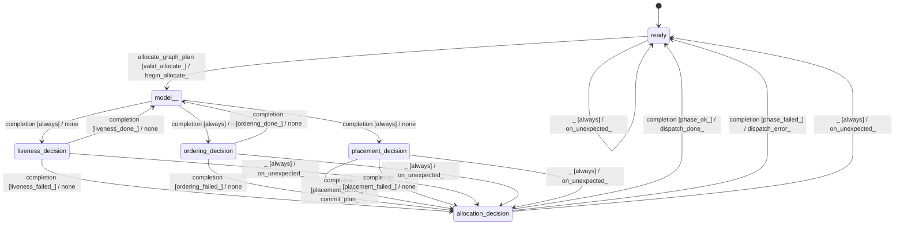

# graph_allocator

Source: [`emel/graph/allocator/sm.hpp`](https://github.com/stateforward/emel.cpp/blob/main/src/emel/graph/allocator/sm.hpp)

## Mermaid

## Transitions

| Source | Event | Guard | Action | Target |
| --- | --- | --- | --- | --- |
| [`ready`](https://github.com/stateforward/emel.cpp/blob/main/src/emel/graph/allocator/sm.hpp) | [`allocate_graph_plan`](https://github.com/stateforward/emel.cpp/blob/main/src/emel/graph/allocator/sm.hpp) | [`valid_allocate>`](https://github.com/stateforward/emel.cpp/blob/main/src/emel/graph/allocator/sm.hpp) | [`begin_allocate>`](https://github.com/stateforward/emel.cpp/blob/main/src/emel/graph/allocator/sm.hpp) | [`model>>`](https://github.com/stateforward/emel.cpp/blob/main/src/emel/graph/allocator/sm.hpp) |
| [`ready`](https://github.com/stateforward/emel.cpp/blob/main/src/emel/graph/allocator/sm.hpp) | [`allocate_graph_plan`](https://github.com/stateforward/emel.cpp/blob/main/src/emel/graph/allocator/sm.hpp) | [`invalid_allocate_with_dispatchable_output>`](https://github.com/stateforward/emel.cpp/blob/main/src/emel/graph/allocator/sm.hpp) | [`reject_invalid_allocate_with_dispatch>`](https://github.com/stateforward/emel.cpp/blob/main/src/emel/graph/allocator/sm.hpp) | [`ready`](https://github.com/stateforward/emel.cpp/blob/main/src/emel/graph/allocator/sm.hpp) |
| [`ready`](https://github.com/stateforward/emel.cpp/blob/main/src/emel/graph/allocator/sm.hpp) | [`allocate_graph_plan`](https://github.com/stateforward/emel.cpp/blob/main/src/emel/graph/allocator/sm.hpp) | [`invalid_allocate_with_output_only>`](https://github.com/stateforward/emel.cpp/blob/main/src/emel/graph/allocator/sm.hpp) | [`reject_invalid_allocate_with_output_only>`](https://github.com/stateforward/emel.cpp/blob/main/src/emel/graph/allocator/sm.hpp) | [`ready`](https://github.com/stateforward/emel.cpp/blob/main/src/emel/graph/allocator/sm.hpp) |
| [`ready`](https://github.com/stateforward/emel.cpp/blob/main/src/emel/graph/allocator/sm.hpp) | [`allocate_graph_plan`](https://github.com/stateforward/emel.cpp/blob/main/src/emel/graph/allocator/sm.hpp) | [`invalid_allocate_without_output>`](https://github.com/stateforward/emel.cpp/blob/main/src/emel/graph/allocator/sm.hpp) | [`reject_invalid_allocate_without_output>`](https://github.com/stateforward/emel.cpp/blob/main/src/emel/graph/allocator/sm.hpp) | [`ready`](https://github.com/stateforward/emel.cpp/blob/main/src/emel/graph/allocator/sm.hpp) |
| [`model>>`](https://github.com/stateforward/emel.cpp/blob/main/src/emel/graph/allocator/sm.hpp) | [`completion`](https://github.com/stateforward/emel.cpp/blob/main/src/emel/graph/allocator/sm.hpp) | [`always`](https://github.com/stateforward/emel.cpp/blob/main/src/emel/graph/allocator/sm.hpp) | [`none`](https://github.com/stateforward/emel.cpp/blob/main/src/emel/graph/allocator/sm.hpp) | [`liveness_decision`](https://github.com/stateforward/emel.cpp/blob/main/src/emel/graph/allocator/sm.hpp) |
| [`liveness_decision`](https://github.com/stateforward/emel.cpp/blob/main/src/emel/graph/allocator/sm.hpp) | [`completion`](https://github.com/stateforward/emel.cpp/blob/main/src/emel/graph/allocator/sm.hpp) | [`liveness_done>`](https://github.com/stateforward/emel.cpp/blob/main/src/emel/graph/allocator/sm.hpp) | [`none`](https://github.com/stateforward/emel.cpp/blob/main/src/emel/graph/allocator/sm.hpp) | [`model>>`](https://github.com/stateforward/emel.cpp/blob/main/src/emel/graph/allocator/sm.hpp) |
| [`liveness_decision`](https://github.com/stateforward/emel.cpp/blob/main/src/emel/graph/allocator/sm.hpp) | [`completion`](https://github.com/stateforward/emel.cpp/blob/main/src/emel/graph/allocator/sm.hpp) | [`liveness_failed>`](https://github.com/stateforward/emel.cpp/blob/main/src/emel/graph/allocator/sm.hpp) | [`none`](https://github.com/stateforward/emel.cpp/blob/main/src/emel/graph/allocator/sm.hpp) | [`allocation_decision`](https://github.com/stateforward/emel.cpp/blob/main/src/emel/graph/allocator/sm.hpp) |
| [`model>>`](https://github.com/stateforward/emel.cpp/blob/main/src/emel/graph/allocator/sm.hpp) | [`completion`](https://github.com/stateforward/emel.cpp/blob/main/src/emel/graph/allocator/sm.hpp) | [`always`](https://github.com/stateforward/emel.cpp/blob/main/src/emel/graph/allocator/sm.hpp) | [`none`](https://github.com/stateforward/emel.cpp/blob/main/src/emel/graph/allocator/sm.hpp) | [`ordering_decision`](https://github.com/stateforward/emel.cpp/blob/main/src/emel/graph/allocator/sm.hpp) |
| [`ordering_decision`](https://github.com/stateforward/emel.cpp/blob/main/src/emel/graph/allocator/sm.hpp) | [`completion`](https://github.com/stateforward/emel.cpp/blob/main/src/emel/graph/allocator/sm.hpp) | [`ordering_done>`](https://github.com/stateforward/emel.cpp/blob/main/src/emel/graph/allocator/sm.hpp) | [`none`](https://github.com/stateforward/emel.cpp/blob/main/src/emel/graph/allocator/sm.hpp) | [`model>>`](https://github.com/stateforward/emel.cpp/blob/main/src/emel/graph/allocator/sm.hpp) |
| [`ordering_decision`](https://github.com/stateforward/emel.cpp/blob/main/src/emel/graph/allocator/sm.hpp) | [`completion`](https://github.com/stateforward/emel.cpp/blob/main/src/emel/graph/allocator/sm.hpp) | [`ordering_failed>`](https://github.com/stateforward/emel.cpp/blob/main/src/emel/graph/allocator/sm.hpp) | [`none`](https://github.com/stateforward/emel.cpp/blob/main/src/emel/graph/allocator/sm.hpp) | [`allocation_decision`](https://github.com/stateforward/emel.cpp/blob/main/src/emel/graph/allocator/sm.hpp) |
| [`model>>`](https://github.com/stateforward/emel.cpp/blob/main/src/emel/graph/allocator/sm.hpp) | [`completion`](https://github.com/stateforward/emel.cpp/blob/main/src/emel/graph/allocator/sm.hpp) | [`always`](https://github.com/stateforward/emel.cpp/blob/main/src/emel/graph/allocator/sm.hpp) | [`none`](https://github.com/stateforward/emel.cpp/blob/main/src/emel/graph/allocator/sm.hpp) | [`placement_decision`](https://github.com/stateforward/emel.cpp/blob/main/src/emel/graph/allocator/sm.hpp) |
| [`placement_decision`](https://github.com/stateforward/emel.cpp/blob/main/src/emel/graph/allocator/sm.hpp) | [`completion`](https://github.com/stateforward/emel.cpp/blob/main/src/emel/graph/allocator/sm.hpp) | [`placement_done>`](https://github.com/stateforward/emel.cpp/blob/main/src/emel/graph/allocator/sm.hpp) | [`commit_plan>`](https://github.com/stateforward/emel.cpp/blob/main/src/emel/graph/allocator/sm.hpp) | [`allocation_decision`](https://github.com/stateforward/emel.cpp/blob/main/src/emel/graph/allocator/sm.hpp) |
| [`placement_decision`](https://github.com/stateforward/emel.cpp/blob/main/src/emel/graph/allocator/sm.hpp) | [`completion`](https://github.com/stateforward/emel.cpp/blob/main/src/emel/graph/allocator/sm.hpp) | [`placement_failed>`](https://github.com/stateforward/emel.cpp/blob/main/src/emel/graph/allocator/sm.hpp) | [`none`](https://github.com/stateforward/emel.cpp/blob/main/src/emel/graph/allocator/sm.hpp) | [`allocation_decision`](https://github.com/stateforward/emel.cpp/blob/main/src/emel/graph/allocator/sm.hpp) |
| [`allocation_decision`](https://github.com/stateforward/emel.cpp/blob/main/src/emel/graph/allocator/sm.hpp) | [`completion`](https://github.com/stateforward/emel.cpp/blob/main/src/emel/graph/allocator/sm.hpp) | [`phase_ok>`](https://github.com/stateforward/emel.cpp/blob/main/src/emel/graph/allocator/sm.hpp) | [`dispatch_done>`](https://github.com/stateforward/emel.cpp/blob/main/src/emel/graph/allocator/sm.hpp) | [`ready`](https://github.com/stateforward/emel.cpp/blob/main/src/emel/graph/allocator/sm.hpp) |
| [`allocation_decision`](https://github.com/stateforward/emel.cpp/blob/main/src/emel/graph/allocator/sm.hpp) | [`completion`](https://github.com/stateforward/emel.cpp/blob/main/src/emel/graph/allocator/sm.hpp) | [`phase_failed>`](https://github.com/stateforward/emel.cpp/blob/main/src/emel/graph/allocator/sm.hpp) | [`dispatch_error>`](https://github.com/stateforward/emel.cpp/blob/main/src/emel/graph/allocator/sm.hpp) | [`ready`](https://github.com/stateforward/emel.cpp/blob/main/src/emel/graph/allocator/sm.hpp) |
| [`ready`](https://github.com/stateforward/emel.cpp/blob/main/src/emel/graph/allocator/sm.hpp) | [`_`](https://github.com/stateforward/emel.cpp/blob/main/src/emel/graph/allocator/sm.hpp) | [`always`](https://github.com/stateforward/emel.cpp/blob/main/src/emel/graph/allocator/sm.hpp) | [`on_unexpected>`](https://github.com/stateforward/emel.cpp/blob/main/src/emel/graph/allocator/sm.hpp) | [`ready`](https://github.com/stateforward/emel.cpp/blob/main/src/emel/graph/allocator/sm.hpp) |
| [`liveness_decision`](https://github.com/stateforward/emel.cpp/blob/main/src/emel/graph/allocator/sm.hpp) | [`_`](https://github.com/stateforward/emel.cpp/blob/main/src/emel/graph/allocator/sm.hpp) | [`always`](https://github.com/stateforward/emel.cpp/blob/main/src/emel/graph/allocator/sm.hpp) | [`on_unexpected>`](https://github.com/stateforward/emel.cpp/blob/main/src/emel/graph/allocator/sm.hpp) | [`allocation_decision`](https://github.com/stateforward/emel.cpp/blob/main/src/emel/graph/allocator/sm.hpp) |
| [`ordering_decision`](https://github.com/stateforward/emel.cpp/blob/main/src/emel/graph/allocator/sm.hpp) | [`_`](https://github.com/stateforward/emel.cpp/blob/main/src/emel/graph/allocator/sm.hpp) | [`always`](https://github.com/stateforward/emel.cpp/blob/main/src/emel/graph/allocator/sm.hpp) | [`on_unexpected>`](https://github.com/stateforward/emel.cpp/blob/main/src/emel/graph/allocator/sm.hpp) | [`allocation_decision`](https://github.com/stateforward/emel.cpp/blob/main/src/emel/graph/allocator/sm.hpp) |
| [`placement_decision`](https://github.com/stateforward/emel.cpp/blob/main/src/emel/graph/allocator/sm.hpp) | [`_`](https://github.com/stateforward/emel.cpp/blob/main/src/emel/graph/allocator/sm.hpp) | [`always`](https://github.com/stateforward/emel.cpp/blob/main/src/emel/graph/allocator/sm.hpp) | [`on_unexpected>`](https://github.com/stateforward/emel.cpp/blob/main/src/emel/graph/allocator/sm.hpp) | [`allocation_decision`](https://github.com/stateforward/emel.cpp/blob/main/src/emel/graph/allocator/sm.hpp) |
| [`allocation_decision`](https://github.com/stateforward/emel.cpp/blob/main/src/emel/graph/allocator/sm.hpp) | [`_`](https://github.com/stateforward/emel.cpp/blob/main/src/emel/graph/allocator/sm.hpp) | [`always`](https://github.com/stateforward/emel.cpp/blob/main/src/emel/graph/allocator/sm.hpp) | [`on_unexpected>`](https://github.com/stateforward/emel.cpp/blob/main/src/emel/graph/allocator/sm.hpp) | [`ready`](https://github.com/stateforward/emel.cpp/blob/main/src/emel/graph/allocator/sm.hpp) |
