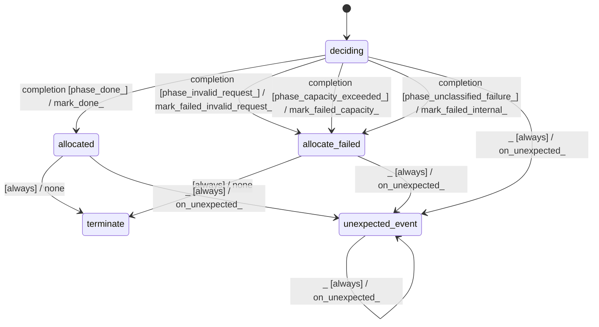

# graph_allocator_liveness_pass

Source: [`emel/graph/allocator/liveness_pass/sm.hpp`](https://github.com/stateforward/emel.cpp/blob/main/src/emel/graph/allocator/liveness_pass/sm.hpp)

## Mermaid

## Transitions

| Source | Event | Guard | Action | Target |
| --- | --- | --- | --- | --- |
| [`deciding`](https://github.com/stateforward/emel.cpp/blob/main/src/emel/graph/allocator/liveness_pass/sm.hpp) | [`completion`](https://github.com/stateforward/emel.cpp/blob/main/src/emel/graph/allocator/liveness_pass/sm.hpp) | [`phase_done>`](https://github.com/stateforward/emel.cpp/blob/main/src/emel/graph/allocator/liveness_pass/sm.hpp) | [`mark_done>`](https://github.com/stateforward/emel.cpp/blob/main/src/emel/graph/allocator/liveness_pass/sm.hpp) | [`allocated`](https://github.com/stateforward/emel.cpp/blob/main/src/emel/graph/allocator/liveness_pass/sm.hpp) |
| [`deciding`](https://github.com/stateforward/emel.cpp/blob/main/src/emel/graph/allocator/liveness_pass/sm.hpp) | [`completion`](https://github.com/stateforward/emel.cpp/blob/main/src/emel/graph/allocator/liveness_pass/sm.hpp) | [`phase_invalid_request>`](https://github.com/stateforward/emel.cpp/blob/main/src/emel/graph/allocator/liveness_pass/sm.hpp) | [`mark_failed_invalid_request>`](https://github.com/stateforward/emel.cpp/blob/main/src/emel/graph/allocator/liveness_pass/sm.hpp) | [`allocate_failed`](https://github.com/stateforward/emel.cpp/blob/main/src/emel/graph/allocator/liveness_pass/sm.hpp) |
| [`deciding`](https://github.com/stateforward/emel.cpp/blob/main/src/emel/graph/allocator/liveness_pass/sm.hpp) | [`completion`](https://github.com/stateforward/emel.cpp/blob/main/src/emel/graph/allocator/liveness_pass/sm.hpp) | [`phase_capacity_exceeded>`](https://github.com/stateforward/emel.cpp/blob/main/src/emel/graph/allocator/liveness_pass/sm.hpp) | [`mark_failed_capacity>`](https://github.com/stateforward/emel.cpp/blob/main/src/emel/graph/allocator/liveness_pass/sm.hpp) | [`allocate_failed`](https://github.com/stateforward/emel.cpp/blob/main/src/emel/graph/allocator/liveness_pass/sm.hpp) |
| [`deciding`](https://github.com/stateforward/emel.cpp/blob/main/src/emel/graph/allocator/liveness_pass/sm.hpp) | [`completion`](https://github.com/stateforward/emel.cpp/blob/main/src/emel/graph/allocator/liveness_pass/sm.hpp) | [`phase_unclassified_failure>`](https://github.com/stateforward/emel.cpp/blob/main/src/emel/graph/allocator/liveness_pass/sm.hpp) | [`mark_failed_internal>`](https://github.com/stateforward/emel.cpp/blob/main/src/emel/graph/allocator/liveness_pass/sm.hpp) | [`allocate_failed`](https://github.com/stateforward/emel.cpp/blob/main/src/emel/graph/allocator/liveness_pass/sm.hpp) |
| [`allocated`](https://github.com/stateforward/emel.cpp/blob/main/src/emel/graph/allocator/liveness_pass/sm.hpp) | - | [`always`](https://github.com/stateforward/emel.cpp/blob/main/src/emel/graph/allocator/liveness_pass/sm.hpp) | [`none`](https://github.com/stateforward/emel.cpp/blob/main/src/emel/graph/allocator/liveness_pass/sm.hpp) | [`terminate`](https://github.com/stateforward/emel.cpp/blob/main/src/emel/graph/allocator/liveness_pass/sm.hpp) |
| [`allocate_failed`](https://github.com/stateforward/emel.cpp/blob/main/src/emel/graph/allocator/liveness_pass/sm.hpp) | - | [`always`](https://github.com/stateforward/emel.cpp/blob/main/src/emel/graph/allocator/liveness_pass/sm.hpp) | [`none`](https://github.com/stateforward/emel.cpp/blob/main/src/emel/graph/allocator/liveness_pass/sm.hpp) | [`terminate`](https://github.com/stateforward/emel.cpp/blob/main/src/emel/graph/allocator/liveness_pass/sm.hpp) |
| [`deciding`](https://github.com/stateforward/emel.cpp/blob/main/src/emel/graph/allocator/liveness_pass/sm.hpp) | [`_`](https://github.com/stateforward/emel.cpp/blob/main/src/emel/graph/allocator/liveness_pass/sm.hpp) | [`always`](https://github.com/stateforward/emel.cpp/blob/main/src/emel/graph/allocator/liveness_pass/sm.hpp) | [`on_unexpected>`](https://github.com/stateforward/emel.cpp/blob/main/src/emel/graph/allocator/liveness_pass/sm.hpp) | [`unexpected_event`](https://github.com/stateforward/emel.cpp/blob/main/src/emel/graph/allocator/liveness_pass/sm.hpp) |
| [`allocated`](https://github.com/stateforward/emel.cpp/blob/main/src/emel/graph/allocator/liveness_pass/sm.hpp) | [`_`](https://github.com/stateforward/emel.cpp/blob/main/src/emel/graph/allocator/liveness_pass/sm.hpp) | [`always`](https://github.com/stateforward/emel.cpp/blob/main/src/emel/graph/allocator/liveness_pass/sm.hpp) | [`on_unexpected>`](https://github.com/stateforward/emel.cpp/blob/main/src/emel/graph/allocator/liveness_pass/sm.hpp) | [`unexpected_event`](https://github.com/stateforward/emel.cpp/blob/main/src/emel/graph/allocator/liveness_pass/sm.hpp) |
| [`allocate_failed`](https://github.com/stateforward/emel.cpp/blob/main/src/emel/graph/allocator/liveness_pass/sm.hpp) | [`_`](https://github.com/stateforward/emel.cpp/blob/main/src/emel/graph/allocator/liveness_pass/sm.hpp) | [`always`](https://github.com/stateforward/emel.cpp/blob/main/src/emel/graph/allocator/liveness_pass/sm.hpp) | [`on_unexpected>`](https://github.com/stateforward/emel.cpp/blob/main/src/emel/graph/allocator/liveness_pass/sm.hpp) | [`unexpected_event`](https://github.com/stateforward/emel.cpp/blob/main/src/emel/graph/allocator/liveness_pass/sm.hpp) |
| [`unexpected_event`](https://github.com/stateforward/emel.cpp/blob/main/src/emel/graph/allocator/liveness_pass/sm.hpp) | [`_`](https://github.com/stateforward/emel.cpp/blob/main/src/emel/graph/allocator/liveness_pass/sm.hpp) | [`always`](https://github.com/stateforward/emel.cpp/blob/main/src/emel/graph/allocator/liveness_pass/sm.hpp) | [`on_unexpected>`](https://github.com/stateforward/emel.cpp/blob/main/src/emel/graph/allocator/liveness_pass/sm.hpp) | [`unexpected_event`](https://github.com/stateforward/emel.cpp/blob/main/src/emel/graph/allocator/liveness_pass/sm.hpp) |
