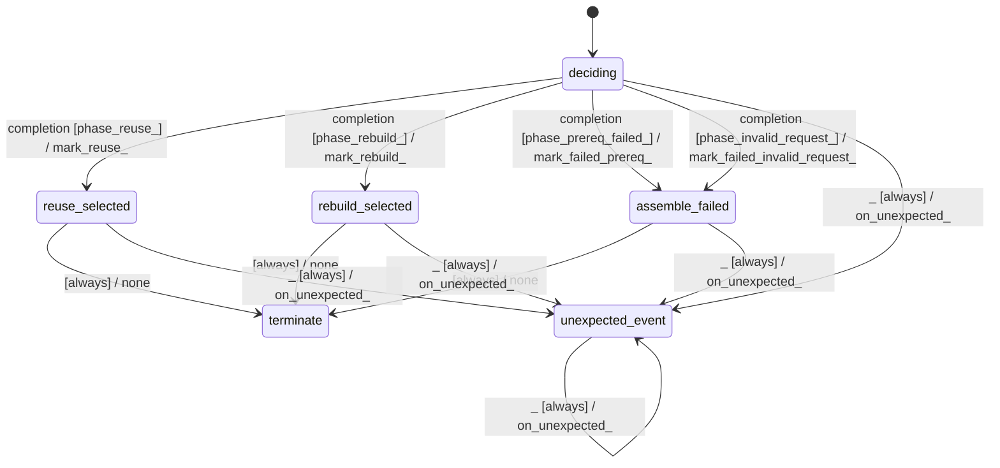

# graph_assembler_reuse_decision_pass

Source: [`emel/graph/assembler/reuse_decision_pass/sm.hpp`](https://github.com/stateforward/emel.cpp/blob/main/src/emel/graph/assembler/reuse_decision_pass/sm.hpp)

## Mermaid

## Transitions

| Source | Event | Guard | Action | Target |
| --- | --- | --- | --- | --- |
| [`deciding`](https://github.com/stateforward/emel.cpp/blob/main/src/emel/graph/assembler/reuse_decision_pass/sm.hpp) | [`completion`](https://github.com/stateforward/emel.cpp/blob/main/src/emel/graph/assembler/reuse_decision_pass/sm.hpp) | [`phase_reuse>`](https://github.com/stateforward/emel.cpp/blob/main/src/emel/graph/assembler/reuse_decision_pass/sm.hpp) | [`mark_reuse>`](https://github.com/stateforward/emel.cpp/blob/main/src/emel/graph/assembler/reuse_decision_pass/sm.hpp) | [`reuse_selected`](https://github.com/stateforward/emel.cpp/blob/main/src/emel/graph/assembler/reuse_decision_pass/sm.hpp) |
| [`deciding`](https://github.com/stateforward/emel.cpp/blob/main/src/emel/graph/assembler/reuse_decision_pass/sm.hpp) | [`completion`](https://github.com/stateforward/emel.cpp/blob/main/src/emel/graph/assembler/reuse_decision_pass/sm.hpp) | [`phase_rebuild>`](https://github.com/stateforward/emel.cpp/blob/main/src/emel/graph/assembler/reuse_decision_pass/sm.hpp) | [`mark_rebuild>`](https://github.com/stateforward/emel.cpp/blob/main/src/emel/graph/assembler/reuse_decision_pass/sm.hpp) | [`rebuild_selected`](https://github.com/stateforward/emel.cpp/blob/main/src/emel/graph/assembler/reuse_decision_pass/sm.hpp) |
| [`deciding`](https://github.com/stateforward/emel.cpp/blob/main/src/emel/graph/assembler/reuse_decision_pass/sm.hpp) | [`completion`](https://github.com/stateforward/emel.cpp/blob/main/src/emel/graph/assembler/reuse_decision_pass/sm.hpp) | [`phase_prereq_failed>`](https://github.com/stateforward/emel.cpp/blob/main/src/emel/graph/assembler/reuse_decision_pass/sm.hpp) | [`mark_failed_prereq>`](https://github.com/stateforward/emel.cpp/blob/main/src/emel/graph/assembler/reuse_decision_pass/sm.hpp) | [`assemble_failed`](https://github.com/stateforward/emel.cpp/blob/main/src/emel/graph/assembler/reuse_decision_pass/sm.hpp) |
| [`deciding`](https://github.com/stateforward/emel.cpp/blob/main/src/emel/graph/assembler/reuse_decision_pass/sm.hpp) | [`completion`](https://github.com/stateforward/emel.cpp/blob/main/src/emel/graph/assembler/reuse_decision_pass/sm.hpp) | [`phase_invalid_request>`](https://github.com/stateforward/emel.cpp/blob/main/src/emel/graph/assembler/reuse_decision_pass/sm.hpp) | [`mark_failed_invalid_request>`](https://github.com/stateforward/emel.cpp/blob/main/src/emel/graph/assembler/reuse_decision_pass/sm.hpp) | [`assemble_failed`](https://github.com/stateforward/emel.cpp/blob/main/src/emel/graph/assembler/reuse_decision_pass/sm.hpp) |
| [`reuse_selected`](https://github.com/stateforward/emel.cpp/blob/main/src/emel/graph/assembler/reuse_decision_pass/sm.hpp) | - | [`always`](https://github.com/stateforward/emel.cpp/blob/main/src/emel/graph/assembler/reuse_decision_pass/sm.hpp) | [`none`](https://github.com/stateforward/emel.cpp/blob/main/src/emel/graph/assembler/reuse_decision_pass/sm.hpp) | [`terminate`](https://github.com/stateforward/emel.cpp/blob/main/src/emel/graph/assembler/reuse_decision_pass/sm.hpp) |
| [`rebuild_selected`](https://github.com/stateforward/emel.cpp/blob/main/src/emel/graph/assembler/reuse_decision_pass/sm.hpp) | - | [`always`](https://github.com/stateforward/emel.cpp/blob/main/src/emel/graph/assembler/reuse_decision_pass/sm.hpp) | [`none`](https://github.com/stateforward/emel.cpp/blob/main/src/emel/graph/assembler/reuse_decision_pass/sm.hpp) | [`terminate`](https://github.com/stateforward/emel.cpp/blob/main/src/emel/graph/assembler/reuse_decision_pass/sm.hpp) |
| [`assemble_failed`](https://github.com/stateforward/emel.cpp/blob/main/src/emel/graph/assembler/reuse_decision_pass/sm.hpp) | - | [`always`](https://github.com/stateforward/emel.cpp/blob/main/src/emel/graph/assembler/reuse_decision_pass/sm.hpp) | [`none`](https://github.com/stateforward/emel.cpp/blob/main/src/emel/graph/assembler/reuse_decision_pass/sm.hpp) | [`terminate`](https://github.com/stateforward/emel.cpp/blob/main/src/emel/graph/assembler/reuse_decision_pass/sm.hpp) |
| [`deciding`](https://github.com/stateforward/emel.cpp/blob/main/src/emel/graph/assembler/reuse_decision_pass/sm.hpp) | [`_`](https://github.com/stateforward/emel.cpp/blob/main/src/emel/graph/assembler/reuse_decision_pass/sm.hpp) | [`always`](https://github.com/stateforward/emel.cpp/blob/main/src/emel/graph/assembler/reuse_decision_pass/sm.hpp) | [`on_unexpected>`](https://github.com/stateforward/emel.cpp/blob/main/src/emel/graph/assembler/reuse_decision_pass/sm.hpp) | [`unexpected_event`](https://github.com/stateforward/emel.cpp/blob/main/src/emel/graph/assembler/reuse_decision_pass/sm.hpp) |
| [`reuse_selected`](https://github.com/stateforward/emel.cpp/blob/main/src/emel/graph/assembler/reuse_decision_pass/sm.hpp) | [`_`](https://github.com/stateforward/emel.cpp/blob/main/src/emel/graph/assembler/reuse_decision_pass/sm.hpp) | [`always`](https://github.com/stateforward/emel.cpp/blob/main/src/emel/graph/assembler/reuse_decision_pass/sm.hpp) | [`on_unexpected>`](https://github.com/stateforward/emel.cpp/blob/main/src/emel/graph/assembler/reuse_decision_pass/sm.hpp) | [`unexpected_event`](https://github.com/stateforward/emel.cpp/blob/main/src/emel/graph/assembler/reuse_decision_pass/sm.hpp) |
| [`rebuild_selected`](https://github.com/stateforward/emel.cpp/blob/main/src/emel/graph/assembler/reuse_decision_pass/sm.hpp) | [`_`](https://github.com/stateforward/emel.cpp/blob/main/src/emel/graph/assembler/reuse_decision_pass/sm.hpp) | [`always`](https://github.com/stateforward/emel.cpp/blob/main/src/emel/graph/assembler/reuse_decision_pass/sm.hpp) | [`on_unexpected>`](https://github.com/stateforward/emel.cpp/blob/main/src/emel/graph/assembler/reuse_decision_pass/sm.hpp) | [`unexpected_event`](https://github.com/stateforward/emel.cpp/blob/main/src/emel/graph/assembler/reuse_decision_pass/sm.hpp) |
| [`assemble_failed`](https://github.com/stateforward/emel.cpp/blob/main/src/emel/graph/assembler/reuse_decision_pass/sm.hpp) | [`_`](https://github.com/stateforward/emel.cpp/blob/main/src/emel/graph/assembler/reuse_decision_pass/sm.hpp) | [`always`](https://github.com/stateforward/emel.cpp/blob/main/src/emel/graph/assembler/reuse_decision_pass/sm.hpp) | [`on_unexpected>`](https://github.com/stateforward/emel.cpp/blob/main/src/emel/graph/assembler/reuse_decision_pass/sm.hpp) | [`unexpected_event`](https://github.com/stateforward/emel.cpp/blob/main/src/emel/graph/assembler/reuse_decision_pass/sm.hpp) |
| [`unexpected_event`](https://github.com/stateforward/emel.cpp/blob/main/src/emel/graph/assembler/reuse_decision_pass/sm.hpp) | [`_`](https://github.com/stateforward/emel.cpp/blob/main/src/emel/graph/assembler/reuse_decision_pass/sm.hpp) | [`always`](https://github.com/stateforward/emel.cpp/blob/main/src/emel/graph/assembler/reuse_decision_pass/sm.hpp) | [`on_unexpected>`](https://github.com/stateforward/emel.cpp/blob/main/src/emel/graph/assembler/reuse_decision_pass/sm.hpp) | [`unexpected_event`](https://github.com/stateforward/emel.cpp/blob/main/src/emel/graph/assembler/reuse_decision_pass/sm.hpp) |
