# graph_processor

Source: [`emel/graph/processor/sm.hpp`](https://github.com/stateforward/emel.cpp/blob/main/src/emel/graph/processor/sm.hpp)

## Mermaid

```mermaid
stateDiagram-v2
  direction TB
  [*] --> ready
  ready --> model__ : execute_step [valid_execute_] / begin_execute_
  ready --> ready : execute_step [invalid_execute_with_dispatchable_output_] / reject_invalid_execute_with_dispatch_
  ready --> ready : execute_step [invalid_execute_with_output_only_] / reject_invalid_execute_with_output_only_
  ready --> ready : execute_step [invalid_execute_without_output_] / reject_invalid_execute_without_output_
  model__ --> validate_decision : completion_execute_step_ [always] / none
  validate_decision --> model__ : completion_execute_step_ [validate_done_] / none
  validate_decision --> execution_decision : completion_execute_step_ [validate_failed_] / none
  model__ --> prepare_decision : completion_execute_step_ [always] / none
  prepare_decision --> model__ : completion_execute_step_ [prepare_done_reused_] / none
  prepare_decision --> model__ : completion_execute_step_ [prepare_done_needs_allocation_] / none
  prepare_decision --> execution_decision : completion_execute_step_ [prepare_failed_] / none
  model__ --> alloc_decision : completion_execute_step_ [always] / none
  alloc_decision --> model__ : completion_execute_step_ [alloc_done_] / none
  alloc_decision --> execution_decision : completion_execute_step_ [alloc_failed_] / none
  model__ --> bind_decision : completion_execute_step_ [always] / none
  bind_decision --> model__ : completion_execute_step_ [bind_done_] / none
  bind_decision --> execution_decision : completion_execute_step_ [bind_failed_] / none
  model__ --> kernel_decision : completion_execute_step_ [always] / none
  kernel_decision --> model__ : completion_execute_step_ [kernel_done_] / none
  kernel_decision --> execution_decision : completion_execute_step_ [kernel_failed_] / none
  model__ --> extract_decision : completion_execute_step_ [always] / none
  extract_decision --> execution_decision : completion_execute_step_ [extract_done_] / commit_output_
  extract_decision --> execution_decision : completion_execute_step_ [extract_failed_] / none
  execution_decision --> ready : completion_execute_step_ [execution_error_none_] / dispatch_done_
  execution_decision --> ready : completion_execute_step_ [execution_error_invalid_request_] / dispatch_error_
  execution_decision --> ready : completion_execute_step_ [execution_error_kernel_failed_] / dispatch_error_
  execution_decision --> ready : completion_execute_step_ [execution_error_internal_error_] / dispatch_error_
  execution_decision --> ready : completion_execute_step_ [execution_error_untracked_] / dispatch_error_
  execution_decision --> ready : completion_execute_step_ [execution_error_unknown_] / dispatch_error_
  ready --> ready : _ [always] / on_unexpected_
  validate_decision --> execution_decision : _ [always] / on_unexpected_
  prepare_decision --> execution_decision : _ [always] / on_unexpected_
  alloc_decision --> execution_decision : _ [always] / on_unexpected_
  bind_decision --> execution_decision : _ [always] / on_unexpected_
  kernel_decision --> execution_decision : _ [always] / on_unexpected_
  extract_decision --> execution_decision : _ [always] / on_unexpected_
  execution_decision --> ready : _ [always] / on_unexpected_
```

## Transitions

| Source | Event | Guard | Action | Target |
| --- | --- | --- | --- | --- |
| [`ready`](https://github.com/stateforward/emel.cpp/blob/main/src/emel/graph/processor/sm.hpp) | [`execute_step`](https://github.com/stateforward/emel.cpp/blob/main/src/emel/graph/processor/sm.hpp) | [`valid_execute>`](https://github.com/stateforward/emel.cpp/blob/main/src/emel/graph/processor/sm.hpp) | [`begin_execute>`](https://github.com/stateforward/emel.cpp/blob/main/src/emel/graph/processor/sm.hpp) | [`model>>`](https://github.com/stateforward/emel.cpp/blob/main/src/emel/graph/processor/sm.hpp) |
| [`ready`](https://github.com/stateforward/emel.cpp/blob/main/src/emel/graph/processor/sm.hpp) | [`execute_step`](https://github.com/stateforward/emel.cpp/blob/main/src/emel/graph/processor/sm.hpp) | [`invalid_execute_with_dispatchable_output>`](https://github.com/stateforward/emel.cpp/blob/main/src/emel/graph/processor/sm.hpp) | [`reject_invalid_execute_with_dispatch>`](https://github.com/stateforward/emel.cpp/blob/main/src/emel/graph/processor/sm.hpp) | [`ready`](https://github.com/stateforward/emel.cpp/blob/main/src/emel/graph/processor/sm.hpp) |
| [`ready`](https://github.com/stateforward/emel.cpp/blob/main/src/emel/graph/processor/sm.hpp) | [`execute_step`](https://github.com/stateforward/emel.cpp/blob/main/src/emel/graph/processor/sm.hpp) | [`invalid_execute_with_output_only>`](https://github.com/stateforward/emel.cpp/blob/main/src/emel/graph/processor/sm.hpp) | [`reject_invalid_execute_with_output_only>`](https://github.com/stateforward/emel.cpp/blob/main/src/emel/graph/processor/sm.hpp) | [`ready`](https://github.com/stateforward/emel.cpp/blob/main/src/emel/graph/processor/sm.hpp) |
| [`ready`](https://github.com/stateforward/emel.cpp/blob/main/src/emel/graph/processor/sm.hpp) | [`execute_step`](https://github.com/stateforward/emel.cpp/blob/main/src/emel/graph/processor/sm.hpp) | [`invalid_execute_without_output>`](https://github.com/stateforward/emel.cpp/blob/main/src/emel/graph/processor/sm.hpp) | [`reject_invalid_execute_without_output>`](https://github.com/stateforward/emel.cpp/blob/main/src/emel/graph/processor/sm.hpp) | [`ready`](https://github.com/stateforward/emel.cpp/blob/main/src/emel/graph/processor/sm.hpp) |
| [`model>>`](https://github.com/stateforward/emel.cpp/blob/main/src/emel/graph/processor/sm.hpp) | [`completion<execute_step>`](https://github.com/stateforward/emel.cpp/blob/main/src/emel/graph/processor/sm.hpp) | [`always`](https://github.com/stateforward/emel.cpp/blob/main/src/emel/graph/processor/sm.hpp) | [`none`](https://github.com/stateforward/emel.cpp/blob/main/src/emel/graph/processor/sm.hpp) | [`validate_decision`](https://github.com/stateforward/emel.cpp/blob/main/src/emel/graph/processor/sm.hpp) |
| [`validate_decision`](https://github.com/stateforward/emel.cpp/blob/main/src/emel/graph/processor/sm.hpp) | [`completion<execute_step>`](https://github.com/stateforward/emel.cpp/blob/main/src/emel/graph/processor/sm.hpp) | [`validate_done>`](https://github.com/stateforward/emel.cpp/blob/main/src/emel/graph/processor/sm.hpp) | [`none`](https://github.com/stateforward/emel.cpp/blob/main/src/emel/graph/processor/sm.hpp) | [`model>>`](https://github.com/stateforward/emel.cpp/blob/main/src/emel/graph/processor/sm.hpp) |
| [`validate_decision`](https://github.com/stateforward/emel.cpp/blob/main/src/emel/graph/processor/sm.hpp) | [`completion<execute_step>`](https://github.com/stateforward/emel.cpp/blob/main/src/emel/graph/processor/sm.hpp) | [`validate_failed>`](https://github.com/stateforward/emel.cpp/blob/main/src/emel/graph/processor/sm.hpp) | [`none`](https://github.com/stateforward/emel.cpp/blob/main/src/emel/graph/processor/sm.hpp) | [`execution_decision`](https://github.com/stateforward/emel.cpp/blob/main/src/emel/graph/processor/sm.hpp) |
| [`model>>`](https://github.com/stateforward/emel.cpp/blob/main/src/emel/graph/processor/sm.hpp) | [`completion<execute_step>`](https://github.com/stateforward/emel.cpp/blob/main/src/emel/graph/processor/sm.hpp) | [`always`](https://github.com/stateforward/emel.cpp/blob/main/src/emel/graph/processor/sm.hpp) | [`none`](https://github.com/stateforward/emel.cpp/blob/main/src/emel/graph/processor/sm.hpp) | [`prepare_decision`](https://github.com/stateforward/emel.cpp/blob/main/src/emel/graph/processor/sm.hpp) |
| [`prepare_decision`](https://github.com/stateforward/emel.cpp/blob/main/src/emel/graph/processor/sm.hpp) | [`completion<execute_step>`](https://github.com/stateforward/emel.cpp/blob/main/src/emel/graph/processor/sm.hpp) | [`prepare_done_reused>`](https://github.com/stateforward/emel.cpp/blob/main/src/emel/graph/processor/sm.hpp) | [`none`](https://github.com/stateforward/emel.cpp/blob/main/src/emel/graph/processor/sm.hpp) | [`model>>`](https://github.com/stateforward/emel.cpp/blob/main/src/emel/graph/processor/sm.hpp) |
| [`prepare_decision`](https://github.com/stateforward/emel.cpp/blob/main/src/emel/graph/processor/sm.hpp) | [`completion<execute_step>`](https://github.com/stateforward/emel.cpp/blob/main/src/emel/graph/processor/sm.hpp) | [`prepare_done_needs_allocation>`](https://github.com/stateforward/emel.cpp/blob/main/src/emel/graph/processor/sm.hpp) | [`none`](https://github.com/stateforward/emel.cpp/blob/main/src/emel/graph/processor/sm.hpp) | [`model>>`](https://github.com/stateforward/emel.cpp/blob/main/src/emel/graph/processor/sm.hpp) |
| [`prepare_decision`](https://github.com/stateforward/emel.cpp/blob/main/src/emel/graph/processor/sm.hpp) | [`completion<execute_step>`](https://github.com/stateforward/emel.cpp/blob/main/src/emel/graph/processor/sm.hpp) | [`prepare_failed>`](https://github.com/stateforward/emel.cpp/blob/main/src/emel/graph/processor/sm.hpp) | [`none`](https://github.com/stateforward/emel.cpp/blob/main/src/emel/graph/processor/sm.hpp) | [`execution_decision`](https://github.com/stateforward/emel.cpp/blob/main/src/emel/graph/processor/sm.hpp) |
| [`model>>`](https://github.com/stateforward/emel.cpp/blob/main/src/emel/graph/processor/sm.hpp) | [`completion<execute_step>`](https://github.com/stateforward/emel.cpp/blob/main/src/emel/graph/processor/sm.hpp) | [`always`](https://github.com/stateforward/emel.cpp/blob/main/src/emel/graph/processor/sm.hpp) | [`none`](https://github.com/stateforward/emel.cpp/blob/main/src/emel/graph/processor/sm.hpp) | [`alloc_decision`](https://github.com/stateforward/emel.cpp/blob/main/src/emel/graph/processor/sm.hpp) |
| [`alloc_decision`](https://github.com/stateforward/emel.cpp/blob/main/src/emel/graph/processor/sm.hpp) | [`completion<execute_step>`](https://github.com/stateforward/emel.cpp/blob/main/src/emel/graph/processor/sm.hpp) | [`alloc_done>`](https://github.com/stateforward/emel.cpp/blob/main/src/emel/graph/processor/sm.hpp) | [`none`](https://github.com/stateforward/emel.cpp/blob/main/src/emel/graph/processor/sm.hpp) | [`model>>`](https://github.com/stateforward/emel.cpp/blob/main/src/emel/graph/processor/sm.hpp) |
| [`alloc_decision`](https://github.com/stateforward/emel.cpp/blob/main/src/emel/graph/processor/sm.hpp) | [`completion<execute_step>`](https://github.com/stateforward/emel.cpp/blob/main/src/emel/graph/processor/sm.hpp) | [`alloc_failed>`](https://github.com/stateforward/emel.cpp/blob/main/src/emel/graph/processor/sm.hpp) | [`none`](https://github.com/stateforward/emel.cpp/blob/main/src/emel/graph/processor/sm.hpp) | [`execution_decision`](https://github.com/stateforward/emel.cpp/blob/main/src/emel/graph/processor/sm.hpp) |
| [`model>>`](https://github.com/stateforward/emel.cpp/blob/main/src/emel/graph/processor/sm.hpp) | [`completion<execute_step>`](https://github.com/stateforward/emel.cpp/blob/main/src/emel/graph/processor/sm.hpp) | [`always`](https://github.com/stateforward/emel.cpp/blob/main/src/emel/graph/processor/sm.hpp) | [`none`](https://github.com/stateforward/emel.cpp/blob/main/src/emel/graph/processor/sm.hpp) | [`bind_decision`](https://github.com/stateforward/emel.cpp/blob/main/src/emel/graph/processor/sm.hpp) |
| [`bind_decision`](https://github.com/stateforward/emel.cpp/blob/main/src/emel/graph/processor/sm.hpp) | [`completion<execute_step>`](https://github.com/stateforward/emel.cpp/blob/main/src/emel/graph/processor/sm.hpp) | [`bind_done>`](https://github.com/stateforward/emel.cpp/blob/main/src/emel/graph/processor/sm.hpp) | [`none`](https://github.com/stateforward/emel.cpp/blob/main/src/emel/graph/processor/sm.hpp) | [`model>>`](https://github.com/stateforward/emel.cpp/blob/main/src/emel/graph/processor/sm.hpp) |
| [`bind_decision`](https://github.com/stateforward/emel.cpp/blob/main/src/emel/graph/processor/sm.hpp) | [`completion<execute_step>`](https://github.com/stateforward/emel.cpp/blob/main/src/emel/graph/processor/sm.hpp) | [`bind_failed>`](https://github.com/stateforward/emel.cpp/blob/main/src/emel/graph/processor/sm.hpp) | [`none`](https://github.com/stateforward/emel.cpp/blob/main/src/emel/graph/processor/sm.hpp) | [`execution_decision`](https://github.com/stateforward/emel.cpp/blob/main/src/emel/graph/processor/sm.hpp) |
| [`model>>`](https://github.com/stateforward/emel.cpp/blob/main/src/emel/graph/processor/sm.hpp) | [`completion<execute_step>`](https://github.com/stateforward/emel.cpp/blob/main/src/emel/graph/processor/sm.hpp) | [`always`](https://github.com/stateforward/emel.cpp/blob/main/src/emel/graph/processor/sm.hpp) | [`none`](https://github.com/stateforward/emel.cpp/blob/main/src/emel/graph/processor/sm.hpp) | [`kernel_decision`](https://github.com/stateforward/emel.cpp/blob/main/src/emel/graph/processor/sm.hpp) |
| [`kernel_decision`](https://github.com/stateforward/emel.cpp/blob/main/src/emel/graph/processor/sm.hpp) | [`completion<execute_step>`](https://github.com/stateforward/emel.cpp/blob/main/src/emel/graph/processor/sm.hpp) | [`kernel_done>`](https://github.com/stateforward/emel.cpp/blob/main/src/emel/graph/processor/sm.hpp) | [`none`](https://github.com/stateforward/emel.cpp/blob/main/src/emel/graph/processor/sm.hpp) | [`model>>`](https://github.com/stateforward/emel.cpp/blob/main/src/emel/graph/processor/sm.hpp) |
| [`kernel_decision`](https://github.com/stateforward/emel.cpp/blob/main/src/emel/graph/processor/sm.hpp) | [`completion<execute_step>`](https://github.com/stateforward/emel.cpp/blob/main/src/emel/graph/processor/sm.hpp) | [`kernel_failed>`](https://github.com/stateforward/emel.cpp/blob/main/src/emel/graph/processor/sm.hpp) | [`none`](https://github.com/stateforward/emel.cpp/blob/main/src/emel/graph/processor/sm.hpp) | [`execution_decision`](https://github.com/stateforward/emel.cpp/blob/main/src/emel/graph/processor/sm.hpp) |
| [`model>>`](https://github.com/stateforward/emel.cpp/blob/main/src/emel/graph/processor/sm.hpp) | [`completion<execute_step>`](https://github.com/stateforward/emel.cpp/blob/main/src/emel/graph/processor/sm.hpp) | [`always`](https://github.com/stateforward/emel.cpp/blob/main/src/emel/graph/processor/sm.hpp) | [`none`](https://github.com/stateforward/emel.cpp/blob/main/src/emel/graph/processor/sm.hpp) | [`extract_decision`](https://github.com/stateforward/emel.cpp/blob/main/src/emel/graph/processor/sm.hpp) |
| [`extract_decision`](https://github.com/stateforward/emel.cpp/blob/main/src/emel/graph/processor/sm.hpp) | [`completion<execute_step>`](https://github.com/stateforward/emel.cpp/blob/main/src/emel/graph/processor/sm.hpp) | [`extract_done>`](https://github.com/stateforward/emel.cpp/blob/main/src/emel/graph/processor/sm.hpp) | [`commit_output>`](https://github.com/stateforward/emel.cpp/blob/main/src/emel/graph/processor/sm.hpp) | [`execution_decision`](https://github.com/stateforward/emel.cpp/blob/main/src/emel/graph/processor/sm.hpp) |
| [`extract_decision`](https://github.com/stateforward/emel.cpp/blob/main/src/emel/graph/processor/sm.hpp) | [`completion<execute_step>`](https://github.com/stateforward/emel.cpp/blob/main/src/emel/graph/processor/sm.hpp) | [`extract_failed>`](https://github.com/stateforward/emel.cpp/blob/main/src/emel/graph/processor/sm.hpp) | [`none`](https://github.com/stateforward/emel.cpp/blob/main/src/emel/graph/processor/sm.hpp) | [`execution_decision`](https://github.com/stateforward/emel.cpp/blob/main/src/emel/graph/processor/sm.hpp) |
| [`execution_decision`](https://github.com/stateforward/emel.cpp/blob/main/src/emel/graph/processor/sm.hpp) | [`completion<execute_step>`](https://github.com/stateforward/emel.cpp/blob/main/src/emel/graph/processor/sm.hpp) | [`execution_error_none>`](https://github.com/stateforward/emel.cpp/blob/main/src/emel/graph/processor/sm.hpp) | [`dispatch_done>`](https://github.com/stateforward/emel.cpp/blob/main/src/emel/graph/processor/sm.hpp) | [`ready`](https://github.com/stateforward/emel.cpp/blob/main/src/emel/graph/processor/sm.hpp) |
| [`execution_decision`](https://github.com/stateforward/emel.cpp/blob/main/src/emel/graph/processor/sm.hpp) | [`completion<execute_step>`](https://github.com/stateforward/emel.cpp/blob/main/src/emel/graph/processor/sm.hpp) | [`execution_error_invalid_request>`](https://github.com/stateforward/emel.cpp/blob/main/src/emel/graph/processor/sm.hpp) | [`dispatch_error>`](https://github.com/stateforward/emel.cpp/blob/main/src/emel/graph/processor/sm.hpp) | [`ready`](https://github.com/stateforward/emel.cpp/blob/main/src/emel/graph/processor/sm.hpp) |
| [`execution_decision`](https://github.com/stateforward/emel.cpp/blob/main/src/emel/graph/processor/sm.hpp) | [`completion<execute_step>`](https://github.com/stateforward/emel.cpp/blob/main/src/emel/graph/processor/sm.hpp) | [`execution_error_kernel_failed>`](https://github.com/stateforward/emel.cpp/blob/main/src/emel/graph/processor/sm.hpp) | [`dispatch_error>`](https://github.com/stateforward/emel.cpp/blob/main/src/emel/graph/processor/sm.hpp) | [`ready`](https://github.com/stateforward/emel.cpp/blob/main/src/emel/graph/processor/sm.hpp) |
| [`execution_decision`](https://github.com/stateforward/emel.cpp/blob/main/src/emel/graph/processor/sm.hpp) | [`completion<execute_step>`](https://github.com/stateforward/emel.cpp/blob/main/src/emel/graph/processor/sm.hpp) | [`execution_error_internal_error>`](https://github.com/stateforward/emel.cpp/blob/main/src/emel/graph/processor/sm.hpp) | [`dispatch_error>`](https://github.com/stateforward/emel.cpp/blob/main/src/emel/graph/processor/sm.hpp) | [`ready`](https://github.com/stateforward/emel.cpp/blob/main/src/emel/graph/processor/sm.hpp) |
| [`execution_decision`](https://github.com/stateforward/emel.cpp/blob/main/src/emel/graph/processor/sm.hpp) | [`completion<execute_step>`](https://github.com/stateforward/emel.cpp/blob/main/src/emel/graph/processor/sm.hpp) | [`execution_error_untracked>`](https://github.com/stateforward/emel.cpp/blob/main/src/emel/graph/processor/sm.hpp) | [`dispatch_error>`](https://github.com/stateforward/emel.cpp/blob/main/src/emel/graph/processor/sm.hpp) | [`ready`](https://github.com/stateforward/emel.cpp/blob/main/src/emel/graph/processor/sm.hpp) |
| [`execution_decision`](https://github.com/stateforward/emel.cpp/blob/main/src/emel/graph/processor/sm.hpp) | [`completion<execute_step>`](https://github.com/stateforward/emel.cpp/blob/main/src/emel/graph/processor/sm.hpp) | [`execution_error_unknown>`](https://github.com/stateforward/emel.cpp/blob/main/src/emel/graph/processor/sm.hpp) | [`dispatch_error>`](https://github.com/stateforward/emel.cpp/blob/main/src/emel/graph/processor/sm.hpp) | [`ready`](https://github.com/stateforward/emel.cpp/blob/main/src/emel/graph/processor/sm.hpp) |
| [`ready`](https://github.com/stateforward/emel.cpp/blob/main/src/emel/graph/processor/sm.hpp) | [`_`](https://github.com/stateforward/emel.cpp/blob/main/src/emel/graph/processor/sm.hpp) | [`always`](https://github.com/stateforward/emel.cpp/blob/main/src/emel/graph/processor/sm.hpp) | [`on_unexpected>`](https://github.com/stateforward/emel.cpp/blob/main/src/emel/graph/processor/sm.hpp) | [`ready`](https://github.com/stateforward/emel.cpp/blob/main/src/emel/graph/processor/sm.hpp) |
| [`validate_decision`](https://github.com/stateforward/emel.cpp/blob/main/src/emel/graph/processor/sm.hpp) | [`_`](https://github.com/stateforward/emel.cpp/blob/main/src/emel/graph/processor/sm.hpp) | [`always`](https://github.com/stateforward/emel.cpp/blob/main/src/emel/graph/processor/sm.hpp) | [`on_unexpected>`](https://github.com/stateforward/emel.cpp/blob/main/src/emel/graph/processor/sm.hpp) | [`execution_decision`](https://github.com/stateforward/emel.cpp/blob/main/src/emel/graph/processor/sm.hpp) |
| [`prepare_decision`](https://github.com/stateforward/emel.cpp/blob/main/src/emel/graph/processor/sm.hpp) | [`_`](https://github.com/stateforward/emel.cpp/blob/main/src/emel/graph/processor/sm.hpp) | [`always`](https://github.com/stateforward/emel.cpp/blob/main/src/emel/graph/processor/sm.hpp) | [`on_unexpected>`](https://github.com/stateforward/emel.cpp/blob/main/src/emel/graph/processor/sm.hpp) | [`execution_decision`](https://github.com/stateforward/emel.cpp/blob/main/src/emel/graph/processor/sm.hpp) |
| [`alloc_decision`](https://github.com/stateforward/emel.cpp/blob/main/src/emel/graph/processor/sm.hpp) | [`_`](https://github.com/stateforward/emel.cpp/blob/main/src/emel/graph/processor/sm.hpp) | [`always`](https://github.com/stateforward/emel.cpp/blob/main/src/emel/graph/processor/sm.hpp) | [`on_unexpected>`](https://github.com/stateforward/emel.cpp/blob/main/src/emel/graph/processor/sm.hpp) | [`execution_decision`](https://github.com/stateforward/emel.cpp/blob/main/src/emel/graph/processor/sm.hpp) |
| [`bind_decision`](https://github.com/stateforward/emel.cpp/blob/main/src/emel/graph/processor/sm.hpp) | [`_`](https://github.com/stateforward/emel.cpp/blob/main/src/emel/graph/processor/sm.hpp) | [`always`](https://github.com/stateforward/emel.cpp/blob/main/src/emel/graph/processor/sm.hpp) | [`on_unexpected>`](https://github.com/stateforward/emel.cpp/blob/main/src/emel/graph/processor/sm.hpp) | [`execution_decision`](https://github.com/stateforward/emel.cpp/blob/main/src/emel/graph/processor/sm.hpp) |
| [`kernel_decision`](https://github.com/stateforward/emel.cpp/blob/main/src/emel/graph/processor/sm.hpp) | [`_`](https://github.com/stateforward/emel.cpp/blob/main/src/emel/graph/processor/sm.hpp) | [`always`](https://github.com/stateforward/emel.cpp/blob/main/src/emel/graph/processor/sm.hpp) | [`on_unexpected>`](https://github.com/stateforward/emel.cpp/blob/main/src/emel/graph/processor/sm.hpp) | [`execution_decision`](https://github.com/stateforward/emel.cpp/blob/main/src/emel/graph/processor/sm.hpp) |
| [`extract_decision`](https://github.com/stateforward/emel.cpp/blob/main/src/emel/graph/processor/sm.hpp) | [`_`](https://github.com/stateforward/emel.cpp/blob/main/src/emel/graph/processor/sm.hpp) | [`always`](https://github.com/stateforward/emel.cpp/blob/main/src/emel/graph/processor/sm.hpp) | [`on_unexpected>`](https://github.com/stateforward/emel.cpp/blob/main/src/emel/graph/processor/sm.hpp) | [`execution_decision`](https://github.com/stateforward/emel.cpp/blob/main/src/emel/graph/processor/sm.hpp) |
| [`execution_decision`](https://github.com/stateforward/emel.cpp/blob/main/src/emel/graph/processor/sm.hpp) | [`_`](https://github.com/stateforward/emel.cpp/blob/main/src/emel/graph/processor/sm.hpp) | [`always`](https://github.com/stateforward/emel.cpp/blob/main/src/emel/graph/processor/sm.hpp) | [`on_unexpected>`](https://github.com/stateforward/emel.cpp/blob/main/src/emel/graph/processor/sm.hpp) | [`ready`](https://github.com/stateforward/emel.cpp/blob/main/src/emel/graph/processor/sm.hpp) |
