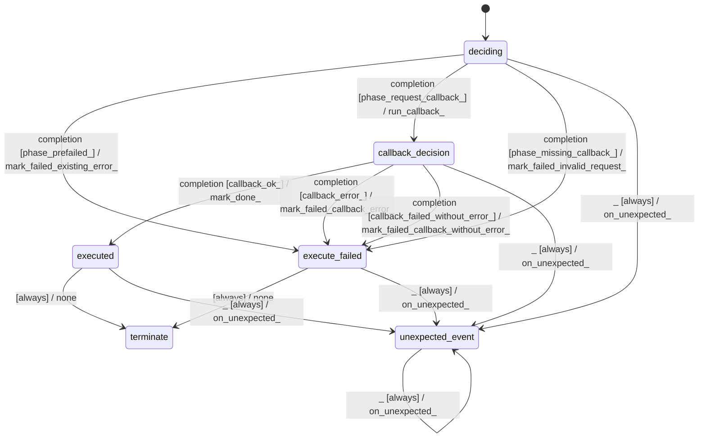

# graph_processor_extract_step

Source: [`emel/graph/processor/extract_step/sm.hpp`](https://github.com/stateforward/emel.cpp/blob/main/src/emel/graph/processor/extract_step/sm.hpp)

## Mermaid

## Transitions

| Source | Event | Guard | Action | Target |
| --- | --- | --- | --- | --- |
| [`deciding`](https://github.com/stateforward/emel.cpp/blob/main/src/emel/graph/processor/extract_step/sm.hpp) | [`completion`](https://github.com/stateforward/emel.cpp/blob/main/src/emel/graph/processor/extract_step/sm.hpp) | [`phase_prefailed>`](https://github.com/stateforward/emel.cpp/blob/main/src/emel/graph/processor/extract_step/sm.hpp) | [`mark_failed_existing_error>`](https://github.com/stateforward/emel.cpp/blob/main/src/emel/graph/processor/extract_step/sm.hpp) | [`execute_failed`](https://github.com/stateforward/emel.cpp/blob/main/src/emel/graph/processor/extract_step/sm.hpp) |
| [`deciding`](https://github.com/stateforward/emel.cpp/blob/main/src/emel/graph/processor/extract_step/sm.hpp) | [`completion`](https://github.com/stateforward/emel.cpp/blob/main/src/emel/graph/processor/extract_step/sm.hpp) | [`phase_request_callback>`](https://github.com/stateforward/emel.cpp/blob/main/src/emel/graph/processor/extract_step/sm.hpp) | [`run_callback>`](https://github.com/stateforward/emel.cpp/blob/main/src/emel/graph/processor/extract_step/sm.hpp) | [`callback_decision`](https://github.com/stateforward/emel.cpp/blob/main/src/emel/graph/processor/extract_step/sm.hpp) |
| [`deciding`](https://github.com/stateforward/emel.cpp/blob/main/src/emel/graph/processor/extract_step/sm.hpp) | [`completion`](https://github.com/stateforward/emel.cpp/blob/main/src/emel/graph/processor/extract_step/sm.hpp) | [`phase_missing_callback>`](https://github.com/stateforward/emel.cpp/blob/main/src/emel/graph/processor/extract_step/sm.hpp) | [`mark_failed_invalid_request>`](https://github.com/stateforward/emel.cpp/blob/main/src/emel/graph/processor/extract_step/sm.hpp) | [`execute_failed`](https://github.com/stateforward/emel.cpp/blob/main/src/emel/graph/processor/extract_step/sm.hpp) |
| [`callback_decision`](https://github.com/stateforward/emel.cpp/blob/main/src/emel/graph/processor/extract_step/sm.hpp) | [`completion`](https://github.com/stateforward/emel.cpp/blob/main/src/emel/graph/processor/extract_step/sm.hpp) | [`callback_ok>`](https://github.com/stateforward/emel.cpp/blob/main/src/emel/graph/processor/extract_step/sm.hpp) | [`mark_done>`](https://github.com/stateforward/emel.cpp/blob/main/src/emel/graph/processor/extract_step/sm.hpp) | [`executed`](https://github.com/stateforward/emel.cpp/blob/main/src/emel/graph/processor/extract_step/sm.hpp) |
| [`callback_decision`](https://github.com/stateforward/emel.cpp/blob/main/src/emel/graph/processor/extract_step/sm.hpp) | [`completion`](https://github.com/stateforward/emel.cpp/blob/main/src/emel/graph/processor/extract_step/sm.hpp) | [`callback_error>`](https://github.com/stateforward/emel.cpp/blob/main/src/emel/graph/processor/extract_step/sm.hpp) | [`mark_failed_callback_error>`](https://github.com/stateforward/emel.cpp/blob/main/src/emel/graph/processor/extract_step/sm.hpp) | [`execute_failed`](https://github.com/stateforward/emel.cpp/blob/main/src/emel/graph/processor/extract_step/sm.hpp) |
| [`callback_decision`](https://github.com/stateforward/emel.cpp/blob/main/src/emel/graph/processor/extract_step/sm.hpp) | [`completion`](https://github.com/stateforward/emel.cpp/blob/main/src/emel/graph/processor/extract_step/sm.hpp) | [`callback_failed_without_error>`](https://github.com/stateforward/emel.cpp/blob/main/src/emel/graph/processor/extract_step/sm.hpp) | [`mark_failed_callback_without_error>`](https://github.com/stateforward/emel.cpp/blob/main/src/emel/graph/processor/extract_step/sm.hpp) | [`execute_failed`](https://github.com/stateforward/emel.cpp/blob/main/src/emel/graph/processor/extract_step/sm.hpp) |
| [`executed`](https://github.com/stateforward/emel.cpp/blob/main/src/emel/graph/processor/extract_step/sm.hpp) | - | [`always`](https://github.com/stateforward/emel.cpp/blob/main/src/emel/graph/processor/extract_step/sm.hpp) | [`none`](https://github.com/stateforward/emel.cpp/blob/main/src/emel/graph/processor/extract_step/sm.hpp) | [`terminate`](https://github.com/stateforward/emel.cpp/blob/main/src/emel/graph/processor/extract_step/sm.hpp) |
| [`execute_failed`](https://github.com/stateforward/emel.cpp/blob/main/src/emel/graph/processor/extract_step/sm.hpp) | - | [`always`](https://github.com/stateforward/emel.cpp/blob/main/src/emel/graph/processor/extract_step/sm.hpp) | [`none`](https://github.com/stateforward/emel.cpp/blob/main/src/emel/graph/processor/extract_step/sm.hpp) | [`terminate`](https://github.com/stateforward/emel.cpp/blob/main/src/emel/graph/processor/extract_step/sm.hpp) |
| [`deciding`](https://github.com/stateforward/emel.cpp/blob/main/src/emel/graph/processor/extract_step/sm.hpp) | [`_`](https://github.com/stateforward/emel.cpp/blob/main/src/emel/graph/processor/extract_step/sm.hpp) | [`always`](https://github.com/stateforward/emel.cpp/blob/main/src/emel/graph/processor/extract_step/sm.hpp) | [`on_unexpected>`](https://github.com/stateforward/emel.cpp/blob/main/src/emel/graph/processor/extract_step/sm.hpp) | [`unexpected_event`](https://github.com/stateforward/emel.cpp/blob/main/src/emel/graph/processor/extract_step/sm.hpp) |
| [`callback_decision`](https://github.com/stateforward/emel.cpp/blob/main/src/emel/graph/processor/extract_step/sm.hpp) | [`_`](https://github.com/stateforward/emel.cpp/blob/main/src/emel/graph/processor/extract_step/sm.hpp) | [`always`](https://github.com/stateforward/emel.cpp/blob/main/src/emel/graph/processor/extract_step/sm.hpp) | [`on_unexpected>`](https://github.com/stateforward/emel.cpp/blob/main/src/emel/graph/processor/extract_step/sm.hpp) | [`unexpected_event`](https://github.com/stateforward/emel.cpp/blob/main/src/emel/graph/processor/extract_step/sm.hpp) |
| [`executed`](https://github.com/stateforward/emel.cpp/blob/main/src/emel/graph/processor/extract_step/sm.hpp) | [`_`](https://github.com/stateforward/emel.cpp/blob/main/src/emel/graph/processor/extract_step/sm.hpp) | [`always`](https://github.com/stateforward/emel.cpp/blob/main/src/emel/graph/processor/extract_step/sm.hpp) | [`on_unexpected>`](https://github.com/stateforward/emel.cpp/blob/main/src/emel/graph/processor/extract_step/sm.hpp) | [`unexpected_event`](https://github.com/stateforward/emel.cpp/blob/main/src/emel/graph/processor/extract_step/sm.hpp) |
| [`execute_failed`](https://github.com/stateforward/emel.cpp/blob/main/src/emel/graph/processor/extract_step/sm.hpp) | [`_`](https://github.com/stateforward/emel.cpp/blob/main/src/emel/graph/processor/extract_step/sm.hpp) | [`always`](https://github.com/stateforward/emel.cpp/blob/main/src/emel/graph/processor/extract_step/sm.hpp) | [`on_unexpected>`](https://github.com/stateforward/emel.cpp/blob/main/src/emel/graph/processor/extract_step/sm.hpp) | [`unexpected_event`](https://github.com/stateforward/emel.cpp/blob/main/src/emel/graph/processor/extract_step/sm.hpp) |
| [`unexpected_event`](https://github.com/stateforward/emel.cpp/blob/main/src/emel/graph/processor/extract_step/sm.hpp) | [`_`](https://github.com/stateforward/emel.cpp/blob/main/src/emel/graph/processor/extract_step/sm.hpp) | [`always`](https://github.com/stateforward/emel.cpp/blob/main/src/emel/graph/processor/extract_step/sm.hpp) | [`on_unexpected>`](https://github.com/stateforward/emel.cpp/blob/main/src/emel/graph/processor/extract_step/sm.hpp) | [`unexpected_event`](https://github.com/stateforward/emel.cpp/blob/main/src/emel/graph/processor/extract_step/sm.hpp) |
