# jinja_parser

Source: [`emel/jinja/parser/sm.hpp`](https://github.com/stateforward/emel.cpp/blob/main/src/emel/jinja/parser/sm.hpp)

## Mermaid

```mermaid
stateDiagram-v2
  direction TB
  [*] --> emel__jinja__parser__initialized
  emel__jinja__parser__initialized --> emel__jinja__parser__parse_decision : emel__jinja__event__parse [boost__sml__aux__zero_wrapper_emel__jinja__parser__guard__valid_parse_] / boost__sml__aux__zero_wrapper_emel__jinja__parser__action__run_parse_
  emel__jinja__parser__initialized --> emel__jinja__parser__errored : emel__jinja__event__parse [boost__sml__aux__zero_wrapper_emel__jinja__parser__guard__invalid_parse_] / boost__sml__aux__zero_wrapper_emel__jinja__parser__action__reject_invalid_parse_
  emel__jinja__parser__done --> emel__jinja__parser__parse_decision : emel__jinja__event__parse [boost__sml__aux__zero_wrapper_emel__jinja__parser__guard__valid_parse_] / boost__sml__aux__zero_wrapper_emel__jinja__parser__action__run_parse_
  emel__jinja__parser__done --> emel__jinja__parser__errored : emel__jinja__event__parse [boost__sml__aux__zero_wrapper_emel__jinja__parser__guard__invalid_parse_] / boost__sml__aux__zero_wrapper_emel__jinja__parser__action__reject_invalid_parse_
  emel__jinja__parser__errored --> emel__jinja__parser__parse_decision : emel__jinja__event__parse [boost__sml__aux__zero_wrapper_emel__jinja__parser__guard__valid_parse_] / boost__sml__aux__zero_wrapper_emel__jinja__parser__action__run_parse_
  emel__jinja__parser__errored --> emel__jinja__parser__errored : emel__jinja__event__parse [boost__sml__aux__zero_wrapper_emel__jinja__parser__guard__invalid_parse_] / boost__sml__aux__zero_wrapper_emel__jinja__parser__action__reject_invalid_parse_
  emel__jinja__parser__unexpected --> emel__jinja__parser__parse_decision : emel__jinja__event__parse [boost__sml__aux__zero_wrapper_emel__jinja__parser__guard__valid_parse_] / boost__sml__aux__zero_wrapper_emel__jinja__parser__action__run_parse_
  emel__jinja__parser__unexpected --> emel__jinja__parser__unexpected : emel__jinja__event__parse [boost__sml__aux__zero_wrapper_emel__jinja__parser__guard__invalid_parse_] / boost__sml__aux__zero_wrapper_emel__jinja__parser__action__reject_invalid_parse_
  emel__jinja__parser__parse_decision --> emel__jinja__parser__done : [boost__sml__aux__zero_wrapper_emel__jinja__parser__guard__phase_ok_] / boost__sml__front__none
  emel__jinja__parser__parse_decision --> emel__jinja__parser__errored : [boost__sml__aux__zero_wrapper_emel__jinja__parser__guard__phase_failed_] / boost__sml__front__none
  emel__jinja__parser__initialized --> emel__jinja__parser__unexpected : boost__sml__back___ [boost__sml__front__always] / boost__sml__aux__zero_wrapper_emel__jinja__parser__action__on_unexpected_
  emel__jinja__parser__parse_decision --> emel__jinja__parser__unexpected : boost__sml__back___ [boost__sml__front__always] / boost__sml__aux__zero_wrapper_emel__jinja__parser__action__on_unexpected_
  emel__jinja__parser__done --> emel__jinja__parser__unexpected : boost__sml__back___ [boost__sml__front__always] / boost__sml__aux__zero_wrapper_emel__jinja__parser__action__on_unexpected_
  emel__jinja__parser__errored --> emel__jinja__parser__unexpected : boost__sml__back___ [boost__sml__front__always] / boost__sml__aux__zero_wrapper_emel__jinja__parser__action__on_unexpected_
  emel__jinja__parser__unexpected --> emel__jinja__parser__unexpected : boost__sml__back___ [boost__sml__front__always] / boost__sml__aux__zero_wrapper_emel__jinja__parser__action__on_unexpected_
```

## Transitions

| Source | Event | Guard | Action | Target |
| --- | --- | --- | --- | --- |
| [`initialized`](https://github.com/stateforward/emel.cpp/blob/main/src/emel/jinja/parser/sm.hpp) | [`parse`](https://github.com/stateforward/emel.cpp/blob/main/src/emel/jinja/parser/sm.hpp) | [`valid_parse>`](https://github.com/stateforward/emel.cpp/blob/main/src/emel/jinja/parser/sm.hpp) | [`run_parse>`](https://github.com/stateforward/emel.cpp/blob/main/src/emel/jinja/parser/sm.hpp) | [`parse_decision`](https://github.com/stateforward/emel.cpp/blob/main/src/emel/jinja/parser/sm.hpp) |
| [`initialized`](https://github.com/stateforward/emel.cpp/blob/main/src/emel/jinja/parser/sm.hpp) | [`parse`](https://github.com/stateforward/emel.cpp/blob/main/src/emel/jinja/parser/sm.hpp) | [`invalid_parse>`](https://github.com/stateforward/emel.cpp/blob/main/src/emel/jinja/parser/sm.hpp) | [`reject_invalid_parse>`](https://github.com/stateforward/emel.cpp/blob/main/src/emel/jinja/parser/sm.hpp) | [`errored`](https://github.com/stateforward/emel.cpp/blob/main/src/emel/jinja/parser/sm.hpp) |
| [`done`](https://github.com/stateforward/emel.cpp/blob/main/src/emel/jinja/parser/sm.hpp) | [`parse`](https://github.com/stateforward/emel.cpp/blob/main/src/emel/jinja/parser/sm.hpp) | [`valid_parse>`](https://github.com/stateforward/emel.cpp/blob/main/src/emel/jinja/parser/sm.hpp) | [`run_parse>`](https://github.com/stateforward/emel.cpp/blob/main/src/emel/jinja/parser/sm.hpp) | [`parse_decision`](https://github.com/stateforward/emel.cpp/blob/main/src/emel/jinja/parser/sm.hpp) |
| [`done`](https://github.com/stateforward/emel.cpp/blob/main/src/emel/jinja/parser/sm.hpp) | [`parse`](https://github.com/stateforward/emel.cpp/blob/main/src/emel/jinja/parser/sm.hpp) | [`invalid_parse>`](https://github.com/stateforward/emel.cpp/blob/main/src/emel/jinja/parser/sm.hpp) | [`reject_invalid_parse>`](https://github.com/stateforward/emel.cpp/blob/main/src/emel/jinja/parser/sm.hpp) | [`errored`](https://github.com/stateforward/emel.cpp/blob/main/src/emel/jinja/parser/sm.hpp) |
| [`errored`](https://github.com/stateforward/emel.cpp/blob/main/src/emel/jinja/parser/sm.hpp) | [`parse`](https://github.com/stateforward/emel.cpp/blob/main/src/emel/jinja/parser/sm.hpp) | [`valid_parse>`](https://github.com/stateforward/emel.cpp/blob/main/src/emel/jinja/parser/sm.hpp) | [`run_parse>`](https://github.com/stateforward/emel.cpp/blob/main/src/emel/jinja/parser/sm.hpp) | [`parse_decision`](https://github.com/stateforward/emel.cpp/blob/main/src/emel/jinja/parser/sm.hpp) |
| [`errored`](https://github.com/stateforward/emel.cpp/blob/main/src/emel/jinja/parser/sm.hpp) | [`parse`](https://github.com/stateforward/emel.cpp/blob/main/src/emel/jinja/parser/sm.hpp) | [`invalid_parse>`](https://github.com/stateforward/emel.cpp/blob/main/src/emel/jinja/parser/sm.hpp) | [`reject_invalid_parse>`](https://github.com/stateforward/emel.cpp/blob/main/src/emel/jinja/parser/sm.hpp) | [`errored`](https://github.com/stateforward/emel.cpp/blob/main/src/emel/jinja/parser/sm.hpp) |
| [`unexpected`](https://github.com/stateforward/emel.cpp/blob/main/src/emel/jinja/parser/sm.hpp) | [`parse`](https://github.com/stateforward/emel.cpp/blob/main/src/emel/jinja/parser/sm.hpp) | [`valid_parse>`](https://github.com/stateforward/emel.cpp/blob/main/src/emel/jinja/parser/sm.hpp) | [`run_parse>`](https://github.com/stateforward/emel.cpp/blob/main/src/emel/jinja/parser/sm.hpp) | [`parse_decision`](https://github.com/stateforward/emel.cpp/blob/main/src/emel/jinja/parser/sm.hpp) |
| [`unexpected`](https://github.com/stateforward/emel.cpp/blob/main/src/emel/jinja/parser/sm.hpp) | [`parse`](https://github.com/stateforward/emel.cpp/blob/main/src/emel/jinja/parser/sm.hpp) | [`invalid_parse>`](https://github.com/stateforward/emel.cpp/blob/main/src/emel/jinja/parser/sm.hpp) | [`reject_invalid_parse>`](https://github.com/stateforward/emel.cpp/blob/main/src/emel/jinja/parser/sm.hpp) | [`unexpected`](https://github.com/stateforward/emel.cpp/blob/main/src/emel/jinja/parser/sm.hpp) |
| [`parse_decision`](https://github.com/stateforward/emel.cpp/blob/main/src/emel/jinja/parser/sm.hpp) | - | [`phase_ok>`](https://github.com/stateforward/emel.cpp/blob/main/src/emel/jinja/parser/sm.hpp) | [`none`](https://github.com/stateforward/emel.cpp/blob/main/src/emel/jinja/parser/sm.hpp) | [`done`](https://github.com/stateforward/emel.cpp/blob/main/src/emel/jinja/parser/sm.hpp) |
| [`parse_decision`](https://github.com/stateforward/emel.cpp/blob/main/src/emel/jinja/parser/sm.hpp) | - | [`phase_failed>`](https://github.com/stateforward/emel.cpp/blob/main/src/emel/jinja/parser/sm.hpp) | [`none`](https://github.com/stateforward/emel.cpp/blob/main/src/emel/jinja/parser/sm.hpp) | [`errored`](https://github.com/stateforward/emel.cpp/blob/main/src/emel/jinja/parser/sm.hpp) |
| [`initialized`](https://github.com/stateforward/emel.cpp/blob/main/src/emel/jinja/parser/sm.hpp) | [`_`](https://github.com/stateforward/emel.cpp/blob/main/src/emel/jinja/parser/sm.hpp) | [`always`](https://github.com/stateforward/emel.cpp/blob/main/src/emel/jinja/parser/sm.hpp) | [`on_unexpected>`](https://github.com/stateforward/emel.cpp/blob/main/src/emel/jinja/parser/sm.hpp) | [`unexpected`](https://github.com/stateforward/emel.cpp/blob/main/src/emel/jinja/parser/sm.hpp) |
| [`parse_decision`](https://github.com/stateforward/emel.cpp/blob/main/src/emel/jinja/parser/sm.hpp) | [`_`](https://github.com/stateforward/emel.cpp/blob/main/src/emel/jinja/parser/sm.hpp) | [`always`](https://github.com/stateforward/emel.cpp/blob/main/src/emel/jinja/parser/sm.hpp) | [`on_unexpected>`](https://github.com/stateforward/emel.cpp/blob/main/src/emel/jinja/parser/sm.hpp) | [`unexpected`](https://github.com/stateforward/emel.cpp/blob/main/src/emel/jinja/parser/sm.hpp) |
| [`done`](https://github.com/stateforward/emel.cpp/blob/main/src/emel/jinja/parser/sm.hpp) | [`_`](https://github.com/stateforward/emel.cpp/blob/main/src/emel/jinja/parser/sm.hpp) | [`always`](https://github.com/stateforward/emel.cpp/blob/main/src/emel/jinja/parser/sm.hpp) | [`on_unexpected>`](https://github.com/stateforward/emel.cpp/blob/main/src/emel/jinja/parser/sm.hpp) | [`unexpected`](https://github.com/stateforward/emel.cpp/blob/main/src/emel/jinja/parser/sm.hpp) |
| [`errored`](https://github.com/stateforward/emel.cpp/blob/main/src/emel/jinja/parser/sm.hpp) | [`_`](https://github.com/stateforward/emel.cpp/blob/main/src/emel/jinja/parser/sm.hpp) | [`always`](https://github.com/stateforward/emel.cpp/blob/main/src/emel/jinja/parser/sm.hpp) | [`on_unexpected>`](https://github.com/stateforward/emel.cpp/blob/main/src/emel/jinja/parser/sm.hpp) | [`unexpected`](https://github.com/stateforward/emel.cpp/blob/main/src/emel/jinja/parser/sm.hpp) |
| [`unexpected`](https://github.com/stateforward/emel.cpp/blob/main/src/emel/jinja/parser/sm.hpp) | [`_`](https://github.com/stateforward/emel.cpp/blob/main/src/emel/jinja/parser/sm.hpp) | [`always`](https://github.com/stateforward/emel.cpp/blob/main/src/emel/jinja/parser/sm.hpp) | [`on_unexpected>`](https://github.com/stateforward/emel.cpp/blob/main/src/emel/jinja/parser/sm.hpp) | [`unexpected`](https://github.com/stateforward/emel.cpp/blob/main/src/emel/jinja/parser/sm.hpp) |
